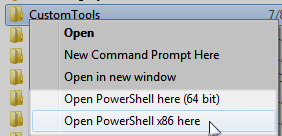

### Open PowerShell here

I recently ran across a couple blog posts on adding an "Open Powershell window here" explorer folder extension similar to what was often done with the dying command prompt. I made a few modifications to include both the x86 version of PowerShell as well as the 64 bit version. I run on 64 bit but some of my cmdlets use dlls such as Oracle data access dlls that currently do not play well in 64 bit mode.

  
  
In Windows Explorer it looks like so when right-clicking a folder:  

  
  

The modified [OpenPowershellHere.reg](/wp-content/uploads/2017/06/OpenPowershellHere.reg_.txt) looks like this:  

Windows Registry Editor Version 5.00  
  
\[HKEY\_CLASSES\_ROOT\\Directory\\shell\\PowerShell x86\]  
@="Open PowerShell x86 here"  
  
\[HKEY\_CLASSES\_ROOT\\Directory\\shell\\PowerShell x86\\Command\]  
@=""C:\\Windows\\syswow64\\WindowsPowerShell\\v1.0\\powershell.exe" -NoExit -Command \[Environment\]::CurrentDirectory=(Set-Location -LiteralPath:'%L' -PassThru).ProviderPath""  
  
\[HKEY\_CLASSES\_ROOT\\Directory\\shell\\PowerShell 64 bit\]  
@="Open PowerShell here (64 bit)"  
  
\[HKEY\_CLASSES\_ROOT\\Directory\\shell\\PowerShell 64 bit\\Command\]  
@=""C:\\Windows\\system32\\WindowsPowerShell\\v1.0\\powershell.exe" -NoExit -Command \[Environment\]::CurrentDirectory=(Set-Location -LiteralPath:'%L' -PassThru).ProviderPath""

  

I tried to add similar options for [PowerShell ISE](http://4sysops.com/archives/windows-powershell-ise-the-better-command-prompt/) but it has different, less command line parameters and since it is more of an IDE as opposed to command line, Open Powershell ISE here isn't as needed.  
  

Tempted to do something similar for running powershell scripts in either x86 or x64 when right-clicking on a powershell script file.

### PowerShell Profile

At first I wasn't sure what people meant by their PowerShell profile and then I discovered $profile in powershell. It returned _%USERPROFILE%\\Documents\\Windows\\PowerShell\\Microsoft.PowerShell\_profile.ps1_ for me which did not exist by default. My initial thought was "sweet, a powershell startup script". That was exactly what I was looking for to automatically add my snap-in for my custom cmdlets and to perform some other customizations.

### Automatically adding snapins on startup

At first I did not like the fact that installing & registering a PowerShell snap-in didn't add it into the current session for immediate use. Then I did not like that manually adding it with [Add-PSSnapin](http://technet.microsoft.com/en-us/library/dd347601.aspx) did not stick across PowerShell sessions. Later I appreciated the flexibility and realized startup speed is one reason to avoid loading snap-ins unless really needed.  
  

For common custom cmdlets I use frequently however, I find it worth the tradeoff to automatically load them. One technique often used is the below of [exporting the console](http://technet.microsoft.com/en-us/library/dd347554.aspx) after adding the snap-in and launching powershell with a command line parameter pointing to the export file:  

export-console "MyConsoleFilename.psc1"  
powershell.exe -PsConsoleFile "MyConsoleFilename.psc1"

  
I never cared for this technique much so I created my powershell profile script and added the below:  

\[powershell\] $is32bit = (\[diagnostics.process\]::GetCurrentProcess().Path -match '\\syswow64\\') if ($is32bit) { add-pssnapin OraclePSSnapIn Write-Host "Added Oracle PS Snapin" } \[/powershell\]

Why the 32bit check? Well my snap-in was installed by the 32 bit version of [installutil](http://msdn.microsoft.com/en-us/library/50614e95(VS.80).aspx) and not the 64bit version. Without the check I'd get an error in the 64 bit PS console saying the snap-in is not installed.  
  

I could use installtutil in the Framework64 directory but my snap-in has dependencies that only work in x86 anyway so it is not compatible in 64bit mode. Note here that I'm not interested in whether the OS is 32 or 64 bit but whether the PowerShell console that is running is. There are many ways to skin a cat and this may not be the cleanest but it works.

### Other Customizations

I borrowed and modified some other common functions and added them to the profile script, including:  
  

Custom Prompt Function from [Iain's World](http://blogs.technet.com/b/iainsimpson/archive/2008/02/20/custom-powershell-prompt.aspx):  

\[powershell\] function prompt { # change length depending on how many characters before wrapping prompt to next line if (((get-location).path).length -gt 3) { write-host -ForegroundColor yellow "$(Get-Location)";"> " } else { "$(Get-Location)\`> " } \[/powershell\]

Pause function from [Windows Powershell blog](http://blogs.msdn.com/b/powershell/archive/2007/02/25/pause.aspx):  

\[powershell\] function Pause ($Message="Press any key to continue...") { Write-Host -NoNewLine $Message $null = $Host.UI.RawUI.ReadKey("NoEcho,IncludeKeyDown") Write-Host "" } \[/powershell\]

I've started to include other commonly used functions as well as it is easier than pathing to a common scripts directory and remembering the filename and syntax of executing a function in another file. Are there drawbacks to loading up the profile powershell script? I'm assuming it may be a bit of a performance hit perhaps as it loads/parses?
