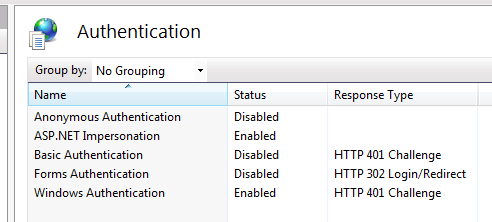

A couple days ago I started converting our Silverlight 4 app's website and IIS-hosted WCF (v4) service to use Windows Authentication. The goal was to secure the service and data, get the user's credentials down to the data tier and database, and provide some auditing and general security without asking for credentials already available for an intranet application.

It has been a couple days of configuration hell with more issues than you can shake a stick at. I had a hard time finding one good resource that had a thorough example that completely worked for me so there was various trial and error and piecing together bits of several resources. I'd really like some beer right now but figured I better do a blog post while this is fresh and working. Tomorrow I may look at the WCF config the wrong way and it may break.

Hopefully the next time I do this it is less painful. Your mileage may vary but maybe it helps someone else as well. I'm no expert at this and don't fully understand some of it yet so there will be changes later I'm sure.

If you are here I'll assume you probably know the basics so I'll jump straight to the web.config as that's where I spent much of my time.

### Web.config - system.serviceModel

Watch yourself, the sharp pointy edges of WCF XML config can cut deep. Markup first, notes after...

``` xml/12,15,16,17,18,35,39,40,41,46,56
<system.serviceModel>
    <extensions>
        <behaviorExtensions>
            <add name="silverlightFaults" type="TeamWorksMaintenance.ServiceDefinition.SilverlightFaultBehavior, TeamWorksMaintenance.ServiceDefinition, Version=1.0.0.0, Culture=neutral, PublicKeyToken=null"/>
            <add name="errorHandler" type="TeamWorksMaintenance.ServiceDefinition.ServiceErrorHandlerElement, TeamWorksMaintenance.ServiceDefinition, Version=1.0.0.0, Culture=neutral, PublicKeyToken=null" />
        </behaviorExtensions>
    </extensions>
    <behaviors>
        <serviceBehaviors>
            <behavior name="">
                <!-- get enabled must be true to regenerate proxy, false for runtime? -->
                <serviceMetadata httpGetEnabled="false" />

                <!-- it still doesn't seem to me we really need 'impersonation', only 'identification' but... -->
                <serviceAuthorization impersonateCallerForAllOperations="true" />
                <serviceCredentials>
                    <windowsAuthentication includeWindowsGroups="true" allowAnonymousLogons="false" />
                </serviceCredentials>
                <serviceDebug includeExceptionDetailInFaults="false" />
                <errorHandler />
            </behavior>
        </serviceBehaviors>
        <endpointBehaviors>
            <behavior name="SilverlightFaultBehavior">
                <silverlightFaults/>
                <!-- already specified elsewhere, this will duplicate and cause headaches
                    <clientCredentials>
                        <windows allowedImpersonationLevel="Impersonation" />
                    </clientCredentials>
                    -->
            </behavior>
        </endpointBehaviors>
    </behaviors>
    <bindings>
        <basicHttpBinding>
            <binding name="AppHttpBinding" maxBufferPoolSize="2147483647" maxBufferSize="2147483647" maxReceivedMessageSize="2147483647">
                <readerQuotas maxArrayLength="2147483647" maxBytesPerRead="2147483647" maxDepth="2147483647" maxNameTableCharCount="2147483647" maxStringContentLength="2147483647" />

                <security mode="TransportCredentialOnly">
                    <transport clientCredentialType="Windows" />
                </security>
            </binding>
        </basicHttpBinding>
    </bindings>
    <services>
        <service name="TeamWorksMaintenance.Service.DataService">
            <endpoint name="AppHttpEndpoint" address="" binding="basicHttpBinding" bindingConfiguration="AppHttpBinding" contract="TeamWorksMaintenance.ServiceDefinition.Interface.IDataService" behaviorConfiguration="SilverlightFaultBehavior" />
            <!--
                MexEndpoint must be commented out for running app, enabled for regeneration of proxy?
                http://stackoverflow.com/questions/1026855/wcf-windows-authentication-security-settings-require-anonymous
                -->
            <!-- <endpoint name="MexEndpoint" address="mex" binding="mexHttpBinding" contract="IMetadataExchange" /> -->
        </service>
    </services>
    <serviceHostingEnvironment aspNetCompatibilityEnabled="true" multipleSiteBindingsEnabled="true" />
</system.serviceModel>
```

- **[serviceMetadata](http://msdn.microsoft.com/en-us/library/ms731317.aspx) httpGetEnabled** - Having this false [caused issues](http://stackoverflow.com/questions/1026855/wcf-windows-authentication-security-settings-require-anonymous)
- **MexEndpoint** - Having this present [caused issues](http://stackoverflow.com/questions/1026855/wcf-windows-authentication-security-settings-require-anonymous)
- **[serviceAuthorization](http://msdn.microsoft.com/en-us/library/ms731306.aspx)** - Had to set impersonation which threw me at first. My service will run as Network Service but this is effectively identification only (see securityMode of TransportCredentialOnly).
- **[basicHttpBinding](http://msdn.microsoft.com/en-us/library/ms731361.aspx)** - I tried customBinding using binary http but had other issues so I went back to basicHttp
- **service name** - Apparently this needed to be the fully qualified name of my service. If I used something like DataService, things seemed to mostly work but not completely and there was no obvious indication of this problem.
- **Updating the service reference** - It appeared each time I needed to re-run svcutil to recreate / update my proxy that I had to go back and temporarily enable service http metadata and uncomment the MexEndpoint, as well as add back Anonymous access in IIS temporarily at one point. I'm not 100% positive on IIS right now and perhaps different build configs, T4, powershell scripts or something else could assist.
- **[SilverlightFaultBehavior](http://weblogs.asp.net/pglavich/archive/2009/07/14/silverlight-3-and-wcf-faults.aspx) and [errorHandler](http://haveyougotwoods.com/archive/2009/06/24/creating-a-global-error-handler-in-wcf.aspx)** - Ignore these unless you are curious

### Thoughts on bindings

- **Basic http w/credential only** is essentially the old asmx web services and doesn't get a lot of love. Everything is sent clear text with basic http + TransportCredentialOnly. For this app and internal environment w/website security and other protection, this is acceptable but it often may not be.

- **Custom binding with binary http** may be worth another try if performance (perhaps security) becomes a concern. Unfortunately I could not get this to work with Windows Authentication on my initial attempts. Among other errors, I believe I ran into a [problem with the ordering in the config](http://www.windowsitpro.com/article/net-framework2/custom-bindings-part-i.aspx) (didn't think order mattered), then an error similar to [this one](http://social.msdn.microsoft.com/forums/en-US/wcf/thread/ea0ff7b6-12c4-487d-a983-c07e06260acf/) "binding is configured with an authentication mode that requires transport level integrity and confidentiality. However the transport cannot provide integrity and confidentiality".

- **Basic http binding + Transport** solves the security issue with the encryption but https and SSL cause enough overhead that to me it's only worth it if it is truly required and you aren't just being overly cautious on your own.

- **IIS 7 and [Windows Activation Services (WAS)](http://msdn.microsoft.com/en-us/library/ms733109.aspx)** allows for net tcp hosting with SL4 which performs better and is more secure but it looks like more configuration hassles and server requirements. Still worth a look later.

- **wsHttpBinding** is [not supported with SL4](http://stackoverflow.com/questions/1854126/wshttpbinding-support-in-silverlight-4)

### Web.config - system.web\*

Securing the website itself was the easy part with the standard authentication mode of Windows, deny Anonymous, allow group \_\_\_\_.

``` xml/5,7,14,15,16
<system.web>
    <compilation debug="true" targetFramework="4.0" />
    <roleManager enabled="false" />

    <authentication mode="Windows"/>

    <identity impersonate="true" />

    <profile>
        <properties>
            <add name="FriendlyName" />
        </properties>
    </profile>
    <authorization>
        <deny users="?" />
        <allow roles="ApplicationDevelopers" />
    </authorization>

</system.web>
```

### ServiceReferences.ClientConfig

The main thing I noted here was that updating the service reference tended to add an additional basicHttpBinding and endpoint into the file. So I either had to keep deleting that inserted content afterwards or use a specific endpoint name in my client.


Also noted that Silverlight doesn't support near the client configuration of Windows apps so I couldn't set message level transport or other details as in the past.

``` xml/6
<configuration>
    <system.serviceModel>
        <bindings>
            <basicHttpBinding>
                <binding name="AppHttpEndpoint" maxBufferSize="2147483647" maxReceivedMessageSize="2147483647">
                    <security mode="TransportCredentialOnly" />
                </binding>
            </basicHttpBinding>
        </bindings>
        <client>
            <endpoint address="http://localhost/TeamWorksMaintenance/TwMaintService.svc" binding="basicHttpBinding" bindingConfiguration="AppHttpEndpoint" contract="TwMaintSvc.DataService" name="AppHttpEndpoint" />
        </client>
    </system.serviceModel>
</configuration>
```

### Thoughts on the service client

I was tempted to use [ChannelFactory](http://msdn.microsoft.com/en-us/library/ms734681.aspx) originally as it always seemed cleaner and more lean than using [SvcUtil](http://msdn.microsoft.com/en-us/library/aa347733.aspx), even though the generated proxy from SvcUtil creates a lot on your behalf and is the "easy" option. That would have solved some of the issues with updating the service proxy. However with needing each of the service operations to be async for silverlight, the manual approach I felt was too much work here. I also considered [RIA services](http://www.silverlight.net/getstarted/riaservices/) again but last time felt as if it "boxed us in". Eventually its limitations showed through and seemed as if writing the service upfront would have been less work to begin with in the end. That said, it was a prior version of RIA services and things are better now I'm sure.

### IIS / Cassini / Service Hosting

**Host Decision**
Typically I'm working with Windows apps and have a Windows Service that hosts the WCF service. With working on a web app, IIS hosting made more sense (using 7.5 on my Win 7 x64 box). In hindsight I'm not sure the maintenance issues, HTTP restrictions etc. are worth the benefits of not having to create a separate host project, and having a familiar admin interface to manage it.

For the sake of completeness the .svc file that hosts the WCF service in IIS looks like the below and more information is available on [MSDN](http://msdn.microsoft.com/en-us/library/ms733766.aspx).

``` xml
<%@ ServiceHost Language="C#" Debug="true" Service="TeamWorksMaintenance.Service.DataService" %>
```

**Web Server for dev use**
I found out that the Visual Studio Development Web Server (Cassini) didn't appear to support Windows authentication. Somewhere I saw a workaround but it was more for code-based creation of the service proxy. I tend to dislike Cassini anyway because it takes a while to spin up, is slower at serving content, and has [differences over IIS](http://stackoverflow.com/questions/2491608/differences-in-behaviour-between-iis-and-the-asp-net-web-development-server) in terms of caching, paths, security and more. The other problem with it is by default it periodically switches port numbers. Even if you set to fixed, recreating the service reference sometimes resulted in mismatched ports which caused "cross domain" exceptions. I'd rather deal with the IIS config headache upfront than be surprised with several errors when the web app gets pushed to a real web server at a later date.

### IIS - App Pool

- **Enable 32-Bit** - My dependencies & 64 bit box required; more on this later

- **Pipeline Mode** - Required classic for my use which I didn't expect

- **Identity** - Using ApplicationPoolIdentity caused issues but Network Service was fine


Of course you need to associate the Virtual Directory (application) with the App Pool.


### IIS - ISAPI

If you have a new machine, you might get a 404.2 not found at some point with an error about ISAPI and CGI restrictions. I resolved by selecting the machine level node in IIS Manager, then ISAPI and CGI Restrictions and set as below:


### IIS - Application Level Authentication & Authorization

These settings get stored in web.config so editing in IIS Admin is just another option. I tend to start out in IIS Admin initially then stick to the config. I don't like tools messing with my config once I've edited but it does come in handy to verify the config. The sync between the two isn't as automatic as I'd like. I'd occasionally get a "modified outside the environment" message but if the config was already open in Visual Studio, changing it in IIS wasn't refreshing it.

**<ins>Authentication</ins>**

Denied Anonymous authentication, allowed Windows. It seemed I had to temporarily allow Anonymous at times.



**<ins>Authorization</ins>**

Denied anonymous users, allowed specific AD group (ApplicationDevelopers for now) 

### Service Code

AspNetCompatibilityRequirements should be set to Allowed on the service class and each operation method is decorated with an [OperationBehavior requiring Impersonation](http://msdn.microsoft.com/en-us/library/system.servicemodel.operationbehaviorattribute.impersonation.aspx). I also added a [PrincipalPermission attribute](http://msdn.microsoft.com/en-us/library/system.security.permissions.principalpermissionattribute.aspx) for each service operation, though it is not necessarily required in my case since that's secured via IIS already. Having it there might add some additional overhead but should this be switched later to be hosted elsewhere the security is already enforced.

[OperationContext.Current.ServiceSecurityContext](http://msdn.microsoft.com/en-us/library/system.servicemodel.servicesecuritycontext.aspx).WindowsIdentity.Name is checked to ensure security is setup. I don't do anything with that here as that will be obtained via Thread.CurrentPrincipal later. I considered returning session start datetime and user name to client in StartSession() but have no need for that currently and that could be obtained outside WCF.

``` csharp/14,19,20,22,23
using System;
using System.Collections.Generic;
using System.Diagnostics;
using System.ServiceModel;
using System.ServiceModel.Activation;
using TeamWorksMaintenance.Core.Diagnostics;
using TeamWorksMaintenance.Data;
using TeamWorksMaintenance.Model;
using TeamWorksMaintenance.ServiceDefinition;
using TeamWorksMaintenance.ServiceDefinition.Interface;

namespace TeamWorksMaintenance.Service
{
    [AspNetCompatibilityRequirements(RequirementsMode = AspNetCompatibilityRequirementsMode.Allowed)]
    public partial class DataService : IDataService
    {
        /* other code omitted... */

        [OperationBehavior(Impersonation = ImpersonationOption.Required)]
        [PrincipalPermission(SecurityAction.Demand, Role = ServiceConstants.CORE_USER_GROUP)]
        public void StartSession()
        {
            var context = OperationContext.Current.ServiceSecurityContext;
            var winIdentityName = (null == context) ? null : context.WindowsIdentity.Name;

            if (string.IsNullOrEmpty(winIdentityName))
                throw new NullReferenceException("OperationContext.Current.ServiceSecurityContext.WindowsIdentity.Name must be set; "
            +       "verify WCF & security settings in web.config, svc client config, IIS settings. Good luck, you'll need it!");

            Logger.LogInfo2("DataService.StartSession", "User {0} started session", winIdentityName);
        }
    }
}
```

### Using the Windows Identity at the data tier

At this point the Windows authentication has been verified at the service tier but it calls a data assembly to perform the database operations and I needed to get the user info all the way to the database.

We mostly use a single database account per application, at least for the apps that have many users such as this one. Each user-modifiable table has triggers for insert and update that take care of setting Created By/On and Edited By/On user audit info. More on that in a moment.

This application uses an Oracle database and I do not believe [Oracle's official Entity Framework (PDF)](http://www.oracle.com/technetwork/topics/dotnet/whatsnew/oracle-entity-framework-sod-130214.pdf) provider is complete just yet. Even if it were, we are in bed with DevArt for the time being to get EF functionality with Oracle.

[DevArt](http://www.devart.com/dotconnect/oracle/) was kind enough to [implement a ClientId](http://www.devart.com/forums/viewtopic.php?p=53676&sid=5cbdafcaf047bf368347d307a2836dfa) on their wrapped OracleConnection for me. This matched functionality already present in Oracle.DataAccess and was nicer than me invoking the [DBMS\_SESSION.SET\_IDENTIFIER](http://download.oracle.com/docs/cd/B19306_01/appdev.102/b14258/d_sessio.htm#i996935) procedure manually myself. With ClientId set at the connection level it can be later retrieved at the database.

It is very important for connection pooling to be turned off with this technique, otherwise Billy Joe's connection with his client id might get reused by Betty Sue's connection and then it looks like Billy is doing what Betty did.

Inside the partial class of the entity model, this code listens for a change in connection state to Open, gets the underlying connection and sets ClientId to Thread.CurrentPrincipal.Identity.Name (it parses out the domain name). It's ugly at present because setting the ClientId appears to disconnect the connection. There is a Connecting state but it never appears to fire. This step may need to be done elsewhere somehow or perhaps going back to calling the SET\_IDENTIFIER proc manually is best.

``` csharp/16,53,55,69,76
using System;
using System.Data;
using System.Data.EntityClient;
using System.Diagnostics;
using System.Threading;
using Devart.Data.Oracle;
using TeamWorksMaintenance.Core.Diagnostics;

namespace TeamWorksMaintenance.Data
{
    partial class TeamWorksDataEntities
    {
        partial void OnContextCreated()
        {
            //if (null == this.Connection) return;
            this.Connection.StateChange += Connection_StateChange;
        }

        private EntityConnection EntityConnection
        {
            [DebuggerStepThrough]
            get { return this.Connection as EntityConnection; }
        }

        private OracleConnection OracleConnection
        {
            [DebuggerStepThrough]
            get { return this.EntityConnection.StoreConnection as OracleConnection; }
        }

        private void Connection_StateChange(object sender, StateChangeEventArgs e)
        {
            Logger.BeginFunction("Connection_StateChange");
            Logger.LogDebug("Connection State Changed. Current: {0}, Original: {1}", e.CurrentState, e.OriginalState);
            Logger.LogDebug("Connection string: {0}", this.Connection.ConnectionString);

            //if (e.OriginalState != ConnectionState.Closed)
            if (e.CurrentState != ConnectionState.Open)
            {
                Logger.EndFunction();
                return;
            }

            var oracleConn = this.OracleConnection;
            if (null == oracleConn)
            {
                Logger.EndFunction();
                return;
            }

            if (string.IsNullOrEmpty(oracleConn.ClientId))
            {
                var clientId = GetClientId();
                var stateBefore = oracleConn.State;
                oracleConn.ClientId = clientId;

                // so setting the client id disconnects us. Nice. either must do at different time or re-establish connection.
                if (stateBefore != oracleConn.State)
                    oracleConn.Open();

                Logger.LogDebug("Set client id on connection to {0}", clientId);
            }
        }

        private static string GetClientId()
        {
            // can't really use DI here anymore to get principal but this is fine using interface
            //var prin = Thread.CurrentPrincipal as IAppPrincipal;
            var prin = Thread.CurrentPrincipal;

            if (null == prin)
            {
                throw new NullReferenceException("Thread.CurrentPrincipal is null. Say a prayer & verify Security settings in web.config, IIS..");
            }

            var username = prin.Identity.Name;
            var pos = prin.Identity.Name.LastIndexOf(@"\");

            if (pos != -1)
                username = username.Substring(pos + 1);

            // for the moment we are going to let this slide but only shortly
            if (string.IsNullOrEmpty(username))
                throw new ApplicationException("Failed to resolve clientId which is required for auditing.");

            return username;
        }
    }
}
```

### Using ClientId at database level for auditing

The database side looks something like below. Note there is a similar insert trigger and procedure. The main point of interest is `SYS_CONTEXT ('USERENV', 'CLIENT_IDENTIFIER')`.

``` sql/22,36
CREATE OR REPLACE TRIGGER "APP".my_table_upd_trg
 before update on my_table for each row
declare
begin
 table_update(:old.created_by, :old.created_on, :new.created_by, :new.created_on, :new.edited_by, :new.edited_on);
end;
/


CREATE OR REPLACE PROCEDURE APP.table_update (
   old_created_by   IN       VARCHAR2,
   old_created_on   IN       DATE,
   new_created_by   OUT      VARCHAR2,
   new_created_on   OUT      DATE,
   new_edited_by    IN OUT   VARCHAR2,
   new_edited_on    OUT      DATE
)
AS
BEGIN
   new_created_by := old_created_by;
   new_created_on := old_created_on;
   new_edited_by := APP.client_user;
   new_edited_on := SYSDATE;
END table_update;
/


CREATE OR REPLACE FUNCTION APP.client_user
   RETURN VARCHAR2
IS
BEGIN
   RETURN CASE USER
             WHEN 'MY_APP_DB_USER'
             THEN
                SYS_CONTEXT ('USERENV', 'CLIENT_IDENTIFIER')
             ELSE
                USER
          END;
EXCEPTION
   WHEN NO_DATA_FOUND
   THEN
      raise_application_error (
         -20000,
         'Houston we have a problem.'
      );
      RETURN NULL;
END client_user;
/
```

### Dealing with x64 / x86 issues

The first issue with DevArt (Oracle Dll's in general) on my Win7 x64 box was that targeting Any CPU causes errors in finding dependent dlls. The initial exception was pretty generic (cannot load assembly X or one of its dependencies). Thankfully my use of [OracleMonitor](http://www.devart.com/dotconnect/oracle/docs/DbMonitor.html) in combination with Log4Net brought light to an error locating oci.dll. Switching the initial assembly to target x86 then resulted in a different mixed image exception. In the end I switched all server side assemblies to be x86 and left all client assemblies Any CPU ([targeting x86 for Silverlight on x64 doesn't fly](http://forums.silverlight.net/forums/p/142410/317746.aspx)).

That still wasn't enough though as by default under the IIS app pool's Advanced Settings, Enable 32 bit applications is False. Flipping to True presented the next problem...

When the server CPU targets were switched to x86, the latest web dlls were now going to x86 bin debug folder and no longer the website's root bin. This meant I was picking up older assemblies without realizing it, making me think changes that should have worked didn't function as I'd expect. Switching targets or cleaning the solution doesn't get rid of the old copy so I manually deleted and change web project properties to place in the root bin folder.

Finally there was also a permission change for the Oracle client folder (i.e. C:\\app\\**\[username\]**\\product\\11.1.0\\client\_2) so the IIS account could read. However at that point I do not believe I was using Network Service on my IIS app pool so in the end I do not believe this was necessary.

### Other issues, troubleshooting, & resources

- **Not Found Errors** - When receiving this exception I found the easiest way to troubleshoot was to hit the service directly in the web browser (i.e. http://localhost/MyApp/MyService.svc). If it doesn't work there then usually there is some IIS security issue etc. I then start triple-checking all the WCF security related attributes as needed. [Fiddler](http://www.fiddler2.com/fiddler2/) is another helpful tool here along the Windows Application Event Log.

- **WCF Security Guide** - Naturally I found this after my troubles but I should have done more reading up-front. [http://wcfsecurityguide.codeplex.com/](http://wcfsecurityguide.codeplex.com/)

- **Logging** - Custom logging can be a big help especially in places such as Global.asax Application\_Error, a [WCF central error handler](http://haveyougotwoods.com/archive/2009/06/24/creating-a-global-error-handler-in-wcf.aspx), key client and server end points, and in [custom message inspectors](http://weblogs.asp.net/paolopia/archive/2007/08/23/writing-a-wcf-message-inspector.aspx). I use log [log4net](http://logging.apache.org/log4net/index.html) and yes it works fine with .net 4.x despite no updates in some time. Configuring [WCF Service Tracing](http://msdn.microsoft.com/en-us/library/ms732023.aspx) can be very valuable as well as IIS logs and previously mentioned Fiddler, Event Log, etc.

### Conclusion

Some of the defaults and other config changes in WCF 4 are a nice step but I find that for a complete real-world app, the configuration can still be somewhat verbose and painful. The flexibility of WCF is both its strength and weakness to me; there are so many ways to do things that there are an infinite number of ways you can screw it up. It almost makes me miss remoting in ways.

My last WCF service (and only before this one) was with a Windows app and maintenance generally seemed so much easier with the hosting in a custom windows service. IIS hosting makes sense with Silverlight but there are certainly considerable tradeoffs both ways. With IIS hosting and using SvcUtil, it almost makes me want to write my entire data service up-front and ignore the client until then end, hoping nothing much has to change on the backend. Granted I'm still new at WCF and my web skills are rusty. Hopefully in time I figure out the easiest solution for SL + WCF + Windows Authentication.

Subscribe to this feed at: [http://feeds.feedburner.com/thnk2wn](http://feeds.feedburner.com/thnk2wn)
