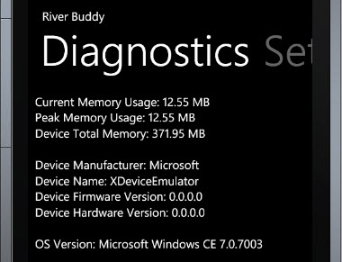

In preparing an error handling solution for my Windows Phone 7 application, I wanted to collect some basic diagnostic data including basic memory use, phone, and app details. Also for WP7 Marketplace certification, an app cannot consume more than 90 MB of memory, unless the phone has more than 256 MB of memory. See [section 5.25 Memory Consumption](http://go.microsoft.com/?linkid=9730558) (PDF) in the certification requirements.  
  

With this in mind I created a basic diagnostics class, view, and "memory counter".  
  

The quick and dirty Diagnostics view looks like the below. This view is accessible from my app's Settings view; for the moment both in Debug and Release modes.  
  
  

The simple "memory counter" gets automatically added to the top of each view in my app if the app is running in Debug mode  
  
  
  

### Diagnostics Info Class

First a diagnostics class in a phone framework WP7 class library:  
\[csharp\] using System; using System.Text; using System.Windows.Threading; using Microsoft.Phone.Info;

namespace Phone.Framework.Diagnostics { public class PhoneProperties : NotifyPropertyChangedBase, IDisposable { private DispatcherTimer \_timer;

private bool ShouldMonitor { get; set; }

public PhoneProperties(bool monitor) { this.ShouldMonitor = monitor;

if (ShouldMonitor) SetupTimer();

GenerateReport(); }

private void SetupTimer() { \_timer = new DispatcherTimer() { Interval = TimeSpan.FromSeconds(10) }; \_timer.Tick += (s, e) => GenerateReport(); \_timer.Start(); }

public string GetReport() { var sb = new StringBuilder(); sb.AppendFormat("Current Memory Usage: {0:n} MB{1}", this.MemoryUsageInMB, Environment.NewLine); sb.AppendFormat("Peak Memory Usage: {0:n} MB{1}", this.PeakUsageInMB, Environment.NewLine); sb.AppendFormat("Device Total Memory: {0:n} MB{1}", this.DeviceTotalMemory, Environment.NewLine); sb.AppendLine(); sb.AppendFormat("Device Manufacturer: {0}{1}", this.DeviceManufacturer, Environment.NewLine); sb.AppendFormat("Device Name: {0}{1}", this.DeviceName, Environment.NewLine); sb.AppendFormat("Device Firmware Version: {0}{1}", this.DeviceFirmwareVersion, Environment.NewLine); sb.AppendFormat("Device Hardware Version: {0}{1}", this.DeviceHardwareVersion, Environment.NewLine); sb.AppendLine(); sb.AppendFormat("OS Version: {0}{1}", this.OSVersion, Environment.NewLine); return sb.ToString(); }

private void GenerateReport() { this.ReportText = GetReport(); }

private string \_reportText; public string ReportText { get { return \_reportText; } set { if (\_reportText != value) { \_reportText = value; OnPropertyChanged("ReportText"); } } }

public double MemoryUsageInMB { get { return GetMemoryUsageInMb(); } }

public double PeakUsageInMB { get { return GetPeakMemoryUsageInMb(); } }

public string DeviceManufacturer { get { return DeviceExtendedProperties.GetValue("DeviceManufacturer").ToString(); } }

public string DeviceName { get { return DeviceExtendedProperties.GetValue("DeviceName").ToString(); } }

public string DeviceFirmwareVersion { get { return DeviceExtendedProperties.GetValue("DeviceFirmwareVersion").ToString(); } }

public string DeviceHardwareVersion { get { return DeviceExtendedProperties.GetValue("DeviceHardwareVersion").ToString(); } }

public double DeviceTotalMemory { get { return GetDeviceTotalMemoryInMb(); } }

public string OSVersion { get { return Environment.OSVersion.ToString(); } }

#region IDisposable Members

public void Dispose() { if (null != \_timer) { if (\_timer.IsEnabled) \_timer.Stop();

\_timer = null; } }

#endregion

public static double GetMemoryUsageInMb() { try { var memoryString = DeviceExtendedProperties.GetValue("ApplicationCurrentMemoryUsage"); var memoryUsageInMb = Convert.ToInt32(memoryString) / (1024 \* 1024.0); return memoryUsageInMb; } catch { } return 0; }

public static double GetPeakMemoryUsageInMb() { try { var memoryString = DeviceExtendedProperties.GetValue("ApplicationPeakMemoryUsage"); var memoryUsageInMb = Convert.ToInt32(memoryString) / (1024 \* 1024.0); return memoryUsageInMb; } catch { } return 0; }

public static double GetDeviceTotalMemoryInMb() { try { var memoryString = DeviceExtendedProperties.GetValue("DeviceTotalMemory"); var memoryUsageInMb = Convert.ToInt32(memoryString) / (1024 \* 1024.0); return memoryUsageInMb; } catch { } return 0; } } } \[/csharp\]

Note this is not all of the phone properties but most of them. The complete list is available on [MSDN](http://msdn.microsoft.com/en-us/library/ff941122(v=VS.92).aspx). I also started another class to collect application diagnostics; I tried to collect the size of the app and it's data files but found this is [not currently supported](http://social.msdn.microsoft.com/Forums/en-US/windowsphone7series/thread/fda1f5df-36e9-4820-9e94-e4c937871e91).

### Using the diagnostics class

From a diagnostics view the class is created with the monitor ctor parameter set to true so the memory data periodically refreshes. When used from an error report window (more on that in another post), that parameter will be false for a snapshot of the data to include with the error details.  
  

From a view perspective there is nothing worth showing; I simply bind to the ReportText property of the class within a Pivot control.

### The memory counter

Shawn Wildermuth has an [AgiliTrain post](http://wildermuth.com/2010/09/19/Building_AgiliTrain_s_Workshop_Application_for_WP7) where he mentions adding a memory usage label for debugging (I recommend following his blog & Twitter stream for great WP7 and Silverlight info). What I wanted was to be able automatically add this sort of memory counter to all pages with only having to do it in one location.  
  

I already had a custom PhoneApplicationPageBase class that all my views inherited from. There is no XAML for this page; it mostly has convenience methods and some automatic registering and unregistering of different [MVVM Light](http://www.galasoft.ch/mvvm/getstarted/) messages (such as dialog, navigation, and error messages). I simply added methods to add and remove a diagnostic TextBlock to/from the visual tree when the page is navigated to/from. The text gets set using memory data retrieved from the PhoneProperties class previously created. A DispatchTimer is used to keep the memory data current. Debug checks are used to strip out the code in these methods when we are running in release, as will be the case for the marketplace version. Debugger.IsAttached could also be used and/or app settings but I prefer not even including the code.  
  

The code to add the TextBlock casts the page's content to a Panel. If you follow the inheritance tree for controls such as StackPanel, Grid, etc. you can see they inherit from Panel. There may be cases where the root control cannot be resolved to a Panel but I could not think of one I'd have and if this happens the counter just won't be added. If the code resolves a Panel, it inserts the memory TextBlock as the first child of the panel.  

\[csharp\] using System; using System.Windows; using System.Windows.Controls; using System.Windows.Navigation; using System.Windows.Threading; using GalaSoft.MvvmLight.Messaging; using Microsoft.Phone.Controls; using Phone.Framework.Diagnostics; using RiverBuddy.Messaging;

namespace RiverBuddy.Views { public class PhoneApplicationPageBase : PhoneApplicationPage {

#if DEBUG private DispatcherTimer \_timer; #endif

protected override void OnNavigatedTo(NavigationEventArgs e) { base.OnNavigatedTo(e);

/\* other code removed for brevity \*/ AddResourceMonitor(); }

protected override void OnNavigatedFrom(NavigationEventArgs e) { base.OnNavigatedFrom(e);

/\* other code removed for brevity \*/ RemoveResourceMonitor(); }

private void AddResourceMonitor() { #if DEBUG var panel = this.Content as Panel; if (null == panel) return;

var textBlock = new TextBlock { Name = "uxDebugResourceTextBlock", Text = "", Margin = new Thickness(14, 0, 0, 0), FontWeight = FontWeights.SemiBold, FontStyle = FontStyles.Italic, Style = App.Current.Resources\["PhoneTextSmallStyle"\] as Style }; // immediately set the diagnostic label text textBlock.Text = string.Format("Memory Usage: {0:n} MB ({1:n} peak) {2}", PhoneProperties.GetMemoryUsageInMb(), PhoneProperties.GetPeakMemoryUsageInMb(), DateTime.Now.ToString("hh:mm:ss tt")); panel.Children.Insert(0,textBlock);

\_timer = new DispatcherTimer() { Interval = TimeSpan.FromSeconds(10) }; \_timer.Tick += (s, e) => { textBlock.Text = string.Format("Memory Usage: {0:n} MB ({1:n} peak) {2}", PhoneProperties.GetMemoryUsageInMb(), PhoneProperties.GetPeakMemoryUsageInMb(), DateTime.Now.ToString("hh:mm:ss tt")); }; \_timer.Start(); #endif }

private void RemoveResourceMonitor() { #if DEBUG if (null != \_timer) \_timer.Stop();

var control = this.FindName("uxDebugResourceTextBlock") as TextBlock; if (null == control) return; var panel = this.Content as Panel; if (null == panel) return; panel.Children.Remove(control); #endif } /\* other code removed for brevity \*/ } } \[/csharp\]

### Final Thoughts

For the memory counter I considered a custom control but found that overkill for simple debug use. I also considered refactoring the memory counter code into its own adapter class but then you have to pass in references to the page and it's protected content etc. and I didn't find that worth it either. In another post I'll build on the diagnostics info here and show its use in a global error window dialog and error reporting submission feature.  
  

Subscribe to this feed at: [http://feeds.feedburner.com/thnk2wn](http://feeds.feedburner.com/thnk2wn)
