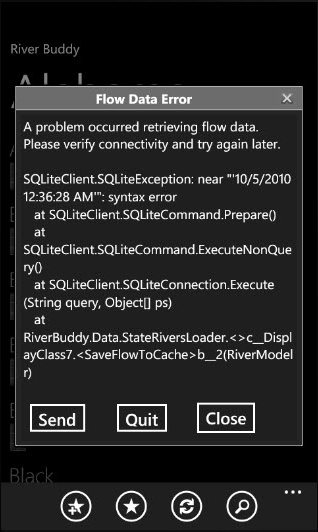
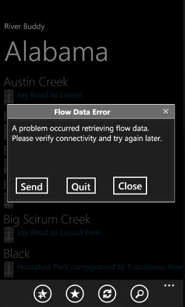

I decided to create a a basic error handling infrastructure with an Error Window for my Windows Phone 7 application with the following in mind:

- Informing user of a problem
- Displaying a user-friendly error message in Release mode
- Displaying a developer-friendly full error message in Debug mode
- Offering a more robust window than MessageBox API provides
- Supporting end users of my marketplace app
- Collecting error & diagnostic data and sending back that data
- Handling both known and unknown exceptions
- Ability to quit the application from the error window

Below is an example of the Error Window in Debug and Release modes. There is theme support for the light theme as well.  

Debug Mode

Release Mode

### Handling Known Errors

Much of the time I'm dealing with known errors. Either I know of specific exceptions that might occur, or I at least know the potentially fragile areas. Usually these areas revolve around network operations, data processing, strange user input, etc. If the error is very specific I may just show a MessageBox and discard the exception. Otherwise I generally want to show the user a friendly, more generic version of the problem but allow them to send the raw technical data if he/she so chooses.

### Handling the error at its source

In this example I'm in a data access class which has called off to another class to perform some network operation and process the returned data. There could be a network error or an error processing the data returned. I'm simply catching any exception and raising a completed event either way, with or without an exception. Note here that CompletedEventArgs is a custom class that simply inherits from EventArgs and has an Error property. Also OnFlowDataRetrieved simply raises a FlowDataRetrieved event.  
\[csharp language="highlight=15""\] private void AfterSomeNetworkOperation(object sender, CompletedEventArgs e) { if (null != e.Error) { OnFlowDataRetrieved(new CompletedEventArgs(e.Error)); return; }

try { // do some post-processing of the data returned from the service } catch (Exception ex) { OnFlowDataRetrieved(new CompletedEventArgs(ex)); return; }

OnFlowDataRetrieved(new CompletedEventArgs()); } \[/csharp\]

### Handling the error at the ViewModel

Inside my view model the data access class is created, its completed event is wired and the call is made to load its data. In the completed event it checks for an error on the event args and calls a SendErrorDialogMessage method that exists in the base view model this class inherits from (more on that next).  

\[csharp highlight="18, 20, 21" language=";"\] public void LoadRiversForState(string stateAbb) { if (string.IsNullOrEmpty(stateAbb)) throw new ArgumentNullException("stateAbb", @"stateAbb is required");

this.IsBusy = true; this.StateAbb = stateAbb; var loader = new StateRiversLoader(); loader.FlowDataRetrieved += FlowDataRetrieved; loader.Load(stateAbb); this.Rivers = loader.Rivers.ToObservableCollection(); }

private void FlowDataRetrieved(object sender, CompletedEventArgs e) { this.IsBusy = false; if (null != e.Error) { SendErrorDialogMessage(e.Error, "A problem occurred retrieving flow data. Please verify connectivity and try again later.", "Flow Data Error"); return; }

var loader = (StateRiversLoader) sender; // reassign data reference to fully populated source this.Rivers = loader.Rivers.ToObservableCollection(); this.FlowAsOfText = string.Format("Flow as of {0:MM/dd hh:mm tt}", loader.AsOfDate.Value); } \[/csharp\]

### The ViewModelBase Handling

The base view model inherits from [MVVM Light](http://www.galasoft.ch/mvvm/getstarted/)'s ViewModelBase and uses its messaging features in the SendErrorDialogMessage to send a custom error message. This keeps the layers loosely coupled and helps support testing.  

\[csharp highlight="22,23"\] using System; using System.Collections.Generic; using System.Text; using GalaSoft.MvvmLight; using GalaSoft.MvvmLight.Messaging; using System.Linq; using RiverBuddy.Messaging;

namespace RiverBuddy.ViewModels { public class AppViewModelBase : ViewModelBase { /\* other code removed for brevity \*/ protected void SendErrorDialogMessage(Exception error, string friendlyError) { SendErrorDialogMessage(error, friendlyError, string.Empty); }

protected void SendErrorDialogMessage(Exception error, string friendlyError, string title) { var message = new ErrorMessage {Error = error, FriendlyError = friendlyError, Title = title}; Messenger.Default.Send(message); }

private bool \_isBusy;

public bool IsBusy { get { return \_isBusy; } set { if (\_isBusy != value) { \_isBusy = value; RaisePropertyChanged("IsBusy"); } } } } } \[/csharp\]

### Custom Message

The error message is a simple class inheriting from MVVM Light's MessageBase.  

\[csharp\] using System; using GalaSoft.MvvmLight.Messaging;

namespace RiverBuddy.Messaging { public class ErrorMessage : MessageBase { public Exception Error { get; set; }

public string FriendlyError { get; set; }

public string Title { get; set; } } } \[/csharp\]

### The view / page level

Each view in the application inherits from a custom root (code-only) PhoneApplicationPageBase.Here the code is added that registers for the message so MVVM Light will listen for the message, as well as code to unregister the message (all messages for the page actually). The registration defines the HandleErrorMessage function as the callback and there the error window is created and shown.  

\[csharp\] using System; using System.Windows; using System.Windows.Controls; using System.Windows.Navigation; using GalaSoft.MvvmLight.Messaging; using Microsoft.Phone.Controls; using RiverBuddy.Messaging;

namespace RiverBuddy.Views { public class PhoneApplicationPageBase : PhoneApplicationPage { protected override void OnNavigatedTo(NavigationEventArgs e) { base.OnNavigatedTo(e); RegisterErrorMessage(); /\* other code removed \*/ }

protected override void OnNavigatedFrom(NavigationEventArgs e) { base.OnNavigatedFrom(e); UnregisterAll(); /\* other code removed \*/ }

private void RegisterErrorMessage() { Messenger.Default.Register<ErrorMessage>(this, HandleErrorMessage); }

private void HandleErrorMessage(ErrorMessage errorMessage) { var errorWin = new ErrorWindow(errorMessage.Error, errorMessage.FriendlyError);

if (!string.IsNullOrEmpty(errorMessage.Title)) errorWin.Title = errorMessage.Title;

errorWin.Show(); }

protected void UnregisterAll() { Messenger.Default.Unregister(this); } /\* other code removed \*/ } } \[/csharp\]

### Error window as a "popup"

I started out navigating to an error view but that has problems with navigation (back button etc.) and just feels goofy. It made more sense to show a "modal dialog" with error details and allow the user to dismiss it and be back to where he/she left off. Unfortunately I found that ChildWindow was not available "out of the box" for WP7 but thankfully [Shawn Wildermuth came to the rescue](http://wildermuth.com/2010/08/17/Using_ChildWindow_in_Windows_Phone_7_Projects) with getting the Silverlight 3 one to work / look good on WP7. I won't go into that here as his post explains it well.  
  

I will say there is some debate by some on its use. Below are the concerns I've seen and my thoughts on each.  

- **It's not native** - Yes there is no item template for it in WP7 V1. However it was made to feel and look native and Microsoft won't reject the app because it uses it.
- **It requires notification permission** - Somewhere there is certification guideline on asking the user if the app can display notifications. All signs I've seen point to this not being considered a notification by any means. It's just a floating, "modal" view that works better than MessageBox.
- **Orientation rotation** - I noticed rotating the phone did not rotate the child window. Makes sense in that this is not a phone application page or phone control. However (a) users generally won't be rotating the phone after the error pops up and (b) there are ways to code that manually. See [here](http://social.msdn.microsoft.com/Forums/en-US/windowsphone7series/thread/e8793a10-55f0-46a2-be1a-ef0e9d414280) and [here](http://social.msdn.microsoft.com/Forums/en-US/windowsphone7series/thread/93a30f5b-3ed2-45e0-bac8-9f4fc42c85af) on the [WP7 Forums](http://social.msdn.microsoft.com/Forums/en-US/windowsphone7series/threads) for more.

### The error window xaml

\[xml\] <tk:ChildWindow x:Class="RiverBuddy.Views.ErrorWindow" xmlns="http://schemas.microsoft.com/winfx/2006/xaml/presentation" xmlns:x="http://schemas.microsoft.com/winfx/2006/xaml" xmlns:d="http://schemas.microsoft.com/expression/blend/2008" xmlns:mc="http://schemas.openxmlformats.org/markup-compatibility/2006" xmlns:tk="clr-namespace:System.Windows.Controls;assembly=System.Windows.Controls" mc:Ignorable="d" Title="Error" FontFamily="{StaticResource PhoneFontFamilyNormal}" FontSize="{StaticResource PhoneFontSizeNormal}" Foreground="{StaticResource PhoneForegroundBrush}" Width="440" OverlayBrush="#7F000000" BorderBrush="Black" BorderThickness="2" Template="{StaticResource OurChildWindow}">

<Grid x:Name="LayoutRoot" Background="{StaticResource PhoneChromeBrush}"> <Grid.RowDefinitions> <RowDefinition Height="\*"/> <RowDefinition Height="70"/> </Grid.RowDefinitions> <TextBlock x:Name="uxErrorTextBlock" Grid.Row="0" Margin="4,3,4,22" ScrollViewer.VerticalScrollBarVisibility="Auto" Text="A user friendly error message will go here. In Debug mode we'll show the Exception here as well." TextWrapping="Wrap" /> <StackPanel Grid.Row="1" Orientation="Horizontal"> <Button Content="Send" x:Name="uxSendButton" VerticalAlignment="Bottom" d:LayoutOverrides="Width" HorizontalAlignment="Right" Margin="2,2,22,2"/>

<Button Content="Quit" x:Name="uxQuitButton" VerticalAlignment="Bottom" d:LayoutOverrides="Width" HorizontalAlignment="Right" Margin="2,2,22,2"/>

<Button Content="Close" x:Name="uxCloseButton" VerticalAlignment="Bottom" d:LayoutOverrides="Width" HorizontalAlignment="Right" /> </StackPanel>

</Grid> </tk:ChildWindow> \[/xml\]

### Error window code behind

"Gasp! You are not using {Binding} or MVVM here Geoff? Code-behind should not be allowed!" Hopefully everyone realizes there is still a place for code-behind in views at times. See the notes after the code.  

\[csharp\] using System; using System.Linq; using System.Text; using Microsoft.Phone.Tasks; using Phone.Framework.Diagnostics; using RiverBuddy.Config;

namespace RiverBuddy.Views { public partial class ErrorWindow //: PhoneApplicationPage { public ErrorWindow() { InitializeComponent();

uxCloseButton.Click += (s, e) => { this.DialogResult = true; this.Close(); };

uxSendButton.Click += (s, e) => { var emailTask = new EmailComposeTask { Body = BuildErrorReportBody(), Subject = "River Buddy Error", To = AppSettings.FeedbackEmailAddress }; emailTask.Show(); }; uxQuitButton.Click += (s, e) => App.Quit(); }

public ErrorWindow(Exception error, string friendlyError) : this() { this.Error = error; this.FriendlyError = friendlyError;

ProcessError(); }

//public static Exception Exception;

//public static string FriendlyError;

public Exception Error { get; private set; } public string FriendlyError { get; private set; } private void ProcessError() { SetErrorDisplayText(); }

private string BuildErrorReportBody() { var sb = new StringBuilder(); sb.AppendLine("Please describe what happened: "); sb.AppendLine(); sb.AppendLine(); sb.AppendLine("Technical Error Details"); sb.AppendLine(new string('=', 20)); var diagnosticInfo = new DiagnosticInfo(monitor: false); diagnosticInfo.Generate(); var technicalText = this.Error.ToString(); technicalText += Environment.NewLine + Environment.NewLine + diagnosticInfo.ReportText; var encodedErrorInfo = EncodeString(technicalText);

sb.AppendLine(encodedErrorInfo); return sb.ToString(); }

private string EncodeString(string s) { var bytes = Encoding.Unicode.GetBytes(s); var encoded = Convert.ToBase64String(bytes); return encoded; }

private string DecodeString(string str) { var bytes = Convert.FromBase64String(str); var decoded = Encoding.Unicode.GetString(bytes, 0, bytes.ToArray().Length); return decoded; }

private void SetErrorDisplayText() { var sb = new StringBuilder();

if (!string.IsNullOrEmpty(FriendlyError)) sb.AppendLine(FriendlyError + Environment.NewLine); #if DEBUG sb.AppendLine(this.Error.ToString()); // make room for the large exception dump. if release it's autosized height this.Height = 550; #endif uxErrorTextBlock.Text = sb.ToString(); } } } \[/csharp\]

- **Limiting what the user sees** - Microsoft's WP7 guidelines suggest that you should not present the user with technical error data such as error codes and raw error messages. See page 97 in the [WP7 UI Design and Interaction Guide](go.microsoft.com/?linkid=9713252). I agree, don't "scare" the user with something he is most likely not going to understand. That is why the actual exception message is only shown in Debug mode; Marketplace apps must be submitted in Release mode. This is not an Apple iPhone so we are not just going to let the app die without a word to the end user. :) Nor is this Android; we don't want to show enough error detail that an 8 year old kid can hack the app on his phone. A happy medium sounds good.
- **Error Diagnostics Info** - See my [WP7 diagnostics post](/tech/2010/10/9/basic-windows-phone-7-diagnostics.html) for this.
- **Sending the error** - Yeah I'm cheating right now by using an [EmailComposeTask](http://msdn.microsoft.com/en-us/library/microsoft.phone.tasks.emailcomposetask_members(v=VS.92).aspx) to popup a new email message with the error data. Ideally it'd probably use a custom web service which I'm hoping to avoid creating and hosting. In cases the user may want to type in information about the problem so an email body saves me the trouble and it also allows him/her to send the details to other addresses if needed. With the locked emulator and no device at the moment, I cannot fully test this feature.
- **Error data text encoding** - Why "encrypt" the error data for the email? For one the exception message may contain sensitive data that should not be in the hands of users. For another it helps prevent tampering with error data. And finally it reduces the size of the message. Obviously on the receiving end I have to have something to decode the message but that's not a big deal.
- **Error Attachments** - The EmailComposeTask API doesn't allow attachments currently, much to my Chagrin (Isolated Storage or security limitation?). Sending a screenshot would be nice but I'm not sure there is an API yet for a screenshot anyway. A web service would be more suitable for sending files. I suppose one could put the raw bytes of a file into the message body if one were so inclined.
- **AppSettings.FeedbackEmailAddress** - I used this [App.config for WP7 applications](http://blogs.msdn.com/b/priozersk/archive/2010/07/06/app-config-for-wp7-applications.aspx) post to avoid hard-coding the email address. There are other options such as [this](http://sviluppomobile.blogspot.com/2010/09/wp7-application-settings-on.html) or [this](http://msdn.microsoft.com/en-us/library/cc221360(VS.95).aspx).
- **Quitting the app** - This feature may be more useful for unhandled exceptions and I toyed with hiding the button if it was a known exception. There is always some possibility of a loop or recursion where the user could get caught in a never ending loop of errors, in which case Quit would be rather handy. The current solution on how to quit an app in code is not ideal. See [this post](http://www.imaginativeuniversal.com/blog/post/2010/08/22/How-to-Quit-a-WP7-Silverlight-Application.aspx) for the mechanism I used.  
      
    See update after the next code block for a better quit solution.

### Dealing with unhandled / unexpected exceptions

In App.xaml.cs I also use the error window from the Application\_UnhandledException event. One difference is that the "friendly error" is even more generic as here I have no context of what was going on when this error happened. Other differences might be appropriate such as different formatting or suggesting the user send the report and quit the app, or perhaps quitting the app automatically after a report is sent (currently the app is tombstoned and reactivated after an error is sent).  

\[csharp\] // Code to execute on Unhandled Exceptions private void Application\_UnhandledException(object sender, ApplicationUnhandledExceptionEventArgs e) { if (e.ExceptionObject is QuitException) return;

if (System.Diagnostics.Debugger.IsAttached) { // An unhandled exception has occurred; break into the debugger System.Diagnostics.Debugger.Break(); }

//MessageBox.Show(e.ExceptionObject.ToString(), "Unexpected error", MessageBoxButton.OK);

var errorWin = new ErrorWindow(e.ExceptionObject, "An unexpected error has occurred. Please click Send to report the error details.") {Title = "Unexpected Error"}; errorWin.Show(); //((PhoneApplicationFrame) RootVisual).Source = new Uri("/Views/ErrorWindow.xaml", UriKind.Relative); e.Handled = true; }

private class QuitException : Exception { }

public static void Quit() { throw new QuitException(); } \[/csharp\]

**Update:** According to marketplace guidelines, apps are not allowed to have unhandled exceptions. Instead of throwing an exception to quit the app, consider [hiding the root frame](http://www.imaginativeuniversal.com/blog/post/2010/10/09/Back-Chaining-in-WP7.aspx).

### Sending errors without user interaction

Sending error data without prompting the user would require a custom web service. I have no problems creating such a service, it's the hosting that is a problem for me. I do not want to pay much/anything per month, per app for free or cheap apps. Already paying enough for the website and other online services that won't support web services or are not ideal. Azure is too pricey for the little guy. Amazon EC2 is cheaper but still too much for my taste. Google's App Engine is attractive price wise but is not as friendly to work with.  
  

I wish Microsoft provided some kind of Event Log Service of sorts or limited free Azure as a part of the yearly cost for the developer subscription. For now I'll be experimenting with Google's App Engine shortly.

### Unit Testing

I have not fully evaluated unit testing in regards to the error window. I believe the error window will not get in the way as my unit tests are testing the ViewModels and not the Views themeselves. Since the ViewModels just send a message, my unit tests can either ignore or provide a different implementation by registering a different action. One possible exception is the unhandled error event in App.xaml.cs which I need to verify.  
  

The below are two posts that give an overview of how I'm doing unit testing for my application:  

- [http://www.markerstudio.com/technical/2010/07/mvvm-light-and-unit-testing-example/](http://www.markerstudio.com/technical/2010/07/mvvm-light-and-unit-testing-example/)
- [http://www.smartypantscoding.com/a-cheat-sheet-for-unit-testing-silverlight-apps-on-windows-phone-7](http://www.smartypantscoding.com/a-cheat-sheet-for-unit-testing-silverlight-apps-on-windows-phone-7)

Should the error window or other dialogs impede unit testing, there is a good post on [Unit Testing Modal Dialogs in MVVM and Silverlight 4](http://blog.roboblob.com/2010/04/21/unit-testing-modal-dialogs-in-mvvm-and-silverlight-4/) that offers good ideas. I have [Ninject Beta](http://innovatian.com/2010/05/first-ninject-bits-for-wp7-released/) working but am currently not utilizing it for much.

### Conclusion

Coding on WP7 makes errors less likely IMO and exception handling in .net is a breeze. There are a few things to wrap-up and refine here but I feel it is a decent first pass. It is worth considering enhancements such as adding some error logging support to IsolatedStorage, though what you do with it later is a bigger question. Thoughts?  
  

Subscribe to this feed at: [http://feeds.feedburner.com/thnk2wn](http://feeds.feedburner.com/thnk2wn)
