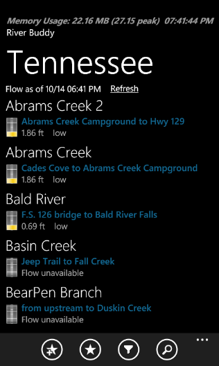
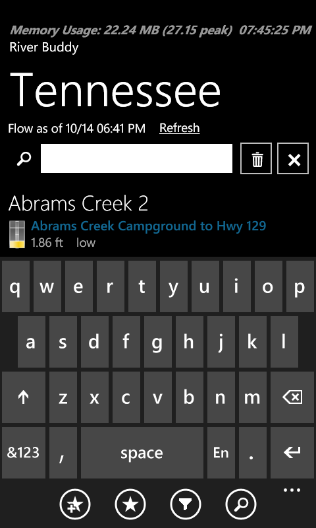
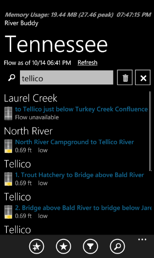
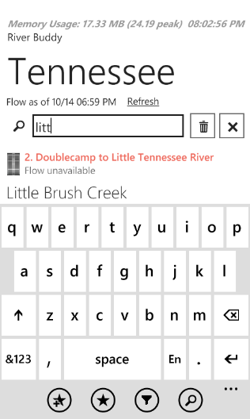

Update: [Part II](/tech/2011/2/13/wp7-in-app-searching-filtering-part-ii.html) builds on the below.

### A first pass attempt

Yesterday I was searching for some examples of searching and filtering data in Windows Phone 7. I was a bit surprised I did not find anything really; when I [asked on the WP7 Forum](http://social.msdn.microsoft.com/Forums/en-US/windowsphone7series/thread/c0aa0818-ccd9-4b86-9664-9e7a45d03692), the result was the same. So last night I spent some time taking a first-pass stab at this myself. My initial solution is rough and needs refactoring, refinement and polish, but is a working start just the same.

### The scenario and the options

I have a view where a user selects a state and then a following view that lists rivers for that state. It actually lists river sections and there can be 350+ depending on the state.  
  

Some potential solutions considered:  

- **Scrolling** - Not ideal for most states.
- **[Jump List](http://blogs.claritycon.com/blogs/windows_phone_7/archive/2010/06/24/that-s-a-huge-list-wp7-jump-list.aspx)** - I like this functionality but found for my view that it wasted too much space and got in the way of existing content.
- **Breaking up** - I did not want to add another level or step of navigation.
- **Searching / filtering** - Made the most sense for my scenario at this time.

### A picture says a thousand words

Below are some images showing the initial view, how it looks after clicking the search (magnifying glass) icon, during typing, and after the user has tapped out of the search field. Tested in light and dark themes as well as different orientations. Note the memory diagnostics at the top are only shown in Debug mode.  
  

      

### Current Operation

- Clicking the search icon in the application bar makes the search control visible.
- Note that clicking the hardware search button activates the phone's Bing search, and not the in-app search. Best I can tell the hardware search button only performs in-app searching with certain select "rockstar" apps. Bummer; I think, I could see that going either way.
- Focus is automatically shifted to the search textbox and the keyboard pops up.
- User starts typing and the list is filtered on the fly.
- User can tap away from the search control to hide the keyboard and work with the filtered list. The search control remains visible to make it obvious a partial list is showing and for possible further filtering.
- User can click the trash can icon to delete the contents of the search text and reset the filter.
- User can click the Close / Cancel 'X' or click the search icon again to hide the search control. This clears the filter, making all records visible again.

If you are thinking this is similar to how iPhone searching / filtering works, you are not too far off-base. My approach was certainly influenced by that but let's not kid on "borrowed features" between platforms. Don't tell Microsoft or Apple fanboys (I confess to enjoying both worlds). I considered a popup search of sorts but kept coming back to this as being the most useful.  
  

Enough already, on with the code...

### Search User Control XAML

First a user control to house everything. Note the [UpdateOnTextChangedBehavior](http://zoltanarvai.wordpress.com/2009/07/22/binding-update-on-textbox-textchanged-event-using-behaviors/) and the use of [OpacityMask](http://advertboy.wordpress.com/2010/09/25/using-an-image-as-a-mask-so-that-wp7-themes-are-honoured/) to provide theme support with a single image set.  

\[xml highlight="31,41,50"\] <UserControl x:Class="RiverBuddy.Controls.SearchControl" xmlns="http://schemas.microsoft.com/winfx/2006/xaml/presentation" xmlns:x="http://schemas.microsoft.com/winfx/2006/xaml" xmlns:d="http://schemas.microsoft.com/expression/blend/2008" xmlns:mc="http://schemas.openxmlformats.org/markup-compatibility/2006" xmlns:i="clr-namespace:System.Windows.Interactivity;assembly=System.Windows.Interactivity" xmlns:b="clr-namespace:Phone.Framework.Behaviors;assembly=Phone.Framework" mc:Ignorable="d" FontFamily="{StaticResource PhoneFontFamilyNormal}" FontSize="{StaticResource PhoneFontSizeNormal}" Foreground="{StaticResource PhoneForegroundBrush}" d:DesignHeight="62" d:DesignWidth="480">

<!-- Background changed to transparent at runtime --> <Grid x:Name="LayoutRoot" Background="{StaticResource PhoneChromeBrush}" Margin="0,0,3,0"> <Grid.ColumnDefinitions> <ColumnDefinition Width="48"/> <ColumnDefinition Width="\*" /> <ColumnDefinition Width="48"/> <ColumnDefinition Width="8"/> <ColumnDefinition Width="48"/> <ColumnDefinition Width="8"/>

</Grid.ColumnDefinitions> <Grid.RowDefinitions> <RowDefinition Height="68" /> </Grid.RowDefinitions>

<Button Grid.Row="0" Grid.Column="0" Width="48" Height="48"> <Button.Background> <SolidColorBrush Color="{StaticResource PhoneContrastBackgroundColor}"/> </Button.Background> <Button.OpacityMask> <ImageBrush Stretch="Fill" ImageSource="/Images/appbar.feature.search.rest.png"/> </Button.OpacityMask> <Image Height="48" Width="48" Source="/Images/appbar.feature.search.rest.png" HorizontalAlignment="Center" Stretch="UniformToFill"/> </Button>

<TextBox Grid.Column="1" x:Name="uxSearchTextBlock" Text="{Binding SearchText, Mode=TwoWay}" VerticalAlignment="Top" Margin="-10,0,0,0" HorizontalAlignment="Stretch"> <i:Interaction.Behaviors> <b:UpdateOnTextChangedBehavior/> </i:Interaction.Behaviors>

</TextBox> <Border Grid.Column="2" BorderThickness="2" BorderBrush="{StaticResource PhoneBorderBrush}" Height="48" Width="48"> <Button Height="48" Width="48" x:Name="uxDeleteButton" Click="uxDeleteButton\_Click" > <Button.Background> <SolidColorBrush Color="{StaticResource PhoneContrastBackgroundColor}"/> </Button.Background> <Button.OpacityMask> <ImageBrush Stretch="Fill" ImageSource="/Images/appbar.delete.rest.png"/> </Button.OpacityMask>

<Image Source="/Images/appbar.delete.rest.png" HorizontalAlignment="Center" Stretch="UniformToFill"/>

</Button> </Border> <Border Grid.Row="0" Grid.Column="3"/> <Border Grid.Column="4" BorderThickness="2" BorderBrush="{StaticResource PhoneBorderBrush}" Height="48" Width="48"> <Button x:Name="uxCloseButton" Height="48" Width="48" Click="uxCloseButton\_Click" > <Button.Background> <SolidColorBrush Color="{StaticResource PhoneContrastBackgroundColor}"/> </Button.Background> <Button.OpacityMask> <ImageBrush Stretch="Fill" ImageSource="/Images/appbar.close.rest.png"/> </Button.OpacityMask>

<Image Source="/Images/appbar.close.rest.png" HorizontalAlignment="Center" Stretch="UniformToFill"/>

</Button> </Border> <Border Grid.Row="0" Grid.Column="4"/> </Grid> </UserControl> \[/xml\]

### Databound Searcher class

You can think of this as a ViewModel-like class for the UserControl, inheriting from [NotifyPropertyChangedBase](/wp-content/uploads/2017/06/NotifyPropertyChangedBase.cs_.txt). Not much here for the moment as unfortunately more is in the user control's code-behind at the moment. I would like to transition more to this class.  
  

\[csharp\] using System.Windows.Input; using Phone.Framework;

namespace RiverBuddy.Controls { public class Searcher : NotifyPropertyChangedBase { private void ExecuteSearch() { if (null != this.SearchCommand && this.SearchCommand.CanExecute(null)) { this.SearchCommand.Execute(this.SearchText); } }

private string \_searchText; public string SearchText { get { return \_searchText; } set { if (\_searchText != value) { \_searchText = value; OnPropertyChanged("SearchText"); ExecuteSearch(); } } }

private ICommand \_searchCommand; public ICommand SearchCommand { get { return \_searchCommand; } set { if (\_searchCommand != value) { \_searchCommand = value; OnPropertyChanged("SearchCommand"); } } }

public void Reset() { this.SearchText = string.Empty; } } } \[/csharp\]

### Search UserControl code-behind

\[csharp\] using System; using System.ComponentModel; using System.Windows; using System.Windows.Input; using System.Windows.Media;

namespace RiverBuddy.Controls { public partial class SearchControl //: UserControl { public SearchControl() { InitializeComponent(); Init(); }

private void Init() { this.Loaded += SearchControl\_Loaded; this.Searcher = new Searcher(); }

private void SearchControl\_Loaded(object sender, RoutedEventArgs e) { if (DesignerProperties.IsInDesignTool) return; LayoutRoot.Background = new SolidColorBrush(Colors.Transparent); }

public static DependencyProperty SearchCommandProperty = DependencyProperty.Register("SearchCommand", typeof (ICommand), typeof (SearchControl), new PropertyMetadata(null, SearchCommandChanged)); public ICommand SearchCommand { get { return (ICommand)GetValue(SearchCommandProperty); } set { SetValue(SearchCommandProperty, value); } }

private static void SearchCommandChanged(DependencyObject o, DependencyPropertyChangedEventArgs e) { var ctl = (SearchControl) o; ctl.Searcher.SearchCommand = ctl.SearchCommand; }

private Searcher Searcher { get { return this.LayoutRoot.DataContext as Searcher; } set { this.LayoutRoot.DataContext = value; } }

private void uxCloseButton\_Click(object sender, RoutedEventArgs e) { //this.Visibility = Visibility.Collapsed; this.Searcher.Reset(); OnClosed(new EventArgs()); }

public event EventHandler Closed;

private void OnClosed(EventArgs e) { if (null != Closed) Closed(this, e); }

protected override void OnLostFocus(RoutedEventArgs e) { base.OnLostFocus(e); //if (uxSearchTextBlock.Text.Length == 0) // OnClosed(new EventArgs()); return; }

public void Reset() { this.Searcher.Reset(); }

public void ShowKeyboard() { uxSearchTextBlock.Focus(); }

private void uxDeleteButton\_Click(object sender, RoutedEventArgs e) { uxSearchTextBlock.Text = string.Empty; ShowKeyboard(); } } } \[/csharp\]  

Notes on SearchControl.cs:  

- **Closed event** - For some reason on the view that used the control, my BoolToVisibilityConverter was not working to manage when the search was visible. So for now the using view wraps the control in a border and sets visibility on that. The control raises a Closed event and the view is responsible for hiding the control's parent. PropertyChanged could have worked.

- **ShowKeyboard** - The view using the control will show the control when the search button is clicked. I tried to get the user control to automatically focus and show the keyboard but with the lack of a VisibilityChanged event or property change notification, I did not see an immediate way to do this automatically. I'm sure there is a way.
- **Delete button** - Focus moves out of the search textbox (if there) when clicking the delete button, which takes away focus from the textbox. Usually a user would want to type something new so the keyboard is shown again.

### The view XAML snippet

The search control can be placed wherever desired; I opted to keep it close to the data. It uses a [BoolToVisibilityConverter](/wp-content/uploads/2017/06/BoolToVisibilityConverter.cs_.txt) bound to the IsSearchVisible property on its ViewModel. By the way I use this [ViewModelLocatorBase pattern](http://blog.roboblob.com/2010/01/17/wiring-up-view-and-viewmodel-in-mvvm-and-silverlight-4-blendability-included/) for my ViewModel Locators; the ViewModelLocator in [MVVM Light](http://www.galasoft.ch/mvvm/getstarted/) is the one piece of the framework I do not care for.  
  

One important piece was changing my ListBox's ItemsSource to point to a CollectionViewSource on the ViewModel for filtering instead of directly to the ObservableCollection as before. More on the ViewModel in a moment.  

\[xml highlight="11,12,17"\] <Views:PhoneApplicationPageBase.Resources> <VML:StateRiversViewModelLocator x:Key="viewModelLocator" /> <fwConverters:BoolToVisibilityConverter x:Key="VisibilityConverter"/> </Views:PhoneApplicationPageBase.Resources>

<Views:PhoneApplicationPageBase.DataContext> <Binding Source="{StaticResource viewModelLocator}" Path="ViewModel"/> </Views:PhoneApplicationPageBase.DataContext>

<!-- For some reason setting visibility at user control level via binding wasn't working (?)--> <Border Visibility="{Binding IsSearchVisible, Converter={StaticResource VisibilityConverter}}" > <Controls:SearchControl x:Name="uxSearchControl" SearchCommand="{Binding SearchCommand}" /> </Border>

<!-- other XAML removed -->

<ListBox x:Name="MainListBox" ItemsSource="{Binding RiversView.View}" Margin="0,-5,8,0" > <!-- ... --> </ListBox> \[/xml\]

### The View Code-behind

There is a little code currently required in the view that I cannot quite get rid of just yet.  

\[csharp\] using System; using System.Windows.Controls; using RiverBuddy.ViewModels;

namespace RiverBuddy.Views { public partial class StateRiversView { public StateRiversView() { InitializeComponent(); uxSearchControl.Closed += uxSearchControl\_Closed; }

private StateRiversViewModel ViewModel { get { return LayoutRoot.DataContext as StateRiversViewModel; } }

private void uxSearchControl\_Closed(object sender, EventArgs e) { this.ViewModel.IsSearchVisible = false; }

private void uxSearchToolButton\_Click(object sender, EventArgs e) { this.ViewModel.IsSearchVisible = !this.ViewModel.IsSearchVisible; if (this.ViewModel.IsSearchVisible) uxSearchControl.ShowKeyboard(); else uxSearchControl.Reset(); } } } \[/csharp\]

### The ViewModel

In the ViewModel a property was added to control the search visibility, and a CollectionViewSource was exposed for the view to bind to for filtering. The ObservableCollection is still public for the DesignTimeViewModel. A search command was then added with its Search method that sets the Filter on the CollectionViewSource's view according to what to filter on.  

\[csharp highlight="24,46,78"\] using System; using System.Collections.ObjectModel; using System.Windows.Data; using System.Windows.Input; using GalaSoft.MvvmLight.Command; using Phone.Framework; using RiverBuddy.Config; using RiverBuddy.Core.Extensions; using RiverBuddy.Data; using RiverBuddy.Model;

namespace RiverBuddy.ViewModels { public class StateRiversViewModel : AppViewModelBase { public StateRiversViewModel() { return; }

private ObservableCollection<RiverModel> \_rivers;

private CollectionViewSource \_riversView; public CollectionViewSource RiversView { get { if (null == \_riversView) { \_riversView = new CollectionViewSource(); //\_riversView.Filter += FilterRiversView; } return \_riversView; } }

public ObservableCollection<RiverModel> Rivers { get { return \_rivers; } set { if (\_rivers != value) { \_rivers = value; RaisePropertyChanged("Rivers"); this.RiversView.Source = \_rivers; } } }

public void Refresh() { /\* code to load data removed for brevity \*/ // call some async method, in completed set this Rivers }

private bool \_isSearchVisible; public bool IsSearchVisible { get { return \_isSearchVisible; } set { if (\_isSearchVisible != value) { \_isSearchVisible = value; RaisePropertyChanged("IsSearchVisible"); } } }

public ICommand SearchCommand { get { return new RelayCommand<string>(Search); } }

private void Search(string searchText) { this.RiversView.View.Filter = r => { if (null == r) return true; var rm = (RiverModel) r; var meets = rm.RiverName.ToLowerInvariant().Contains(searchText.ToLowerInvariant()) || rm.SectionName.ToLowerInvariant().Contains(searchText.ToLowerInvariant()); return meets; }; } } } \[/csharp\]

### Conclusion and TODO

Well that is my first, quick stab at this anyway. If you are observant you may have noticed a custom funnel filtering icon next to the search magnifying glass. I plan on tackling this soon and it will be more of a filter than a search; a popup overlay will likely appear with preset buttons to immediately filter on known states (i.e. river flow state), no typing required.  
  

That's getting ahead of myself though as there is plenty of refactoring room here:

- Design work beautification w/Blend (not my strong suit)
- Possible background state changes with "image buttons" (delete & search)
- Perhaps animating the search control visibility
- Removal of workarounds, less code-behind code
- Consideration of other search techniques

If you have a larger list or you must hit the network or other slow resource you may want to remove the instant search on TextChanged as well as consider using ThreadPool etc.

  
  
[Subscribe to this feed](http://feeds.feedburner.com/thnk2wn)
