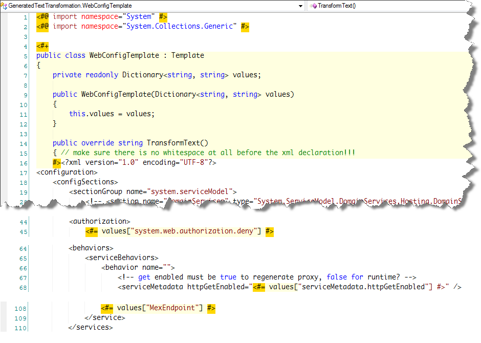
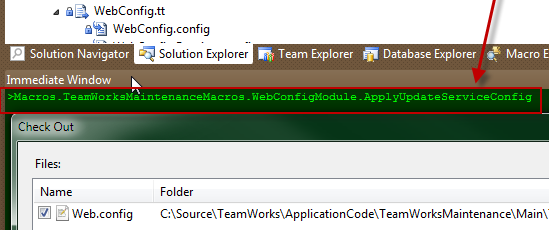

Recently I [blogged about my pain](/tech/2010/10/7/silverlight-wcf-iis-windows-auth-oracle-ef-pain.html) with getting Silverlight, WCF, IIS, Windows Authentication and Oracle to play nicely together. One of the pain points from that was needing one set of config settings for running the app and a different set anytime I needed to update the service reference. Specifically, for updating the service reference, serviceMetadata.httpGetEnabled must be true, IIS needs to allow anonymous access, and the Mex endpoint needs to be defined. When running the app the exact opposite is true.  
  

With at least 3 developers working on the app and more WCF changes, updating the service reference was becoming a pain. Ideally our end state might be getting rid of the service reference and instead using [ChannelFactory](http://msdn.microsoft.com/en-us/library/ms576132.aspx) along with some T4 to do ["WCF the manual way, the right way"](http://www.code-magazine.com/Article.aspx?quickid=0809101) but without all the manual pain of creating begin/end async methods and all the other hoopla.  
  

Until then we decided to come up with a solution for managing the config pain in the short term.

### Some solutions

[Web.config transformations](http://blogs.msdn.com/b/webdevtools/archive/2009/05/04/web-deployment-web-config-transformation.aspx)

This seemed ideal as I could just define what to replace, add or remove that varied per build configuration. It generated the correct config file just fine. The first problem I had with it is only actually uses the custom config when you go to publish the web app. As I'm not deploying to another server this didn't help much. I suppose I could have deployed to my own box but that is not ideal either. I was hoping simply changing the build configuration might determine which web.config to use. The other issue is that a separate build configuration is a hassle with 13 projects, half of which must target x86 and the other Any CPU.

MSBuild, build events and scripts

The next thing I tried was directly invoking MSBuild with something like msbuild "%1" /T:TransformWebConfig /P:Configuration=%2. While that generated the specific config directly, the output was buried in subfolders and getting a "reference" to that location and dealing with copying the file and source control was trouble.  
  
I went down the path of custom build events and started both batch files and powershell scripts but each route had some annoying roadblock / limitation of sorts.

T4

T4 seemed ideal in ways in that different web.config files could be created without having to have separate build configurations. I decided to go down this path and would later add a Visual Studio macro to take it one step further.

### A starting point

With some quick research I came across [Using T4 to auto-generate web.config files](http://fryerblog.com/post/1116389255/using-t4-to-auto-generate-web-config-files). That seemed to be a good start so I installed [T4 Toolbox](http://t4toolbox.codeplex.com/) and [Tangible T4 Editor](http://t4-editor.tangible-engineering.com/T4-Editor-Visual-T4-Editing.html) (free edition) and began the T4 work. In referencing that blog post though there were a few things that were not obvious to me and some issues I had.  
  

These issues included:  

- **Visual Studio hangs** - The Tangible T4 editor was hanging Visual Studio on opening any .tt file. After reading through the [extension page comments](http://visualstudiogallery.msdn.microsoft.com/en-us/60297607-5fd4-4da4-97e1-3715e90c1a23), I realized the initial open built a cache and I had to wait 5+ minutes for it to complete. Later it still could take 10+ seconds opening a .tt file so I emailed the developer who indicated it was a side by side issue with Resharper that was being worked on. Patience is a virtue...
- **Compile transform errors** - Next I ran into errors such as "Compiling transformation: The type or namespace name 'Generator' could not be found" and likewise for 'Template'. First I did not realize I needed to include T4Toolbox.tt, located at %PROGRAMFILES%T4 Toolbox. Reading over some T4 Toolbox blog entries I next realized the generator and template files needed to have the custom tool file property cleared as they are not intended for direct use but to be called from another template.
- **Excel / CSV file** - The post indicated an Excel file for storing values that differed per config but not what format. Turns out it was a tab-delimited CSV file. Editing that in Excel though meant losing the formatting unless saving as xlsx or xls, and saving in those formats meant saving a different copy to be read by the T4 templates. Excel also caused some formatting issues with certain data such as additional quotes. Editing the tab-delimited CSV file in a text editor wasn't much better. I decided to change the "config values" file storage to XML and rewrote the generator to account for that.
- **Generator creation** - I could not see where the filename was being passed to the generator in the post. I ended up creating a "calling / driver" T4 template to create and invoke the generator.

### WebConfig.xml

This file stores the values that differ per web.config version. The config name can be anything but it will get stamped into the generated filename when run. As this solution was only for local development I only needed two config modes, one for updating the service reference and one for running the app. The individual items can be named as desired but I found it helpful to mimic the name/path in the web.config. Values can be simple values or tags.  

\[xml\] <?xml version="1.0" encoding="utf-8" ?> <configs> <config name="UpdateServiceReference"> <item name="serviceMetadata.httpGetEnabled">true</item> <item name="system.web.authorization.deny"/> <item name="MexEndpoint"> <endpoint name="MexEndpoint" address="mex" binding="mexHttpBinding" contract="IMetadataExchange" /> </item> </config> <config name="Runtime"> <item name="serviceMetadata.httpGetEnabled">false</item> <item name="system.web.authorization.deny">?</item> <item name="MexEndpoint"/> </config> </configs> \[/xml\]

### WebConfigGenerator.tt

The generator takes the path to the "config values" xml file (WebConfig.xml here), reads in the data and creates a dictionary, and generates one config file per configuration using WebConfigTemplate.tt as the template. Make sure to clear the Custom Tool value for this file in file properties.  

\[csharp\] <#@ include file="WebConfigTemplate.tt" #> <#@ assembly name="System.Xml.Linq" #> <#@ import namespace="System" #> <#@ import namespace="System.IO" #> <#@ import namespace="System.Collections.Generic" #> <#@ import namespace="System.Xml.Linq" #>

<#+ public class WebConfigGenerator : Generator { private readonly string webConfigSettingsLocation; public WebConfigGenerator(string webConfigSettingsLocation) { this.webConfigSettingsLocation = webConfigSettingsLocation; }

protected override void RunCore() { XDocument xDoc = XDocument.Load(this.webConfigSettingsLocation); foreach (var xConfig in xDoc.Element("configs").Elements("config")) { var configName = xConfig.Attribute("name").Value.ToString(); var values = new Dictionary<string, string>(); foreach (XElement xItem in xConfig.Elements("item")) { if (!xItem.HasElements) values.Add(xItem.Attribute("name").Value.ToString(), xItem.Value.ToString()); else { var result = string.Concat(xItem.Nodes()); values.Add(xItem.Attribute("name").Value.ToString(), result); } } var webConfigTemplate = new WebConfigTemplate(values); //webConfigTemplate.Output.File = "../Web.config." + configName; webConfigTemplate.Output.File = "WebConfig." + configName + ".config";

if (configName == "local") webConfigTemplate.Output.BuildAction = BuildAction.None; else webConfigTemplate.Output.BuildAction = BuildAction.Content; webConfigTemplate.Render(); } } } #> \[/csharp\]

### WebConfigTemplate.tt

This contains the entire web.config but has variable placeholders for each area that needs to be dynamic. Unlike with a web.config transformation, this is not describing only what needs to change. Therefore with this approach it is best not to directly modify web.config but instead this template, then take the desired T4 config output and update the root web.config with that. This is a disadvantage of this technique though in practice I do not see it as an issue for my needs. Make sure to clear the Custom Tool value for this file in file properties.  
  

\[xml\] <#@ import namespace="System" #> <#@ import namespace="System.Collections.Generic" #>

<#+ public class WebConfigTemplate : Template { private readonly Dictionary<string, string> values; public WebConfigTemplate(Dictionary<string, string> values) { this.values = values; }

public override string TransformText() { // make sure there is no whitespace at all before the xml declaration!!! #><?xml version="1.0" encoding="UTF-8"?> <configuration> <!-- PUT YOUR WEB.CONFIG HERE and use the <#= values\["MyKeyHere"\] #> --> </configuration> <#+ return this.GenerationEnvironment.ToString(); } } #> \[/xml\]

### WebConfig.tt

This is the "top-level", calling template that invokes the generator and passes it the filename where the config settings are stored.

\[csharp\] <#@ template debug="true" hostSpecific="true" #> <#@ output extension=".config" #> <#@ Assembly Name="System.Core.dll" #> <#@ import namespace="System" #>

<#@ include file="T4Toolbox.tt" #> <#@ include file="WebConfigGenerator.tt" #>

<# var file = Host.ResolvePath(@"WebConfig.xml"); var configGen = new WebConfigGenerator(file); configGen.Run(); #> \[/csharp\]

### Configuration generated, now what?

  
  

Invoking "Transform all templates" or changing WebConfig.tt will result in adding/updating the different config files and Visual Studio will prompt to checkout from Source Control. However the "real" web.config file still needs to be checked out and its contents replaced with the config version to be switched to...

### Enter the macro

The Visual Studio macro takes care of selecting the Web.config file in Solution Explorer, issuing a TFS checkout if not already checked out, and replacing Web.config with the desired target config. When ApplySelectedConfig() is called, it will take whatever WebConfig._configName_.config is selected in Solution Explorer (displaying an error if no correct selection) and overwrite web.config with that. Other public methods exist to switch to a known config filename without requiring any selection in Solution Explorer.  

\[vb\] Imports System Imports EnvDTE Imports EnvDTE80 Imports EnvDTE90 Imports EnvDTE90a Imports EnvDTE100 Imports System.Diagnostics Imports System.IO

Public Module WebConfigModule

Public Sub UpdateServiceReference() MsgBox("For now please use Update Service Reference manually.", MsgBoxStyle.Information, "Not Ready") End Sub

Public Sub ApplySelectedConfig() Dim solExplore = GetSolutionExplorer()

If (solExplore Is Nothing OrElse solExplore.SelectedItems Is Nothing) Then MsgBox("No selected item detected in solution explorer", MsgBoxStyle.Exclamation, "No Selected Document") End If

Dim selItem As ProjectItem = solExplore.SelectedItems(0).Object

If IsNothing(selItem) Then MsgBox("You must select a file (specific WebConfig.\*.config)", MsgBoxStyle.Exclamation, "No Active Document") Return End If

If Not selItem.Name.StartsWith("WebConfig.") OrElse Not selItem.Name.EndsWith(".config") Then MsgBox("You must select an environment web.config.\* file", MsgBoxStyle.Exclamation, "No Env Config Selected") Return End If

Dim configFilenameToApply = selItem.FileNames(0) ApplyConfigFilename(configFilenameToApply) End Sub

Public Sub ApplyUpdateServiceConfig() ApplyConfigName("WebConfig.UpdateServiceReference.config") End Sub

Public Sub ApplyRuntimeConfig() ApplyConfigName("WebConfig.Runtime.config") End Sub

'-------------------------------------------------------------------------- ' Private methods... helpers etc. '--------------------------------------------------------------------------

Private Sub ApplyConfigName(ByVal configName As String) Dim solution As Solution2 = DTE.Solution If Not (solution.IsOpen) Then MsgBox("You must have the solution open", MsgBoxStyle.Exclamation, "No solution") Return End If

Dim configProjItem = solution.FindProjectItem(configName)

If configProjItem Is Nothing Then MsgBox("Could not find " + configName, MsgBoxStyle.Exclamation, "Config not found") Return End If

configProjItem.ExpandView() Dim configFilenameToApply = configProjItem.FileNames(0) ApplyConfigFilename(configFilenameToApply) End Sub

Private Sub ApplyConfigFilename(ByVal configFilenameToApply) Dim solution As Solution2 = DTE.Solution If Not (solution.IsOpen) Then Return

Dim webConfigProjItem = solution.FindProjectItem("Web.config") webConfigProjItem.ExpandView()

Dim webConfigFilename = webConfigProjItem.FileNames(0)

Dim SolutionExplorerPath As String Dim items As EnvDTE.UIHierarchyItems = DTE.ToolWindows.SolutionExplorer.UIHierarchyItems Dim item As Object = FindItem(items, webConfigFilename, SolutionExplorerPath)

If item Is Nothing Then MsgBox("Couldn't find web.config in Solution Explorer.") Return End If

' select web.config in solution explorer DTE.Windows.Item(Constants.vsWindowKindSolutionExplorer).Activate() DTE.ActiveWindow.Object.GetItem(SolutionExplorerPath).Select(vsUISelectionType.vsUISelectionTypeSelect)

' and issue a checkout if needed Dim isCheckedOut = DTE.SourceControl.IsItemCheckedOut(webConfigFilename) If Not isCheckedOut Then DTE.ExecuteCommand("File.TfsCheckOut") End If

'overwrite web.config File.Copy(configFilenameToApply, webConfigFilename, True) End Sub

Private Function FindItem(ByVal Children As UIHierarchyItems, ByVal FileName As String, ByRef SolutionExplorerPath As String) As Object For Each CurrentItem As UIHierarchyItem In Children Dim TypeName As String = Microsoft.VisualBasic.Information.TypeName(CurrentItem.Object) If TypeName = "ProjectItem" Then Dim projectitem As EnvDTE.ProjectItem = CType(CurrentItem.Object, EnvDTE.ProjectItem) Dim i As Integer = 1 While i <= projectitem.FileCount Debug.WriteLine(projectitem.FileNames(i))

If projectitem.FileNames(i) = FileName Then SolutionExplorerPath = CurrentItem.Name Return CurrentItem End If i = i + 1 End While End If

Dim ChildItem As UIHierarchyItem = FindItem(CurrentItem.UIHierarchyItems, FileName, SolutionExplorerPath) If Not ChildItem Is Nothing Then SolutionExplorerPath = CurrentItem.Name + "" + SolutionExplorerPath Return ChildItem End If Next End Function

Private Function GetSolutionExplorer() As UIHierarchy Dim solExplore As UIHierarchy solExplore = DTE.Windows.Item(Constants.vsext\_wk\_SProjectWindow).Object() Return solExplore End Function

End Module \[/vb\]

### Running the Macro

There are [multiple ways to run a Visual Studio macro](http://msdn.microsoft.com/en-us/library/a0003t62(vs.71).aspx) but I prefer the immediate/command window:  

  
  

Afterwards a macro method can be called to revert the config changes though usually I end up undoing pending changes on Web.config when the work is done and I need to switch back to the original configuration.

### Conclusion

This is one of a few ways to handle this situation. It may seem a little crazy in ways but it works for now and each technique has its own pros and cons.  
  

One current problem with the T4 generation is that sometimes visual studio prompts to checkout T4Toolbox.tt. I am not sure why this happens yet and in comparing changes, nothing is different. T4Toolbox.tt could be excluded from source control but that could break initial get latest version operations, at least when performed from the solution and not Source Control Explorer.  
  

I started to automate updating the service reference itself but will have to come back to that another day. While [SvcUtil](http://msdn.microsoft.com/en-us/library/aa347733.aspx) could be called directly, source control would likely be a problem. However I'm assuming that inside the macro it would be possible to update the service reference programmatically similar to [this code](http://www.visualstudiodev.com/visual-studio-extensibility/update-web-reference-using-a-macro-automatically-20938.shtml).

  
  
[Subscribe to this feed](http://feeds.feedburner.com/thnk2wn)
