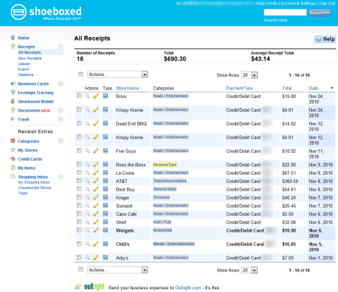
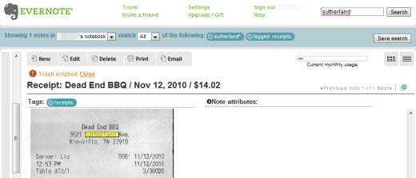
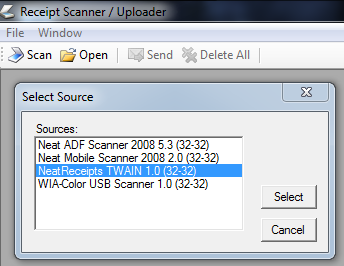
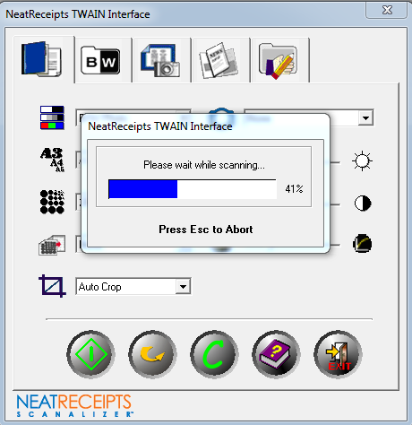
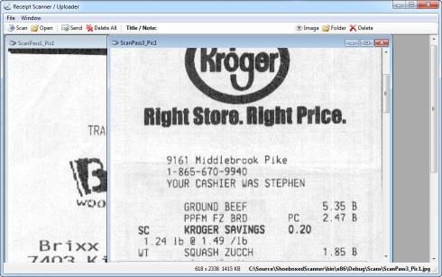
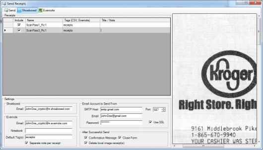

a h3 {margin-top: 10px; margin-bottom: 20px;} 

 .syntax .hll { background-color: #ffffcc } .syntax { background: #f0f0f0; } .syntax .c { color: #60a0b0; font-style: italic } /\* Comment \*/ .syntax .err { border: 1px solid #FF0000 } /\* Error \*/ .syntax .k { color: #007020; font-weight: bold } /\* Keyword \*/ .syntax .o { color: #666666 } /\* Operator \*/ .syntax .cm { color: #60a0b0; font-style: italic } /\* Comment.Multiline \*/ .syntax .cp { color: #007020 } /\* Comment.Preproc \*/ .syntax .c1 { color: #60a0b0; font-style: italic } /\* Comment.Single \*/ .syntax .cs { color: #60a0b0; background-color: #fff0f0 } /\* Comment.Special \*/ .syntax .gd { color: #A00000 } /\* Generic.Deleted \*/ .syntax .ge { font-style: italic } /\* Generic.Emph \*/ .syntax .gr { color: #FF0000 } /\* Generic.Error \*/ .syntax .gh { color: #000080; font-weight: bold } /\* Generic.Heading \*/ .syntax .gi { color: #00A000 } /\* Generic.Inserted \*/ .syntax .go { color: #808080 } /\* Generic.Output \*/ .syntax .gp { color: #c65d09; font-weight: bold } /\* Generic.Prompt \*/ .syntax .gs { font-weight: bold } /\* Generic.Strong \*/ .syntax .gu { color: #800080; font-weight: bold } /\* Generic.Subheading \*/ .syntax .gt { color: #0040D0 } /\* Generic.Traceback \*/ .syntax .kc { color: #007020; font-weight: bold } /\* Keyword.Constant \*/ .syntax .kd { color: #007020; font-weight: bold } /\* Keyword.Declaration \*/ .syntax .kn { color: #007020; font-weight: bold } /\* Keyword.Namespace \*/ .syntax .kp { color: #007020 } /\* Keyword.Pseudo \*/ .syntax .kr { color: #007020; font-weight: bold } /\* Keyword.Reserved \*/ .syntax .kt { color: #902000 } /\* Keyword.Type \*/ .syntax .m { color: #40a070 } /\* Literal.Number \*/ .syntax .s { color: #4070a0 } /\* Literal.String \*/ .syntax .na { color: #4070a0 } /\* Name.Attribute \*/ .syntax .nb { color: #007020 } /\* Name.Builtin \*/ .syntax .nc { color: #0e84b5; font-weight: bold } /\* Name.Class \*/ .syntax .no { color: #60add5 } /\* Name.Constant \*/ .syntax .nd { color: #555555; font-weight: bold } /\* Name.Decorator \*/ .syntax .ni { color: #d55537; font-weight: bold } /\* Name.Entity \*/ .syntax .ne { color: #007020 } /\* Name.Exception \*/ .syntax .nf { color: #06287e } /\* Name.Function \*/ .syntax .nl { color: #002070; font-weight: bold } /\* Name.Label \*/ .syntax .nn { color: #0e84b5; font-weight: bold } /\* Name.Namespace \*/ .syntax .nt { color: #062873; font-weight: bold } /\* Name.Tag \*/ .syntax .nv { color: #bb60d5 } /\* Name.Variable \*/ .syntax .ow { color: #007020; font-weight: bold } /\* Operator.Word \*/ .syntax .w { color: #bbbbbb } /\* Text.Whitespace \*/ .syntax .mf { color: #40a070 } /\* Literal.Number.Float \*/ .syntax .mh { color: #40a070 } /\* Literal.Number.Hex \*/ .syntax .mi { color: #40a070 } /\* Literal.Number.Integer \*/ .syntax .mo { color: #40a070 } /\* Literal.Number.Oct \*/ .syntax .sb { color: #4070a0 } /\* Literal.String.Backtick \*/ .syntax .sc { color: #4070a0 } /\* Literal.String.Char \*/ .syntax .sd { color: #4070a0; font-style: italic } /\* Literal.String.Doc \*/ .syntax .s2 { color: #4070a0 } /\* Literal.String.Double \*/ .syntax .se { color: #4070a0; font-weight: bold } /\* Literal.String.Escape \*/ .syntax .sh { color: #4070a0 } /\* Literal.String.Heredoc \*/ .syntax .si { color: #70a0d0; font-style: italic } /\* Literal.String.Interpol \*/ .syntax .sx { color: #c65d09 } /\* Literal.String.Other \*/ .syntax .sr { color: #235388 } /\* Literal.String.Regex \*/ .syntax .s1 { color: #4070a0 } /\* Literal.String.Single \*/ .syntax .ss { color: #517918 } /\* Literal.String.Symbol \*/ .syntax .bp { color: #007020 } /\* Name.Builtin.Pseudo \*/ .syntax .vc { color: #bb60d5 } /\* Name.Variable.Class \*/ .syntax .vg { color: #bb60d5 } /\* Name.Variable.Global \*/ .syntax .vi { color: #bb60d5 } /\* Name.Variable.Instance \*/ .syntax .il { color: #40a070 } /\* Literal.Number.Integer.Long \*/

table.data td {border-bottom-width: 1px; border-bottom-color: black; border-style: solid; padding: 14px; border-collapse: collapse; border-left:none; border-right:none; border-top:none;} table.data { border-collapse: collapse; } li {margin-bottom: 6px;"} .nobr { white-space:nowrap; }

I try to be pretty organized with my finances otherwise I cannot tame the beast. This has included entering transactions into financial software (i.e. Money, Quicken), scanning and shredding receipts and bills, online bill pay, e-statements, sites like [mint.com](http://mint.com), and various other tools and techniques. While most of my transactions are personal and not business expenses, I still find this a worthwhile investment. I have never liked the paperwork involved though so I have always strived for paperless personal finance in this digital world.  
  

The downside to this goal is that achieving it tends to require a lot of tedious, boring work when you have many financial transactions. This is especially true with keying in transactions from various receipts, and even more so if you want to digitally manage the receipts, bills and related documents. After staring in despair at my last stack of receipts on my desk, I decided to take a shot at automating some of this work with a trial of [shoeboxed.com](http://shoeboxed.com) along with some other changes along the way.  
  

1. [Background](#Background)
2. [The desire for more](#DesireMore)
3. [Shoeboxed.com - Your Personal Financial Assistant](#Shoeboxed)
4. [Evaulating Shoeboxed Costs](#ShoeboxedCosts)
5. [Trying Shoeboxed Mail-In](#ShoeboxedMailIn)
6. [Other ways of sending receipts faster](#SendReceiptsFaster)
7. [Shoeboxed applications](#ShoeboxedApps)
8. [Exporting the data from Shoeboxed to Quicken](#ShoeboxedToQuicken)
9. [A script to import the data into Quicken?](#ShoeboxedQuickenScript)
10. [Completing the picture with Evernote](#Evernote)
11. [A custom receipt scanning and uploading application](#CustomApp)
12. [Ideas for the future](#FutureIdeas)
13. [Conclusion](#Conclusion)

  

### Background

First I believe it is helpful to review the path that lead me here.  
  

The stone age

In other words, the time of check registers and hand-written paperwork. I gave this up probably 12 years ago and have never looked back. If you were born in the late 70's or after and you are still here, you are in the minority.

Microsoft Money

Money really helped me get a handle on my finances. Suddenly tracking, reporting, forecasting, budgeting, reconciling and more became manageable. I would key in my receipts and then throw them away.

Microsoft Money + paper receipts

Throwing away receipts bit me several times, even ones I thought unimportant. Soon I realized the value of saving them which included: reconciling help, returns, warranties, price matching, taxes, reimbursements, rebates, insurance and more. Each month I would put my receipts in a different envelope.

Money / Quicken + scanned receipt "sheets"

Receipt envelopes quickly piled up and finding anything was a pain so the envelope method didn't last long. After entering receipts I started laying 6 to 9 receipts at a time on my scanner bed and scanning them as single image sheets of several receipts, then shredding the originals.  
  
Meanwhile I reluctantly switched from Money to Quicken for 4 main reasons:

1. Money occasionally messed up my starting balance making it hard to reconcile against the bank
2. Microsoft [discontinued the application](http://news.cnet.com/8301-13860_3-10261742-56.html)
3. It was Windows-only and I started to partially switch to Apple
4. Quicken was more "industry standard", more widely supported

Quicken + [Neat Receipts](http://www.neatco.com/)

Isolating the right receipt in a batch image of receipts was not ideal and I was not OCRing the images. I would tag file properties with tags to aid in search but it was less than ideal. I started using [Neat Receipts](http://www.neatco.com/) (Mac version) and was very impressed. Scanning receipts individually was not appealing initially but was much easier than a flatbed scanner and the OCR was good enough to usually pick out the vendor, price and other fields automagically. All the receipt images were in a searchable, organized database file that I split up by month.  
  
During this time I also went through various conversion pains in transitioning from Quicken Windows to Quicken Mac 2007 and finally to Quicken Essentials for Mac. Each version had various pros and cons and transitioning the data between versions was not smooth by any means.

  

### The desire for more

[Neat Receipts](http://www.neatco.com/) was nice but I still had frustrations:

- Scanning receipts took more time than I'd like
- Image cropping and receipt data correction / entry took some time
- Despite toting Quicken export features, it didn't work on Mac and Windows support looked less than ideal. This meant performing dual data entry in both systems for some of the same data
- Receipt database files were not small. I decreased the resolution but could still see storage being a problem long-term.

  

On the Quicken front, [Quicken Essentials](http://quicken.intuit.com/personal-finance-software/mac-personal-financial-software.jsp) was more limited than its predecessor but at least it was a native, modern app and it worked for my basic needs. Entering a bunch of receipt transactions was still tedious though.  
  

While I realize transactions can be downloaded from financial institutions into Quicken, I find that better suited for initial account setup. Otherwise it defeats much of the idea of reconciliation to me and in the past I have seen it cause problems (duplicate data and more). If I'm staying on top of things, my local data is usually more current than my bank's site anyway. Finally my receipts and local data tend to be more detailed and descriptive than what I would get from the bank.  
  

### Shoeboxed.com - Your Personal Financial Assistant

[Shoeboxed.com](http://shoeboxed.com) ("where receipts go") is sort of like the Netflix model for receipts. You mail them an envelope of receipts or send them receipt images and they:

- Scan and/or OCR the images
- Manually check and correct receipt data (i.e. someone reviews, will add hand-written tips to totals, etc.)
- Upload receipt images and data to your secure account accessible via web and mobile phone
- Automatically categorize receipts and allow you to change, provide rules
- Shred the originals or return them depending on your preference
- Provide export functionality, search and much more

The service sounded ideal as it was like having a personal financial assistant to do the grunt work at a fraction of the cost. While it caters more to business use, I found its Lite plan to be reasonable enough for me to try it for personal use.  
  

The below video has a short overview of the service; it is a bit older so the current web app has many more features. There is a longer, perhaps [better demo video here](http://www.shoeboxed.com/receipt-scanning-demo/) though it is more out-of-date.  
  

<iframe src="https://www.youtube.com/embed/Sr7R9GiROzg?ecver=2" width="640" height="360" frameborder="0" style="position:absolute;width:100%;height:100%;left:0" allowfullscreen></iframe>

  
  

### Evaulating Shoeboxed Costs

After checking out [Shoeboxed price plans](http://www.shoeboxed.com/pricing/) I was a little turned off. However an annual plan of the Lite account is $99/yr and I consider that reasonable if the service provides the value I expect. I estimate it may save me 1 to 2 hours per week or so in scanning and digitally organizing receipts and importing that transaction data into Quicken. Combined with a [nice export to Evernote](http://www.shoeboxed.com/evernote/) and other features, I expect it to save more time throughout the year in searching and using that data. I'm guessing it saves me 100+ hours per year at a cost of less than $2 per week. I think the cost may be worth it as it helps me manage my finances and my time is valuable and is better spent elsewhere.  
  

With the Lite account there are some additional costs such as postage (upgraded plans come with prepaid envelopes) if you use mail-in. There is also a slight charge per receipt if you go over the limit of 50 receipts per month and I usually have 45-70 or so each month. I do feel they should bump up the receipt limit for the Lite plan to at least 75 or 100. However with the Lite annual option you get an extra 250 receipts which minimizes or eliminates that. Additionally you can upload receipts yourself that do not count towards the limits and they provide a 30 day risk-free trial so it seemed worth evaluating at least.  
  

### Trying Shoeboxed Mail-In

After signing up for a Lite trial, I first printed off address labels to make mailing the envelopes easier since this plan didn't include prepaid envelopes. You also have to include some user details so they know which account the receipts are associated with so I created labels for this as well (not necessary w/prepaid envelopes in upgraded plans). I mailed in my first batch of receipts on a Monday; they received by late Wednesday and had the receipts processed by the weekend.  
  

I wish the turnaround time was a little better but this was expected with the Lite account, standard postage, and the initial mail-in. Considering I'd generally want to wait until receipts collect a bit before mailing them, this did mean this was not going to be the fastest solution. In practice, receipts generally sat on my desk a few days anyway before I dealt with them and there is always the option of more express mail.  
  

To really get the speed I'd like with the limitations removed I would need to upgrade to the Classic plan that carries more sticker shock at 3 times the cost. Looking at in from an annual plan subscription though, that's around $5 per week. That's still not bad considering the time it saves and value it provides, and considering you certainly could not pay an assistant to do this cheaper/better.  
  

### Other ways of sending receipts faster

**Mobile option** - Shoeboxed membership also comes with a mobile option that allows you to take a pictures of receipts and email them to shoeboxed for faster processing. This is intended more for mobile phone use but it works just as well on the computer. Obviously they will receive the receipts near instantly unlike snail mail and they appear to process these within one business day. In fact my initial receipt email test was completely processed within 30 minutes. These receipts do count towards your monthly limits however as they perform the same OCR, manual review and storage process as the mailed-in receipts. The other drawback is the quality of the receipt images taken via your camera will typically not be as good. Finally I noticed if I emailed the receipt in the wrong orientation (typical from a phone) they did not rotate it for me but all the data was correct.  
  

**Manual upload** - Another method is manual upload of a receipt image to [shoeboxed.com](http://shoeboxed.com). Unfortunately this will not perform any automatic OCR similar to [Evernote](http://www.evernote.com/) or Neat Receipts. It will however automatically categorize the receipt if the vendor you supply is in their database or is already listed in your stores. The other difference is these receipts will not count toward monthly limits. Otherwise everything with the receipt is identical within the system.  
  

### Shoeboxed applications

I found the [shoeboxed.com](http://shoeboxed.com) website to work pretty well. Layout, image preview and data entry were logical and generally snappy.  
  

There are a few things on [shoeboxed.com](http://shoeboxed.com) I'd like to see added/changed:

- **Basic image editing** - i.e. add crop and rotate, especially for images taken via camera and emailed in. Their enhanced manual uploader does have rotate features though.
- **Gallery view** - it would be nice to see a visual thumbnail style preview of all the receipts (can get via Evernote export though)
- **Site speed** - occasionally the image preview took a little longer than it should (Flash based now for zoom, print and more imaging features)
- **Tags** - categories and notes are nice but assigning tags would be handy
- **Additional export functionality** - Such as assigning tags in [Evernote](http://www.evernote.com/) export and more current Quicken support (more on that in a moment)

  
  

The is also an official [iPhone app](http://itunes.apple.com/us/app/shoeboxed/id322143854?mt=8) available that I have not tried due to my switch to [Windows Phone 7 (WP7)](http://www.microsoft.com/windowsphone/en-us/features/default.aspx). Shoeboxed has an [API](http://www.shoeboxed.com/api/) and I might consider a WP7 app if I continue use of the service.  
  

### Exporting the data from Shoeboxed to Quicken

Getting my receipt transaction data into Quicken without manual data entry is just as important to me as getting at the receipts themselves or the extracted receipt data in another system. This is where I ran into the first roadblock. Shoeboxed has an export to Quicken but it is in an old QIF format that [Quicken has not supported](http://quicken.intuit.com/support/articles/data-file-management/data/3886.html) in some time. Unless you have a very old version of Quicken this is rather useless best I can tell and is surprising for a relatively new service such as Shoeboxed. I have emailed Shoeboxed asking them to add QFX file support (Quicken's version of [OFX](http://www.ofx.net/)) in hopes they might address this.  
  

It appears sadly that even if shoeboxed provided an OFX format (or I [converted QIF->OFX somehow](http://www.bigredconsulting.com/aboutofxwriter.htm)), that [Quicken may artificially cripple OFX import](http://www.digital501.com/2006022124/hack-quicken-osx-qfx/) unless it detects it came from a supported bank. In short, Quicken sucks on Mac, Intuit appears greedy, their drop of QIF support has caused a lot of people grief, and any current version of Quicken apparently only wants to allow import from a bank or another version of Quicken. Note to Intuit: You are on my greylist. Note to Microsoft: Revive Money! Note to industry: Provide us with an alternative! Note to me: Switch back to Quicken for Windows?  
  

In the meantime Shoeboxed does point to a [Cash account and transfer workaround](http://www.shoeboxed.com/how-does-your-quicken-export-work/) for Quicken. That unfortunately doesn't work with Quicken Essentials. I just "tried it" in [Quicken 2011 Deluxe for Windows](https://quicken.intuit.com/personal-finance-software/deluxe-money-management.jsp) (there is no trial, only money back guarantee) and the workaround does work there. It's still a few steps to import that into a Cash account and then move those transactions to Checking and it seems like a very artificial limit but it's better than nothing. Looks like Quicken Windows is now my future again. The Windows version is much better but it's a downer having to switch between 2 operating systems more often now.  
  

### A script to import the data into Quicken?

As hopefully a stop-gap measure I wrote the below AppleScript to attempt to automate taking CSV data exported from shoeboxed.com into Quicken Essentials for Mac. It works by activating Quicken and Excel, grabbing the receipt data from Excel, and switching to Quicken to type in the data. A modified version of this could be used with Quicken for Mac 2007. On Windows a similar process could be done with Powershell for example if needed there.  
  

I took this approach as it was the quickest and easiest method of ensuring the data was entered correctly. The actual quicken files are proprietary / closed and converting other Shoeboxed exported data into a QFX file format would have been more work. This way the script doesn't have to worry about file formats or I/O, it just transfers data between two running apps.  
  

There are a few assumptions and limitations with the script and some of those are noted following the script code. Also, this is my first AppleScript and a first pass so there is certainly room for improvement. I was pleasantly surprised at how English-like AppleScript is and how much worked based on my assumptions without having to look up syntax.  
  

global gExcelRowNumber 
global gExcelColLetter 
global gExcelCellId 
global gExcelCellValue 

global gCreditCardEndsWith 
set gCreditCardEndsWith to "1234" 
global gShowSummary 
set gShowSummary to true 

\-- note: tell blocks don't appear to work with variable names correctly ('identifier / end of line'). single line appears okay 
\-- set QUICKEN\_APP to "Quicken Essentials" 

\--\*\*\*\*\*\*\*\*\*\*\*\*\*\*\*\*\*\*\*\*\*\*\*\*\*\*\*\*\*\*\*\*\*\*\*\*\*\*\*\*\*\*\*\*\*\*\*\*\*\*\*\*\*\*\*\*\*\*\*\*\*\*\*\*\*\*\*\*\*\*\*\*\*\*\*\*\*\*\*\*\*\*\*\*\*\*\* 

on menu\_click(mList) 
    local appName, topMenu, r 

    \-- Validate our input 
    if mList's length < 3 then error "Menu list is not long enough" 

    \-- Set these variables for clarity and brevity later on 
    set {appName, topMenu} to (items 1 through 2 of mList) 
    set r to (items 3 through (mList's length) of mList) 

    \-- This overly-long line calls the menu\_recurse function with 
    \-- two arguments: r, and a reference to the top-level menu 
    tell application "System Events" to my menu\_click\_recurse(r, ((process appName)'s  
        (menu bar 1)'s (menu bar item topMenu)'s (menu topMenu))) 
end menu\_click 

on menu\_click\_recurse(mList, parentObject) 
    local f, r 

    \-- \`f\` = first item, \`r\` = rest of items 
    set f to item 1 of mList 
    if mList's length \> 1 then set r to (items 2 through (mList's length) of mList) 

    \-- either actually click the menu item, or recurse again 
    tell application "System Events" 
        if mList's length is 1 then 
            click parentObject's menu item f 
        else 
            my menu\_click\_recurse(r, (parentObject's (menu item f)'s (menu f))) 
        end if 
    end tell 
end menu\_click\_recurse 

to set\_cell(rowNum, columnLetter) 
    set gExcelRowNumber to rowNum 
    set gExcelColLetter to columnLetter 
    set gExcelCellId to gExcelColLetter & gExcelRowNumber as string 

    tell application "Microsoft Excel" 
        activate 
        tell active sheet of active workbook 
            cell gExcelCellId 
            set gExcelCellValue to string value of cell gExcelCellId 
            select range gExcelCellId 
        end tell 
    end tell 

    return gExcelCellValue 
end set\_cell 

on send\_value\_to\_quicken(valueToSend, sendTab) 
    \--display dialog "sending " & valueToSend & " to quicken" 
    tell application "Quicken Essentials" to activate 

    tell application "System Events" 
        keystroke valueToSend 
        \-- decreasing the delay results in faster processing but may mess up the data 
        \-- this is especially true for the way quicken handles the Payee column 
        delay 0.3 

        if sendTab is equal to true then 
            keystroke tab 
            delay 0.3 
        end if 
    end tell 
end send\_value\_to\_quicken 

set FileToOpen to choose file with prompt "Select CSV file" of type {"CSV"} 

tell application "Microsoft Excel" 
    activate 
    open FileToOpen 
end tell 

\-- current personal quicken column order:  
\-- Date, Action (Debit etc.), Payee, Category, Payment, Deposit, Balance, Reconcile, Memo/Notes 

\-- storeboxed csv order:  
\-- Date    Store   Note    Total (USD) Tax (USD)   Payment Type    Receipt Type    Category    Receipt 

set row\_num to 2 
set last\_row to 2 

tell application "Microsoft Excel" 
    set last\_row to ((count of rows of used range of active sheet) + 1) 
end tell 

set entered\_count to 0 
set skipped\_cc\_count to 0 
set total to 0 

repeat until row\_num \= last\_row 
    set\_cell(row\_num, "F") 
    set isCreditCard to false 

    if gExcelCellValue contains gCreditCardEndsWith then 
        set isCreditCard to true 
    end if 

    if isCreditCard is equal to false then 
        \-- date column       
        set tran\_date to set\_cell(row\_num, "A") 

        \-- action column (leave as Debit for now, add support for ATM or other later perhaps) 
        set tran\_type to "Debit" 

        \-- store / payee / vendor 
        set tran\_vendor to set\_cell(row\_num, "B") 

        \-- shoeboxed note / comment  
        set tran\_note to set\_cell(row\_num, "C") 

        \-- category. may be empty        
        set tran\_category to set\_cell(row\_num, "H") 

        \-- amount (payment)      
        set tran\_amount to set\_cell(row\_num, "D") 
        set total to total + tran\_amount as real 

        \-- memo / notes (receipt url)        
        set tran\_receipt\_url to set\_cell(row\_num, "I") 

        set tran\_memo to tran\_receipt\_url 

        if length of tran\_note is greater than 0 then 
            set tran\_memo to tran\_note & "  ==> " & tran\_receipt\_url 
        end if 

        tell application "Quicken Essentials" to activate 
        menu\_click({"Quicken Essentials", "Transactions", "New Transaction"}) 

        \-- after starting a new transaction we need to pause to ensure quicken is ready to accept our input 
        if entered\_count is equal to 0 then 
            delay 1.2 
        else 
            delay 0.85 
        end if 

        send\_value\_to\_quicken(tran\_date, true) 
        delay 0.15 
        send\_value\_to\_quicken(tran\_type, true) 
        send\_value\_to\_quicken(tran\_vendor, true) 

        delay 0.25 

        \-- category. if there use it, otherwise accept quicken default and tab out 
        if length of tran\_category is 0 then 
            send\_value\_to\_quicken(tab, false) 
        else 
            send\_value\_to\_quicken(tran\_category, true) 
        end if 

        \-- category can be a bit slower  
        delay 0.25 

        send\_value\_to\_quicken(tran\_amount, true) 

        \-- deposit       
        send\_value\_to\_quicken(tab, false) 

        \-- memo / notes (receipt url) 
        send\_value\_to\_quicken(tran\_memo, true) 

        \-- tags 
        send\_value\_to\_quicken("shoeboxed", true) 

        \-- commit / save the transaction 
        send\_value\_to\_quicken(return, false) 

        set entered\_count to entered\_count + 1 
    else 
        set skipped\_cc\_count to skipped\_cc\_count + 1 
    end if 

    set row\_num to row\_num + 1 
end repeat 

if gShowSummary is equal to true then 
    delay 0.3 
    tell application "Quicken Essentials" to activate 
    display dialog (("Entered " & entered\_count as text) & " receipts totalling " & total as text) & ". Skipped " & skipped\_cc\_count & " credit card entries" 
end if 
    

  

Script limitations, assumptions and notes:  

- Verify, correct data if needed on shoeboxed.com first, then export to CSV.
- Lack of true AppleScript support in Quicken Essentials means this is far from foolproof.
- Script adjustments must be made if your Quicken Essentials Register columns view settings (columns and order) are different than mine (likely are).
- For password protected Quicken Essentials files you'll need to open Quicken Essentials first before running the script.
- The script currently assumes you are already within the appropriate register view of Quicken Essentials (i.e. Checking).
- Script assumes transactions being entered are not already in Quicken Essentials
- Timing issues are possible. Delay statements had to be added to given Quicken Essentials time to react to the previous keystrokes before sending the next keystrokes. How long those delays need to be can vary by machine. Too little delay and you may be in the wrong field, too much delay and the script runs slowly.
- No real error handling is built into the script. While running, if a timing issue happens, a system popup appears at the wrong time, or you start switching windows or typing, unpleasant results can occur.
- It's best to move the Action Script editor to another area where the script can easily be stopped if needed.
- While it is easy enough to delete transactions created by the script (sort by Date Entered), backing up the Quicken file first isn't a bad idea. Likewise start with a small number of transactions.

Important conclusion: While this script worked for some exported transaction batches it did not work for others and is unreliable at best without further tweaking.  
  

Download: [QuickenImport.applescript.txt](/wp-content/uploads/2017/06/QuickenImport.applescript.txt) [expenses\_demo.csv](/wp-content/uploads/2017/06/expenses_demo.csv)  
  

The below video shows the script in action. While it is hard to make out much detail it does give some idea of the process, speed and occasional success. It is worth noting that the script usually runs faster but was further delayed for the purposes of video recording.  

<iframe src="http://player.vimeo.com/video/17206469" width="640" height="385" frameborder="0"></iframe>

  
  

### Completing the picture with Evernote

Shoeboxed and Evernote seemed more like competition originally but I was glad when they teamed up. Shoeboxed handles the paper, OCR, receipt data extraction review/correction, automatic categorization, storage, organization and more. Evernote overlaps in the area of OCR but provides a much better search of the OCR'd text data in the receipt image. Since Evernote is more general purpose it doesn't have Shoeboxed's receipt and finance specific features but it compliments it well with search, tagging and more. The Shoeboxed export to Evernote worked well, I just wish they would add the ability to add tags and specify the notebook. Considering they appear to be exporting via email this would be easy to do as Evernote email allows this to be specified in the subject line.  
  

  
  

### A custom receipt scanning and uploading application

At this point in my trial I realized that Shoeboxed mail-in is great for organizing receipts but I could not afford to wait a week+ to get those transactions into Quicken. I liked the idea of emailing the receipts to Shoeboxed but not the idea of using a camera to take pictures of paper receipts, which often doesn't work well. I considered manually entering receipts into Quicken as they arrived and then mailing the receipts to Shoeboxed with no real rush on delivery and processing of the images. I liked the Neat Receipts scanner but not correcting scanned images and OCR'd text or storing the data locally in an isolated store.  
  

In an attempt to somewhat combine the best of the different options, I created a quick-n'-dirty Windows scanner / uploader app last weekend based on the [.NET TWAIN image scanner CodeProject application](http://www.codeproject.com/KB/dotnet/twaindotnet.aspx). It scans and saves the receipt images (or allows opening existing images) and sends them to Shoeboxed and/or Evernote via email. This allows Shoeboxed to get and process quality receipt images very quickly. That in turn means that data can be extracted quickly back into Quicken, Evernote, and/or other systems.  
  

This does mean I was back to scanning receipts again. However I was able to use the Neat Receipts mobile scanner with the app via [TWAIN](http://en.wikipedia.org/wiki/TWAIN) and that scanned and auto-cropped the receipts perfectly, returning the images without having to use NeatWorks (which does still need to be installed for drivers etc.). Moreover it meant OCR data extraction could be offloaded to Shoeboxed without NeatWorks guessing and me correcting / finishing. I could certainly avoid a custom app and just use a flatbed scanner and an email client. Receipt scanners are more convenient though, [printer/scanner hardware/software is sent from hell](http://theoatmeal.com/comics/printers), and the custom app provides more control for a smoother, more automated workflow.  
  

Selecting scanner source is a one-time step:  
  
  

NeatReceipts TWAIN Scanning Dialog. Changed Color to B&W, crop to Auto Crop on 1st run:  
  
  

App auto-saves, provides basic image management and upload features (click for large view):  
  
  

Send allows various options for Shoeboxed and/or Evernote (click for large view):  
  
  

Download: [Source](/wp-content/uploads/2017/06/ShoeboxedScannerSource.zip) | [App](/wp-content/uploads/2017/06/ShoeboxedScannerExe.zip) ([.NET framework 4.0](http://www.microsoft.com/downloads/en/details.aspx?FamilyID=9cfb2d51-5ff4-4491-b0e5-b386f32c0992&displaylang=en) is required)  
  

App notes:

- **Evernote**: Sending to Shoeboxed + Evernote means the receipts do not have to be exported to Evernote from Shoeboxed later. However doing that before Shoeboxed has performed its processing means the receipt data will not be there to describe it well unless it is manually entered.
- **Scanning technology**: I looked into [WIA](http://msdn.microsoft.com/en-us/library/ms630368(VS.85).aspx) as TWAIN is old as dirt but I did not have much luck with my initial quick attempt. I have worked with [Atalasoft](http://www.atalasoft.com/) imaging controls in prior consulting and they work great but are too expensive for personal use. I am not aware of a similar free, more modern alternative.
- **Receipt size**: One of the disadvantages of scanning with this app is long receipts over 11.6" tall may get cut off. This was the case for NeatReceipts TWAIN scanner anyway and I believe scanning via NeatWorks allows longer receipts. Shoeboxed.com mail-in can handle much longer receipts than either.
- **Email**: The app will batch receipts together in consolidated emails where possible, when tags and notes are the same (otherwise different subject lines are needed). Evernote benefits more from separate emails as it will lump multiple receipt image attachments in a given email into a single note which I find is not ideal.

  

### Ideas for the future

- **NeatReceipts API**: I looked at Neatworks.dll in [Reflector](http://www.red-gate.com/products/reflector/) and it might be possible to use it outside of NeatWorks to take a 1st pass stab at OCR which could provide some default notes / titles for Shoeboxed and Evernote, with those systems doing the rest of the OCR. I'm sure NeatCo would consider this disassembling / reverse-engineering and it'd likely be fragile but this hacking could be beneficial from the scanner/uploader app.
- **Handyscan**: I just came across [Handyscan for Windows Phone 7](http://handyscan.jdbp.mobi/) and while it uses the phone's camera to capture receipts, it certainly looks much better than trying to take a picture of the receipt with the phone. It allows crop, adding text, zooming, adjusting size/quality, sending receipts and more.
- **Custom scanner/uploader app enhancements**: I need a name for this app. It could use a rewrite in WPF, image zoom and crop, shoeboxed/evernote API integration and a variety of other changes.
- **Semi-automated exports**: Right now most of my automation is on the side of sending receipts. Once they are received and processed by Shoeboxed though, it'd be nice to get notified of that (or periodically poll for it) and automatically export data out of Shoeboxed for Quicken and Evernote. That would likely require tapping into Shoeboxed and Evernote APIs and doing some polling in the scanner/uploader app or creating a background service.
- **Windows Quicken QIF Import automation**: The workaround to import QIF files into Quicken checking accounts will get old. This could be semi-automated with different frameworks / techniques such as via [PowerShell](http://msdn.microsoft.com/en-us/magazine/cc163301.aspx) or [Microsoft's UI Automation Library](http://msdn.microsoft.com/en-us/magazine/cc163288.aspx).
- **Windows Phone 7 App**: Either a Shoeboxed WP7 app using their API or more general receipt app with Shoeboxed + Evernote.

  

### Conclusion

_Tools_

Currently I'm sticking with the Lite annual plan of Shoeboxed and sending most of my receipts via the custom scanner/uploader app and Neat Receipt's mobile scanner. I may have to upgrade to Shoeboxed Classic later depending on how much limitations end up impacting me. Longer receipts and some other financial docs I'll send via mail. For some shorter receipts when I'm on the go I may snap a picture and email it in and get rid of the receipt right there. For now Shoeboxed exports to Evernote and Quicken will be a semi-manual process. I'm retiring Quicken on the Mac and replacing it with the superior Windows version and mostly retiring NeatWorks.  
  

_Process_

Portions of these processes may seem like overkill to some and depending on the situation of others it certainly may be. I admit to being somewhat OCD in this regard but I cannot make good decisions with bad data, I like to stay organized and I hate paperwork. If you have a small number of financial transactions this may not be worth it and likewise if you are on a cash system for budget reasons or if you charge everything to a credit card and pay it off each month. Other processes might be a better fit for some such as just relying on the bank's data or keying in receipts into a mobile phone, discarding them and syncing them to a computer at home.  
  

_Pros / Cons_

Tools and techniques described in this post have various pros/cons to weigh:  
  

Pros:

- Offloads much of the work of receipt scanning, OCR'ing, data extraction and categorization
- Can offload the work of entering many/most transactions into Quicken or similar
- Receipt transaction data can be exchanged between various different systems
- Helps drastically reduce paper clutter of receipts and related docs
- Provides well organized and searchable receipts and financial transactions
- Frees you from having to store receipt images locally
- Can help provide a clearer picture of finances and ability to manage them better
- Receipts can assist in reconciling, returns, warranties, price matching, taxes, reimbursements, rebates, insurance and more

  

Cons:

- If you are overly paranoid about security this might not be for you. It is worth noting that Shoeboxed employs bank-level security and Evernote utilizes SSL for paid plans. Also by law receipts cannot have full account numbers, SSNs and the like and most receipts are likely not sensitive.
- There is a time/effort hit to this sort of work though most of it is one-time setup. Afterwards it is more automated but still more work than if you were doing little to begin with.
- If you are in a hurry, Shoeboxed mail-in turnaround time can be a problem, perhaps even with their Classic account.
- Shoeboxed -> Quicken data transfer only works on certain old versions or only on Windows with an awkward workaround.
- There are costs to Shoeboxed and some Evernote plans as well as receipt scanners, software such as Quicken and the like. In my case they are negligible for the benefit but that will vary by person.
- "Outsourcing" some of this work creates 3rd party dependencies which could negatively impact you if they make changes
- Shoeboxed hasn't been great about responding to my inquiries via form/email though I somewhat expected that with a Lite account. They did eventually respond to one, silent so far on a couple others. To be fair they do have live chat and phone support and decent FAQs and documentation but email response should be quicker.
