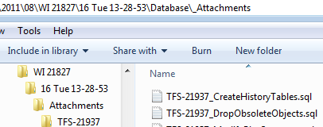

### The What

TFS Artifact Manager is a tool intended for downloading application "artifacts", such as database scripts and report files, from TFS. It pulls down these files from task source control changesets and attachments, organizes them, outputs task and change information, and helps combine and package database object changes. The tool's primary value is doing this in mass for a work item such as a Project work item, where it will enumerate all linked scenarios, issues, bugs, and tasks, providing the complete set of non-.net source code changes that need to be deployed for a given software release.  
  

  
  
  

### The Why

 The .net application code side of our release management process is fairly automated and painless, with the exception of merging some code in TFS such as certain XML-based files such as project files. The same has not been true with other project items such as reports and especially database changes.  
  
Our continuous integration process does automatically deploy report changes on checkins in certain environments, and it pulls down and combines source controlled database changes. However that only solves part of the problem and managing these artifacts has historically been painful to say the least.  
  

### The History

This tool was created by the great [Bryant Brabson](http://twitter.com/#!/bryantbrabson) to help pull together these changed artifacts for a given software release. Upon his sad departure I became the next victim of managing the release engineering for this large operational app. I took what was started and made a number of large additions and changes where I could find the time between deployments. While this utility is somewhat technology and process specific, it is not company-specific per se so I decided to release the source. However some changes would likely be needed to adapt the tool to different processes.  
  

### The Setup

Some details on the setup for the app I have been using this tool with are below. The tool does not really care what database or reporting system is in use; it is simply pulling changeset files and attachments where the file extensions match what is configured for the associated work items.  

- Source Control, Work Item Tracking: TFS 2008 with MSF Agile process template

- Not tested against TFS Server 2010 yet but probably works
- Older, customized version of MSF Agile process template
- Some customizations likely needed depending on process template details (related work items etc.)

- Database: Oracle

- Database file extensions are configurable
- Database Packager view allows selection of Oracle/SQL Server for previewing SQL (syntax highlighting)

- Database Source Control: Toad for Oracle using TFS MSSCCI provider

- Hopefully native use of Toad's TFS provider soon

- Reporting: Sql Server Reporting Services

- Report file extensions are configurable

### Configuring the Tool

Some one-time configuration is available in File--> settings, namely the TFS server value.  
  
  

In the app directory there are files ReportFileTypes.xml and DatabaseFileTypes.xml that specify the file extensions that help categorize and organize the artifact changes. These are also content files in the main source code project and get copied into the bin folder when changed.  

\[xml\] <?xml version="1.0" encoding="utf-8"?> <FileTypeInfo TypeName="Database" FileType="Database"> <FileExtensions> <FileExtension Category="Packages" Extension="PKB" Name="PACKAGE BODY" /> <FileExtension Category="Packages" Extension="PKS" Name="PACKAGE" /> <FileExtension Category="Functions" Extension="FNC" Name="FUNCTION" /> <FileExtension Category="Procedures" Extension="PRC" Name="PROCEDURE" /> <FileExtension Category="Triggers" Extension="TRG" Name="TRIGGER" /> <FileExtension Category="Views" Extension="VW" Name="VIEW" /> <FileExtension Category="SQL" Extension="SQL" Name="SQL" /> </FileExtensions> </FileTypeInfo> \[/xml\]  

### Running Mass Download

  

Work Item Selection

A mass download is started by keying in a valid TFS work item id. It is intended to be a project work item but any work item suffices. The tool will validate the work item id and retrieve the title but adding a dialog to select a work item via a team or personal query or similar would be a nice enhancement.  
  

Source Control Exclusions (Artifact Path Filtering)

Next a set of source control exclusions may be entered to exclude source code paths that do not have artifacts, such as branches containing .net application code. The tool could be changed to instead only supply paths where there are artifacts, or to ignore or include based on file extension but this fit our needs. The only paths that might need entering are ones that have changesets linked to the root work item through related work items. It will not hurt if some code paths are included; the changeset files will just get dumped into an Other folder. Currently the exclusions field is a simple newline-delimited field and I have not yet added the ability to browse and pick source control paths.  
  

Processing

  
A Fetch button initiates the processing and processing time depends on the size of the release, determined by the number of linked work items, the number of changesets in the associated tasks, source control exclusions and file type configurations. For a maintenance release of around 80 tasks consisting of 500+ changesets, processing time was usually just under 2 minutes.  
  

The link relationship between work items that the tool currently expects is:  

Root Work Item (i.e. Project) => Scenario or Issue or Bug => Task

The root work item does not have to be a project work item type but the rest is fixed. A predicate specifies the condition for the level between the root work item and the tasks. Small changes could be made if there are additional levels between the root work item and the tasks (product backlog items for example).

  
  

### Mass Download Output

When the mass download completes, it displays a log of the processing details and opens the folder it created which by default is relative to the exe location.  
  

Database

  
Files are organized into the database folder based on matches with DatabaseFileTypes.xml. The schema/database is determined via everything up to the first "." in the filename. Within the schema folders are subfolders for each of the database object type changes (views, functions, etc.), according to the configuration and the found changesets. In each of these folders reside the files of the DB changes which are current to the last (most recent) changeset in discovered tasks which are not closed. Changes found in tasks not Closed are moved into an \_Incomplete subfolder per object type. Likewise deleted objects are moved into \_Deleted subfolders.  
  

For each of the DB object type folders, a combined script is created (i.e. SCHEMA\_A.Views (10).sql) when more than one change was found. Each database script file is also tagged with information on the last changeset made, with some exceptions.  
  
  

In the root database output folder the app produces a DatabaseChanges.xml metadata file with detailed information on each database change. This is mostly for use by the Database Packager view in the app, allowing packaging the database changes at a later date than when the mass download was performed. More on the Packager view shortly.  

\[xml\] <?xml version="1.0" encoding="utf-8"?> <DatabaseChanges> <Metadata> <RootDatabaseFolder>C:\\temp\\TFSArtifactManager\\2011\\08\\WI 21827\\16 Tue 13-28-53\\Database</RootDatabaseFolder> <GeneratedAt>2011-08-16T13:31:23.2556472-04:00</GeneratedAt> <LastSavedAt>2011-08-16T13:31:27.7520968-04:00</LastSavedAt> <RootWorkItemId>21827</RootWorkItemId> <DeletedSubDirName>\_Deleted</DeletedSubDirName> </Metadata> <Changes Count="153"> <Included Count="0" /> <Excluded Count="153"> <Change File="SCHEMA\_A.RISK\_REVIEWS.PKB" Schema="SCHEMA\_A" Type="PACKAGE BODY"> <FilePath>SCHEMA\_A\\Packages\\SCHEMA\_A.RISK\_REVIEWS.PKB</FilePath> <FirstChanged>2011-06-08T16:06:49.767-04:00</FirstChanged> <IsAttachment>false</IsAttachment> <IsManualAdd>false</IsManualAdd> <LastChanged>2011-06-08T16:06:49.767-04:00</LastChanged> <ServerItem>$/MainProject/Database/Dev/DEV1/SCHEMA\_A/Packages/Credentials</ServerItem> <ChangeTypes> <ChangeType>Edit</ChangeType> </ChangeTypes> <Tasks Count="1"> <Task Id="21939" AssignedTo="Geoffrey Hudik" State="Closed" Title="Global text change for LRMO" /> </Tasks> </Change> <!-- remaining changes removed for brevity --> </Excluded> </Changes> </DatabaseChanges> \[/xml\]

Attachments

  
Attachments are downloaded into an Attachments folder in the output path with a folder per TFS task with attachments. Task attachments with a .sql file attachment are also copied into an \_Attachments folder under the Database folder; these are sql files that may need to be run for deployment but are not source-controlled changes (data migratation scripts etc.).  
  

Reports

Reports are simply all pulled down into a single folder according to any changesets with file changes matching ReportFileTypes.xml. Incomplete and deleted changes are organized the same as database changes are.  
  

Task Info Files

In the Tasks subfolder various text files are created with information on tasks for the release as well as artifact changes by task. Below is a partial sample from one such file:  

32 Closed Tasks with Artifacts
267 Artifact Changes

Global text change for LRMO
TFS #21939 \[Closed\] by Geoffrey Hudik
    Database\\\_Attachments\\TFS-21939\_RISK\_ALTERS.sql
    \[Task Attachment\]

    Database\\\_Attachments\\TFS-21939\_RISK\_STATUS\_UPDATE.sql
    \[Task Attachment\]

    Database\\SCHEMA\_A\\Packages\\SCHEMA\_A.RISK\_REVIEWS.PKB
    $/MainProject/Database/Dev/DEV1/SCHEMA\_A/Packages/Credentials

    Reports\\RiskHistoryReport.rdl
    $/MainProject/Reports/Dev/Reports.MainProject.Credentials

  
  

Artifacts by Task

  

Artifact changes are also output per-task as well. This does create some file duplication but I often found it helpful to have these file changes together by task, especially for subsequent, partial releases. For initial deployments, releasing by task would often mean deploying some of the same objects multiple times.  
  

### Mass Download: Database Packager

The Database Packager view provides the following functionality:  

- Viewing and filtering a list of database script files generated
- Previewing script files in a popup SQL editor
- Selecting which database script files to include for a deployment. i.e.:
    - choosing a combined views sql file instead of each individually
    - excluding new triggers that may be included in new table scripts
- Specifying the order in which to run script files
    - Order is often ignored for most PL/SQL objects such as views, packages, functions
    - Invalidated objects can be fixed with recompile after all is deployed
    - Mostly used for schema changes such as table alters or additions, data migration scripts
- "Packaging" the included script changes to a directory with filenames prefixed numerically to indicate run order

  

  

Click image for larger version

  

This view is accessed initially via the Database Packager button next to the Fetch button once the mass download is complete. It can be accessed later via menu or toolbar and using the Open toolbar button and browsing to DatabaseChanges.xml in the Database output folder.  
  

Use of the tool is pretty straightforward; filter, sort, and inspect changes at the top, select appropriate changes and click Include (Insert). The order the items are included will be the order they are packaged but they can be rearranged individually with Move Up (Ctrl+Up) or Move Down (Ctrl+Down). Drag and drop can also be used to rearrange the Included items though it is a little flaky at the moment. Any SQL attachments to be included must have the schema value set as scripts are packaged per schema. Clicking Package will copy and rename the included items to a publish folder; there is currently a gap of 5 in the numbering prefix in the filenames to allow for potential manual insertions/rearranging later.  
  

All blue links may be clicked to open the file, folder, or TFS item. Filenames may be clicked (or press spacebar on keyboard) to preview selected database file(s) in a sql viewer. The Database Type combobox in the toolbar controls what syntax to use for syntax highlighting (PL/SQL or T-SQL).  
  
  

### Single Work Item Download

Mass download may be the most useful for a major release but often where I work there are various ad-hoc, mini-deployments such as ad-hoc reports or small database changes. Changed artifacts for a single task are retrieved using a work item changeset retriever that can be accessed via a console app (ChangesetRetriever.exe) or GUI via the Work Item command in TFS Artifact Manager:  
    
  

File output for a single task is simplified over mass download and might look like the below example:  

WorkItemInfo.txt
Attachments\\SomeDataScript.sql
Changes\\ChangesetInfo.txt
Changes\\Database\\001\_SCHEMA\_A.OBJECT\_1.PKB
Changes\\Database\\002\_SCHEMA\_A.OBJECT\_2.FNC
Changes\\Database\\TFS\_22011\_Combined.sql
Changes\\Reports\\Report1.rdl
Changes\\Reports\\Report2.rdl

Despite both the mass and single work item download performing similar functions they were developed separately and share very little in terms of code and requirement needs.  
  

### Artifacts downloaded, now what?

On the report side we have a powershell script and an exe that works with SR.exe to deploy SSRS changes. On the database side I've started a SQL editor that allows selection of multiple databases to run the SQL against that I use among our 6 Dev and Test environments; Quest Script Runner or Toad's Script Manager sort of work but I found their use painful. For environments beyond Test I hand the packaged scripts to our DBA to be run with whatever voodoo they do. It did not quite make sense to me to link these deployment tools with the TFS Artifact Manager at this time. The database deployment tool has a long way to go before it is ready for release but perhaps someday.  
  

### Future Enhancements

One thing that would be nice is supplying a date or other criteria to the mass download piece to only download changes within a certain window. For additional deployments I currently have to either cherry-pick new changes I know about or re-deploy everything (which usually is not feasible). Likewise with the Database Packager there is currently no way to "merge" a package of database scripts from a prior run of the tool with that of a later one.  
  

### Alternatives

On the database side of things there are some tools I have started looking into that might eventually replace most use of this tool for database changes. These include:  

- [Toad Extensions for Visual Studio](http://toadextensions.com/index.jspa?product=visualstudio)
- [Oracle Change Management Pack](http://download.oracle.com/docs/html/A96679_01/overview.htm)

The primary hold-up at the moment is price. I believe Toad Extensions runs around $4k and the change management pack requires Oracle's enterprise edition which is another ballpark of cost entirely.  
  

### Source

Much of the source was written in small breaks in-between deployments in a rush so it could certainly use some refactoring. The code and bits are available at [https://github.com/thnk2wn/TFSArtifactManager](https://github.com/thnk2wn/TFSArtifactManager)
