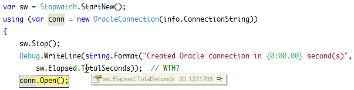

This afternoon I executed a simple DDL statement with Oracle.DataAccess.dll and noticed it took upwards of 30 seconds when it should have come back in a second or so. In stepping through the code I noticed the large delay was in creating the Oracle Connection, not connecting to the database or executing the SQL:  

  
  

Oh Oracle you are the snake to my mongoose, or the mongoose to my snake. Either way it's bad.  
  

I vaguely remembered a similar issue years ago that had something to do with a logging directory not existing. I no longer had the email I sent with the details nor could I find the information online. So I fired up [Process Monitor](http://technet.microsoft.com/en-us/sysinternals/bb896645) and found several writes to the below files:  

C:\\Users\\username\\Oracle\\oradiag\_username\\diag\\clients\\user\_username\\host\_1707249666\_80\\alert\\log.xml
C:\\Users\\username\\Oracle\\oradiag\_username\\diag\\clients\\user\_username\\host\_1707249666\_80\\trace\\sqlnet.log

In inspecting the log files I found hundreds of occurrences of the below error:  

Directory does not exist for read/write 
\[C:\\app\\username\\product\\11.2.0\\client\_2\\log\] \[\]

This was further confirmed in Process Monitor entries:  

1:52:13.8086867 PM  OracleScriptExecutor.vshost.exe 8556    CreateFile  
C:\\app\\username\\product\\11.2.0\\client\_2\\log   NAME NOT FOUND  
Desired Access: Read Attributes, Disposition: Open, Options: Open Reparse Point, 
Attributes: n/a, ShareMode: Read, Write, Delete, AllocationSize: n/a

At first I just tried creating the Log directory but that didn't work. I checked security on the directory but it seemed sufficient. To resolve the error I had to create the folder structure "log\\diag\\clients" in my "C:\\app\\username\\product\\11.2.0\\client\_2" directory.  
  

Afterwards I could get through the OracleConnection ctor in a reasonable time:  
  
  

With the details in hand I changed my web search and discovered [this Oracle forum entry](https://forums.oracle.com/forums/thread.jspa?messageID=9812932) posted 3 years ago! 3 years and this problem is still not fixed? Come on Oracle, get it together.
