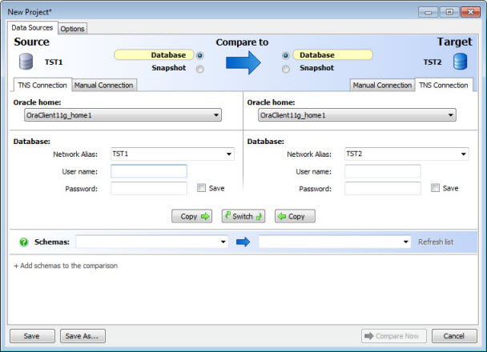
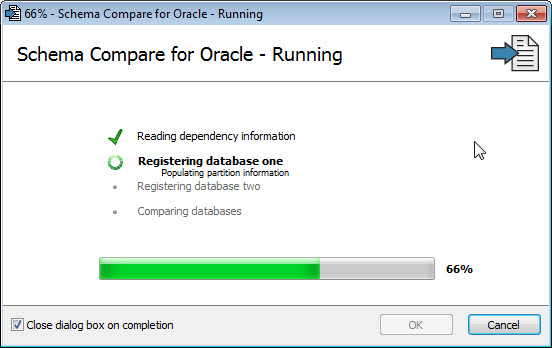
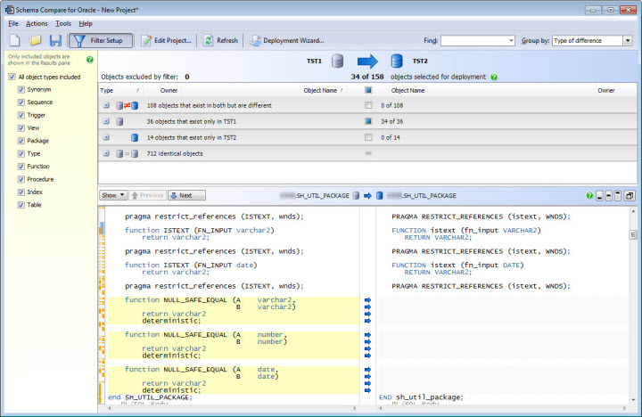
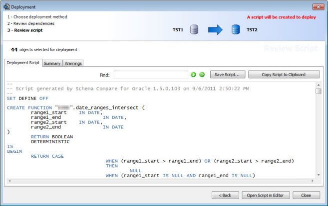
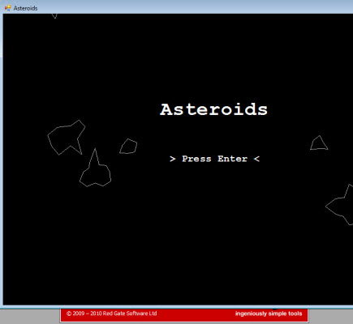

As part of my recent role in application release management, I have had to compare and sync various objects across Oracle databases. This was not fun work and I decided to evaluate some different tools to make this easier. The tool I have been working with recently is Red Gate's [Schema Compare for Oracle](http://www.red-gate.com/products/oracle-development/schema-compare-for-oracle/). In this post I provide a brief walkthrough of its basic features and offer up my thoughts on the tool as well as how I feel it compares with other alternatives. The version of the tool shown here is 1.5.0.103. 
  

### The Need

The major need I have for a database comparison and sync tool is for parallel deployments within the same environment; for example, syncing the schemas of one of our 3 development databases with another. These syncs happen at different points including when business validation starts near the end of an iteration, when parallel development is needed for application production hotfixes, or during different development or testing efforts. The other major need is for ensuring databases are largely in sync when they are expected to be, when preparing for or reviewing a deployment or troubleshooting differences in application behavior across environments.  
  

We largely forego using such tools for a couple scenarios. First our DBAs handle larger syncs such as refreshing a development database from production. Likewise we do not use such tools for change management to deploy changes from development on up the chain to production; I discuss that somewhat in my post on the [TFS Artifact Manager](/tech/2011/8/17/tfs-artifact-manager.html).  
  

### Starting a New Compare

The process starts with creation of a new project and selection of the databases and schemas to be compared.  
    
  

Next there are various options that should be reviewed before starting; each has a full description to the right when hovering with the mouse. There are a couple I want to call attention to after the screenshot.  

    
  

There are some options Red Gate was kind enough to add for me based on my early feedback:  

- **Include SET DEFINE OFF** - Some objects in my original comparisons had ampersands (&) and as a result I was getting prompted for substitution variables when running the generated script. This disables that; it is not turned on by default but I would recommend checking it.

- **Ignore slow dependencies** - This has to do with type objects and REF constraints as they relate to cross-schema dependencies. This greatly increased performance early on when dealing with very large schemas. Other performance improvements have been made that have made this less important now.

- **Ignore dependent objects in other schemas** - This option also was helpful in performance but I used it more to help prevent pulling in dependent objects in other schemas upfront. With the way our security is setup, we often cannot perform DDL operations logged into the database as another user. We generally compare and deploy one schema at a time, logged in as the schema owner. Using this option prevents me from manually having to exclude various objects in other schemas later on when using the Deployment Wizard.

#### Options - What's Missing?

When contrasted with a schema comparison tool such as what is available in Toad for Oracle, the options here seem very limited. However I personally find the 100+ checkboxes across 4 tabs in Toad to be rather dizzying and honestly I do not really know what at least a third of them truly do (some do have status bar hints on mouse-over). Also I have found with Toad that with certain checkboxes set, various Oracle errors can get thrown such as No Data Found and that can stop the whole process.  
  

On one hand it seems logical to have options for the object types to compare. On the other hand, I do not think having that would make a big difference in performance and Schema Compare allows you to easily exclude and filter objects based on type afterwards. There is something to be said for simplicity and that is Red Gate's mantra.  
  

One option from Toad I do really miss is "Format before comparison". In a perfect world everyone would use the same SQL formatting styles but in reality it is not easy to enforce. Many of the objects that were different only differed by formatting. The tool has options to ignore case and white space which helps but formatting differences were also around multi-line constructs in terms of wrapping, nesting, aligning and the like. I realize that full formatting functionality is far from trivial but this was a key option in my use.  
  

### Running the Database Comparison

After setting up the connection and options, clicking the Compare Now button will launch a progress dialog that allows cancelling the operation.  
  
  

This is where I first ran into an issue with the initial trial version I used. Against one of our large schemas (some 3400+ objects), the tool was taking hours to run. I contacted Red Gate support to detail the performance issue as well as some other suggestions I had. They were immediately responsive and had me [turn on verbose logging](http://bit.ly/ogAYVv) to troubleshoot the issue. Within the same business week they had a new non-public build of the application for me to try which had the new options mentioned above on performance, cross-schema impacts, SET DEFINE OFF, etc. The level of support they provided me is pretty much unheard of in my experience.  
  

The performance options helped but running the tool was still very slow compared to minutes with Toad. I was told one reason for this was because Schema Compare builds a full dependency tree to script things in a correct order whereas I believe Toad and some other tools make no attempt to do this. In some cases order is not a critical as PL/SQL objects and views can be easily recompiled afterwards. In other cases it is more important and either way it makes the process smoother.  
  

In looking at the log file and database activity, we could see the SQL the tool was generating. At that point our resident SQL optimizer [Jim Tilson](http://www.allthingsoracle.com/jim-tilson/) was able to refactor the SQL to make very significant performance improvements, in one case from around 10 minutes to under a second. We sent the SQL modifications back to Red Gate and again they quickly implemented these changes and provided us new application builds that dramatically reduced the time to reasonable numbers.  
  

In the end it turns out most of our performance issues were largely because we are still using an ancient 9i database due to a legacy app or two. I believe stats are not automatically gathered for the SYS schema on 9i and doing so almost implies logging in as the SYS schema which is far from ideal. Performance should be fine with gathering SYS stats on 9i or using an Oracle database from the past decade which handles this automatically.  
  

Currently the tool is running at < 2 minutes for a schema of ~800+ objects and around 28 minutes for one of 3400+ objects. However this is atypical in that we are still on 9i, haven't generated statistics on the SYS schema, have a fairly large data model and we are running database restores at the moment. For most the execution time should be minimal.

  
  

### Reviewing the Differences

When finished the differences are broken down by difference status and there are various options for grouping, filtering, sorting and searching. Selecting an object presents a nice SQL difference viewer to navigate each difference.  

    
  

If Schema Compare was closed at this point, the options would be saved but the comparison results would not be. A snapshot feature is provided which will do just that but it would be convenient if the app automatically created that snapshot, or at least prompted to do so.  
  

Each differing object can be checked or unchecked individually or in batch to determine the contents of the sync script to be generated. Once the desired items are included, the Deployment Wizard can be invoked to build the sync script.  
  

### Building the Sync Script

The deployment wizard walks through the major steps:  

1. **Deployment method** - The tool can execute the sync script or can just display, save, or send it to another program to be run. Personally I recommend coping the generated script to the clipboard an running it in the DBMS de jour, be that SQL Plus, Toad or what have you. If the script is executed in Schema Compare, any error can halt execution and it can be difficult to know where the error occurred (exact object / SQL).
2. **Review dependencies** - Allows including objects that reference or are referenced by the items chosen to be deployed
3. **Configure script** - Optionally shown if there are deployment issues to be addressed; allows choosing different actions to control the behavior.
4. **Review script** - Shows the deployment script and a summary of changes, as well as any warnings that may need to be considered.

  

    
  

### Running the Sync Script

The sync SQL that Schema Compare generated ran without issue overall. Early on I did receive a permissions related error but that was because I did not realize I had included an object in another schema other than the one I was logged into to run the SQL. The options Red Gate added on my behalf helped avoid this going forward but others may not have this issue if their Oracle security setup is more cross-schema friendly. The other problem was being prompted on bind variables early on but again, the SET DEFINE OFF option that was added solved this issue.  
  

### A Nice Bonus Feature

When writing this post at one point I noticed a game of Asteroids running. I did not know where it came from, whether it was an easter egg somewhere, a virus, or an accidental launch of a game I did not know I had. After a minute of research I realized that it was an easter egg game that pops up from Schema Compare's About screen if it is left open for at least 30 seconds or so. Perhaps I should not give that surprise away but it is a fun game and a cool little nugget. Now if only this could be launched during a database compare to pass the time :).  
  

    
  

### Competition

Competition makes for better products and I have tried a handful of Oracle schema tools so far. I am sure there are other good tools in this space and that further use of and updates to the tools I have tried may change my outlook. What follows are my thoughts on similar tools and how Schema Compare stacks up in my opinion.

#### Toad

Toad is what I started out with since it is what I already had. It may be the most common way of doing this, executes quickly, and has the most functionality and flexibility. Toad allows comparison of far more object types than Schema Compare (with many more options) so Red Gate's tool will not detect differences to less common items such as queues, jobs, DB links and the like. Toad's extra features do come at the cost of "complexity" and you will rarely hear me say the words simple, intuitive, friendly, modern or "standard Windows experience" when talking about Toad. The exact opposite is true with Schema Compare and other Red Gate products.  
  

The main roadblock with Toad was that the change script it generated was display-only so I could not do anything with it. I tried some clever ways to hack around that limitation but it wasn't worth it or fair to Quest :). The [Toad DB Admin Module](http://www.toadsoft.com/DBA/dba.html) is required to copy / save / use the sync script. The price I heard for that module is around $800 for one user but I believe it is also tied to the version of Toad being used; our 9.X DB Admin module key didn't work in 10.X. The price is not prohibitively expensive for all the module provides but with just wanting one feature, it is harder to justify with no a la carte option.  
  

Corporate spending requests can be difficult to get approved and with Quest maintenance support contracts, keeping the functionality active across Toad versions could be a roadblock. Further the Quest websites make no real mention of how you actually get this module if you want it. You pretty much have to figure out who to call and hope you do not get stuck with a high-pressure, low-tech salesman. Schema Compare is currently priced at $395 for a single user; I was fortunate enough to get a free license due to the level of feedback provided on the product.  
  

The other Toad issue previously mentioned is that certain combinations of options generated Oracle errors in my usage in the past. To be fair, some of those issues may have since been fixed and some may only appear depending on the schemas it is being used against.  
  

Schema Compare did appear to have a fuller dependency tree over Toad in terms of script ordering and deploying related objects. Toad claims it does the same even if it may be a bit more under the hood; in practice it was difficult to compare the results between products here so take this with a grain of salt. Schema Compare's Deployment Warnings, Conflicts, and general experience did seem friendlier than Toad's "better know what you are doing" feeling.  
  
At this point I would be remiss not to mention Quest's Jeff Smith ([blog](http://www.thatjeffsmith.com/) | [Twitter](http://twitter.com/#!/hillbillytoad)) who is an excellent technical Toad and Oracle resource and can be a helpful buffer with the Sales team. Our relationship is based entirely on my complaining about Toad over Twitter and he has been most gracious in helping and putting up with me.

#### TOYS

[Tool for Organizing Your Schemas (TOYS)](http://www.impacttoys.com/) is a lightweight, functional Oracle schema compare and sync tool. The main advantage for many is that it is free. On initial use I ran into some sort of configuration issue. The tool claims to be intuitive but I did not find that to be the case, at least not compared to Schema Compare. TOYS is no-frills but certainly provides value. One deal breaker for my use was that TOYS does not provide any way of selecting which objects get synchronized and workarounds such as editing the SQL script were not acceptable to me. I also did not like some of the generated SQL I found such as unnecessary object DROPS when CREATE OR REPLACE would suffice. Other limitations in the tool's documentation gave me pause as well. Some level of support is offered with the app but I would not expect a high level of support with a free tool.

#### Devart dbForge Schema Compare

[DevArt's dbForge Schema Compare](http://www.devart.com/dbforge/oracle/schemacompare/) sells from $150. I did not get a chance to really use it as it did not work on a 64 bit OS, at least not with TNS connections. That immediately turned me off the product, combined with a bad taste in my mouth from prior use of some Devart products to use Entity Framework with Oracle. When the x64 issue is fixed I may try the tool again.  
  

### Completing the Picture

I also evaluated Red Gate's [Data Compare](http://www.red-gate.com/products/sql-development/sql-data-compare/) during this process. A review here is out of scope but I found it worked nicely and complemented Schema Compare well. Unlike Toad it does not require setting up annoying database links and I found it much friendlier to use for comparing data. If you already own Toad however you get the functionality for free whereas Data Compare is another $395. If you buy both products I believe there is a discount but at that point the pricing is equivalent with Toad's DB Admin module. Toad's export as merge statements can also be used as a quick and dirty form of data comparison and sync.  
  

### Conclusion

Overall I am quite pleased with Red Gate's Schema Compare. The tool is in a good middle ground to me; it is not the cheapest nor the most expensive, not the most powerful but certainly not the least. Schema Compare gets the job done and in the simplest and most intuitive fashion. I cannot express how great Red Gate's team has been to work with; Tom Harris and Red Gate's team have provided an excellent level of customer support. The app could still use some more performance improvements, at least for older databases. If some additional features can be added without hurting performance or the application's ease of use, this tool will be even more attractive.  
  

### Updates

- 10/17/2011 - Updated information on the Schema Compare vs Toad comparison in regards to the dependency tree and script ordering.
