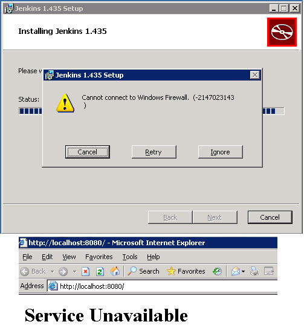
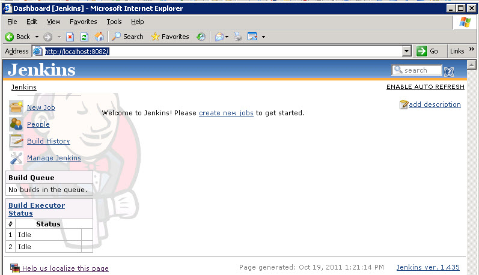

### Replacing Cruise Control

This afternoon I decided to start the process of trying out [Jenkins](http://jenkins-ci.org/) Continuous Integration. We have a large application that has been using Cruise Control for years and while it has worked well, it is time for an upgrade. I have heard good things about Jenkins but I have been a bit leery of it for .net builds given it is Java-based, [Windows support felt like more of an afterthought](http://jenkins-ci.org/content/windows-installers-are-now-available), and an apparent lack of good web content about it despite its popularity. A part of me has been more attracted to [TeamCity](http://www.jetbrains.com/teamcity/) but I like the open nature of Jenkins. TeamCity allows a lot for free but I am concerned about painting myself into a corner if I cannot get financial support for it.  
  

### Installing Jenkins on Windows

I downloaded the Windows installer from the [Jenkins home page](http://jenkins-ci.org/) and proceeded to install it on an older Windows Server 2003 box. The setup quickly gave me an error about Windows Firewall and then it failed to startup after the installation.  
  
  
  

The Windows firewall issue I ignored and found this [Jenkins bug was already reported](https://issues.jenkins-ci.org/browse/JENKINS-10886). My assumption was that this was not a critical error.  
  

As to the service failing to start, I first thought that maybe I needed to install the JDK or at least the Java runtime but I assumed that was bootstrapped into the installer [which I later verified](http://jenkins-ci.org/content/windows-installers-are-now-available). I tried restarting the Jenkins Windows Service but it would immediately stop after starting. The service filename lead me to C:Program FilesJenkins which in turn lead me to jenkins.err.log and jenkins.out.log.  

The first log was not overly useful but jekins.out.log indicated a port 8080 conflict:  

\[Winstone 2011/10/19 12:46:35\] - Container startup failed
java.io.IOException: Failed to start a listener: winstone.HttpListener
   at winstone.Launcher.spawnListener(Launcher.java:250)
   at winstone.Launcher.<init>(Launcher.java:202)
   at winstone.Launcher.main(Launcher.java:398)
   at sun.reflect.NativeMethodAccessorImpl.invoke0(Native Method)
   at sun.reflect.NativeMethodAccessorImpl.invoke(Unknown Source)
   at sun.reflect.DelegatingMethodAccessorImpl.invoke(Unknown Source)
   at java.lang.reflect.Method.invoke(Unknown Source)
   at Main.\_main(Main.java:268)
   at Main.main(Main.java:96)
Caused by: java.io.IOException: Failed to listen on port 8080
   at winstone.HttpListener.getServerSocket(HttpListener.java:117)
   at winstone.HttpListener.start(HttpListener.java:70)
   at winstone.Launcher.spawnListener(Launcher.java:241)
   ... 8 more
Caused by: java.net.BindException: Address already in use: JVM\_Bind
   at java.net.PlainSocketImpl.socketBind(Native Method)
   at java.net.PlainSocketImpl.bind(Unknown Source)
   at java.net.ServerSocket.bind(Unknown Source)
   at java.net.ServerSocket.<init>(Unknown Source)
   at java.net.ServerSocket.<init>(Unknown Source)
   at winstone.HttpListener.getServerSocket(HttpListener.java:112)

  

This server already has various apps and websites running including SharePoint and TFS and port 8080 was taken. Hopefully soon I will have a new, clean build server to work from and this problem may not be present. For the time being I am stuck with this server. After a little digging I found the port defined in jenkins.xml which I changed to 8082...  

\[xml\] <arguments>-Xrs -Xmx256m -Dhudson.lifecycle=hudson.lifecycle.WindowsServiceLifecycle -jar "%BASE%jenkins.war" --httpPort=8082</arguments> \[/xml\]  

... and voila now the fun can begin. I am sure I will run into various challenges configuring everything (more Jenkins posts to come I suspect) but at least it is installed and running now. Looks like some of my first steps will be adding the [MSBuild](https://wiki.jenkins-ci.org/display/JENKINS/MSBuild+Plugin) and [TFS](https://wiki.jenkins-ci.org/display/JENKINS/Team+Foundation+Server+Plugin) plugins.  
  

