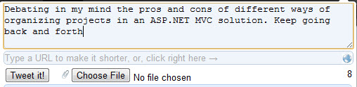
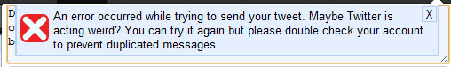
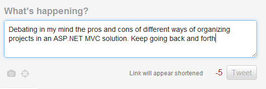
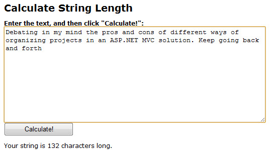
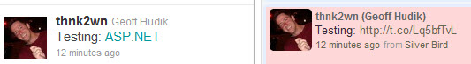

<Rant>  

A few minutes ago I post this tweet using the [Silver Bird](https://chrome.google.com/webstore/detail/encaiiljifbdbjlphpgpiimidegddhic) Chrome extension:  
  
  

A moment later I receive this error:  
  
  

So I try pasting the tweet into twitter.com and it tells me I am 5 characters over the limit though Chromed Bird showed I had 8 characters remaining:  
  
  

Okay so how long was my tweet exactly?  
  
  

Then I happened to catch "Links will appear shortened" from twitter.com. At first I thought "what link?" Oh the ASP.NET "link" of course which Twitter happily and automatically converts to "http://t.co/Lq5bfTvL" for my protection and convenience I suppose. Expanding the length of my tweet past the limit in a hidden fashion so the tweet fails is not so convenient. So I tweet "Testing: ASP.NET" which may look okay on the website but it really changes how it comes across in some clients:  

  
  

The other day I was discussing Mint.com in a tweet that I sent across to Facebook where the t.co translation made the facebook post almost meaningless. Annoying. Solutions? I did not mind as much when I had a full link with "http://" and Twitter shortened (sometimes lengthened) that but this is a new level of annoyance. Perhaps part of the problem is Chromed Bird but certainly not fully. I suppose it is my fault for not using one of the "offically approved" Twitter clients. Silly me.  

</Rant>
