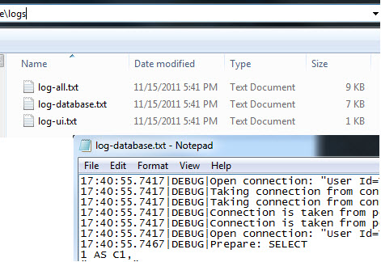

Today I wanted to add some simple file logging to my ASP.NET MVC application and I thought it would be a good time to try out [NLog](http://nlog-project.org/). I used [log4net](http://logging.apache.org/log4net/) in the past but it has become stale and NLog appeared more modern and capable. I liked what I saw with NLog but I wanted to abstract it away behind [DI](http://en.wikipedia.org/wiki/Dependency_injection) / [IOC](http://en.wikipedia.org/wiki/Inversion_of_control) so:

- it would not get in the way of testing
- it would not clutter my code with a dependency on a specific logging framework everywhere
- the interface could be changed if needed

I wanted to still maintain some of the power and flexibility of NLog though, namely the use of multiple loggers determined by context and configuration.  
  

### Setup

#### NLog

I installed NLog via their [Nuget package](http://nuget.org/List/Packages/NLog) though I also ended up installing the MSI from their download page for the extras such as the item templates, XSD schema, etc. though I believe there are separate NuGet packages for some of that as well.

#### Ninject

I am a big fan of [Ninject](http://ninject.org/)'s DI/IOC framework. There are [two primary ways](https://github.com/ninject/ninject.web.mvc/wiki/Setting-up-an-MVC3-application) of setting up Ninject for ASP.NET MVC3. Originally I went with NuGet but I had issues with that approach and went with the "older" NinjectHttpApplication route. In hindsight I think another issue caused the problems I had there and I may revert back to that approach.  
  

### Logging interface

First a simple logging interface. For the time being I just pulled out what I considered the most common signatures from NLog's Logger class. It is easy enough to add other members later if/when needed. I did not see any reason to change these signatures currently and mirroring Logger makes implementation easier.  

\[csharp\] namespace App.Core.Infrastructure.Diagnostics { public interface ILog { void Debug(string format, params object\[\] args); void Error(string format, params object\[\] args); void Fatal(string format, params object\[\] args); void Info(string format, params object\[\] args); void Trace(string format, params object\[\] args); void Warn(string format, params object\[\] args); bool IsDebugEnabled { get; } bool IsErrorEnabled { get; } bool IsFatalEnabled { get; } bool IsInfoEnabled { get; } bool IsTraceEnabled { get; } bool IsWarnEnabled { get; } } } \[/csharp\]  

### Implementing ILog

By nature of inheriting from NLog's Logger the ILog interface is satisfied since it is mirrored. At one point I started some custom functionality but ended up not needing it though I am likely to add something here before long.  

\[csharp\] using NLog;

namespace App.Core.Infrastructure.Diagnostics { public class Log : Logger, ILog { // something useful to come here I'm sure :) } } \[/csharp\]  

### DI / IOC Container Registration

Next up the ILog binding is created in the appropriate module. The binding is to a method which gets the full type name of the type being injected into. That class name is then passed into NLog's LogManager.GetLogger method to get the appropriate logger based on the context.  

\[csharp\] using NLog; using Ninject.Modules; using App.Core.Data.Diagnostics;

namespace App.Core.Infrastructure.DI { internal class WebAppModule : NinjectModule { public override void Load() { Bind<ILog>().ToMethod(x => { var scope = x.Request.ParentRequest.Service.FullName; var log = (ILog)LogManager.GetLogger(scope, typeof(Log)); return log; }); /\* other code omitted for brevity \*/ } } } \[/csharp\]

### Sample Usage (Data Access)

In a DatabaseMonitor class an ILog instance will be constructor-injected for later logging of Entity Framework database activity to a log file. I removed implementation of IDatabaseMonitor and DevArt's OracleMonitor use for brevity.  

\[csharp\] using App.Core.Data.Interfaces; using App.Core.Infrastructure.Diagnostics; using Devart.Common; using Devart.Data.Oracle; using JetBrains.Annotations;

namespace App.Core.Data.Diagnostics { \[UsedImplicitly\] internal class DatabaseMonitor : IDatabaseMonitor { private readonly ILog \_log;

public DatabaseMonitor(ILog log) { \_log = log; }

private void OracleMon\_TraceEvent(object sender, MonitorEventArgs e) { \_log.Debug(e.Description); }

/\* other code omitted for brevity \*/ } } \[/csharp\]

### Sample Usage (Controller)

Besides the data access classes the controllers are the other major logical area for logging. This is a trivial example as logging the results of controller action processing is the real value but again I cut that for brevity.

\[csharp\] using App.Core.Data.Interfaces; using App.Core.Infrastructure; using App.Core.Infrastructure.DI; using MvcContrib.Filters;

namespace App.Core.UI.Controllers { \[PassParametersDuringRedirect\] public partial class ContractSearchController : ControllerBase { private readonly IRepository \_repository; private readonly ILog \_log;

\[UsedImplicitly\] \[DepInject(Comment = "Required due to T4MVC partial ctor")\] public ContractSearchController(IRepository repository, ILog log) { EnsureThat.ArgumentIsNotNull(repository, "repository"); EnsureThat.ArgumentIsNotNull(log, "log"); \_repository = repository; \_log = log; \_log.Debug("Contract search controller instantiated"); } /\* other code omitted for brevity \*/ } } \[/csharp\]

### NLog.config

NLog can be [configured in different ways](http://nlog-project.org/wiki/Configuration_file) including web.config but I like the default approach of the separate NLog.config. Here I define sources for a database log file, UI log file, a combined (all) log file and Debug output. Then loggers are configured with a name pattern that will match the namespaces used above to associate logging to the appropriate logger which is associated to one or more targets.

\[xml\] <?xml version="1.0" encoding="utf-8" ?> <nlog xmlns="http://www.nlog-project.org/schemas/NLog.xsd" xmlns:xsi="http://www.w3.org/2001/XMLSchema-instance">

<!-- make sure to set 'Copy To Output Directory' option for this file --> <!-- go to http://nlog-project.org/wiki/Configuration\_file for more information -->

<targets async="true"> <target name="dbFileTarget" xsi:type="File" fileName="${basedir}/logs/log-database.txt" deleteOldFileOnStartup="true" layout="${time}|${level:uppercase=true}|${message}" archiveEvery="Day" maxArchiveFiles="2" /> <target name="uiFileTarget" xsi:type="File" fileName="${basedir}/logs/log-ui.txt" deleteOldFileOnStartup="true" layout="${time}|${level:uppercase=true}|${message}" archiveEvery="Day" maxArchiveFiles="2" /> <target name="allTarget" xsi:type="File" fileName="${basedir}/logs/log-all.txt" deleteOldFileOnStartup="true" layout="${time}|${level:uppercase=true}|${logger}|${message}" archiveEvery="Day" maxArchiveFiles="2"/> <target name="debugTarget" xsi:type="Debugger" layout="${time}|${level:uppercase=true}|${logger}|${message}" /> </targets>

<rules> <logger name="\*" minlevel="Debug" writeTo="debugTarget,allTarget" /> <logger name="App.Core.Data.\*" minlevel="Debug" writeTo="dbFileTarget"/> <logger name="App.Core.UI.\*" minlevel="Debug" writeTo="uiFileTarget"/> </rules> </nlog> \[/xml\]

### Output

That is pretty much it; it just works. In the below example the all file is slightly larger than the sum of the individual log files since the combined log file's [layout](http://nlog-project.org/wiki/Layouts) includes the name of the logger whereas that is implied and therefore omitted in the more specific log files.  

  
  

### Final Thoughts

This is the result of my first day evaluating NLog so I expect to change it as things progress. So far though I am impressed with the flexibility and ease of use with NLog and I am content with it now that it is playing well with Ninject. After doing this first pass I seemed to remember seeing some Ninject logging extensions in the past and sure enough there is a [Ninject.Extensions.Logging.nLog](http://www.nuget.org/List/Packages/Ninject.Extensions.Logging.nlog) NuGet package and that may be worth looking at as well.
