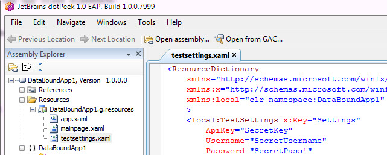
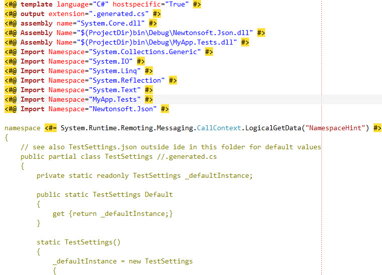
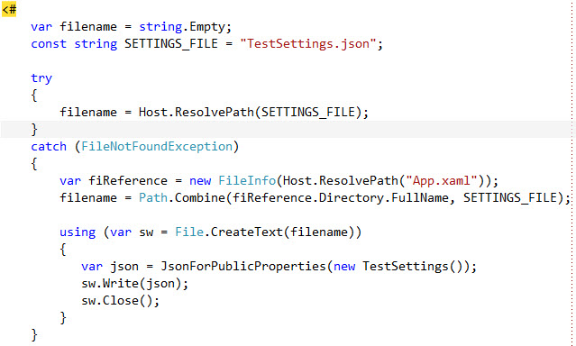
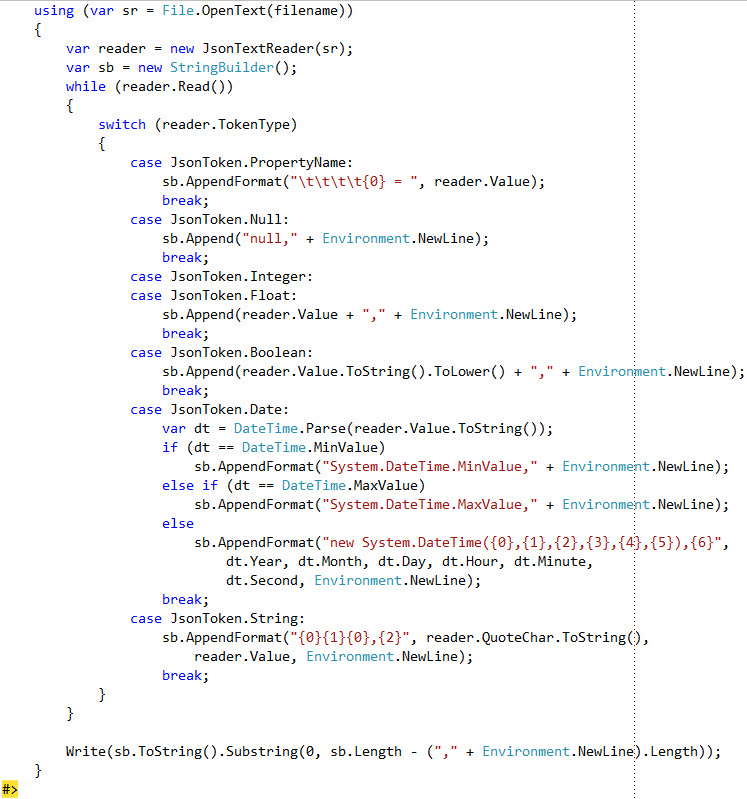
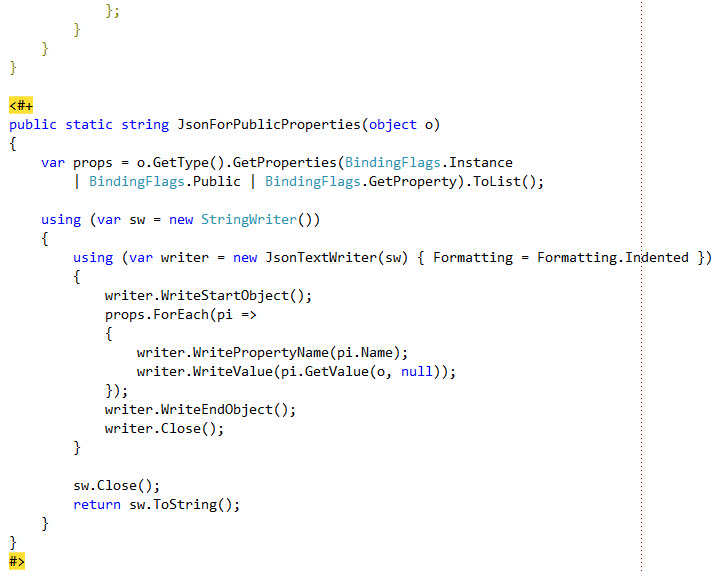

File this post under the OCD, late night, crazy category. I just started a new Windows Phone application and have been working on a client for a service my app depends on. I wanted to test out the service interactions but with unit tests of my WP7 class library, not via building out a user interface.  
  
Quickly there were a couple minor snags that I allowed myself to get bogged down in:

- **State of testing support** - The last time I attempted unit testing with WP7 I was not real happy with the testing support. Is it better now? Is there another better approach? More on this in an upcoming post; I changed my mind and decided to follow the single responsibility principle for this post :).

- **Where to put service credentials, other test settings** - The service API being tested requires a private API key, username and password. I thought the client and tests might go public later and I did not have a separate test account, only my own credentials. Where and how should these values be stored and passed to the tests so they are somewhat protected and configurable?

  

### Config Settings Goals

In this context I am referring to settings as the rough equivalent of standard , not runtime settings for the app and user. My context is also currently one of a unit testing app project but some of this could be applicable to other projects as well.  
  

There are a few options but I wanted one that addressed the below, some of which conflict. Goals:  

1. **Private settings** - Namely keeping the credentials out of source control and any public distribution. I need to keep this data out of the tip as well as all revision history. If I have to remember to remove personal settings prior to a commit or publish, it is only a matter of time before I forget.
2. **Configurable** - Ideally these settings could be edited in a file w/o being manually typed into app code
3. **Isolation** - Some way to keep the more private settings separated from everything else, maybe outside the solution / IDE
4. **Default settings** - Exclusions and isolation implies the container for these settings might not exist (new source control pull etc.). However everything still needs to build and there should be a way to create empty/default settings when not found. It also needs to be obvious where/how people supply their own values for these settings.
5. **Runtime performance** - Preferably there would not be any real runtime I/O for these settings so test performance does not take a hit. These "app settings" are not changing during the course of an app / test execution run but they may change between runs.

### Hard-coding settings

Manually hard-coding the credentials to test with is the easiest option and what I started with but it does not address any of goals above with the exception of #5 Runtime performance.  
  

### App.config

There is not really a concept of app.config for windows phone projects. Someone created a modified [WP7 version of the mobile configuration block](http://blogs.msdn.com/b/priozersk/archive/2010/07/06/app-config-for-wp7-applications.aspx) that could be used but it felt a bit forced to me and has some overhead.  
  

### Isolated storage

Isolated storage is more suited for runtime user settings / options / preferences to me. [IsolatedStorageSettings.ApplicationSettings](http://msdn.microsoft.com/en-us/library/cc221360(v=vs.95).aspx) is an option but I cannot easily create, view and edit app config type settings without doing something programmatically or using some kind of [isolated storage browser](http://wp7explorer.codeplex.com/documentation). The data will not be there to start with and the initial values have to come from somewhere. Additionally changes to the settings will be lost anytime the emulator app is restarted. Even all that aside, isolated storage doesn't quite meet the runtime performance goal and there are various caveats and serialization issues I have run into in the past. If you are interested in runtime user settings however, the code in my [Codestock](/codestock-wp7) post has an example (just search for settings).  
  

### App.xaml

A custom settings class can be created and instantiated in App.xaml resources. First a simple TestSettings class:

\[csharp\] public class TestSettings { public string ApiKey { get; set; } public string Username { get; set; } public string Password { get; set; }

private static TestSettings \_default;

public static TestSettings Default { get { return \_default; } set { if (null == \_default) \_default = value; } } } \[/csharp\]

Next TestSettings.xaml to instantiate and configure the class.

\[xml\] <ResourceDictionary xmlns="http://schemas.microsoft.com/winfx/2006/xaml/presentation" xmlns:x="http://schemas.microsoft.com/winfx/2006/xaml" xmlns:local="clr-namespace:DataBoundApp1" > <local:TestSettings x:Key="Settings" ApiKey="" Username="" Password="" /> </ResourceDictionary> \[/xml\]

Then in App.xaml the resource is merged in:

\[xml\] <Application x:Class="DataBoundApp1.App" xmlns="http://schemas.microsoft.com/winfx/2006/xaml/presentation" xmlns:x="http://schemas.microsoft.com/winfx/2006/xaml" xmlns:shell="clr-namespace:Microsoft.Phone.Shell;assembly=Microsoft.Phone">

<Application.Resources> <ResourceDictionary Source="TestSettings.xaml" /> </Application.Resources>

<!-- ... --> </Application> \[/xml\]

Now we can set default settings in App.xaml.cs, or refer to the App class elsewhere:

\[csharp\] private void Application\_Launching(object sender, LaunchingEventArgs e) { TestSettings.Default = this.Settings; }

public TestSettings Settings { get { return (TestSettings)this.Resources\["Settings"\]; } }

/\* or elsewhere: // var settings = ((App)Application.Current).Settings \*/ \[/csharp\]

All of that is fine and good except it does not meet the goal on private settings. If I plug my private settings in TestSettings.xaml, I have to remember to later empty those out. I cannot just exclude the file from source control as it is required to compile the app.  
  

One solution is to use pre and post build events to temporarily swap settings in and out automatically. We can create 2 new copies of TestSettings.xaml outside of Visual Studio to facilitate this. TestSettingsPrivate.xaml will contain the personal / private settings values that we do not want in the project or source control. TestSettingsDefault.xaml will contain the empty (or default) settings that we want to include in the project and source control for others as a starting point. TestSettings.xaml will be our "Main staging area" that will be replaced before and after; sort of like Towers of Hanoi or a shell game, except not. :)  
  

In the pre-build event of the test project (all on one line):

if exist "$(ProjectDir)TestSettingsPrivate.xaml" xcopy /y "$(ProjectDir)TestSettingsPrivate.xaml" "$(ProjectDir)TestSettings.xaml"

  

and then in the post-build event (all on one line):

if exist "$(ProjectDir)TestSettingsDefault.xaml" xcopy /y "$(ProjectDir)TestSettingsDefault.xaml" "$(ProjectDir)TestSettings.xaml"

  

If the default and private settings do not exist, as in the case of a new source control pull, then the default/empty contents of TestSettings.xaml get used. In that case you might wonder why bother with TestSettingsDefault.xaml when TestSettings.xaml could be "backed up" and restored automatically. The main reason has to do with the way Visual Studio locks files during a build; trying to make a copy either did not work or generated an "exited with code 2" failure.  
  

Just before the build the test settings file will get replaced by the private settings file and that will get compiled into the assembly. A moment later after the build the test settings file will get reset back to the defaults just as if nothing happened. I thought Visual Studio might pop-up a "this file has been modified outside the environment" type dialog but that was not the case.  
  

If we peek into the assembly contents we can see the private settings were sucked into the DLL while the empty/default TestSettings.xaml remains without the private settings post-build.  
  
  
  

Granted when distributing the project I need to be sure not to include the compiled DLL and the private settings file. This is not a problem if I exclude them from source control, only if I zip up the directory. If using Mercurial for source control my .hgignore file might look like the below:  

    syntax: glob

    \*.csproj.user
    obj/
    bin/
    \*.ncb
    \*.suo
    \_ReSharper.\*
    \*.resharper.user
    MyApp.Tests/TestSettingsPrivate.xaml

Download [DataBoundApp1.zip](/wp-content/uploads/2017/05/DataBoundApp1.zip) for an example project of this approach.  
  

### T4 and JSON Settings

Another option is T4. First I added a new text file TestSettings.txt to the project. Then I renamed .txt to .t4 (.tt works too) and set the file's Custom Tool to TextTemplatingFileGenerator. In the T4 file I first setup the generation of what will become TestSettings.generated.cs:  
  

  
  

Next the T4 file looks for a TestSettings.json file (not included in the project) and if it does not exist it creates it by instantiating a new instance of TestSettings and serializing that to JSON (JSON Helper method shown later). One thing to note is the use of file I/O methods like File.CreateText; these are marked \[SecurityCritical\] and we cannot call them at runtime in a windows phone app but at "design time" in the IDE it works fine. Another thing to note is that Host.ResolvePath throws an exception if the file does not exist; the reference to App.xaml is just to get a fixed handle on some valid file so we can resolve the directory.  
  

  
  

Why JSON for the settings? Well if you have just string properties you can get away with simple string.split, name/value pairs etc. With other data types JSON makes more sense and it is pretty readable and hand-editable (maybe with the exception of dates). Why create a custom format or go through more overhead with XML when JSON works fine? The next block of code reads the json file and builds a C# code block that will instantiate TestSettings in the generated code class.  
  

  
  

Finally the T4 has a JSON helper method to serialize the settings object. I tried using JSONSerializer initially but it was throwing "could not find file or assembly ..." exceptions.

  
  

TestSettings.json will get created initially when it does not exist with empty values. It can then be hand-edited outside the IDE.  

{
  "ApiKey": "SecretKey",
  "Username": "SecretUsername",
  "Password": "SecretPass!",
  "IntProperty": 0,
  "BoolProperty": false,
  "DateProperty": "/Date(-62135578800000-0500)/"
}

This T4 will produce a TestSettings.generated.cs that looks like below. Note that for this example I took the existing TestSettings.cs and made it a partial class and added some properties of other data types just for testing.

\[csharp\] namespace MyApp.Tests { // see also TestSettings.json outside ide in this folder for default values public partial class TestSettings //.generated.cs { private static readonly TestSettings \_defaultInstance;

public static TestSettings Default { get {return \_defaultInstance;} }

static TestSettings() { \_defaultInstance = new TestSettings { ApiKey = "SecretKey", Username = "SecretUsername", Password = "SecretPass!", IntProperty = 0, BoolProperty = false, DateProperty = System.DateTime.MinValue }; } } } \[/csharp\]

At this point you may be thinking, "so what? you've just hard-coded the settings again but in a more elaborate way." That is true to an extent but this generated code class as well as the settings json file are both discardable now. As long as the t4 file is there it will take care of the rest. These can be excluded from source control just like the private XAML settings file. This approach has the advantage of only needing a single settings file and it is the least hit to performance at runtime as the work is already done and compiled by then just as if I hard-coded the settings by hand.  
  

By default with this approach if I update the settings file I have to manually re-run the T4 transformation. However I can use something like [Chirpy](http://chirpy.codeplex.com/) to automatically run the T4 on every build if desired.  
  

Download: [TestSettings.t4](/wp-content/uploads/2017/05/TestSettings.t4.txt)  
  

### Conclusion

This certainly isn't an exhaustive list of possibilities and some of this may be a bit crazy but at any rate it is food for thought.
