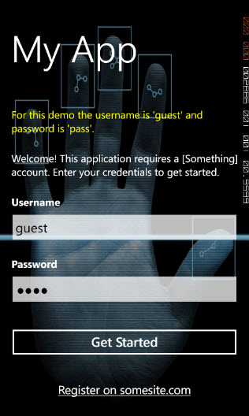

A common desire for a mobile application is showing a welcome / login type screen initially when an account is required and the user first runs the app. My past two Windows Phone apps have not needed this but my current one does. I thought it would be very simple and straightforward; just check some user settings in App.xaml.cs and conditionally navigate to a different page depending on whether validated credentials are present.  
  

### Some Problems

It turns out it was not quite that straightforward. First of all the process of navigating to MainPage.xaml (or whatever startup page you use) is already underway in App.xaml.cs. Navigating to another page required either cancelling that navigation or using UriMapper to setup the initial page. [This post by Peter Torr](http://blogs.msdn.com/b/ptorr/archive/2010/08/28/redirecting-an-initial-navigation.aspx?wa=wsignin1.0) provided a great starting point. I chose the UriMapper approach and it worked in terms of conditionally changing the initial page.  
  

However, after initially navigating to the welcome / logon page when credentials were missing, I tried redirecting back to MainPage.xaml after credentials were validated but nothing happened. The welcome page remained on screen and it was not obvious why the navigation to MainPage.xaml was not working.  
  

### Solutions

In turning to a programmer's best friend ([Stack Overflow](http://stackoverflow.com)), I found [this WP7 sign-in redirect post](http://stackoverflow.com/questions/4303403/windows-phone-7-sign-in-screen-redirect). That post suggested that the only real option was making the main page conditionally show a login control or pop-up. I was not fond of that approach; for one it did not seem like a good separation of responsibilities. For another it meant dynamically hiding/showing or covering/uncovering content and it felt like the experience would be worse for both the end user and myself.  
  

Late last night I decided to experiment a bit more with the separate welcome screen approach and did manage to get it working, though there may be a better approach.  
  

The main class looks like this:  

\[csharp\] public class StartupNavigator : IStartupNavigator { private readonly UserSettings \_userSettings; private PhoneApplicationFrame \_rootFrame;

private const string MainPage = "/MainPage.xaml";

public StartupNavigator(UserSettings userSettings) { \_userSettings = userSettings; }

public void Initialize() { \_rootFrame = ((App) Application.Current).RootFrame; SetupUriMapper(); }

private void SetupUriMapper() { var map = new UriMapper(); map.UriMappings.Add(new UriMapping {Uri = new Uri(MainPage, UriKind.Relative)}); \_rootFrame.UriMapper = map;

var navPath = \_userSettings.HasValidatedCredentials ? MainPage : "/Pages/WelcomePage.xaml"; map.UriMappings\[0\].MappedUri = new Uri(navPath, UriKind.Relative); }

public void GoHome() { \_rootFrame.Dispatcher.BeginInvoke(() => { // recalculate URI mapping - should have a different answer now // on validated credentials. this is needed SetupUriMapper(); // we need to vary the query string, otherwise OS doesn't think we // are navigating to different page and won't do anything. Despite // changing the initial Uri mapping from Main Page to login/welcome, // \_rootFrame.CurrentSource remained as /MainPage.xaml the whole time. \_rootFrame.Navigate(new Uri(MainPage + "?fromLogin=true", UriKind.Relative)); }); } } \[/csharp\]

### Keys to the Solution

The `SetupUriMapper` method takes care of setting the correct initial page to be navigated to according to whether validated credentials exist in settings. The less obvious part is the `GoHome` method which will later get invoked from the welcome / login page's ViewModel once the user's credentials have been validated. As the comments indicate, the root frame's `UriMapper` needed to be set again now that MainPage.xaml is now the starting point instead of WelcomePage.xaml.  
  

Next, when navigating to MainPage.xaml, I had to add a query string parameter just so the Uri changed a bit. Despite changing the initial Uri mapping before, `RootFrame.CurrentSource` remained as /MainPage.xaml during the process (set in WMAppManifest.xml). Windows Phone appeared to be ignoring the request to navigate to MainPage because it detected the Uri was not changing.  
  

Perhaps my understanding of this is flawed and there may be a better approach; in either event, I would love to hear about it. This was the main gotcha I ran into. For subsequent page navigation I went with the standard navigation approach I have used in the past - see [this bitbucket code](https://bitbucket.org/thnk2wn/codestock.2011/src/a0d80b9bf4be/Phone.Common/Navigation) for an example.  
  

Hitting the back button after a successful login will take the user back to the welcome page and hitting it again will exit the app. This provides the expected behavior for certification purposes, though you might be able to get away with calling [NavigationService.RemoveBackEntry()](http://msdn.microsoft.com/en-us/library/system.windows.navigation.navigationservice.removebackentry.aspx) later in MainPage.xaml if the previous page was WelcomePage.xaml and you did not want to navigate back to the welcome page. Subsequent runs of the app with valid credentials results in a direct navigation to MainPage.xaml where pressing the back button will exit the app.  
  

### The Rest of the Story

Hopefully what follows is more typical / obvious...  
  

The user settings class that `StartupNavigator` uses is straightforward:  

\[csharp\] public class UserSettings { private readonly ISettingsHelper \_settingsHelper;

public UserSettings(ISettingsHelper settingsHelper) { \_settingsHelper = settingsHelper; }

public string Username { get { return \_settingsHelper.GetString("Username"); } set { \_settingsHelper.SetSetting("Username", value); } }

public string Password { get { return \_settingsHelper.GetPrivateString("Password"); } set { \_settingsHelper.SetPrivateString("Password", value); } }

public bool? CredentialsValidated { get { return \_settingsHelper.GetBool("CredentialsValidated"); } set { \_settingsHelper.SetSetting("CredentialsValidated", value); } }

public bool HasValidatedCredentials { get { return !string.IsNullOrEmpty(this.Username) && !string.IsNullOrEmpty(this.Password) && true == this.CredentialsValidated; } }

public void Save() { \_settingsHelper.TrySave(); } } \[/csharp\]

In App.xaml.cs at the end of the constructor the startup navigator is initialized which sets up the UriMapper:  

\[csharp\] public App() { // ... default App ctor initialization here InitializeIoC(); IoC.Get<IStartupNavigator>().Initialize(); }

private static void InitializeIoC() { IoC.LoadModules(new MainModule()); } \[/csharp\]

When validated credentials were not found in settings, WelcomePage.xaml is navigated to which kicks off the WelcomeViewModel:  

\[csharp\] public class WelcomeViewModel : AppViewModelBase { private readonly UserSettings \_userSettings; private readonly IUserValidator \_userValidator; private readonly IStartupNavigator \_startupNavigator;

public WelcomeViewModel(UserSettings userSettings, IUserValidator userValidator, IStartupNavigator startupNavigator) { \_userSettings = userSettings; \_userValidator = userValidator; \_startupNavigator = startupNavigator; }

private string \_username; public string Username { get { return \_username; } set { if (\_username != value) { \_username = value; RaisePropertyChanged(()=> Username); } } }

private string \_password; public string Password { get { return \_password; } set { if (\_password != value) { \_password = value; RaisePropertyChanged(()=> Password); } } }

private void GetStarted() { // go ahead and save settings now. if incorrect and user comes back in // another session, we want those values to stick \_userSettings.Username = this.Username; \_userSettings.Password = this.Password; \_userSettings.Save();

\_userValidator.Validate(this.Username, this.Password, OnLoginSuccess); }

public void Load() { this.Username = \_userSettings.Username; this.Password = \_userSettings.Password; }

private void OnLoginSuccess(User user) { \_userSettings.CredentialsValidated = true; \_userSettings.Save();

// TODO: do something with user result; persist somewhere so we don't have // to fetch data again. Then on MainPage, elsewhere we can access later. Debug.WriteLine("Welcome " + user.Fullname); \_startupNavigator.GoHome(); }

public ICommand GetStartedCommand { get {return new RelayCommand(GetStarted); } } } \[/csharp\]

The user validation class simply creates a service client class that invokes a service method to validate the user credentials entered.

\[csharp\] public class UserValidator : IUserValidator { private readonly AppSettings \_appSettings; private readonly IMessageBoxService \_messageBoxService;

public UserValidator(AppSettings appSettings, IMessageBoxService messageBoxService) { \_appSettings = appSettings; \_messageBoxService = messageBoxService; }

public void Validate(string username, string password, Action<User> onSuccess) { if (string.IsNullOrEmpty(username) || string.IsNullOrEmpty(password)) { \_messageBoxService.ShowOKDispatch("Username and Password are required.", "Required data"); return; }

var client = new DataClient(\_appSettings.ApiKey, username, password); client.UserInfoComplete += (sender, args) => { if (string.IsNullOrEmpty(args.Result.ErrorMessage)) onSuccess(args.Result.Result); else \_messageBoxService.ShowOKDispatch(args.Result.ErrorMessage, "Login Failed"); };

client.FetchUserInfo(); } } \[/csharp\]

### Sample Project

Download [WinPhoneLoginRedirect.zip](/wp-content/uploads/2017/05/WinPhoneLoginRedirect.zip) for a working sample project.  
  

 
