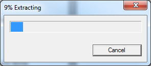
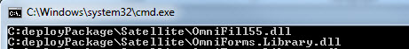
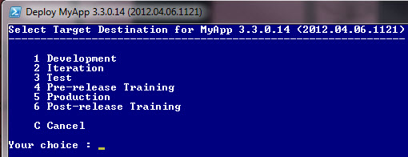

In overhauling our build and deployment process for this release I wanted to use compression for a few tasks:

- Combining staged app files to deploy into a compressed archive
    - Preferably a self-extracting executable archive (SFX)
- Extracting the deployment archive when running the deployment
- Creating backup zip files of the existing install before overwriting it

There are many ways to handle compression and decompression in my context which was:

- App - Windows .NET ClickOnce
- Build Script - MSBuild. Hopefully replaced with [psake](https://github.com/psake/psake) soon
- Deployment Script - PowerShell

For our production deployments I really wanted to hand over a compressed exe that the person running it could just run without having to open/copy/extract a zip file, find a place to extract to, and navigate to the item to launch and run it. Likewise for continuous deployments the EXE could be used as well.  
  

I did not have any loyalty to a specific tool or technique, I just wanted something that worked reliably without much hassle. Achieving this wasn't overly difficult but it did end up being a bit more hassle than I was expecting.  
  

### Experiment #1 - shell.application

From this [StackExchange post](http://serverfault.com/questions/18872/how-to-zip-unzip-files-in-powershell) I started with the below technique for backing up our existing installation when deploying. My only draw to trying it was not having an external dependency for the compression.

\[powershell\] $shell\_app=new-object -com shell.application $filename = "test.zip" $zip\_file = $shell\_app.namespace((Get-Location).Path + "\\$filename") $destination = $shell\_app.namespace((Get-Location).Path) $destination.Copyhere($zip\_file.items()) \[/powershell\]

That approach only lasted a few minutes as it didn't work reliably across network shares, popped up errors, and resulted in corrupted zip files.  
  

### Experiment #2 - Compression with the MSBuild Extension Pack

Meanwhile I shifted my focus to compressing the deployment files that the build process produced. Since I was already using the [MSBuild Extension Pack](http://msbuildextensionpack.codeplex.com/), giving this a whirl made sense.

\[xml highlight="14,15,16,17"\] <PropertyGroup> <BuildArtifacts>..\\build\\artifacts\\</BuildArtifacts> <DeployPackageFolder>..\\build\\artifacts\\deployPackage\\</DeployPackageFolder> </PropertyGroup> <ItemGroup> <DeployPackageFolderItem Include="$(DeployPackageFolder)"/> <FilesToZip Include="$(DeployPackageFolderItem)\*\*\\\*" Exclude="..\\\*\*\\\*.build; ..\\\*\*\\\*.licx"/> </ItemGroup> <Target Name="PackageDeployment" DependsOnTargets="BuildClickOncePublishFiles;CreateClickOnceWebPage"> <MSBuild.ExtensionPack.Compression.Zip TaskAction="Create" CompressPath="@(DeployPackageFolderItem)" ZipFileName="$(BuildArtifacts)MyApp.deploy.zip" RemoveRoot="@(DeployPackageFolderItem)"/> </Target> \[/xml\]

The Compression task in the Extension Pack worked great. The major limitation that led me away from it was that it didn't support creating self-extracting archives. It may have been feasible to create the SFX from the zip file it produced with another process later but that did not sound ideal even if it would have worked.  
  

### Experiment #3 - 7-zip

I have been a user and fan of [7-zip](http://www.7-zip.org/) for a while but I have not had the need to automate it before. Since the app works well and supports creating self-extracting archives, I turned my attention to it.

#### Setup

I began by downloading both the 7-zip command line version and Windows GUI (MSI) from their [download page](http://www.7-zip.org/download.html), then installing the MSI. The GUI app and MSI I only installed in order to work with .7z files myself; the automated process would not need it. Next an extra is required to actually create the SFX; I downloaded 7z922\_extra.7z from their [SourceForge](http://sourceforge.net/projects/sevenzip/files/7-Zip/9.22/) page and opened it using %ProgramFiles%\\7-Zip\\7zFM.exe. I extracted that to our application's build folder and copied the console app 7za.exe there as well.

#### Creating the archive

In working with the 7zip command line program and MSBuild, I found it a bit easier initially to create the zip and zipped exe using a batch file instead of PowerShell. I intended to later convert this to PowerShell to be invoked from MSBuild but as time would have it I never got around to it. I know, I know.

First I replaced the usage of the MSBuild Extension Pack compression task with a call to this batch file:

\[xml\] <Exec Command="$(BuildFolder)Zip-Install-Create.bat "%(BuildArtifactsItem.FullPath)"" /> \[/xml\]

Then a Zip-Install-Create.bat script:

This batch file expects to be passed the folder (w/trailing ) where the artifacts the build produces are stored. It will store the zip file there and backup the deployPackage subdirectory contained there. The 7zip console is invoked on line 17 and passed the zip filename and deploy package folder to be compressed. Next on line 19 the script merges the .sfx extra that enables self-extraction with a configuration file that tells it what to run after extraction and the generated .7z zip file itself.  
  

The configuration file (Zip-Install-Config.txt) containing the post-extraction execution info looks like the below. **Important Note**: I believe this file needs to have UNIX style line endings - only LF not CRLF. In an editor such as Notepad++ you can click the Paragraph icon in the toolbar to show all characters and use the Edit->EOL Conversion menu to help ensure the line endings are correct.

;!@Install@!UTF-8!
Title="Install MyApp"
BeginPrompt=""
Progress="yes"
ExecuteFile="deployPackage\\DeploySfxBootstrap.bat"
ExecuteParameters=""
;!@InstallEnd@!

Gasp! Another batch file you say, even though the deployment script is in PowerShell. This one was a bit more required as .ps1 files are not directly executable in the same fashion as batch files. Invoking PowerShell and giving it a file or command did not work either for various reasons, some of which I will get to shortly.

#### Executing the Deployment Script from the SFX

Once the files are extracted I wanted the deployment PowerShell script run. As indicated I could not do that directly so I created DeploySfxBootstrap.bat which can be run from the SFX and it would invoke the PowerShell script.

The bootstrap script does a couple of other tasks, mainly to work around some issues I had with 7-zip self-extracting archives:

1. There was no apparent way to tell 7-zip where you wanted the extracted files to go (temp dir is created).
2. There was no easy way to tell where 7-zip extracted the SFX contents to. (i.e. from config context)
3. Once the post-extract launched process terminates, 7-zip deletes the temp directory where it extracted the files to. That might seem like a good cleanup practice but it makes troubleshooting very difficult and my deployment process creates some output files (like a PowerShell transcript) it writes to the folder it removes. Particularly if the install fails I did not want 7-zip removing the extracted folder.

It is a bit redundant but the script first copies the already extracted files to a known location on the desktop and then the deployment script is invoked from there. 7-zip will take care of removing those same files in the temp directory.  
  

  
  
  
  

### Experiment #4 - DotNetZip

At this point the self-extracting archive was working well and I was back to wanting to backup the existing deployment when starting the deployment process. I thought about using 7zip for this but then I'd have to bundle that into the archive and I remembered using [DotNetZip](http://dotnetzip.codeplex.com/) in our app to create an error report package for unexpected exceptions. I felt a little better about bundling its dll and it would be friendly to work with from PowerShell.  
  

First a driver function to load the zip dll and backup the desired directories.

\[powershell\] function Backup-ExistingInstall { $sw = \[Diagnostics.Stopwatch\]::StartNew() Set-Activity "Backup Existing Install" Write-Log "Loading zip library" $zipLibrary = (join-path ($\_scriptPath) "Ionic.Zip.dll") \[System.Reflection.Assembly\]::LoadFrom($zipLibrary) "\`n"

$excludeDirNames = @('dotnetfx', 'NET35SP1', 'Documents', 'Exceptions', '\_Backup') Backup-Dir -dir $\_targetClickOnceDir -archiveName "MyApp.ClickOnce.backup.zip" -excludeDirNames $excludeDirNames Backup-Dir -dir $\_targetSatelliteDir -archiveName "MyApp.Satellite.backup.zip" -excludeDirNames $excludeDirNames Backup-Dir -dir $\_targetServicesDir -archiveName "MyApp.Services.backup.zip" -excludeDirNames $excludeDirNames $sw.Stop() Write-Log ("Complete backup process finished in {0:##.0} minutes" -f ($sw.Elapsed.TotalMinutes)) } \[/powershell\]

Next a function to backup a given directory; in my case the desired behavior was creating a \_Backup subfolder in each top level directory being backed up and saving the zip file there.

\[powershell\] function Backup-Dir(\[string\]$dir, \[string\]$archiveName, \[string\[\]\]$excludeDirNames) { if (!(Test-Path $dir)) { Write-Log "Directory '$dir' does not exist; nothing to backup" return; } $sw = \[Diagnostics.Stopwatch\]::StartNew() Write-Log ("Backing up directory '{0}' to '{1}'" -f $dir, $archiveName) $backupDir = join-path $dir "\_Backup"

if (!(Test-Path $backupDir)) { Write-Log "Creating $backupDir" New-Item $backupDir -type directory | out-null } $backupZipFile = join-path $backupDir $archiveName if (Test-Path $backupZipFile) { Remove-Item $backupZipFile -force }

Write-Log ("Zip: Initialize '{0}'" -f $backupZipFile) $\_zipFileObject = new-object Ionic.Zip.ZipFile Compress-Files -dir $dir -excludeDirNames $excludeDirNames Write-Log ("Zip: Saving '{0}'. This could take a while..." -f $backupZipFile) $\_zipFileObject.Save($backupZipFile) Write-Log "Zip: Cleanup" $\_zipFileObject.Dispose() # how else to clear all files and reset? $sw.Stop() Write-Log ("Backup finished in {0:###.0} seconds" -f ($sw.Elapsed.TotalSeconds)) } \[/powershell\]

Finally a recursive function to add the files in the given directory and its subdirectories.

\[powershell\] function Compress-Files (\[string\]$dir, \[string\[\]\]$excludeDirNames) { Write-Log ("Zip: processing directory '{0}'" -f $dir) if ($null -eq $excludeDirNames) {$excludeDirNames = @()} $children = get-childitem -path $dir | where-object { $excludeDirNames -notcontains $\_.Name } foreach ($o in $children) { if ($o.PSIsContainer) { Compress-Files ( $o.FullName ) } else { if (!($o.FullName.EndsWith(".zip"))) { Write-Log ("Zip: Add {0}" -f $o.FullName) $pathInArchive = $o.Directory.FullName.Replace("\\\\$\_targetServerRootDir", "") $e= $\_zipFileObject.AddFile($o.FullName, $pathInArchive) } } } } \[/powershell\]

That worked so well it got me questioning my use of 7-zip...  
  

### Experiment #5 - DotNetZip SFX

Once I realized that DotNetZip could create self-extracting archives, I decided it would be better to replace 7-zip with DotNetZip so I was only dealing with a single, friendly compression tool.  
  

Unfortunately, when compressing the contents of my build with it, DotNetZip would get stuck and never finish. I created a small throw-away .net app and wired into various events and did all sorts of troubleshooting. Through a painstaking process of elimination, I narrowed the problem down to a specific combination of 3 files (assemblies and PDBs). I [logged an issue](http://dotnetzip.codeplex.com/workitem/14814) about this but never heard anything back. Meanwhile I found other [similar issues](http://dotnetzip.codeplex.com/workitem/14982) posted so I gave up on it. Strangely it worked fine backing up a lot of the same files over the network.  
  

### In Conclusion

I ended up settling on 7-zip for building the SFX from the build and DotNetZip for backing up the existing install when deploying. Both the implementations could use improvements and I am not fond of using 2 tools for compression tasks. For now this is working well and it can always be refactored another day when time allows.  
  

As always there are other alternatives, be it the [PowerShell Community Extensions (PSCX)](http://pscx.codeplex.com/), [WinZip command line](http://www.winzip.com/prodpagecl.htm), [pkzip command line](http://comm.pkware.com/pkzip-cli-download.html), using the [.net GZipStream class](http://3e5f.wordpress.com/2012/01/08/compress-a-file-with-powershell/), [Xceed ($$$)](http://xceed.com/Zip_Net_Features.html) etc. I wish there was something better built into Windows / PowerShell itself and I am sure there are a number of solutions I'm not familiar with. I'd love to hear your thoughts on what works well for you.
