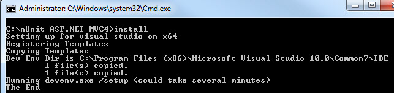
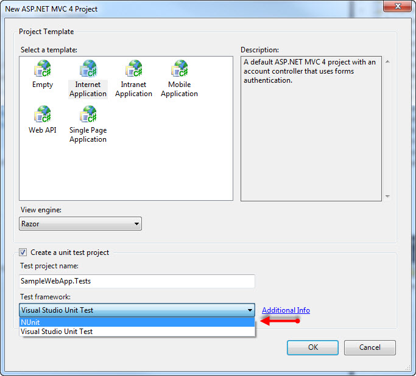

We are using ASP.NET MVC 4 beta on a new project as it should be out of beta before we go live. Even if not, they do have a Go Live license option. Each time I start using a new version of ASP.NET MVC and check the "Create a unit test project" checkbox, I always let out a groan when I remember that MSTest is my only initial option. The combobox might as well be empty as far as I'm concerned.  
  

There are some Visual Studio extensions and custom templates that others have created to address this for past versions of ASP.NET MVC. I did not immediately find anything for ASP.NET MVC 4 beta in my searching so I decided to take a stab at creating a template for NUnit. I considered doing one for xUnit.net as well but I've gone back to NUnit mostly. I like xUnit better in some respects but the out of the box tooling support is better for NUnit and over the years NUnit seems to have addressed some of the shortcomings that xUnit was addressing to begin with.  
  

I ended up basing my solution on [this old ASP.NET MVC 1 NUnit template](http://blogs.msdn.com/b/webdevtools/archive/2009/04/28/updated-nunit-templates-for-asp-net-mvc-1-0-rtm.aspx). There were a number of changes required to the various files including the VS templates, registry files, project files, installation batch file etc. I will not go into those gory details as I have neither the time or inclination and you probably do not care anyway :).  
  

So here it is if it is useful to anyone else:  
[NUnit ASP.NET MVC4.zip](/wp-content/uploads/2017/05/NUnit-ASP.NET-MVC4.zip)  
  

  
  

  
  

### Details and Disclaimers

- **NuGet** - Rather than reference NUnit directly I bundled the latest [NUnit NuGet package](http://nuget.org/packages/NUnit) with the templates (NUnit.2.6.0.12054.nupkg). You might want to check for updates to that.
- **Visual Studio and OS Versions** - I adjusted all the reg files and the install script to attempt to handle the different Visual Studio versions and 64 vs 32 bit differences. However I only tested this with Visual Studio 2010 Premium on Windows 7 x64.
- **.NET Framework Version** - I tested this against .NET FX 4. I have not tried against 4.5 beta yet.
- **Languages** - I'm a C# guy but for completeness sake I converted the VB template too but did not test it as much. It compiled anyway :).
- **Beta bits** - I would guess the templates would work when ASP.NET MVC 4 RTM's but who knows.
- **Sample test class(es)** - I did not spend much energy adjusting the sample NUnit test class that is created by default (HomeControllerTests) and I removed AccountControllerTests for various reasons. Usually I end up deleting or drastically changing these samples anyway.
