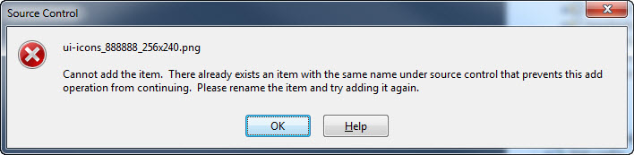
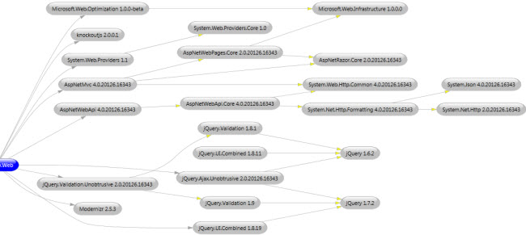
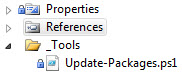

After creating an ASP.NET MVC 4 web app I noticed in the Visual Studio Package Manager that there were several NuGet packages that had updates available. My first thought was just to update them from the dialog while I was there. That has a few problems though:

- You have to update packages one at a time
- You cannot specify any of the options from the dialog that you could from the console
- Updates will need to be performed again later and why repeat a manual process

### Problems Updating Packages

Whether updating NuGet packages from the dialog or the Package Manager Console, there were a couple of issues I ran into:

1. **Modified files** - I received some warnings such as "Skipping 'Scriptsjquery.validate.js' because it was modified" so I was not getting full updates. I did not actually modify any of the files NuGet indicated were modified but I guess Visual Studio touched them in some manner.
2. **No -reinstall or -force options** - This relates to the modified files problem but at times it is necessary to uninstall and reinstall NuGet packages to update them correctly. I've [requested a -reinstall option](http://nuget.codeplex.com/discussions/325492) before and that is [tracked as an issue to address](http://nuget.codeplex.com/workitem/1779). Additionally a -force option is coming to Update-Package in NuGet 1.9 so that could help later.
3. **Source control** - We use TFS source control (insert look of pain here) and it freaked out at times when updating packages. For example:   
    This was worked around by breaking up some checkins.
4. **Package dependency conflicts** - Sometimes one package cannot be updated because another package depends on a different version of the same package. I ran into this problem trying to upgrade Json.Net but could not because a RavenDB package depended on an older version. This isn't something that can be automated per se but something to be aware of.

### Package Awareness

There are a good number of packages used by default in an ASP.NET MVC 4 web app. I wanted to ensure I understood the packages in use and the dependencies between them. One tool that I had forgotten about is the [NuGet Package Visualizer](http://docs.nuget.org/docs/workflows/package-visualizer) which came in handy for visualizing the relationships.  
  

  

### Creating a script

To address these items I created a PowerShell script to be included in the web project with functions that can be called from the Package Manager Console to automate some of the NuGet work.  
  
  
  

The below script is a first pass attempt that I am sure will be revised later but it seems to be working so far. On CodePlex I previously saw a more generic PowerShell script to more forcibly update all packages listed in packages.config. I cannot seem to find that at the moment but that is certainly a valid option. For now I want to be very explicit about each package to update.  

\[powershell\] # Functions to uninstall, install, re-install, and update NuGet packages used by this web app project

\# Example usage from Visual Studio Package Manager Console: # cd "$(ProjectDir)\_Tools" # replace $(ProjectDir) # . .Update-Packages.ps1 # dir function: # ReInstall-AllPackages

$updatePackagesProjectName = "MyApp.Web"

\# The problem with Update-Package is there is currently no -Force option (coming in 1.9) # which means errors like "Skipping 'Scriptsjquery.validate.js' because it was modified" function ReInstall-AllPackages { UnInstall-AllPackages Install-AllPackages }

\# Just doing outside-in at top level with -RemoveDependencies # See also: http://docs.nuget.org/docs/workflows/package-visualizer function UnInstall-AllPackages { Uninstall-Package -force -RemoveDependencies -ProjectName $updatePackagesProjectName System.Web.Providers Uninstall-Package -force -RemoveDependencies -ProjectName $updatePackagesProjectName jQuery.Validation.Unobtrusive Uninstall-Package -force -RemoveDependencies -ProjectName $updatePackagesProjectName jQuery.Ajax.Unobtrusive Uninstall-Package -force -RemoveDependencies -ProjectName $updatePackagesProjectName jQuery.UI.Combined Uninstall-Package -force -RemoveDependencies -ProjectName $updatePackagesProjectName Microsoft.Web.Optimization Uninstall-Package -force -RemoveDependencies -ProjectName $updatePackagesProjectName AspNetWebApi Uninstall-Package -force -RemoveDependencies -ProjectName $updatePackagesProjectName knockoutjs Uninstall-Package -force -RemoveDependencies -ProjectName $updatePackagesProjectName AspNetMvc Uninstall-Package -force -RemoveDependencies -ProjectName $updatePackagesProjectName Modernizr }

\# doing more inside-out here so we get the latest version of core things like jQuery # various packages may work with much older version of some core libraries but want latest # being more explicit here then is needed # See also: http://docs.nuget.org/docs/workflows/package-visualizer function Install-AllPackages { # jQuery related Install-Package -ProjectName $updatePackagesProjectName jQuery Install-Package -ProjectName $updatePackagesProjectName jQuery.Validation Install-Package -ProjectName $updatePackagesProjectName jQuery.Validation.Unobtrusive Install-Package -ProjectName $updatePackagesProjectName jQuery.Ajax.Unobtrusive Install-Package -ProjectName $updatePackagesProjectName jQuery.UI.Combined # SQL related Install-Package -ProjectName $updatePackagesProjectName System.Web.Providers.Core Install-Package -ProjectName $updatePackagesProjectName System.Web.Providers # optimization (bundles etc.) Install-Package -ProjectName $updatePackagesProjectName -Pre Microsoft.Web.Optimization # misc Install-Package -ProjectName $updatePackagesProjectName knockoutjs Install-Package -ProjectName $updatePackagesProjectName Modernizr # aspnet web api related Install-Package -ProjectName $updatePackagesProjectName System.Net.Http Install-Package -ProjectName $updatePackagesProjectName System.Net.Http.Formatting Install-Package -ProjectName $updatePackagesProjectName System.Web.Http.Common Install-Package -ProjectName $updatePackagesProjectName AspNetWebApi.Core Install-Package -ProjectName $updatePackagesProjectName AspNetWebApi # aspnet mvc # system.Web.http.common taken care of with web api above Install-Package -ProjectName $updatePackagesProjectName Microsoft.Web.Infrastructure Install-Package -ProjectName $updatePackagesProjectName AspNetRazor.Core Install-Package -ProjectName $updatePackagesProjectName AspNetMvc }

function Update-AllPackages { Update-Package -Project $updatePackagesProjectName } \[/powershell\]
