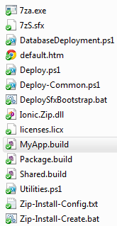

### Series Index

Build Automation Part 1: Overview and Pre-build Tasks  
[Build Automation Part 2: Building and Packaging](/tech/2012/5/8/build-automation-part-2-building-and-packaging.html)  
[Build Automation Part 3: App Deployment Script](/tech/2012/5/9/build-automation-part-3-app-deployment-script.html)  
[Build Automation Part 4: Database and Report Deployments](/tech/2012/5/14/build-automation-part-4-database-and-report-deployments.html)  
  

A recent major application release at work required various changes to our build and deployment process. Our continuous integration process was created probably 5+ years ago when Cruise Control .Net was king. It has served us well but I did not want to invest in it anymore, especially with alternatives like [Jenkins](http://jenkins-ci.org/) and [Team City](http://www.jetbrains.com/teamcity/) out there. CI aside I wanted to reevaluate the build and deployment process as a whole and overhaul as much of it as possible to help ease the burden.  
  

In this post I will discuss an overview of this initiative and address build script details in terms of pre-build activities. If time, interest, and priorities permit, I will create follow-up posts on topics such as build and packaging details, deployment scripts, and the setup and configuration of Team City.  
  

### Goals of the Build and Deployment Overhaul

- **Build script** - Producing a more complete build script that could be run both outside and inside a CI process to build and package a deployment.
- **CI system change** - Replacing Cruise Control with Team City.
- **Further automation** - Automating some features that were previously manual such as ClickOnce certificate installation.
- **Deployment packaging** - Compressing the app files to be deployed into a self-extracting archive that runs a deployment script after extraction.
- **Deployment script rewrite** - Replacing an old deployment batch file with a more capable PowerShell script.
- **Remote deployment** - The original process required performing the deployment locally on the target server but the desire was to be able to deploy from any given location to any given location remotely.
- **Existing deployment backup** - Compressing the previous installation before overwriting it in the event of issues.
- **Dead-simple production deployments** - While our CI process automated deployments to some environments, we have not been in a position to do this for production due to auditing, policy, security, and other reasons. The existing deployment script required passing in some parameters and some knowledge of how things were setup. With handing over prod deployments to new parties, there was a need to simplify things as much as possible to reduce the knowledge requirement and the chance of human error.
- **Artifact deployment enhancements** - Additional automation around deploying database and report changes.

  

### What to Do in a Build Script vs. a CI Tool?

The ultimate goal here is automating the building, packaging and deployment of an application and CI is the preferred way to accomplish that. However I am of the opinion that this automation shouldn't be hopelessly dependent on CI to work. There may be times when a build and deployment may need to be done from a developer's machine. Additionally the development, testing, and debugging an automated build is more easily done outside of a CI process.  
  

On one end of the extreme, the build steps and tools of a CI system like Team City could be used with no build script at all. Separate steps can be configured in a web interface of the CI tool to retrieve source code, compile a solution or project, install packages via NuGet, run unit tests and much more. In this scenario the CI build configuration effectively is the build script.  
  

On the other end of the extreme, every single action could be done in a build script and the CI system could just call that build script.  
  

The CI-centric approach has the advantages of a simple wizard-like setup, leveraging the power of a CI system, and avoiding doing a lot of potentially tedious work in what might be a large build script otherwise. A complete build script has the advantages of precise control and independence from a CI tool but comes at the cost of more work and maintenance and likely means the CI tool is being under-utilized.  
  

As with most things I think nirvana lies somewhere in the middle. Here is what I settled on:

- **Source Control** - Done from a CI tool. When building locally I usually already have the latest source code. From a CI build, tools like Team City are pretty smart about efficient VCS operations in terms of caching, settings reuse, dependent builds, VCS build triggers, labeling, supported platforms etc.
- **Building** - pre-build activities (NuGet etc.), code compilation, and packaging the deployable files are done from the build script. These are the core pieces that may need to be done both inside and outside of a CI tool.
- **Unit tests** - Done from a CI tool. I may not always want to execute unit tests when building the app locally but from a CI build I always want some level of tests run. Decent CI tools support most popular unit testing frameworks really well.
- **Code analysis and other** - Most other tasks such as code analysis or build notifications are left to a CI system to handle as they are well-suited for these tasks.

  

### Choosing Tools

#### Build Tool

At the risk of turning you away, I ended up going with MSBuild, partially because I was somewhat familiar with it, there was some MSBuild content invoked from Cruise Control that was salvageable, and it has a solid base of support. I think MSBuild is a decent tool capable of far more than the simple compilation tasks many are familiar with from project and solution files. Mostly I am just not fond of XML-based build tools; I would much rather use a scripting language.  
  

Had I rediscovered [PSake](https://github.com/psake/psake#readme) sooner I probably would have chosen it instead. [This Ayende post on Psake](http://ayende.com/blog/4156/on-psake) is a bit older but he discusses Psake a bit and compares it to some other options such as NAnt, Rake, and Bake and I think many of the points are still valid.  
  

Some of the MSBuild pain would be offset by many of the great MSBuild task collections out there such as the [MSBuild Extensions Pack](http://msbuildextensionpack.codeplex.com/). Additionally PowerShell script can be embedded directly inline into the an MSBuild script (through a PowerShell task) or MSBuild can execute an external PowerShell script file to offset some of the XML heaviness.

#### Deployment

For the deployment I chose PowerShell to extract the build archive that MSBuild creates, backup the existing installation, stop services, disconnect server sessions, copy files, install and start services, and more. The idea was to run this deployment script directly from a self-extracting executable without someone having to launch PowerShell, dot source the file, invoke functions, etc.

#### Initial Prerequisites

For this app's build (.net Winforms ClickOnce smart client) the following needs to be installed:  

- Windows SDK or Visual Studio depending on whether the build is on a dev box or CI server
- .NET FX 4.0 for MSBuild
- [MSBuild Extension Pack](http://msbuildextensionpack.codeplex.com/releases/view/66799) is used for several custom tasks. Used the x86 v4.0.4.0 installer.
- TFS Explorer - on the build server for TFS source control access
- Software component dependencies of the app being built. For this app this included items such as:
    - Oracle Data Access Components (ODAC)
    - Infragistics NetAdvantage Controls
    - Office Outlook PIAs
    - Exchange Web Services Managed API (EWS)

  

### Where to Store Build Script Files

 I went with the convention of creating a build folder under each application branch; in our case with TFS source control usually that is at least Dev, Main, and Production. Often the build scripts and configuration will be nearly identical between branches but there may be some configuration or other differences. As changes to the build scripts are made in the Dev branch and verified they will later be merged to Main and Production over the iteration lifecycle.  
  

The app's code can be referenced easily in relative fashion by going up one level. Any temporary output of the build script will be created in an artifacts subfolder of the build folder.  
  

All the contents of the build folder are stored in source control, minus the output in the artifacts subfolder. During a CI build, all of the build script items will be pulled from source control along with the rest of the code and resources for the application.  
  

### Cleanup

The first task will be cleaning up any output from previous builds and ensuring the build is started with a clean slate. First some properties and item groups are defined at the top of the build script to reference various files and folders that will be cleaned up.  

\[xml\] <PropertyGroup> <Configuration Condition=" '$(Configuration)' == '' ">Debug</Configuration> <NuGetPackagesFolder>..\\packages\\</NuGetPackagesFolder> <Branch>Dev</Branch> </PropertyGroup> <ItemGroup> <BuildRoot Include="..\\build\\"/> <BuildArtifactsItem Include="..\\build\\artifacts\\"/> <SolutionFile Include="..\\MyApp.sln"/> <NuGetPackagesFolderItem Include="$(NuGetPackagesFolder)"/> <LicenseFiles Include="..\\\*\*\\licenses.licx" Exclude="..\\build\\licenses.licx"/> </ItemGroup> <ItemGroup Label="MiscOtherBuild"> <!-- Removed next 2 from main app solution as rarely used/changed or has dependency issues --> <MiscOtherToBuild Include="../MyApp.ServiceController/MyApp.ServiceController.csproj"/> <MiscOtherToBuild Include="../ThirdParty.Library/ThirdParty.Library.vbproj"/> <ServiceAppBuild Include="..\\..\\..\\..\\Common\\SomeServiceApp\\$(Branch)\\Code\\build\\SomeServiceApp.build"/> </ItemGroup> \[/xml\]

The clean target invokes the clean target in the main app solution, related project files outside of the main solution, and a dependent service application to cleanup compiled output. It also removes a build artifacts folder that will get created with the results of the build process. Finally it deletes license.licx files and the NuGet packages folder to ensure a fresh pull.  

\[xml\] <Target Name="Clean"> <Message Text="Cleaning up"/>

<!-- do a clean on solution first since it has the most output, leave custom tasks at end --> <MSBuild Projects="@(SolutionFile)" Targets="Clean" Properties="Configuration=$(Configuration);"/>

<Message Text="Removing existing content in @(BuildArtifactsItem)"/> <!-- Subdirectories could exist which can lead to error "directory is not empty" removing top level dir normally --> <MSBuild.ExtensionPack.FileSystem.Folder TaskAction="RemoveContent" Path="@(BuildArtifactsItem)" Condition="Exists(%(BuildArtifactsItem.FullPath))" /> <Message Text="Removing @(BuildArtifactsItem) folder"/> <RemoveDir Directories="@(BuildArtifactsItem)"/>

<Message Text="Removing NuGet packages folder @(NuGetPackagesFolder)"/> <MSBuild.ExtensionPack.FileSystem.Folder TaskAction="RemoveContent" Path="@(NuGetPackagesFolderItem)" Force="true" Condition="Exists(%(NuGetPackagesFolderItem.FullPath))" RetryCount="5" /> <RemoveDir Directories="@(NuGetPackagesFolderItem)" />

<!-- File could be readonly; we could add condition of not readonly. Continue on error --> <Message Text="Removing any existing licenses.licx files"/> <Delete Files="@(LicenseFiles)" ContinueOnError="true"/>

<MSBuild Projects="@(MiscOtherToBuild)" Targets="Clean" Properties="Configuration=$(Configuration);"/> <MSBuild Projects="@(ServiceAppBuild)" Targets="Clean" Properties="Configuration=$(Configuration);"/>

<Message Text="Clean complete"/> </Target> \[/xml\]  

### The Path to Compilation

A Compile target is started with a DependsOnTargets value of a $(CompileDependsOn) property to be defined that will list all the targets that must be executed successfully before compilation:  
\[xml\] <Target Name="Compile" DependsOnTargets="$(CompileDependsOn)"> <!-- ... --> </Target> \[/xml\]

This property is defined as follows at the top of the build script.  
\[xml\] <PropertyGroup> <CompileDependsOn> Init;CreateLicenseFiles;NuGetPackageRestore;InstallClickOnceCert;UpdateAssemblyInfo </CompileDependsOn> </PropertyGroup> \[/xml\]

  

### Initialization

\[xml\] <Target Name="Init" DependsOnTargets="Clean"> <Message Text="Making build artifacts dir of @(BuildArtifactsItem)"/> <MakeDir Directories="@(BuildArtifactsItem)"/>

<Message Text="Build number is $(BUILD\_NUMBER)"/> <CreateBuildInfoFile/> </Target> \[/xml\]

The Init target first creates a build artifacts folder where output of the build will be placed.  
  

It then invokes a custom, inline PowerShell task to create a "build information file" that will store metadata such as the app version, file version, built on time, ClickOnce Publish Version etc. This file was created because originally a target was being called from multiple locations to get the file version and the file version was based in part on the date/time which could change during the course of the build. Later it also was used to store and increment the ClickOnce revision number.  
  

Later the build script will read in this file into an object, update various properties and write it back out.

\[xml\] <UsingTask TaskFactory="PowershellTaskFactory" TaskName="CreateBuildInfoFile" AssemblyFile="$(PowerShellAssembly)"> <Task> <!\[CDATA\[ $log.LogMessage(\[Microsoft.Build.Framework.MessageImportance\]"High", "Creating build info file for later use") $obj = new-object PSObject $obj | add-member -membertype NoteProperty -name "AppVersion" -value "$(BUILD\_NUMBER)" $obj | add-member -membertype NoteProperty -name "FileVersion" -value (\[System.DateTime\]::Now.ToString("yyyy.MM.dd.HHmm")) $obj | add-member -membertype NoteProperty -name "BuiltOn" -value (\[System.DateTime\]::Now.ToString("G")) $obj | add-member -membertype NoteProperty -name "ClickOnceRevision" -value 0 $obj | add-member -membertype NoteProperty -name "ClickOncePublishVersion" -value "" $obj | export-csv $(BuildArtifacts)BuildInfo.csv -notypeinformation \]\]> </Task> </UsingTask> \[/xml\]

This task is part of the MSBuild Extension Pack and the $(PowerShellAssembly) value is defined as:

\[xml\] <PropertyGroup> <PowerShellAssembly>$(MSBuildExtensionsPath)\\ExtensionPack\\4.0\\MSBuild.ExtensionPack.TaskFactory.PowerShell.dll</PowerShellAssembly> </PropertyGroup> \[/xml\]

  

### The Build Number and Calling the Build Script

In the Initialization target you may have noticed $(BUILD\_NUMBER) referenced in a couple of places. During a CI build, [Team City](http://www.jetbrains.com/teamcity/) was used and it sets this property which can be referenced in the build script. When building outside of a CI process, this property value will need to be set when msbuild is invoked.  
  

I prefer to invoke MSBuild build scripts from PowerShell. In my PowerShell [$profile](http://msdn.microsoft.com/en-us/library/windows/desktop/bb613488(v=vs.85).aspx) I add the .net framework path to the PATH environment variable so I do not have to specify the location of MSBuild each time.

\[powershell\] $env:path = $env:Path += ";C:\\Windows\\Microsoft.NET\\Framework\\v4.0.30319" \[/powershell\]

Usually I will invoke an "[Open PowerShell here](/tech/2010/7/15/powershell-startup-customization.html)" action from the build script's folder in Windows Explorer and then execute the build script with something like:  

\[powershell\] msbuild MyApp.build /p:BUILD\_NUMBER=3.3.0.0 \[/powershell\]

Depending on what steps need to be performed or tested the invocation will vary a bit:  

\[powershell\] msbuild MyApp.build /t:Compile /p:BUILD\_NUMBER=3.3.1.0 /p:Configuration=Release msbuild MyApp.build /t:Clean \[/powershell\]  

### Creating License Files

Component vendors such as Infragistics require license.licx files for design time use of controls. We do not store these license files in source control for a variety of reasons but the build will generate exceptions if these files do not exist. This task copies a zero-length license file to the property directories to prevent exceptions during compilation.  
  

This target first gets a reference to all AssemblyInfo files that reside in the same directories where the license files need to be. The actual directory name varies between Properties and My Project depending upon the language. The directory of each file is used as the destination to copy the empty license file to.  
  

Initially I tried creating an empty license file using the [File.WriteLines](http://www.msbuildextensionpack.com/help/4.0.5.0/index.html) method of the MSBuild extension pack. [That did not work](http://msbuildextensionpack.codeplex.com/discussions/347898#post808034) though they since addressed it but I never tried the changes.  

\[xml\] <Target Name="CreateLicenseFiles"> <CreateItem Include="..\\\*\*\\AssemblyInfo.\*"> <Output TaskParameter="Include" ItemName="PropertyDirList" /> </CreateItem> <Message Text="Checking/creating licenses.licx files"/> <Message Text="%(PropertyDirList.RootDir)%(PropertyDirList.Directory)" /> <Copy SourceFiles="licenses.licx" DestinationFolder="%(PropertyDirList.RootDir)%(PropertyDirList.Directory)" SkipUnchangedFiles="true" ContinueOnError="true" /> </Target> \[/xml\]  

### NuGet Package Restore

Initially I thought that with NuGet Package Restore enabled in the app's Visual Studio solution that when the code was compiled by MSBuild that any missing NuGet packages would be automatically downloaded and installed. As it turned out it was not all rainbows and unicorns as that only worked in the context of Visual Studio. It was simple enough however to enumerate all packages.config files and run the NuGet command line to install the packages in each.  

\[xml\] <PropertyGroup> <NuGetExe Condition="$(NuGetExe) == ''">..\\.nuget\\nuget.exe</NuGetExe> <NuGetPackagesFolder>..\\packages\\</NuGetPackagesFolder> </PropertyGroup> <Target Name="NuGetPackageRestore"> <ItemGroup> <NuGetPackageConfigs Include="..\\\*\*\\packages.config" /> </ItemGroup> <Message Text="Restoring NuGet package(s). Nuget path is $(NuGetExe)" /> <Exec Command="$(NuGetExe) install %(NuGetPackageConfigs.Identity) -o $(NuGetPackagesFolder)" /> </Target> \[/xml\]  

### ClickOnce Certificate

The required certificate for a ClickOnce-distributed Windows app has been a pain in the past. First we tend to forget what the password is after a while and end up trying several common variations. For another the cert expires after a year by default so we end up generating another one. Then on the build server the build would break and someone had to logon as the build account, manually import the new certificate, enter the password, fire off MSBuild and verify the fix. I wanted to get away from all that as much as possible by having the build script install the certificate.  
  

To install the certificate the password used to create it will be needed so a property is defined for that. It may not be required but for good measure the script first removes the certificate if it exists before installing it. On a build server this might be desirable once the app has finished compiling.  
  

To remove any existing certificate it needs to be uniquely identified which is done through its thumbprint. On a machine where the cert is already installed the cert can be found through browsing IE=>Tools=>Internet Options=>Content=>Certificates=>Personal; see [http://msdn.microsoft.com/en-us/library/ms734695.aspx](http://msdn.microsoft.com/en-us/library/ms734695.aspx) for more details. Issued to/by and Issue Date (Not Before) are the key fields to look at.  
  

Another way to search for the cert is with PowerShell. For example if you know the thumbprint starts with E595 you could run:  

\[powershell\] cd cert: dir -recurse | where {$\_.Thumbprint -like '\*e595\*'} | Format-List -property \* \[/powershell\]

Once the right cert is identified the thumbprint can be copied into a property in the build script. I do not recommend copying from IE however as you may pick up special unicode characters that are hard to see and will prevent a match in finding the cert. Also all spaces would need to be removed and letters would need to be uppercased. It is easier to copy the thumbprint data from PowerShell where the format is already correct.  

\[xml\] <PropertyGroup Label="ClickOnceProps"> <ClickOnceCertThumb>E5958D48FE10D7340311E8C03BB22940DABA2DA3</ClickOnceCertThumb> <ClickOnceCertFile>..\\MyApp.Client\\MyApp.Client\_TemporaryKey.pfx</ClickOnceCertFile> <ClickOnceCertPass>S0mePassw0rd!</ClickOnceCertPass> </PropertyGroup> \[/xml\]

The Certificate task in the MSBuild Extension Pack is used to remove a certificate via supplying the thumbprint:  

\[xml\] <Target Name="RemoveClickOnceCert"> <!-- Continue on error in case it doesn't exist, will just be a warning --> <Message Text="Removing any existing ClickOnce certificate"/> <MSBuild.ExtensionPack.Security.Certificate TaskAction="Remove" Thumbprint="$(ClickOnceCertThumb)" ContinueOnError="true"/> </Target> \[/xml\]

Likewise the Certificate task is used to install the certificate via supplying the filename and password. The thumbprint and subject properties are output for verification purposes.  

\[xml\] <Target Name="InstallClickOnceCert" DependsOnTargets="RemoveClickOnceCert"> <Message Text="Installing Certificate file @(ClickOnceCertFile)"/> <MSBuild.ExtensionPack.Security.Certificate TaskAction="Add" FileName="$(ClickOnceCertFile)" CertPassword="$(ClickOnceCertPass)"> <Output TaskParameter="Thumbprint" PropertyName="TPrint"/> <Output TaskParameter="SubjectDName" PropertyName="SName"/> </MSBuild.ExtensionPack.Security.Certificate> </Target> \[/xml\]

Instead of using the Certificate task in the MSBuild extension pack, using PowerShell directly to install the certificate is another option. For example, see [this script on poshcode](http://poshcode.org/1937) or [this post by James Kehr](http://www.orcsweb.com/blog/james/powershell-ing-on-windows-server-how-to-import-certificates-using-powershell/).

  
  

### Updating AssemblyInfo

Prior to starting the compilation various info in the AssemblyInfo files should be set including:

- Assembly Version
- File Version
- Copyright
- Company Name

There are a few different ways to do this including [TeamCity's AssemblyInfo Patcher](http://confluence.jetbrains.net/display/TCD7/AssemblyInfo+Patcher), the AssemblyInfo task of the [MSBuild Community Tasks](https://github.com/loresoft/msbuildtasks), [MSBuild Extension Pack's AssemblyInfo class](http://www.msbuildextensionpack.com/help/4.0.5.0/index.html), regular expressions and replacements with PowerShell or MSBuild tasks, etc. For me the patcher was out since it was CI-only and the other tasks had usage requirements I did not like. I chose the regular expression route though RegEx solutions do tend to be brittle.  
  

First the AssemblyInfo target requires that BUILD\_NUMBER is set, otherwise it is skipped. Next a couple of RegEx patterns are defined. There are two for AssemblyFileVersion as I found some formatted as AssemblyFileVersion( "0.0.0.0" ) and the rest as AssemblyFileVersion("0.0.0.0") due to differing developer formatting settings (again, this approach is more brittle). It probably would have been trivial to combine the two regular expressions into one but my RegEx skills are rusty and I was feeling lazy at the time.  

\[xml\] <Target Name="UpdateAssemblyInfo" Condition="'$(BUILD\_NUMBER)' != ''"> <ItemGroup> <AssemblyInfoFiles Include="../\*\*/Properties/\*\*/AssemblyInfo.cs;" /> <AssemblyInfoFiles Include="../\*\*/My Project/\*\*/AssemblyInfo.vb;" /> <ClientAssemblyInfo Include="../MyApp.Client/My Project/AssemblyInfo.vb"/> </ItemGroup> <PropertyGroup> <AssemblyVersionPattern>AssemblyVersion\\(".\*"\\)</AssemblyVersionPattern> <!-- 2nd ver handles spaces for those that have formatting like AssemblyFileVersion( ". Should combine regexs --> <AssemblyFileVersionPattern>AssemblyFileVersion\\(".\*"\\)</AssemblyFileVersionPattern> <AssemblyFileVersionPattern2>AssemblyFileVersion\\( +"\\d+\\.\\d+\\.\\d+\\.\\d+" \\)</AssemblyFileVersionPattern2> </PropertyGroup> <!-- ... --> </Target> \[/xml\]

Next a target is called to get the file version:  

\[xml\] <GetFileVersion> <Output TaskParameter="ReturnValue" PropertyName="FileVersion"/> </GetFileVersion> \[/xml\]

Which is retrieved elsewhere using the BuildInfo file written to earlier:  

\[xml\] <UsingTask TaskFactory="PowershellTaskFactory" TaskName="GetFileVersion" AssemblyFile="$(PowerShellAssembly)"> <ParameterGroup> <ReturnValue Output="true"/> </ParameterGroup> <Task> <!\[CDATA\[ $obj = import-csv $(BuildArtifacts)BuildInfo.csv $returnValue = $obj.FileVersion \]\]> </Task> </UsingTask> \[/xml\]

Next the current year is retrieved into a property which will be used momentarily to update the Assembly copyright so it has the current year.  

\[xml\] <MSBuild.ExtensionPack.Framework.DateAndTime TaskAction="Get" Format="yyyy"> <Output TaskParameter="Result" PropertyName="Year"/> </MSBuild.ExtensionPack.Framework.DateAndTime> \[/xml\]

Next the same file version is stamped on all assemblies and the assembly version is only set for the entry client assembly. For a refresher on differences between assembly versions vs. file versions see a post such as [this](http://techblog.ranjanbanerji.com/post/2008/06/26/Net-Assembly-Vs-File-Versions.aspx).  

\[xml\] <MSBuild.ExtensionPack.FileSystem.File TaskAction="Replace" RegexPattern="$(AssemblyFileVersionPattern)" Replacement="AssemblyFileVersion("$(FileVersion)")" Files="@(AssemblyInfoFiles)" /> <MSBuild.ExtensionPack.FileSystem.File TaskAction="Replace" RegexPattern="$(AssemblyFileVersionPattern2)" Replacement="AssemblyFileVersion("$(FileVersion)")" Files="@(AssemblyInfoFiles)"/> <!-- special handling for client app project --> <MSBuild.ExtensionPack.FileSystem.File TaskAction="Replace" RegexPattern="$(AssemblyVersionPattern)" Replacement="AssemblyVersion("$(BUILD\_NUMBER)")" Files="@(ClientAssemblyInfo)"/> <MSBuild.ExtensionPack.FileSystem.File TaskAction="Replace" RegexPattern="$(AssemblyFileVersionPattern)" Replacement="AssemblyFileVersion("$(FileVersion)")" Files="@(ClientAssemblyInfo)"/> \[/xml\]

Finally "while we're in there" company name and copyright are set:  

\[xml\] <MSBuild.ExtensionPack.FileSystem.File TaskAction="Replace" RegexPattern="AssemblyCopyright\\(".\*"\\)" Replacement="AssemblyCopyright("Copyright © Initech $(Year)")" Files="@(AssemblyInfoFiles)"/> <MSBuild.ExtensionPack.FileSystem.File TaskAction="Replace" RegexPattern="AssemblyCompany\\(".\*"\\)" Replacement="AssemblyCompany("Initech")" Files="@(AssemblyInfoFiles)"/> \[/xml\]  

### What's next?

That's it for the pre-build activities. I may follow this up with posts on build and packaging, deployment scripts, and Team City setup and configuration.
