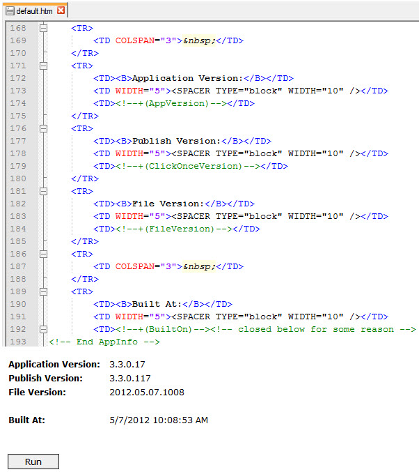

### Series Index

[Build Automation Part 1: Overview and Pre-build Tasks](/tech/2012/5/5/build-automation-part-1-overview-and-pre-build-tasks.html)  
Build Automation Part 2: Building and Packaging  
[Build Automation Part 3: App Deployment Script](/tech/2012/5/9/build-automation-part-3-app-deployment-script.html)  
[Build Automation Part 4: Database and Report Deployments](/tech/2012/5/14/build-automation-part-4-database-and-report-deployments.html)  
  

In the [last post in this series](/tech/2012/5/5/build-automation-part-1-overview-and-pre-build-tasks.html) I discussed an overview of some build and deployment automation goals and covered some pre-build activities. In this post I cover compiling the code and packaging the files to be deployed.  
  

### Building the Code

In the Compile target the main solution file is built along with a few misc. projects that are not part of the main solution file. [Refer back to part 1](/tech/2012/5/5/build-automation-part-1-overview-and-pre-build-tasks.html) for the definition of some of the items used such as $(CompileDependsOn), @(SolutionFile), etc.  
  

One item that is not obvious here is @(ServiceAppBuild); basically there is another WCF service application that runs locally on the end user's machine in parallel with the client app. This application has its own build script and the client app being built passes in a ClientOutDir property that tells the service application build script where to copy the service app client files to after they are built. Really I wanted this piece to be handled by an internal NuGet package; unfortunately I had some [issues setting up an internal NuGet server](https://github.com/NuGet/NuGetGallery/issues/413) and I ran out of time.  

\[xml\] <Target Name="Compile" DependsOnTargets="$(CompileDependsOn)"> <Message Text="Starting compile of @(SolutionFile)"/>

<ItemGroup> <SharedLibPath Include="..\\MyApp.Shared\\\_Lib"/> </ItemGroup>

<Message Text="Building service app projects; client output will be copied to %(SharedLibPath.FullPath)"/>

<!-- First we need to copy the client files of this dependency app into our client app --> <!-- Really we need to change this so the dependency is nuget based but that'll have to be done later --> <MSBuild Projects="@(ServiceAppBuild)" Targets="Rebuild" Properties="Configuration=$(Configuration);ClientOutDir=%(SharedLibPath.FullPath)"/>

<MSBuild Projects="@(SolutionFile)" Targets="Rebuild" Properties="Configuration=$(Configuration)"/> <Message Text="Compile complete of @(SolutionFile)"/>

<Message Text="Compiling misc other related such as Service Controller"/> <MSBuild Projects="@(MiscOtherToBuild)" Targets="Rebuild" Properties="Configuration=$(Configuration)"/>

<Message Text="All compilation is done"/> </Target> \[/xml\]  

### Breaking Up the Build Script

To keep the main MSBuild script from getting too lengthy I split it as follows:

- **MyApp.build** - Main driver script that is always the entry point. Contains pre-build and build targets and wrapper targets to call into other build scripts.
- **Package.build** - Handles taking all the compiled output of the main build script and copying the appropriate content to a deployment folder and packaging that up in a compressed archive.
- **Shared.build** - Common tasks and properties that both the main build script and the package script need.

The main build script imports the others:  

\[xml\] <Project xmlns="http://schemas.microsoft.com/developer/msbuild/2003" ToolsVersion="4.0" DefaultTargets="Compile">

<Import Project="Shared.build"/> <Import Project="Package.build"/> <!-- ... --> </Project> \[/xml\]  

### Setting Up the Packaging Build Script

#### Imports, Property and Item Groups

\[xml\] <Project xmlns="http://schemas.microsoft.com/developer/msbuild/2003" ToolsVersion="4.0"> <Import Project="Shared.build"/> <Import Project="..\\MyApp.Client\\MyApp.Client.vbproj"/>

<PropertyGroup> <DeployPackageFolder>..buildartifactsdeployPackage</DeployPackageFolder> <RemovePackageFilesAfterZip Condition=" '$(RemovePackageFilesAfterZip)' == '' ">true</RemovePackageFilesAfterZip> <PowerShellAssembly>$(MSBuildExtensionsPath)\\ExtensionPack\\4.0\\MSBuild.ExtensionPack.TaskFactory.PowerShell.dll</PowerShellAssembly> <TargetServer/> </PropertyGroup> <ItemGroup> <DeployPackageFolderItem Include="$(DeployPackageFolder)"/> <ClientProjectItem Include="..\\MyApp.Client\\MyApp.Client.vbproj" /> </ItemGroup> <!-- ... --> </Project> \[/xml\]

#### Packaging Initialization

This target creates an error if the build number is not defined and then removes and recreates a deployment package folder where the deployable content will be placed.  

\[xml\] <Target Name="Init"> <Error Condition="'$(BUILD\_NUMBER)' == ''" Text="Build number is required" />

<MSBuild.ExtensionPack.FileSystem.Folder TaskAction="RemoveContent" Path="@(DeployPackageFolderItem)" Condition="Exists(%(DeployPackageFolderItem.FullPath))" /> <RemoveDir Directories="@(DeployPackageFolderItem)"/> <MakeDir Directories="@(DeployPackageFolderItem)"/> </Target> \[/xml\]  

### Publishing the ClickOnce Client Project

This target creates the ClickOnce manifests of the client project and is the equivalent of Build-->Publish in Visual Studio. Effectively the client project gets built twice, once as a part of the main solution, and again when packaged in Publish mode. [Refer back to part 1](/tech/2012/5/5/build-automation-part-1-overview-and-pre-build-tasks.html) for the CreateLicenseFiles dependency.  
  

I will speak to some of the details following the target definition:  

\[xml\] <Target Name="BuildClickOncePublishFiles" DependsOnTargets="Init;CreateLicenseFiles"> <Error Condition=" '$(TargetServer)' == '' " Text="'/p:TargetServer:server-name' is required to generate ClickOnce publish files"/>

<GetClickOnceNextVersion TargetServer="$(TargetServer)" BuildNumber="$(BUILD\_NUMBER)"> <Output TaskParameter="ReturnValue" PropertyName="ClickOnceAppVersion"/> </GetClickOnceNextVersion>

<GetFrameworkSdkPath> <Output TaskParameter="Path" PropertyName="SdkPath" /> </GetFrameworkSdkPath> <Message Text="SdkPath: $(SdkPath)" />

<!-- Other properties: Platform, PublishUrl, InstallUrl, Platform (i.e. x86)--> <MSBuild Projects="@(ClientProjectItem)" Targets="Publish" Properties="Configuration=$(Configuration); BootstrapperComponentsLocation=Relative; GenerateBootstrapperSdkPath=$(SdkPath)Bootstrapper; PublishDir=$(DeployPackageFolder)ClickOnce\\; ApplicationVersion=$(ClickOnceAppVersion); UpdateInterval=1; UpdateIntervalUnits=Hours; UpdatePeriodically=true"> <Output ItemName="OutputFiles" TaskParameter="TargetOutputs"/> </MSBuild>

<CreateItem Include="$(DeployPackageFolder)ClickOnce\\"> <Output TaskParameter="Include" ItemName="ClickOnceDeployPath" /> </CreateItem>

<Error Condition="!Exists(%(ClickOnceDeployPath.FullPath))" Text="Expected ClickOnce folder $(ClickOnceDeployPath) to exist. Either a partial target was run and not a full build, build output was not at expected location, and/or build output copy failed." /> </Target> \[/xml\]

#### Getting the Next ClickOnce Version Number

The target first raises an error if there was not a TargetServer value passed the build script; this value is used in the next step to determine the next ClickOnce revision number. The build info file created in [part 1](/tech/2012/5/5/build-automation-part-1-overview-and-pre-build-tasks.html) gets deployed out to the target server along with the rest of the app. The below task reaches out to the target server, looks for the build info file, reads in the current ClickOnce revision number (or uses 0 if the file was not found), increments that value, writes the local file back out, and returns the full publish version for the new build.  

\[xml\] <UsingTask TaskFactory="PowershellTaskFactory" TaskName="GetClickOnceNextVersion" AssemblyFile="$(PowerShellAssembly)"> <ParameterGroup> <TargetServer Required="true" ParameterType="System.String" /> <BuildNumber Required="true" ParameterType="System.String" /> <ReturnValue Output="true"/> </ParameterGroup> <Task> <!\[CDATA\[ $log.LogMessage(\[Microsoft.Build.Framework.MessageImportance\]"High", "Getting ClickOnce next publish version") $log.LogMessage(\[Microsoft.Build.Framework.MessageImportance\]"High", "TargetServer is $targetServer") $log.LogMessage(\[Microsoft.Build.Framework.MessageImportance\]"High", "BuildNumber is $buildNumber") $buildInfoFile = "\\$targetServer\\SomeHiddenShare$\\MyApp\\BuildInfo.csv" $log.LogMessage(\[Microsoft.Build.Framework.MessageImportance\]"High", "Looking for $buildInfoFile") $appRev = -1 if (Test-Path $buildInfoFile) { $obj = import-csv $buildInfoFile $appRev = \[int32\]$obj.ClickOnceRevision $log.LogMessage(\[Microsoft.Build.Framework.MessageImportance\]"High", "Found remote build info file; ClickOnceRevision is $appRev") } $nextRev = $appRev + 1 #Major, Minor, Build, Revision $buildVer = new-object System.Version($buildNumber) $clickOnceVer = new-object System.Version($buildVer.Major, $buildVer.Minor, $buildVer.Build, $nextRev) # need to update local build info file with new publish version $localBuildInfoFile = "$(BuildArtifacts)BuildInfo.csv" $log.LogMessage(\[Microsoft.Build.Framework.MessageImportance\]"High", "Local build info file is $localBuildInfoFile") if (!(Test-Path $localBuildInfoFile)) { throw "Failed to find expected build info file $localBuildInfoFile" } $obj = import-csv $localBuildInfoFile $obj.ClickOnceRevision = $nextRev $obj.ClickOncePublishVersion = $clickOnceVer $obj | export-csv $localBuildInfoFile -notypeinformation $returnValue = $clickOnceVer.ToString() $log.LogMessage(\[Microsoft.Build.Framework.MessageImportance\]"High", "Next ClickOnce publish version is $returnValue") \]\]> </Task> </UsingTask> \[/xml\]

#### ClickOnce App Identity and Multiple Environments

The ClickOnce publish version is a curious, brittle little dependency. At one point I thought that there would be no problem with using the same publish version across different environments. After deploying the app to a test environment however, ClickOnce generated an error that the app was already installed; the fact that it was installed from another server (dev vs test) made no difference.  
  

As a result, for the first deployment to each target environment, I started the ClickOnceRevision value at a different starting number such that the likelihood of a collision would be rare. Additionally, since the full ClickOnce publish version here is based on the Major, Minor, and Build number of the app version (which typically changes with each push), a conflict would only happen to begin with when deploying the same app version to another server with the same ClickOnce revision number. Furthermore, only so many versions are kept in the ClickOnce cache and generally only developers or business experts would likely run into this problem.  
  

You can use [Mage](http://msdn.microsoft.com/en-us/library/acz3y3te.aspx) or [MageUI](http://msdn.microsoft.com/en-us/library/xhctdw55.aspx) to change the name of the deployment manifest to avoid this issue. Some mention changing the app's assembly and product names for each environment but to me that causes as many problems as it solves and with our 8 environments it is not ideal. Still if your ClickOnce app is made available from the Start menu (ours is online only) this could be more of a need.  
  

### Updating the ClickOnce Web Page

We previously modified the default ClickOnce web page that Visual Studio generates to change the .net FX bootstrapping and to disable the Run button for a while after users clicked it so they would not get multiple instances of the app launched accidentally if they double-clicked it or otherwise hit it again because the app didn't appear to launch quickly enough.  
  

This target collects various pieces of build information and calls another target to update placeholders in the webpage to reflect the current app version, file version, publish version and built on date.  

\[xml\] <Target Name="CreateClickOnceWebPage"> <ItemGroup> <ClickOnceDefaultFile Include="default.htm" /> </ItemGroup>

<Copy SourceFiles="@(ClickOnceDefaultFile)" DestinationFolder="$(DeployPackageFolder)ClickOnce\\" />

<GetFileVersion> <Output TaskParameter="ReturnValue" PropertyName="FileVersion"/> </GetFileVersion>

<GetClickOncePublishVersion> <Output TaskParameter="ReturnValue" PropertyName="ClickOnceVersion"/> </GetClickOncePublishVersion>

<GetBuiltOnTime> <Output TaskParameter="ReturnValue" PropertyName="BuiltOnTime"/> </GetBuiltOnTime>

<Message Text="Updating ClickOnce web page $(DeployPackageFolder)ClickOnce\\default.htm with ClickOnce Version $(ClickOnceVersion), File Version $(FileVersion)"/>

<UpdateClickOncePage WebPageFilename="%(DeployPackageFolderItem.FullPath)ClickOnce\\default.htm" ClickOnceVersion="$(ClickOnceVersion)" FileVersion="$(FileVersion)" AppVersion="$(BUILD\_NUMBER)" BuiltOn="$(BuiltOnTime)" /> </Target> \[/xml\]

The tasks that retrieve the build properties could be consolidated but currently look like:  

\[xml\] <UsingTask TaskFactory="PowershellTaskFactory" TaskName="GetFileVersion" AssemblyFile="$(PowerShellAssembly)"> <ParameterGroup> <ReturnValue Output="true"/> </ParameterGroup> <Task> <!\[CDATA\[ $obj = import-csv $(BuildArtifacts)BuildInfo.csv $returnValue = $obj.FileVersion \]\]> </Task> </UsingTask>

<UsingTask TaskFactory="PowershellTaskFactory" TaskName="GetClickOncePublishVersion" AssemblyFile="$(PowerShellAssembly)"> <ParameterGroup> <ReturnValue Output="true"/> </ParameterGroup> <Task> <!\[CDATA\[ $obj = import-csv $(BuildArtifacts)BuildInfo.csv $returnValue = $obj.ClickOncePublishVersion \]\]> </Task> </UsingTask>

<UsingTask TaskFactory="PowershellTaskFactory" TaskName="GetBuiltOnTime" AssemblyFile="$(PowerShellAssembly)"> <ParameterGroup> <ReturnValue Output="true"/> </ParameterGroup> <Task> <!\[CDATA\[ $obj = import-csv $(BuildArtifacts)BuildInfo.csv $returnValue = $obj.BuiltOn \]\]> </Task> </UsingTask> \[/xml\]

The UpdateClickOncePage task takes those values in as parameters and replaces special placeholders with them.  

\[xml\] <UsingTask TaskFactory="PowershellTaskFactory" TaskName="UpdateClickOncePage" AssemblyFile="$(PowerShellAssembly)"> <ParameterGroup> <WebPageFilename Required="true" ParameterType="System.String" /> <ClickOnceVersion Required="true" ParameterType="System.String" /> <FileVersion Required="true" ParameterType="System.String" /> <AppVersion Required="true" ParameterType="System.String" /> <BuiltOn Required="true" ParameterType="System.String" /> </ParameterGroup> <Task> <!\[CDATA\[ Set-ItemProperty $WebPageFilename -name IsReadOnly -value $false $log.LogMessage(\[Microsoft.Build.Framework.MessageImportance\]"High", "WebPageFilename is $WebPageFilename") $log.LogMessage(\[Microsoft.Build.Framework.MessageImportance\]"High", "ClickOnceVersion is $ClickOnceVersion") $log.LogMessage(\[Microsoft.Build.Framework.MessageImportance\]"High", "FileVersion is $FileVersion") $log.LogMessage(\[Microsoft.Build.Framework.MessageImportance\]"High", "AppVersion is $AppVersion") $log.LogMessage(\[Microsoft.Build.Framework.MessageImportance\]"High", "BuiltOn is $BuiltOn") $log.LogMessage(\[Microsoft.Build.Framework.MessageImportance\]"High", "Reading WebPage content") $page = Get-ChildItem $WebPageFilename $content = \[string\]::join(\[environment\]::newline, (get-content $page)) $log.LogMessage(\[Microsoft.Build.Framework.MessageImportance\]"High", "Replacing version tokens with version numbers") $content = $content.Replace("<!--+(ClickOnceVersion)-->", $ClickOnceVersion) $content = $content.Replace("<!--+(FileVersion)-->", $FileVersion) $content = $content.Replace("<!--+(AppVersion)-->", $AppVersion) $content = $content.Replace("<!--+(BuiltOn)-->", $BuiltOn) Set-Content $WebpageFilename ($content) $log.LogMessage(\[Microsoft.Build.Framework.MessageImportance\]"High", "Web Page Content modified") \]\]> </Task> </UsingTask> \[/xml\]  

  
  

### Staging the Files For Deployment

The ClickOnce files have already been staged into a $(DeployPackageFolder)ClickOnce folder and now the same is needed for Satellite files, Service files, and deployment scripts.  

#### Setup

\[xml\] <Target Name="PackageDeployment" DependsOnTargets="BuildClickOncePublishFiles;CreateClickOnceWebPage"> <CreateProperty Value="bin\\x86\\$(Configuration)"> <Output TaskParameter="Value" PropertyName="BinOutput"/> </CreateProperty> <Message Text="Bin output path is $(BinOutput)"/>

<!-- ... --> </Target> \[/xml\]

#### Staging Service Files

\[xml\] <CreateItem Include="..\\MyApp.Service\\$(BinOutput)\*.\*"> <Output TaskParameter="Include" ItemName="ServiceSourceFiles" /> </CreateItem> <CreateItem Include="%(DeployPackageFolderItem.FullPath)Services\\"> <Output TaskParameter="Include" ItemName="ServiceDestFolder" /> </CreateItem>

<Message Text="Copying service source files to @(ServiceDestFolder)"/>

<Copy SourceFiles="@(ServiceSourceFiles)" DestinationFolder="@(ServiceDestFolder)" SkipUnchangedFiles="true" />

<Error Condition="!Exists(%(ServiceDestFolder.FullPath))" Text="Expected services folder %(ServiceDestFolder.FullPath) to exist. Either a partial target was run and not a full build, build output was not at expected location, and/or build output copy failed." /> \[/xml\]

#### Staging Satellite Files

This app has various satellite module assemblies that get loaded dynamically off a network share. Other assemblies and files such as config files may not get loaded directly off the network but may be copied to client machines from the network. The intent behind most of these files is allowing for certain updates to files without having to rollout a new application build.  
  

This section includes and excludes specific files to copy just those files intended for satellite distribution.  

\[xml\] <ItemGroup> <SatelliteSourceFiles Include="..\\\*\*\\MyApp.\*.dll; ..\\\*\*\\MyApp.\*.pdb; ..\\\*\*\\ThirdParty.\*.dll; ..\\\*\*\\ThirdParty.\*.pdb; ..\\\*\*\\\*.xslt; ..\\\*\*\\\*.css" Exclude="..\\\*\*\\\*Shared\*; ..\\\*\*\\\*Oracle\*; ..\\\*\*\\\*Database\*; ..\\\*\*\\\*Business\*; ..\\\*\*\\obj\\; ..\\\*\*\\\*MyApp.Client\*; ..\\\*\*\\\*MyApp.Console\*; ..\\\*\*\\\*MyApp.Service\*" /> <SatelliteSourceFiles Include="..\\ThirdParty.Library\\ThirdParty.dll"/> <SatelliteSourceFiles Include="..\\MyApp.Client\\MyApp.Help.chm"/> </ItemGroup> <CreateItem Include="%(DeployPackageFolderItem.FullPath)Satellite\\"> <Output TaskParameter="Include" ItemName="SatelliteDestFolder" /> </CreateItem> <Message Text="Copying satellite source files to @(SatelliteDestFolder)"/> <Copy SourceFiles="@(SatelliteSourceFiles)" DestinationFolder="@(SatelliteDestFolder)" SkipUnchangedFiles="true" /> <Error Condition="!Exists(%(SatelliteDestFolder.FullPath))" Text="Expected satellite folder %(SatelliteDestFolder.FullPath) to exist. Either a partial target was run and not a full build, build output was not at expected location, and/or build output copy failed." /> <CreateItem Include="$(DeployPackageFolder)Satellite\\ServiceApp\\"> <Output TaskParameter="Include" ItemName="ServiceAppDeployPath" /> </CreateItem> <MakeDir Directories="@(ServiceAppDeployPath)"/> <Message Text="Staging Service app files to %(ServiceAppDeployPath.FullPath)"/> <StageServiceApp DestStagingDir="%(ServiceAppDeployPath.FullPath)" /> <Error Condition="!Exists(%(ServiceAppDeployPath.FullPath))" Text="Expected satellite ServiceApp folder %(ServiceAppDeployPath.FullPath) to exist. Either a partial target was run and not a full build, build output was not at expected location, and/or build output copy failed." /> \[/xml\]

The prior target called this StageServiceApp task which invokes a PowerShell script of a dependent service app to copy the appropriate build output of that app to the Satellite folder of this ClickOnce app.  

\[xml\] <UsingTask TaskFactory="PowershellTaskFactory" TaskName="StageServiceApp" AssemblyFile="$(PowerShellAssembly)"> <ParameterGroup> <DestStagingDir Required="true" ParameterType="System.String" /> </ParameterGroup> <Task> <!\[CDATA\[ $log.LogMessage(\[Microsoft.Build.Framework.MessageImportance\]"High", "Staging ServiceApp to $DestStagingDir") $log.LogMessage(\[Microsoft.Build.Framework.MessageImportance\]"High", "Loading ServerStageServiceApp.ps1") . ..\\..\\..\\..\\Common\\SomeServiceApp\\Main\\Code\\SomeServiceApp\\ServerStageServiceApp.ps1 $log.LogMessage(\[Microsoft.Build.Framework.MessageImportance\]"High", "Performing staging of service app") ServerStage $DestStagingDir $log.LogMessage(\[Microsoft.Build.Framework.MessageImportance\]"High", "Service app staging complete") \]\]> </Task> </UsingTask> \[/xml\]

#### Staging Deployment Scripts

Finally some PowerShell deployment scripts are copied into the deployment package folder along with the build info file and a compression assembly used to backup the existing installation.  

\[xml\] <Message Text="Copying deployment scripts into deploy folder"/> <ItemGroup> <BuildItemsToCopy Include="$(BuildFolder)Deploy\*.\*"/> <!-- might consider removing Ionic later since we are using 7zip; Ionic was faster at network zip ops though --> <BuildItemsToCopy Include="$(BuildFolder)Ionic.Zip.dll"/> <BuildItemsToCopy Include="$(BuildArtifacts)BuildInfo.csv"/> </ItemGroup> <Copy SourceFiles="@(BuildItemsToCopy)" DestinationFolder="@(DeployPackageFolderItem)"/>

<!-- we've copied into deploy folder so we can remove this one --> <Delete Files="$(BuildArtifacts)BuildInfo.csv"/> \[/xml\]  

### Compressing the Deployment Package Folder

At this point all the files that need to be deployed (or that perform the deployment) reside inside a root deployment package folder. This section of PackageDeployment target first creates a normal zip file of that folder using 7-zip, creates a self-extracting executable from that, and finally deletes the original zip file and deployment package folder as everything that is needed is in the SFX package.  
  

I am not going to go into details here about how the compression is done as I covered that in [this post](/tech/2012/4/6/compression-experiments-in-the-build-and-deployment-process.html) and I like to follow the DRY principle for my blog too :).  

\[xml\] <ItemGroup> <FilesToZip Include="$(DeployPackageFolderItem)\*\*\\\*" Exclude="..\\\*\*\\\*.build; ..\\\*\*\\\*.licx"/> </ItemGroup> <Message Text="Creating zip archive of contents of @(DeployPackageFolderItem)"/> <!-- Switched to 7-zip cmdline since extension pack zip can't create self-extracting exectuable (sfx) DotNetZip (Ionic) can create sfx but it was hanging zipping up some build artifacts for some reason <MSBuild.ExtensionPack.Compression.Zip TaskAction="Create" CompressPath="@(DeployPackageFolderItem)" ZipFileName="$(BuildArtifacts)MyApp.deploy.zip" RemoveRoot="@(DeployPackageFolderItem)"/> --> <Exec Command="$(BuildFolder)Zip-Install-Create.bat "%(BuildArtifactsItem.FullPath)"" /> <!-- file is in zip and can be removed now --> <Delete Files="$(DeployPackageFolder)BuildInfo.csv"/> <!-- now that contents are zipped, delete package folder --> <MSBuild.ExtensionPack.FileSystem.Folder TaskAction="RemoveContent" Path="@(DeployPackageFolderItem)" Force="true" RetryCount="5" Condition="Exists(%(DeployPackageFolderItem.FullPath)) AND $(RemovePackageFilesAfterZip) == true" /> <RemoveDir Directories="@(DeployPackageFolderItem)" Condition="$(RemovePackageFilesAfterZip)"/> \[/xml\]  

### Calling the Build Script Now

Back in the main MyApp.build script, there is a convenience target defined to compile everything and then call the package deployment target.  

So now back in PowerShell a more complete call to the build script might look like one of the below:  

\[powershell\] msbuild MyApp.build /t:BuildAndPackage /p:BUILD\_NUMBER=3.3.0.0 \` /p:TargetServer=app-server-dev msbuild MyApp.build /t:BuildAndPackage /p:BUILD\_NUMBER=3.3.0.0 \` /p:TargetServer=app-server-test /p:Configuration=Release \[/powershell\]

At this point the EXE can be run to extract the contents and launch the PowerShell script to deploy the app. Because custom parameters cannot really be passed to the EXE on through to the deployment script, additional build script changes are required to indicate whether this is an automated CI build and deployment or one being run in a user interactive mode. Alternatively such an indicator parameter could be used to not create the SFX for a CI build but just the zip file, or to not delete the zip file and leave both. I'll leave such decisions as an exercise for the reader :).  
  

### What's Next?

I may post some details on the deployment scripts and/or Team City in the future. Happy building and deploying!
