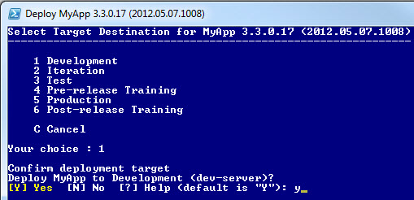
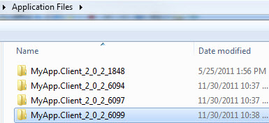

### Series Index

[Build Automation Part 1: Overview and Pre-build Tasks](/tech/2012/5/5/build-automation-part-1-overview-and-pre-build-tasks.html)  
[Build Automation Part 2: Building and Packaging](/tech/2012/5/8/build-automation-part-2-building-and-packaging.html)  
Build Automation Part 3: App Deployment Script  
[Build Automation Part 4: Database and Report Deployments](/tech/2012/5/14/build-automation-part-4-database-and-report-deployments.html)  
  

### Types of Deployment Scripts

We currently have different deployment scripts that are run independently though there is a desire to chain them together in automated fashion when time allows.

- Application - Deploys the application bits
- Database - Deploys the database script changes for a given project release
- Reports - Deploys SSRS report changes for a given project release

The database and report artifact deployments are deserving of a dedicated post to this in the future. This post will focus on the application deployment script.  
  

### Deployment Script Skeleton

Looking at the script in a top-down fashion is best I think. Some of the helper functions being called will be listed later.  

#### Top

\[powershell\] param ( \[string\]$DeployToServer = "", \[switch\]$SkipBackup = $false, \[switch\]$automated = $false )

$global:ErrorActionPreference = "Stop"

\# error on uninitialized variables, non-existent properties, bad function calls Set-StrictMode -version 2 \[/powershell\]

At the top of the script some script preferences are set and the following parameters are defined:  

- DeployToServer - Name of the target server to deploy to. The idea is this would bypass a prompt where the user chose the server to deploy to. This would generally be set by a CI process. At the moment this isn't being used in the script as our build server went down in flames before I could make use of this.

- SkipBackup - Allows turning off default behavior of backing up the existing app installation on the target deployment server.

- Automated - This was meant to control whether the script ever paused for any user-interaction or not. It is used in a couple of places but not fully implemented. It could be replaced by use of DeployToServer but I wanted to be explicit. Typically this would just be set from a CI build.

#### Bottom

After all the functions in the deployment script, the following script level variables are defined. I went with an $\_ naming convention for script level variables; $script:variableName may have been better but more verbose.  

\[powershell\] $\_scriptPath = (get-scriptdirectory)

\# import generic deployment script functions . (join-path $\_scriptPath "Deploy-Common.ps1")

$\_packagePath = $\_scriptPath # for now anyway, just being explicit here $\_transcriptFile = (join-path $\_scriptPath "DeployTranscript.txt")

$\_targetServer = "" $\_targetClickOnceDir = "" $\_targetSatelliteDir = "" $\_targetServicesDir = "" $\_targetRoot = "" $\_envName = ""

$\_activity = "Initializing" $\_zipFileObject = $null

$\_successfulDeploy = $false

$\_scriptErrorMessage = "" $\_clickOnceUrl = "" $\_deployTS = $null \[/powershell\]

At the very bottom is the call to the main Publish-App function with error handling, invoking the product web page if successful, and transcript logging and emailing.  

\[powershell\] try { Init Publish-App if (!$script:automated) { $\_clickOnceUrl = ("http://{0}.domain.com/MyApp/" -f $\_targetServer) "Launching app landing page at $\_clickOnceUrl" Invoke-InternetExplorer $\_clickOnceUrl } $\_successfulDeploy = $true } catch \[System.Exception\] { $\_scriptErrorMessage = ("Deployment failed with error: {0}{1}{1}Script: {2} Line,Col: {3},{4}" \` -f $\_.Exception.ToString(), \[System.Environment\]::NewLine, $\_.InvocationInfo.ScriptName, \` $\_.InvocationInfo.ScriptLineNumber, $\_.InvocationInfo.OffsetInLine) Write-Warning $\_scriptErrorMessage } finally { Write-Progress "Done" "Done" -completed if (Get-CanTranscribe) { Stop-Transcript Send-Notification } }

if (!$\_successfulDeploy) { invoke-item $\_transcriptFile }

\# if not an automated deploy then pause if (!$script:automated) { "\`nPress enter to continue..." \[void\]\[System.Console\]::ReadLine() } \[/powershell\]  

### Initialization

The Init function kicks off transcription, reads in build version information from a file ([See Initialization in Part 1](/tech/2012/5/5/build-automation-part-1-overview-and-pre-build-tasks.html)), tacks on to the PATH environment variable, and sets up the PowerShell UI shell.  

\[powershell\] function Init { #setting $ErrorActionPreference here doesn't appear to effect anything try { Stop-Transcript | out-null } catch { } if (Get-CanTranscribe) { Start-Transcript -path $\_transcriptFile }

$buildInfo = Get-BuildInfo $env:path += ";$env:windirMicrosoft.NETFrameworkv4.0.30319;$env:windirSystem32" # customize window shell if ($Host -and $Host.UI -and $Host.UI.RawUI) { try { $ui = (Get-Host).UI.RawUI $ui.WindowTitle = ("Deploy MyApp {0} ({1})" \` -f $buildInfo.AppVersion, $buildInfo.FileVersion) if (!(Get-IsHostISE)) { $ui.BackgroundColor = "DarkBlue" $ui.ForegroundColor = "White" $bufferSize = $ui.BufferSize $bufferSize.Width = 120 $bufferSize.Height = 9000 $ui.BufferSize = $bufferSize $winSize = $ui.WindowSize $winSize.Width = 120 $winSize.Height = 70 $ui.WindowSize = $winSize } } catch \[System.Exception\] { ("Error configuring host UI: {0}" -f $\_.Exception.Message) } } } \[/powershell\]  

### Deployment Target Menu

This function is intended for user-interactive execution of the deployment; in our case this was mostly for production-level environments where another group performed the deployment. However it also came in handy in some other scenarios where we could not do completely automated continuous deployment, such as a period where our CI server was all hosed up. Additionally there are times where it is handy to push a custom build from anywhere to anywhere, outside of the normal process flow.  
  

For automated CI deployments a target server name would be passed in and this user menu interaction would be skipped. This function displays a menu of valid target environments to deploy to, sets the target server accordingly, and invokes a deployment function with that target server name.  
  

For the menu I originally tried just using $Host.ui.PromptForChoice as in [this article by James O'Neill](http://blogs.technet.com/b/jamesone/archive/2009/06/24/how-to-get-user-input-more-nicely-in-powershell.aspx). However I did not like how that laid out; everything was rendered horizontally instead of vertically and some things ran together or were not spaced to my liking. That lead me to [this post by Jeff Hicks](http://jdhitsolutions.com/blog/2011/12/friday-fun-a-powershell-console-menu/) which my menu is based on; the Show-Menu function in the switch statement below is his function which I did not modify.  

\[powershell highlight="24,42,43,47"\] function Publish-App { $menu = " \` 1 Development \` 2 Iteration \` 3 Test \` 4 Pre-release Training \` 5 Production \` 6 Post-release Training \` \` C Cancel \` \` Your choice " $targetServer = "" $script:\_envName = "" $buildInfo = Get-BuildInfo $title = ("Select Target Destination for MyApp {0} ({1})" \` -f $buildInfo.AppVersion, $buildInfo.FileVersion)

\# Keep looping and running the menu until the user selects a valid item or cancels. Do { switch (Show-Menu $menu $title -clear) { "1" { $targetServer = "dev-server"; $script:\_envName = "Development"; } "2" { $targetServer = "itr-server"; $script:\_envName = "Iteration"; } "3" { $targetServer = "tst-server"; $script:\_envName = "Test"; } "4" { $targetServer = "pre-server"; $script:\_envName = "Pre-release"; } "5" { $targetServer = "prod-server"; $script:\_envName = "Production"; } "6" { $targetServer = "post-server"; $script:\_envName = "Post-release"; } "C" { Write-Output "Cancel"; return; } } } While (!$script:\_envName -and !$targetServer) if ($targetServer -and $script:\_envName) { $choiceYes = New-Object System.Management.Automation.Host.ChoiceDescription "&Yes", "Answer Yes." $choiceNo = New-Object System.Management.Automation.Host.ChoiceDescription "&No", "Answer No." $options = \[System.Management.Automation.Host.ChoiceDescription\[\]\]($choiceYes, $choiceNo) $result = $host.ui.PromptForChoice("Confirm deployment target", \` "Deploy My App to $\_envName ($targetServer)?", $options, 0) if ($result -eq 0) { Publish-ToServer $targetServer -skipBackup:$script:skipBackup } else { Write-Output "Deployment cancelled" } } } \[/powershell\]  

  
  

### Server Deployment Driver Function

This function sets some script level variables such as common folder locations, and calls functions to perform cleanup, backup any existing installation ([see this post](/tech/2012/4/6/compression-experiments-in-the-build-and-deployment-process.html)), and deploy ClickOnce, satellite and service files.  

\[powershell\] function Publish-ToServer ( \[string\] $targetServer = $(throw "targetServer is required"), \[switch\] $skipBackup = $false ) { $startTime = \[DateTime\]::Now Write-Output "\`n" Set-Activity "Deploying to $targetServer" Write-Log "Beginning deploy to target server $targetServer" $script:\_targetServer = $targetServer $script:\_targetRoot = "\\$targetServerShare$" $script:\_targetClickOnceDir = "\\$targetServerShare$\\MyApp\\ClickOnce" $script:\_targetSatelliteDir = "\\$targetServerShare$\\MyApp\\Satellite" $script:\_targetServicesDir = "\\$targetServerShare$\\MyApp\\Services" Clear-OldFiles if (!$skipBackup) { Backup-ExistingInstall } Publish-ClickOnceFiles Publish-SatelliteFiles Publish-Service $script:\_deployTS = \[DateTime\]::Now - $startTime Write-Log ("Published to $targetServer in {0:N0} minute(s) and {1} second(s)\`n" \` -f \[math\]::floor($\_deployTS.TotalMinutes), $\_deployTS.Seconds) } \[/powershell\]  

### Cleanup Before Backup

Before backing up the existing target folders, the script does some cleanup to remove some files and folders that are not desirable for backup. Mostly this cleanup is around removing old ClickOnce folders; because of the version naming convention there will quickly be a large number of folders.  
  

  
  

The below function will look for folders ordered by modified time descending and select the first one to determine the most recent ClickOnce folder (you could argue some holes with that logic). It will then keep only that one, getting rid of all the others. In this way it will only be backing up the last ClickOnce folder. If you are starting fresh this is not a problem per se but in my case there were many existing versions out there already.  

\[powershell highlight="48,49,50,60"\] function Clear-OldFiles { Set-Activity "Cleaning up old ClickOnce versions" Clear-OldClickOnceAppFiles $\_targetClickOnceDir # additional cleanup here removed... }

function Clear-OldClickOnceAppFiles ($rootDir) { if (!(Test-Path $rootDir)) { Write-Log "$rootDir doesn't exist; nothing to do" return; }

\# exclude on subdirectory names doesn't seem to work # so we'll just rename dir, grab most recent child, copy over # http://tinyurl.com/copy-item-exclude $appFilesDir = (join-path $rootDir "Application Files") if (!(Test-Path $appFilesDir)) { Write-Log "Didn't find Application Files folder at $appFilesDir; nothing to do" return } Write-Log ("Removing old ClickOnce app files beyond one version back from {0}" \` -f $appFilesDir) $folders = @(Get-ChildItem -Path $appFilesDir -recurse \` | Where-Object {$\_.PSIsContainer}) if ($folders.Length -le 1) { Write-Log ("No old versions to remove (folder count was {0}); exiting" \` -f ($folders.Length)) return } else { Write-Log ("Found {0} ClickOnce version folder(s)" -f ($folders.Length)) } Write-Log "Renaming $appFilesDir to Application Files Temp" Rename-Item $appFilesDir "Application Files Temp" Write-Log "Determining most recent ClickOnce app files subfolder" $appFilesTempDir = (join-path $rootDir "Application Files Temp") $mostRecentAppFilesDir = Get-ChildItem -Path $appFilesTempDir \` | Where-Object {$\_.PSIsContainer} \` | Sort-Object LastWriteTime -Descending | Select-Object -First 1 Write-Log "Most recent app files dir is $mostRecentAppFilesDir" New-Item $appFilesDir -type directory Write-Log ("Copying {0} to $appFilesDir" -f ($mostRecentAppFilesDir.FullName)) copy-item -recurse $mostRecentAppFilesDir.FullName $appFilesDir $folderCount = ((Get-ChildItem -Path $appFilesTempDir \` | Where-Object {$\_.PSIsContainer})).Length Write-Log ("Removing {0} old version(s)" -f ($folderCount-1)) Remove-Dir $appFilesTempDir Write-Log "Old ClickOnce app files removed" } \[/powershell\]

  

### Deploying Satellite Files

Because some of the client satellite files are loaded directly off the network by this app, some files will be locked if users are running the app. This function first calls a helper function that uses PowerShell remoting to disconnect file sessions to a remote server. I'm not a fan of loading assemblies directly off a network share; I think syncing the client files with the server and then loading on the client is better but it is what it is.  
  

The function then deletes all the files in the target Satellite directory minus the config file. At the moment the deployment script is not updating configuration files though that was the plan in the beginning.  
  

There is also a hackish sleep call between deleting files and copying as there were sporadic access denied errors of a locking / timing nature. Finally a call is made to a copy helper function that has support for additional attempts on error as well as outputting the results of what was copied.  

\[powershell\] function Publish-SatelliteFiles { Set-Activity "Deploying Staging files" Disconnect-FileSessions $\_targetServer # exclude deleting config - currently configured by hand until it can be automated Remove-RootFilesInDir $\_targetSatelliteDir -exclude "MyApp.Client.exe.config" "Pausing between delete and copy" Start-Sleep -s 3 Copy-Files -from "$\_packagePathSatellite\*\*" -dest $\_targetSatelliteDir \` -recurse -attempts 2 } \[/powershell\]  

### Deploying ClickOnce Files

The ClickOnce deployment is similiar.  

\[powershell\] function Publish-ClickOnceFiles { Set-Activity "Deploying ClickOnce files" Disconnect-FileSessions $\_targetServer Remove-Dir (join-path $\_targetClickOnceDir "Application Files") Remove-RootFilesInDir $\_targetClickOnceDir "Pausing between delete and copy" Start-Sleep -s 3 Copy-Files -from "$\_packagePathClickOnce\*\*" -dest $\_targetClickOnceDir \` -recurse -attempts 2 Copy-Files -from "$\_packagePathBuildInfo.csv" -dest $\_targetClickOnceDir } \[/powershell\]  

### Deploying Service Files

I posted [Install a Windows Service Remotely with PowerShell](/tech/2012/3/22/install-a-windows-service-remotely-with-powershell.html) a while back so refer to it for additional details such as the functions Uninstall-Service, Install-Service and Start-Service.  

\[powershell\] function Publish-Service { Set-Activity "Deploying Service files" $serviceName = "MyAppDataService" Write-Log "Stopping, uninstalling service $serviceName on $\_targetServer" Uninstall-Service $serviceName $\_targetServer "Pausing to ensure files are not locked during delete..." Start-Sleep -s 5 # Yeah I know, don't beat me up over this Remove-RootFilesInDir $\_targetServicesDir Copy-Files "$\_packagePathServices\*\*" $\_targetServicesDir -recurse New-RestartServiceCommand Install-Service \` -ServiceName $serviceName \` -TargetServer $\_targetServer \` -DisplayName "MyApp Data Service" \` -PhysicalPath "D:AppsMyAppServicesMyApp.DataService.exe" \` -Username "NT AUTHORITYNetworkService" \` -Description "Provides remote TCP/IP communication between the MyApp client application and the database tier." Start-Service $serviceName $\_targetServer } \[/powershell\]

The New-RestartServiceCommand function creates a batch file that restarts the Windows service. On each target server there is a scheduled task that invokes this batch file daily late at night. Originally that was done to help ensure any memory and network resources were properly released in the event of unexpected issues. The scheduled task is currently a one-time manual setup process though creating it could certainly be automated as well.  

\[powershell\] function New-RestartServiceCommand { $file = (join-path $\_targetServicesDir "MyAppServiceRestart.bat") "Creating $file for the nightly scheduled task to restart the service" if (Test-Path $file) { Remove-Item -Force $file } Add-Content $file "REM This is for automatically restarting the MyApp data service via a nightly scheduled task" Add-Content $file "net stop \`"MyApp Data Service\`"" Add-Content $file "net start \`"MyApp Data Service\`"" } \[/powershell\]  

### Some Common Helper Functions

Some of the common helper functions used are below (functions detailed in other referenced posts are omitted).  

#### File I/O

\[powershell\] function Copy-Files(\[string\]$from, \[string\]$dest, \[switch\]$recurse, \[int\]$attempts = 1) { "Copying $from to $dest with recurse $recurse" $result = $null for ($i=1; $i -le $attempts; $i++) { try { $result = Copy-Item -Recurse:$recurse -Force -PassThru $from \` -Destination $dest break } catch \[System.Exception\] { if ($i -lt $attempts) { ("Copy failed: '{0}'. Pausing. Max attempts: {1}, Attempts: {2}" \` -f $\_.Exception.Message, $attempts, $i) Start-Sleep -s 3 } else { throw } } } if ($result) {foreach ($i in $result) {("Copied {0}" -f $i.FullName)}} }

function Remove-Dir(\[string\]$path) { if (Test-Path $path) { Write-Output "Removing folder '$path'" Remove-Item -recurse -force $path } }

function Remove-RootFilesInDir(\[string\]$path, \[string\]$pattern = "\*.\*", \` \[string\[\]\]$exclude) { $deleteWhat = (join-path $path $pattern) "Removing $deleteWhat" remove-item -Force $deleteWhat -Exclude $exclude } \[/powershell\]

#### PowerShell Host Related

\[powershell\] function Get-CanTranscribe { # probably not the best way to answer this question but will at least rule out ISE return (!(Get-IsHostISE)) }

function Get-IsHostISE { return ((Get-Host).Name -eq "Windows PowerShell ISE Host") }

function get-scriptdirectory { if (Test-Path variable:hostinvocation) { $FullPath=$hostinvocation.MyCommand.Path } else { $FullPath=(get-variable myinvocation -scope script).value.Mycommand.Definition } if (Test-Path $FullPath) { return (Split-Path $FullPath) } else { $FullPath=(Get-Location).path Write-Warning ("Get-ScriptDirectory: Powershell Host <" + $Host.name \` + "> may not be compatible with this function, the current directory <" \` + $FullPath + "> will be used.") return $FullPath } } \[/powershell\]

#### Miscellaneous

\[powershell\] # note that net session \\computername /delete won't work w/remote deployment # NET SESSION displays incoming connections only. # In other words it must be run on the machine that is acting as the server. # Enabling PS Remoting: http://technet.microsoft.com/en-us/magazine/ff700227.aspx # 1) On target server ensure that winrm service is running # In PowerShell: get-service winrm # # 2) Enable PS remoting on the target server # Enable-PSRemoting –force function Disconnect-FileSessions (\[string\]$server = $(throw "server is required")) { "Disconnecting file sessions to $server" $S=NEW-PSSESSION –computername $server INVOKE-COMMAND –Session $s –scriptblock { (NET SESSION /delete /y) } REMOVE-PSSESSION $S }

function Invoke-InternetExplorer(\[string\]$url) { $IE=new-object -com internetexplorer.application $IE.navigate2($url) $IE.visible=$true }

function Send-Email($from, $to, $subject, $body, $smtpServer = "mail.domain.com", \` $attachment = $null, $isHtmlBody = $true) { $smtp = new-object Net.Mail.SmtpClient($smtpServer) $msg = new-object Net.Mail.MailMessage $msg.From = $from $msg.To.Add($to) $msg.Subject = $subject $msg.IsBodyHtml = $isHtmlBody $msg.Body = $body if ($attachment) { $att = new-object Net.Mail.Attachment($attachment) $msg.Attachments.Add($att) } $smtp.Send($msg) $att.Dispose | out-null } \[/powershell\]  

### Other Functions

Other functions that are not as generic/common in nature but are included in the main script follow.

#### Retrieving Build Information

The build info file discussed previously in this series is packaged in the same directory as the script and read for displaying in the PowerShell console and in sending a deployment notification.  

\[powershell\] function Get-BuildInfo { $buildInfoFile = (join-path (scriptdirectory) "BuildInfo.csv") return Import-Csv $buildInfoFile } \[/powershell\]

A sample of this file:  

"AppVersion","FileVersion","BuiltOn","ClickOnceRevision","ClickOncePublishVersion"
"3.3.0.17","2012.05.07.1008","5/7/2012 10:08:53 AM","117","3.3.0.117"

#### Logging, Diagnostics and Progress

\[powershell\] function Set-Activity(\[string\]$activity) { $script:\_activity = $activity Write-Log "Current Activity: $\_activity" }

function Write-Log (\[string\]$message) { write-output $message write-progress -activity $\_activity -status $message } \[/powershell\]

#### Backup Functions

Functions such as Backup-ExistingInstall, Backup-Dir, and Compress-Files are included in [Compression Experiments In the Build and Deployment Process](/tech/2012/4/6/compression-experiments-in-the-build-and-deployment-process.html).

#### Deployment Email

\[powershell\] function Send-Notification { $buildInfo = Get-BuildInfo $env = $script:\_envName $appVer = $buildInfo.AppVersion $fileVer = $buildInfo.FileVersion $publishVer = $buildInfo.ClickOncePublishVersion $builtAt = $buildInfo.BuiltOn $deployText = "deployed" if (!$\_successfulDeploy) {$deployText = "deployment failed"} $subject = "MyApp v {0} {1} to {2} ({3})" -f $buildInfo.AppVersion, \` $deployText, $script:\_envName, $\_targetServer $deployedFrom = \[Environment\]::MachineName $deployedBy = \[Environment\]::UserName $deployedAt = \[DateTime\]::Now.ToString("G") $successOrFail = "" if ($\_successfulDeploy) { $successOrFail = "Successful: True" } else { $successOrFail = "Successful: False\`n\`n" + "Error: " + $\_scriptErrorMessage + "\`n" } $deployTime = "" if ($\_deployTS) { $deployTime = ("Deployment completed in {0:N0} minute(s) and {1} second(s)\`n" \` -f \[math\]::floor($\_deployTS.TotalMinutes), $\_deployTS.Seconds) } $br = " " $body = @" MyApp deployment results follow.$br$br

$successOrFail$br$br

Environment: $env ($\_targetServer)$br Run Webpage: $\_clickOnceUrl$br$br

App Version: $appVer$br Publish Version: $publishVer$br File Version: $fileVer$br$br

Built At: $builtAt$br$br

Deployed from $deployedFrom by $deployedBy. Deployment details are attached.$br $deployTime$br$br This message was sent by an automated process. "@ $to = "PRODUCT\_SUPPORT@domain.com" Send-Email -from "$deployedBy@domain.com" -to $to \` -subject $subject -body $body -attachment $\_transcriptFile } \[/powershell\]  

### In Conclusion

That wraps up the initial version of this deployment script. Potential changes going forward are:

- Adjustments to re-integrate this with CI (build server is currently down)
- Updating app config files from the script
- Automating creation of a scheduled task to restart the service
- Script refactoring and cleanup
- Kicking off database and/or report script deployments from app script
- "Down for maintenance" page for users
- Dependent apps - another web app uses some business and data components of this app and it should be updated when this app is deployed

  

Potential future posts may be added soon on database and report deployment scripts and CI setup.
