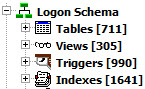
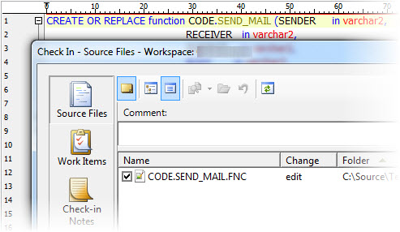
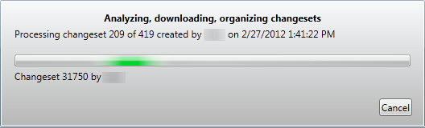
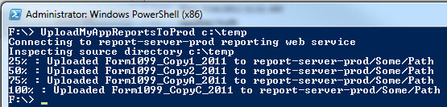
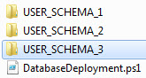
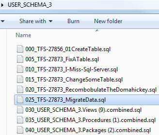
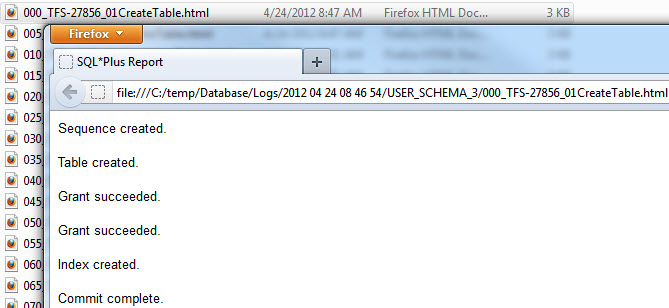

### Series Index

[Build Automation Part 1: Overview and Pre-build Tasks](/tech/2012/5/5/build-automation-part-1-overview-and-pre-build-tasks.html)  
[Build Automation Part 2: Building and Packaging](/tech/2012/5/8/build-automation-part-2-building-and-packaging.html)  
[Build Automation Part 3: App Deployment Script](/tech/2012/5/9/build-automation-part-3-app-deployment-script.html)  
Build Automation Part 4: Database and Report Deployments  
  

Unlike deploying the application itself in its entirety each time, database and report items have required incremental deployments due to their nature and sheer size. The question becomes how to manage these increments in coordination with the application bits to ensure everything is in sync.  
  

I do not pretend to have all the answers here. I was hoping this part of the process could get overhauled more with our last release but there is only so much time in the day.  
  

### Some Challenges

#### Size, Dependencies, Impact Analysis

 On the (Oracle) database side of our operational app we have around 800 tables, 500+ packages, 500+ views, 300+ functions and procedures, and a variety of other object types across 3 schemas. Running schema compares / diffs and doing sync scripts has been a time consuming pain in the past, regardless of various tools we have tried.  
  

The situation is complicated by some 10 database environments, other app databases our app is dependent on, various apps depending on our database, and dynamic SQL embedded into report RDL files or coming from ORM's like Entity Framework. Dependency and impact analysis can be difficult, particularly across systems.  
  

On the report side this app has over 600 SSRS reports scattered over 8 servers, several folders and different versions of SQL Server Reporting Services.  

#### Source Control

Source control for reports has not been a problem so much with using SSRS, other than TFS generating a lot of unnecessary merge conflicts on those XML RDL files.  
  

On the database side we have had some success using [Team Coding in Toad](http://www.quest.com/tv/All-Videos/1254973803001/How-to-Use-Toad-for-Oracle-Team-Coding/Video/) with the [TFS MSSCCI Provider](http://visualstudiogallery.msdn.microsoft.com/bce06506-be38-47a1-9f29-d3937d3d88d6). Quest came out with a [native TFS provider](http://www.toadworld.com/Blogs/tabid/67/EntryId/649/Configuring-Toad%C2%AE-Team-Coding-to-use-Microsoft-Team-Foundation-Server-2010.aspx) but it did not support TFS work item association which ruled out our use of it.  
  

The MSSCCI provider "works" with Toad for basic changes like packages, procedures, functions, triggers, views, etc. but boy it is not without a lot of quirks. So much so that for a while I saved any database object script changes to files on my desktop out of fear my changes would get overwritten, which used to happen quite a bit. The other problem is that not all changes are source controlled such as table schema changes, data changes etc. We offset that via some SQL file attachments to tasks tied to a project.  
  

  
  

### Pulling Report and Database Changes

  
  

I posted before about a custom [TFS Artifact Manager](/tech/2011/8/17/tfs-artifact-manager.html) (hereinafter "TAM") tool for pulling down report and database changeset files and task attachments either for a single work item or a large batch of related work items, such as all tasks linked through a series of scenarios, backlog items and bugs tied to a project. I won't repeat those details here but we currently still use the tool to gather up all the report and database changes for a given project release. It far from perfect but it beats manual guesswork and building sync scripts from database compares.  
  

The [TAM](/tech/2011/8/17/tfs-artifact-manager.html) tool is also used to pull artifacts from various single task ad-hoc changes made outside of any official product release. Many reports can be added to the application dynamically through some dynamic report forms with common parameters; new records are added to the database and the reports are deployed outside of any app deployment. Likewise there are occasional database changes made independent of the application.  
  

There are other tools mentioned in the [TAM](/tech/2011/8/17/tfs-artifact-manager.html) post that we may try using more in the future. Also, Troy Hunt has a good series of deployment posts including this one regarding [Automated database releases with TeamCity and Red Gate](http://www.troyhunt.com/2011/02/automated-database-releases-with.html). Doing exactly that with our schemas would make me a bit nervous but perhaps with tweaks and some experiments in the future.  
  

Additionally I posted a review on [Red Gate's Schema Compare for Oracle](/tech/2011/9/12/red-gate-schema-compare-for-oracle-review.html) which can be quite a useful tool. We don't rely on it as heavily anymore with custom tools and processes but it is handy to use it to double-check things after deployments or for doing more one-off database syncs.  
  

### Deploying Reports

#### Ad hoc Report Deployments

When deploying from Development to Test, our CI process picks up any reports merged from $/MyApp/Reports/Dev/ to $/MyApp/Reports/Main/ and automatically deploys those via PowerShell and [RS Utility](http://msdn.microsoft.com/en-us/library/ms162839.aspx). Any corresponding database changes are manually applied before that. Environments beyond Test currently require attaching report and database changes to a Help Desk ticket and routing to a DBA. The DBA runs any database changes and deploys the reports using the script mentioned in the next section.  

#### App Report Deployments

For reports to be deployed with a given build of an application, the process is basically the same as the ad-hoc process in respect to going from Dev to Test. One difference is on timing of merging the report changes in source control to correspond with any dependent changes to the application code. When moving beyond the Test environment, all reports tied to a given project work item are pulled using the [TAM](/tech/2011/8/17/tfs-artifact-manager.html) tool. They are then deployed in mass using PowerShell and the SSRS web service (without RS Utility), in a manner similar to this post on [Uploading SSRS Reports with PowerShell](/2011/10/13/uploading-ssrs-reports-with-powershell.html).  
  

  
  

### Deploying Database Changes

We currently do not have much automation around ad hoc database deployments but not much is needed there.  
  

For app database changes we start by pulling the database changes using the [TAM](/tech/2011/8/17/tfs-artifact-manager.html) tool. In that tool a script "package" is built by choosing the scripts to include and specifying any needed order or execution. Previously someone (dev or DBA depending on environment) would either execute all those manually by hand in Toad, or build out an index/driver script and run that. It was not as bad as it might sound, given the tool produced combined SQL scripts for views, packages, procs, etc. Still it was tedious if there were a number of data or schema migration scripts to be run in order.  
  

### Executing Database Scripts With PowerShell

Our resident Oracle expert [Jim Tilson](https://twitter.com/#!/jimtilson) ("[The Optimizer](http://allthingsoracle.com/experts/jim-tilson/)") had the idea of creating a PowerShell script that used SQL\*Plus to generically execute all database scripts in a given directory. I paired with him to get the basic interaction going but this is his brainchild and work. He should probably be the one explaining this but no telling when that slacker will get around to blogging :). If you have any interest in Oracle, SQL optimization, database tech in general, or Ruby, you should [reach out to him on Twitter](https://twitter.com/#!/jimtilson) and ask him to blog more (and tweet more while he is at it). At any rate this might be useful for others so I will post the code and attempt to explain it.  

#### Structure

The script expects all the database script files to be located in subfolders where the script resides, one folder per schema name, and no subfolders with each schema folder (not recursive).  

  
  

Each file in a schema folder will be executed regardless of filename extension. Ordering is based on filename; our TAM tool prefixes a numeric wart on each file to ensure an obvious order. At the moment the script does not explicitly specify a name ordering but that's the default.  
  

  

#### Executing Scripts for Each Schema

At the bottom of the script, the server TNS name is prompted for and a couple things are set before running the main run-scripts function.  

\[powershell highlight="3,4"\] set-location (Get-ScriptDirectory) $dateWart = Get-DateWart $server = read-host "Enter the server TNS name" run-scripts echo "Successfully ran all scripts." \[/powershell\]

Run-Scripts invokes a function to run the scripts for each schema, passing along the user and server info. This could be made more generic by assuming any subfolder where the PowerShell script resides represents a schema with database scripts to run.  

\[powershell\] function Run-Scripts { foreach ($user in @("USER\_SCHEMA\_1", "USER\_SCHEMA\_2", "USER\_SCHEMA\_3")) { run-scriptsforschema -server $server -user $user } } \[/powershell\]

#### Running Scripts for a Schema

This function will temporarily set location to the schema subfolder corresponding to the user/schema name passed in. It prompts for a password for a later connection to that schema. Finally it enumerates all files in the schema folder, calls a Run-Script function to execute each, and writes progress as it goes.  
  

Each successfully executed file is moved into a Completed subfolder. That file move is important as many migration scripts are written assuming they will only be run once and we have been bit by DBA's accidentally running scripts more than once.

\[powershell highlight="9,17,22"\] function Run-ScriptsForSchema($user) { echo "Running scripts for $user." push-location set-location $user $password = get-password($user) ensure-directory(".Completed")

$files = @(get-childitem | where {!$\_.PsIsContainer}) $count = 0 foreach ($fileInfo in $files) { write-progress -activity "Running scripts for $user" \` -currentoperation $fileinfo.name -status ("Executing") \` -PercentComplete (100\*$count/$files.count) Run-Script $user $password $fileInfo $count++ write-progress -activity "Running scripts for $user" \` -currentoperation $fileinfo.name -status ("Done") \` -PercentComplete (100\*$count/$files.count) move-item -path $fileInfo.fullname -destination ".Completed" -Force } write-progress -activity "Running scripts for $user" -status ("Complete") -completed pop-location echo "Completed scripts for $user" } \[/powershell\]

#### Running a Script

The Run-Script function takes care of some logging and calls a normalize function to tack on additional SQL before and after the SQL contained in the file (error handling, commits, etc.); more on that in a moment. Function notes follow.  

- **Path** - the sqlplus location should be in the SYSTEM PATH environment variable so fully qualifying it should not be needed. In my case the location is C:\\app\\_\[username\]_\\product\\11.2.0\\client\_1.
- **\-L Parameter** - instructs the app to only attempt to log on once; otherwise w/bad credentials it can get hung awaiting input.
- **\-M Parameter** - indicates HTML output is desired from sqlplus.
- **Credentials** - The server name captured earlier is passed in along with the user/schema and password parameter values.
- **SQL** - the normalize script function returns a SQL string and that is piped into sqlplus to be executed.
- **Output** - the output is sent to $logFile and the 2>$1 sends standard error to standard output.
- **Error checking** - Finally [$LASTEXITCODE](http://blogs.msdn.com/b/powershell/archive/2006/09/15/errorlevel-equivalent.aspx) is checked to see what sqlplus.exe exited with; if 0 it was successful, otherwise it is the Oracle error number. The process stops on any error; manual changes might be needed to address any problems then the script can be run again.

\[powershell highlight="7,8,10,12"\] function Run-Script($user, $password, $fileInfo) { $logDir = ("..Logs{0}{1}" -f $dateWart, $user) ensure-directory $logDir $logFile = join-path $logDir ($fileInfo.basename + ".html") (normalize-script $fileinfo.fullname) | sqlplus.exe -L -M "HTML ON SPOOL ON" \` -S "$user/""$password""@$server" >> $logfile 2>$1

$lec = $LASTEXITCODE if ($lec -ne 0) { write-error ("ERROR executing {0}!" -f $fileInfo.FullName) exit } } \[/powershell\]

#### Adjusting the SQL

There are two critical adjustments made to the SQL read from the database script files to execute. The first is detecting a SQL error and exiting SQL\*PLus with the error code. The other is issuing a commit at the end; most of our data related scripts do not include a commit as often they are ran and verified before issuing a commit. It is worth reading over the [WHENEVER SQLERROR](http://docs.oracle.com/cd/B19306_01/server.102/b14357/ch12052.htm) documentation as some types of errors will not trigger an exit; fully checking for all types of errors might require something more brittle like scanning the log files for certain error phrases.  

\[powershell highlight="4,7,8"\] function normalize-script($filename) { @" whenever sqlerror exit sql.sqlcode set echo off set termout off $(\[string\]::join("\`n", (get-content $fileinfo.fullname -readcount 0))) commit; exit "@ } \[/powershell\]

#### Helper Functions

At the top of the script are some helper functions and an interop services dll is loaded for later use in translating the secure password to a plain text string to be passed along to SQL\*Plus.  

\[powershell highlight="20,21,22"\] \[Reflection.Assembly\]::LoadWithPartialName("System.Runtime.InteropServices")

function Get-ScriptDirectory { Split-Path ((Get-Variable MyInvocation -scope script).Value.MyCommand.Path) }

function ensure-directory($dir) { if (!(test-path $dir)) { new-item $dir -type directory } }

function Get-DateWart() { get-date -uformat "%Y %m %d %H %M %S" }

function get-password($user) { $enterpassword = read-host -AsSecureString "Password for $user@$server" \[System.Runtime.InteropServices.Marshal\]::PtrToStringAuto(\` \[System.Runtime.InteropServices.Marshal\]::SecureStringToBSTR($enterpassword)); } \[/powershell\]

#### Analyzing the Results

The script stores logs under a Logs\\_\[Timestamp\]_\\_Schema_ folder for troubleshooting and verification purposes.  
  
  

#### SQL\*Plus Alternatives

One alternative to SQL\*Plus is using OracleCommand's ExecuteNonQuery method in Oracle.DataAccess.dll. I tried this approach back when I created an OracleScriptExecutor utility app that was designed to easily run SQL Scripts against multiple schemas. It was a bit of a nightmare that I do not recommend. For one you have to deal with annoyances like [linefeed issues](http://boncode.blogspot.com/2009/03/oracle-pls-00103-encountered-symbol.html), semicolon and BEGIN/END block issues, and it is quite difficult to deal with multiple scripts combined in one SQL file (i.e. '/' delimited). It almost requires a full blown SQL parsing engine to handle it correctly so I'd rather delegate that pain to a tool like SQL\*Plus that already handles such complexity.  
  

### In Conclusion

This really only scratches the surface of the problems and solutions in dealing with database and report deployments. With some time and TLC I am sure this beast could be further tamed. Thoughts, suggestions, tips, helpful tools, processes? Leave a comment!  
  

I am running out of time in this series but hopefully I can touch on some CI details with TeamCity next.
