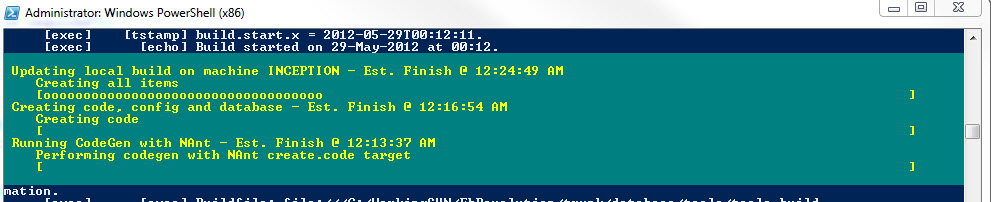

### The Goal

Recently I worked on a PowerShell module to do various application build related functions on development machines. One side objective was multi-level activity progress reporting with time estimation so activity duration could be gauged over time. The desire was for this to be done generically and quickly as it was more of a nice-to-have.  
  

### In Action

While running this, progress reporting looked something like the below.  
  

  
  

### Calls to Record Activity Progress

Some low-level functions in this module might be called directly at times and other driver functions might get called to chain together several activities. Either way progress is recorded at each level. Each function simply invokes a call to record the start of an activity as the first step and stopping it as the last.  

\[powershell\] function New-Build() # params omitted, body simplified for brevity { Start-Activity "Performing a new build" $percentComplete = 0 Log-Progress "Creating code" -PercentComplete $percentComplete New-CodeGen $percentComplete += 33 Log-Progress "Creating config" -PercentComplete $percentComplete New-Config $percentComplete += 33 Log-Progress "Creating DB" -PercentComplete $percentComplete New-DB -common Stop-Activity }

function New-CodeGen (\[bool\]$buildStatusUpdate = $true) { Start-Activity "Running CodeGen with NAnt" # ... real work done here ... Stop-Activity }

\# ... \[/powershell\]  

### Starting an Activity

First a stack is created at the script level to store the activities. The Start-Activity function creates a new object to store the activity name, start time, total duration and estimated duration (more on that later). This information is pushed onto the stack and output is sent to Write-Progress and Write-Output.  

\[powershell\] $\_activityStack = new-object Collections.Stack

function Start-Activity(\[string\]$activity = $(throw "activity is required")) { Write-Output "Activity starting: $activity" $act = new-object PSObject $act | add-member -membertype NoteProperty -name "StartTime" -value $(get-date) $act | add-member -membertype NoteProperty -name "Name" -value $activity $act | add-member -membertype NoteProperty -name "TotalSeconds" -Value 0 $act | add-member -membertype NoteProperty -name "EstimatedSeconds" \` -Value (Get-ActivityEstimatedSeconds $activity) $\_activityStack.Push($act) Log-Progress $activity } \[/powershell\]  

### Stopping an Activity

Stop-Activity will pop the most recent activity off the stack and calculate the duration. It then writes the completion data to progress and output as well as to a stats file that stores the durations by activity name.  

\[powershell\] function Stop-Activity { $id = $\_activityStack.Count $act = $\_activityStack.Pop() $ts = $(get-date) - $act.StartTime $act.TotalSeconds = $ts.TotalSeconds $time = "" if ($ts.TotalMinutes -ge 1) { $time = "{0:##.00} minute(s)" -f $ts.TotalMinutes } else { $time = "{0:##.00} second(s)" -f $ts.TotalSeconds } # TODO: add in $act.EstimatedSeconds if > 0 $status = ("'{0}' complete in {1}" -f $act.Name, $time) Write-Progress -Activity $act.Name -Status $status -Completed -Id $id Write-Output $status Write-Stats $act } \[/powershell\]  

### Writing Activity Stats

Write-Stats takes in the activity object and adds it to an array. If the stats (CSV) filename exists it reads it in, sorts the data in descending time order, adds up to $maxKeep (50) existing records into the array, and removes the existing file. The stats filename is then written out with the most recent records.  

\[powershell\] function Write-Stats ($act = $(throw "activity is required")) { # initialize an array to hold recent stats for this activity $recent=@() $recent += $act $statsFile = Get-StatsFilename $maxKeep = 50 # across all activities; several different, want a few of each if (Test-Path $statsFile) { # get a list of the $maxKeep-1 most recent stats and add each path to the $recent array # | Where-Object {$\_.Name -eq $act.Name} Import-CSV $statsFile | Sort StartTime -Descending \` | Select -Last ($maxKeep -1) | foreach {$recent+=$\_} # remove the file as we have the data in memory and want to re-write w/top item # and desc time sort Remove-Item $statsFile -force } $recent | select StartTime, Name, TotalSeconds | Export-Csv $statsFile -NoTypeInformation } \[/powershell\]  

### Getting Activity Estimated Time

Time estimation is done via reading in the CSV file, filtering on the activity name, adding the completion time for each to an array, and averaging those values.  

\[powershell\] function Get-ActivityEstimatedSeconds(\[string\]$activityName) { $statsFile = (Get-StatsFilename) $avg = -1 if (Test-Path $statsFile) { $totalSeconds=@() Import-CSV $statsFile | Where-Object {$\_.Name -eq $activityName} \` | foreach {$totalSeconds+=$\_.TotalSeconds} $m = $totalSeconds | measure-object -ave $avg = $m.Average }

return $avg } \[/powershell\]  

### Misc. Functions

Log-Progress writes both to standard out and to progress. It retrieves the current activity without removing it from the stack, formats the estimated completion time calculated earlier, and adds that to the progress information. The number of current activities is used as the progress bar id since there will be multiple levels; in my case everything is done serially. Initially I set the estimated seconds argument on Write-Progress but found it misleading; my script shells out to various other apps and that is blocking - it won't update via a timer or anything like that.  

\[powershell\] function Log-Progress(\[string\]$msg, \[int\]$percentComplete = 0) { Write-Output $msg $act = $\_activityStack.Peek() $id = $\_activityStack.Count # the problem with -SecondsRemaining is it won't auto update w/timer or anything # so it will be helpful at first and then quickly misleading $actName = $act.Name if ($act.EstimatedSeconds -ge 0) { $estFinish = $act.StartTime.AddSeconds($act.EstimatedSeconds) $actName += " - Est. Finish @ " + $estFinish.ToString("hh:mm:ss tt") } Write-Progress -Activity $actName -Status $msg -PercentComplete $percentComplete \` -Id $id #-SecondsRemaining $act.EstimatedSeconds } \[/powershell\]

For simplicity all activity details are stored in the same file, up the max limit defined in Write-Stats.  

\[powershell\] function Get-StatsFilename { # considered a separate file per activity but we can filter out of one file # too much clutter w/sep and would have to build a safe filename with activity name $file = (Join-Path (Get-StatsFilePath) "Stats.csv") return $file }

function Get-StatsFilePath { $path = (join-path $env:LOCALAPPDATA "MyCompany\\MyApp\\build\_output\\stats") if (!(Test-Path $path)) { New-Item $path -type directory | Out-Null } return $path } \[/powershell\]  

### In Conclusion

Other options on timing activities include things like the [Stopwatch](http://msdn.microsoft.com/en-us/library/system.diagnostics.stopwatch.aspx) class or PowerShell's [Measure-Command](http://technet.microsoft.com/library/ee176899.aspx). I'll use those more for ad-hoc measuring here or there. In the case of my module though, I found this "CSV stack" approach to work well as a simple, generic way to time everything across the board. If there are a large number of activity records being kept, deep function chaining, and/or threading work this approach might be a bit more problematic and slow.
