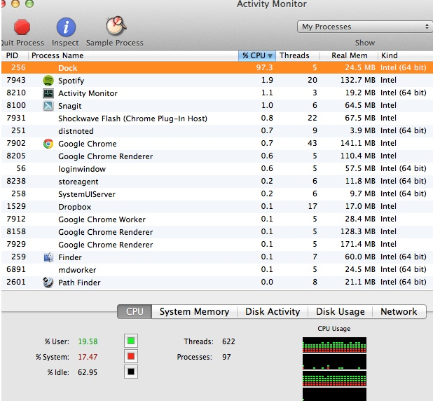

### Time for a New Computer

My mid-2009 MacBook Pro has been good to me as my first Mac. However after 3+ years it was showing its age with slow performance, particularly with any heavy disk access and especially running Windows. It stopped resuming from sleep quite a bit and started locking up more. I had previously upgraded it from 4 to 8 GB of memory and considered switching it to use an SSD but wanted more. I usually end up replacing my computers every 2-4 years or so anyway with 3 being the average of late. So I decided to start backing everything up with [CrashPlan](http://www.crashplan.com/) and start shopping around.  
  

### To Stick with Apple or Not

I've always been a Windows guy and a Microsoft developer and have been happy there personally and professionally. I originally bought a Mac for iPhone development and because I thought it was wise to diversify and mix things up. I've certainly learned a lot and have enjoyed the Mac life for the most part. However I still prefer Windows 7 over Mac OS X in many ways; I'm more a fan of iOS than OS X. I still feel a Mac at home and Windows at work is a good arrangement, I like Apple's innovation and hardware, and I can run both operating systems well on a Mac but not the other way around. That's enough to keep me locked into the "dark side" for now.  
  

### Apple's New Lineup

I was really tempted to buy the new retina MackBook Pro after drooling a bit at the Apple Store. The display was beautiful to look at, especially text readability and any high-res images, and I liked the smaller form factor and extra power, among other things.  
  

However there were a few things with the rMBP that gave me pause:

- **Price** - A 256GB HD isn't large enough for me so that means the $2800 model; add in tax and AppleCare and it's up to nearly $3,500. Talk about $ticker $hock.

- **Portability** - After using a MacBook Air for a bit, that light, super portable form factor is hard to give up. The retina MBP is quite lighter than my MBP but it still feels heavy and large next to the Air.

- **The Bleeding Edge** - The icons in many third party apps look pretty bad with such an HD display. While major apps were/are updated quickly, others will take some time. I have more concerns about website images which aren't likely to be upgraded any time soon just to clean them up for HD displays at the cost of slower load times. I've also seen posts regarding plasma style image burn-in, overheating, and resolution issues in Windows to name a few.

Those things were enough for me to decide against a rMBP for now. I considered the standard MBP which was still refreshed enough and a decent middle ground between the extremes of the rMPB and the Air. Ultimately though it was still pricey and portability is more important to me these days. So I decided it was time to look seriously at the MBA.  
  

### Evaluating the Air

The initial Air model seemed more like a lightweight netbook for email and surfing by execs. Last year's model seemed beefed up enough for several developers to be happy with them as dev machines. With the 2012 model especially I felt like they had sufficient power and the benchmarks beat my MBP. I decided to go ahead and buy a fully loaded 13" Air with 512GB flash storage, 8GB RAM, and a 2.0GHz dual core i7. I figured I had 14 days to return it if it didn't work for me.  
  

### Initial Impressions

#### Connections

Connecting my Apple LED Cinema display (prior generation model) was a little awkward. First the power cord doesn't fit the Air; I knew this ahead of time but wasn't fond of another cord to run and leaving the monitor's laptop power cord hanging felt strange. The other minor annoyance was that the thunderbolt port was on the right side of the Air, instead of the left side where the Mini DisplayPort is on my MBP. This meant a further, tighter cord stretch with my desk setup. However those are minor complaints and at least Thunderbolt is backwards compatible with Mini DisplayPort connections and the monitor still works great.  
  

I decided to bite the bullet and spring for a $99 super drive. While I rarely use optical discs, I did have some installs of large software packages that I preferred not to re-download, and some older software that can't easily be found online. Additionally I have data on some discs that I occasionally need to read and didn't want to connect a really old and bulky external disc drive I had.

#### Weight and Size

I got an idea of weight and size of the Air in the Apple store but it wasn't until using it at home that I really appreciated it. My MBP which never felt \*that\* heavy suddenly felt like a tank. Before I rarely unplugged it and removed it from my desk but with the Air I found myself taking it all over instead of reaching for my iPad as much or returning to my desk.

#### Speed

Cold boot time with the SSD (my first) was just over 20 seconds, including my fumbling around with the mouse and keyboard to type my password. Installs and app launches were very zippy and I was quite pleased. Going to and from sleep was nearly instantaneous.  
  

### Bootcamp Debacle

#### To Bootcamp or not to Bootcamp

Bootcamp bothered me in the past with subpar drivers from Apple and having to partition the hard disk and dual boot or pay a performance penalty using a VM like Parallels or Fusion against Bootcamp. However there were enough issues with going VM-only that brought me back to Bootcamp:

- **Phone emulators** - Some mobile dev emulators such as Windows Phone wouldn't run under Parallels; the VM inside a VM Inception type problem. However I believe Fusion worked and maybe this has since been fixed in Parallels.

- **Silverlight** - there was at least one Silverlight runtime issue that was specific to running inside a VM.

- **Compatibility, performance** - some other select apps and games had problems running virtually either compatibility wise or performance wise.

To the best of my knowledge the situation with these types of issues hasn't changed much. Issues aside, if I'm going to be doing longer periods of Windows development on my Mac, it is convenient to just boot into Windows in ways (especially with the speedy SSD). So bootcamp it is.  

#### Bootcamp Setup While Half Asleep

I made the mistake of setting up Bootcamp while half asleep and without coffee and I gave it no forethought whatsoever. I did this 3 years ago after all, who needs forethought? So have a laugh at my expense. Go on.  
  

Fail 1

Attempted to get away with 4GB USB thumb drive. Win7 was a bit over 3GB but w/bootcamp drivers etc. it wasn't enough. 8GB thumb drive it is.  
  

Fail 2

Tried creating an ISO from a Win7 DVD using Toast and my MBP. Somehow it produced a corrupt ISO.  
  

Fail 3

Tried creating an ISO from a Win7 DVD using Disk Utility and my MBP:

- Selected disc in Disk Utility
- File->New Disc Image From
- Chose the CD/DVD .cdr option
- Saved .cdr to my public folder
- Renamed .cdr to .iso (seriously Apple why not .iso)
- Pointed Bootcamp assistant on my Air to Win7 iso on my MBP public folder
- Copied 25% of Windows files and hung indefinitely

Fail 4

At this point I start to wake up and remembered I had the superdrive. Forget the dang thumbdrive. In Bootcamp Assistant I dedicated 200GB to the Windows partition, leaving some 230GB to the Mac side. However Bootcamp assistant did not give the option of using the external disc drive; only a thumb drive. I was able to uncheck that but when rebooting it tried to boot off the thumb drive and not the DVD. I tried holding down the Option key and selecting the disc drive but received a "CDBOOT: Couldn't find BOOTMGR" error.  
  

Fail 5 / Win 1

Okay well that disc should have been bootable but maybe the Air doesn't allow booting off a Windows disc from an external disc drive. Fine, back to the thumb drive it is; I copied the iso from my Air to it and went back to Bootcamp Assistant. I chose the same partition size as before and I rebooted. Now I was in Windows setup and after formatting the bootcamp partition I was into Windows and all looked good for a moment. Then I noticed networking wasn't working along with about everything else. I realized the bootcamp drivers weren't installed and for some crazy reason I thought for a moment that they should have been automagically installed already. Coffee Geoff, coffee. I browsed to the bootcamp setup on the thumb drive and afterwards all was right with the world.  
  

### Setting Up For Development

After about a hundred Windows Updates, I installed Visual Studio 2010 w/SP1, VS2012 RC, ReSharper, various VS extensions, DropBox, SnagIt, SkyDrive, and other misc apps. I fired up Visual Studio 2012 and opened some projects and all felt good. However I was more curious of how it performed from the Mac side. I installed Parallels 7 and dedicated 3GB of RAM and 2 CPUs to the bootcamp VM.  
  

### Performance

Here is screencast I captured that gives an idea of performance.

  
  

<iframe src="http://player.vimeo.com/video/45681666" width="500" height="313" frameborder="0" webkitallowfullscreen mozallowfullscreen="" allowfullscreen=""></iframe>

  
  

So I could launch Windows and startup apps in a VM, open VS 2012 w/various addons, load a modest sized solution like SignalR, build and run it in ~2 minutes which is certainly acceptable to me.  

#### Other Misc. Timings

- Windows and VS 2012 fully loaded and ready via Parallels: ~45 seconds
- git clone SignalR: < 8 seconds
- Initial SignalR build.cmd run (includes executing unit tests): under 2 mins
- Cold boot time into Mac including entering password and startup apps: < 22 seconds

#### MBP Comparision

The performance blows away my MBP. Getting Windows and VS 2012 fully loaded via Parallels for example could take as long as 13 minutes on my MBP, compared with 45 seconds on the Air. Although then again my MBP doesn't have an SSD and that's the majority of the difference along with 3 years of age. It would be more interesting to compare development related timings between the Air and the rMBP.  

#### The Boot Selection Screen

When holding down the Option key at startup to boot Windows, it took longer than on my MBP to kick off Windows after selecting it and hitting Enter. My best guess was the addition of the WiFi dropdown on the Air that I do not get on my MBP. I have several wireless networks in my area and it appears the delay is trying to scan and list them all. I wonder if that feature can be turned off?  
  

### Putting it to Work

#### Heat and Fan

Over more extended Visual Studio development sessions (Parallels or straight boot camp) or during movie editing with Quicktime or iMovie, the laptop got a bit warm and the fan would kick on for a while and seemed rather noisy. Part of that is more noticeable because of the otherwise silent operation I think. In general the Air didn't get too hot or too loud for too long.  

#### Battery Life

Battery life was excellent, coming close to the the advertised 7 hour mark, at least while staying in Mac land. Rebooting into Windows and staying there drained it a good deal quicker but still pretty good life.  

#### Windows

It is a shame the bootcamp drivers dumb things down so Windows cannot take full advantage of the hardware like the Mac side can (graphics switching, CPU boost, smarter power mgt). I'm not sure whether to buy the conspiracy theories that Apple is trying to make Windows look bad or if it is more that there is not much incentive for them to take the kind of time to support that.  

#### A Freak Dock Issue

One strange issue happened when I plugged in the Air to charge it and then accidentally deleted the Desktop background image. The fan kicked on hard and the CPU usage went up to almost 100%. When I checked things out it was the Dock process. Killing it and other apps didn't help. A reboot fixed the issue and it hasn't happened since. I did see others mentioning a similar issue online in reference to an older version of Parallels.  
  

  
  

### Summary

At the end of the day this is still a modestly powered portable laptop and not a power workstation. So far though I do not see any indication that it can't serve well as my primary personal development machine. I'm sure over time as I load it up more it'll slow down and it won't be ideal for heavy HD video editing or games. Worst case scenario I'll switch over to my work laptop or back to a desktop for heavy duty work should it get to that but I'm not sure it will. I would rather sacrifice some power for the portability, price and battery life and I cannot see myself giving this up yet. Time will be the ultimate test but so far, so good.
