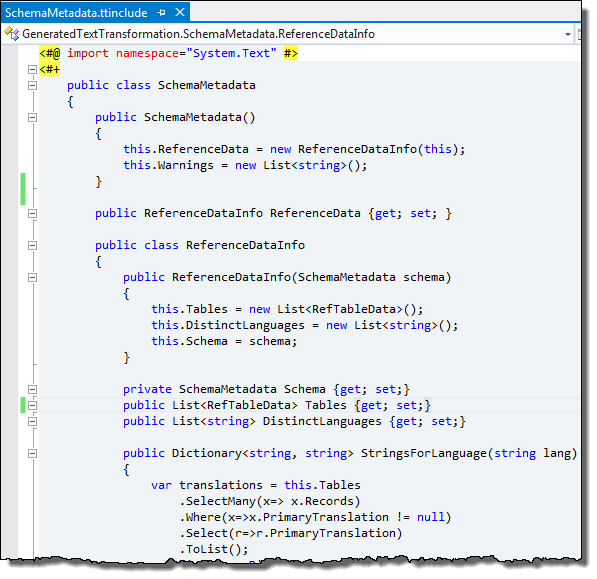
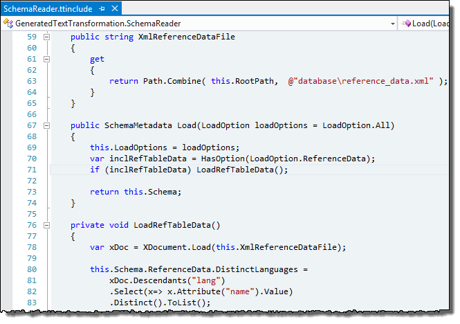
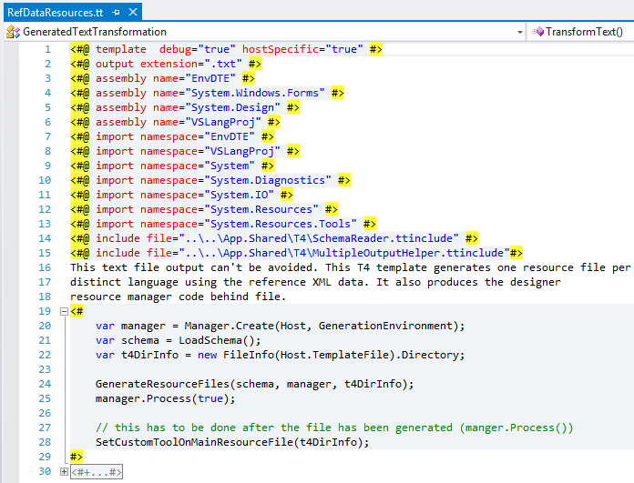
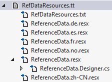
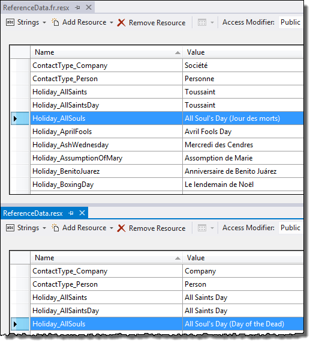
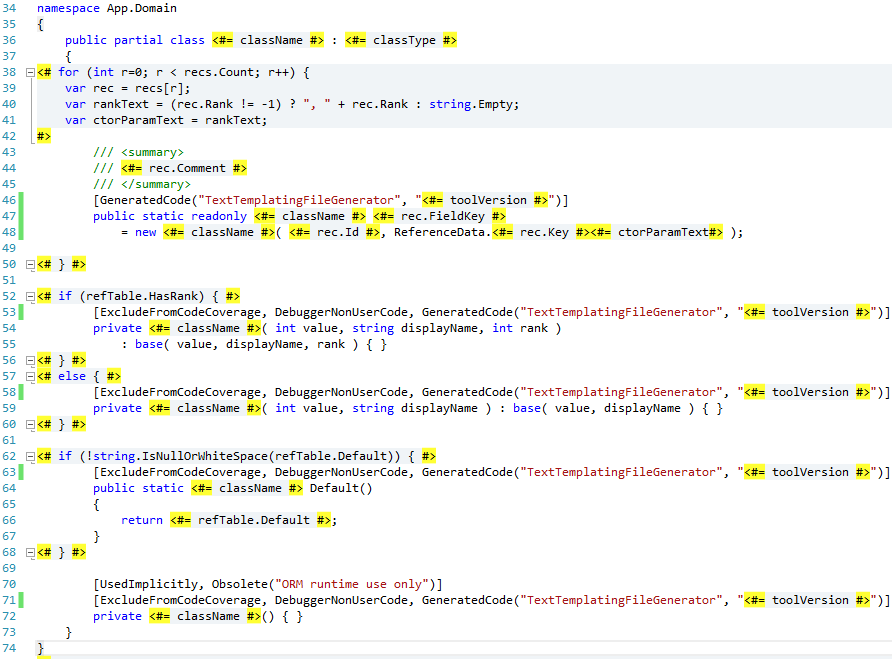
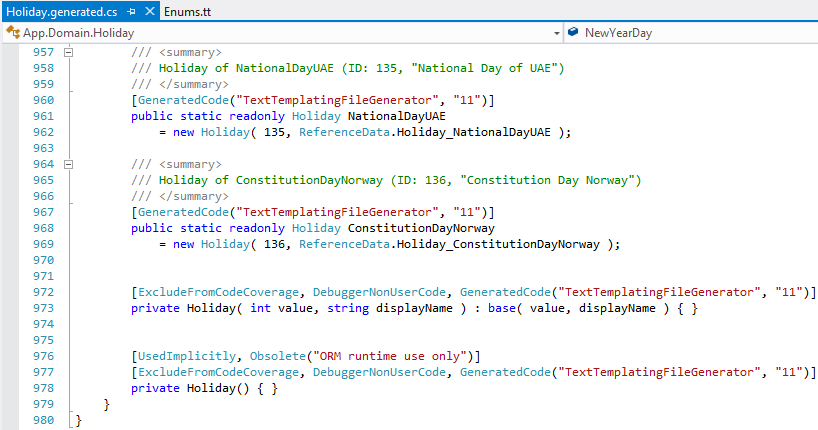

In working on the domain layer of an application, I wrote a couple of typesafe enumeration classes that mirrored data in a couple of reference tables in a database. If you are not familiar with the pattern, Jimmy Bogard's [Enumeration classes post](http://lostechies.com/jimmybogard/2008/08/12/enumeration-classes/) explains the pattern and rationale. The classes I wrote inherit from a modified version of the Enumeration class presented in Jimmy's post. The basic idea was to avoid switches and provide more functionality than an enum could offer. In our case the enum members mirrored a reference table and would be used for domain logic and for dropdown lists.  
  

As the app progressed we had more of a need to do this for other reference tables, some of which had several records. At this point we decided to look into T4 to generate the typesafe enum classes. Since this application has a worldwide audience, the display names of the enum members needed globalization consideration since some of the enum values would end up in dropdown lists displayed to end users. I decided to create two T4 files, one to generate resource files with display name strings, and another to generate the enum classes that would use the resource strings.  
  

### Reference Datasource

This application uses XML files for various database definitions including reference data; these files get parsed to build the SQL Server database in automated fashion.  
  

A sample of reference\_data.xml looks something like:  

\[xml\] <referenceData> <refTable name="CONTACT\_TYPE" alias="ContactType" default="Person"> <record CONTACT\_TYPE\_ID="1" CONTACT\_TYPE\_NAME="Company" RANK="2"> <langs field="CONTACT\_TYPE\_NAME"> <lang name="en">Company</lang> <lang name="de">Gesellschaft</lang> <lang name="es">Empresa</lang> <lang name="zh-CN">公司</lang> <lang name="fr">Soci&#233;t&#233;</lang> </langs> </record> <record CONTACT\_TYPE\_ID="2" CONTACT\_TYPE\_NAME="Person" RANK="1"> <langs field="CONTACT\_TYPE\_NAME"> <lang name="en">Person</lang> <lang name="de">Person</lang> <lang name="es">Persona</lang> <lang name="zh-CN">人</lang> <lang name="fr">Personne</lang> </langs> </record> </refTable> </referenceData> \[/xml\]

  

### Schema Metadata and Parsing

Since multiple projects needed to perform T4 code generation off database schema information, I defined some T4 include files in a shared project to define the schema structure and XML parsing logic. This would make the T4 code easier and prevent duplicating XML parsing logic in multiple T4 files.  
  

First SchemaMetadata.ttinclude defines the classes that hold the schema information in a T4-friendly manner:  
  
  

Next SchemaReader.ttinclude would get consumed by T4 files to parse the XML data and return friendly objects defined in SchemaMetadata.ttinclude:  
  
  

This shared T4 folder also included MultipleOutputHelper.ttinclude from [this Damien Guard post](http://damieng.com/blog/2009/11/06/multiple-outputs-from-t4-made-easy-revisited) to make splitting T4 output into multiple files a bit easier.  
  

### RefDataResources.tt

This T4 file generates one resource file per language and will setup the custom tool to produce the designer generated file to reference the resources in code:  

  

Inside the function block of this file the schema data is loaded and the resource files are generated:  

\[csharp\] const string ReferenceData = "ReferenceData";

private SchemaMetadata LoadSchema() { var loader = new SchemaReader(Host); var schema = loader.Load(SchemaReader.LoadOption.ReferenceData); return schema; }

private void GenerateResourceFiles(SchemaMetadata schema, Manager manager, DirectoryInfo t4DirInfo) { var distinctLanguages = schema.ReferenceData.DistinctLanguages; foreach (var lang in distinctLanguages) { var resxNameNoExt = ("en" != lang) ? ReferenceData + "." + lang : ReferenceData; var resxName = resxNameNoExt + ".resx"; manager.StartNewFile(resxName);

var resxFilename = Path.Combine(t4DirInfo.FullName, resxName); // use .net's ResXResourceWriter so we don't have to worry about the XML format using (ResXResourceWriter resx = new ResXResourceWriter(resxFilename)) { var strings = schema.ReferenceData.StringsForLanguage(lang);

foreach (var warn in schema.Warnings) { base.Warning(warn); }

foreach (var de in strings) { try { resx.AddResource(de.Key, de.Value); } catch (Exception ex) { base.Warning(ex.ToString()); } }

resx.Generate(); resx.Close(); }

// we've written the file but outside the process of T4. // In order to get the file to automatically added as a new output file // underneath the t4 file, we must write the generated content to output stream Write(File.ReadAllText(resxFilename));

manager.EndBlock(); } // end for each lang loop } \[/csharp\]  

In the above code block there are a couple of things worth pointing out. First, the filename of the main / default language resource file will be ReferenceData.resx for English (en), otherwise ReferenceData.**lang**.resx for other languages. Second, the output from .NET's ResXResourceWriter gets read in with `File.ReadAllText` and written to T4 output with `Write`; otherwise the generated content would just exist on disk and would not get added into the project nested under the T4 file.  
  

Finally, to get the designer generated class created, a function is created to set the custom tool property on the main ReferenceData.resx file that was generated. For the initial add that would be enough. However we also invoke execution of the custom tool with `RunCustomTool()` to handle the case where reference data is modified later on and the T4 transformation is performed again:  

\[csharp\] private void SetCustomToolOnMainResourceFile(DirectoryInfo t4DirInfo) { // WARNING: You are entering the dark land of EnvDTE COM. You've been warned var hostServiceProvider = (IServiceProvider) Host; var dte = (EnvDTE.DTE) hostServiceProvider.GetService(typeof(EnvDTE.DTE)); var filename = Path.Combine(t4DirInfo.FullName, "ReferenceData.resx"); var projectItem = dte.Solution.FindProjectItem(filename); projectItem.Properties.Item("CustomTool").Value = "PublicResXFileCodeGenerator"; projectItem.Properties.Item("CustomToolNamespace").Value = "App.Domain"; var projItemObj = (VSProjectItem)projectItem.Object; projItemObj.RunCustomTool(); } \[/csharp\]  

Running the T4 produces the following files:  
  
  

The resource strings are created with a TableName\_FieldNameValue format:  
  
  

### Enums.tt

Enums.tt reads the schema data just as in RefDataResources.tt and generates the C# typesafe enum class. The full source is available with the sample code for this post.  
    
  

A small example of the generated output (ContactType.generated.cs):  

\[csharp\] //------------------------------------------------------------------------------ // <auto-generated> // This code was generated from a template. // // Changes to this file may cause incorrect behavior and will be lost if // the code is regenerated. // </auto-generated> //------------------------------------------------------------------------------ using System; using System.CodeDom.Compiler; using System.Diagnostics; using System.Diagnostics.CodeAnalysis; using JetBrains.Annotations;

namespace App.Domain { public partial class ContactType : Enumeration { /// 
 /// ContactType of Company (ID: 1, "Company") /// 
 \[GeneratedCode("TextTemplatingFileGenerator", "11")\] public static readonly ContactType Company = new ContactType( 1, ReferenceData.ContactType\_Company );

/// 
 /// ContactType of Person (ID: 2, "Person") /// 
 \[GeneratedCode("TextTemplatingFileGenerator", "11")\] public static readonly ContactType Person = new ContactType( 2, ReferenceData.ContactType\_Person );

\[ExcludeFromCodeCoverage, DebuggerNonUserCode, GeneratedCode("TextTemplatingFileGenerator", "11")\] private ContactType( int value, string displayName ) : base( value, displayName ) { }

\[ExcludeFromCodeCoverage, DebuggerNonUserCode, GeneratedCode("TextTemplatingFileGenerator", "11")\] public static ContactType Default() { return Person; }

\[UsedImplicitly, Obsolete("ORM runtime use only")\] \[ExcludeFromCodeCoverage, DebuggerNonUserCode, GeneratedCode("TextTemplatingFileGenerator", "11")\] private ContactType() { } } } \[/csharp\]  

Of course there's more value in automatically generating all of the reference enums or at least those with more members:  
  
  

### Testing It Out

First some basic tests just to ensure the resource files and strongly typed resource class generated correctly:  

\[csharp\] using System.Globalization; using NUnit.Framework; using System.Threading;

namespace App.Domain.Tests { \[TestFixture, Category("Unit")\] public class ReferenceDataI18NTests { \[Test\] public void English\_To\_French\_Strings\_Change() { var orig = Thread.CurrentThread.CurrentUICulture; Assert.AreEqual("Company", ReferenceData.ContactType\_Company); Thread.CurrentThread.CurrentUICulture = new CultureInfo("fr-FR"); Assert.AreEqual("Société", ReferenceData.ContactType\_Company); Thread.CurrentThread.CurrentUICulture = orig; }

\[Test\] public void English\_To\_Spanish\_Strings\_Change() { var orig = Thread.CurrentThread.CurrentUICulture; Assert.AreEqual("Company", ReferenceData.ContactType\_Company); Thread.CurrentThread.CurrentUICulture = new CultureInfo("es"); Assert.AreEqual("Empresa", ReferenceData.ContactType\_Company); Thread.CurrentThread.CurrentUICulture = orig; }

\[Test\] public void English\_To\_German\_Strings\_Change() { var orig = Thread.CurrentThread.CurrentUICulture; Assert.AreEqual("Company", ReferenceData.ContactType\_Company); Thread.CurrentThread.CurrentUICulture = new CultureInfo("de"); Assert.AreEqual("Gesellschaft", ReferenceData.ContactType\_Company); Thread.CurrentThread.CurrentUICulture = orig; }

\[Test\] public void English\_To\_Chinese\_Taiwan\_Strings\_Change() { var orig = Thread.CurrentThread.CurrentUICulture; Assert.AreEqual("Company", ReferenceData.ContactType\_Company); Thread.CurrentThread.CurrentUICulture = new CultureInfo("zh-CN"); Assert.AreEqual("公司", ReferenceData.ContactType\_Company); Thread.CurrentThread.CurrentUICulture = orig; } } } \[/csharp\]  

Just to make sure the Enumeration class works as expected, some tests to exercise it through one of the concrete classes:  

\[csharp\] using System.Linq; using FluentAssertions; using NUnit.Framework;

namespace App.Domain.Tests { \[TestFixture( Description = "Tests base Enumeration class via PhoneType concrete class")\] \[Category("Unit")\] public class EnumerationTests { \[Test\] public void FromValue\_Matches\_Type\_Value() { var fromValue = Enumeration.FromValue<PhoneType>(PhoneType.Cell.Value); Assert.AreEqual(PhoneType.Cell, fromValue);

fromValue = Enumeration.FromValue<PhoneType>(PhoneType.Voice.Value); Assert.AreEqual(PhoneType.Voice, fromValue); }

\[Test\] public void FromDisplayName\_Matches\_Type\_Name() { var fromName = Enumeration.FromDisplayName<PhoneType>(PhoneType.Fax.DisplayName); Assert.AreEqual(PhoneType.Fax.DisplayName, fromName.DisplayName);

fromName = Enumeration.FromDisplayName<PhoneType>(PhoneType.Pager.DisplayName); Assert.AreEqual(PhoneType.Pager.DisplayName, fromName.DisplayName); }

\[Test\] public void ToString\_Equals\_DisplayName() { Assert.AreEqual(PhoneType.Cell.DisplayName, PhoneType.Cell.ToString()); }

\[Test\] public void Absolute\_Difference\_Math\_Is\_Correct() { var diff = Enumeration.AbsoluteDifference(PhoneType.Cell, PhoneType.Voice); Assert.AreEqual(3, diff); diff = Enumeration.AbsoluteDifference(PhoneType.Voice, PhoneType.Cell); Assert.AreEqual(3, diff); }

\[Test\] public void GetAll\_Contains\_Expected\_Members() { var all = Enumeration.GetAll<PhoneType>().ToList(); Assert.AreEqual(4, all.Count); Assert.NotNull(all.FirstOrDefault(x => x == PhoneType.Cell)); Assert.NotNull(all.FirstOrDefault(x => x == PhoneType.Fax)); Assert.NotNull(all.FirstOrDefault(x => x == PhoneType.Pager)); Assert.NotNull(all.FirstOrDefault(x => x == PhoneType.Voice)); Assert.NotNull(all.FirstOrDefault(x => x == PhoneType.Default())); }

\[Test\] public void Equality\_Two\_Are\_Equal() { var one = PhoneType.Cell; var two = PhoneType.Cell; Assert.AreEqual(one, two); Assert.True(one == two); }

\[Test\] public void Equality\_Two\_Different\_Not\_Equal() { var one = PhoneType.Cell; var two = PhoneType.Voice; Assert.AreNotEqual(one, two); Assert.True(one != two); }

\[Test\] public void Equality\_One\_Null\_Not\_Equal() { PhoneType.Cell.Equals(null).Should().BeFalse(); }

\[Test\] public void Compare\_To\_Succeeds() { var diff = PhoneType.Cell.CompareTo(PhoneType.Fax); diff.Should().Be(1);

diff = PhoneType.Fax.CompareTo(PhoneType.Cell); diff.Should().Be(-1); }

\[Test\] public void Invalid\_Parse\_Number\_Throws() { Assert.That(() => { Enumeration.FromValue<PhoneType>(999); }, Throws.Exception); } } } \[/csharp\]  

### There's More

- For simplicity some complexity was removed from the T4. This includes reference tables that have foreign keys to other reference tables (including strongly typed properties and ctor params) and resource strings for fields other than the primary display name.
- One thing that bothered me initially with this was it felt a bit like introducing Data Driven Design into an otherwise Domain Driven Design paradigm. This was offset somewhat with aliases for table names (or a naming convention pattern) and reference tables could be selectively ignored in code generation through the use of attributes or other means. Another possible issue is class name conflicts with existing types in the domain project; this could be offset with a different namespace and/or naming convention.
- Many apps load reference data from the database each time it's needed, or load it once and cache it until invalidated. Other apps may let users edit select sets of reference type data. If the data is likely to change during an app session or if users can edit some of it, chances are it isn't truly reference data to begin with. With a good deployment process, any compiled reference data info can be easily deployed and various reference data is likely to be tied to app business and presentation rules anyway.
- Several of the enum classes would have corresponding partial classes for extended logic. For this reason, various code generation type attributes were places directly on generated members and not on the class itself, per [various guidance](http://blogs.msdn.com/b/codeanalysis/archive/2007/04/27/correct-usage-of-the-compilergeneratedattribute-and-the-generatedcodeattribute.aspx).
- An example use in the domain would be a ContactType enum property on a Contact object and requiring different fields when attempting to add contacts of different types. This app uses [this component strategy](http://stackoverflow.com/questions/6366956/mapping-an-iusertype-to-a-component-property-in-fluent-nhibernate) in Fluent NHibernate to map the data from the database reference table into the domain class. For the UI side, Enumeration.GetAllMembers can be used along with AutoMapper to get the id and text values into simple ViewModel types for select lists.

### Code

[T4RefDataCode.zip](/wp-content/uploads/2017/05/T4RefDataCode.zip)
