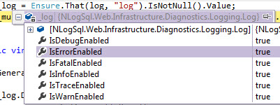
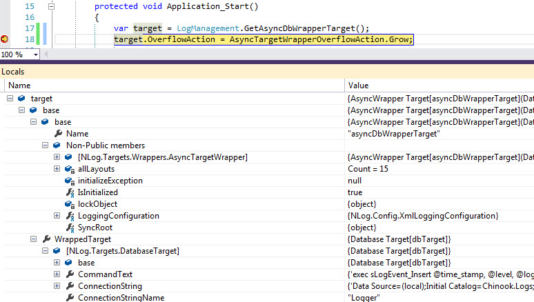
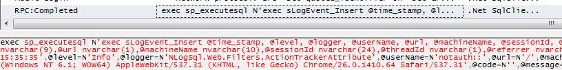
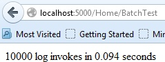
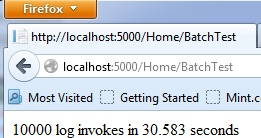
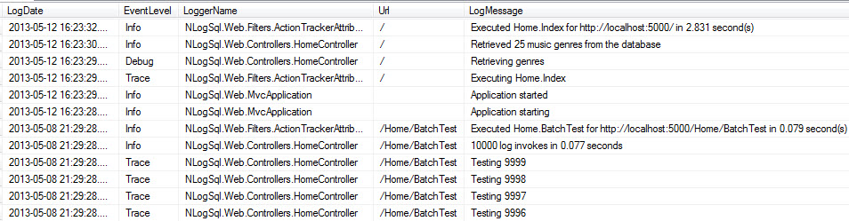
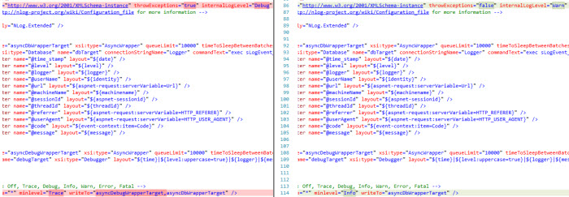

It was the eleventh hour before a web app was to go live and there was nothing in place for error handling or logging. You're shocked I'm sure (that's my sarcastic voice). Normally with web apps in the past I've used [ELMAH](https://code.google.com/p/elmah/) for unhandled error logging and NLog with text file targets for other logging.  
  

ELMAH works great but in this case I was told it was pulled for some reason. With no time to find out the story there I threw together something to capture basic error details and send an email. Later that grew and was customized and ELMAH never returned though perhaps it should have. Still there are benefits of doing this yourself including more customization, less bloat, less hunting through perhaps lacking documentation etc.  
  

On the logging front I still wanted to use NLog but text file logging was no longer a fit. This app had a few instances behind a load balancer and central logging was needed plus it needed a higher volume of logging in some troublesome workflows, more so than the occasional errors or warnings here and there. I had not used NLog with SQL Server before but this seemed like the perfect time to do so.  
  

### Series Overview

Part 1 - Setting up logging with ASP.NET MVC, NLog and SQL Server  
  

[Part 2](/tech/2013/5/24/aspnet-nlog-sql-server-logging-and-error-handling-part-2.html) - Unhandled exception processing, building an error report, emailing errors, and custom error pages.  
  

### Setup and Configuration

I began by installing the [NLog](http://nuget.org/packages/NLog/) NuGet package and the [NLog.Extended](http://nuget.org/packages/NLog.Extended/) package for asp.net specific information into the ASP.NET MVC 4 project. The [NLog.Config](http://nuget.org/packages/NLog.Config/) package is useful for a standalone NLog config file but for web apps with existing config transforms I find embedding the configuration in Web.config easier.  
  

In web.config under configuration/configSections, the NLog section is defined:  
\[xml\] <section name="nlog" type="NLog.Config.ConfigSectionHandler, NLog" /> \[/xml\]

Under my initial NLog config looked like the below, using the async attribute on targets to make each target work asynchronously:  
\[xml\] <nlog xmlns:xsi="http://www.w3.org/2001/XMLSchema-instance" throwExceptions="true" internalLogLevel="Debug" internalLogFile="${basedir}/NlogInternal.log"> <!-- go to http://nlog-project.org/wiki/Configuration\_file for more information --> <extensions> <add assembly="NLog.Extended" /> </extensions> <targets async="true"> <target xsi:type="Database" name="dbTarget" connectionStringName="Logger" commandText="exec sLogEvent\_Insert @time\_stamp, @level, @logger, @userName, @url, @machineName, @sessionId, @threadId, @referrer, @userAgent, @code, @message"> <parameter name="@time\_stamp" layout="${date}" /> <parameter name="@level" layout="${level}" /> <parameter name="@logger" layout="${logger}" /> <parameter name="@userName" layout="${identity}" /> <parameter name="@url" layout="${aspnet-request:serverVariable=Url}" /> <parameter name="@machineName" layout="${machinename}" /> <parameter name="@sessionId" layout="${aspnet-sessionid}" /> <parameter name="@threadId" layout="${threadid}" /> <parameter name="@referrer" layout="${aspnet-request:serverVariable=HTTP\_REFERER}" /> <parameter name="@userAgent" layout="${aspnet-request:serverVariable=HTTP\_USER\_AGENT}" /> <parameter name="@code" layout="${event-context:item=Code}" /> <parameter name="@message" layout="${message}" /> </target> <target name="debugTarget" xsi:type="Debugger" layout="${time}|${level:uppercase=true}|${logger}|${message}" /> </targets> <rules> <!-- Levels: Off, Trace, Debug, Info, Warn, Error, Fatal --> <logger name="\*" minlevel="Trace" writeTo="debugTarget,dbTarget" /> </rules> </nlog> \[/xml\]

Later I swapped to explicit use of [AsyncWrapper](https://github.com/nlog/nlog/wiki/AsyncWrapper-target) targets as it allowed me to control the behavior more explicitly and mirrored the reality at runtime, at the cost of being more verbose.  
\[xml\] <nlog xmlns:xsi="http://www.w3.org/2001/XMLSchema-instance" throwExceptions="true" internalLogLevel="Debug" internalLogFile="${basedir}/NlogInternal.log"> <!-- go to http://nlog-project.org/wiki/Configuration\_file for more information --> <extensions> <add assembly="NLog.Extended" /> </extensions> <targets> <target name="asyncDbWrapperTarget" xsi:type="AsyncWrapper" queueLimit="10000" timeToSleepBetweenBatches="50" batchSize="100" overflowAction="Block"> <target xsi:type="Database" name="dbTarget" connectionStringName="Logger" commandText="exec sLogEvent\_Insert @time\_stamp, @level, @logger, @userName, @url, @machineName, @sessionId, @threadId, @referrer, @userAgent, @code, @message"> <parameter name="@time\_stamp" layout="${date}" /> <parameter name="@level" layout="${level}" /> <parameter name="@logger" layout="${logger}" /> <parameter name="@userName" layout="${identity}" /> <parameter name="@url" layout="${aspnet-request:serverVariable=Url}" /> <parameter name="@machineName" layout="${machinename}" /> <parameter name="@sessionId" layout="${aspnet-sessionid}" /> <parameter name="@threadId" layout="${threadid}" /> <parameter name="@referrer" layout="${aspnet-request:serverVariable=HTTP\_REFERER}" /> <parameter name="@userAgent" layout="${aspnet-request:serverVariable=HTTP\_USER\_AGENT}" /> <parameter name="@code" layout="${event-context:item=Code}" /> <parameter name="@message" layout="${message}" /> </target> </target> <target name="asyncDebugWrapperTarget" xsi:type="AsyncWrapper" queueLimit="10000" timeToSleepBetweenBatches="50" batchSize="100" overflowAction="Block"> <target name="debugTarget" xsi:type="Debugger" layout="${time}|${level:uppercase=true}|${logger}|${message}" /> </target> </targets> <rules> <!-- Levels: Off, Trace, Debug, Info, Warn, Error, Fatal --> <logger name="\*" minlevel="Trace" writeTo="asyncDebugWrapperTarget,asyncDbWrapperTarget" /> </rules> </nlog> \[/xml\]

The database target's connectionStringName value of Logger points to the DB connection string to use.  
\[xml\] <connectionStrings> <add name="Logger" providerName="System.Data.SqlClient" connectionString="Data Source=(local);Initial Catalog=Chinook.Logs;Persist Security Info=True;User ID=ChinookLogger;Password=L0gger!" /> </connectionStrings> \[/xml\]  

### The Database

Our DBA setup a separate database for logging data to set DB properties differently as log data and transactional app data are different beasts. The sample app for this post is written against the [Chinook](http://chinookdatabase.codeplex.com/) sample database so I named the log database Chinook.Logs. The primary table script follows, minus the indexes, SET statements and the like.  
\[sql\] CREATE TABLE \[dbo\].\[LogEvent\]( \[LogId\] \[int\] IDENTITY(1,1) NOT NULL, \[LogDate\] \[datetime\] NOT NULL, \[EventLevel\] \[nvarchar\](50) NOT NULL, \[LoggerName\] \[nvarchar\](500) NOT NULL, \[UserName\] \[nvarchar\](50) NULL, \[Url\] \[nvarchar\](1024) NULL, \[MachineName\] \[nvarchar\](100) NOT NULL, \[SessionId\] \[nvarchar\](100) NULL, \[ThreadId\] \[int\] NULL, \[Referrer\] \[nvarchar\](1024) NULL, \[UserAgent\] \[nvarchar\](500) NULL, \[Code\] \[nvarchar\](10) NULL, \[LogMessage\] \[nvarchar\](max) NOT NULL, \[PartitionKey\] \[tinyint\] NOT NULL, PRIMARY KEY CLUSTERED ( \[LogId\] ASC, \[PartitionKey\] ASC )WITH (PAD\_INDEX = OFF, STATISTICS\_NORECOMPUTE = OFF, IGNORE\_DUP\_KEY = OFF, ALLOW\_ROW\_LOCKS = ON, ALLOW\_PAGE\_LOCKS = ON) ) \[/sql\]

The table is pretty straightforward with perhaps a couple of exceptions. The Code field was to be used for custom error codes (HTTP or otherwise) or "tagging" log statements. PartitionKey was added by our DBA mainly for archiving log data but also for efficient querying by day; more on this to come. Finally I originally had the string columns as varchar but we found that NLog used nvarchar and a conversion was happening with each insert that had a slight performance impact.  
  

The insert sproc grabs the day of the week and inserts that as the partition key and the rest of the data just passes through.  
\[sql\] CREATE PROCEDURE \[dbo\].\[sLogEvent\_Insert\] @time\_stamp datetime, @level nvarchar(50), @logger nvarchar(500), @userName nvarchar(50), @url nvarchar(1024), @machineName nvarchar(100), @sessionId nvarchar(100), @threadId int, @referrer nvarchar(1024), @userAgent nvarchar(500), @code nvarchar(10), @message nvarchar(max) AS BEGIN SET NOCOUNT ON; Declare @currentDate Datetime declare @partitionKey tinyint set @currentDate = getdate() set @partitionKey = DATEPART(weekday, @currentDate)

INSERT INTO \[dbo\].\[LogEvent\] (\[LogDate\] ,\[EventLevel\] ,\[LoggerName\] ,\[UserName\] ,\[Url\] ,\[MachineName\] ,\[SessionId\] ,\[ThreadId\] ,\[Referrer\] ,\[UserAgent\] ,\[Code\] ,\[LogMessage\] ,\[PartitionKey\]) VALUES (@time\_stamp ,@level ,@logger ,@userName ,@url ,@machineName ,@sessionId ,@threadId ,@referrer ,@userAgent ,@code ,@message ,@partitionKey); END \[/sql\]

An identical log table was created but with the name LogEvent\_Switched. The cleanup sproc was created by our DBA:  

\[sql\] CREATE PROCEDURE \[DBA\].\[WeekdayPartitionCleanup\_PartitionSwitching\] AS BEGIN SET NOCOUNT ON; declare @partitionKey int declare @SQLCommand nvarchar(1024) truncate table \[Chinook.Logs\].dbo.LogEvent\_Switched;

set @partitionKey = datePart(weekday, getdate()) + 1 if(@partitionkey >7) set @partitionKey = 1

set @SQLCommand = 'alter table \[Chinook.Logs\].dbo.LogEvent switch partition ' + cast(@partitionKey as varchar) + ' to \[Chinook.Logs\].dbo.LogEvent\_Switched;' exec sp\_executesql @SQLCommand END \[/sql\]

That was scheduled to run daily. So if today is Friday, datePart(weekday, getdate()) returns 6, +1 is Saturday so all of last Saturday's log records get automagically switched over to the LogEvent\_Switched table. This leaves the last 6 days of log records in LogEvent and the 7th day in LogEvent\_Switched. If you don't have the Enterprise edition and can't use partitioning, regular deletes may work but could be [problematic](http://stackoverflow.com/questions/4169283/maintenance-stored-procedure-how-to-delete-without-blocking-replication) when deleting a large number of rows during frequent inserts or selects.  
  

Finally permission to execute the sproc was granted and then it was back to .net land. \[sql\] GRANT EXECUTE on dbo.sLogEvent\_Insert to ChinookLogger; \[/sql\]  

### Wiring up the Logging Code

First an interface that mostly mirrors NLog's Logger class.  

\[csharp\] namespace NLogSql.Web.Infrastructure.Diagnostics.Logging { public interface ILog { void Debug(string format, params object\[\] args); void Error(string format, params object\[\] args); void Fatal(string format, params object\[\] args); void Info(string format, params object\[\] args); void Trace(string format, params object\[\] args); void Warn(string format, params object\[\] args);

// custom void Write(LogType type, object properties, string message, params object\[\] args);

bool IsDebugEnabled { get; } bool IsErrorEnabled { get; } bool IsFatalEnabled { get; } bool IsInfoEnabled { get; } bool IsTraceEnabled { get; } bool IsWarnEnabled { get; } } } \[/csharp\]

The functionality of the Log class is provided mostly by inheriting from NLog's Logger class. One custom method is defined to allow passing custom log properties much like you would in ASP.NET (`new {code = "404"}`).  

\[csharp\] using System.ComponentModel; using System.Globalization; using NLog;

namespace NLogSql.Web.Infrastructure.Diagnostics.Logging { public class Log : Logger, ILog { public void Write(LogType type, object properties, string message, params object\[\] args) { var info = new LogEventInfo(LogLevel.FromOrdinal((int)type), Name, CultureInfo.CurrentCulture, message, args);

if (null != properties) { foreach (PropertyDescriptor propertyDescriptor in TypeDescriptor.GetProperties(properties)) { var value = propertyDescriptor.GetValue(properties); info.Properties\[propertyDescriptor.Name\] = value; } }

Log(info); } }

public enum LogType { Trace, Debug, Info, Warn, Error, Fatal } } \[/csharp\]

A log instance is typically created via injecting ILog into the constructor of the class needing logging. Here I use [Ninject](http://www.ninject.org/) to wire this up.  

\[csharp highlight="17,25"\] using System; using System.Linq; using System.Web.Mvc; using NLog; using NLogSql.Web.Infrastructure.Diagnostics.Logging; using NLogSql.Web.Infrastructure.ErrorHandling; using Ninject.Activation; using Ninject.Modules; using Ninject.Web.Mvc.FilterBindingSyntax;

namespace NLogSql.Web.DI { public class DiagnosticsModule : NinjectModule { public override void Load() { Bind<ILog>().ToMethod(CreateLog); Bind<IErrorReporter>().To<ErrorReporter>(); Bind<IEventLogWriter>().To<EventLogWriter>(); Bind<IErrorEmailer>().To<ErrorEmailer>();

Kernel.BindFilter<AppErrorHandlerAttribute>(FilterScope.Controller, 0); }

private static ILog CreateLog(IContext ctx) { var p = ctx.Parameters.FirstOrDefault(x => x.Name == LogConstants.LoggerNameParam); var loggerName = (null != p) ? p.GetValue(ctx, null).ToString() : null;

if (string.IsNullOrWhiteSpace(loggerName)) { if (null == ctx.Request.ParentRequest) { throw new NullReferenceException( "ParentRequest is null; unable to determine logger name; " + "if not injecting into a ctor a parameter for the " + "logger name must be provided"); }

var service = ctx.Request.ParentRequest.Service; loggerName = service.FullName; }

var log = (ILog)LogManager.GetLogger(loggerName, typeof(Log)); return log; } } } \[/csharp\]

In some cases we can't easily do ctor injection - for example in the application class of Global.asax.cs or in a filter attribute. For these exception cases AppLogFactory is used to create an instance of ILog.  

\[csharp highlight="37,38"\] using System; using System.Diagnostics; using System.Web.Mvc; using Ninject; using Ninject.Parameters;

namespace NLogSql.Web.Infrastructure.Diagnostics.Logging { /// 
 /// Creates a log object for those instances where one cannot be injected (i.e. app startup). /// Generally you should just ctor inject ILog /// 
 public static class AppLogFactory { public static ILog Create() { var declaringType = new StackTrace(1, false).GetFrame(1) .GetMethod().DeclaringType;

if (declaringType != null) { var loggerName = declaringType.FullName; return Create(loggerName); }

throw new InvalidOperationException( "Could not determine declaring type; specify logger name explicitly"); }

public static ILog Create<T>() { return Create(typeof(T).FullName); }

public static ILog Create(string loggerName) { var log = Kernel.Get<ILog>( new ConstructorArgument(LogConstants.LoggerNameParam, loggerName)); return log; }

private static IKernel Kernel { get { return DependencyResolver.Current.GetService<IKernel>(); } } }

public class LogConstants { public const string LoggerNameParam = "loggerName"; } } \[/csharp\]  

### Exercising the Log

First a simple test, injecting ILog into a controllor ctor, ensuring it isn't null using the [Ensure.That](http://nuget.org/packages?q=ensure.that) NuGet package and logging a count around a database fetch.  

\[csharp highlight="10,16,18"\] public partial class HomeController : Controller { private readonly IMappingService \_mappingService; private readonly ILog \_log; private readonly IMusicService \_musicService;

public HomeController(IMusicService musicService, ILog log, IMappingService mappingService) { \_mappingService = Ensure.That(mappingService, "mappingService").IsNotNull().Value; \_log = Ensure.That(log, "log").IsNotNull().Value; \_musicService = Ensure.That(musicService, "musicService").IsNotNull().Value; } public virtual ActionResult Index() { \_log.Debug("Retrieving genres"); var genres = GetGenres().Result; \_log.Info("Retrieved {0} music genres from the database", genres.Count); // ... } } \[/csharp\]

To get a little more value, an action filter to log each controller action executed along with the execution time.  

\[csharp highlight="29,46,47"\] public class ActionTrackerAttribute : ActionFilterAttribute { private Stopwatch Watch { get; set; } private ILog Log { get; set; } private ActionExecutingContext FilterContext { get; set; }

private string ActionName { get { return FilterContext.ActionDescriptor.ActionName; } }

private string ControllerName { get { return FilterContext.ActionDescriptor.ControllerDescriptor.ControllerName; } }

private Uri Url { get { return FilterContext.RequestContext.HttpContext.Request.Url; } }

public override void OnActionExecuting(ActionExecutingContext filterContext) { base.OnActionExecuting(filterContext);

try { FilterContext = filterContext; Log = AppLogFactory.Create<ActionTrackerAttribute>(); Log.Trace("Executing {0}.{1}", ControllerName, ActionName); Watch = Stopwatch.StartNew(); } catch (Exception ex) { Trace.WriteLine(ex); } }

public override void OnResultExecuted(ResultExecutedContext filterContext) { base.OnResultExecuted(filterContext);

try { Watch.Stop(); Log.Info("Executed {0}.{1} for {2} in {3:##0.000} second(s)", ControllerName, ActionName, Url, Watch.Elapsed.TotalSeconds); } catch (Exception ex) { Trace.WriteLine(ex); } } } \[/csharp\]  

### Troubleshooting Failed Logging

When setting up logging initially or making changes later, logging might not work. Usually I'd first fire up SQL Server Profiler and watch for calls to the log insert sproc. If I didn't see them then I'd know it's probably a configuration issue. In the nlog tag in the config file I set `throwExceptions="true" internalLogLevel="Debug" internalLogFile="${basedir}/NlogInternal.log"` but in practice that rarely seemed to do anything; turning off async temporarily may further help troubleshoot.  
  

First I'd check when creating the log if the log levels were enabled as expected from the config.  
  
  

Next I'd check the configuration in code with a small class, also useful for changing config at runtime.  
\[csharp\] public class LogManagement { public static AsyncTargetWrapper GetAsyncDbWrapperTarget() { var target = (AsyncTargetWrapper)LogManager.Configuration .FindTargetByName("asyncDbWrapperTarget"); return target; } } \[/csharp\]

From there I'd further inspect the configuration to see if everything looks okay.  
  
  

If I did see the insert sproc call in SQL Server Profiler then I'd check DB setup and permissions and grab the SQL from Profiler...  
  
  

... and paste into a query window, then format the Sql (I use [Poor Man's TSql Formatter](http://architectshack.com/PoorMansTSqlFormatter.ashx)) and execute to check for errors.  
  
  

### Evaluating Async Logging

Because I'm paranoid, OCD, detailed and curious I wanted to ensure the async behavior and compare to non-async. On the home page I added a link to generate batch log records, corresponding to this controller action.  

\[csharp\] public virtual ActionResult BatchTest() { var sw = Stopwatch.StartNew(); const int count = 10000; for (var i = 0; i < count; i++) { \_log.Trace("Testing {0}", i); } sw.Stop(); var msg = string.Format("{0} log invokes in {1:##0.000} seconds", count, sw.Elapsed.TotalSeconds); \_log.Info(msg);

return new ContentResult { Content = msg }; } \[/csharp\]

The async result:  
  
  

And the non-async result:  
  
  

### Evaluating Log Queries

Usually when inspecting log records I'd select just those columns I'm interested in and order by LogId DESC.  
  
  

Once enough log data was there it was helpful to query on the columns that would typically be filtered on and evaluate the execution plan and response times. From there indexes were added as needed for columns such as EventLevel, URL, UserName, etc. and execution times compared afterwards.  
  

### Preparing for Deployment

In Web.Config.Release NLog config transformations are performed to change the log level from Trace to Info, to remove debugger output, and to tone down NLog internal issue reporting.  
\[xml\] <nlog xmlns:xsi="http://www.w3.org/2001/XMLSchema-instance" xdt:Transform="SetAttributes" throwExceptions="false" internalLogLevel="Warn" internalLogFile="${basedir}/NlogInternal.log"> <rules> <!-- Levels: Off, Trace, Debug, Info, Warn, Error, Fatal --> <logger name="\*" minlevel="Info" writeTo="asyncDbWrapperTarget" xdt:Transform="SetAttributes" xdt:Locator="Match(name)" /> </rules> </nlog> \[/xml\]

[Slow Cheetah](http://visualstudiogallery.msdn.microsoft.com/69023d00-a4f9-4a34-a6cd-7e854ba318b5) preview:  
  

Note that removing the nlog xsd attribute in the root web.config (and all transforms) was needed for the transformation to work correctly. Also at one point I tried a replace transform to replace the entire nlog tag but found it didn't work correctly and it created too much duplicate content between configurations.  
  

### Some Queries

  
Everything today:  
\[sql\] SELECT \* FROM LogEvent WITH (NOLOCK) WHERE PartitionKey = ( SELECT DATEPART(weekday, getdate()) ) ORDER BY logid DESC; \[/sql\]

Errors and warnings in the past 2 hours:  
\[sql\] SELECT \* FROM LogEvent WITH (NOLOCK) WHERE eventlevel IN ( 'Error' ,'Warn' ) AND DATEDIFF(hh, LogDate, GETDATE()) <= 2 ORDER BY logid DESC; \[/sql\]

Errors by day and url:  
\[sql\] SELECT cast(logdate AS DATE) \[Day\] ,url ,count(\*) ErrorCount FROM LogEvent WITH (NOLOCK) WHERE eventlevel = 'Error' AND len(url) > 0 GROUP BY cast(logdate AS DATE) ,url ORDER BY Day DESC ,Url; \[/sql\]

Errors by logger name / class name / component area:  
\[sql\] SELECT LoggerName ,count(\*) AS ErrorCount FROM LogEvent WITH (NOLOCK) WHERE EventLevel = 'Error' GROUP BY LoggerName ORDER BY count(\*) DESC; \[/sql\]

Unhandled exceptions today:  
\[sql\] SELECT \* FROM LogEvent WITH (NOLOCK) WHERE PartitionKey = ( SELECT DATEPART(weekday, getdate()) ) AND eventlevel = 'Error' AND LoggerName IN ('NLogSql.Web.Infrastructure.ErrorHandling.IErrorReporter') ORDER BY logid DESC; \[/sql\]  

### Future Enhancements / Considerations

- Web view to read, search, filter log maybe with some SignalR goodness
- AppId type column if logging from multiple apps w/o desire for multiple log databases
- Possibly a separate error table that the log table could link to for errors with the full error report split up

  

### The Code

The code for this series is available at [https://github.com/thnk2wn/NLogSql.Web](https://github.com/thnk2wn/NLogSql.Web)
