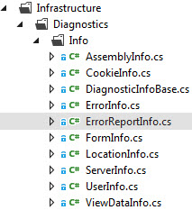
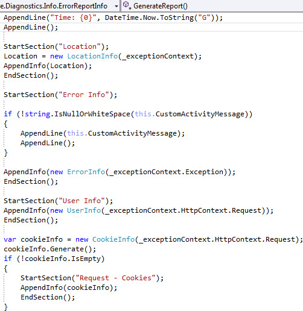
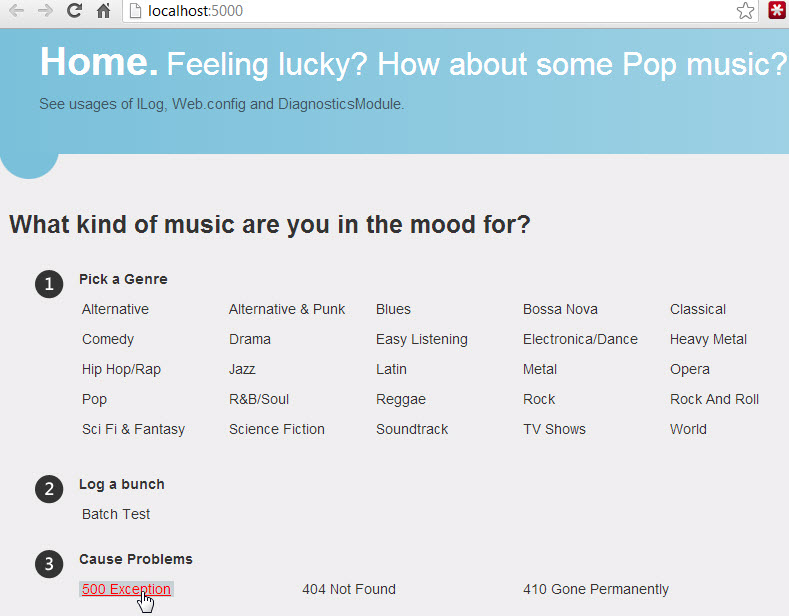

Be sure to check out [Part 1](/tech/2013/5/20/aspnet-nlog-sql-server-logging-and-error-handling-part-1.html) as this post builds upon it and the two go hand in hand.  
  

### Series Overview

[Part 1](/tech/2013/5/20/aspnet-nlog-sql-server-logging-and-error-handling-part-1.html) - Setting up logging with ASP.NET MVC, NLog and SQL Server  
  

Part 2 - Unhandled exception processing, building an error report, emailing errors, and custom error pages.  
  

### Custom Error Handling Attribute

Added in FilterConfig.RegisterGlobalFilters and bound in DiagnosticModule, AppErrorHandlerAttribute invokes reporting the unhandled exception and setting the error view to be displayed to the end user. An enableErrorPages appSetting controls whether any of this is done; for local debugging or a dev web server having this off might be desirable.  

\[csharp\] namespace NLogSql.Web.Infrastructure.ErrorHandling { public class AppErrorHandlerAttribute : FilterAttribute, IExceptionFilter { \[Inject\] public IErrorReporter Reporter { get; set; }

public void OnException(ExceptionContext exceptionContext) { if (exceptionContext.ExceptionHandled) return;

if (ConfigurationManager.AppSettings\["enableErrorPages"\] == "false") { AppLogFactory.Create<AppErrorHandlerAttribute>().Error( "Unexpected error. enableErrorPages is false, skipping detailed " + "error gathering. Error was: {0}", exceptionContext.Exception.ToString()); return; }

Ensure.That(Reporter, "Reporter").IsNotNull(); Reporter.ReportException(exceptionContext);

SetErrorViewResult(exceptionContext); }

private static void SetErrorViewResult(ExceptionContext exceptionContext) { var statusCode = new HttpException(null, exceptionContext.Exception) .GetHttpCode();

exceptionContext.Result = new ViewResult { ViewName = MVC.Shared.Views.ViewNames.Error, TempData = exceptionContext.Controller.TempData, //ViewData = new ViewDataDictionary<ErrorModel>(new ErrorModel()) };

exceptionContext.ExceptionHandled = true; exceptionContext.HttpContext.Response.Clear(); exceptionContext.HttpContext.Response.StatusCode = statusCode; exceptionContext.HttpContext.Response.TrySkipIisCustomErrors = true; } } } \[/csharp\]  

### Logging and Reporting the Error

In the same namespace the ErrorReporter class invokes generation of an error report and logs and emails the error report. The overload with customActivityMessage would generally be used with handled exceptions where it may still be desirable to report the exception in cases.  

\[csharp\] public class ErrorReporter : IErrorReporter { private readonly ILog \_log;

public ErrorReporter(ILog log) { \_log = Ensure.That(log, "log").IsNotNull().Value; }

private string CustomActivityMessage { get; set; }

public void ReportException(ControllerContext controllerContext, Exception exception, string customActivityMessage = null) { this.CustomActivityMessage = customActivityMessage; ReportException(new ExceptionContext(controllerContext, exception)); }

public void ReportException(ExceptionContext exceptionContext) { var errorInfo = new ErrorReportInfo(exceptionContext, this.CustomActivityMessage); errorInfo.Generate(); \_log.Error("Unexpected error: {0}", errorInfo.ReportText);

if (errorInfo.Errors.Any()) \_log.Error("Error generating error report. Original exception: {0}", exceptionContext.Exception);

// sending mail can be a little slow, don't delay end user seeing error page Task.Factory.StartNew( state => { var errorReport = (ErrorReportInfo)state; DependencyResolver.Current.GetService<IErrorEmailer>() .SendErrorEmail(errorReport); }, errorInfo).ContinueWith(t => { if (null != t.Exception) \_log.Error("Error sending email: " + t.Exception.ToString()); }); } } \[/csharp\]  

### Building the Error Report

Various diagnostic info classes are responsible for building different diagnostic "sub reports". Each inherits from DiagnosticInfoBase which is a glorified StringBuilder, with functionality to build both a plain text version of the report (logged to DB) as well as an HTML formatted version (used for emails).

The base class has safe appending and formatting functionality and ensures that any error in generating a part of the report doesn't stop the whole process.

A sample implementation:

  

\[csharp\] public class FormInfo : DiagnosticInfoBase { private readonly HttpRequestBase \_request;

public FormInfo(HttpRequestBase request) { \_request = request; }

protected override void GenerateReport() { StartTable(); var keys = \_request.Form.AllKeys.OrderBy(s => s).ToList();

foreach (var name in keys) { var value = \_request.Form\[name\];

if (null != value && name.Contains("password", StringComparison.OrdinalIgnoreCase)) { value = new string('\*', value.Length); }

AppendRow(name, value); }

EndTable(); } } \[/csharp\]

The ErrorReportInfo class combines the output of each section for the full error report.  
  

  
  

In the end this produces a [sample HTML email report like this](/wp-content/uploads/2017/05/SampleErrorReport.html).  
  

### Sending the Email

Sending the email logs the result on failure or success,

\[csharp\] public interface IErrorEmailer { void SendErrorEmail(ErrorReportInfo errorInfo); }

public class ErrorEmailer : IErrorEmailer { private readonly IMailer \_mailer; private readonly ILog \_log;

public ErrorEmailer(IMailer mailer, ILog log) { \_mailer = Ensure.That(mailer, "mailer").IsNotNull().Value; \_log = Ensure.That(log, "log").IsNotNull().Value; }

public void SendErrorEmail(ErrorReportInfo errorInfo) { try { var subject = string.Format("{0} Error", Assembly.GetExecutingAssembly().GetName().Name);

if (null != errorInfo.Server && null != errorInfo.Location && !string.IsNullOrWhiteSpace(errorInfo.Location.ControllerAction) && !string.IsNullOrWhiteSpace(errorInfo.Server.HostName)) { subject = string.Format("{0}: {1} - {2}", subject, errorInfo.Server.HostName, errorInfo.Location.ControllerAction); }

var to = AppSettings.Default.Email.ErrorMessageTo; \_mailer.SendMail(to, subject, errorInfo.ReportHtml);

\_log.Info("Sent email: {0} to {1}", subject, to); } catch (Exception ex) { \_log.Error("Error sending error report email: {0}", ex); } } } \[/csharp\]  

### The Error View

At the end of AppErrorHandlerAttribute the SetErrorViewResult invoked the ViewsSharedError.cshtml page. According to the HTTP status code, content such as text, images and styles differ. Separate error pages may have more advantages if there are a larger number of differences; a single page was less work here.  

\[html\] @section styles{ <link rel="stylesheet" href="~/Content/Error.css"/> }

@{ var statusTitleMap = new Dictionary<int, string> { {404, "Something got lost in the shuffle"}, {410, "Gone like yesterday"}, {500, "Something go boom"} }; }

@section hero{ 
 
 
 @{ var errorClass = (Response.StatusCode == 404 || Response.StatusCode == 410) ? "\_" + Response.StatusCode : "\_500";} 

 
 
 
 
 @Response.StatusCode 
 
 
 
 @statusTitleMap\[Response.StatusCode\] 
 
 
 
 @switch (Response.StatusCode) { case 404: @:We cannot find the page you are looking for. If you typed in the address, double check the spelling. If you got here by clicking a link, @: <a href="mailto:customerservice@domain.com?subject=Page%20Not%20Found">let us know</a>. break; case 410: @:The page you are looking for is gone (permanently). If you feel you reached this page incorrectly, <a href="mailto:customerservice@domain.com?subject=Link%20Gone">let us know</a>. break; case 500: @:Oh dear, something's gone wrong. Our team has already been alerted to the problem and will fix it as soon as possible! break; } 
 
 
 
 
 } \[/html\]  

### Testing Errors

At the bottom of the home page are some links to test out error functionality.  
  

  
  

    
  

### Handling Not Found and Gone Permanently

404s have some special handling in Global.asax.cs:  

\[csharp\] protected void Application\_EndRequest() { if (Context.Response.StatusCode == 404) { if (Request.RequestContext.RouteData.Values\["fake404"\] == null) { Response.Clear();

var rd = new RouteData(); rd.Values\["controller"\] = MVC.Error.Name; rd.Values\["action"\] = MVC.Error.ActionNames.NotFound;

var c = (IController)DependencyResolver.Current.GetService<ErrorController>(); Request.RequestContext.RouteData = rd; c.Execute(new RequestContext(new HttpContextWrapper(Context), rd)); } } } \[/csharp\]

That code makes me itch a bit and could be done better but there is a reason for it. If you're wondering why not just use custom error pages, the answer is that doing so for a 404 page ends up producing a 301 redirect to then 404 on the custom not found page. For SEO purposes that is usually considered a bad practice. If you don't have a public site or as much SEO concern, that may be acceptable but in this case it wasn't.  
  

### Error Controller

The error controller sets and logs the response status codes and returns the error view. For the Gone action, usually there'd be routes defined for legacy URLs that would direct to that action.  
\[csharp\] public partial class ErrorController : Controller { private readonly ILog \_log;

public ErrorController(ILog log) { \_log = Ensure.That(log, "log").IsNotNull().Value; }

public virtual ActionResult NotFound() { Response.StatusCode = (int)HttpStatusCode.NotFound; RouteData.Values\["fake404"\] = true; \_log.Write(LogType.Warn, new { Code = "404" }, "404 Not Found for {0}", Request.Url); return View("Error"); }

public virtual ActionResult Gone() { Response.StatusCode = (int)HttpStatusCode.Gone; Response.Status = "410 Gone"; Response.TrySkipIisCustomErrors = true; \_log.Write(LogType.Warn, new {Code = "410"}, "410 gone permanently for {0}", Request.Url); return View("Error"); } } \[/csharp\]  

### Future Enhancements

- The diagnostic info report building classes are pretty quick and messy in spots and could use cleanup.
- Error view work including better responsive design and user-acceptable images :)

- Admin error view to inspect log data and errors
- Use and integration of apps such as [appfail.net](http://appfail.net/) and [New Relic](https://newrelic.com/) to monitor errors and performance. This app used those tools in conjunction with the custom error handling and logging functionality.

  

### The Code

The code for this series is available at [https://github.com/thnk2wn/NLogSql.Web](https://github.com/thnk2wn/NLogSql.Web)
