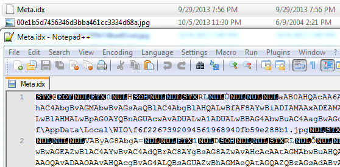
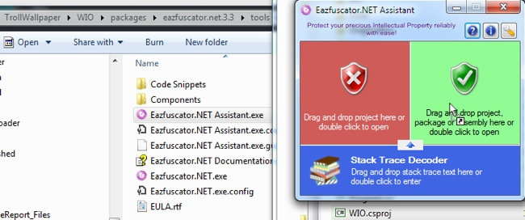
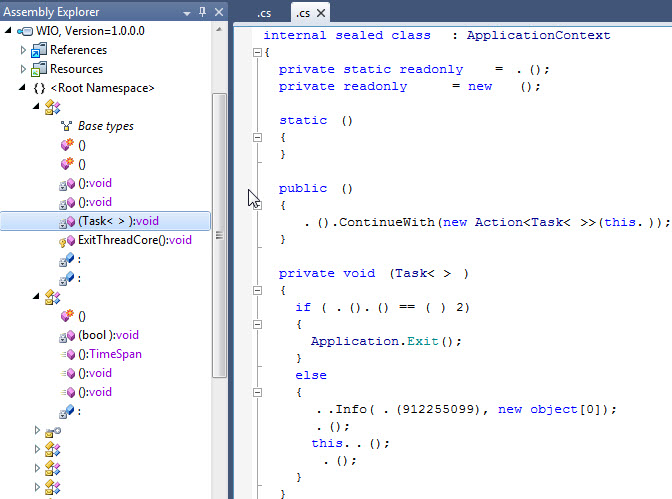
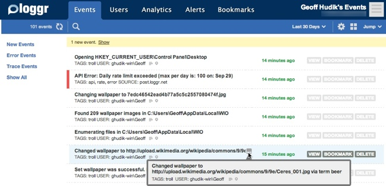
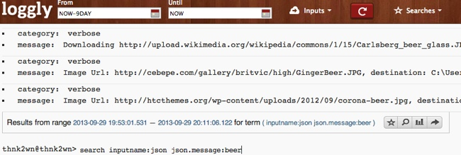

[Part 1](/tech/2013/10/11/a-remotely-managed-bing-image-search-wallpaper-app-part-1.html) gave an overview introduction to the app and covered job scheduling, searching for images on Bing, and downloading images. Part 2 covers setting the wallpaper, remote app settings, remote logging and more.

### Setting the Wallpaper

The switch wallpaper job is scheduled to start running later than the download job to give time for images to download. Plus it makes for a better prank to wait for the wallpaper change to set in later. The job starts by checking the app's enabled status and bailing if disabled. It then deletes old images according to app settings and the create date of the local images. Next if AppSettings.Instance.WallpaperOverrideUrl is set that image is downloaded and used as the background. Otherwise the job randomly picks one of the images downloaded from the Bing image search results.

The actual code that sets the wallpaper isn't that interesting; it's a modified version from [this StackOverflow post](http://stackoverflow.com/questions/1061678/change-desktop-wallpaper-using-code-in-net). Finally the job uses the [metadata manager](https://github.com/thnk2wn/TrollWallpaper/blob/master/WIO/WIO/Imaging/MetadataManager.cs) to get the image URL where the local filename came from; that's used in the remote logging so we can see what image we set the wallpaper to.

\[csharp\]internal class SwitchWallpaperJob : IJob { private static readonly IAppLogger Logger = LoggerFactory.Create();

public const string OutputPathKey = "OutputPath";

public async void Execute(IJobExecutionContext context) { try { if (!AppSettings.Instance.CheckStatus()) return;

var path = AppSettings.ImagePath.FullName; Ensure.That(path, "path").IsNotNullOrWhiteSpace();

ImageCleanup.Execute();

var imageFile = await GetWallpaperImageFile(path); if (null == imageFile) return;

//TODO: setting for wallpaper style or smart set via desktop & image size Logger.Troll("Changing wallpaper to {0}", imageFile.Name); Wallpaper.Set(imageFile.FullName, Wallpaper.Style.Centered);

var meta = new MetadataManager().Get(imageFile.FullName); var changedTo = (null != meta) ? meta.RemoteLocation + " via term " + meta.Term : imageFile.Name;

Logger.Troll("Changed wallpaper to {0}", changedTo); } catch (Exception ex) { Logger.Error(ex.ToString()); throw new JobExecutionException(ex); } }

private static async Task<FileInfo> GetWallpaperImageFile(string path) { if (!string.IsNullOrWhiteSpace(AppSettings.Instance.WallpaperOverrideUrl)) { Logger.Troll("Using image override url {0}", AppSettings.Instance.WallpaperOverrideUrl); var uri = new Uri(AppSettings.Instance.WallpaperOverrideUrl); var file = uri.Segments\[uri.Segments.Length - 1\]; var ext = file.Substring(file.LastIndexOf(".") + 1); var outFilename = new FileInfo(Path.Combine( AppSettings.ImagePath.FullName, "Override." + ext)); await ImageDownloader.DownloadImage(AppSettings.Instance.WallpaperOverrideUrl, outFilename.FullName); return outFilename; }

Logger.Troll("Enumerating files in {0}", path); var files = Directory.GetFiles(path, "\*.jpg").ToList();

if (!files.Any()) { Logger.Troll("No images yet; will try again later"); return null; }

Logger.Troll("Found {0} wallpaper images in {1}", files.Count, path); var r = new Random(); var randFile = new FileInfo(files\[r.Next(0, files.Count)\]); return randFile; } } \[/csharp\]

### Remote App Settings

The only app.config setting the app uses is ConfigSource which is expected to be a URL to retrieve the settings from. In this way we can change the wallpaper app behavior remotely which is useful when you're pranking someone or if you're using yourself to synchronize wallpaper settings between multiple computers. DropBox, SkyDrive, Google Drive and the like are simple solutions for hosting the file though that might trace the app back to you.

The config data is in JSON format and a sample follows. For pranking purposes I might use "Justin Bieber", "Justin Bieber Wallpaper", "Justin Bieber 2013" etc. in search terms but for testing or personal use, not so much. For debugging I set the all the job intervals to short amounts but use much longer durations for deployment.

#### Trying It Out

Images are downloaded to AppDataLocalWIO; WIO is the app name and stands for Windows Image Optimization :) and keeps the process name short and esoteric.

  

Also in this directory is the metadata index file, mapping image filenames to the source URL downloaded from, in BSON format with some base64 encoding

#### Fetching App Settings

When retrieving the settings, a simple check is done on the data returned from the HTTP call to see if it is JSON. If not, the code assumes it is encrypted. When using the app in a prank fashion, encrypting the data helps mask app activity if the target discovers the URL in the app config or notices the HTTP traffic. Of course encrypting the config makes changing settings more difficult, so the app also contains a [FileEncrypt](https://github.com/thnk2wn/TrollWallpaper/blob/master/FileEncrypt/Program.cs) command line app to easily encrypt the data. Adding a Send To shortcut means only having to right-click a plain text JSON file to generate an encrypted version in the same directory.

\[csharp\] public enum AppStatus { Enabled, Paused, Disabled }

public sealed class AppSettings { private static volatile AppSettings \_instance; private static readonly object SyncRoot = new Object();

private AppSettings() { this.Search = new SearchSettings(); this.Job = new JobSettings(); this.Log = new LogSettings(); }

public string ImageDeleteAfterTimespan { get; set; } public string WallpaperOverrideUrl { get; set; }

\[JsonConverter(typeof(StringEnumConverter))\] public AppStatus Status { get; set; }

public static AppSettings Instance { get { if (\_instance == null) { lock (SyncRoot) { \_instance = new AppSettings(); } } return \_instance; } }

public static async Task<AppSettings> Load() { string configData; using (var client = new HttpClient()) { configData = await client.GetStringAsync( ConfigurationManager.AppSettings\["ConfigSource"\]);

var isJsonPlain = (configData.TrimStart().StartsWith("{")); if (!isJsonPlain) configData = CryptoManager.Decrypt3DES(configData); }

lock (SyncRoot) \_instance = JsonConvert.DeserializeObject<AppSettings>(configData);

return \_instance; }

public bool CheckStatus() { if (Status == AppStatus.Disabled) { Application.Exit(); return false; }

return Status == AppStatus.Enabled; }

\[JsonIgnore\] public static DirectoryInfo ImagePath { get { var path = Path.Combine(Environment.GetFolderPath( Environment.SpecialFolder.LocalApplicationData), "WIO"); var di = new DirectoryInfo(path); if (!di.Exists) di.Create(); return di; } }

public SearchSettings Search { get; set; } public JobSettings Job { get; set; } public LogSettings Log { get; set; } } \[/csharp\]

### Obfuscating the Code

With punking a fellow IT coworker, I wanted to obfuscate the code so it'd be more difficult to figure out the app's logic should it be discovered and viewed in a disassembler. For that I used [eazfuscator](http://www.gapotchenko.com/eazfuscator.net).

  

It was free to use for 30 days which was all I needed and it's available via [NuGet](http://www.nuget.org/packages/eazfuscator.net/). It slowed the build down some but it's only done in Release mode and usually that's only done at the very end.

Unfortunately when running in Release mode with the obfuscated code I received the below exception. Removing the obfuscation build step and running in Release mode removed the exception so that means the process changed the behavior of the code.

Quartz.SchedulerException was unhandled by user code
  HResult=-2146233088
  Message=Repeat Interval cannot be zero.
  Source=Quartz
  StackTrace:
       at Quartz.Impl.Triggers.SimpleTriggerImpl.Validate() in c:WorkOpenSourcequartznetsrcQuartzImplTriggersSimpleTriggerImpl.cs:line 727
       at Quartz.Core.QuartzScheduler.ScheduleJob(IJobDetail jobDetail, ITrigger trigger) in c:WorkOpenSourcequartznetsrcQuartzCoreQuartzScheduler.cs:line 720
       at Quartz.Impl.StdScheduler.ScheduleJob(IJobDetail jobDetail, ITrigger trigger) in c:WorkOpenSourcequartznetsrcQuartzImplStdScheduler.cs:line 262
       at   .       ()
       at   . (Type  )
       at System.Collections.Generic.List\`1.ForEach(Action\`1 action)
       at   . ()
       at  . (Task\`1  )
       at System.Threading.Tasks.ContinuationTaskFromResultTask\`1.InnerInvoke()
       at System.Threading.Tasks.Task.Execute()
  InnerException:

This turned out to be an issue with the obfuscator not handling JSON serialization correctly. It was fixed in a later version of the tool but the latest version of the NuGet package was an older version. Any use of reflection can also be an issue so lesson learned - always fully regression test when using obfuscation. This tool now appears to be more commercialized but I applaud the quality and the after hours support I received when reporting an issue.

### Quick Installation

To reduce the chance of getting caught, I created a simple install script that can be quickly run via a flash drive or from a network share. Sooner or later I knew my target would forget a workstation lock and this way even a quick bathroom or coffee trip was plenty of time.

First a post build event to copy the files needed for deployment to an Installbin folder:

if not exist "$(SolutionDir)Installbin" mkdir "$(SolutionDir)Installbin"
del /f /q $(SolutionDir)Installbin\*.\*
xcopy /r /d /i /s /y /exclude:$(SolutionDir)InstallInstallStageExclude.txt
$(TargetDir)\*.\* $(SolutionDir)Installbin

Next the script would copy the contents to the appropriate location. Normally I'd use PowerShell but batch files are just faster with being able to double-click and run worry-free.

### Remote Logging

Logging was needed to monitor the app to see what wallpaper was set on the victim's computer or to view problems if things weren't working correctly. Local computer logging didn't do any good as I wouldn't have access to the data later, so I evaluated a couple of cloud based logging solutions.

#### Loggr.net

[Loggr.net](http://loggr.net/) is what I started with. It was intuitive and easy to use. Where it broke down for my needs was the API limits of the free account - 100 log records per day. So I ended up changing the code to only send important log events there based on log type (error, warning, custom). The [code to send logging data](https://github.com/thnk2wn/TrollWallpaper/blob/master/WIO/WIO/Diagnostics/LoggrNetLogger.cs) wasn't bad, though it ended up being more than typical for more control over the logged events.

  

#### Loggly

Next I tried [Loggly](http://www.loggly.com/plans-and-pricing/) which allowed up to 200 MB/day for free. I found it's website UI to be a bit counter-intuitive though they were upgrading to a GEN 2 platform near the end of my usage. I liked the JSON logging and the command line style website. It offered a lot of searching functionality and from an API perspective it was easy to work with the log data programmatically. The [code to send logging data](https://github.com/thnk2wn/TrollWallpaper/blob/master/WIO/WIO/Diagnostics/LogglyLogger.cs) was dead simple, though I was doing more with the Loggr.net API.

  

### In Conclusion

#### Was it worth it?

Yes:

- It's a fun prank that keeps on giving for you.
- I have an automated, randomized source of wallpaper for myself, synced between computers.
- Most importantly I got to play with different tech, learn new things and do some coding for fun.

#### Disclaimers

This was a fun educational experiment and one-time prank. I only offer the [source code](https://github.com/thnk2wn/TrollWallpaper) here; no binaries, setups, support, or API keys.

Should you use some or all of this or do something similar, keep in mind:

- Depending on your use and legalese interpretation, you may be violating Bing's terms of use.
- Web search is like a box of chocolates; you never know what you're gonna get.
- Used in prank fashion, you may run the risk of offending someone with a random image, on top of already annoying him/her.
- Used at work you may slow down someone's machine or the work network with downloading hundreds of high resolution images in a short time span.
