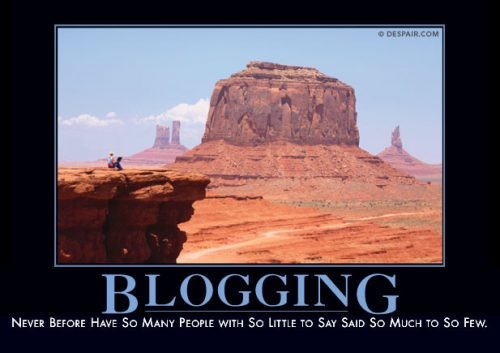
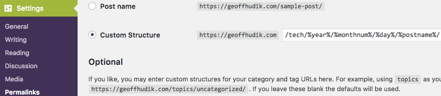
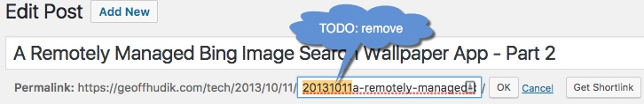

It has been nearly 4 years since my last blog post. When I started blogging 7 years ago, it was such a rewarding experience; it's hard for me to believe I let it die. In this post I reflect back on the "life and death" of my blog, and the process of moving and "resurrecting" it.

## Birth

### Motivation

I credit [Michael C. Neel](http://www.vinull.com/) for encouraging myself and others to start blogging at one of the early [CodeStock](http://codestock.org/) conferences. I don't remember his exact words now but what he said on stage was enough to motivate me to action. Prior to that, starting a blog was of interest to me but I had doubts around the level of effort and time involved, [imposter syndrome](https://www.hanselman.com/blog/ImAPhonyAreYou.aspx), content and the like. I realized I was making excuses and growth only comes when we make ourselves uncomfortable. It dawned on me that I had much more to gain and almost nothing to lose by giving it a shot.

### Initial Goals

- Writing about various programming tasks at work
- Documenting some of my work for myself, my team, and other developers
- Learning more about what I was doing by writing about it
- Hopefully receiving some feedback to improve my work
- Giving back to the community I've received so much from

### Getting Started

On the recommendation of [Mick Ross](http://www.mickross.com/main.html), I decided to give [Squarespace](https://www.squarespace.com/) a shot. The main draw for me was that it allowed me to focus on producing content for my blog extremely quickly with a polished design without giving up flexibility / customization. Compared to WordPress, it seemed much more intuitive, low friction, less bloat, and easier to get started. I also liked the fact that it made it simple to combine multiple blogs on one site, something that can't technically be done with WordPress per se; I thought I'd use that for separate personal and professional blogs at some point.

## Life

### Workflow

In the early years of my blog, I was fortunate that I was able to do a decent amount of blogging work at my job, within and between tasks. Simple posts I could often do entirely at work. For longer, more involved posts, I would often start them at work, "genericizing" code and other details, and finish the rest at home or perhaps at work over lunch or after hours. The key was to force myself to write while the subject was fresh; I found that if I waited until later, no matter how valid the reasons, the posts would never materialize or the content would really suffer.

### Early Takeaways

You don't know what you don't know - until you write about it. In explaining topics in these posts, I often realized I didn't know the material as well as I'd like. Writing forced me to go deeper in my learning in order to explain things more simply and fully. At times that was overwhelming but it proved to be one of the most rewarding parts of the process.

It's often more work than you might think - I never fully appreciated all the work that can go into even shorter blog posts:

- Deciding what's company confidential and what isn't
- "Genericizing" details in the post, code, and other assets
- Cleaning up code for posting - refactoring, rewriting, simplifying
- Formatting code for posts and creating assets like images
- Creating sample projects and repositories or zip files
- Deciding discussion points, outline, approach, and tone
- What assumptions to make about the reader's knowledge
- Researching various topics in-depth as you realize the gaps in your knowledge
- Site administrivia, configuration, themes / styling
- Proofreading, spelling and grammar, checking posts in different browsing form factors and RSS readers
- Social sharing and addressing comments, feedback, mistakes and general updates

All of that work and more certainly got easier the more I did it but like many developers, I underestimated the time it can take in cases. Later I learned to ease my perfectionism and be fine with blogging faster from more of a novice perspective, not that was an excuse to not try to fully learn what I was writing about.

### Long-term Rewards

My blog was never highly trafficked but that was never a goal or something I worked at. Regardless, my modest blog certainly exceeded my expectations - a few examples:

- My very first post ([Oracle PowerShell Cmdlet](/tech/2010/07/15/oracle-powershell-cmdlet-html/)), eventually lead to me being contacted by Packt Publishing to write my first book - [Instant Oracle Database and PowerShell How-to](https://www.amazon.com/Instant-Oracle-Database-PowerShell-How/dp/1849688583).

- I had a [post featured on the ASP.NET homepage](/wp-content/uploads/2017/06/AspNetMvc4NUnitHomepage.jpg), just below ["The Gu"](https://twitter.com/scottgu) himself.

- [Justin Angel](https://twitter.com/JustinAngel), Microsoft's Silverlight Program Manager at the time, [left some great feedback on a post of mine](/tech/2010/10/14/wp7-in-app-searching-filtering-html/#comment-19).

- A significant amount of invaluable feedback in comments, social media, and messages.

- Some non-programming posts, including [this finances post](/tech/2010/11/23/receipt-automation-with-shoeboxed-quicken-evernote-and-more-html/), that resulted in referrals, free services, ad income and more.

- Writing a [mobile conference app](/tech/2012/05/16/codestock-2012-windows-phone-app-html/) and getting free admission.

- Many new connections I've learned a great deal from.

- Seeing how my blog helped positively influence my career opportunities.

## Death

### Time, Priorities, Laziness

Subsequent jobs didn't really allow for me doing much blogging work during the work day. Combined with a busier personal schedule, longer work days, an eclectic set of competing interests and activities, and moving cross-country, finding the time and energy to blog became more difficult.

### Death of Google Reader

It sounds silly, but when Google Reader died, it impacted my consumption of other blogs, traffic to my blog, and my own desire to blog. I moved to alternatives like [Feedly](https://feedly.com/), but it was never quite the same. It felt like the beginning of the end for blogging in a way.

### Desire and Dread of Moving My Blog

Over time I increasingly wanted to move my blog to Wordpress. I didn't like the direction Squarespace was going; they seemed to be targeting the artistic and commerce segments almost exclusively, with less and less control over details that made it less ideal for my blog. The upgrade process between versions was confusing and plagued with issues.

For better or worse, WordPress "won" and I felt compelled to move to it if I was going to continue blogging. As a result, I didn't want to blog more because I knew I'd have to make a lot of edits to every single blog post when moving my blog and I didn't want to create more work for myself.

## Resurrection

### Experimenting with Other Platforms

Squarespace Upgrade - Before I could move to Wordpress, I had to upgrade to Squarespace version 6 as I was on version 5 and that didn't have Wordpress export. I use the word upgrade lightly as it really makes a copy of your site for v6 and you're actually paying for a completely separate site. I tried out v6 and later the in-place upgrade to v7 but neither convinced me not to move to Wordpress. Sadly the export didn't handle images and other media / resources but at least it gave me the content to import into Wordpress.

Wordpress.com - Next I tried [Wordpress.com](http://wordpress.com) and imported my blog posts from the Squarespace export. That didn't last long as I ran into a limitation that didn't allow me to maintain my existing URL structure of geoff.hudik.com/tech/date/title (/tech/ being the problem), and I wasn't willing to break existing links to my site. Additionally, in looking at other limitations of Wordpress.com, I decided that self-hosting better suited my needs.

Linode - I heard good things about [Linode](https://www.linode.com/) from [Alan Stevens](http://alanstevens.io/). I liked the idea of not being on shared hosting without breaking the bank, and having total control and flexibility. I was a bit worried about Linux though, as I had barely used it in the past and that was many, many years ago. I worked through a number of their guides such as [Migrating from Shared Hosting to Linode](https://www.linode.com/docs/platform/migrate-to-linode/migrate-from-shared-hosting-to-linode), [How to Install and Configure Wordpress](https://www.linode.com/docs/websites/cms/how-to-install-and-configure-wordpress), and [How to Configure nginx](https://www.linode.com/docs/web-servers/nginx/how-to-configure-nginx). I really liked their platform, site, and mobile apps, and I learned a great deal. Ultimately however, total control also meant the most work to maintain, and as a Linux noob, it was a bit too painful for me.

Self-hosted (Siteground) - I read [some reviews of Wordpress hosting](http://www.wpbeginner.com/wordpress-hosting/) and decided to give [SiteGround](https://www.siteground.com/recommended?referrer_id=7376448) a try. I liked what I saw and it seemed to be a good fit for my needs but I was still having problems with motivating myself to do all the work of moving 4 years worth of blog posts.

### Motivating Factors to Complete the Wordpress Move

I never finish anythi...

Wasted Money - While keeping my existing site live and experimenting with different new host platforms, at one point I was paying for 3 different copies of my site at the same time, not including things like domain name registration.

Soft Skills Book - Reading [Soft Skills: The software developer's life manual](https://simpleprogrammer.com/softskills) by [John Sonmez](https://simpleprogrammer.com/about-simple-programmer/) really encouraged me to start blogging again. This is great book for your career and life, even if you're not a programmer or not in IT, but especially if you are.

Great Content from Other Bloggers - Seeing great content from fellow bloggers helped motivate me to get things going. This included existing established blogs as well as seeing success from new ones like my buddy's blog [Longing to Know](https://long2know.com/), a great resource for AngularJS, .NET and more.

Consulting Job - I switched jobs to work in a consultant role, and we're expected to be diligent about continuing education, community involvement, writing, and learning new tech, so we can more easily tackle diverse projects that come our way.

Wasted Opportunities - In the 4 years I wasn't blogging I learned a great deal about AngularJS and a host of other tech. Blogging on these topics could've been very helpful, and for the most part now, it's too late.

### Squarespace to Wordpress Details

URL Issue: Permalink Settings - In Wordpress I first needed to go to Settings -> Permalinks and set a custom URL structure as so:  

URL Issue: Per Post Permalinks - Post names and links in my Squarespace export file looked okay but for some reason the post permalinks after the import had the date in the name portion which I had to remove per post like so:  

URL Issue: Some Posts off by a Day - It appeared that some posts I had started on Squarespace on one day as a draft and published on the following day. In some / all of these cases, the post URL never changed to match the published date and retained the draft start date. To resolve this I ended up editing the publish date of these posts to match the existing URLs.

URL Testing - To ensure existing links to my posts didn't break I first [edited the HOSTS file on my Mac](https://www.imore.com/how-edit-your-macs-hosts-file-and-why-you-would-want) so my domain name pointed to the IP of my Wordpress site that wasn't yet live. I then fired up my Windows machine in [Parallels](http://www.parallels.com/products/desktop/) and for every post, I copied the URL from the live site and pasted it in a web browser on my Mac to ensure no 404 Not Found results. 404s were addressed and I kept a running list of the posts I had checked.

Image woes - Images weren't handled in the export and were pointing back to Squarespace. Reuploading all the images manually would've been a pain. Thankfully I found the [Auto Upload Images](https://wordpress.org/plugins/auto-upload-images/) plugin that will detect external images and upload them to your Wordpress media library when you save a post. That was a real lifesaver.

Fancybox Images - Some images in my posts were scaled-down versions that linked to [Fancybox](http://fancybox.net/) popups for the full-sized image. These weren't caught by the Auto Upload Images plugin and had to be manually uploaded. I also installed a [Fancybox Wordpress Plugin](https://wordpress.org/plugins/fancybox-for-wordpress/).

Image Relative Paths - The Auto Upload Images plugin inserted fully qualified image URLs to "https://geoffhudik.com/wp-content/..." which was a mixed content warning problem for HTTPs. Also should my domain name change in the future, well, that's one less thing to worry about. I ended up doing find and replace per post for this though I considered a [Search and replace type plugin](https://wordpress.org/plugins/search-and-replace/).

Other Assets - Various other files had to be manually uploaded and linked to. This was mostly zip files of code samples or direct links to a given source file. I did stumble across the [Enhanced Media Library Plugin](https://wordpress.org/plugins/enhanced-media-library/) which did come in handy. In some cases code was hosted on Codeplex and with it shutting down, I also needed to move those projects to Github; thankfully there's an [easy migration process](https://codeplex.codeplex.com/wikipage?title=Migrating%20to%20GitHub).

SyntaxHighlighter - My Squarespace blog used an older version of [SyntaxHighlighter](http://alexgorbatchev.com/SyntaxHighlighter/). For Wordpress I went with the [Syntax Highlighter Evolved](https://wordpress.org/plugins/syntaxhighlighter/) plugin and it required changes to each use. Namely replacing pre blocks with \[language\] markers and removing HTML escaping. I also made some plugin content changes to [reduce the SyntaxHighlighter font size](http://www.technical-recipes.com/2015/changing-the-font-size-of-syntaxhighlighter/).

Extra Line Breaks - Early on I noticed extra line breaks showing up in WordPress output, as if whitespace was suddenly respected in HTML markup. After a bit I figured out [why this was happening and how to stop it](https://wpoven.com/tutorials/wordpress/how-to-stop-wordpress-from-adding-p-tags-and-line-breaks-in-post-content). Older posts of mine included some longer paragraphs where I inserted line breaks for text editor readability instead of relying on word wrap. While I could override the behavior, I didn't like the unnecessary line breaks and preferred relying on word wrap so this required some reformatting of each post's HTML.

Post Wrapper Divs - It appeared that during the upgrade process to Squarespace v6, each post of mine was altered to be wrapped with `
`. That didn't effect the layout that much but it was enough to warrant removal.

What Happened to My Backslashes? - Somewhere in the process I realized something had removed most of the backslashes in the contents of my posts. Mostly this was filenames inside of code blocks so "C:\\SomeParent\\SomeChild\\" became "C:SomeParentSomeChild". I never figured out what caused this but my hunch was one of my external image uploader plugins messed it up as those were the only plugins I was aware of that modified blog contents on my behalf. I disabled those after the conversion process.

Final Steps - With separate machines on separate monitors I compared the content between both versions of the blog and once everything looked good, I updated the name servers with my domain name provider to point to the Siteground name servers. Disclaimers indicate up to a couple days or so to take effect but in my case the change was live within half an hour or so.

## Are You Blogging?

### If So

What tips do you have for being diligent about intentionally blogging on a more regular basis? What do you do to make it faster, easier, or better?

### If Not

If you think you'd like to blog, what's holding you back? [Blogging isn't dead](http://www.blogtyrant.com/is-blogging-finally-dead/) and it's never too late to start. I'd encourage you to give it a shot. Don't feel like you have to be an expert at something to blog about it. In fact, it's often great to blog about something you are just learning as you have the perspective that other beginners will have and be able to relate to. Often experts in an area take things for granted and forget details that may be crucial to people with less experience.

### Am I?

Hopefully I'll be able to resume blogging more regularly and won't end up in this predicament again or with a stale or offline blog. Happy blogging!
