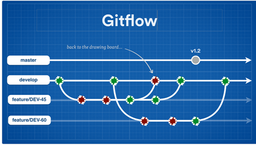
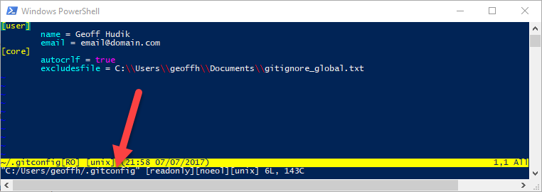

# Setup

In recent years I've had the misfortune of mostly working with TFS source control at work. I've used Git but it's mostly been for small, personal projects where I was the only developer, happily coding away in keyboard cowboy fashion in the master branch with nary a care in the world. I was mostly using Git GUI apps with occasional command line use for simple basics.

My current project is the first where I've used Git heavily in a team environment where I really needed to learn it more. I started off more with Git GUI clients but pretty quickly both bugs and slow and clunky UI's lead me to trying more and more with the command line.

Git can feel overwhelming at times, especially from the command line - there are so many commands, often with an insane number of switches, for many different scenarios, and sometimes with many different ways of accomplishing the same thing. This post series documents some of my learning / re-learning of Git basics and my transition to doing most of my Git work with the command line.

## Series Outline

1. [Setup](https://geoffhudik.com/tech/2017/07/19/git-command-line-part-1/)

3. [Getting Latest and Making Changes](https://geoffhudik.com/tech/2017/07/19/git-command-line-part-2/)

5. [Pushing, Fetching, and Viewing History](https://geoffhudik.com/tech/2017/07/19/git-command-line-part-3/)

7. [Merging and Managing Branches](https://geoffhudik.com/tech/2017/07/19/git-command-line-part-4/)

9. [Stashes and Reverting Work](https://geoffhudik.com/tech/2017/07/19/git-command-line-part-5/)

11. [Miscellaneous / Wrap-up](https://geoffhudik.com/tech/2017/07/19/git-command-line-part-6/)

## Git Concepts

### Basic Concepts

This series is aimed more towards the casual Git user who mostly uses a GUI and wants to do more from the command line. If you're not familiar with basic Git or [DVCS](https://betterexplained.com/articles/intro-to-distributed-version-control-illustrated/) concepts, you might start with some [Git basics](https://git-scm.com/book/en/v2/Getting-Started-Git-Basics) or a presentation like [Git Demystified](https://github.com/jbogard/presentations/blob/master/GitDemystified/Git%20Demystified.pptx) by [Jimmy Bogard](https://jimmybogard.com/).

### Project Git Workflow

The Git workflow for this particular project is basically the [Continuous delivery workflows with the branch-per-issue model](https://www.atlassian.com/continuous-delivery/continuous-delivery-workflows-with-feature-branching-and-gitflow). Story and bug fix feature branches are created off a develop branch which serves as the integration point. Pull requests are created for code reviews when features are dev complete. Once a PR is approved, the feature branch is merged back into develop. At the end of each sprint, the integrated, accepted code in develop is merged into master.

  

### Git Data Transport Flows

I think it's handy to reference this Git data transport commands diagram from [Oliver Steele](http://osteele.com/) before and during use of the corresponding commands to help visualize the concepts. There's actually a newer [Git Data Transport Commands Diagram from Stephen Marron](https://www.stephenmarron.com/2017/02/git-data-transport-commands/
) that I like better, as it includes additional commands and concepts like stashing.

## What Command Line Shells?

This series will mostly focus on PowerShell-based shells since this project was Windows-based and given my familiarity with PowerShell. However, most everything will apply to other shells though some parts will have specific differences depending on the shell, OS, the version of Git, Git and machine configuration, etc. I'm not a Bash guy but I've got nothing against it :).

## Installation

1. [Git command line tools](https://git-scm.com/downloads) - I started with the basics.
2. [SourceTree](https://www.sourcetreeapp.com/) - After noticing some issues using Visual Studio Team Explorer with git, I started using Source Tree with our Bitbucket project. Version 1.x was a bit painful. 2.x is better but can still take some 20+ seconds to load for me.
3. [DiffMerge](https://sourcegear.com/diffmerge/) - I've used this app for years so I installed it to set it up as the merge tool for Source Tree.
4. [GitKraken](https://www.gitkraken.com/) - Source Tree frustrations lead me to this GUI client. It was slick, polished, and felt faster. However, it is not free. In some cases it felt like form over fashion, and sometimes the animated loading indicator would never go away.
5. [Chocolatey](https://chocolatey.org/) - I decided to install posh-git via Chocolatey so I installed this first. It's great for scripting out app installs for machine rebuilds among other things.
6. [posh-git](https://github.com/dahlbyk/posh-git) - Once I started using Git from PowerShell more, I found posh-git's status indicators and tab completion to be very handy.
7. [PowerShell Tools for Visual Studio](https://poshtools.com/) - Occasionally I'd edit Git related PowerShell files in Visual Studio and run from there.
8. [Visual Studio Code PowerShell Extension](https://marketplace.visualstudio.com/items?itemName=ms-vscode.PowerShell) - Similar to the previous install but for [Visual Studio Code](https://code.visualstudio.com/) since Visual Studio locks up on me enough already and Code is so lightweight.
9. [Linux Bash Shell on Windows 10](https://www.howtogeek.com/249966/how-to-install-and-use-the-linux-bash-shell-on-windows-10/) - I installed this more out of curiosity to experiment with later on. Quickly I remembered the Linux file system is case sensitive and it also made me realize this solution had line ending inconsistency issues.

## Configuring Git

### Configuring the Merge Tool

Git does an amazing job with merging but merge conflicts are inevitable. You can either setup a merge tool ahead of time or be like me and wait until your first conflict from the command line.

I knew I wanted to edit what Git would use for a merge tool because by default, for me, it was vimdiff; if you're like me you haven't dedicated months to mastering it so when it loads you're like `¯\_(ツ)_/¯`. First I needed to know where the git config file was so at the command line I entered `git config --global -e`. Ironically that launched Vim...

  
  

... but I only needed to see the filename and then enter `:quit` and hit Enter to quit. I'll accept you suspending my geek card for not editing the config file directly in Vim - I can live with that for now. Yes I realize the irony that this series is about more time at the command line :).

<blockquote class="twitter-tweet" data-lang="en">
I've been using Vim for about 2 years now, mostly because I can't figure out how to exit it.
— I Am Devloper (@iamdevloper) <a href="https://twitter.com/iamdevloper/status/435555976687923200">February 17, 2014</a></blockquote>

Next I opened up C:\\Users\\_username_\\.gitconfig in a text editor. Git can be configured by the command line but rather than entering several commands, it seemed easier to make all the config changes in a text editor together.

I added the below \[merge\] and \[mergetool\] sections in my .gitconfig file to configure DiffMerge to be used when resolving merge conflicts.

\[merge\]
    tool = diffmerge
\[mergetool "diffmerge"\]
    cmd = \\"C:\\\\Program Files\\\\SourceGear\\\\Common\\\\DiffMerge\\\\sgdm.exe\\" --merge --result=\\"$MERGED\\" \\"$LOCAL\\" \\"$BASE\\" \\"$REMOTE\\"
    trustExitCode = true
    keepBackup = false
\[mergetool\]
    keepBackup = false

The `keepBackup` prevented files like _MyConflictedFile.ext.orig_ from cluttering up the workspace after resolving conflicts.

### Configuring the Diff Tool

While setting the merge tool I thought I might as well set the diff tool at the same time:

\[\[diff\]\]
    tool = diffmerge
\[difftool "diffmerge"\]
    cmd = \\"C:\\\\Program Files\\\\SourceGear\\\\Common\\\\DiffMerge\\\\sgdm.exe\\" \\"$LOCAL\\" \\"$REMOTE\\"
\[difftool\]
    prompt = false

### Configuring Colors

After using Git some I realized some of the default output colors weren't that readable by default, at least with default PowerShell colors. I ended up with the following color overrides.

\[color "status"\]
	changed = green normal bold
	updated = green normal bold
	untracked = cyan normal bold
\[color "diff"\]
	new = green normal bold
	old = red normal bold
\[color "branch"\]
    upstream = bold yellow
	remote = bold yellow
    current = green bold

## PowerShell Profile

I modified my [PowerShell Profile](https://blogs.technet.microsoft.com/heyscriptingguy/2012/05/21/understanding-the-six-powershell-profiles/) to automatically import the posh-git module and then change directory to the repository where I'd be spending most of my time.

\[powershell\] Import-Module posh-git Push-Location c:\\source\\myproject \[/powershell\]

You might refer to _profile.example.ps1_ in the posh-git install directory for a more thorough example of importing the module. I use `Push-Location` (or `pushd`) instead of `cd` or `Set-Location` as it allows me to easily use `Pop-Location` (or `popd`) to get back to the previous location. That comes in handy, for example, when entering "powershell.exe" from the Windows Explorer address bar, where I can quickly undo the repo location change if desired.

## Configuring posh-git

### Colors

Depending on your preferences you may want to tweak posh-git colors as well. For some reason the color settings don't appear to be documented in the readme or wiki but [this markdown gist](https://gist.github.com/SyntaxC4/7933408) provides the basics though some info appears out of date or missing. You can either edit GitPrompt.ps1 or edit your PowerShell profile to customize colors after importing poshgit. In my case I believe I modified GitPrompt.ps1 and replaced all \[ConsoleColor\]::DarkGreen with \[ConsoleColor\]::Green.

If you instead wanted to change the colors via script:

\[powershell\] Import-Module posh-git $Global:GitPromptSettings.IndexForegroundColor = \[ConsoleColor\]::Green \[/powershell\]

### Prompt

The [posh-git prompt can be customized](https://github.com/dahlbyk/posh-git/wiki/Customizing-Your-PowerShell-Prompt) as well though I found the defaults suitable.
