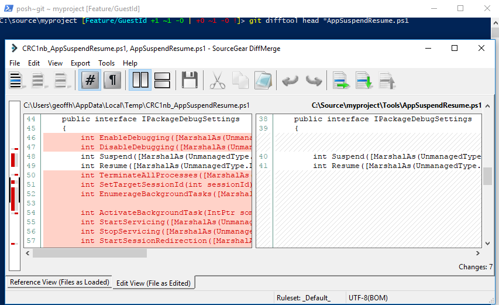
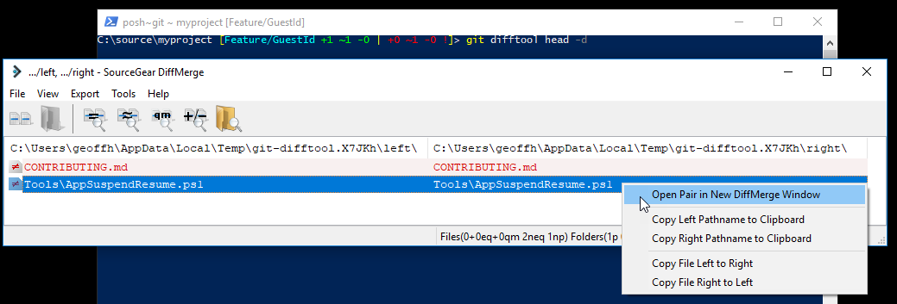

# Getting Latest and Making Changes

This post in the series looks at getting help, getting the latest content from the remote repository, and making changes in the workspace and local repository. It also includes comparing the workspace with the local repository.

## Series Outline

1. [Setup](https://geoffhudik.com/tech/2017/07/19/git-command-line-part-1/)

3. [Getting Latest and Making Changes](https://geoffhudik.com/tech/2017/07/19/git-command-line-part-2/)

5. [Pushing, Fetching, and Viewing History](https://geoffhudik.com/tech/2017/07/19/git-command-line-part-3/)

7. [Merging and Managing Branches](https://geoffhudik.com/tech/2017/07/19/git-command-line-part-4/)

9. [Stashes and Reverting Work](https://geoffhudik.com/tech/2017/07/19/git-command-line-part-5/)

11. [Miscellaneous / Wrap-up](https://geoffhudik.com/tech/2017/07/19/git-command-line-part-6/)

## Getting / Cloning the Remote Repository

While `[git clone](https://git-scm.com/docs/git-clone)` is often just used to initially create the remote repository locally, it can also be handy to clone the repo to another folder temporarily. With 2 local repos I could be on 2 different versions of the app at the same time. I may want to run different versions of the app in multiple instances of Visual Studio to debug and compare behavior, for example. Another use case is if I need to do a code review of another developer's work on a different branch but have several pending changes on my current branch. Stashing could work for that case (more on that in a later post) but a second "sandbox" repo can be easier in cases.

For the following clone I had already created and switched to an empty folder where I wanted the repository to go; specifying `.` allowed the contents to go directly there, instead of ending up with an extra root level folder. Alternatively I could've started the clone another folder level up and omitted `.`.

C:\\source\\myproject> git clone https://myusername@bitbucket.org/company/repo.git .   
Cloning into '.'...   
remote: Counting objects: 12999, done.   
remote: Compressing objects: 100% (12418/12418), done.   
remote: Total 12999 (delta 9573), reused 552 (delta 333)   
Receiving objects: 100% (12999/12999), 4.29 MiB | 1.89 MiB/s, done.   
Resolving deltas: 100% (9573/9573), done.   
C:\\source\\myproject \[master ≡\]\> 

Note that posh-git status changes to \[master ≡\]. The branch _master_ is the default branched locally since that's the currently active branch from the cloned repository. The "≡" means the local branch is at the same commit level as the remote branch (identical).

## Getting Help

Before going too far with Git commands, it's good to know how to get help (besides Google). Using `git help` will show a list of the most commonly used commands. For help with a specific command I initially tried `git _commandName_ help`. That seemed to try to launch an HTML file and for some reason that doesn't currently work on my Windows 10 machine - it gets stuck in an indefinite "Open With" dialog, apparently for security reasons (File Open works). In any event, using `git _commmandName_ -help` worked for me.

C:\\source\\myproject \[master ≡\]\> git status \-help   
usage: git status \[<options>\] \[--\] <pathspec>...   
   
 -v, --verbose         be verbose   
 -s, --short           show status concisely   
 -b, --branch          show branch information   
 --porcelain\[=<version>\]   
 machine-readable output   
 --long                show status in long format (default)   
 -z, --null            terminate entries with NUL   
 -u, --untracked-files\[=<mode>\]   
 show untracked files, optional modes: all, normal, no. (Default: all)   
 --ignored             show ignored files   
 --ignore-submodules\[=<when>\]   
 ignore changes to submodules, optional when: all, dirty, untracked. (Default: all)   
 --column\[=<style>\]    list untracked files in columns   
 --no-lock-index       do not lock the index 

## Getting Latest

Before starting a new feature, I generally switch to the develop branch (if not already there) with `git checkout develop`. Then I use `[git pull](https://git-scm.com/docs/git-pull)` to pull the latest changes. Behind the scenes that does a `git fetch` to get the latest repo history info into my local git repo (.git folder), and then does a `[git merge](https://git-scm.com/docs/git-merge)` to merge the remote branch changes with my current local branch. Getting the latest changes ensures I'm current before starting a new branch from develop.

I generally only do this when the following is true:

1. There are no uncommitted changes in my working tree - otherwise I might be forced to commit or stash them first.

3. There are no unpushed commits in the branch I'm pulling (develop here).

5. I either already have some idea already of what changes I'm pulling, or some level of confidence that my team isn't committing risky, unvetted changes into develop.

Because `git pull` involves a merge, it can leave me with merge conflicts. If the above statements are not true then I'm generally using other commands mentioned in later posts in this series.

### Switching to the Source Branch (Develop)

Since `git pull` will pull changes into my current branch, I need to be on the branch I want the latest code pulled into - develop in this case. Switching branches with `git checkout` will update my workspace files to the state of that branch.

If I'm on another branch with uncommitted changes when switching branches I'd see something like the below.

C:\\source\\myproject \[Feature/TestProjectConvert ≡ +32 ~46 -0 ~\]\> git checkout develop 
error: Your local changes to the following files would be overwritten by checkout: 
 Company.MyApp.sln 
 Company.MyApp.Tests.Integration/Company.MyApp.Tests.Integration.csproj 
 Company.MyApp.Tests.Integration/packages.config 
Please commit your changes or stash them before you switch branches. 
Aborting 

Switching branches will go smoothly if my workspace is clean.

C:\\source\\myproject \[master ≡\]\> git checkout develop 
Switched to branch 'develop' 
Your branch is behind 'origin/develop' by 3 commits, and can be fast-forwarded. 
 (use "git pull" to update your local branch) 
C:\\source\\myproject \[develop ↓3\]\> 

### Pulling Changes

Once in the develop branch I'm ready to pull the changes with `git pull`.

C:\\source\\myproject \[develop ↓3\]\> git pull 
remote: Counting objects: 66, done. 
remote: Compressing objects: 100% (66/66), done. 
remote: Total 66 (delta 47), reused 0 (delta 0) 
Unpacking objects: 100% (66/66), done. 
From https://bitbucket.org/company/repo 
 babc1ba..d598a79  develop    -> origin/develop 
 82abcb2..8095ecd  Feature/AppWillPersistRules -> origin/Feature/AppWillPersistRules 
 babc1ba..fa1cc9e  Feature/MenuItemSearchChangeHintText -> origin/Feature/MenuItemSearchChangeHintText 
Updating babc1ba..d598a79 
Fast-forward 
 .../DTOs/Menus/RelatedMenuItem.cs                  | 32 +++++\------ 
 .../Menu/Context/RelatedMenuItemEntityBuilder.cs   | 13 +++\-- 
 .../Data/Menu/Repository/MenuReadRepository.cs     |  5 ++ 
 .../Infrastructure/AssertEx.cs                     | 11 ++++ 
 .../Menu/Database/RelatedMenuItemsTests.cs         | 67 ++++++++++++++++++++++ 
 .../Menu/Repository/MenuRepositoryTests.cs         |  9 ++\- 
 .../Company.MyApp.Test.csproj                      |  1 + 
 Company.MyApp/Data/LocalDatabase.cs                |  7 +\-- 
 8 files changed, 113 insertions(+), 32 deletions(-) 
 create mode 100644 Company.MyApp.Test/Integration/Menu/Database/RelatedMenuItemsTests.cs 
C:\\source\\myproject \[develop ≡\]\> 

## Creating a New Branch

### Checking Out a Branch and Switching to It

Next I might create a new feature branch with the `-b` option of [git checkout](https://git-scm.com/docs/git-checkout) as a shortcut for `[git branch](https://git-scm.com/docs/git-branch)` and then `git checkout` to switch to the new branch.

C:\\source\\myproject \[develop ≡\]\> git checkout \-b Feature/GuestId   
Switched to a new branch 'Feature/GuestId'   
C:\\source\\myproject \[Feature/GuestId\]\> 

### Centralized Version Control Mind Shift

If you're coming from another VCS like TFS, the biggest mind shift you may have around branches is that branches in Git don't map to another folder on disk, they are just pointers to commits. [Git branches in a Nutshell](https://git-scm.com/book/en/v2/Git-Branching-Branches-in-a-Nutshell) may be a helpful reference.

### When to Create the Branch

If I'm working on a feature that I know is likely to take a while (non trivial amount of work), I'll generally branch immediately. That insulates me from others' changes and allows me to commit and push frequently without fear of losing my work should something happen on my machine.

The downside is that when I do want to incorporate the work of others into my branch it means an extra merge step. Given the ease of branching and merging in Git, I don't generally consider this an issue. With that said, if I'm working on say, a small bug, I might do some research while in the develop branch and make uncommitted changes there. When I'm ready for those changes to be incorporated, I'll create and switch to a new branch and Git will preserve my workspace changes so the work carries over into that branch. Then I'll commit in that branch, push it, and create a pull request to get it into develop.

C:\\source\\myproject \[develop ≡ +0 ~3 -0 !\]\> git status 
On branch develop 
Your branch is up-to-date with 'origin/develop'. 
Changes not staged for commit: 
 (use "git add <file>..." to update what will be committed) 
 (use "git checkout -- <file>..." to discard changes in working directory) 
 
 modified:   Company.MyApp.API/project.json 
 modified:   Company.MyApp/ViewModel/Menu/CheckViewModel.cs 
 modified:   Company.MyApp/Views/Menu/CheckView.xaml 
 
no changes added to commit (use "git add" and/or "git commit -a") 
C:\\source\\myproject \[develop ≡ +0 ~3 -0 !\]\> git checkout \-b fix/OrderType 
M       Company.MyApp.API/project.json 
M       Company.MyApp/ViewModel/Menu/CheckViewModel.cs 
M       Company.MyApp/Views/Menu/CheckView.xaml 
Switched to a new branch 'fix/OrderType' 
C:\\source\\myproject \[fix/OrderType +0 ~3 -0 !\]\> 

## Make Code Changes, Check Status

After making some changes in Visual Studio and running tests, I might see what's pending in my working tree with `[git status](https://git-scm.com/docs/git-status)`.

C:\\source\\myproject \[Feature/GuestId\]\> git status   
On branch Feature/GuestId   
Changes not staged for commit:   
 (use "git add <file>..." to update what will be committed)   
 (use "git checkout -- <file>..." to discard changes in working directory)   
   
 modified:   Company.MyApp.API/Company.MyApp.API.csproj   
 modified:   Company.MyApp.API/ServiceInterfaces/IOrderService.cs   
 modified:   Company.MyApp.API/WCFServices/OrderWCFService.cs   
 modified:   Company.MyApp.sln.DotSettings   
 modified:   Company.MyApp/ViewModel/Locations/LocationPageViewModel.cs   
   
Untracked files:   
 (use "git add <file>..." to include in what will be committed)   
   
 Company.MyApp.API/Requests/UpdateGuestIdentifierRequest.cs   
 Company.MyApp.API/Responses/EmptyResponse.cs   
   
no changes added to commit (use "git add" and/or "git commit -a")   
C:\\source\\myproject \[Feature/GuestId +2 ~5 -0 !\]\> 

Here posh-git shows me I have 7 files not yet staged to commit - 5 modified and 2 additions (also no deleted files and no conflicts). More details on the posh-git command line indicators can be found at [dahlbyk.github.io/posh-git/](http://dahlbyk.github.io/posh-git/).

## Staging and Reverting Changes

### Adding / Staging Files for Commit

Usually I add everything to be staged with `[git add](https://git-scm.com/docs/git-add) .` though sometimes a pattern is handy. Usually I find I'm adding everything but even when not committing some files, I find it easier to unadd them explicitly after.

C:\\source\\myproject \[Feature/GuestId +2 ~5 -0 !\]\> git add .   
warning: LF will be replaced by CRLF in Company.MyApp.sln.DotSettings.   
The file will have its original line endings in your working directory.   
C:\\source\\myproject \[Feature/GuestId +2 ~5 -0 ~\]\> 

Note the color changed from red ("behind remote") to green ("ahead / green light to push").

Running `git status` again, I see all the files are staged to commit and shown in green.

C:\\source\\myproject \[Feature/GuestId +2 ~5 -0 ~\]\> git status   
On branch Feature/GuestId   
Changes to be committed:   
 (use "git reset HEAD <file>..." to unstage)   
   
 modified:   Company.MyApp.API/Company.MyApp.API.csproj   
 new file:   Company.MyApp.API/Requests/UpdateGuestIdentifierRequest.cs   
 new file:   Company.MyApp.API/Responses/EmptyResponse.cs   
 modified:   Company.MyApp.API/ServiceInterfaces/IOrderService.cs   
 modified:   Company.MyApp.API/WCFServices/OrderWCFService.cs   
 modified:   Company.MyApp.sln.DotSettings   
 modified:   Company.MyApp/ViewModel/Locations/LocationPageViewModel.cs   
   
C:\\source\\myproject \[Feature/GuestId +2 ~5 -0 ~\]\> 

### Unstaging Files

The changes I made to LocationPageViewModel.cs were temporary just to test out integration with a new API method. I don't want this included in the commit so I unstage it with `[git reset](https://git-scm.com/docs/git-reset)`.

C:\\source\\myproject \[Feature/GuestId +2 ~5 -0 ~\]\> git reset \-- Company.MyApp/ViewModel/Locations/LocationP  
ageViewModel.cs   
Unstaged changes after reset:   
M       Company.MyApp/ViewModel/Locations/LocationPageViewModel.cs   
C:\\source\\myproject \[Feature/GuestId +2 ~4 -0 | +0 ~1 -0 !\]\> 

Note posh-git now shows: +2 ~4 -0 | +0 ~1 -0 !. The left side in green represents Git's index (staging area for new commits) and now shows 4 modified files instead of 5. The right side in red represents the working directory tree and now shows 1 modified file of what was just unstaged.

Running `git status` again, I see the reset has unstaged the file as expected.

C:\\source\\myproject \[Feature/GuestId +2 ~4 -0 | +0 ~1 -0 !\]\> git status   
On branch Feature/GuestId   
Changes to be committed:   
 (use "git reset HEAD <file>..." to unstage)   
   
 modified:   Company.MyApp.API/Company.MyApp.API.csproj   
 new file:   Company.MyApp.API/Requests/UpdateGuestIdentifierRequest.cs   
 new file:   Company.MyApp.API/Responses/EmptyResponse.cs   
 modified:   Company.MyApp.API/ServiceInterfaces/IOrderService.cs   
 modified:   Company.MyApp.API/WCFServices/OrderWCFService.cs   
 modified:   Company.MyApp.sln.DotSettings   
   
Changes not staged for commit:   
 (use "git add <file>..." to update what will be committed)   
 (use "git checkout -- <file>..." to discard changes in working directory)   
   
 modified:   Company.MyApp/ViewModel/Locations/LocationPageViewModel.cs 

The previous reset included a full filepath but wildcards are supported as well:

C:\\source\\myproject \[Feature/GuestId +2 ~4 -0 | +0 ~1 -0 !\]\> git reset \-- \*Order\*.cs   
Unstaged changes after reset:   
M       Company.MyApp.API/ServiceInterfaces/IOrderService.cs   
M       Company.MyApp.API/WCFServices/OrderWCFService.cs   
C:\\source\\myproject \[Feature/GuestId +2 ~4 -0 | +0 ~3 -0 !\]\> 

I then added these back to the index just as easily with `git add *Order*.cs`.

### Reverting Local Changes to a File

While `git reset` unstaged _LocationPageViewModel.cs_ from the index, the changes to the file still exist locally. Sometimes that's desirable but in this case I want to revert my local changes to the file with `git checkout`. By using `git checkout -- _pathspec_`, it restores _pathspec_ to its original contents and doesn't switch branches as it does with `git checkout _branch_`. Running `git status` afterwards shows only those files I want changed and committed.

C:\\source\\myproject \[Feature/GuestId +2 ~4 -0 | +0 ~1 -0 !\]\> git checkout \-- \*LocationPageViewModel.cs  
C:\\source\\myproject \[Feature/GuestId +2 ~4 -0 ~\]\> git status   
On branch Feature/GuestId   
Changes to be committed:   
 (use "git reset HEAD <file>..." to unstage)   
   
 modified:   Company.MyApp.API/Company.MyApp.API.csproj   
 new file:   Company.MyApp.API/Requests/UpdateGuestIdentifierRequest.cs   
 new file:   Company.MyApp.API/Responses/EmptyResponse.cs   
 modified:   Company.MyApp.API/ServiceInterfaces/IOrderService.cs   
 modified:   Company.MyApp.API/WCFServices/OrderWCFService.cs   
 modified:   Company.MyApp.sln.DotSettings   
 

### Removing Untracked Files

Sometimes I may have various files in my working directory that don't get excluded by .gitignore and I don't want to commit (perhaps generated output or temporary, experimental changes). Assuming I've already added everything new that should be kept, I can delete all untracked files with `git clean -df`. The `-f` indicates force and `-d` removes untracked directories.

C:\\source\\myproject \[Feature/GuestId +2 ~1 -1 !\]\> git status 
On branch Feature/GuestId 
Changes not staged for commit: 
 (use "git add/rm <file>..." to update what will be committed) 
 (use "git checkout -- <file>..." to discard changes in working directory) 
 
 modified:   CONTRIBUTING.md 
 deleted:    Company.MyApp.sln.GhostDoc.xml 
 
Untracked files: 
 (use "git add <file>..." to include in what will be committed) 
 
 Generated/ 
 out.txt 
 
no changes added to commit (use "git add" and/or "git commit -a") 
C:\\source\\myproject \[Feature/GuestId +2 ~1 -1 !\]\> 
C:\\source\\myproject \[Feature/GuestId +2 ~1 -1 !\]\> git clean \-df 
Removing Generated/ 
Removing out.txt 
C:\\source\\myproject \[Feature/GuestId +0 ~1 -1 !\]\> 

## Committing Changes Locally

### Commits with Multiline Messages

Commits for this project have the following standard. XY represents a [JIRA](https://www.atlassian.com/software/jira) project identifier and ### the JIRA ticket number, to associate the commit with a ticket.

Brief and clear description of change
XY-### #comment Any optional more descriptive comments here

The multi-line comment can be achieved by starting a quote on one line, hitting Enter, then closing the quote on a subsequent line.

C:\\source\\myproject \[Feature/GuestId +2 ~4 -0 ~\]\> git commit \-m 'Add guest id service client method   
\>> XY-222'   
\[Feature/GuestId 1419ba0\] Add guest id service client method XY-222   
 6 files changed, 100 insertions(+), 1 deletion(-)   
 create mode 100644 Company.MyApp.API/Requests/UpdateGuestIdentifierRequest.cs   
 create mode 100644 Company.MyApp.API/Responses/EmptyResponse.cs   
C:\\source\\myproject \[Feature/GuestId\]\> 

Afterwards, another `git status` for good measure.

C:\\source\\myproject \[Feature/GuestId\]\> git status   
On branch Feature/GuestId   
nothing to commit, working tree clean 

### Commit with Add

If I already know what previously tracked file changes I have that I haven't staged yet, I can combine adding / staging them and the commit using `git commit -a`. It's important to note this will not include new files that have never previously been tracked. Also I've usually done `git status` at some point prior to this - otherwise I'm adding files into the commit somewhat blindly.

C:\\source\\myproject \[Feature/GuestId ↑30 +0 ~3 -0 !\]\> git commit \-a \-m 'GuestId - addressed code review comments   
\>> XY-111'   
\[Feature/GuestId c41cf1b\] GuestId - addressed code review comments XY-111   
 3 files changed, 37 insertions(+), 9 deletions(-)   
C:\\source\\myproject \[Feature/GuestId ↑31\]\> 

The above can be shortened further with `git commit -am "my commit message"`.

### Amending Commits (Messages)

Sometimes my local commit messages are hasty/sloppy or maybe I made a typo in the message so I change the commit message with `git commit --amend -m 'better message here'`.

Warnings:  

- Git commit amend will also take any staged file changes you have and include those in the commit. This commit replaces the previous commit like it never happened.
- Sometimes I might have forgotten to state a file for a commit and amending/replacing the previous commit could be handy but I'll cover that more in the post on Stashing and Reverting Changes.
- This is rewriting history so be careful - generally this should only be done on local commits never pushed remotely.
- This usage is just when there are no staged changes and I just want to adjust the last commit message.

C:\\source\\myproject \[Feature/GuestId +0 ~1 -0 !\]\> git commit \-am 'content changes' 
\[Feature/GuestId b32e335\] content changes 
 1 file changed, 3 insertions(+) 
C:\\source\\myproject \[Feature/GuestId\]\> git commit --amend \-m 'Changed Pull Request guidelines around approval 
\>> XY-123' 
\[Feature/GuestId c4244f4\] Changed Pull Request guidelines around approval XY-123 
 Date: Wed Jul 12 11:32:31 2017 -0700 
 1 file changed, 3 insertions(+) 

## Viewing Diffs of Uncommitted Changes

Before committing, sometimes I want to compare uncommitted changes (workspace or index) with the latest committed changes in the local repo, to be sure I'm committing what I think I am.

### Changed File List

- `git diff` shows unstaged changes.
- `git diff --cached` shows staged changes.
- `git diff HEAD` shows both staged and unstaged changes.

So given the following Git status:

C:\\source\\myproject \[Feature/GuestId +1 ~1 -0 | +0 ~1 -0 !\]\> git status   
On branch Feature/GuestId   
Changes to be committed:   
 (use "git reset HEAD <file>..." to unstage)   
   
 modified:   Tools/AppSuspendResume.ps1   
 new file:   Tools/Utilities.ps1   
   
Changes not staged for commit:   
 (use "git add <file>..." to update what will be committed)   
 (use "git checkout -- <file>..." to discard changes in working directory)   
   
 modified:   CONTRIBUTING.md 

The output received is as follows. Adding `--name-status` shows just the name and status of the changed files without the actual diffs themselves.

   
C:\\source\\myproject \[Feature/GuestId +1 ~1 -0 | +0 ~1 -0 !\]\> git diff --name-status   
M       CONTRIBUTING.md   
C:\\source\\myproject \[Feature/GuestId +1 ~1 -0 | +0 ~1 -0 !\]\> git diff --cached --name-status   
M       Tools/AppSuspendResume.ps1   
A       Tools/Utilities.ps1   
C:\\source\\myproject \[Feature/GuestId +1 ~1 -0 | +0 ~1 -0 !\]\> git diff head --name-status   
M       CONTRIBUTING.md   
M       Tools/AppSuspendResume.ps1   
A       Tools/Utilities.ps1 

### File Console Diff

If I know the changed filename I can view it quickly in the console with `git diff head`.

C:\\source\\myproject \[Feature/GuestId +1 ~0 -0 | +0 ~1 -0 !\]\> git diff head \*AppSuspendResume.ps1   
diff --git a/Tools/AppSuspendResume.ps1 b/Tools/AppSuspendResume.ps1   
index c397e12..21282eb 100644   
\--- a/Tools/AppSuspendResume.ps1   
+++ b/Tools/AppSuspendResume.ps1   
@@ -26,16 +26,9 @@ param(   
 $code = @"   
 using System;   
 using System.Runtime.InteropServices;   
+   
 namespace PackageDebug   
 {   
\- public enum PACKAGE\_EXECUTION\_STATE   
\- {   
\- PES\_UNKNOWN,   
\- PES\_RUNNING,   
\- PES\_SUSPENDING,   
\- PES\_SUSPENDED,   
\- PES\_TERMINATED   
\- }   
 \[ComImport, Guid("B1AEC16F-2383-4852-B0E9-8F0B1DC66B4D")\]   
 public class PackageDebugSettings   
 { 

### File Diff Tool Diff

If I don't want to view diffs in the console output, or for larger changes, I can do the same thing with `git difftool head`. Note that most of the same arguments can be passed to both `git diff` and `git difftool`.

I can also use the `-d` argument with `git difftool` to get a directory diff, which allows me to see all changed files in a visual diff tool and easily compare them.

