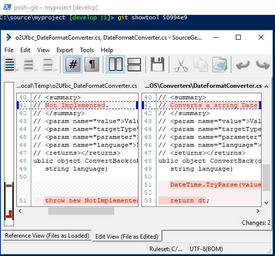

# Pushing, Fetching, and Viewing History

This post in the series looks at pushing changes remotely, fetching remote history, and viewing history of changes.

## Series Outline

1. [Setup](https://geoffhudik.com/tech/2017/07/19/git-command-line-part-1/)

3. [Getting Latest and Making Changes](https://geoffhudik.com/tech/2017/07/19/git-command-line-part-2/)

5. [Pushing, Fetching, and Viewing History](https://geoffhudik.com/tech/2017/07/19/git-command-line-part-3/)

7. [Merging and Managing Branches](https://geoffhudik.com/tech/2017/07/19/git-command-line-part-4/)

9. [Stashes and Reverting Work](https://geoffhudik.com/tech/2017/07/19/git-command-line-part-5/)

11. [Miscellaneous / Wrap-up](https://geoffhudik.com/tech/2017/07/19/git-command-line-part-6/)

## Remote Pushes

### First Remote Push - Showing Remote Info

Tools like SourceTree might automatically setup a new branch for remote tracking. From the command line it needs to be specified for the first push. If I can't remember if my local branch is already tracking a remote I can use `[git remote](https://git-scm.com/docs/git-remote)` as below.

C:\\source\\myproject \[Feature/GuestId\]\> git remote show origin   
\* remote origin   
 Fetch URL: https://username@bitbucket.org/company/repo.git   
 Push  URL: https://username@bitbucket.org/company/repo.git   
 HEAD branch: master   
 Remote branches:   
 Feature/AppWillPersistRules                                           tracked   
 Feature/LoadSession                                                   tracked   
 Fix/TestHarnessCanCrash                                               tracked   
 develop                                                               tracked   
 master                                                                tracked   
 prototype/Android                                                     tracked   
 refs/remotes/origin/Feature/AddCheckApi                               stale (use 'git remote prune' to remove)   
 Local branches configured for 'git pull':   
 Feature/LoadSession                             merges with remote Feature/LoadSession   
 Fix/TestHarnessCanCrash                         merges with remote Fix/TestHarnessCanCrash   
 develop                                         merges with remote develop   
 master                                          merges with remote master   
 Local refs configured for 'git push':   
 Feature/LoadSession                             pushes to Feature/LoadSession (up to date)  
 develop                                         pushes to develop             (up to date)  
 master                                          pushes to master              (up to date)

The above shows that my branch _Feature/GuestId_ doesn't have a tracked remote branch.

### First Remote push

With `[git push](https://git-scm.com/docs/git-push) -u _remoteName_ _branchName_`, this remote tracking will be in place and subsequently I can use `git pull` and `git push` without specifying a remote or branch. If I had just used `git push` on this new branch I would have received an error "fatal: The current branch Feature/GuestId has no upstream branch.". Note that `-u` is the same as the more verbose (but more clear and deprecated) `-- set-upstream`.

C:\\source\\myproject \[Feature/GuestId\]\> git push \-u origin Feature/GuestId   
Counting objects: 13, done.   
Delta compression using up to 4 threads.   
Compressing objects: 100% (13/13), done.   
Writing objects: 100% (13/13), 1.97 KiB | 0 bytes/s, done.   
Total 13 (delta 10), reused 0 (delta 0)   
remote:   
remote: Create pull request for Feature/GuestId:   
remote:   https://bitbucket.org/company/repo/pull-requests/new?source=Feature/GuestId&t=1   
remote:   
To https://bitbucket.org/company/repo.git   
 \* \[new branch\]      Feature/GuestId -> Feature/GuestId   
Branch Feature/GuestId set up to track remote branch Feature/GuestId from origin. 

Afterwards, `git status` shows:

C:\\source\\myproject \[Feature/GuestId ≡\]\> git status   
On branch Feature/GuestId   
Your branch is up-to-date with 'origin/Feature/GuestId'.   
nothing to commit, working tree clean   
C:\\source\\myproject \[Feature/GuestId ≡\]\> 

Note that posh-git status changes to \[Feature/GuestId ≡\]. The "≡" means the local branch is at the same commit level as the remote branch (identical).

Use caution with casing when creating the branch and when initially pushing it with `git push -u origin _branchName_`. In the below example, the error threw me for a loop. I was nearly positive I created the branch as _Fix/AppCrashLoadSession_ and that's what I see in the posh-git prompt. Either way, running `git branch` showed _fix/AppCrashLoadSession_, and I had to change the push command to `git push -u fix/AppCrashLoadSession`.

C:\\source\\myproject \[Fix/AppCrashClosedSession\]\> git push \-u origin Fix/AppCrashClosedSession   
fatal: Fix/AppCrashClosedSession cannot be resolved to branch.   
C:\\source\\myproject \[Fix/AppCrashClosedSession\]\> git branch   
 Feature/AppSuspendResume   
 Feature/LoadSession   
 develop   
 fix/AppCrashClosedSession   
 master 
C:\\source\\myproject \[Fix/AppCrashClosedSession\]\> git push \-u origin fix/AppCrashClosedSession 

### Subsequent Remote Pushes

After making an additional commit, posh-git status changes to \[Feature/GuestId ↑1\], showing me there's 1 commit locally not pushed to the remote.

Sometimes I might want to review what files will be pushed first using `[git diff](https://git-scm.com/docs/git-diff)`. Using `-- stat` generates a diffstat which "reads the output of diff and displays a histogram of the insertions, deletions, and modifications per-file". As mentioned in the previous post, `-- cached` limits changes to those that have been staged.

C:\\source\\myproject \[Feature/GuestId ↑1\]\> git diff --stat --cached origin/Feature/GuestId   
 Company.MyApp.API/Requests/UpdateGuestIdentifierRequest.cs | 3 ++\- 
 1 file changed, 2 insertions(+), 1 deletion(-) 

Or if I want to see each commit that will be pushed I can use `[git log](https://git-scm.com/docs/git-log)`.

C:\\source\\myproject \[develop ↑3\]\> git log origin/develop..develop --oneline   
99e6092 Merge branch 'develop' of https://bitbucket.org/company/repo into develop   
aae9719 readme change   
570b802 readme changes 

I can then use `git show` if desired to view a specific commit (more on that later).

Once ready to push I can just use `git push` from now on since I previously setup this local branch with remote tracking.

C:\\source\\myproject \[Feature/GuestId ↑1\]\> git push   
Counting objects: 5, done.   
Delta compression using up to 4 threads.   
Compressing objects: 100% (5/5), done.   
Writing objects: 100% (5/5), 506 bytes | 0 bytes/s, done.   
Total 5 (delta 4), reused 0 (delta 0)   
remote:   
remote: View pull request for Feature/GuestId => develop:   
remote:   https://bitbucket.org/company/repo/pull-requests/114?t=1   
remote:   
To https://bitbucket.org/company/repo.git   
 c6f14c7..b24161f  Feature/GuestId -> Feature/GuestId   
C:\\source\\myproject \[Feature/GuestId ≡\]\> 

### Final Remote Push

When I make the last remote push to my feature branch I need to create a pull request to get it reviewed and merged into the develop branch. It's not that tedious to spot the pull request URL that came back in the output of the last push, mark it, copy it to the clipboard, and paste it into a web browser, but it could certainly be faster.

This PowerShell function (included in my profile) gets the current branch name, builds a URL with the branch name, and launches it in the default web browser to start the PR process. Obviously this is specific to a given hosting service (Bitbucket) and a specific repo. Generally I'm working in the same repo for a considerable amount of time so keeping it simple outweighs parameters, more explicit naming, and/or multiple functions.

\[powershell\] function New-PullRequest () { $currentBranch = git rev-parse --abbrev-ref HEAD $url = "https://bitbucket.org/company/repo/pull-requests/new?source=$currentBranch&t=1" Start-Process $url "Launched $url" } \[/powershell\]

C:\\source\\myproject \[Feature/GuestId ≡\]\> new-pullrequest   
Launched https://bitbucket.org/company/repo/pull-requests/new?source=Feature/GuestId  
&t=1 

I also stumbled across `[git request-pull](https://git-scm.com/docs/git-request-pull)` later which could be useful to generate a summary of the pending changes being requested to pull in.

## Getting Remote Change History

### Git Fetch

If it's been a while since I've pulled the main develop branch, I might want to check for changes, pull any changes, merge them, and retest my feature branch with the latest integrated codebase.

A `[git fetch](https://git-scm.com/docs/git-fetch)` pulls the latest history information into my local Git repository without modifying the source files in my working tree. Since this command is always safe and it gives the latest view of changes in the remote repository, it's a good idea to run it regularly.

C:\\source\\myproject \[develop ↓3\]\> git fetch   
remote: Counting objects: 1, done.
remote: Total 1 (delta 0), reused 0 (delta 0)
Unpacking objects: 100% (1/1), done.
   1330c0d..5335289  develop    -> origin/develop
 \* \[new branch\]      fix/LoginBug -> origin/fix/LoginBug 

Note that git fetch isn't relative to the current branch; it fetches change info for all branches in the remote (unless otherwise configured with `git config remote.origin.fetch`).

### Git Fetch With Prune

Later I got in the habit of using `git fetch -p` as it first prunes local references to remote tracking branches that no longer exist on the remote. As others merge feature/fix branches into 'main' branches (develop, master etc.) those feature/fix branches are usually deleted, often automatically when the pull request is merged. This helps clean up my local Git repo.

C:\\source\\myproject \[develop ≡\]\> git fetch \-p   
From https://bitbucket.org/company/repo   
 - \[deleted\]         (none)     -> origin/Feature/AddLogging   
 - \[deleted\]         (none)     -> origin/Feature/AppSettings   
 - \[deleted\]         (none)     -> origin/Fix/StartPageCrash   
remote: Counting objects: 1, done.   
remote: Total 1 (delta 0), reused 0 (delta 0)   
Unpacking objects: 100% (1/1), done.   
 1330c0d..5335289  develop    -> origin/develop   
 \* \[new branch\]      fix/LoginBug -> origin/fix/LoginBug   
C:\\source\\myproject \[develop ↓8\]\> 

## Viewing Commit History

Most likely I want to have some clue as to what changes have been made before attempting to merge them into my branch. Switching to a Git GUI is tempting here as it may seem to make easier to browse the changes in detail. However if I want to keep things fast and fluid at the command line, I can still get basic change info easily enough with `git log`. The `git log` output is paginated when needed; if it kicks in and there's too much scrolling just enter `q` at any point to quit - not Ctrl+C as I first tried.

### One-liners of Changes in Recent Days

I tend to start with showing brief one-liners of commits in recent days.

C:\\source\\myproject \[develop ≡\]\> git log --after="2 days ago" --oneline   
d598a79 Removed unnecessary using.   
20fa57a Merged in Feature/FinishRelatedMenuItemEntity (pull request #118)   
56ef3a0 Moved RelatedMenuItems tests to its own file.   
5a43bfc Minor code change.   
07e3de9 Addressed review points.   
94a5d51 Merge branch 'develop' into Feature/FinishRelatedMenuItemEntity   
1e27102 Added get methods for MenuItems in MenuRepository; Added test to check the related menu items.   
babc1ba Merged in Feature/GuestId (pull request #114)   
a93d557 Merge branch 'develop' into Feature/FinishRelatedMenuItemEntity   
d2e100e Updated codes related to RelatedMenuItems entity, for proper behavior and correct relationships.   
4248d29 Merged in Improvement/ConsistentValidationInServerAddress (pull request #112)   
C:\\source\\myproject \[develop ≡\]\> 

### Last N Commits with More Detail

Next I might need more details on recent commits so I remove `--oneline` and limit the output to the last 3 commits here.

C:\\source\\myproject \[develop ≡\]\> git log -3   
commit d598a799e3eee77024e7b2c07d9ce0c1255af47b   
Author: John Doe <johndoe@email.com>   
Date:   Fri Jun 30 11:00:08 2017 +0800   
   
 Removed unnecessary using.   
   
commit 20fa57ac91bb31d1a8bb3da33567a9620459abc1   
Merge: babc1ba 56ef3a0   
Author: John Doe <johndoe@email.com>   
Date:   Fri Jun 30 02:39:58 2017 +0000   
   
 Merged in Feature/FinishRelatedMenuItemEntity (pull request #118)   
   
 XY-444: Finish Related Menu Item entity   
   
 Approved-by: Geoff Hudik <geoff@domain.com>   
   
commit 56ef3a014de2ae21bc2c36b79578ec9617de0771   
Author: John Doe <johndoe@email.com>   
Date:   Fri Jun 30 09:51:59 2017 +0800   
   
 Moved RelatedMenuItems tests to its own file.   
   
 XY-445 #comment Moved RelatedMenuItems tests to its own file.   
C:\\source\\myproject \[develop ≡\]\> 

### Formatted, Pretty Commit List

The `git log` command can also give customized, colorized, formatted output. However the format specification can get rather insane - certainly too much to remember and type out each time. Since I'm in PowerShell land I could create a custom function in my profile but using an alias allows me to reuse the command across any command line shell.

I only need to run the below once and it'll be persisted in my .gitconfig file under \[alias\].

`git config --global alias.history "log --pretty=format:'%C(auto,yellow)%h%C(auto,magenta)% G? %C(auto,cyan)%>(12,trunc)%ad %C(auto,green bold)%<(10,trunc)%aN %C(auto,reset)%<(80,trunc)%s' --date=relative"`

I'm not limited to the arguments setup within the alias so I can tack on additional ones. Below uses the new history alias and limits results to the last 10 commits.

C:\\source\\myproject \[develop ↑1\]\> git history -10   
d105c4a N2 hours ago Geoff Hu.. Minor contributing markdown changes   
a5447e0 N3 days ago Geoff Hu.. Merged in fix/BrokenThing (pull request #130)   
0740609 N3 days ago Geoff Hu.. Move Parsing to ViewModel XY-603 #comment We can move it back to API l..   
53da9dd N3 days ago Geoff Hu.. Handle newlines in guest id XY-603   
fcb84d2 N3 days ago Geoff Hu.. Correct solution items links to scripts/tools XY-606   
316870a N3 days ago Geoff Hu.. Script error handling changes XY-606   
3d83857 N4 days ago Geoff Hu.. Add new RenewPin.ps1 and move other scripts XY-606   
8f1aae4 N4 days ago Geoff Hu.. Merged in fix/NavigationIssue (pull request #128)   
6cd2721 N4 days ago Geoff Hu.. Location related null safety checks XY-599   
dbdabe5 N5 days ago John Smi.. Merged in Feature/DisplayScaling (pull request #127) 

This new git history alias has colorized output, a right-aligned relative commit time, and includes some _trunc_ statements to truncate content beyond given lengths. As a result, the data lines up nicely in columns where I can see the key info at a glance.

### Narrowing History to Current Branch Commits

By default history will show all commits regardless of branch but I may just want to view commits for that branch. If I'm working in a feature branch off develop, I can specify `develop..` to get that result and optionally add `--no-merges` to exclude merge commits.

C:\\source\\myproject \[Feature/OrderMenuItem ≡\]\> git history develop.. 
14984ca N 14 hours ago Geoff Hu.. Merge branch 'develop' into Feature/OrderMenuItem 
772a7c1 N 18 hours ago Geoff Hu.. Calling service method to add order items XY-623 #comment May move to factory .. 
a11bbb2 N 20 hours ago Geoff Hu.. Wire up click of menu item for add to order XY-623 
6366227 N 21 hours ago Geoff Hu.. Merge branch 'develop' into Feature/OrderMenuItem 
C:\\source\\myproject \[Feature/OrderMenuItem ≡\]\> git history --no-merges develop.. 
772a7c1 N 18 hours ago Geoff Hu.. Calling service method to add order items XY-623 #comment May move to factory .. 
a11bbb2 N 20 hours ago Geoff Hu.. Wire up click of menu item for add to order XY-623 

### Visualizing Commit History

It turns out that `git log` can also give a graph view of history. In a similar fashion as above, a new Git alias to setup the formatting:

`git config --global alias.graph "log --graph --pretty=format:'%C(cyan)%h%Creset -%C(yellow)%d%Creset %s %Cgreen(%cr) %C(bold cyan)<%an>%Creset' --abbrev-commit"`

The `git graph` alias for `git log` has graph output like the below. This will be all history with the most recent at the top but again, it's easy to paginate and quit with `q`.

C:\\source\\myproject \[develop ↓3\]\> git graph   
\* 5ddb7ac - (HEAD -> develop) Merged in Feature/DeathStarPlanet (pull request #113) (21 hours ago) <Su  
preme Leader Snoke>   
|\\   
| \* 947b27d - (origin/Feature/DeathStarPlanet) Addressed review points. (22 hours ago) <General Hux>   
| \* 3b1a2ca - (Feature/DeathStarPlanet) Factored out exhaust port logic. (24 hours ago) <General Hux>  
| \* b71ebf8 - Merge branch 'develop' into Feature/DeathStarPlanet (2 days ago) <General Hux>   
| |\\   
| |/   
|/|   
\* | 6b6beb1 - Merged in Feature/FlameThrower (pull request #111) (2 days ago) <Boba Fett>   
|\\ \\   
| \* | 532ce9b - Addressed review points (documentation) (2 days ago) <Boba Fett>   
| \* | 624e7f7 - WC-561 Upgrade Flame Thrower (2 days ago) <Boba Fett>   
|/ /   
| \* fe42d86 - Improved Sun energy transfer rate. (2 days ago) <General Hux>   
: 

## Viewing a Specific Commit

### Viewing Commit Diff in Console

While it often might browse and display better in a GUI, I started to find I was viewing and displaying specific commits with `git show` more than I would've thought. Obviously bigger commits could be painful to view this way but it's easy to quickly paginate through the results and quit at any point with `q`.

C:\\source\\myproject \[develop ≡\]\> git show 50994e9   
commit 50994e9de48cb5d701130b1b84a60e7246066220   
Author: John Doe <johndoe@domain.com>   
Date:   Wed Jun 14 13:45:12 2017 +0800   
   
 Addressed Review point on DateFormatConverter.   
   
 XY-526 #comment Addressed Review point on DateFormatConverter. Added implementation for ConvertBack. It won't accura  
tely bring back the original value of the date though specially when the format specified lacks other parts of the date   
(Ex. MM/dd). It might not correctly convert it back since the format is missing the year and the time part.   
   
diff --git a/Company.MyApp/Converters/DateFormatConverter.cs b/Company.MyApp/Converters/DateFormat  
Converter.cs   
index e06fc49..ce39e23 100644   
\--- a/Company.MyApp/Converters/DateFormatConverter.cs   
+++ b/Company.MyApp/Converters/DateFormatConverter.cs   
@@ -38,7 +38,7 @@ namespace Company.MyApp.Converters   
 }   
   
 /// 
   
\- /// Not Implemented.   
\+        /// Converts a string Date to DateTime object.   
 /// 
   
 /// <param name="value">Value.</param>   
 /// <param name="targetType">Target Type.</param>   
@@ -48,7 +48,9 @@ namespace Company.MyApp.Converters   
 public object ConvertBack(object value, Type targetType, object parameter,   
 string language)   
 {   
\- throw new NotImplementedException();   
\+            DateTime.TryParse(value as string, out DateTime dt);   
+   
\+            return dt;   
 }   
 }   
 } 

### Viewing Commit Diff in Diff Tool

To view the diff using a diff tool I need the commit id shown in history (_50994e9_ here) and what commit to compare it to. I can refer to the previous commit with `~1` so the command would become `git difftool 50994e9~1 50994e9`. That's not too bad but it's not as short as I'd like.

Based on [this Stack Overflow post](https://stackoverflow.com/questions/17558221/how-can-i-view-the-output-of-git-show-in-a-diff-viewer-like-meld-kdiff3-etc) I added the following "_showtool_" alias:

\[alias\]
	showtool = "!showci () { rev=${1:-HEAD}; git difftool $rev~1 $rev; }; showci $1"

Now I can invoke diff tool in similar manner to `git show` - in this case, `git showtool 50994e9`.

I found the main drawback to this was larger commits, since each file changed in the commit will pop up the diff tool and that can be a long loop. I also didn't find a good way to quit in the middle, short of just closing the command prompt.
