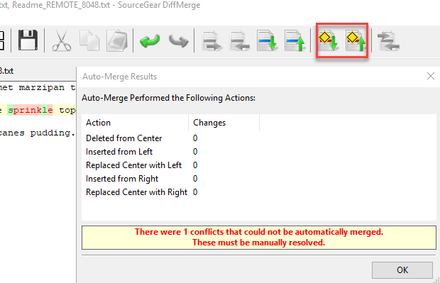
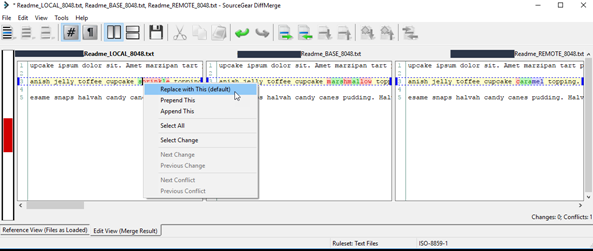
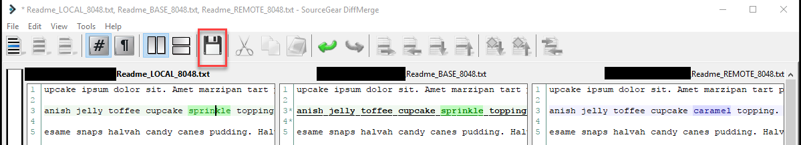

# Merging and Managing Branches

This post in the series looks at merging, resolving merge conflicts, and managing branches.

## Series Outline

1. [Setup](https://geoffhudik.com/tech/2017/07/19/git-command-line-part-1/)

3. [Getting Latest and Making Changes](https://geoffhudik.com/tech/2017/07/19/git-command-line-part-2/)

5. [Pushing, Fetching, and Viewing History](https://geoffhudik.com/tech/2017/07/19/git-command-line-part-3/)

7. [Merging and Managing Branches](https://geoffhudik.com/tech/2017/07/19/git-command-line-part-4/)

9. [Stashes and Reverting Work](https://geoffhudik.com/tech/2017/07/19/git-command-line-part-5/)

11. [Miscellaneous / Wrap-up](https://geoffhudik.com/tech/2017/07/19/git-command-line-part-6/)

## Merging in Changes from Others

Once I've got an idea of what I'll be pulling down and I feel comfortable with it, I then pull those.

C:\\source\\myproject \[develop ↓3\]\> git pull   
Updating 5ddb7ac..4248d29   
Fast-forward   
 .../Infrastructure/Net/INetUtility.cs              |  22 ++++   
 .../Infrastructure/Net/NetUtility.cs               |  86 ++++++++++++++   
 .../Company.MyApp.API.csproj                       |   2 +   
 Company.MyApp/DI/NetworkModule.cs                  |   3 +   
 .../Resources/en-US/Resources.resw                 |   2 +\- 
 .../Authentications/DeviceRegistrationViewModel.cs | 124 +++++++++\------------ 
 6 files changed, 165 insertions(+), 74 deletions(-)   
 create mode 100644 Company.MyApp.API/Infrastructure/Net/INetUtility.cs   
 create mode 100644 Company.MyApp.API/Infrastructure/Net/NetUtility.cs 

Before merging at first, I could never remember whether I needed to be in the source branch or destination branch. The answer was checking out the destination (`git checkout Feature/GuestId`) and then merging from source (`git merge develop`).

First the checkout...

C:\\source\\myproject \[develop ≡\]\> git checkout Feature/GuestId   
Switched to branch 'Feature/GuestId'   
Your branch is ahead of 'origin/Feature/GuestId' by 1 commit. 

... and then the merge.

C:\\source\\myproject \[Feature/GuestId ↑1\]\> git merge develop   
Auto-merging Company.MyApp.API/Company.MyApp.API.csproj   
Merge made by the 'recursive' strategy.   
 .../Infrastructure/Net/INetUtility.cs              |  22 ++++   
 .../Infrastructure/Net/NetUtility.cs               |  86 ++++++++++++++   
 .../Company.MyApp.API.csproj                       |   2 +   
 Company.MyApp/DI/NetworkModule.cs                  |   3 +   
 .../Resources/en-US/Resources.resw                 |   2 +\- 
 .../Authentications/DeviceRegistrationViewModel.cs | 124 +++++++++\------------ 
 6 files changed, 165 insertions(+), 74 deletions(-)   
 create mode 100644 Company.MyApp.API/Infrastructure/Net/INetUtility.cs   
 create mode 100644 Company.MyApp.API/Infrastructure/Net/NetUtility.cs 

It was amazing to me how often it just worked without merge conflicts like magic - much better than say TFS which would constantly choke on XML files for example.

## Resolving a Merge Conflict

Eventually a merge gave me a nastygram about a conflict. Running `git status` then showed this output.

C:\\source\\myproject \[Feature/GuestId ↑18 +0 ~0 -0 !1 | +0 ~0 -0 !1 !\]\> git status   
On branch Feature/GuestId   
Your branch is ahead of 'origin/Feature/GuestId' by 18 commits.   
 (use "git push" to publish your local commits)   
You have unmerged paths.   
 (fix conflicts and run "git commit")   
 (use "git merge --abort" to abort the merge)   
   
Unmerged paths:   
 (use "git add <file>..." to mark resolution)   
   
 both modified:   Readme.txt   
   
no changes added to commit (use "git add" and/or "git commit -a") 

Note the `!1` in posh-git status showing one conflict and Git's message about fixing conflicts before committing.

If there were a large number of conflicted files I might head over to a GUI based Git client. Usually I find there's often just one or two, or a small handful at most. For these cases I find cycling through the conflicted files with `[git mergetool](https://git-scm.com/docs/git-mergetool)` to be acceptable. Running that generates output such as:

C:\\source\\myproject \[Feature/GuestId ↑18 +0 ~0 -0 !1 | +0 ~0 -0 !1 !\]\> git mergetool   
Merging:   
Readme.txt   
   
Normal merge conflict for 'Readme.txt':   
 {local}: modified file   
 {remote}: modified file 

Now DiffMerge pops up showing me how many manual conflicts I'll need to resolve in the file and then after dismissing the modal I can cycle through them with the highlighted conflict buttons.

Next I take action on each conflict.

  

Once all conflicts have been addressed, I save the file and close the merge tool.

Back at the command line I see the conflict resolved but `git status` tells me more.

C:\\source\\myproject \[Feature/GuestId ↑18 +0 ~1 -0 | +1 ~0 -0 !\]\> git status   
On branch Feature/GuestId   
Your branch is ahead of 'origin/Feature/GuestId' by 18 commits.   
 (use "git push" to publish your local commits)   
All conflicts fixed but you are still merging.   
 (use "git commit" to conclude merge)   
   
Changes to be committed:   
   
 modified:   Readme.txt   
   
Untracked files:   
 (use "git add <file>..." to include in what will be committed)   
   
 Readme.txt.orig   
 

Output indicates "All conflicts fixed but you are still merging" and !1 went away in the posh-git status indicator showing me there are now no conflicts.

Note in the above output the Readme.txt.orig file. At that time I didn't have _mergetool.keepBackup_ set to false so I removed it with `del readme.txt.orig`. One fix could be adding .orig to the [git ignore file](https://git-scm.com/docs/gitignore) though the working directory would eventually get cluttered. I ended up setting this at the command line with `git config --global mergetool.keepBackup false` to prevent in the future (already set this way now in Part 1 Setup of this series).

At this point the conflicts are resolved so I might issue `git commit -m 'Resolved Readme conflict'; git push`. With the semicolon both these commands can be executed in one line, saving a little bit of time.

## Listing Branches

### Listing Local Branches

Running `[git branch](https://git-scm.com/docs/git-branch)` by itself lists all local branches and indicates which is current with '\*' and colorized output.

C:\\source\\myproject \[develop ≡\]\> git branch   
 FakeNews   
 Feature/AppSettings   
 Feature/CheckForNewVersion   
 Feature/DeviceAdd   
 Feature/LoadSession   
 Feature/GuestId   
\* develop   
 master 

Specific local branches can be searched for using `--list` with a pattern.

C:\\source\\myproject \[develop ≡\]\> git branch --list fix/\*   
 fix/LoginIssue 

### Listing Remote Branches

In addition to more verbose local/remote tracking info shown by `git remote show origin`, using `git branch -r` provides a more straightforward view of remote branches.

C:\\source\\myproject \[develop ≡\]\> git branch \-r 
 origin/Feature/AppWillPersistRules 
 origin/Feature/LoadSession 
 origin/Fix/TestHarnessCanCrash 
 origin/HEAD -> origin/master 
 origin/develop 
 origin/master 
 origin/prototype/Android 

I've not had a use for it yet but there's also `[git ls-remote](https://git-scm.com/docs/git-ls-remote.html)` with more detailed remote info.

## Deleting Local Branches

Git branches are so lightweight that deleting them doesn't gain much from a disk space / resource perspective. However when viewing a list of your branches / managing branches it can clutter things up to have a bunch of old branches. Once feature branches are merged into develop or master, the commit history will be there so keeping them around doesn't gain much.

### Deleting Specific Branches

Using `git branch -d _branchName_` will delete the specified branch. If a branch contains unmerged changes Git will present an error and require `-D` to be used to explicitly confirm deletion with risk of losing commits.

C:\\source\\myproject \[develop ≡\]\> git branch \-d FakeNews   
Deleted branch FakeNews (was d598a79). 
C:\\source\\myproject \[develop ≡\]\> git branch \-d Feature/GuestId   
error: The branch 'Feature/GuestId' is not fully merged.   
If you are sure you want to delete it, run 'git branch -D Feature/GuestId'. 

### Deleting All Merged Branches

Rather than delete a la carte, the below PowerShell function will delete all merged branches, excluding develop and master. I put this in my PowerShell profile but it could probably be used in alias form if desired.

\[powershell\] function Remove-MergedBranches { git branch --merged | %{$\_.trim()} | ?{$\_ -notmatch 'develop' -and $\_ -notmatch 'master'} | %{git branch -d $\_} } \[/powershell\]

C:\\source\\myproject \[develop ≡\]\> remove-mergedbranches 
Deleted branch Feature/AppSuspendResume (was f20f2ef). 
Deleted branch Feature/AppWillPersistRules (was 8095ecd). 
Deleted branch Feature/FinishRelatedMenuItemEntity (was 5a43bfc). 
Deleted branch Feature/GuestId (was aae9719). 
Deleted branch Feature/LoadSession (was 06ae322). 
error: branch '\* Feature/NoMatchFound' not found. 
Deleted branch fix/AppCrashSession (was 6cd2721).
