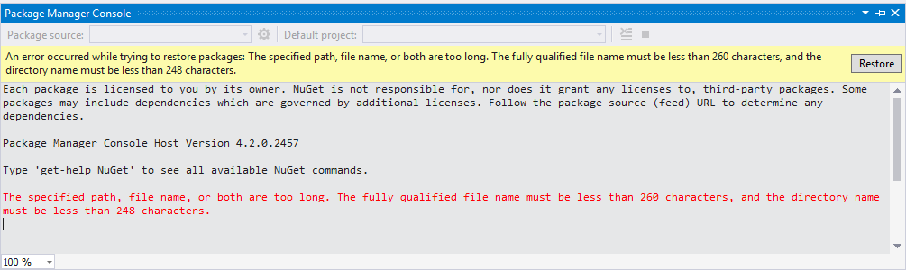

Recently I ran a .NET console app in Visual Studio 2017 and noticed the console window never appeared. I could set breakpoints and step through the code and everything executed fine, except for any console I/O since the window itself was missing or hidden. I checked underneath other windows, tried Alt+Tab, made sure it wasn't some external monitor or display issue and so forth. There were no errors or warnings, no sign of anything wrong. ¯\\\_(ツ)\_/¯

Surely my code can't be that bad. Yes it can be and don't call me Shirley. Well there was some perhaps questionable async code in there and [async Main](https://blogs.msdn.microsoft.com/mazhou/2017/05/30/c-7-series-part-2-async-main/) wasn't available to me yet. So I stripped down the code until it was only a single `Console.WriteLine` followed by a `Console.ReadLine`. Still no console window. My original code is looking better at least.

I seemed to remember running a console app not that long ago without issue. So I created a new, empty console app in a C:\\Temp\\ folder, ran it, and the console window displayed just fine. Okay, so it seems to be related to where the console app is running from but what's so special about where I was running my app from?

Then it dawned on me - the previous day I ran into this NuGet issue:

It was hard for me to believe that [NuGet doesn't support long paths](https://github.com/NuGet/Home/issues/3324). It was also hard to believe that my path structure was that long. In PowerShell I ran `cmd /c dir /s /b |? {$_.length -gt 260} >too_dang_long.txt`. Opening up that file I saw filenames like _C:\\Users\\geoffh\\OneDrive - Company Directory\\Events\\2017-Event-Name\\Me\\AttendeePractice\\02-Workshop-Name\\DotNet\\ApplicationName\\packages\\EnterpriseLibrary.TransientFaultHandling.6.0.1304.0\\lib\\portable-net45+win+wp8\\Microsoft.Practices.EnterpriseLibrary.TransientFaultHandling.dll_; yup, that's a mouthful and that's 280 characters.

I shortened up the folder names and structure some but it wasn't enough. I couldn't easily do anything about where my OneDrive business folder was or its spaces-infected verbose name, so I decided to [create a symbolic link (symlink)](https://www.howtogeek.com/howto/16226/complete-guide-to-symbolic-links-symlinks-on-windows-or-linux/) to shorten up the path. Using `mklink`, I basically mapped a new, virtual "c:\\OneDrive" to "C:\\Users\\geoffh\\OneDrive - Company Directory".

Next I reopened the console app solution but from the source location instead of going through the symlink. Voila, there's the missing console window. Okay so Visual Studio doesn't like running console apps from a symlink folder perhaps?

Thinking back on the previous day, I realized that I believe I created the symlink with `mklink /J Link Target` and most likely not with `mklink /D Link Target`. I thought the only real difference was the former allowed the target to be both remote and local whereas the latter was local only. Honestly I didn't give the link type any real thought when I created it. Dammit Jim I'm a coder, not a sysadmin, and don't feed me any line about DevOps.

I decided to delete the symlink, [being careful not to delete the actual source directory](https://superuser.com/questions/167076/how-can-i-delete-a-symbolic-link) (used Windows Explorer). I then recreated the symlink with `mklink /D` and noticed I could then see the console window again when running from the symlink location.

Searching around, I found other strange issues with symlinks and various apps like Visual Studio. I [posted the issue on Developer Community](https://developercommunity.visualstudio.com/content/problem/83500/no-console-window-running-solution-from-symbolic-l.html) and reflected upon Joel Spolsky's classic post [The Law of Leaky Abstractions](https://www.joelonsoftware.com/2002/11/11/the-law-of-leaky-abstractions/) which suddenly seemed all too real again.
