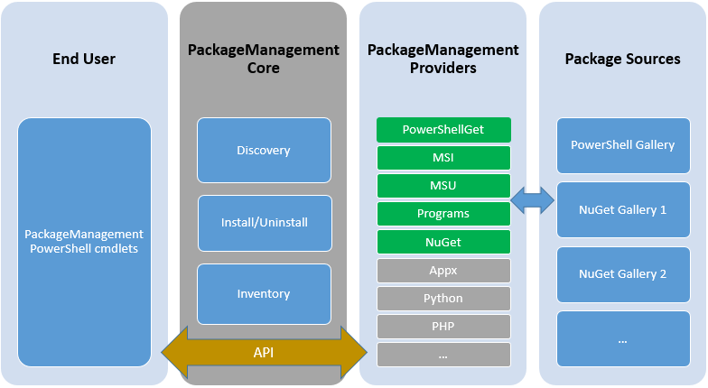
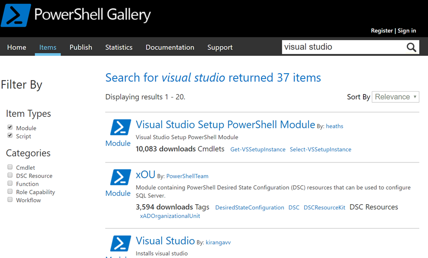
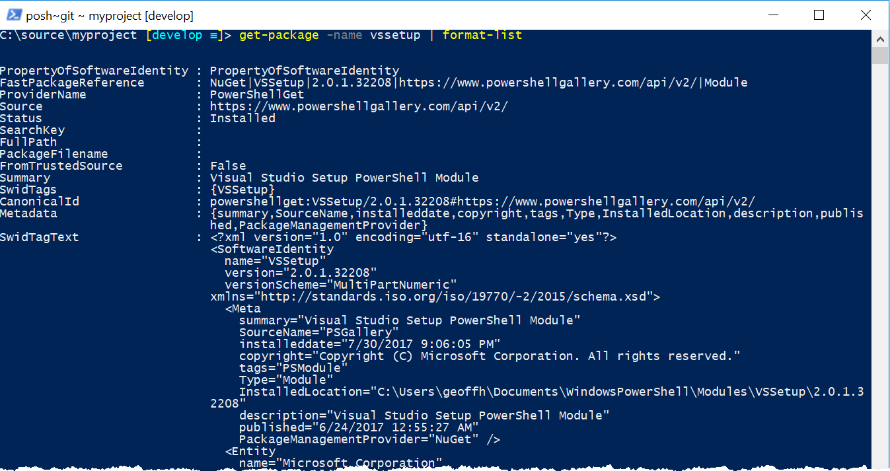
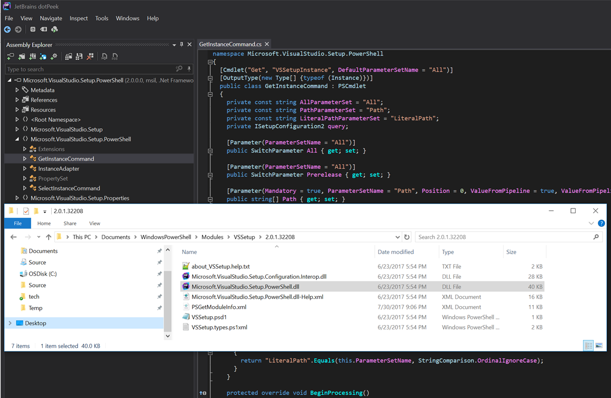

After my [PowerShell Git](https://geoffhudik.com/tech/2017/07/19/git-command-line-part-1/) work, I wanted to do a few more things at the command line related to Visual Studio, .NET, and the repository I was working with. In searching for some Visual Studio related PowerShell script code, I came across PowerShellGet. I hadn't used it or read much about it before so I needed to do a little discovery before using it. After much Git work in PowerShell, my biggest initial problem was referring to it as PowerShellG**i**t.

## You Get a Package Manager and You Get a Package Manager

Everyone gets a package manager. Within the context of PowerShell and .NET packages you may hear about PsGet, PowerShellGet, PowerShellGallery, OneGet, Package Management, NuGet, MyGet, and Chocolatey. I was very familiar with NuGet, MyGet, and Choclately but I wasn't so clear on the distinctions between PsGet, PowerShellGet, PowerShellGallery, OneGet, and "Package Management". I thought [This StackOverflow post](https://stackoverflow.com/questions/37823964/whats-the-difference-between-chocolatey-oneget-psget-nuget) did a decent job of clarifying the distinctions.

Okay so OneGet is a "Package Manager Manager" and was renamed to "Package Management". Yo dawg I heard you like package managers so I put a "package manager" around your package managers so you can manage packages while you manage packages. One "package manager" to rule them all and in the darkness, bind them. Okay, that's enough.

It appeared [PSGet](http://psget.net/) was like NuGet for PowerShell scripts [before PowerShellGet made it obsolete](https://github.com/psget/psget/issues/220) but some people were referring to PowerShellGet as PSGet which can add to the confusion. Finally [PowerShellGallery](https://www.powershellgallery.com) was a package source/repo like [nuget.org](https://www.nuget.org/) but specifically for PowerShell scripts and cmdlets that can be installed and otherwise managed by [PowerShellGet](http://go.microsoft.com/fwlink/?LinkID=760387&clcid=0x409).

[Introducing PackageManagement in Windows 10](https://blogs.technet.microsoft.com/packagemanagement/2015/04/28/introducing-packagemanagement-in-windows-10/) provides a good conceptual overview:

## Installing Package Management

Since I was on Windows 10, I was relieved I didn't have to install or configure anything to start using Package Management. Otherwise it can be obtained from [Windows Management Framework 5+](https://www.microsoft.com/en-us/download/details.aspx?id=54616) or via [OneGet GitHub](https://github.com/OneGet).

## Finding a Package

I started by searching for the functionality I was looking for on [PowerShellGallery website](https://www.powershellgallery.com). In this case I was looking for script code to locate the latest Visual Studio location without hardcoding it or making too many assumptions.

## Installing a Package

After trying to install the first package I was surprised by the following error.

C:\\source\\myproject \[develop\]\> Install-Module \-Name VSSetup 
Install-Module : A parameter cannot be found that matches parameter name 'Name'. 
At line:1 char:16 
\+ Install-Module -Name VSSetup 
\+                ~~~~~ 
 + CategoryInfo          : InvalidArgument: (:) \[Install-Module\], ParameterBindingException 
 + FullyQualifiedErrorId : NamedParameterNotFound,Install-Module 
 

I later found out this was because I had PSGet installed already (to my surprise) and that defined `Install-Module` so it [conflicted with PowerShellGet](https://til.secretgeek.net/powershell/psget_conflicts_with_PowerShellGet.html) and was getting picked up instead of the function with the same name in PowerShellGet. Per that post I would later delete PSGet to resolve the conflict. However I didn't know this was the problem at first so I kept going.

At first I thought maybe I had a typo with the command or package name or maybe PowerShellGet wasn't installed. I decided to try `Find-Module` to verify the package did exist by that name in the online gallery.

C:\\source\\myproject \[develop\]\> Find-Module VSSetup 
 
NuGet provider is required to continue 
PowerShellGet requires NuGet provider version '2.8.5.201' or newer to interact with NuGet-based repositories. The NuGet 
 provider must be available in 'C:\\Program Files\\PackageManagement\\ProviderAssemblies' or 
'C:\\Users\\geoffh\\AppData\\Local\\PackageManagement\\ProviderAssemblies'. You can also install the NuGet provider by 
running 'Install-PackageProvider -Name NuGet -MinimumVersion 2.8.5.201 -Force'. Do you want PowerShellGet to install 
and import the NuGet provider now? 
\[Y\] Yes \[N\] No  \[S\] Suspend \[?\] Help (default is "Y"): Y 
 
Version    Name                                Repository           Description 
\------- ---- ---------- ----------- 
2.0.1.3... VSSetup                             PSGallery            Visual Studio Setup PowerShell Module 
 
 

Interestingly enough, after running `Find-Module`, subsequent calls to `Install-Module` started picking up the version in PowerShellGet, presumably because that module just got loaded. Again I wasn't aware of the module conflict at the time. I no longer received the error about the Name parameter. However I now realized installing a module is for all users (by default) and that requires running PowerShell as Administrator.

C:\\source\\myproject \[develop\]\> Install-Module \-Name VSSetup 
Install-Module : Administrator rights are required to install modules in 'C:\\Program Files\\WindowsPowerShell\\Modules'. 
Log on to the computer with an account that has Administrator rights, and then try again, or install 
'C:\\Users\\geoffh\\Documents\\WindowsPowerShell\\Modules' by adding "-Scope CurrentUser" to your command. You can also try 
running the Windows PowerShell session with elevated rights (Run as Administrator). 
At line:1 char:1 
\+ Install-Module -Name VSSetup 
\+ ~~~~~~~~~~~~~~~~~~~~~~~~~~~~ 
 + CategoryInfo          : InvalidArgument: (:) \[Install-Module\], ArgumentException 
 + FullyQualifiedErrorId : InstallModuleNeedsCurrentUserScopeParameterForNonAdminUser,Install-Module 
 

I was too lazy to restart the shell so I added `-Scope CurrentUser` to the install command.

C:\\source\\myproject \[develop\]\> Install-Module \-Name VSSetup \-Scope CurrentUser 
 
Untrusted repository 
You are installing the modules from an untrusted repository. If you trust this repository, change its 
InstallationPolicy value by running the Set-PSRepository cmdlet. Are you sure you want to install the modules from 
'PSGallery'? 
\[Y\] Yes  \[A\] Yes to All \[N\] No \[L\] No to All  \[S\] Suspend \[?\] Help (default is "N"): Y 

## Getting Familiar with PackageMangement ("OneGet") Commands

First I wanted to see what commands are available within PackageManagement.

C:\\source\\myproject \[develop ≡\]\> Get-Command \-Module PackageManagement   
   
CommandType     Name                                               Version    Source   
\----------- ---- ------- ------ 
Cmdlet          Find-Package                                       1.0.0.1    PackageManagement   
Cmdlet          Find-PackageProvider                               1.0.0.1    PackageManagement   
Cmdlet          Get-Package                                        1.0.0.1    PackageManagement   
Cmdlet          Get-PackageProvider                                1.0.0.1    PackageManagement   
Cmdlet          Get-PackageSource                                  1.0.0.1    PackageManagement   
Cmdlet          Import-PackageProvider                             1.0.0.1    PackageManagement   
Cmdlet          Install-Package                                    1.0.0.1    PackageManagement   
Cmdlet          Install-PackageProvider                            1.0.0.1    PackageManagement   
Cmdlet          Register-PackageSource                             1.0.0.1    PackageManagement   
Cmdlet          Save-Package                                       1.0.0.1    PackageManagement   
Cmdlet          Set-PackageSource                                  1.0.0.1    PackageManagement   
Cmdlet          Uninstall-Package                                  1.0.0.1    PackageManagement   
Cmdlet          Unregister-PackageSource                           1.0.0.1    PackageManagement   
 

Next I discovered the parameters to `Get-Package` so I can see what packages are installed and get details about them. Running it without any arguments can generate a long list and can be painfully slow (ask me how I know) since it will include package sources like MSI.

C:\\source\\myproject \[develop ≡\]\> get-help get-package   
   
NAME   
 Get-Package   
   
SYNTAX   
 Get-Package \[\[-Name\] <string\[\]>\] \[-RequiredVersion <string>\] \[-MinimumVersion <string>\] \[-MaximumVersion <string>\]   
 \[-AllVersions\] \[-Force\] \[-ForceBootstrap\] \[-ProviderName {Programs | msi | msu | NuGet | PowerShellGet | psl |   
 chocolatey}\] \[-IncludeWindowsInstaller\] \[-IncludeSystemComponent\]  \[<CommonParameters>\]   
   
 Get-Package \[\[-Name\] <string\[\]>\] \[-RequiredVersion <string>\] \[-MinimumVersion <string>\] \[-MaximumVersion <string>\]   
 \[-AllVersions\] \[-Force\] \[-ForceBootstrap\] \[-ProviderName {Programs | msi | msu | NuGet | PowerShellGet | psl |   
 chocolatey}\] \[-AdditionalArguments <string\[\]>\]  \[<CommonParameters>\]   
   
 Get-Package \[\[-Name\] <string\[\]>\] \[-RequiredVersion <string>\] \[-MinimumVersion <string>\] \[-MaximumVersion <string>\]   
 \[-AllVersions\] \[-Force\] \[-ForceBootstrap\] \[-ProviderName {Programs | msi | msu | NuGet | PowerShellGet | psl |   
 chocolatey}\] \[-Destination <string>\] \[-ExcludeVersion\] \[-Scope {CurrentUser | AllUsers}\] \[-SkipDependencies\]   
 \[<CommonParameters>\]   
   
 Get-Package \[\[-Name\] <string\[\]>\] \[-RequiredVersion <string>\] \[-MinimumVersion <string>\] \[-MaximumVersion <string>\]   
 \[-AllVersions\] \[-Force\] \[-ForceBootstrap\] \[-ProviderName {Programs | msi | msu | NuGet | PowerShellGet | psl |   
 chocolatey}\] \[-Scope {CurrentUser | AllUsers}\] \[-PackageManagementProvider <string>\] \[-Type {Module | Script |   
 All}\] \[-AllowClobber\] \[-SkipPublisherCheck\] \[-InstallUpdate\] \[-NoPathUpdate\]  \[<CommonParameters>\] 

## Finding Installed Packages

First I tried searching by partial name with _VS\*_, which returned more results than I would've thought (output below is truncated).

C:\\source\\myproject \[develop ≡\]\> get-package \-name VS\* 
 
Name                           Version          Source                           ProviderName 
\---- ------- ------ ------------ 
vs\_networkemulationmsi\_x64     15.0.26208                                        msi 
vs\_SQLClickOnceBootstrappermsi 15.0.26208                                        msi 
vs\_communitymsires             15.0.26228                                        msi 
vs\_filehandler\_amd64           15.0.26228                                        msi 
VS Update core components      14.0.25431                                        msi 
vs\_update3notification         14.0.25431                                        msi 
VSSetup                        2.0.1.32208      https://www.powershellgallery... PowerShellGet 
vs\_cuitcommoncoremsi           15.0.26208                                        msi 
... 

Since I was only looking for PowerShellGet packages, it made more sense to search by provider name.

C:\\source\\myproject \[develop ≡\]\> get-package \-providername PowerShellGet 
 
Name                           Version          Source                           ProviderName 
\---- ------- ------ ------------ 
VSSetup                        2.0.1.32208      https://www.powershellgallery... PowerShellGet 

## Listing Commands Within PowerShellGet

Next I wanted to explore what's inside a given PowerShellGet package. Before I could do that, I needed to know the commands PowerShellGet exposed.

C:\\source\\myproject \[develop ≡\]\> get-command \-module PowerShellGet   
   
CommandType     Name                                               Version    Source   
\----------- ---- ------- ------ 
Function        Find-Command                                       1.0.0.1    PowerShellGet   
Function        Find-DscResource                                   1.0.0.1    PowerShellGet   
Function        Find-Module                                        1.0.0.1    PowerShellGet   
Function        Find-RoleCapability                                1.0.0.1    PowerShellGet   
Function        Find-Script                                        1.0.0.1    PowerShellGet   
Function        Get-InstalledModule                                1.0.0.1    PowerShellGet   
Function        Get-InstalledScript                                1.0.0.1    PowerShellGet   
Function        Get-PSRepository                                   1.0.0.1    PowerShellGet   
Function        Install-Module                                     1.0.0.1    PowerShellGet   
Function        Install-Script                                     1.0.0.1    PowerShellGet   
Function        New-ScriptFileInfo                                 1.0.0.1    PowerShellGet   
Function        Publish-Module                                     1.0.0.1    PowerShellGet   
Function        Publish-Script                                     1.0.0.1    PowerShellGet   
Function        Register-PSRepository                              1.0.0.1    PowerShellGet   
Function        Save-Module                                        1.0.0.1    PowerShellGet   
Function        Save-Script                                        1.0.0.1    PowerShellGet   
Function        Set-PSRepository                                   1.0.0.1    PowerShellGet   
Function        Test-ScriptFileInfo                                1.0.0.1    PowerShellGet   
Function        Uninstall-Module                                   1.0.0.1    PowerShellGet   
Function        Uninstall-Script                                   1.0.0.1    PowerShellGet   
Function        Unregister-PSRepository                            1.0.0.1    PowerShellGet   
Function        Update-Module                                      1.0.0.1    PowerShellGet   
Function        Update-ModuleManifest                              1.0.0.1    PowerShellGet   
Function        Update-Script                                      1.0.0.1    PowerShellGet   
Function        Update-ScriptFileInfo                              1.0.0.1    PowerShellGet   
 

## Finding Commands in PowerShell Modules

With the name of a specific package handy, I can then list commands it exposes.

C:\\source\\myproject \[develop ≡\]\> Find-Command \-ModuleName VSSetup   
   
Name                                Version    ModuleName                          Repository   
\---- ------- ---------- ---------- 
Get-VSSetupInstance                 2.0.1.3... VSSetup                             PSGallery   
Select-VSSetupInstance              2.0.1.3... VSSetup                             PSGallery   
 

## Viewing Command Details

Help for a command in a PowerShellGet package can be viewed like any other built-in command.

C:\\source\\myproject \[develop ≡\]\> get-help get-vssetupinstance   
   
NAME   
 Get-VSSetupInstance   
   
SYNOPSIS   
 Enumerates instances of Visual Studio and related products.   
   
   
SYNTAX   
 Get-VSSetupInstance \[-All\] \[-Prerelease\] \[<CommonParameters>\]   
   
 Get-VSSetupInstance -LiteralPath <String\[\]> \[<CommonParameters>\]   
   
 Get-VSSetupInstance \[-Path\] <String\[\]> \[<CommonParameters>\]   
   
   
DESCRIPTION   
 Enumerates instances of Visual Studio and related products. By default, instances with fatal errors are not   
 returned by you can pass \`-All\` to enumerate them as well.   
   
   
RELATED LINKS   
 Online Version: https://github.com/Microsoft/vssetup.powershell/raw/master/docs/VSSetup/Get-VSSetupInstance.md   
   
REMARKS   
 To see the examples, type: "get-help Get-VSSetupInstance -examples".   
 For more information, type: "get-help Get-VSSetupInstance -detailed".   
 For technical information, type: "get-help Get-VSSetupInstance -full".   
 For online help, type: "get-help Get-VSSetupInstance -online"   
   
 

## Viewing Package Details

Piping `get-package` to `format-list` can be handy in cases for nitty-gritty package details: `get-package -name vssetup | format-list`.

## Viewing Module Contents

As with any module, PowerShellGet installed or not, I can peek into the contents.

  

## Discovering Other Packages Online

Initially I was browsing functions in packages just through the search on [powershellgallery.com](https://www.powershellgallery.com). Key functions and other information can be found right in the search results with more detail available on the package's detail page - [VSSetup](https://www.powershellgallery.com/packages/VSSetup/2.0.1.32208) for example. Later it was often more convenient to search from the command line with `Find-Module`.

C:\\source\\myproject \[develop ≡\]\> find-module \*build\*   
   
Version    Name                                Repository           Description   
\------- ---- ---------- ----------- 
0.0.47     BuildHelpers                        PSGallery            Helper functions for PowerShell CI/CD scenarios.   
3.6.4      InvokeBuild                         PSGallery            Build and test automation in PowerShell   
6.5.1.5... VMware.ImageBuilder                 PSGallery            This Windows PowerShell module contains PowerCLI...   
1.15.0     Saritasa.Build                      PSGallery            Contains functions to execute MSBuild targets, r...   
2.6.0      Invoke-MsBuild                      PSGallery            Executes the MSBuild.exe tool against the specif...   
1.4.0      cMDTBuildLab                        PSGallery            A DSC Module to help automize deployment Windows...   
0.8.3.1140 LabBuilder                          PSGallery            Builds Hyper-V Windows Labs out of text based co...   
2.16.0     Indented.Build                      PSGallery            Indented.Build centralises the build processes /...   
1.0.20     PSModuleBuild                       PSGallery            Easily build PowerShell modules for a set of fun...   
1.0.2      PowerBuild                          PSGallery            Integrate MSBuild into PowerShell pipeline.   
0.1.5      ModuleBuild                         PSGallery            A scaffolding framework which can be used to kic...   
0.2.1      BuildMasterAutomation               PSGallery            The BuildMasterAutomation module is a PowerShell...   
1.0.6      ExchangeBuild                       PSGallery            Module Used to List all Exchange Server Versions...   
2.0.14     Buildbox.SemVer                     PSGallery            Buildbox.SemVer is a framework that helps you up...   
2.0.14     Buildbox.Utils                      PSGallery            This module contains a collection of cmdlets use...   
0.1.81     buildbox.wawsdeploy                 PSGallery            Buildbox.WAWSDeploy provides an easy way to publ...   
   
 

## The Payoff

Commands from modules installed via PowerShellGet can be executed just like any other module command.

C:\\source\\myproject \[develop\]\> Get-VSSetupInstance 
  
InstanceId          : a9d67b0c 
  
DisplayName         : Visual Studio Enterprise 2017 
  
InstallationVersion : 15.0.26430.14 
  
InstallationPath    : C:\\Program Files (x86)\\Microsoft Visual Studio\\2017\\Enterprise 
  
InstallDate         : 3/13/2017 10:07:40 AM 

The benefit was I found and installed functions easily through PackageManagement and PowerShellGet. I didn't have to deal with searching all over, multiple differing websites, varying inconsistencies, downloading and extracting zip files, copying files to a modules folder, or importing them from random locations and so forth.

In future posts I'll likely make more use of commands installed via PowerShellGet but for now I wanted to focus on the package management itself.

So that's some basics of Package Management and PowerShellGet, or as I like to refer to it, NuGet for PowerShell. Or maybe for short, NuPow? NuGetShell? NuPowerGet? NuNewPSGet? OneNuPSGet? [Naming things is hard](https://martinfowler.com/bliki/TwoHardThings.html).
