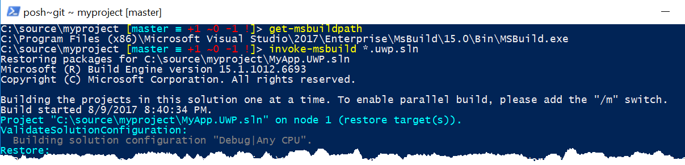

Building on my time with [PowerShellGet](https://geoffhudik.com/tech/2017/08/02/powershellget/) and [Git from PowerShell](https://geoffhudik.com/tech/2017/07/19/git-command-line-part-1/), I wanted additional script functionality to do more than just version control operations on my .NET app's codebase. This included things like building the solution, running unit tests, launching Visual Studio, and cleaning up binary output (bin, obj, packages).

## Launching Visual Studio Solutions

Starting off simple, I created a function to start the default process associated with the first file matching a given pattern. This function has nothing to do with Visual Studio other than that I was generally using it against .sln files.

\[powershell\] function Invoke-First ($pattern) { @(Get-ChildItem $pattern)\[0\] | ForEach-Object {start-process $\_.FullName} } \[/powershell\]

Often I'm in a directory and know it has only one solution so I run `Invoke-First *.sln`, or if there are multiple solutions, something like `Invoke-First *.UWP.sln`. It's on me to know that if the pattern matches multiple files, only the first match will be launched. I could check the length to handle 0 or more than 1 match but the function name implies the expectation.

## Building the Solution (MSBuild)

Sometimes after pulling the latest code I just want to build the app and run it without going through Visual Studio.

### Getting MSBuild Path

First I wanted the MSBuild path so I used `Get-VsSetupInstance` from the [VSSetup](https://www.powershellgallery.com/packages/VSSetup/2.0.1.32208) PowerShell module to resolve the base Visual Studio install path. I then borrowed some techniques from the [Invoke-MSBuild](https://www.powershellgallery.com/packages/Invoke-MsBuild/2.6.0) module (which didn't quite work for me as is) to further resolve the MSBuild path from there.

\[powershell\] function Get-MSBuildPath (\[switch\] $amd64) { $vsInstallPath = (Get-VsSetupInstance).InstallationPath $msBuild32Search = (Join-Path $vsInstallPath "MsBuild\\\*\\Bin\\MsBuild.exe") $msBuild64Search = (Join-Path "$vsInstallPath" "MsBuild\\\*\\Bin\\amd64\\MsBuild.exe") $msBuildPaths = Get-Item -Path $msBuild32Search, $msBuild64Search if (($msBuildPaths -eq $null) -or ($msBuildPaths.Length -eq 0)) { # slow fallback $msBuildPaths = Get-ChildItem -Path $vsInstallPath -Recurse | Where-Object { $\_.Name -ieq 'MsBuild.exe' } } $msBuildPathsSorted = $msBuildPaths | Sort-Object -Property FullName -Descending $msBuildPath = $null

if ($amd64) { $msBuildPath = $msBuildPathsSorted | Where-Object { $\_.Directory.Name -ieq 'amd64' } | Select-Object -ExpandProperty FullName -First 1 } else { $msBuildPath = $msBuildPathsSorted | Where-Object { $\_.Directory.Name -ine 'amd64' } | Select-Object -ExpandProperty FullName -First 1 }

$msBuildPath } \[/powershell\]

### Running a MSBuild Task

With the MSBuild path resolved I can invoke MSBuild. First file matches are resolved to the solution to use with MSBuild, so I can be lazier with something like `Invoke-MSBuild *.UWP.sln`. Unlike with `Invoke-First` above, a single match to the pattern is ensured. Next, MSBuild is invoked with a restore target by default, as building from the command line won't automatically restore NuGet packages as it would from Visual Studio. Finally, MSBuild is launched with the specified target; generally that's Rebuild for me, so that's the default, but often I'd use Publish or Clean as well.

\[powershell\] function Invoke-MSBuild ($solution, $target = "Rebuild", \[switch\] $amd64, \[switch\]$noRestore) { # allow for wildcard matching on $solution $solutionMatches = @(Get-ChildItem $solution -ErrorAction SilentlyContinue)

if ($solutionMatches.Length -ne 1) { Write-Warning "Expected 1 solution match but found $($solutionMatches.Length). Refine solution path." return }

$sln = $solutionMatches\[0\] $msBuildPath = Get-MSBuildPath -amd64:$amd64

\# nuget packages may need to be restored; have to explictly indicate from cmd line if (!$noRestore) { # "/t:restore" is NuGet 4.0+ and MSBuild 15.1+ # This still may fail for .net standard libs: https://github.com/NuGet/Home/issues/4532 "Restoring packages for $($sln.FullName)" &$msBuildPath $sln.FullName /t:restore }

"Running target $($target) for $($sln.FullName)" &$msBuildPath $sln.FullName /t:$target } \[/powershell\]

## Running Tests

When Visual Studio isn't open I'll often run tests from PowerShell but even when it's up I sometimes find it more convenient to run the tests in PowerShell. GUI test runners have their quirks. [Test Explorer often has issues discovering tests](https://stackoverflow.com/questions/35103781/why-is-the-visual-studio-2015-2017-test-runner-not-discovering-my-xunit-v2-tests) and I find the interface limited. ReSharper's test runner and windows I find much better but sometimes it too has issues with discovery and I've had some weird [ReSharper Test Session Window issues](https://youtrack.jetbrains.com/issue/RSRP-460737).

For this app I created a Tools/RunTests.ps1 file that can execute tests a couple of ways. One mode runs tests against existing test binaries directly with the xunit's console runner. The other goes through our [Cake (C# Make)](https://www.cakebuild.net/) script, first building the app and then executing tests. The top of the script:

\[powershell\] param( # configuration - i.e. Debug or Release \[string\] $config = "Debug",

\# run mode - what type of tests to run \[ValidateSet("all", "unit", "integration")\] \[string\] $runMode = "all",

\# if set, tests are run via Cake process which will first build app \[switch\]$build )

$projectName = "MyApp" # ... \[/powershell\]

At the end of the script a driver function executes the tests differently based on the `$build` parameter.

\[powershell\] function Invoke-Tests { if (!$build) { Invoke-ConsoleRunner } else { Invoke-CakeBuild } }

Invoke-Tests \[/powershell\]

### Running Tests Via Console Runner

The console runner function first resolves paths to the runner and test assemblies. When invoking the runner it passes different assemblies according to whether the desire is to run unit tests, integration tests, or both. Passing `-verbose` outputs the test names as they are being executed. Use of `-html` creates a temporary HTML output file should I want to see more detailed, expandable, formatted test results with execution times and other details.

\[powershell\] function Invoke-ConsoleRunner { $runner = Join-Path (Get-ConsoleRunnerPath) "xunit.console.exe" $unitTestDll = Get-TestDll "unit" $integrationTestDll = Get-TestDll "integration" $htmlOut = "$env:Temp\\$projectName.Tests.html" $testDlls = @()

if ($runMode -eq "unit" -or $runMode -eq "all") { $testDlls += $unitTestDll }

if ($runMode -eq "integration" -or $runMode -eq "all") { $testDlls += $integrationTestDll }

& $runner $testDlls -nologo -noshadow -verbose -html $htmlOut $htmlOut } \[/powershell\]

The helper functions below resolve the runner (without specifying a NuGet package version) and the test dll filename relative to the script location. For this app there are two test assemblies, `$projectName`.Tests.Unit.dll and `$projectName`.Tests.Integration.dll.

\[powershell\] function Get-ConsoleRunnerPath { $pattern = "$PSScriptRoot\\..\\packages\\xunit.runner.console.\*\\tools" $items = Get-ChildItem $pattern | Sort-Object -Property FullName -Descending if (($items -eq $null) -or ($items.Length -eq 0)) { Write-Error "Failed to find '$pattern'; NuGet packages may need to be restored." return }

$items\[0\].FullName }

function Get-TestDll ($type) { $unitTestDll = Join-Path $PSScriptRoot "..\\$projectName.Tests.$type\\bin\\$config\\$projectName.Tests.$type.dll" $unitTestDll } \[/powershell\]

### Running Tests Via Cake Build Script

A Cake directory of the repo has the Cake defaults of build.cake as the build script and build.ps1 as the script to execute it (see [Cake's Getting Started](https://www.cakebuild.net/docs/tutorials/getting-started)). Even when passing a full cake filename to build.ps1 the script seemed to assume the current directory was that of the script, hence the `Push-Location` before invoking it and `Pop-Location` afterwards.

\[powershell\] function Invoke-CakeBuild { Push-Location "$PSScriptRoot\\..\\Cake" $target = "all-tests"

if ($runMode -eq "unit") { $target = "unit-tests" } elseif ($runMode -eq "integration") { $target = "integration-tests" }

.\\build.ps1 -Configuration $config -Target $target Pop-Location

\# revert changes build made to UWP appxmanifest file. git checkout -- \*Package.appxmanifest } \[/powershell\]

The relevant bits of the Cake script follow.

\[csharp\] #tool "nuget:?package=xunit.runner.console"

var \_buildConfiguration = Argument("build\_configuration", "Debug"); const string TEST\_DLL\_FORMAT = "../MyApp.Tests.{0}/bin/{1}/MyApp.Tests.{0}.dll"; // ...

Task("unit-tests") .IsDependentOn("build") .Does(() => { XUnit2(string.Format(TEST\_DLL\_FORMAT, "Unit", \_buildConfiguration)); });

Task("integration-tests") .IsDependentOn("build") .Does(() => { XUnit2(string.Format(TEST\_DLL\_FORMAT, "Integration", \_buildConfiguration)); });

Task("all-tests") .IsDependentOn("unit-tests") .IsDependentOn("integration-tests") .Does(() => { Information("All tests run"); }); \[/csharp\]

Partial sample output of `Tools/RunTests.ps1 -build`...

Time Elapsed 00:01:51.18 
Finished executing task: build 
 
\======================================== 
unit-tests 
\======================================== 
Executing task: unit-tests 
xUnit.net Console Runner (64-bit .NET 4.0.30319.42000) 
 Discovering: MyApp.Tests.Unit 
 Discovered:  MyApp.Tests.Unit 
 Starting:    MyApp.Tests.Unit 
 Finished:    MyApp.Tests.Unit 
\=== TEST EXECUTION SUMMARY === 
 MyApp.Tests.Unit  Total: 116, Errors: 0, Failed: 0, Skipped: 0, Time: 16.918s 
Finished executing task: unit-tests 
 
\======================================== 
integration-tests 
\======================================== 
Executing task: integration-tests 
xUnit.net Console Runner (64-bit .NET 4.0.30319.42000) 
 Discovering: MyApp.Tests.Integration 
 Discovered:  MyApp.Tests.Integration 
 Starting:    MyApp.Tests.Integration 
 Finished:    MyApp.Tests.Integration 
\=== TEST EXECUTION SUMMARY === 
 MyApp.Tests.Integration  Total: 44, Errors: 0, Failed: 0, Skipped: 0, Time: 97.553s 
Finished executing task: integration-tests 
 
\======================================== 
all-tests 
\======================================== 
Executing task: all-tests 
All tests run 
Finished executing task: all-tests 
 
Task                          Duration 
\-------------------------------------------------- 
clean                         00:00:01.4274669 
restore-nuget-packages        00:00:36.8457843 
gitInfo                       00:00:00.2807391 
version                       00:00:00.1500806 
build                         00:01:51.8009839 
unit-tests                    00:00:19.5155430 
integration-tests             00:01:40.6757714 
all-tests                     00:00:00.0051116 
\-------------------------------------------------- 
Total:                        00:04:30.7014808 

In hindsight it would have probably been better to have the all-tests target just repeat the steps of unit-tests and integration-tests, considering the small amount of duplication and how it makes it look like all-tests happened instantaneously. I could've also done away with direct interaction with MSBuild altogether and just gone through Cake, though our Cake script does a bit more than necessary for local dev builds.

## Cleaning Up Binary Files

After creating a lot of binary files through builds and NuGet restores I sometimes need to clean them up. The below function recursively deletes bin, obj, and packages folders. There's some custom error handling because PowerShell seems to still trip up on itself sporadically when deleting files recursively. Google searches will show a lot of posts showing problems doing this such as [this StackOverflow post](https://stackoverflow.com/questions/1752677/how-to-recursively-delete-an-entire-directory-with-powershell-2-0) or [this one](https://serverfault.com/questions/199921/force-remove-files-and-directories-in-powershell-fails-sometimes-but-not-always). Supposedly there was some discussion on the [PowerShell Core](https://github.com/PowerShell/PowerShell) GitHub about handling this better in the new and improved cross platform PowerShell.

\[powershell\] function Remove-Bin { Get-ChildItem .\\ -Include bin,obj,packages -Recurse | ForEach-Object ($\_) { "Deleting $($\_.FullName)" Remove-Item $\_.FullName -Force -Recurse -ErrorAction SilentlyContinue -ErrorVariable e

if ($e) { Write-Warning $e.Exception.Message } } } \[/powershell\]

C:\\projects\\AutoMapper \[master ≡\]\> Remove-Bin   
Deleting C:\\projects\\AutoMapper\\packages   
Deleting C:\\projects\\AutoMapper\\src\\AutoMapper\\bin   
Deleting C:\\projects\\AutoMapper\\src\\AutoMapper\\obj   
Deleting C:\\projects\\AutoMapper\\src\\AutoMapperSamples\\bin   
Deleting C:\\projects\\AutoMapper\\src\\AutoMapperSamples\\obj   
Deleting C:\\projects\\AutoMapper\\src\\AutoMapperSamples.EF\\bin   
Deleting C:\\projects\\AutoMapper\\src\\AutoMapperSamples.EF\\obj   
Deleting C:\\projects\\AutoMapper\\src\\AutoMapperSamples.OData\\bin   
Deleting C:\\projects\\AutoMapper\\src\\AutoMapperSamples.OData\\obj   
Deleting C:\\projects\\AutoMapper\\src\\Benchmark\\bin   
Deleting C:\\projects\\AutoMapper\\src\\Benchmark\\obj   
Deleting C:\\projects\\AutoMapper\\src\\IntegrationTests\\bin   
Deleting C:\\projects\\AutoMapper\\src\\IntegrationTests\\obj   
Deleting C:\\projects\\AutoMapper\\src\\UnitTests\\bin   
Deleting C:\\projects\\AutoMapper\\src\\UnitTests\\obj
