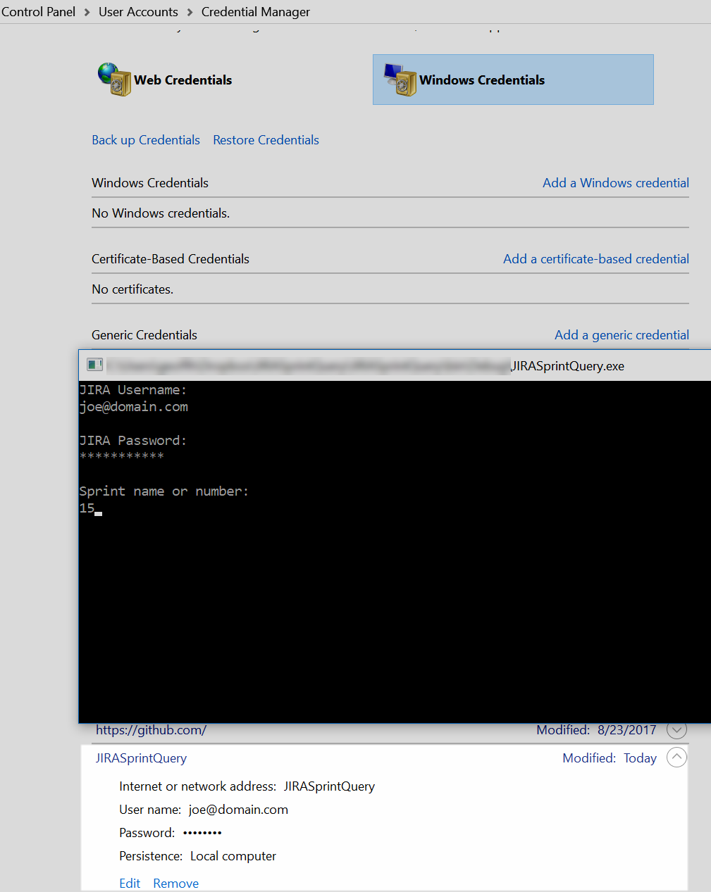

In working on a little utility to query JIRA tickets in a sprint, I needed a JIRA username and password to pass along to the [Atlassian.Net SDK](https://bitbucket.org/farmas/atlassian.net-sdk). I didn't want to prompt for those credentials each time but I also didn't want to store the credentials myself either, even if encrypted. Using the Windows Credential Manager sounded ideal, but I didn't recall working with it programmatically before. A [quick search](https://stackoverflow.com/questions/32548714/how-to-store-and-retrieve-credentials-on-windows-using-c-sharp) lead me to a [CredentialManagement NuGet package](https://www.nuget.org/packages/CredentialManagement/) that handles all the low level Win32 code.

A ConsoleInput class checks the credential store and prompts for the needed credentials if not found. It also deals with I/O helpers like [masking the password](https://stackoverflow.com/questions/3404421/password-masking-console-application).

\[csharp\] using System; using System.Collections.Generic; using System.Linq;

namespace JIRASprintQuery { public class ConsoleInput { public bool IsValid { get; private set; } public string Username { get; private set; } public string Password { get; private set; } public string SprintName { get; private set; }

public ConsoleInput Get() { // If we have saved Windows credentials in Credential Manager, use those, else prompt. var cred = Credentials.Get();

if (cred.User == null || cred.Pass == null) { Username = ReadLine("JIRA Username"); if (string.IsNullOrEmpty(Username)) return this;

Password = ReadPassword("JIRA Password"); if (string.IsNullOrEmpty(Password)) return this;

Credentials.Save(Username, Password); } else { Username = cred.User; Password = cred.Pass; }

SprintName = GetSprintName(ReadLine("Sprint name or number")); if (string.IsNullOrWhiteSpace(SprintName)) return this;

IsValid = true; return this; }

private string ReadLine(string label, bool trim = true) { Console.WriteLine($"{label}:"); var input = Console.ReadLine(); Console.WriteLine(); if (trim) input = input?.Trim(); if (string.IsNullOrEmpty(input)) { IsValid = false; Console.WriteLine($"{label} is required, exiting."); }

return input; }

private static string GetSprintName(string sprint) { if (int.TryParse(sprint, out int sprintNumber)) { // i.e. <add key="SprintNamePattern" value="Project - Sprint {SprintNumber}" /> var template = AppSettings.SprintNamePattern; sprint = template.Replace("{SprintNumber}", sprintNumber.ToString()); }

return sprint?.Trim(); }

public static string ReadPassword(string label, char mask = '\*') { const int enter = 13, backsp = 8, ctrlbacksp = 127; int\[\] filtered = { 0, 27, 9, 10 /\*, 32 space, if you care \*/ }; // const var pass = new Stack<char>(); char chr; Console.WriteLine($"{label}:");

while ((chr = Console.ReadKey(true).KeyChar) != enter) { if (chr == backsp) { if (pass.Count > 0) { Console.Write("\\b \\b"); pass.Pop(); } } else if (chr == ctrlbacksp) { while (pass.Count > 0) { Console.Write("\\b \\b"); pass.Pop(); } } else if (filtered.Count(x => chr == x) > 0) { } else { pass.Push(chr); Console.Write(mask); } }

Console.WriteLine(); Console.WriteLine();

return new string(pass.Reverse().ToArray()); } } } \[/csharp\]

Credential loading and saving was very easy with the Credential class of the CredentialManagment NuGet package. Note the use of [named value tuples](https://blogs.msdn.microsoft.com/mazhou/2017/05/26/c-7-series-part-1-value-tuples/) in the Get method (requiring [System.ValueTuple package](https://www.nuget.org/packages/System.ValueTuple/) at the moment).

\[csharp\] using CredentialManagement; using System.Reflection;

namespace JIRASprintQuery { public static class Credentials { private static string Target() { // Just use assembly short name as identifier in credential store. return Assembly.GetEntryAssembly().GetName().Name; }

public static void Save(string username, string password) { using (var cred = new Credential()) { cred.Username = username; cred.Password = password; cred.Target = Target(); cred.Type = CredentialType.Generic; cred.PersistanceType = PersistanceType.LocalComputer; cred.Save(); } }

public static (string User, string Pass) Get() { using (var cred = new Credential()) { cred.Target = Target(); cred.Load(); return (cred.Username, cred.Password); } } } } \[/csharp\]

I used the ConsoleInput class as follows, making use of [async Main](https://blogs.msdn.microsoft.com/mazhou/2017/05/30/c-7-series-part-2-async-main/). That required [switching to Visual Studio 2017 Preview 2](https://github.com/dotnet/sdk/issues/1395), and [Enabling C# 7 compilation](http://www.c-sharpcorner.com/article/enabling-c-sharp-7-compilation-with-visual-studio-2017/). It seemed odd C# 7.1 (required for async Main) or the "latest minor version" was not the default for me, but "latest major version" (7.0) was.

\[csharp\] using System.Threading.Tasks;

namespace JIRASprintQuery { public class Program { // async main requires C# 7.1 in project properties and Rosyln support (VS 2017 Preview 2 currently) public static async Task<int> Main(string\[\] args) { var consoleInput = new ConsoleInput().Get(); if (!consoleInput.IsValid) return -1;

// Main logic here...

return 0; } } } \[/csharp\]

Running the app for the first time prompts for credentials which appear in Credential Manager immediately after entered. Subsequent runs will use the persisted credentials and won't prompt. For a real world app I'd probably want a mechanism to prompt again in the event of changed credentials, such as after detecting an authentication exception.

