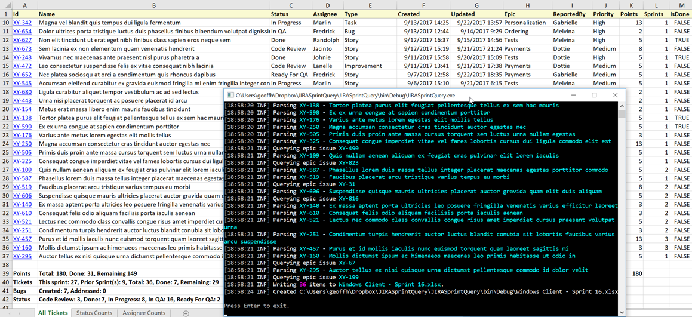
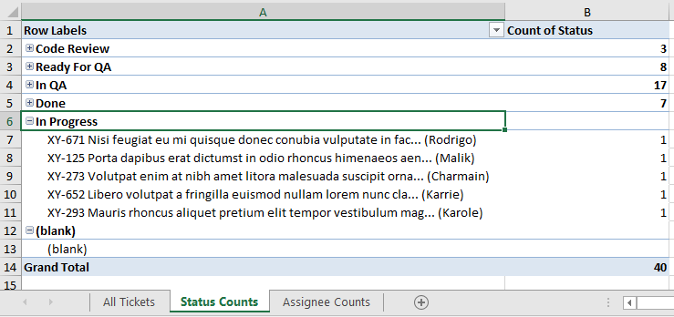

  

## Background

A current project of mine has no dedicated PM and I've had to fulfill some of those duties as the lead developer. That's included things like status reports, executive reviews, client demos, general sprint and backlog management, and work distribution. I'd much rather be programming than doing such tasks so the more of that I can automate the better.

Initially much of my time was spent trying to extract various detail and summary data from [JIRA](https://www.atlassian.com/software/jira). I tried different boards and settings, reports, and the Issue Navigator and JQL. It seemed like either I couldn't quite get just the information I wanted or it took too many steps. Part of that might have been JIRA being new to me and not intuitive in ways. Perhaps years of [TFS](https://www.visualstudio.com/tfs/) and [VersionOne](https://www.versionone.com/) made the adjustment more difficult.

## YAUA - Yet Another Utility App

I really dislike tedious, repetitive tasks so I probably end up writing too many utility apps / scripts but why stop now? I thought I'd research what JIRA offered API wise and see if I could throw together a console app that queried issues in the current sprint and wrote detail and summary info to an Excel file for further manipulation.

## JIRA

### Connecting to JIRA

I decided to use the [Atlassian.Net SDK](https://bitbucket.org/farmas/atlassian.net-sdk) via NuGet. There was a bit more flexibility going directly to JIRA's REST API but since this was a quick utility I didn't want to deal with creating a REST client, authentication and the like.

Creating a JIRA rest client required a server URL, username and password. Those I read from the Windows Credential Manager, prompting for if missing. I won't repeat those details here since they were in my last post, [Console App Credentials and the Windows Credential Manager](https://geoffhudik.com/tech/2017/09/14/console-app-credentials-and-the-windows-credential-manager/). The only additional difference is I later stored the JIRA URL there as well; previously that was stored in App.config.

I also needed to set MaxIssuesPerRequest when creating the client as it's pretty low by default (20 or so IIRC). I'm guessing their LINQ provider supports paging via Skip and Take but since I was only querying a few items in a given sprint, I didn't feel the need for paging code.

\[csharp\] public static class JiraClientFactory { public static Jira Create(string username, string password, string jiraServer) { var jira = Jira.CreateRestClient(jiraServer, username, password); jira.Issues.MaxIssuesPerRequest = AppSettings.MaxIssuesPerRequest; return jira; } } \[/csharp\]

### Determining the Current Sprint

The first problem I ran into is that the Atlassian.NET SDK doesn't support querying sprints directly. There is an issue logged to [support the JIRA Agile API](https://bitbucket.org/farmas/atlassian.net-sdk/issues/287/add-jira-agile-support) so maybe that will come in the future. The .NET SDK does allow querying issues by sprint name so I decided to just prompt for a sprint number which I turned into a sprint name based on the naming convention for the project. Those details are also a part of my [previous post](https://geoffhudik.com/tech/2017/09/14/console-app-credentials-and-the-windows-credential-manager/).

### Querying JIRA Sprint Issues

I found querying issues to be pretty straightforward, outside of the syntax for querying the sprint, which required `["Sprint"]` as a custom field reference and `LiteralMatch` to get an exact match on sprint name. It's worth noting that this code is only designed to work with the current sprint; I'm guessing it wouldn't work correctly for past closed sprints. I filtered out sub-tasks in the issues list as I was only interested in "higher level" issues like stories, bugs, etc.

\[csharp highlight="25"\] public class JiraQueryService { private readonly Jira \_jira; private readonly ILogger \_logger; private readonly IIssueTicketConverter \_issueTicketConverter;

public JiraQueryService(ILogger logger, string username, string password, string jiraServer) { \_logger = logger; \_jira = JiraClientFactory.Create(username, password, jiraServer);

#if !SCRUB\_DATA \_issueTicketConverter = new IssueTicketConverter(\_logger); #else \_issueTicketConverter = new IssueTicketScrubConverter(\_logger); #endif }

public async Task<SprintDetails> QuerySprintTickets(string sprintName) { \_logger.Information("Querying issues for {sprintName}", sprintName);

var allIssues = \_jira.Issues.Queryable .Where(i => i.Project == AppSettings.TargetProjectName && i\["Sprint"\] == new LiteralMatch(sprintName)) .ToList();

// we could filter in server call but we might analyze tasks later. var nonSubTaskIssues = allIssues.Where( i => i.Type.Name != "Sub-task").ToList();

\_logger.Information("Found {allIssuesCount} issues, " + "{nonSubTaskIssuesCount} non-subtask issues.", allIssues.Count, nonSubTaskIssues.Count);

var details = new SprintDetails { Tickets = new List<SprintTicket>() };

foreach (var issue in nonSubTaskIssues) { var ticket = await \_issueTicketConverter.CreateSprintTicket(issue); details.Tickets.Add(ticket); }

details.Summary = new SprintSummary { ItemsThisSprint = details.Tickets.Count(t => t.Sprints == 1), ItemsPriorSprint = details.Tickets.Count(t => t.Sprints > 1), TotalPoints = details.Tickets.Sum(t => t.Points), TotalDonePoints = details.Tickets.Where(t => t.IsDone).Sum(t => t.Points), ItemsDone = details.Tickets.Count(t => t.IsDone), BugsCreated = details.Tickets.Count(t => t.Type == "Bug" && t.Sprints == 1), BugsAddressed = details.Tickets.Count(t => t.Type == "Bug" && t.IsDone), StatusCounts = details.Tickets.GroupBy(t => t.Status).ToDictionary(g => g.Key, g => g.Count()) };

details.Summary.ItemsRemaining = details.Tickets.Count - details.Summary.ItemsDone;

return details; } } \[/csharp\]

### Getting Issue Details

I mapped JIRA Issue objects to a custom `SprintTicket` object that has some properties formatted and named differently and has some additional data. This conversion is done in the `IssueTicketConverter` class below. As shown in `JiraQueryService` above there's also a similar `IssueTicketScrubConverter` that gets used if a SCRUB\_DATA conditional compilation symbol is defined; that replaces and fakes some data for faster testing, demo, and client confidentiality purposes.

The first thing that was not obvious to me was that some of fields such as Story Points were "hidden" in custom fields. The next unexpected thing was getting the Epic name; that required checking for an Epic Link custom field and then fetching the entire issue to get the name. Since many tickets in the sprint had the same Epic values, I added a dictionary to not query for the same epic name more than once.

\[csharp highlight="49,59"\] public class IssueTicketConverter : IIssueTicketConverter { private readonly ILogger \_logger; private readonly Dictionary<string, string> \_epicMap;

public IssueTicketConverter(ILogger logger) { \_logger = logger; \_epicMap = new Dictionary<string, string>(); }

public async Task<SprintTicket> CreateSprintTicket(Issue issue) { \_logger.Information("Parsing {id} - {name}", issue.Key.Value, issue.Summary);

var ticket = new SprintTicket { Assignee = NameOnly(issue.Assignee), Created = issue.Created.GetValueOrDefault(), Updated = issue.Updated.GetValueOrDefault(), Id = issue.Key.Value, Name = issue.Summary, Status = issue.Status.Name, Type = issue.Type.Name, ReportedBy = NameOnly(issue.Reporter), Priority = issue.Priority.Name, Sprints = 1, Url = $"{issue.Jira.Url}browse/{issue.Key.Value}" };

if (string.IsNullOrEmpty(ticket.Assignee)) ticket.Assignee = "Unassigned";

var storyPointsField = issue.GetCustomField("Story Points");

if (storyPointsField != null) { ticket.Points = storyPointsField.Values.Length > 0 ? Convert.ToInt32(storyPointsField.Values\[0\]) : 0; }

var sprintField = issue.GetCustomField("Sprint");

if (sprintField != null) { ticket.Sprints = sprintField.Values.Length; }

var epicLinkField = issue.GetCustomField("Epic Link");

if (epicLinkField != null && epicLinkField.Values.Length > 0) { var epicKey = epicLinkField.Values\[0\];

// querying issues can be slow - don't fetch same epic issue more than once if (!\_epicMap.ContainsKey(epicKey)) { \_logger.Information("Querying epic issue {epicKey}", epicKey); var epicIssue = await issue.Jira.Issues.GetIssueAsync(epicKey); \_epicMap.Add(epicKey, epicIssue.CustomFields\["Epic Name"\].Values\[0\]); }

ticket.Epic = \_epicMap\[epicKey\]; }

return ticket; }

// ... } \[/csharp\]

## Excel

### Started with CsvHelper

Initially I started writing the `SprintTicket` objects to a CSV file with [CsvHelper](https://joshclose.github.io/CsvHelper/). It's an easy to use CSV library that I've used many times but this time it only met my needs for the initial run of the utility. After opening the CSV I found myself formatting and freezing header rows, creating formulas and summary areas, adding additional worksheets with pivot tables and so forth. It wasn't practical to keep doing that every time I reran the app for updated data.

At that point I discovered [CsvHelper.Excel](https://github.com/christophano/CsvHelper.Excel) which nicely married [CsvHelper](https://github.com/JoshClose/CsvHelper) with [ClosedXML](https://github.com/closedxml/closedxml).

### Excel Writing Workflow

I created a JiraExcelWriter class with the below driver function. All the ticket data is written to the first worksheet. The next 2 worksheets are then created with pivot tables on Status and Assignee. Finally some summary info rows are written to the first ticket worksheet; I did that last because I found that easier than trying to filter out those rows for the pivot data range.

\[csharp\] public void Write(SprintDetails details, string sprintName, bool launch = true) { var tickets = details.Tickets; Filename = new FileInfo(Path.Combine(AppDomain.CurrentDomain.BaseDirectory, $"{sprintName}.xlsx")); \_logger.Information("Writing {ticketCount} items to {file}.", tickets.Count, Filename.Name);

using (var workbook = new XLWorkbook(XLEventTracking.Disabled)) { var ticketsWorksheet = workbook.AddWorksheet("All Tickets"); SetupTicketsWorksheet(details, ticketsWorksheet); SetupPivotWorksheet(workbook, "Status"); SetupPivotWorksheet(workbook, "Assignee"); AddTicketSummaryRows(workbook, details); workbook.SaveAs(Filename.FullName); }

\_logger.Information($"Created {Filename.FullName}");

if (launch) Process.Start(Filename.FullName); } \[/csharp\]

### Writing the Ticket Data

Switching writing the records from CSV to Excel was as easy as passing in a `ExcelSerializer` instance (which implements `ICsvSerializer`) from CsvHelper.Excel to the `CsvWriter` constructor. Most of the work here is in configuring columns, adding additional fields, and formatting Issue ids as hyperlinks.

\[csharp\] private static void SetupTicketsWorksheet(SprintDetails details, IXLWorksheet worksheet) { // Freeze, bold, and set background of first header row SetupHeaderRow(worksheet, XLColor.LightGoldenrodYellow);

// Without this, any quotes in title get double quoted and some w/o quotes are surrounded by quotes. var csvConfig = new CsvConfiguration { QuoteNoFields = true };

// Write records with CsvHelper and CsvHelper.Excel using (var writer = new CsvWriter(new ExcelSerializer(worksheet, csvConfig))) { writer.WriteRecords(details.Tickets); }

// Map column names like "Points" to a column letter like "K" var columnLetters = new TicketColumnLetters(worksheet);

// Setup a formula cell at the bottom of the Points column to sum up story points var rowCount = worksheet.Rows().Count(); var pointsSumCell = worksheet.Cell($"{columnLetters.Points}{rowCount + 2}"); pointsSumCell.FormulaA1 = $"SUM({columnLetters.Points}2:{columnLetters.Points}{rowCount})"; pointsSumCell.Style.Font.Bold = true;

// Hide and set widths on certain columns worksheet.Columns().AdjustToContents(); worksheet.Columns(columnLetters.Name).Width = 70; worksheet.Column(columnLetters.Url).Hide(); worksheet.Column(columnLetters.StatusRowText).Hide(); worksheet.Column(columnLetters.AssigneeRowText).Hide();

// Make the ticket id cells hyperlinks to the corresponding JIRA issue url foreach (var row in worksheet.RowsUsed().Skip(1)) { var cell = row.Cell(columnLetters.Id); var ticketId = cell.Value.ToString();

if (!string.IsNullOrEmpty(ticketId)) { var ticket = details.Tickets.Single(t => t.Id == ticketId); cell.Hyperlink = new XLHyperlink(ticket.Url, ticket.Url); } } } \[/csharp\]

TicketColumnLetters is a small helper helper class to facilitate referencing the correct column in cell references.

\[csharp\] public class TicketColumnLetters { public TicketColumnLetters(IXLWorksheet worksheet) { var table = worksheet.RangeUsed().AsTable(); Points = GetColumnLetter(table, "Points"); // other columns removed for brevity... } public string Points { get; }

// other columns removed for brevity...

private static string GetColumnLetter(IXLTable table, string columnHeader) { var cell = table.HeadersRow().CellsUsed(c => c.Value.ToString() == columnHeader).FirstOrDefault(); return cell?.WorksheetColumn().ColumnLetter(); } } \[/csharp\]

### Creating the Pivot Tables

Creating a pivot table took a bit more tinkering but overall was still pretty straightforward. The main thing I couldn't quickly figure out was how to get multiple row labels at the same level. So pivoting on status for example I could add another row label for the Jira Id but each new field added resulted in another level of nesting. As a short term workaround I added a couple properties that combined multiple properties in one so I could see more relevant details when expanding the rows.

\[csharp\] private static void SetupPivotWorksheet(XLWorkbook workbook, string column) { // Sheets are 1-based. Setup pivot data range. var ticketsSheet = workbook.Worksheet(1); var ticketsDataTable = ticketsSheet.RangeUsed().AsTable(); var ticketsHeader = ticketsDataTable.Range(1, 1, 1, 3); var dataRange = ticketsSheet.Range(ticketsHeader.FirstCell(), ticketsDataTable.DataRange.LastCell());

// Add pivot worksheet and pivot table with data range. var pivotWorksheet = workbook.AddWorksheet($"{column} Counts"); var pivot = pivotWorksheet.PivotTables.AddNew($"{column}PivotTable", pivotWorksheet.Cell(1, 1), dataRange); pivot.AutofitColumns = true;

// Setup pivot field var pivotField = pivot.RowLabels.Add(column); pivotField.ShowBlankItems = false; pivotField.Collapsed = true;

// Configure pivot values var pivotValues = pivot.Values.Add(column, $"Count of {column}"); pivotValues.SummaryFormula = XLPivotSummary.Count;

// Add nested row label with row details for use when pivot field value is expanded. // Bit of a hack to workaround not being able to get multiple row labels on same level (all nested). // Assumes {column}RowText column exists - corresponding object property combines multiple key fields in one. pivot.RowLabels.Add($"{column}RowText");

//pivotWorksheet.Columns().AdjustToContents(); // not working pivotWorksheet.Column(1).Width = 75; pivotWorksheet.Column(2).Width = 25; } \[/csharp\]

### Experimenting With Charts

I was curious about charts and found that ClosedXML didn't support them. Using a [FreeSpire.XLS NuGet package](https://www.nuget.org/packages/FreeSpire.XLS/) I was able to get charts working. However adding a chart resulted in error popups opening the spreadsheet about "a pivot table cannot overlap another pivot table". It appeared to be adding pivot tables to other sheets to support the chart, regardless of where I placed the chart. I thought maybe it was just my code but even copying some [Spire.XLS sample code](https://www.e-iceblue.com/Tutorials/Spire.XLS/Spire.XLS-Program-Guide/Pie-Charts-Create-Excel-Pie-Chart-for-C-/VB.NET.html) directly still resulted in the error. The only way I could avoid it was writing the chart to another Excel file. I didn't really need charts to begin with so I didn't spend too long experimenting with them.

## A Cross Platform Try

With .NET Core and .NET Standard being all the hotness I thought I'd take a stab at seeing if it worked cross platform. In Visual Studio for Mac I was able to reference the Atlassian.NET SDK NuGet package and everything compiled but running the app gave me a platform not supported exception. I couldn't quite tell where the problem was though. So I downloaded the source and attempted to reference the project from source which didn't work because the project wasn't .NET Standard but .NET Framework 4.x. I then recreated the project as .NET Standard, added in all the existing files, and was able to compile. Running then made it obvious that the problem was within RestSharp, used by the Atlassian SDK for the REST client. It appears that [RestSharp is adding .NET Standard support](https://github.com/restsharp/RestSharp/issues/992) but wasn't quite there yet when I tried. Removing that dependency was more work than I was willing to take on since I didn't really need the ability to run on multiple operating systems.

## Source Code and Final Thoughts

Source code for this app is on my Github repo [JiraSprintQuerySample](https://github.com/thnk2wn/JiraSprintQuerySample). This certainly has its limitations and gotchas and could use cleanup but as a quick first pass utility it proved handy. When the SDK supports the Agile API and .NET Standard it may be worth revisiting this. I started exploring querying issue change logs for transitions of field values (namely Status) but needed some more Sprint and other API support to really make it work.
