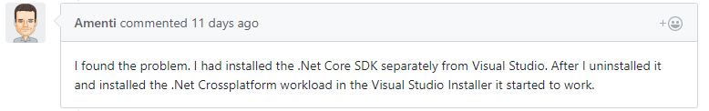
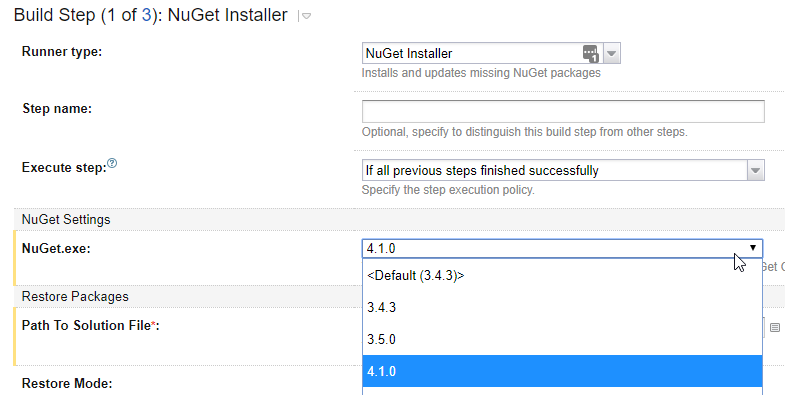
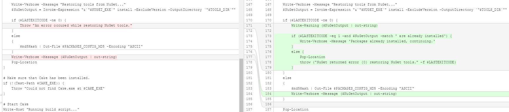

Recently I updated a UWP app to target [Windows 10 Fall Creators Update](https://blogs.windows.com/windowsexperience/2017/09/01/create-and-play-this-holiday-with-the-windows-10-fall-creators-update-coming-oct-17/) and [.NET Standard 2.0](https://blogs.msdn.microsoft.com/dotnet/2017/10/10/announcing-uwp-support-for-net-standard-2-0/). That enabled updating of several NuGet packages with a NET Standard 2.0 dependency. While there were some breaking changes with those updates, everything compiled and ran in Visual Studio without too much effort.

## The Build Server Says Your Tears Are Delicious

Next the app's [TeamCity](https://www.jetbrains.com/teamcity/) build agent had its OS upgraded to FCU and its Visual Studio 2017 install updated to 15.4. Once the build for the branch ran, I noticed many errors like below coming from the [Cake](https://cakebuild.net/) build step.

NU1201: Project {ProjectName} is not compatible with uap10.0.16299 (UAP,Version=v10.0.16299). 
  Project {ProjectName} supports: netstandard2.0 (.NETStandard,Version=v2.0)

## An MSBuild Problem?

At first I thought maybe Cake was picking up the wrong MSBuild version or otherwise calling it incorrectly since the solution built fine in VS both locally and on the build agent. After inspecting the build logs for the failed build versus the previous successful one, both appeared to be invoking MSBuild in the same way.

Executing: "C:/source/projectname/cake/tools/NuGet.exe" restore "C:/source/projectname/ProjectName.UWP.sln" -NonInteractive
MSBuild auto-detection: using msbuild version '15.4.8.50001' 
  from 'C:\\Program Files (x86)\\Microsoft Visual Studio\\2017\\Enterprise\\MSBuild\\15.0\\bin'.

## A Build Agent .NET Setup Issue?

A [UWP .NET Standard Issue](https://github.com/dotnet/standard/issues/462#issuecomment-336207924) suggested the problem might be having the .NET Core SDK installed separately from Visual Studio's .NET Cross platform workload. That didn't appear to be the problem in my case so I kept digging.

## A TeamCity NuGet Version Issue?

Further inspection of the build log showed that a NuGet restore was done just before the errors so the problem didn't seem to be MSBuild or Cake, but NuGet. Before the Cake script was called it invoked a NuGet restore step using version 4.1.0. In the [TeamCity Admin/NuGet section](https://confluence.jetbrains.com/display/TCD10/NuGet), 4.4 was installed and the build step was changed to use the latest version. The build still failed with the same error so **initially** I thought that didn't help.

  

## Debugging the Cake Script Locally

I remembered running the Cake script fine locally recently but it later dawned on me that was within a different story branch. Sure enough the Cake script failed locally in the same manner. Initially I tried `.\build.ps1 -Verbosity diagnostic > build_output.log` and explored Cake's [NuGetRestoreSettings](https://cakebuild.net/api/Cake.Common.Tools.NuGet.Restore/NuGetRestoreSettings/). However Cake was only providing a thin layer over Cake/tools/Nuget.exe so I cut out the middle man and reproduced the issue at the command line with `nuget restore ProjectName.sln`.

## A Packages.config / PackageReference Issue?

On the .NET Standard Github repo I found [Issues with .NET Standard 2.0 with .NET Framework & NuGet](https://github.com/dotnet/standard/issues/481). That led me down the workaround path of adding `<RestoreProjectStyle>PackageReference</RestoreProjectStyle>` to some project files and changing packages.config files from `<package id="package-id" version="package-version"/>` to `<PackageReference Include="package-id" Version="package-version" />`. Running `nuget restore` locally I was still seeing the same error though.

## Back to the NuGet Version

At this point I noticed Cake/tools/nuget.exe was version 4.3.0 even though version 4.4.0 was on [https://www.nuget.org/downloads](https://www.nuget.org/downloads). It appeared 4.4 was preview. Downloading it manually and replacing Cake/tools/nuget.exe with that version resolved the issue. However now I wondered if the previous workarounds were necessary. I stashed my changes in Git and reapplied the nuget.exe update and the problem was still fixed.

I couldn't tell how to instruct Cake to download a specific version of NuGet.exe itself for the restore (only tools and addons) so I reluctantly committed the binary as a temporary measure and adjusted .gitignore as follows.

\# Cake build
Cake/tools/\*
!Cake/tools/packages.config
!Cake/tools/nuget.exe
Cake/output

Looking back to the TeamCity build logs after updating TeamCity's NuGet version, I realized that the NuGet update did fix the NuGet install TeamCity build step originally. However, the Cake script itself (the 2nd build step) had a NuGet restore task that the Build task was dependent on so it failed with the same error and made it appear the upgrade didn't help. The TeamCity NuGet installer step was no longer needed so it was deleted, favoring having everything self contained in the Cake script.

## Oooh So Close, You Almost Had It

With NuGet restore working in isolation I assumed it would work when invoked from the Cake script. Well you know what they say about assuming, it only makes an ass out of you and me. Cake only responded with "An error occured while restoring NuGet tools." which told me little other than someone on the Cake team could use a spell checker.

In debugging I modified build.ps1 to write out the NuGet exit code as well as the output and found:

C:\\source\\projectname\\cake \[feature/Win10FallCreatorsUpdate ≡\]> .\\build.ps1 -Verbosity diagnostic
Preparing to run build script...
Feeds used:
  C:\\Users\\geoffh\\.nuget\\packages\\
  https://api.nuget.org/v3/index.json
  https://www.myget.org/F/msbuildsdkextras/api/v3/index.json
  C:\\Program Files (x86)\\Microsoft SDKs\\NuGetPackages\\

All packages listed in C:\\source\\projectname\\cake\\tools\\packages.config are already installed.
1
An error occured while restoring NuGet tools.
At C:\\source\\projectname\\cake\\build.ps1:173 char:9
+         Throw "An error occured while restoring NuGet tools."
+         ~~~~~~~~~~~~~~~~~~~~~~~~~~~~~~~~~~~~~~~~~~~~~~~~~~~~~
    + CategoryInfo          : OperationStopped: (An error occure...ng NuGet tools.:String) \[\], RuntimeException
    + FullyQualifiedErrorId : An error occured while restoring NuGet tools.

In this case the Cake NuGet tools were previously installed for me locally when I ran the build before. NuGet was returning a non-zero exit code indicating error to Cake at which point it gave up. Perhaps this behavior changed in NuGet 4.4 and the Cake build script needs to be adjusted to compensate. This isn't an error in my mind or hardly even a warning. It's not really a problem on the build server since each build is generally a fresh pull from source control. Since it can be a problem for local builds, I made the following temporary change to build.ps1 to allow this situation to continue execution.

 
