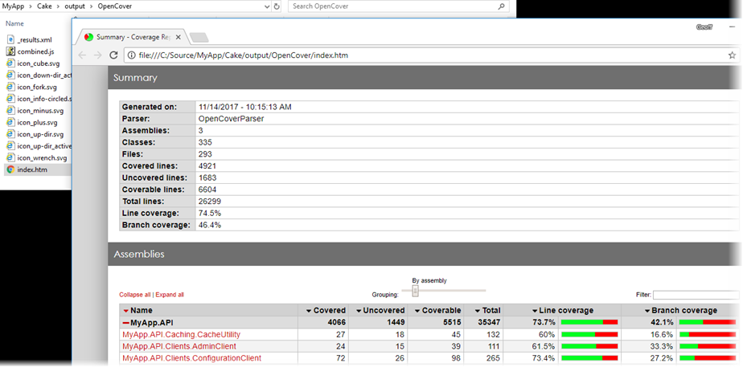
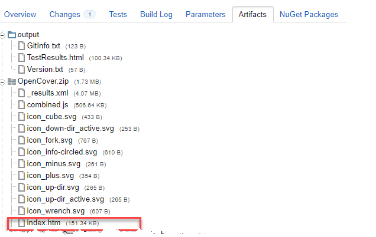
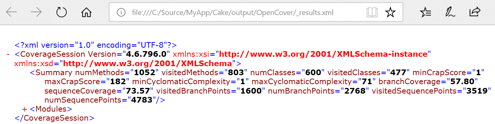
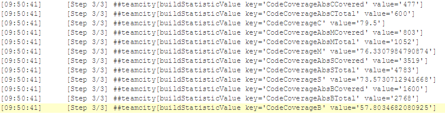

Recently I was tasked with getting some code coverage results into our [TeamCity](https://www.jetbrains.com/teamcity/) builds that run our [Cake](https://cakebuild.net/) build script. There was previous investment in [OpenCover](https://github.com/OpenCover/opencover) for varying reasons, so despite it getting a bit stale, that was an initial constraint. There were some surprises along the way so I thought I'd pass along the knowledge sharing here. Even if you don't use one or more of these tools like OpenCover, there might be a useful nugget of info here and there, including nuggets of NuGet which often gives me grief.

## Running xUnit Tests with OpenCover from Cake Locally

First off, a Cake task to run the coverage that configures OpenCover and [XUnit](https://xunit.github.io/), runs the tests, and sends the raw results to Report Generator.

\[csharp\] #tool "nuget:?package=OpenCover" #tool "nuget:?package=xunit.runner.console" #tool "nuget:?package=ReportGenerator"

const string TEST\_DLL\_FORMAT = "../MyApp.Tests.{0}/bin/{1}/MyApp.Tests.{0}.dll"; const string OUTPUT\_DIR = "output";

Task("all-tests-coverage") .IsDependentOn("build") .Does(() => { string\[\] dlls = { string.Format(TEST\_DLL\_FORMAT, "Integration", \_buildConfiguration), string.Format(TEST\_DLL\_FORMAT, "Unit", \_buildConfiguration) };

var coverSettings = new OpenCoverSettings() .WithFilter("+\[MyApp.\*\]\*") .WithFilter("-\[MyApp.Tests.\*\]\*"); coverSettings.SkipAutoProps = true; coverSettings.Register = "user"; coverSettings.MergeByHash = true; coverSettings.NoDefaultFilters = true;

var unitSettings = new XUnit2Settings { ShadowCopy = false, HtmlReport = true, OutputDirectory = $"./{OUTPUT\_DIR}",

// Shows progress text as each test is executing ArgumentCustomization = args => args.Append("-verbose") };

var openCoverDir = $"./{OUTPUT\_DIR}/OpenCover"; EnsureDirectoryExists(openCoverDir);

var resultsFilePath = new FilePath($"{openCoverDir}/\_results.xml"); OpenCover(tool => { tool.XUnit2(dlls, unitSettings); }, resultsFilePath, coverSettings);

ReportGenerator(resultsFilePath, openCoverDir); }); \[/csharp\]

- For [OpenCoverSettings](https://cakebuild.net/api/Cake.Common.Tools.OpenCover/OpenCoverSettings/), I found the Filter and Register parameters to be the most important parts of the [OpenCover usage](https://github.com/opencover/opencover/wiki/Usage).
- For [XUnit2Settings](https://cakebuild.net/api/Cake.Common.Tools.XUnit/XUnit2Settings/), I didn't find a Verbose property to match up to what XUnit offered but found the base [ToolSettings](https://cakebuild.net/api/Cake.Core.Tooling/ToolSettings/) class allowed for "manually" appending other parameters via ArgumentCustomization. Since there can be many tests that may take a while to execute, it's handy to know what tests are executing when watching the build.

Since I was already using [Visual Studio Code](https://code.visualstudio.com/) and the [Cake extension](https://marketplace.visualstudio.com/items?itemName=cake-build.cake-vscode) for editing, I invoked this Cake task as below from its [Integrated Terminal](https://code.visualstudio.com/docs/editor/integrated-terminal).

\[powershell\] cd Cake .\\build.ps1 -Target all-tests-coverage \[/powershell\]

Opening Cake/output/index.htm that [ReportGenerator](https://github.com/danielpalme/ReportGenerator) produced provided a friendly way to verify the coverage data.

  

## OpenCover Artifacts in TeamCity

Once the coverage looked good running locally, it was time to modify the TeamCity build configuration so that the artifacts path (General tab) included Cake/output/OpenCover. Redirecting it to a zip file was advisable given the output can easily be several MBs, mostly from the large coverage results XML file.

After running the TeamCity build, the decompression of the zip file when expanding the artifacts was nearly transparent and pretty quick - just a slight loading delay on the initial hit. When opening the coverage report through the artifacts zip it displays and functions just as it does unzipped locally.

## Sending Coverage Metrics to TeamCity

It's nice to compliment the raw coverage artifacts with coverage metrics that TeamCity can incorporate into the build dashboard, showing trends and allowing for optionally failing the build depending on the metric changes.

[TeamCity doesn't officially support OpenCover](https://teamcity-support.jetbrains.com/hc/en-us/community/posts/206179819-Teamcity-opencover-integration*) as it does for dotcover, partcover, ncover and ncover3. While there was an older, [non-official OpenCover plugin](https://github.com/mindriven/TeamCity-OpenCoverRunner) available, I didn't have complete access to this build server and preferred to avoid the plugin route. It seemed easy enough to [manually report coverage](http://confluence.jetbrains.com/display/TCD10/Manually+Configuring+Reporting+Coverage) so I went that direction.

Most of the useful summary data can be found in the CoverageSession/Summary tag in the results XML file generated by OpenCover.

With that in mind, the coverage task was modified to pass in the results XML filename to a new method for parsing and reporting to TeamCity.

\[csharp highlight="12"\] Task("all-tests-coverage") .IsDependentOn("build") .Does(() => { // ...

var resultsFilePath = new FilePath($"{openCoverDir}/\_results.xml"); OpenCover(tool => { tool.XUnit2(dlls, unitSettings); }, resultsFilePath, coverSettings);

ReportGenerator(resultsFilePath, openCoverDir);

ReportCoverageMetrics(resultsFilePath.FullPath); }); \[/csharp\]

TeamCity needed service messages written to the build output in the following format to be made aware of the coverage metrics.

##teamcity\[buildStatisticValue key='{key}' value='{value}'\]

The relevant code coverage keys along with their descriptions are listed in [Default Statistics Values Provided by TeamCity](http://confluence.jetbrains.com/display/TCD8/Custom+Chart#CustomChart-DefaultStatisticsValuesProvidedbyTeamCity).

Each metric of current interest has a visited value, a total number value, and a corresponding coverage percentage value. The following loads the coverage XML file. It calls a method to report each metric, passing the summary node data along with a mapping of the OpenCover attribute names to the corresponding TeamCity statistic keys.

\[csharp\] private void ReportCoverageMetrics(string openCoverResultsXmlFile) { XDocument doc = XDocument.Load(openCoverResultsXmlFile); XElement summary = doc.XPathSelectElement("/CoverageSession/Summary");

// Classes. ReportCoverageMetric(summary, "visitedClasses", "CodeCoverageAbsCCovered", "numClasses", "CodeCoverageAbsCTotal", "CodeCoverageC");

// Methods. ReportCoverageMetric(summary, "visitedMethods", "CodeCoverageAbsMCovered", "numMethods", "CodeCoverageAbsMTotal", "CodeCoverageM");

// Sequence points / statements. ReportCoverageMetric(summary, "visitedSequencePoints", "CodeCoverageAbsSCovered", "numSequencePoints", "CodeCoverageAbsSTotal", "CodeCoverageS");

// Branches. ReportCoverageMetric(summary, "visitedBranchPoints", "CodeCoverageAbsBCovered", "numBranchPoints", "CodeCoverageAbsBTotal", "CodeCoverageB"); } \[/csharp\]

The method for reporting a specific metric simply grabs the attribute values from the XML node, calculates the percentage, and uses [Cake's logging DSL](https://cakebuild.net/dsl/logging/) to write informational output in [TeamCity's service message format](https://confluence.jetbrains.com/display/TCD10/Build+Script+Interaction+with+TeamCity).

\[csharp\] private void ReportCoverageMetric( XElement summary, string ocVisitedAttr, string tcVisitedKey, string ocTotalAttr, string tcTotalKey, string tcCoverageKey) { double visited = Convert.ToDouble(summary.Attribute(ocVisitedAttr).Value); double total = Convert.ToDouble(summary.Attribute(ocTotalAttr).Value); double coverage = (visited / total) \* 100;

Information($"##teamcity\[buildStatisticValue key='{tcVisitedKey}' value='{visited}'\]"); Information($"##teamcity\[buildStatisticValue key='{tcTotalKey}' value='{total}'\]"); Information($"##teamcity\[buildStatisticValue key='{tcCoverageKey}' value='{coverage}'\]"); } \[/csharp\]

Afterwards the build log will have output like below.

When viewed in TeamCity's build overview tab the metrics look something like this.

## OpenCover's .NET Standard Support is in Preview

Some .NET Standard libraries are a part of this app and it was evident that there was some missing coverage data. An [OpenCover .NET Standard issue](https://github.com/OpenCover/opencover/issues/721) indicated .NET Standard support was not yet there on NuGet (preview or otherwise) and only on [AppVeyor](https://ci.appveyor.com/project/sawilde/opencover/build/artifacts). In the interim I decided to download the prerelease NuGet package from AppVeyor and bundle it in a Tools/LocalPackages folder within the app.

## Installing a Local NuGet Package From Cake

It seemed clear to me that I couldn't use `#tool` with OpenCover anymore since the preview version I needed wasn't on NuGet so I removed that. So now the question was how to install the local .nupkg file within the Cake script.

### The Hard Way - Cake's NuGetInstall

First I tried [Cake's NuGetInstall](https://cakebuild.net/api/Cake.Common.Tools.NuGet/NuGetAliases/343A93DB), something like the below, which I called shortly after the `#tool` and `#addin` sections.

\[csharp\] InstallOpenCoverFromLocalPackage();

private void InstallOpenCoverFromLocalPackage() { // const string source = @"..\\Tools\\LocalPackages\\"; var source = MakeAbsolute(Directory(@"..\\Tools\\LocalPackages\\")).FullPath; var settings = new NuGetInstallSettings { Source = new\[\] { source }, OutputDirectory = "tools" }

Information($"Installing OpenCover from {source} to {settings.OutputDirectory}"); NuGetInstall("OpenCover", settings); } \[/csharp\]

Running that gave me:

Installing OpenCover from C:/source/MyApp/Tools/LocalPackages to tools
Feeds used:
    C:/source/MyApp/Tools/LocalPackages

Installing package 'OpenCover' to 'C:/source/MyApp/cake/tools'.
Unable to find package 'OpenCover'
Error: One or more errors occurred.
        NuGet: Process returned an error (exit code 1).

### The Hard Way - Direct NuGet.exe

First, a bit more direct to NuGet.exe (v 4.4.0-preview3) but through [Cake's StartProcess](https://cakebuild.net/api/Cake.Common/ProcessAliases/81E648CC).

\[csharp\] private void InstallOpenCoverFromLocalPackage() { // const string source = @"..\\Tools\\LocalPackages\\"; var source = MakeAbsolute(Directory(@"..\\Tools\\LocalPackages\\")).FullPath; var settings = new ProcessSettings { Arguments = new ProcessArgumentBuilder() .Append("install OpenCover") .AppendSwitchQuoted("-Source", source) .AppendSwitchQuoted("-OutputDirectory", "tools") };

Information($"Installing OpenCover using: nuget.exe {settings.Arguments.Render()}"); StartProcess("tools/nuget.exe", settings); } \[/csharp\]

Perhaps not surprisingly, the same error.

Installing OpenCover using: nuget.exe install OpenCover -Source "C:/source/MyApp/Tools/LocalPackages" -OutputDirectory "tools"
Feeds used:
    C:/source/MyApp/Tools/LocalPackages

Installing package 'OpenCover' to 'tools'.
Unable to find package 'OpenCover'

I also tried just running NuGet.exe directly in any command prompt with different variations and it was the same error. There was some mention of monkeying with NuGet.config on [this StackOverflow post](https://stackoverflow.com/questions/10240029/how-to-install-a-nuget-package-nupkg-file-locally) but I didn't want to go down that route. I was also over NuGet.exe at this point.

### The Hard Way - Install-Package

Using [Install-Package](https://docs.microsoft.com/en-us/powershell/module/packagemanagement/install-package?view=powershell-5.1) in [Windows Package Management](https://blogs.technet.microsoft.com/packagemanagement/2015/04/28/introducing-packagemanagement-in-windows-10/) is NuGet.exe free and worked fine when running something like the below in a PS console.

\[powershell\] Install-Package OpenCover -Source "$PSScriptRoot\\LocalPackages\\" -Destination "$PSScriptRoot..\\packages" -Force -Verbose \[/powershell\]

Running the same command but from Cake using the [Cake.PowerShell addin](https://github.com/SharpeRAD/Cake.Powershell) worked fine as well.

\[csharp\] #addin "Cake.Powershell"

// #tool "nuget:?package=OpenCover" InstallOpenCoverFromLocalPackage();

private void InstallOpenCoverFromLocalPackage() { var sourcePath = MakeAbsolute(Directory(@"..\\Tools\\LocalPackages\\")).FullPath; var destPath = MakeAbsolute(Directory("tools")).FullPath; Information($"Installing OpenCover from {sourcePath} to {destPath}");

StartPowershellScript("Install-Package", new PowershellSettings() .SetFormatOutput() .SetLogOutput() .WithArguments(args => { args.Append("OpenCover"); args.AppendQuoted("Source", sourcePath); args.AppendQuoted("Destination", destPath); args.Append("-Force"); args.Append("-Verbose"); })); } \[/csharp\]

Great, commit and push it. Done. But wait, such changes often don't work the first time on the build server and sure enough...

Cake build (Powershell) (45s)
Error: One or more errors occurred.
 	Failed to Execute Powershell Script: System.Management.Automation.CmdletInvocationException: The handle is invalid.
  ---> System.IO.IOException: The handle is invalid.
 
    at System.IO.\_\_Error.WinIOError(Int32 errorCode, String maybeFullPath)
    at System.Console.GetBufferInfo(Boolean throwOnNoConsole, Boolean& succeeded)
    at Cake.Powershell.CakePSHostRawUserInterface.get\_BufferSize()
    at Microsoft.PowerShell.Commands.Internal.Format.ConsoleLineOutput.get\_ColumnNumber()
    at Microsoft.PowerShell.Commands.Internal.Format.OutCommandInner.ProcessOutOfBandPayload(FormatEntryData fed)
    at Microsoft.PowerShell.Commands.Internal.Format.OutCommandInner.ProcessPayload(FormatEntryData fed, OutputContext c)
    at Microsoft.PowerShell.Commands.Internal.Format.OutCommandInner.ProcessObject(PSObject so)
    at Microsoft.PowerShell.Commands.Internal.Format.OutCommandInner.ProcessRecord()
    at System.Management.Automation.CommandProcessor.ProcessRecord()
    --- End of inner exception stack trace ---
    at System.Runtime.ExceptionServices.ExceptionDispatchInfo.Throw()
    at System.Management.Automation.Internal.PipelineProcessor.Step(Object input)
    at Microsoft.PowerShell.Commands.Internal.Format.OutputManagerInner.ProcessRecord()
    at Microsoft.PowerShell.Commands.OutDefaultCommand.ProcessRecord()
    at System.Management.Automation.CommandProcessor.ProcessRecord()
 --- End of stack trace from previous location where exception was thrown ---
    at System.Runtime.ExceptionServices.ExceptionDispatchInfo.Throw()
    at System.Management.Automation.Internal.PipelineProcessor.SynchronousExecuteEnumerate(Object input)
    at System.Management.Automation.Runspaces.LocalPipeline.InvokeHelper()
    at System.Management.Automation.Runspaces.LocalPipeline.InvokeThreadProc()
Step Cake build (Powershell) failed

Okay, OutputToAppConsole has to be explicitly set to false when running non-interactively.

\[csharp highlight="5"\] StartPowershellScript("Install-Package", new PowershellSettings { // Required for build server: OutputToAppConsole = false } .SetFormatOutput() .SetLogOutput() .WithArguments(args => { args.Append("OpenCover"); args.AppendQuoted("Source", sourcePath); args.AppendQuoted("Destination", destPath); args.Append("-Force"); args.Append("-Verbose"); })); \[/csharp\]

Cool, that should do it. Run the TeamCity build again...

Cake build (Powershell) (4m:01s)
Install-Package : Unable to find package source 'C:\\BuildAgent\\work\\a92646c79afd73e7\\Tools\\LocalPackages'. Use Get-PackageSource to see all available package sources.
At line:1 char:1
+ Install-Package OpenCover -Source "C:/BuildAgent/work/a92646c79afd73e ...
+ ~~~~~~~~~~~~~~~~~~~~~~~~~~~~~~~~~~~~~~~~~~~~~~~~~~~~~~~~~~~~~~~~~~~~~
     + CategoryInfo          : ObjectNotFound: (Microsoft.Power....InstallPackage:InstallPackage) \[Install-Package\], Exception
     + FullyQualifiedErrorId : SourceNotFound,Microsoft.PowerShell.PackageManagement.Cmdlets.InstallPackage

An error occurred when executing task 'all-tests-coverage'.
 Error: One or more errors occurred.
	OpenCover: Could not locate executable.
Step Cake build (Powershell) failed

Dammit man, why does the build agent hate me so? The build agent is also Windows 10 like my desktop and it had the same version of Package Management. What gives? It dawned on me after asking the below to be run on the client's build agent.

\[powershell\] PS C:\\BuildAgent\\work\\a92646c79afd73e7\\packages> find-packageprovider -name nuget The provider 'nuget v2.8.5.208' is not installed. nuget may be manually downloaded from https://oneget.org/Microsoft.PackageManagement.NuGetProvider-2.8.5.208.dll and installed. Would you like PackageManagement to automatically download and install 'nuget' now? \[Y\] Yes \[N\] No \[S\] Suspend \[?\] Help (default is "Y"): \[/powershell\]

This rang a bell now. I forgot I received the same before with my [PowerShellGet work](https://geoffhudik.com/tech/2017/08/02/powershellget/) and had to manually install the NuGet provider. Why that's not out of the box like that I can't fathom. Initially I started to ask this be run for me on the agent (which I didn't have direct access to) but decided it was more self contained and self documenting to have a prebuild TeamCity step that ran the below PowerShell.

\[powershell\] Install-PackageProvider -Name NuGet -Scope CurrentUser -Force \[/powershell\]

Technically that only needed to be run once but if already there it doesn't hurt and it's quick and covers it on a different future build agent or changes to the current one.

### The Really Easy Way I Wish I Knew Upfront

\[csharp\] #tool "nuget:..\\Tools\\LocalPackages?package=OpenCover" \[/csharp\]

Yup that's it, one line of code. I had no idea `#tool` supported local and UNC paths and don't recall seeing that on the [documentation](https://www.cakebuild.net/docs/fundamentals/preprocessor-directives). I found out that handy tip asking in [Cake's Gitter chat](https://gitter.im/cake-build/cake), only I received the response after all the above. In any event thanks to the cool Cake contributors for [building a great product](https://github.com/cake-build/cake) and being helpful with support.

## Parting Tips

- Ensure full debug PDBs of app binaries are there for OpenCover for correct coverage.
- Recommend [Pinning Cake addin and tool versions](https://cakebuild.net/docs/tutorials/pinning-cake-version). Not specifying version means the latest which means each build you're taking a gamble on Cake script breaking changes as new versions come out.
