\[toc wrapping="right"\]

Lately I've been exploring and learning Azure on the side when I can find the time. Most recently I've been looking at automating the provisioning of Azure resources with ARM ([Azure Resource Manager](https://docs.microsoft.com/en-us/azure/azure-resource-manager/resource-group-overview)) templates.

Initial goals included:

- Setup all Azure Resources outside of the Portal
- Setup an [App Service plan](https://docs.microsoft.com/en-us/azure/app-service/azure-web-sites-web-hosting-plans-in-depth-overview) (hosting)
- Setup [App Insights](https://azure.microsoft.com/en-us/services/application-insights/) because it's cool and dare I say, insightful :)
- Setup a [Web app](https://azure.microsoft.com/en-us/services/app-service/web/)
- Have the web app content pulled from GitHub on each push
- Have the web app built and deployed with as little work as possible
- Using and learning ARM templates
- Exploring different ways to deploy ARM templates, interact with Azure
- Getting a little more familiar with ASP.NET Core

I underestimated the time and trouble here so I tried to capture some of the details along the way for later reference. What follows is a step by step of creating a new ASP.NET Core website from scratch and getting it setup on Azure in an automated fashion.

## Prerequisites

This post will make use of the following.

- [Node.js](https://nodejs.org/) for [NPM](https://www.npmjs.com/)
- [Visual Studio Code](https://code.visualstudio.com/)
- [Azure Resource Manager Tools VS Code Extension](https://marketplace.visualstudio.com/items?itemName=msazurermtools.azurerm-vscode-tools)
- [Azure PowerShell cmdlets](https://docs.microsoft.com/en-us/powershell/azure/overview?view=azurermps-5.0.0)
- [Azure CLI 2.0](https://docs.microsoft.com/en-us/cli/azure/install-azure-cli?view=azure-cli-latest)
- [Github](https://github.com/) account
- [Azure](https://portal.azure.com/#) account
- [.NET Core Runtime 2.x](https://go.microsoft.com/fwlink/?linkid=849150)

## Creating the Initial Website Locally

While I somewhat prefer the older [Yeoman generator for ASP.NET Core projects](https://github.com/OmniSharp/generator-aspnet) to generate the initial app content, I thought I would give the [.NET Core CLI tools](https://docs.microsoft.com/en-us/dotnet/core/tools/?tabs=netcore2x) a chance after reading through [this thread](https://github.com/dotnet/cli/issues/2052#issuecomment-207031714).

First I ran `dotnet new --help` to see the syntax and options.

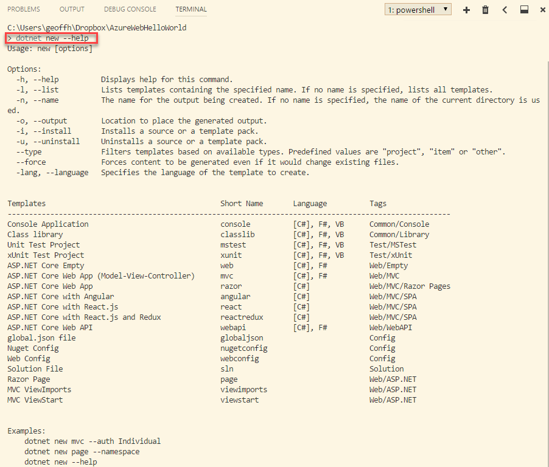

My focus here was on deployment with Azure so the specific project type was not that important. I decided I'd try Angular since all new web apps these days must be client side SPAs because {{ hipster\_reasons }}, JavaScript.

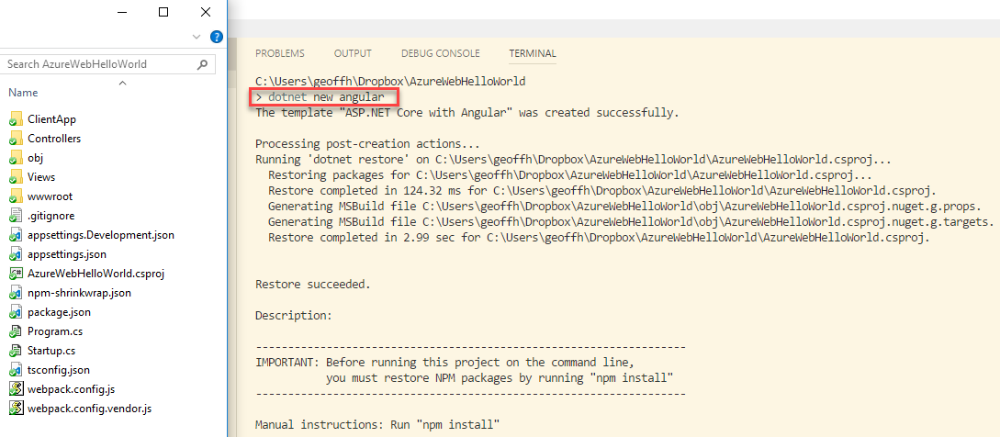

Next I installed the dependencies with `npm install` and grabbed a coffee while waiting on the 124 MB of 13k+ files and 1600+ folders.

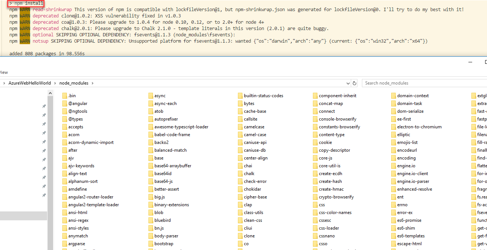

<blockquote class="twitter-tweet" data-lang="en">
1/3 of US bandwidth is used by Netflix...  the rest is used by `rm -rf node_modules &amp;&amp; npm install`
— I Am Devloper (@iamdevloper) <a href="https://twitter.com/iamdevloper/status/908335750797766656?ref_src=twsrc%5Etfw">September 14, 2017</a></blockquote>

Then it was time to spin up the web app with `dotnet run`...

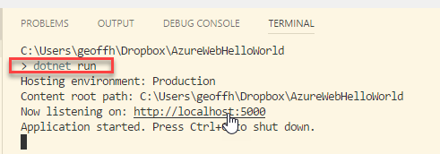

...and browse it locally.

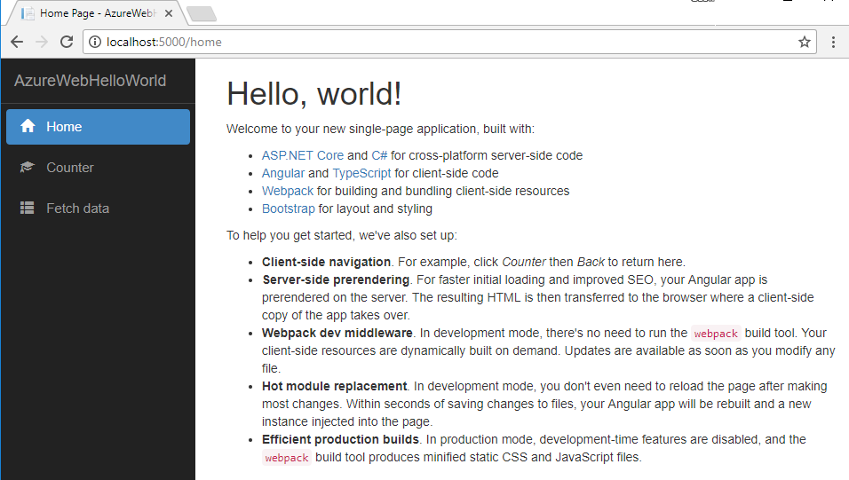

## Local Git Setup

Next I created a local git repository with `git init` and checked details with `git status`. It was nice to see that things were already good to go since it appeared `dotnet new` had already created an appropriate .gitignore file.

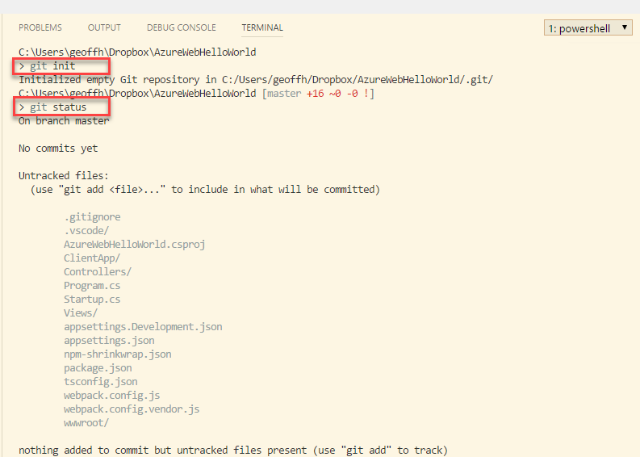

Then it was time for the initial add and commit.

## GitHub Setup

With the local git repo ready it was time to prepare the remote by creating a new GitHub repository...

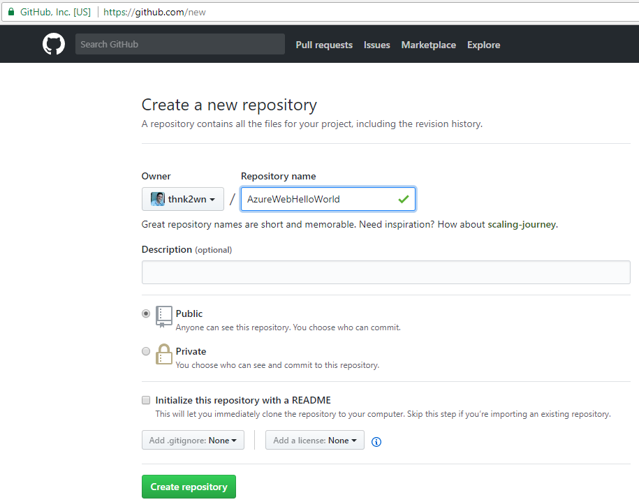

... and grabbing the repo URL.

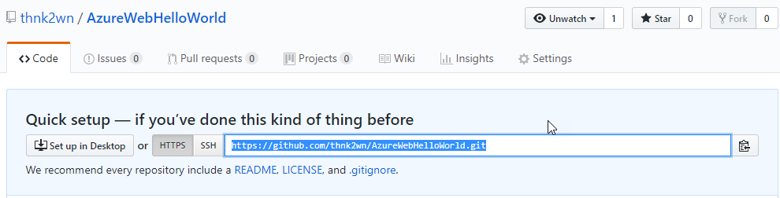

All that's left is adding the remote repo url and pushing the changes.

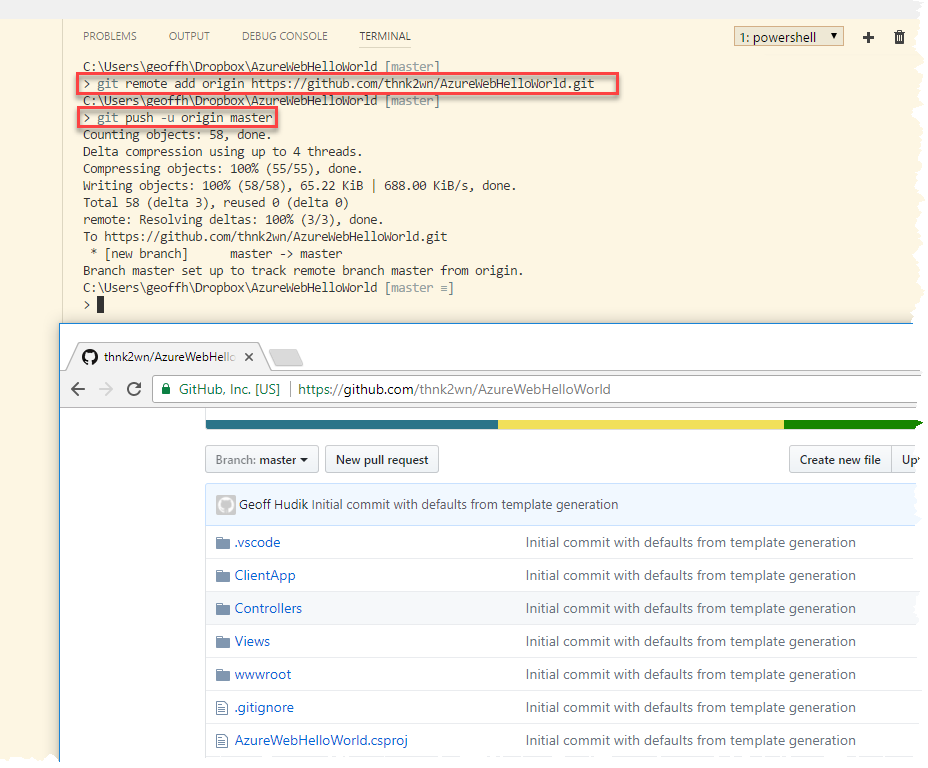

## Authorizing Azure to Access GitHub

Azure needs permission to access the GitHub account to pull the web app's source code and setup a webhook to be notified when commits are pushed. If this isn't set there'll be an error on deployment similar to "Repository 'UpdateSiteSourceControl' operation failed with Microsoft.Web.Hosting.SourceControls.OAuthException: GitHub GetRepository: Bad credentials". There are at least a couple ways to take care of this mostly one-time setup.

One option is navigating to an existing web app in Azure (or creating a temporary one) and opening the Deployment Options blade. From there, GitHub can be chosen as the Source and clicking the Authorize button will handle the OAuth step with GitHub. There's no need to pick a repo or finish the deployment option as the token is already set.

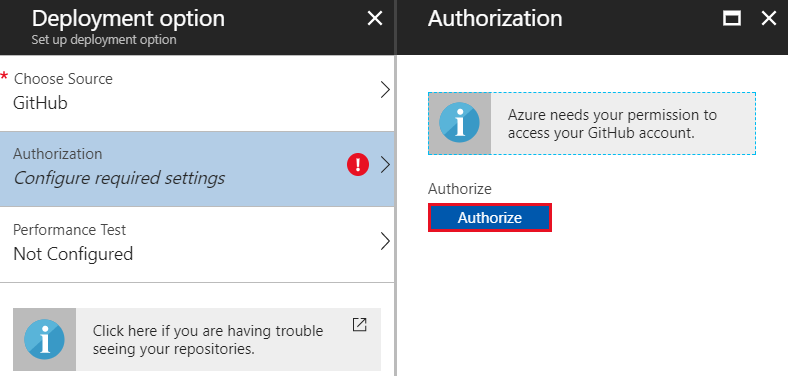

Another option is navigating to [GitHub's Personal Access Tokens page](https://github.com/settings/tokens) under _Settings\\Developer Settings_ and click _Generate new token_. Once the permissions are set and the token is generated it can be copied for use in Azure. On [resources.azure.com](https://resources.azure.com) under [Providers/Microsoft.Web/sourcecontrols/GitHub](https://resources.azure.com/providers/Microsoft.Web/sourcecontrols/GitHub) the _Edit_ button can be clicked and the token pasted in and the data saved by executing the _Put_ command.

## ARM Template

### Why ARM Templates

Initially I didn't like the idea of using an ARM template. It was another schema and syntax to learn, it wasn't as directly executable as a script, and it felt like giving up some control in ways. However, it was a win that the template was declarative in nature with desired end state configuration in mind, as opposed to having to explicitly script/set every step required to reach that state. The template was also arguably more maintainable than coding Azure provisioning and it may open up editing of that provisioning to non-coders.

### Starting the Template, Reference Material and Tools

I ultimately decided to create the ARM template from scratch. This helped ensure that (a) I really learned it and (b) the template had only what was truly needed. Even though I didn't start from a larger template or existing example, there were certainly sources that were useful for reference and copying small bits of configuration from.

Visual Studio - The [Azure Resource Group Project](https://docs.microsoft.com/en-us/azure/azure-resource-manager/vs-azure-tools-resource-groups-deployment-projects-create-deploy) with the Web App template could have been a decent starting place with some reasonable defaults. Still, it's some 300 lines of JSON and more than I wanted initially. Also I've been splitting time between PC and Mac and getting used to how light and responsive VS Code is. However, starting an ARM template in Visual Studio and switching to Code is an option.

ARM Template Samples - I found the [Azure Quick Start Templates GitHub](https://github.com/Azure/azure-quickstart-templates) to be great resource though it can be a bit overwhelming and perhaps tough to navigate. There were some smaller [Azure Websites ARM template samples](https://github.com/davidebbo/AzureWebsitesSamples/tree/master/ARMTemplates) on GitHub I found useful as well.

Azure Automation Script - This was useful as an interactive playground so to speak - tweaking resource settings in the Azure Portal then checking the Automation Script to see how those changes would be scripted (and maybe copying small bits). It's a bit of a hot mess for direct use as-is though, even as a starting point. For one, it includes a ton of cruft that's just not needed and things may not be named or organized well in the large auto generated script. The other problem is the script includes the entire resource group, even when just one resource like a web app is selected. Finally some resource types can't be scripted and some output can actually be invalid.

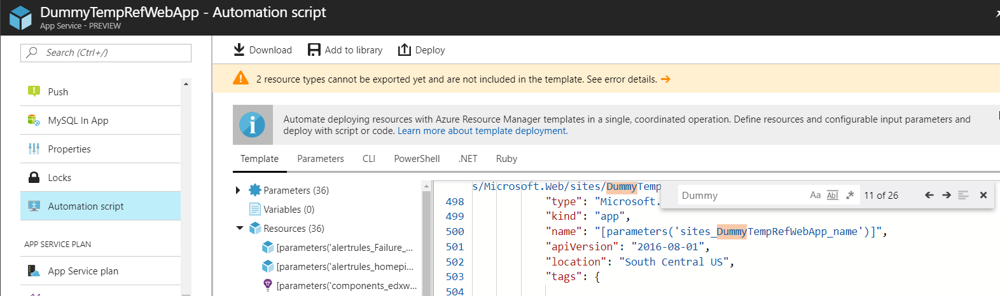

VS Code ARM Extension - The [Azure Resource Manager Tools VS Code Extension](https://marketplace.visualstudio.com/items?itemName=msazurermtools.azurerm-vscode-tools) provided intellisense, validation, and other features which helped in the editing. Some warnings/errors were invalid but overall it was a nice assist.

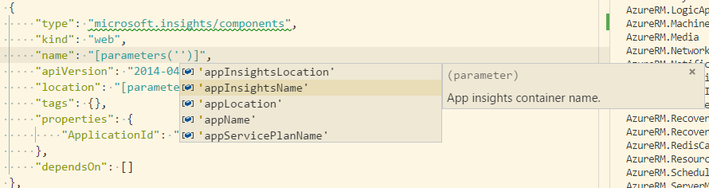

docs.microsoft.com - For example, [Understand the structure and syntax of Azure Resource Manager templates](https://docs.microsoft.com/en-us/azure/azure-resource-manager/resource-group-authoring-templates) and related doc pages may be useful for reference.

I started out with this template skeleton which has the below top level elements. I actually started off without the variables and outputs sections and later refactored the template to use those.

\[javascript\] { "$schema": "http://schema.management.azure.com/schemas/2015-01-01/deploymentTemplate.json", "contentVersion": "1.0.0.0", "parameters": { }, "variables": { }, "resources": \[ \], "outputs": { } } \[/javascript\]

### Parameters Section

The parameters section defines parameters that will be specified either in a parameters json file when running the script or at the command line when running the script. Several parameters have default values to be used when not set in the parameters file.

\[javascript\] "parameters": { "appName": { "type": "string", "metadata": { "description": "The name of the web app that you wish to create." } }, "appServicePlanName": { "type": "string", "defaultValue": "\[concat(parameters('appName'), 'Hosting')\]", "metadata": { "description": "The name of the App Service plan to use for hosting the web app." } }, "appInsightsName": { "type": "string", "defaultValue": "\[concat(parameters('appName'), 'Insights')\]", "metadata": { "description": "App insights container name." } }, "appInsightsLocation": { "type": "string", "defaultValue": "South Central US", "metadata": { "description": "Region where app insights services reside. Not available in every region." } }, "appRepoUrl": { "type": "string", "defaultValue": "https://github.com/thnk2wn/AzureWebHelloWorld.git", "metadata": { "description": "Remote Git repo url" } }, "appRepoBranch": { "type": "string", "defaultValue": "master", "metadata": { "description": "Remote Git repo branch" } }, "environment": { "type": "string", "metadata": { "description": "Environment name" } } }, \[/javascript\]

Note the use of the [concat function](https://docs.microsoft.com/en-us/azure/azure-resource-manager/resource-group-template-functions-string#concat) to combine parameter names with constant string values. A [variety of other functions are available](https://docs.microsoft.com/en-us/azure/azure-resource-manager/resource-group-template-functions). It's also worth noting that you can reference a parameter value inside another parameter - `appServicePlanName` and `appInsightsName` in the above example.

Also note there's a separate location for App Insights which isn't supported in every location. Initially I was using the same location of West US for both the web app and insights and when I deployed the template I received an error "The subscription is not registered for the resource type 'components' in the location 'West US'. Please re-register for this provider in order to have access to this location." When creating an app insights instance in the portal (i.e. when creating a new web app) you can see the supported locations.

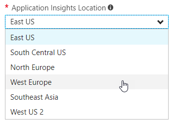

I also originally had an appLocation parameter until I later realized I could use `[resourceGroup().location]` in the resources that follow. That will use the location specified later when invoking a deployment of the template. Basically the resource group will be initialized just before the template is used to deploy/configure the group and its resources.

### Variables Section

After I found myself repeating certain function calls in multiple locations within the template, I researched the variables section where certain calls can be done in one spot and assigned to a variable to be reused in other spots in the template.

\[javascript\] "variables": { "appServicePlanResourceId": "\[resourceId('Microsoft.Web/serverFarms',parameters('appServicePlanName'))\]", "webAppResourceId": "\[resourceId('Microsoft.Web/Sites', parameters('appName'))\]", "appInsightsResourceId": "\[resourceId('microsoft.insights/components/', parameters('appInsightsName'))\]" }, \[/javascript\]

### Resources - App Service (Hosting) Plan

First up in the resources section was an entry to setup the app service plan with hosting info for the web app.

\[javascript\] { "type": "Microsoft.Web/serverfarms", "sku": { "name": "S1", "tier": "Standard", "size": "S1", "family": "S", "capacity": 1 }, "kind": "app", "name": "\[parameters('appServicePlanName')\]", "apiVersion": "2016-09-01", "location": "\[resourceGroup().location\]", "scale": null, "properties": { "name": "\[parameters('appServicePlanName')\]", "workerTierName": null, "adminSiteName": null, "hostingEnvironmentProfile": null, "perSiteScaling": false, "reserved": false, "targetWorkerCount": 0, "targetWorkerSizeId": 0 }, "tags": { "environment": "\[parameters('environment')\]" }, "dependsOn": \[\] } \[/javascript\]

### Resources - App Insights

For app insights, only the bare minimum information is set though for real world apps it would likely have alert rules and other configuration setup.

\[javascript\] { "type": "microsoft.insights/components", "kind": "web", "name": "\[parameters('appInsightsName')\]", "apiVersion": "2014-04-01", "location": "\[parameters('appInsightsLocation')\]", "properties": { "ApplicationId": "\[parameters('appInsightsName')\]" }, "tags": { "environment": "\[parameters('environment')\]", "\[concat('hidden-link:', resourceGroup().id, '/providers/Microsoft.Web/sites/', parameters('appName'))\]": "Resource", "displayName": "AppInsightsComponent" }, "dependsOn": \[\] } \[/javascript\]

Note the `hidden-link` to the web app resource in the `tags` section. This wasn't obvious and wasn't something I initially had. After deploying and going to the App Insights blade of the web app, it was clear that App Insights was not linked to the website. I found this by viewing the Automation Script of another resource group that had a web app with App Insights - one configured via the Portal.

### Resources - Web Site

Note that the website resource contains it own resources section, defining a resource for app settings, source control, etc.

\[javascript\] { "apiVersion": "2015-08-01", "name": "\[parameters('appName')\]", "type": "Microsoft.Web/sites", "location": "\[resourceGroup().location\]", "properties": { "name": "\[parameters('appName')\]", "serverFarmId": "\[variables('appServicePlanResourceId')\]", "hostingEnvironmentProfile": null }, "tags": { "environment": "\[parameters('environment')\]" }, "dependsOn": \[ "\[variables('appServicePlanResourceId')\]", "\[variables('appInsightsResourceId')\]" \], "resources": \[ { "apiVersion": "2015-08-01", "name": "appsettings", "type": "config", "dependsOn": \[ "\[variables('webAppResourceId')\]", "Microsoft.ApplicationInsights.AzureWebSites" \], "properties": { "APPINSIGHTS\_INSTRUMENTATIONKEY": "\[reference(variables('appInsightsResourceId')).InstrumentationKey\]", "WEBSITE\_NODE\_DEFAULT\_VERSION": "8.9.0", "EnvironmentName": "\[parameters('environment')\]" } }, { "apiVersion": "2015-08-01", "name": "web", "type": "sourcecontrols", "dependsOn": \[ "\[variables('webAppResourceId')\]" \], "properties": { "RepoUrl": "\[parameters('appRepoUrl')\]", "branch": "\[parameters('appRepoBranch')\]", "isManualIntegration": false } }, { "apiVersion": "2014-04-01", "name": "Microsoft.ApplicationInsights.AzureWebSites", "type": "siteextensions", "dependsOn": \[ "\[variables('webAppResourceId')\]", "\[resourceId('Microsoft.Web/sites/sourcecontrols', parameters('appName'), 'web')\]" \], "properties": { } } \] } \[/javascript\]

Notes:

Site Extensions - The resource type `siteextensions` was another non-obvious need for App Insights that I only realized after accessing App Insights for the web app. Looking at the Automation Script after configuring App Insights in the Portal was helpful here as well.

App Insights Instrumentation Key - The web app settings `APPINSIGHTS_INSTRUMENTATIONKEY` needed to be set for App Insights, and the resource type `config` (named `appsettings`) needed to be dependent on the resource type `siteextensions` (named `Microsoft.ApplicationInsights.AzureWebSites`. Otherwise that resulted in a [cancellation error](https://stackoverflow.com/questions/45106303/app-insights-status-monitor-extension-failing-to-deploy-with-arm-template) during deployment when applying the App Insights siteextensions.

Source Control - By settings `isManualIntegration` to false, it's indicating that the repo authorization has previously been done within Azure and it can get notified of new commits and automatically redeploy the site. Setting this to true may be needed for instances where ownership of the repo is with someone else or automatic pushes aren't desired.

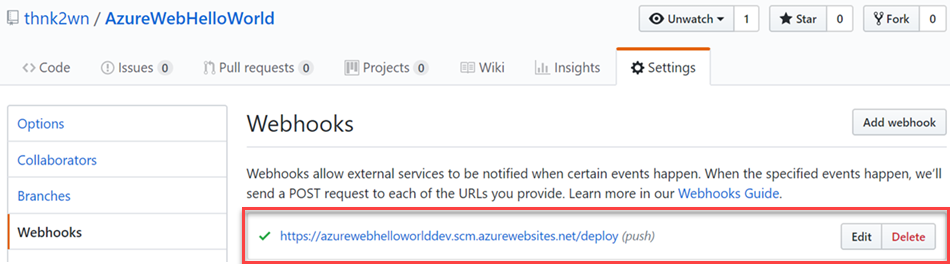

### Outputs Section

Finally in the outputs section, the URL of the created website is output.

\[javascript\] "outputs": { "siteUri": { "type": "string", "value": "\[concat('http://', reference(variables('webAppResourceId')).hostnames\[0\])\]" } } \[/javascript\]

When the template is deployed this will produce output like below.

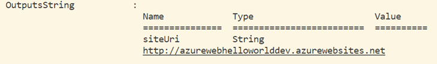

### Template Parameter File

When deploying the template a parameters JSON file can be specified to supply parameter values. That might seem redundant at first with parameters in the main ARM template. However this template will likely be getting used in different contexts where each will have different values. Commonly this might take the form of different environment settings, with one file per environment. In my case I specify just the parameters that vary by environment in the parameters file with more shared ones having default values in the ARM template.

\[javascript title="AzureWebHelloWorldDev.json"\] { "$schema": "https://schema.management.azure.com/schemas/2015-01-01/deploymentTemplate.json#", "contentVersion": "1.0.0.0", "parameters": { "appName": { "value": "AzureWebHelloWorldDev" }, "environment": { "value": "Dev" } } } \[/javascript\]

**Note:** I don't recommend specifying the parameter type in the parameter files. The ARM VS Code extension was complaining about it so I added it, despite it already be specified in the main ARM template. When deploying later, the PowerShell cmdlets were fine with this but using the Azure CLI on Mac later gave me an error "The type of deployment parameter 'environment' should not be specified. Please see https://aka.ms/arm-deploy/#parameter-file for details."

## Validating the Template

Initially I did the keyboard cowboy approach and validated the template by deploying it. :)

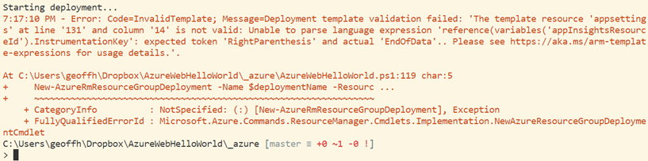

At least the error is very detailed. It's not a bad idea to validate that it's syntactically correct before attempting to deploy of course, especially after large template updates or when you're not sure about some changes.

### Validating with Azure PowerShell Cmdlets

With the Azure PowerShell cmdlets, testing with [Test-AzureRmResourceGroupDeployment](https://docs.microsoft.com/en-us/powershell/module/azurerm.resources/test-azurermresourcegroupdeployment?view=azurermps-5.0.0)...

\[powershell\] Test-AzureRmResourceGroupDeployment \` -ResourceGroupName AzureWebHelloWorldDevRG \` -TemplateFile AzureWebHelloWorld.json \` -TemplateParameterFile AzureWebHelloWorldDev.json \[/powershell\]

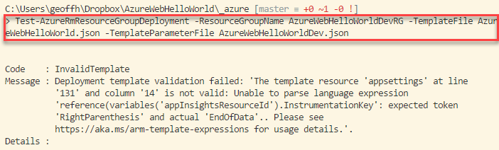

If all is fine with the template, there should be no output.

### Validating with Azure CLI

With the Azure CLI, testing with [az group deployment validate](https://docs.microsoft.com/en-us/cli/azure/group/deployment?view=azure-cli-latest#az_group_deployment_validate)...

\[bash\] az group deployment validate --resource-group AzureWebHelloWorldDevRG --template-file AzureWebHelloWorld.json --mode Complete \[/bash\]

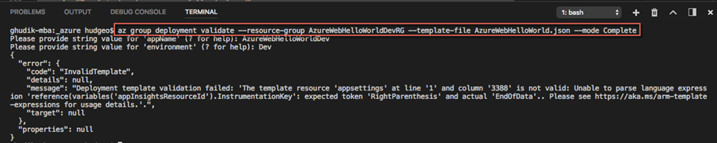

If all is well with the template, the error JSON element will be null.

## Deploying the Template

### Ways to Deploy the Template

There are a lot of ways to deploy / execute / run the template. In the Automation Options section there's generated code for the Azure CLI, PowerShell, .NET, and Ruby but there's also an [ARMClient exe](https://github.com/projectkudu/ARMClient), [Rest API](https://docs.microsoft.com/en-us/rest/api/resources/?redirectedfrom=MSDN), and [deploying templates from the Portal](https://docs.microsoft.com/en-us/azure/azure-resource-manager/resource-group-template-deploy-portal). In my case I chose PowerShell initially, followed by the Azure CLI.

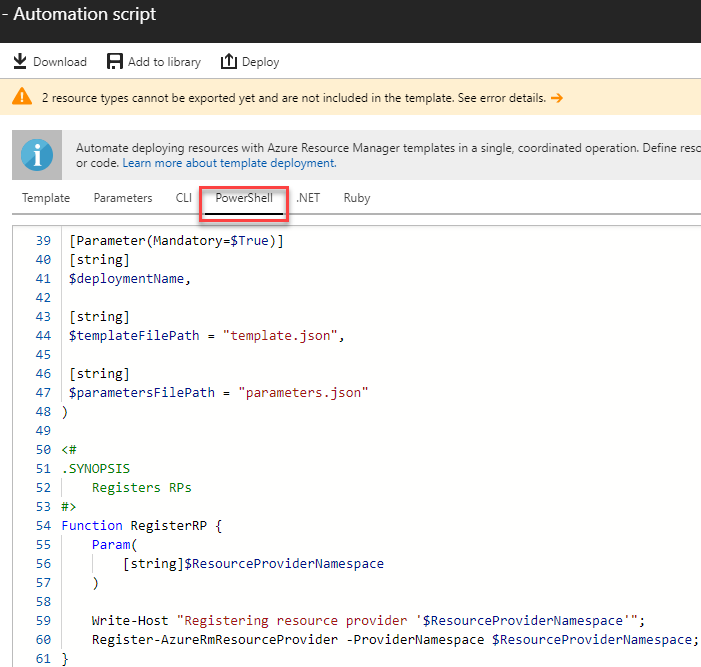

### PowerShell Deployment Script (Azure Cmdlets)

There are a couple edits I made to the default generated script.

First, the `$deploymentName` parameter was marked mandatory but wasn't even being passed into [New-AzureRmResourceGroupDeployment](https://docs.microsoft.com/en-us/powershell/module/azurerm.resources/new-azurermresourcegroupdeployment?view=azurermps-5.0.0) or used in any way. I made this optional, defaulting to a date/time based deployment name if not set. This can be left off entirely and a reasonable deployment name is used but it appeared that the same name would be used each time so Resource Group\\Deployments would only show the last deployment instead of the complete history.

Second, an `$incremental` switch parameter was added. That gets translated into the type `Microsoft.Azure.Management.ResourceManager.Models.DeploymentMode`. I wanted this to be false by default to force a complete deployment, deleting any resource in the group that's not specified in the template. This forced me to ensure the template was correct, complete, and automated without relying on things being done in the portal UI. This may not be advisable for production but for dev and test it was fine. This also required adding `-Force` when calling `New-AzureRmResourceGroupDeployment` to suppress the "did you ask your mother for permission?" confirmation prompt. Highlighted lines below represent changes over the generated script.

\[powershell title="AzureWebHelloWorld.ps1" highlight="15,21,26,27,39,40,43,45,46,51,52,55,57,58,59,61,62,63,119,121"\] <# .SYNOPSIS Deploys a template to Azure

.DESCRIPTION Deploys an Azure Resource Manager template

.PARAMETER subscriptionId The subscription id where the template will be deployed.

.PARAMETER resourceGroupName The resource group where the template will be deployed. Can be the name of an existing or a new resource group.

.PARAMETER deploymentName Optional name of the deployment. If not specified a default name is generated.

.PARAMETER resourceGroupLocation Optional, a resource group location. If specified, will try to create a new resource group in this location. If not specified, assumes resource group is existing.

.PARAMETER templateFilePath Optional, path to the template file. Defaults to template.json.

.PARAMETER parametersFilePath Optional, path to the parameters file. Defaults to AzureWebHelloWorld.json. If file is not found, will prompt for parameter values based on template.

.PARAMETER incremental Optional flag indicating deployment mode should be incremental and not complete (default). #>

param( \[Parameter(Mandatory=$True)\] \[string\] $subscriptionId,

\[Parameter(Mandatory=$True)\] \[string\] $resourceGroupName,

\[string\] $deploymentName = $null,

\[string\] $resourceGroupLocation = "West US",

\[string\] $templateFilePath = "AzureWebHelloWorld.json",

\[string\] $parametersFilePath = "parameters.json",

\[switch\] $incremental )

$mode = "Complete";

if ($incremental) { $mode = "Incremental"; }

if (!$deploymentName) { $deploymentName = "Deploy\_{0}" -f (get-date -format M.d.yyyy-hh.mm.ss); }

<# .SYNOPSIS Registers Resource Providers #> Function RegisterRP { Param( \[string\]$ResourceProviderNamespace )

Write-Host "Registering resource provider '$ResourceProviderNamespace'"; Register-AzureRmResourceProvider -ProviderNamespace $ResourceProviderNamespace; }

#\*\*\*\*\*\*\*\*\*\*\*\*\*\*\*\*\*\*\*\*\*\*\*\*\*\*\*\*\*\*\*\*\*\*\*\*\*\*\*\*\*\*\*\*\*\*\*\*\*\*\*\*\*\*\*\*\*\*\*\*\*\*\*\*\*\*\*\*\*\*\*\*\*\*\*\*\*\* # Script body # Execution begins here #\*\*\*\*\*\*\*\*\*\*\*\*\*\*\*\*\*\*\*\*\*\*\*\*\*\*\*\*\*\*\*\*\*\*\*\*\*\*\*\*\*\*\*\*\*\*\*\*\*\*\*\*\*\*\*\*\*\*\*\*\*\*\*\*\*\*\*\*\*\*\*\*\*\*\*\*\*\* $ErrorActionPreference = "Stop"

\# sign in Write-Host "Logging in..."; Login-AzureRmAccount;

\# select subscription Write-Host "Selecting subscription '$subscriptionId'"; Select-AzureRmSubscription -SubscriptionID $subscriptionId;

\# Register RPs $resourceProviders = @("microsoft.insights","microsoft.web"); if($resourceProviders.length) { Write-Host "Registering resource providers" foreach($resourceProvider in $resourceProviders) { RegisterRP($resourceProvider); } }

#Create or check for existing resource group $resourceGroup = Get-AzureRmResourceGroup -Name $resourceGroupName -ErrorAction SilentlyContinue if(!$resourceGroup) { Write-Host "Resource group '$resourceGroupName' does not exist. To create a new resource group, please enter a location."; if(!$resourceGroupLocation) { $resourceGroupLocation = Read-Host "resourceGroupLocation"; } Write-Host "Creating resource group '$resourceGroupName' in location '$resourceGroupLocation'"; New-AzureRmResourceGroup -Name $resourceGroupName -Location $resourceGroupLocation } else{ Write-Host "Using existing resource group '$resourceGroupName'"; }

\# Start the deployment Write-Host "Starting deployment..."; if(Test-Path $parametersFilePath) { New-AzureRmResourceGroupDeployment -Name $deploymentName -ResourceGroupName $resourceGroupName -TemplateFile $templateFilePath -TemplateParameterFile $parametersFilePath -Mode $mode -Force; } else { New-AzureRmResourceGroupDeployment -Name $deploymentName -ResourceGroupName $resourceGroupName -TemplateFile $templateFilePath -Mode $mode -Force; } \[/powershell\]

### Deploying with PowerShell on Windows

I invoked the PowerShell script with a call like this (multiline syntax below is just for readability here).

\[powershell\] .\\AzureWebHelloWorld.ps1 \` -subscriptionId "subscription-guid-here" \` -resourceGroupName AzureWebHelloWorldDevRG \` -parametersFilePath AzureWebHelloWorldDev.json \[/powershell\]

By default with [Login-AzureRmAccount](https://docs.microsoft.com/en-us/powershell/azure/authenticate-azureps?view=azurermps-5.0.0), a web popup window appears to input username on one page and password on the next. Annoyingly that seems to happen on every run and the window seems to be always hidden underneath all under windows. It's also distracting to shift context away from the PS terminal. I started to go down the route of [a service principal or other alternatives](https://stackoverflow.com/questions/37249623/how-to-login-without-prompt) but that's a problem for another day.

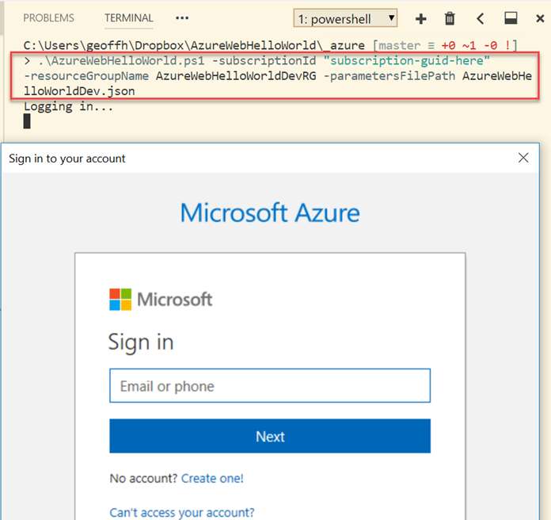

Afterwards the output looked like below, with additional output before and after, including the website URL output as shown in the above template outputs section.

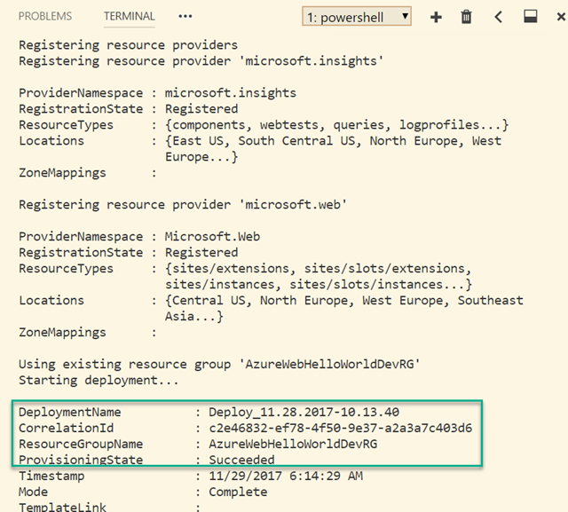

### Deploying with PowerShell Core on Mac

Since [Powershell Core](https://github.com/PowerShell/PowerShell) runs on multiple operating systems, I thought I'd give [Azure PowerShell on Mac](https://docs.microsoft.com/en-us/powershell/azure/install-azurermps-maclinux?view=azurermps-5.0.0) a try.

I was able to import AzureRM.NetCore but the list of exported commands was empty so I couldn't execute anything like Login-AzureRMAccount. While it's possible I did something wrong I know the support for this is in preview so I didn't spend much time troubleshooting.

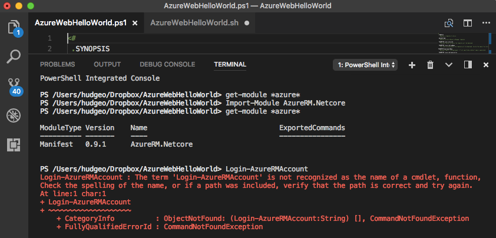

### Bash Deployment Script (Azure CLI)

I'm not a bash guy or really even a Mac guy but I wanted to deploy from my Mac as well. I needed to brush up on Bash anyway and try Azure CLI more. The changes I made over the default generated automation script from Azure are called out below and highlighted in the AzureWebHelloWorld.sh code below.

- Added parameters for templateFilePath, parametersFilePath and (deployment) mode.
- Defaulted deploymentName, resourceGroupLocation, templateFilePath, and mode if not set.
- `az account set --name $subscriptionId` didn't work, changed to `az account set --sub $subscriptionId`.
- `az group show $resourceGroupName` didn't work, changed to `az group exists --name $resourceGroupName`.

\[bash title="AzureWebHelloWorld.sh" highlight="10,18-20,37-45,63-65,67-69,71-73,75-79,81-83,110-111,116,118,133"\] #!/bin/bash set -euo pipefail IFS=$'\\n\\t'

\# -e: immediately exit if any command has a non-zero exit status # -o: prevents errors in a pipeline from being masked # IFS new value is less likely to cause confusing bugs when looping arrays or arguments (e.g. $@)

usage() { echo "Usage: $0 -i <subscriptionId> -g <resourceGroupName> -n <deploymentName> -l <resourceGroupLocation> -t <templateFilePath> -p <parametersFilePath> -m <mode>" 1>&2; exit 1; }

declare subscriptionId="" declare resourceGroupName="" declare deploymentName="" declare resourceGroupLocation="" declare parametersFilePath="" declare templateFilePath="" declare mode=""

\# Initialize parameters specified from command line while getopts ":i:g:n:l:p:" arg; do case "${arg}" in i) subscriptionId=${OPTARG} ;; g) resourceGroupName=${OPTARG} ;; n) deploymentName=${OPTARG} ;; l) resourceGroupLocation=${OPTARG} ;; t) templateFilePath=${OPTARG} ;; p) parametersFilePath=${OPTARG} ;; m) mode=${OPTARG} ;; esac done shift $((OPTIND-1))

#Prompt for parameters is some required parameters are missing if \[\[ -z "$subscriptionId" \]\]; then echo "Subscription Id:" read subscriptionId \[\[ "${subscriptionId:?}" \]\] fi

if \[\[ -z "$resourceGroupName" \]\]; then echo "ResourceGroupName:" read resourceGroupName \[\[ "${resourceGroupName:?}" \]\] fi

if \[\[ -z "$deploymentName" \]\]; then deploymentName="Deploy\_$(date +"%m.%d.%Y-%I.%M.%S")" fi

if \[\[ -z "$resourceGroupLocation" \]\]; then resourceGroupLocation="West US" fi

if \[\[ -z "$templateFilePath" \]\]; then templateFilePath="AzureWebHelloWorld.json" fi

if \[\[ -z "$parametersFilePath" \]\]; then echo "Enter parameter file path " echo "parametersFilePath:" read parametersFilePath fi

if \[\[ -z "$mode" \]\]; then mode="Complete" fi

if \[ ! -f "$templateFilePath" \]; then echo "$templateFilePath not found" exit 1 fi

#parameter file path if \[ ! -f "$parametersFilePath" \]; then echo "$parametersFilePath not found" exit 1 fi

if \[ -z "$subscriptionId" \] || \[ -z "$resourceGroupName" \] || \[ -z "$deploymentName" \]; then echo "Either one of subscriptionId, resourceGroupName, deploymentName is empty" usage fi

#login to azure using your credentials az account show 1> /dev/null

if \[ $? != 0 \]; then az login fi

#set the default subscription id #az account set --name $subscriptionId #default, doesn't work az account set --sub $subscriptionId

set +e

#Check for existing RG #az group show $resourceGroupName 1> /dev/null #default, doesn't work

if \[ $(az group exists --name $resourceGroupName) == 'false' \]; then echo "Resource group with name" $resourceGroupName "could not be found. Creating new resource group.." set -e ( set -x az group create --name $resourceGroupName --location $resourceGroupLocation 1> /dev/null ) else echo "Using existing resource group..." fi

#Start deployment echo "Starting deployment..." ( set -x az group deployment create --name $deploymentName --resource-group $resourceGroupName --template-file $templateFilePath --parameters $parametersFilePath --mode $mode --debug )

if \[ $? == 0 \]; then echo "Template has been successfully deployed" fi \[/bash\]

### Deploying with Azure CLI on Mac

Setup wise, I originally tried installing Azure CLI via `brew install azure-cli`. It installed but I had an issue using it; I can't remember the issue now and I switched to `curl -L https://aka.ms/InstallAzureCli | bash` and restarting the terminal before capturing the problem.

I fumbled around a bit with invoking the script with coming from PowerShell and Windows.

- Tried using -fullParameter name for the parameters at first and had to brush up on [shell script parameters](https://unix.stackexchange.com/questions/129391/passing-named-arguments-to-shell-scripts).
- Wasn't breaking the habit of ".\\" instead of "./" when executing the script in the same directory.
- Forgot about making the script executable - i.e. `chmod u+x AzureWebHelloWorld.sh`.
- Originally I created AzureWebHelloWorld.sh on Windows and it seemed I needed to run `dos2unix AzureWebHelloWorld.sh` to convert the line endings. Then I realized that wasn't installed so I first needed `brew install dos2unix`.

In the end the script was invoked as:

\[bash\] ./AzureWebHelloWorld.sh -i 'subscription-guid-here' -g 'AzureWebHelloWorldDevRG' -p 'AzureWebHelloWorldDev.json' \[/bash\]

The PIN based OAuth process was slightly longer on the initial authorization but the nice thing was that subsequent runs of the script didn't reprompt for credentials (unlike the PowerShell cmdlets).

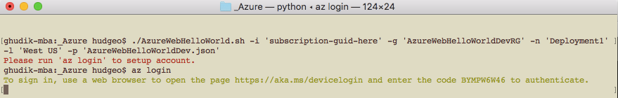

## Some Deployment Issues Along the Way

ARM template validation issues were easy to fix. The main problem I had with deployment issues is that the errors weren't always very reflective of what the problem was. Some issues also didn't seem to have much to go on from a diagnostic perspective.

### Node Version

When first deploying the site with GitHub integration I ran into the below error. Since it mentioned GetSiteSourceControl, GitHub, and 403 Forbidden it led me down the road of thinking it was some of kind of GitHub permissions / token type issue despite having the authorization in place. This really threw me for a loop for a while.

Starting deployment...
6:11:50 PM - Resource Microsoft.Web/sites/sourcecontrols 'AzureWebHelloWorldDev/web'
failed with message '{
  "Code": "BadRequest",
  "Message": "Repository 'GetSiteSourceControl' operation failed with System.Net.WebException: The remote server returned an error: (403) Forbidden.
 at System.Net.HttpWebRequest.EndGetResponse(IAsyncResult asyncResult)
 at System.Threading.Tasks.TaskFactory\`1.FromAsyncCoreLogic(IAsyncResult iar, Func\`2 endFunction, Action\`1 endAction, Task\`1 promise, Boolean requiresSynchronization)
 --- End of stack trace from previous location where exception was thrown ---
 at System.Runtime.ExceptionServices.ExceptionDispatchInfo.Throw()
 at System.Runtime.CompilerServices.TaskAwaiter.HandleNonSuccessAndDebuggerNotification(Task task)
 at Microsoft.Web.Hosting.Administration.SiteRepositoryProvider.TrackerContext.d\_\_79.MoveNext()
 --- End of stack trace from previous location where exception was thrown ---
 at System.Runtime.ExceptionServices.ExceptionDispatchInfo.Throw()
 at System.Runtime.CompilerServices.TaskAwaiter.HandleNonSuccessAndDebuggerNotification(Task task)
 at Microsoft.Web.Hosting.Administration.SiteRepositoryProvider.d\_\_4d.MoveNext()
 --- End of stack trace from previous location where exception was thrown ---
 at System.Runtime.ExceptionServices.ExceptionDispatchInfo.Throw()
 at System.Runtime.CompilerServices.TaskAwaiter.HandleNonSuccessAndDebuggerNotification(Task task)
 at Microsoft.Web.Hosting.Administration.GitHubSiteRepositoryProvider.d\_\_1.MoveNext()
 --- End of stack trace from previous location where exception was thrown ---
 at System.Runtime.ExceptionServices.ExceptionDispatchInfo.Throw()
 at System.Runtime.CompilerServices.TaskAwaiter.HandleNonSuccessAndDebuggerNotification(Task task)
 at Microsoft.Web.Hosting.Administration.WebCloudController.<>c\_\_DisplayClass38f.<b\_\_38b>d\_\_394.MoveNext()
 --- End of stack trace from previous location where exception
was thrown ---
 at System.Runtime.ExceptionServices.ExceptionDispatchInfo.Throw()
 at System.Runtime.CompilerServices.TaskAwaiter.HandleNonSuccessAndDebuggerNotification(Task task)
 at Microsoft.Web.Hosting.AsyncHelper.RunSync\[TResult\](Func\`1 func)
 at Microsoft.Web.Hosting.Administration.WebCloudController.GetSiteSourceControl(String subscriptionName, String webspaceName, String name).", 

In the Azure portal when I navigated to Resource Group\\Website\\Deployment Options and clicked on the details, I noticed NPM output that didn't match what I saw when I installed locally.

That led me to wondering about the node version on Azure and pulling up the App Settings blade on the website in the portal showed 6.9.1 when I was running 8.9.0 locally.

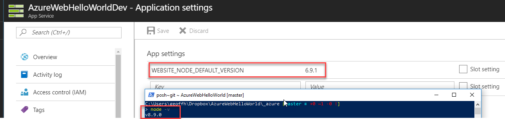

Setting `"WEBSITE_NODE_DEFAULT_VERSION": "8.9.0"` in the app settings for the website resource resolved the issue.

### App Service (Hosting) Plan Tier

Even after correcting the Node version I was still seeing errors around "Repository 'GetSiteSourceControl' operation failed" with "The remote server returned an error: (503) Server Unavailable." or "The resource operation completed with terminal provisioning state 'Failed'".

Comparing to a site I had previously created in the portal UI with GitHub integration, I realized that it had an S1 Standard SKU for the app service plan and in my ARM template I had the Free SKU. Changing it to S1 Standard resolved the deployment issue.

### Sporadic GitHub Connectivity Issues?

On some rare occasions I would receive an error like "Repository 'UpdateSiteSourceControl' operation failed... (503) Server Unavailable.". I could deploy shortly thereafter without making any changes and it wouldn't happen again. ¯\\\_(ツ)\_/¯ I'm guessing sporadic connectivity issues to GitHub or perhaps to NPM later. It didn't happen enough for me to really dive in but it was concerning.

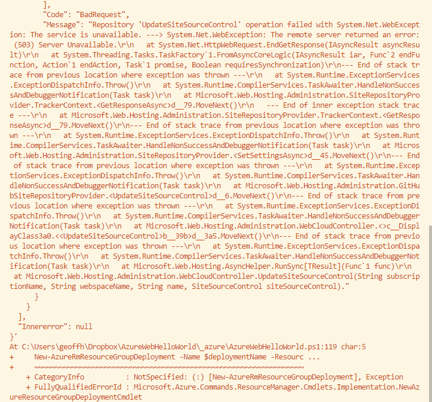

## Monitoring the Deployment

Unfortunately when running the deployment there's not much indication of what's going on at the command line once the deployment has started (at least by default). For [az group deployment create](https://docs.microsoft.com/en-us/cli/azure/group/deployment?view=azure-cli-latest#az_group_deployment_create) there's a debug parameter and for [New-AzureRmResourceGroupDeployment](https://docs.microsoft.com/en-us/powershell/module/azurerm.resources/new-azurermresourcegroupdeployment?view=azurermps-5.0.0) there's a DeploymentDebugLogLevel parameter. The problem with these is you then end up with the opposite problem - too much output including blobs of JSON and potentially sensitive output. Basically it seems to be more all or nothing output wise from the command line.

Viewing the status from the Azure Portal during the deployment might be better in cases. From Resource Group\\Deployments the list of deployments will include any in progress deployment.

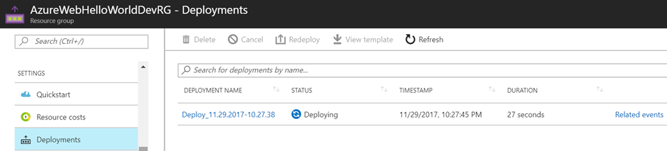

Clicking the deployment name will bring up the detail on the steps.

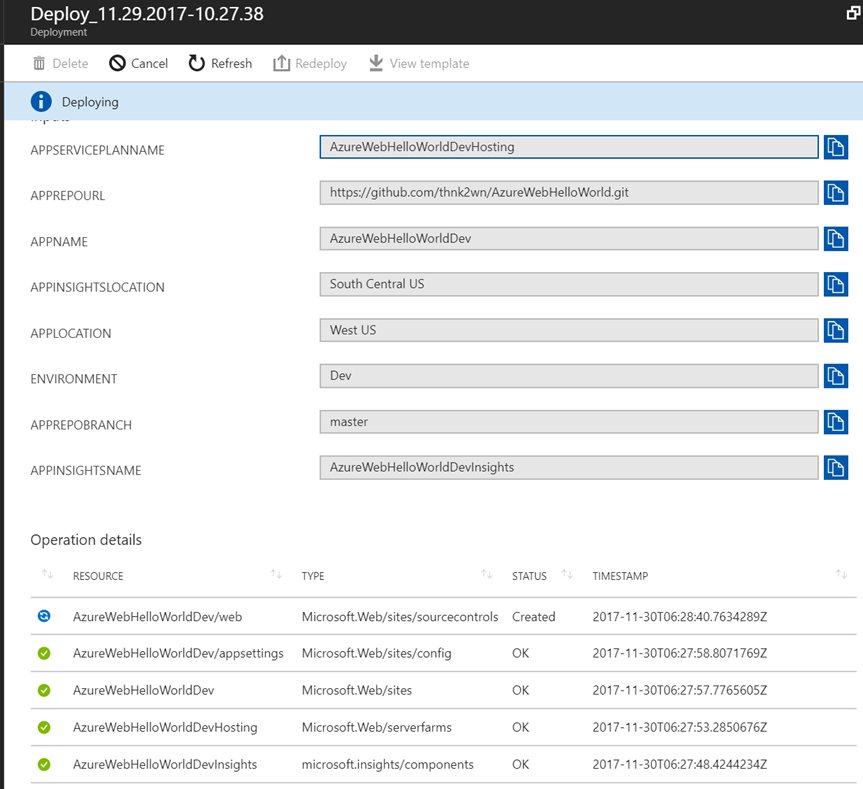

Clicking on a step will bring up detail for that step.

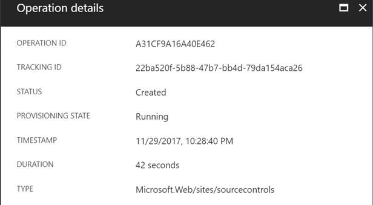

Drilling into the web app resource within the resource group and going to Deployment Options will show some detail including the last git commit message but further details can't be seen until the step finishes.

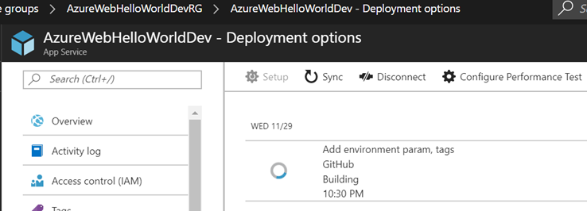

Once the step completes it can be clicked on for further details.

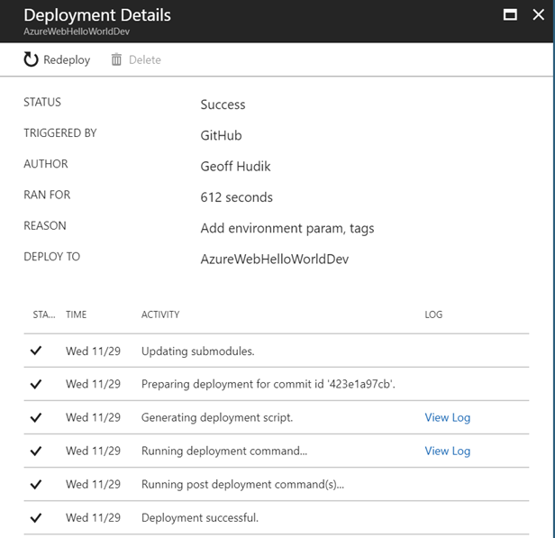

Clicking on the deployment command log shows details including packages installed, files copied, etc.

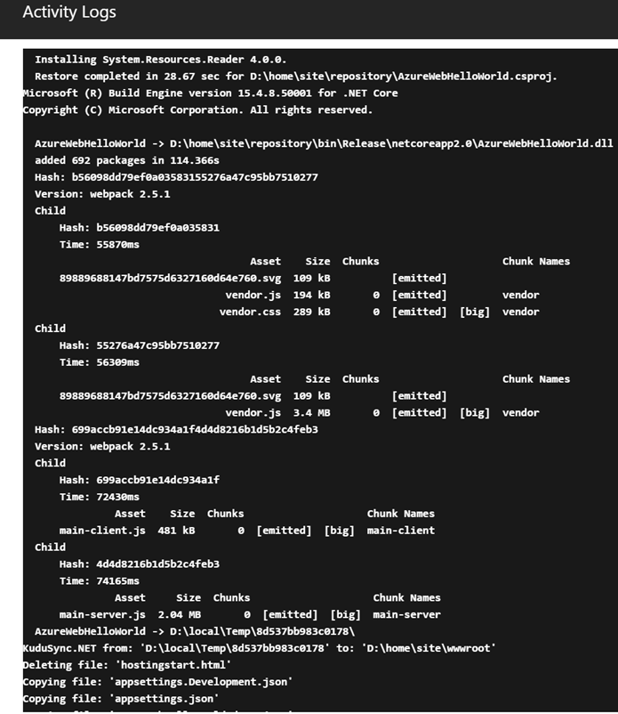

## The Default Generated Build Script

Seeing the output about the generated build script in the deployment log, I was curious what all it was doing on my behalf. I went to to the Console blade of the web app and viewed the contents of the auto generated script.

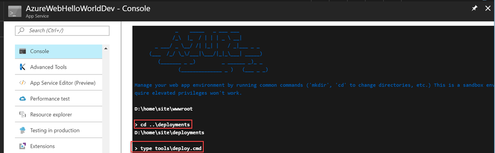

Partial output:

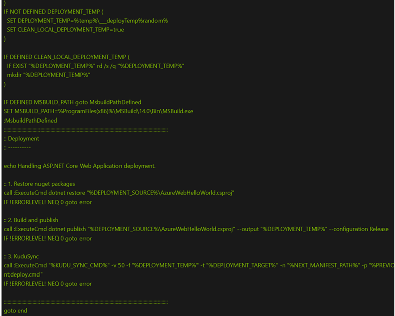

I thought it was pretty cool that all the package dependency installs, dot net publish, file sync/copy logic and more I got for free by default and it just worked without having to create a build script and setup a CI server. I wasn't familiar with [Kudu](https://github.com/projectkudu/kudu) but it appears easy enough to customize the defaults by downloading the script and adding the files to the root of the repo.

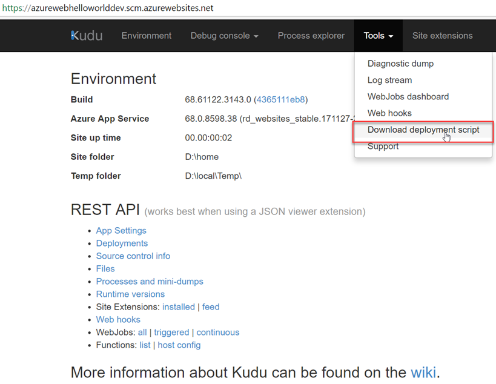

## Verifying the Deployment

First I confirmed the resource group was there under Resource Groups in the Portal and it had the resources setup per the template.

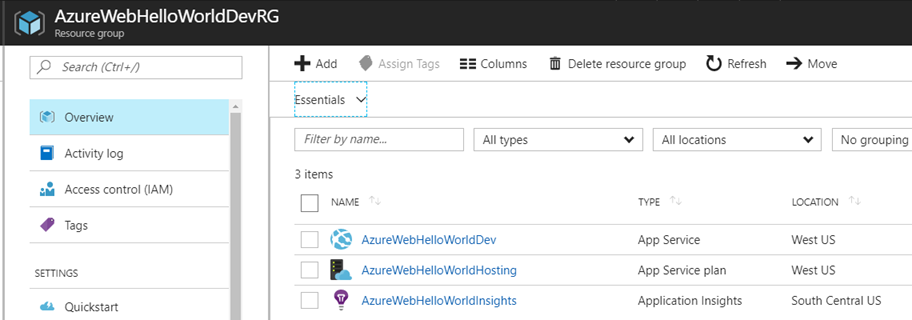

Next up, the web app Overview.

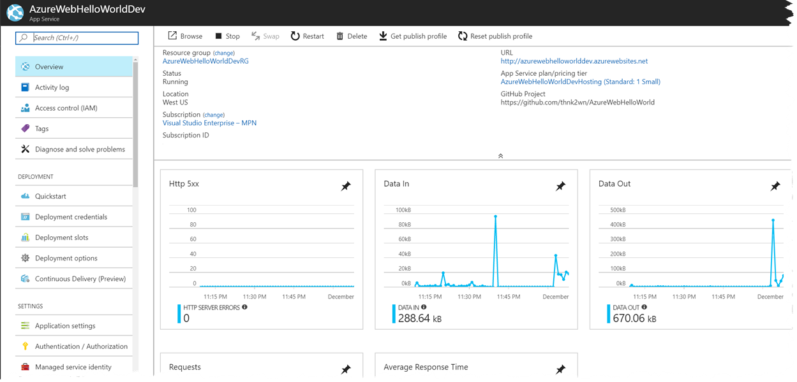

Under the Monitoring section of the web app, I checked out App Insights. This was the area that took a few tries to get right.

From there, I navigated over to the full App Insights section.

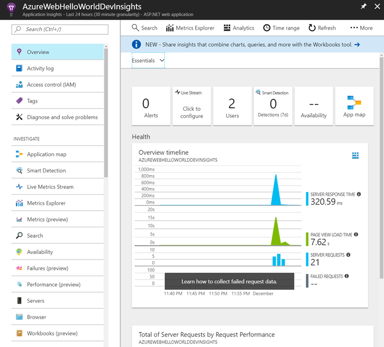

Last but not least, navigating the web app hosted on Azure to verify it's working as expected.

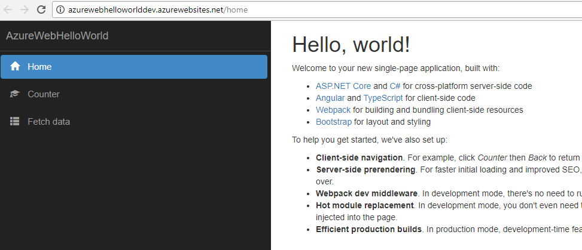

## Final Thoughts

The full templates and scripts in this post can be found here: [AzureWebHelloWorldDeploy.zip](https://geoffhudik.com/wp-content/uploads/2017/12/AzureWebHelloWorldDeploy.zip).

Obviously in a real, non Hello World app there may be:

- Much more configured in the ARM template
- Non auto generated build script
- Use of a build server
- [Continuous delivery](https://docs.microsoft.com/en-us/vsts/build-release/apps/cd/azure/aspnet-core-to-azure-webapp?tabs=vsts)
- Tests to run
- Use of [deployment slots](https://docs.microsoft.com/en-us/azure/app-service/web-sites-staged-publishing)
- [Containers](https://azure.microsoft.com/en-us/overview/containers/)
- ...

... but there's always starting small and incrementally adding more functionality as the need arises.
