Before the holidays I was learning more about [Azure Logic Apps](https://azure.microsoft.com/en-us/services/logic-apps/) and looking for a use case for more hands-on knowledge. I had an IP camera sitting around that I had barely used and home monitoring made sense while traveling over the holidays. I didn't have much time before I left so my initial goal was to get motion alert images stored on Azure, run some image analysis on them, store image information in a data store, and send myself a more customized alert email if a person was detected. I found motion alerts could be triggered with as little as the AC turning on and moving the blinds slightly or a bird landing on my balcony, so I only wanted an email if it appeared there was someone in my place.

 [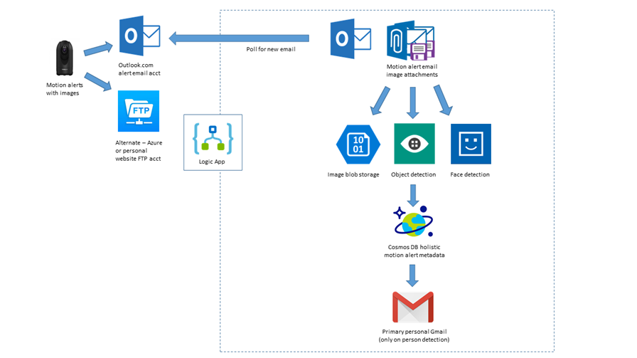](https://geoffhudik.com/wp-content/uploads/2018/01/diagram.png "Logic App Overview") 

I had in mind creating an Azure website to display motion alert thumbnails and images along with alert data and perhaps provide a live image of the camera but that would need to wait.

## The Camera

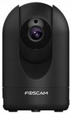

- Initially I started with the [UOKOO X Series](http://a.co/4P7QdUs). It was okay for the cheap price but left a lot to be desired in terms of image quality, configuration, stability.
- Next up was the [EZVIZ Mini O 720p](http://a.co/1uxCI2S) which had a strange setup procedure; I couldn't even get it fully connected in a reasonable amount of time so I returned it.
- Finally I ended up with the [Foscam R2](http://a.co/1RPatdB) that I found to be a good mix of quality and price. The pan / tilt / zoom was handy, image quality was great, and it felt more polished and more open from an API perspective.

Most of the basics of this project I got working with the UOKOO but I finished with the Foscam unit.

## Getting Motion Alert Images off the Camera

### UOKOO

UOKOO mobile app had settings for sending alerts via mail and FTP. I started with FTP using FTP credentials of an Azure website of mine but unfortunately it didn't allow "\\" in the FTP username field. That I worked around using my blog website's FTP but I found the camera's FTP delivery to be much more unreliable than mail, perhaps because mail is much more commonly used. FTP motion alert images would work occasionally and video never did.

### Foscam

Sadly the Foscam mobile app had no mail or FTP alert settings, likely because they are trying to push their cloud subscription model. On my computer I used their [Equipment Search Tool](https://www.foscam.com/download-center/software-tools.html) to find the camera's local IP, though there are other ways to find that. After hitting that IP it seemed to require IE for a browser plugin install though I later realized it mostly worked in Chrome. At that point I set both FTP and mail credentials.

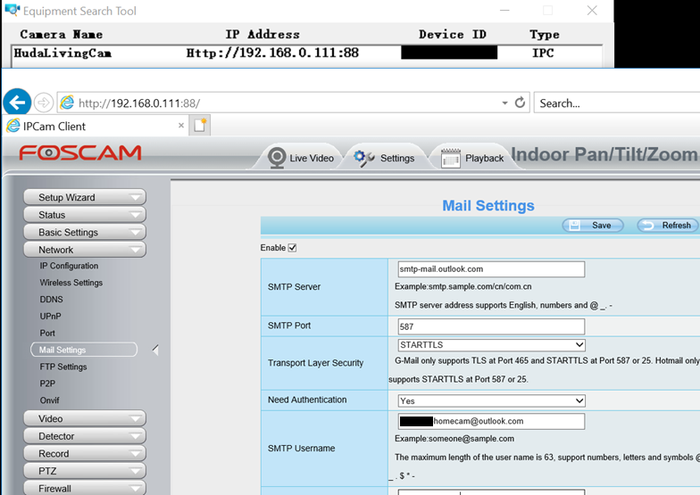

### Delivery Type

Due largely to the FTP issues with the first camera I already had most of the solution working via email so I stuck with it. Also it was a bit easier browsing alert emails than FTP folders for debugging. However it would've been pretty straightforward to use FTP as the source for the logic app. I created a new [Outlook.com](https://outlook.live.com/owa/) email account for the camera alerts mostly because I didn't want to put my Gmail credentials in. I don't trust some of these hastily made IP cameras phoning home to China that could be [part of a botnet](https://www.darkreading.com/attacks-breaches/new-iot-botnet-discovered-120k-ip-cameras-at-risk-of-attack/d/d-id/1328839?) for all I know. I also wasn't sure how much email it would generate and wanted the option of easily reprocessing emails if needed so keeping it separate was ideal.

## Creating the Resources for the Logic App

First I created a new resource group for this project and added the resources I knew I'd be using before creating the logic app itself.

- [Storage Account](https://docs.microsoft.com/en-us/azure/storage/) - for blob storage of motion alert images.
- [Computer Vision API](https://docs.microsoft.com/en-us/azure/cognitive-services/computer-vision/home) in Cognitive Services - to detect if a person was found in a motion alert image.
- [Face API](https://docs.microsoft.com/en-us/azure/cognitive-services/face/overview) in Cognitive Services - to estimate age, gender, and facial features when a person was found in a motion alert image.
- [Cosmos DB](https://docs.microsoft.com/en-us/azure/cosmos-db/) - for adding records about motion alerts that include image blob info, object detection results, face detection data, email and attachment data, etc.

The only resource that required any special configuration was the blob storage container. The Face API only allowed specifying an image by URL and not contents, at least within the logic app. That meant I needed to allow public access to blobs; blob level allowed direct access to a given blob URL without allowing enumerating blob container contents.

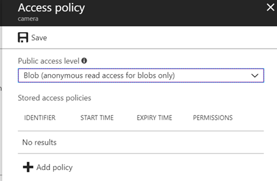

## Logic App Workflow

After creating the logic app I started with a blank slate on the Logic App Designer.

### Getting the Alert Email

First up was searching for Outlook.com and signing into the alert email account created for the camera...

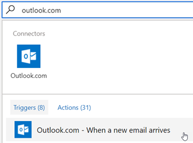

... then setting email frequency and email match criteria for the trigger.

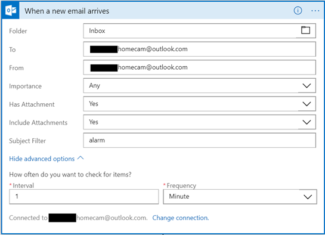

Getting an email requires a Message Id which is specified from the new email trigger. To see Message Id in the Dynamic Content list it's necessary to click the See More link or just search for it.

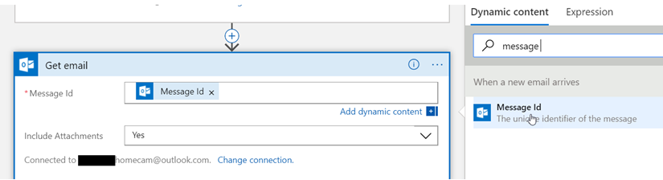

### Creating Variables

After getting the email I next started to use the attachments. However in further steps later I needed to use variables and unfortunately they can't be declared at a nested level like a loop so they are initialized here.

The default name for this action is "Initialize variable" which I renamed so things are clear at a glance. I think it's helpful to rename most steps and to do so early on. Step dependencies can at times prevent steps from being renamed later, at least from within the designer.

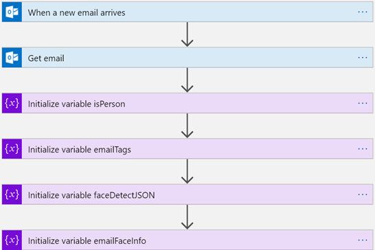

### Getting Alert Email Attachments

Next an Outlook.com Get Attachment action was chosen and after referencing any attachment property, a loop was automatically created as there's a collection of attachments.

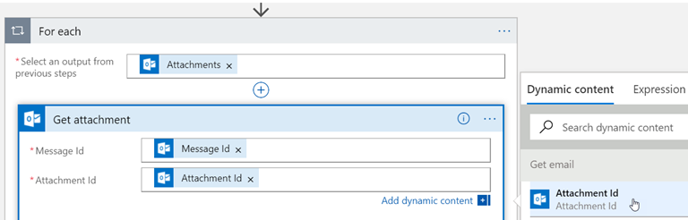

### Storing Alert Attachment Images

A create blob action was created and initially it requires picking a storage account and setting a connection name. The blob name was then set to the attachment name and content to the attachment content.

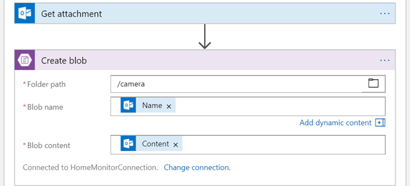

### Computer Vision on Alert Attachment Images

The computer vision tag image action allows specifying the image via content or URL. I chose to use the attachment contents but I could've also pointed it to the image blob URL.

This action will return JSON with a list of tags where each tag has a name of what it recognized and a confidence score. Mostly I was interested in whether a person was detected. Sample partial output follows.

\[javascript\] { "tags": \[ { "name": "wall", "confidence": 0.999225378036499 }, { "name": "indoor", "confidence": 0.9989519119262695 }, { "name": "person", "confidence": 0.9654679298400879 }, { "name": "man", "confidence": 0.9386265873908997 }, { "name": "standing", "confidence": 0.8628746867179871 }, { "name": "ceiling", "confidence": 0.8338147401809692 }, { "name": "office", "confidence": 0.45078304409980774 }, { "name": "desk", "confidence": 0.08925789594650269 } \] } \[/javascript\]

After tagging the image some tagging related variables are reset as they could have non default values from processing of a prior email attachment.

### Enumerating Vision Tags

I wanted the name of each object detected and the confidence score as a bulleted list in the email that I'd send later if a person was detected. This step concatenates tag names and confidence values and appends it to a variable.

The full expression is below. I wasn't quite sure how to reference specific items in the JSON at first so I ended up looking at the code view of of the app and reviewing the [Logic App Workflow Definition Language](https://docs.microsoft.com/en-us/azure/logic-apps/logic-apps-workflow-definition-language). Also I wasn't sure how to reference fields in the expression in the designer view; it turns out you can switch to the Dynamic Content tab and click a field to insert it into the expression on the other tab but I didn't find that intuitive.

\[javascript\] concat('<li>', items('For\_each\_computer\_vision\_tag')?\['name'\], ' ', substring(string(items('For\_each\_computer\_vision\_tag')?\['confidence'\]), 0, 4), ' confident ') \[/javascript\]

### Determining if a Person

I had to switch to expression mode to check multiple conditions; the tag name is checked for person and confidence value for > .5.

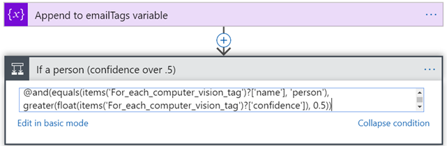

Originally I named this step "If a person (confidence > .5)" and the designer let me do that but saving gave an error so it had to be renamed.

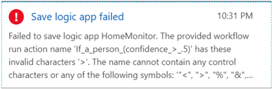

### Detecting Faces

I almost skipped facial detection because I figured any unwelcome guests wouldn't exactly be posing for the camera and that their faces might not be in view at the point(s) at which alert snapshots are taken. The Foscam camera had enough quality and settings for alert intervals and sensitivity to make this work however. That wasn't quite true with the UOKOO camera.

If a person is detected, a variable is set and a call is made to the face API. Unlike the vision API connector, it didn't allow specifying the image contents so I pointed it to the blob URL. It probably wouldn't hurt to call the face API regardless of whether the vision API detected a person but I figured it might be a little cheaper. It's worth noting that while the vision API might detect a person it doesn't mean the face API will detect any faces.

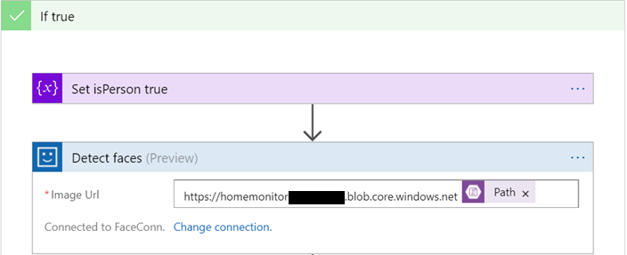

The face API returns a lot of positioning data that could be used for drawing face rectangles and such but mostly I was interested in the facial attributes it returns.

\[javascript\] { "faceAttributes": { "smile": 0.015, "headPose": { "pitch": 0, "roll": 17.8, "yaw": -3.3 }, "gender": "male", "age": 36.6, "facialHair": { "moustache": 0, "beard": 0.2, "sideburns": 0 }, "glasses": "NoGlasses" } } \[/javascript\]

### Enumerating Faces

In this step face attributes are appended to a variable that will be used in the email later and the JSON from the face API call is saved to a variable that will be used for a Cosmos DB record to come.

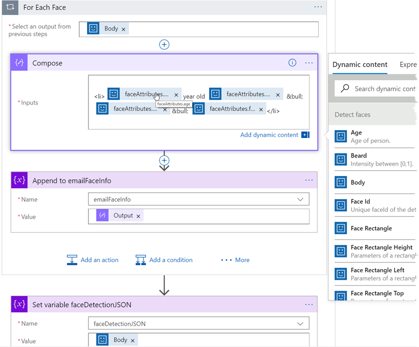

At this level in the workflow I wasn't seeing the response Body of the Face API call showing up in the fields of Dynamic content so I ended up switching to code view and setting it. Note the response body from the face detection step had to explicitly be converted to a string. This wasn't obvious to me until a run failed as the response was a JSON string.

\[javascript highlight="4"\] "Set\_variable\_faceDetectionJSON": { "inputs": { "name": "faceDetectionJSON", "value": "@string(body('Detect\_Faces'))" }, "runAfter": { "For\_Each\_Face": \[ "Succeeded" \] }, "type": "SetVariable" } \[/javascript\]

### Creating a CosmosDB Document

After all the vision tags have been iterated, a Cosmos DB record is created which contains some info about the source alert email, image blob, object and face detection, etc. This isn't used with my current workflow other than for debugging but later on it can be used as the source of record for a potential web app to view alert data.

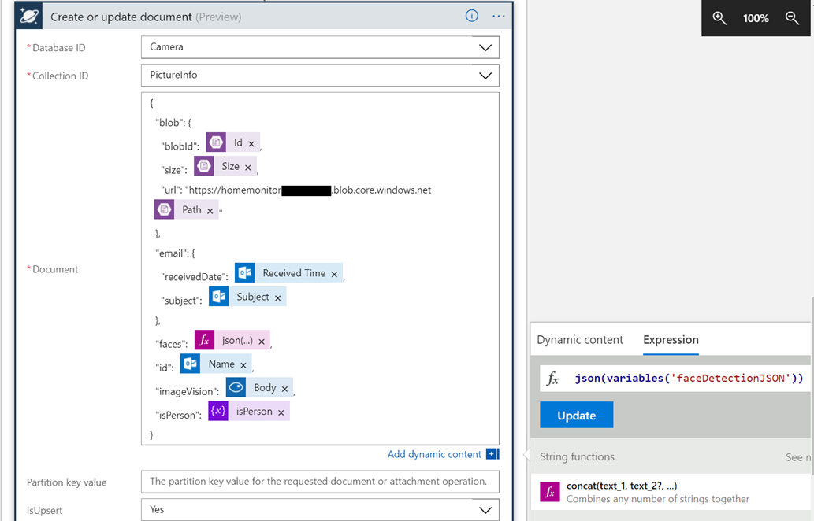

A JSON function is invoked on the variable faceDetectionJSON to expand the JSON, otherwise it would be encoded and hard to read. IsUpsert was set to Yes because sometimes on failed logic app runs I'd resubmit the run and the document would already exist then.

A partial example document:

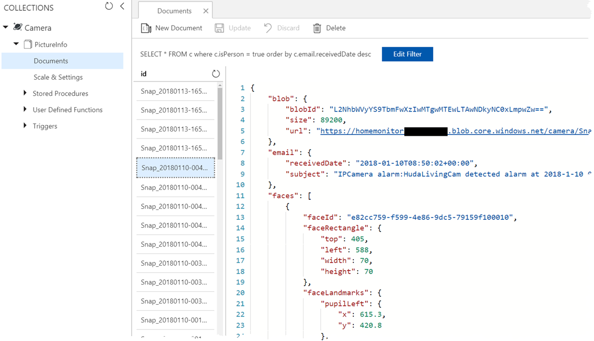

### Sending the Final Email

When a person has been detected the final step of the workflow is sending an email to my primary account using a Gmail send email action. The if expression for the faces section is `if(empty(variables('emailFaceInfo')), 'None', variables('emailFaceInfo'))`.

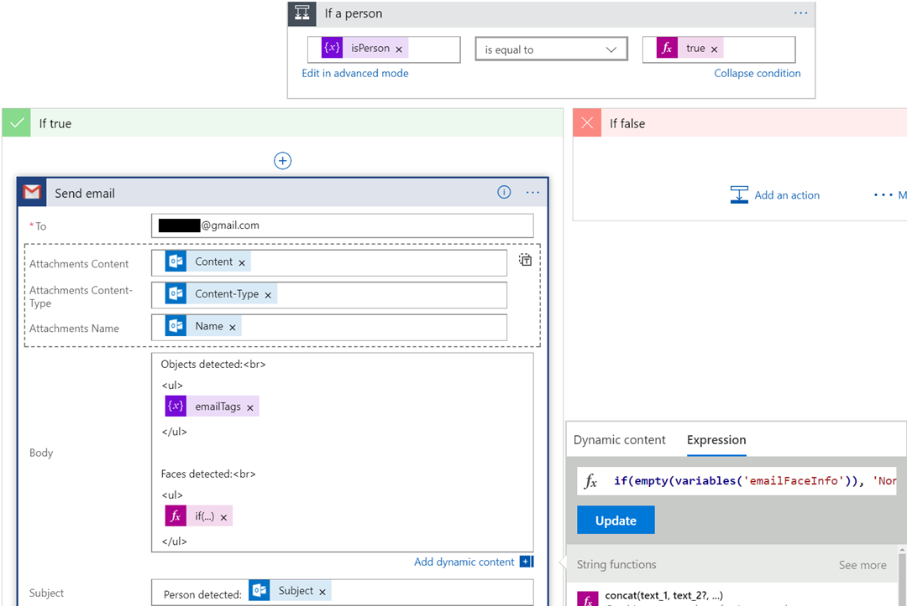

A sample email follows. I was a little lazy with leaving the facial hair info as JSON.

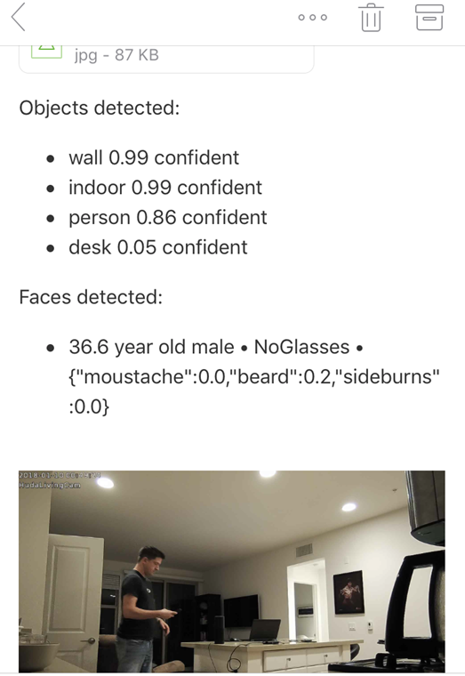

## Source, Refactoring

The JSON code view of this logic app is available as [HomeMonitor.json.txt](https://geoffhudik.com/wp-content/uploads/2018/01/HomeMonitor.json_.txt). With being new to logic apps and doing some of this hastily I'm sure it could be cleaned up. One thing I wanted to do was to eliminate a loop in cases with flattening some collection from a prior step but I wasn't positive how to go about that. Some things might have been easier calling out to an Azure function but I wanted to complete the exercise without writing any code.

## Testing

So how well did it work? My initial answer is okay but not great. Vision and face detection can be missed fairly easily with a person in motion where their face might be somewhat blurry or maybe they are looking away a bit. With a 5 second motion trigger and multiple images per trigger there's a chance that at least one photo will be recognized depending on the movement, camera location and settings, etc.

## Debugging and Some Issues Along the Way

### Run History Debugging

I was pretty impressed by the output of Runs History which made it easy to see what steps of the workflow failed and generally had some pretty detailed, useful error messages. Here I realized I needed to explicitly convert output from a previous step to a string.

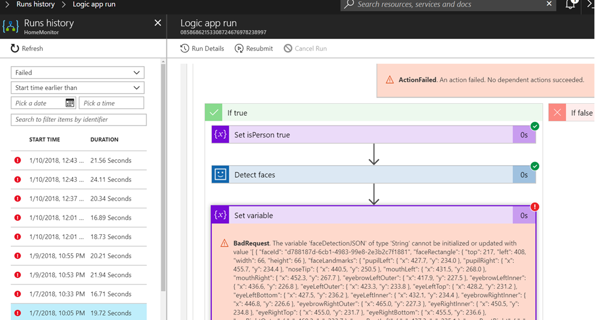

### Loop Parallelism with Variables

Early on when the logic app ran I was noticing duplicate vision tags in emails as if results of processing multiple email attachments were being partially merged. This [Adding Variables to Logic Apps](http://www.bizbert.com/bizbert/2017/03/25/AddingVariablesToLogicApps.aspx) post tipped me off to the problem and I had to turn loop parallelism off for loops using variables.

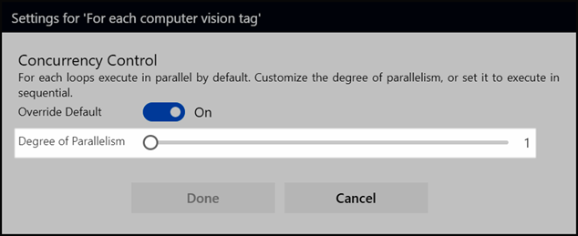

### Empty and Null String Variables

Speaking of variables, it wasn't entirely obvious to me how to set a variable to null or an empty string within the designer or to do the .NET equivalent of checking string.IsNullOrEmpty(). I did notice null show up within the Expression tab and an empty function that was available for "". The coalesce and replace functions are other options.

### Workflow Designer Quirks

There were some designer limitations and quirks that at times forced me to switch to the code view. Sometimes the tags and surrounding text didn't mix well together when editing and some things were reformatted somewhat after a save and reload of the app. Some quirks like the below where dialogs were overlapping I worked around by temporarily hiding elements using the Chrome dev tools. Overall though I was impressed with the quality of the designer.

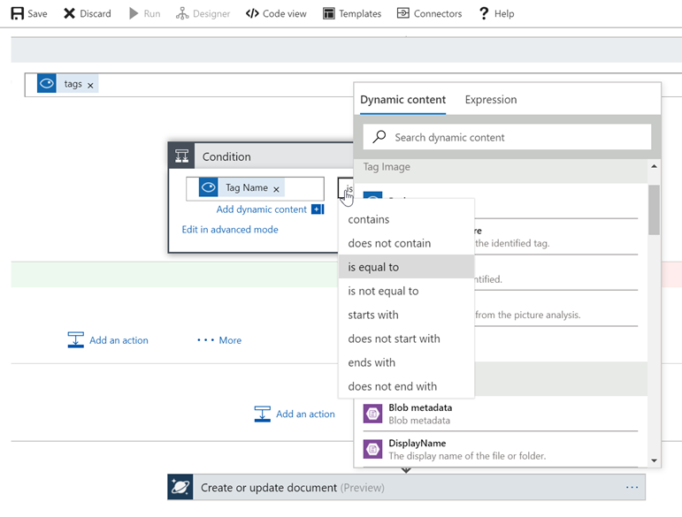

## Going Further

Thoughts for extending this in the future...

### FTP as Source and Alert Videos

I wanted to go back to using FTP to send the alerts but never got around to it. Also for quite a while I didn't notice the FTP video option in the Foscam web based setup tool under Record\\Storage Location. I assumed there'd be a setting for it in the FTP settings but didn't see it. MKV videos uploaded to FTP without issue and it'd be interesting to run video analysis and have short videos uploaded to blob storage.

### Browsing Alerts

It would be straightforward to have an Azure website with authentication that generated thumbnails of alert images and allowed search, filter, paging, and viewing full images with associated computer vision data using the data in Cosmos DB and blob storage.

### Cleanup

Eventually deleting older alert data out of blob storage and Cosmos DB would be ideal using Azure Functions, web jobs, or similar.

### Programmatic Camera Control

It looks like there may be some API info out there around Foscam and even at a basic level most of these cameras seem to have similar CGI commands that are well known. For example I can hit _http://192.168.0.111:88/cgi-bin/CGIProxy.fcgi?cmd=snapPicture2&usr=username&pwd=password&_ and it snaps a live picture. Now that's within my local network and I might not be able to get that directly from the cloud. However, I have a [Raspberry PI](https://www.raspberrypi.org/) that could execute such commands in response to events from Azure that it listens for. That output could be sent to Azure and used for a near live camera image in an Azure web app. It might be possible to do something similar for a video stream and maybe to execute commands like pan, tilt, zoom, etc.

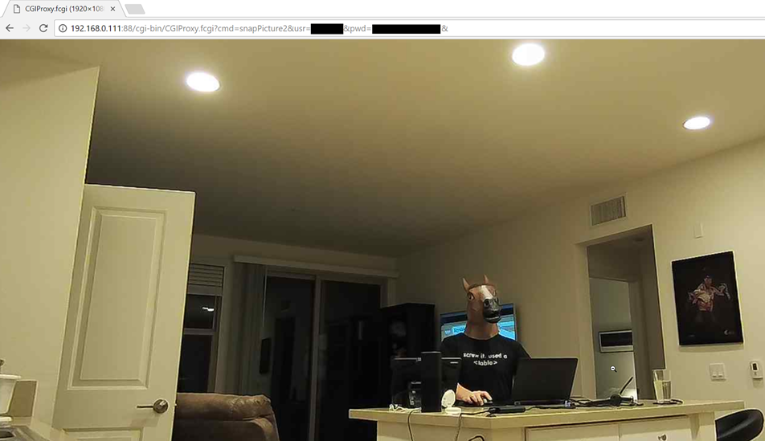
