 [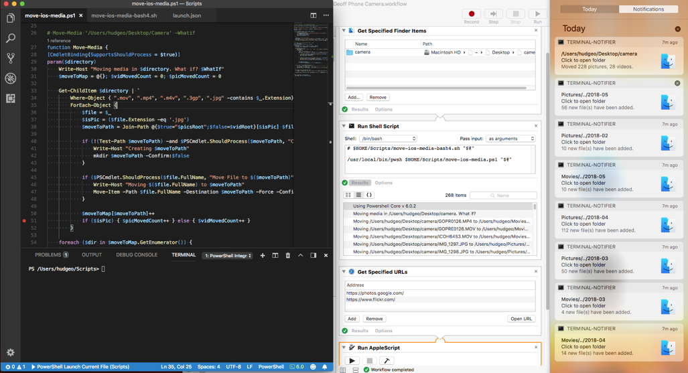](https://geoffhudik.com/wp-content/uploads/2018/05/run-workflow-automator-large3.png) 

## Background

### The Media Import Process

Every 3 months or so I offload camera roll photos and videos from my iPhone to my Mac. The process usually looks like this:

1. Connect iPhone to Mac via lightning cable and unlock iPhone
2. Open Preview, import from iPhone to a Desktop/camera folder
3. Delete unwanted photos in Desktop/camera
4. Move photos in Desktop/camera to per-month folders under $HOME/Pictures (creating folders as needed)
5. Move videos in Desktop/camera to per-month folders under $HOME/Movies (creating folders as needed)
6. Delete media from iPhone in Preview, delete Desktop/camera folder
7. Sync and optionally upload all / some photos online to various services
8. Optionally further organize, edit photos and their metadata online

### Media Organization

The per-month folders are organized in a YYYY/YYYY-MM structure like this:

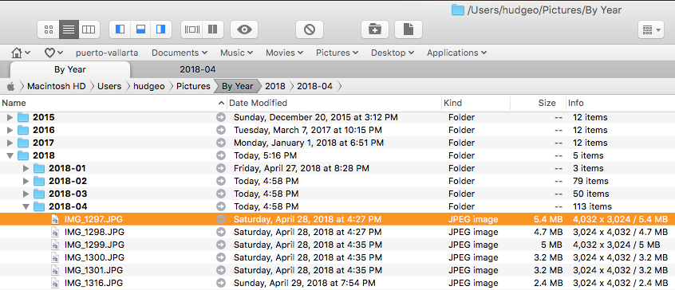

The above screenshot is from [Path Finder](https://cocoatech.com/#/) which I highly recommend over Finder.

There are a number of reasons for a date based hierarchy like this. That rationale is not the focus of this post but in short:

- Photos are easily indexed by date
- Not too many or too few files per folder
- Prevents naming conflicts, inconsistencies inherit with content based naming
- Consistent naming convention for sort, index, automation, media growth over time
- Content identification generally better done in applications with albums, tagging, metadata

### The Problem

Some of these steps could certainly benefit from at least partial automation. Specifically, manually creating per-month photo and video folders and moving files there based on date always bugged me because it's something well suited for automation. However it didn't take that much time to create a small handful of folders, sort by date, and drag files over and I only did it every few months. That and laziness kept me doing things manually for a while.

### Why Not Just Use Photos, iPhoto, and/or iCloud?

While use of the Photos app (or older iPhoto) and iCloud photo library would streamline things, I've never bought into that approach. For one, I don't like my original media files being obfuscated / hidden; I like being able to browse and manage directly on the file system. I'm also not a fan of being "locked in" to one main app to view and edit media, especially when those apps tend to be "dumbed down". I've also had issues with those apps in the past with corrupted libraries and crashing bugs that kept me from my media. Likewise it would further lock me into the Apple ecosystem and they just don't tend to play well with others, unlike Microsoft and Google, and that maddens me more every day. I also know that my time on Mac and iOS as my primary operating systems may not be long-lived. Finally I'd have to pay more for iCloud storage and I'm already paying for more unlimited cloud storage with other providers that are more vender and device neutral.

### The Solution

There are some (mostly UI) tools that assist with parts of the import process but in general I've found they don't quite do what I want, have some limitations, or are slower to use.

My initial solution went like this:

1. I started off with a Bash script as it lends itself to automation and is lightweight and fully customizable.
2. Later I complemented this with an Automator service that targets folders, allowing me to right click a folder in Finder / Path Finder and invoke the service to move media files in that folder to the appropriate per-month folders.
3. Next I swapped the Bash script out for [PowerShell Core](https://blogs.msdn.microsoft.com/powershell/2018/01/10/powershell-core-6-0-generally-available-ga-and-supported/) because Bash and I are not good friends.

### Discovery Work for Potential Future Solutions

1. Next I experimented with some related media automation such as automating transfers from iPhone to Mac.
2. Gave thought to ways of utilizing the cloud and other tools to do image detection and tagging.

## Automator

I had not used Automator much in the past and never for a service so most of this was new to me.

### New Service

After opening Automator I first chose the option for a Service, though Folder Action and Image Capture Plugin are interesting options as well.

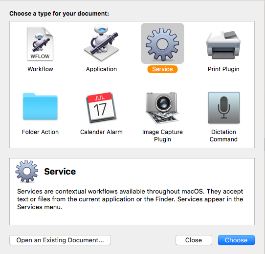

First up I changed "service receives selected" to "folders":

### Action: Get Finder Items

The first action is to get specified finder items. This will correspond to the folder(s) passed into the service.

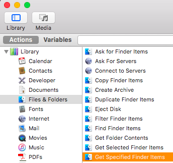

For testing purposes within Automator I preselected an existing directory but it's important to remove this later, otherwise the folders get used in addition to any other folders passed in when the service is run externally later. Or the folder can remain but the action can be disabled

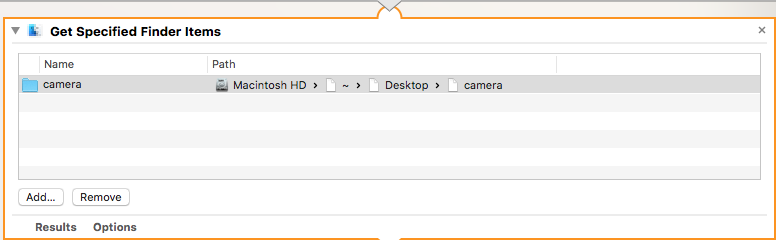

### Action: Run Shell Script

There are a few options for executing the logic to move the files around. These including chaining together different actions, Automator recording, executing AppleScript, or running a shell script. Since I started with a Bash script initially I went with the shell script. I'll discuss the logic of this step in the next section.

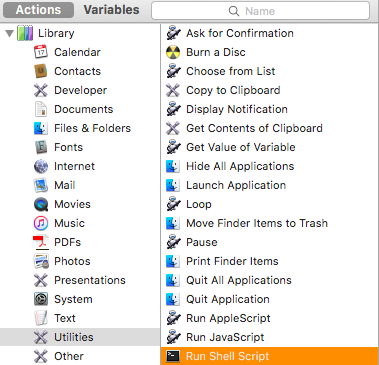

### Action: Get Specified URLs

After updating my photo library it'll sync to the cloud and I may want to add albums or otherwise further work with them online. This step specifies URLs to be launched in the next step. It's import to check the option of ignoring input to this action from the prior shell script action, otherwise the output of the shell script would be sent in as additional URLs to open; ask me how I know and about the hundreds of empty Chrome tabs it created.

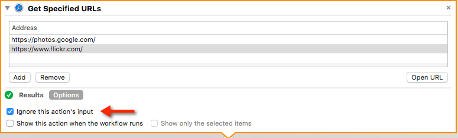

### Action: AppleScript (open URLs)

This step uses AppleScript to open Chrome tabs for each URL defined in the previous step.

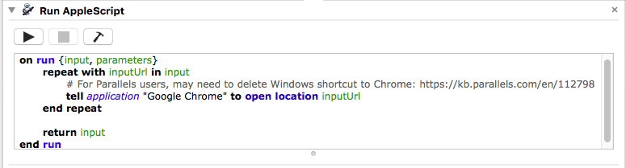

As you can see from my comment, on the first run I was surprised to see that instead of launching Chrome on Mac it launched Chrome on Windows via [Parallels](https://www.parallels.com/products/desktop/). What was taking so long I wondered as Parallels, the VM, and Windows loaded.

While I could probably alter the script to launch Chrome differently, I ended up just [deleting most of the Parallels Windows shortcuts](https://kb.parallels.com/en/112798) as I end up inadvertently launching them too often anyway. It seemed I had to also uncheck "Share Windows applications with Mac" in Options/Applications under Boot Camp configuration.

### Accessing the Service Outside Automator

Once I saved the Automator workflow it showed up in the Services menu when right-clicking folders in Finder or Path Finder for execution:

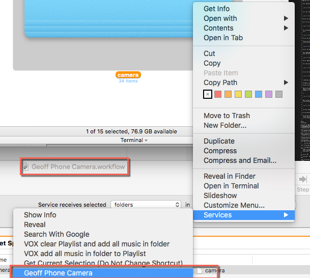

## The Bash Script

I'm not a Bash guy and that probably shows in the script so keep that in mind :).

### Tying into Automator, Editing, Debugging

Editing the Bash script directly in Automator would be painful so I mostly used [Visual Studio Code](https://code.visualstudio.com/) to edit. Saving as move-ios-media.sh and making it executable, I'd first test in Code's [Integrated Terminal](https://code.visualstudio.com/docs/editor/integrated-terminal) with `./move-ios-media.sh '/Users/hudgeo/Desktop/camera'`. When testing in Automator it would often not provide feedback of script issues, so it was easier to debug running from the terminal:

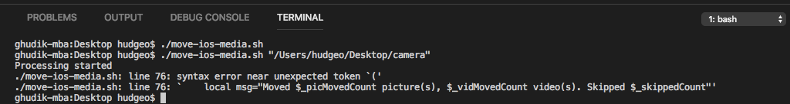

When testing in Automator I was initially just copying the code from the script file into Automator which does have the benefit of being self-contained. However it's a bit more convenient to just have Automator call the script externally:

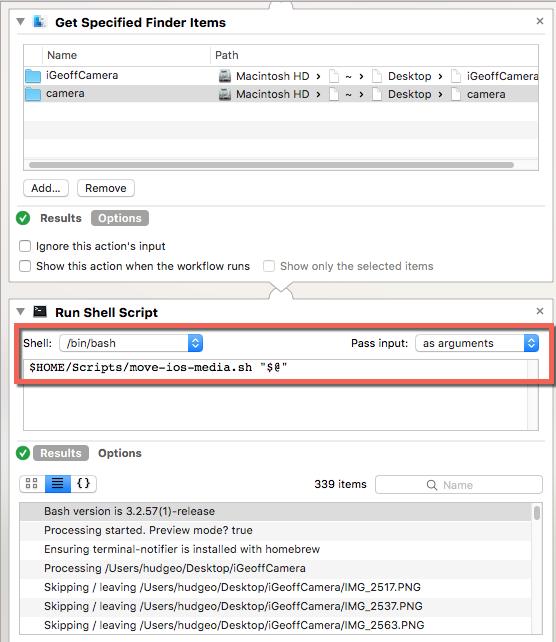

The other important thing in Automator for this action is changing "pass input" from the default of "to stdin" to "as arguments".

### Script Skeleton

At the top of the script are some flags to control behavior. Preview mode is useful when changing and testing the script as there's no easy undo for the file operations if there are problems or further changes to test. "Fancy" notifications, if enabled, are provided by [terminal-notifier](https://github.com/julienXX/terminal-notifier) which the script ensures is installed using [Homebrew](https://brew.sh/) which the script assumes was previously installed. At the bottom of the script it loops through each folder passed to the service (usually just one in my use case) and calls a function to process it.

\[bash\] #!/bin/bash

\# Script to organize photos and videos, intended for iOS camera roll media previously imported to Mac. # Images and videos in given source folder(s) are moved to YYYY/YYYY-MM folders under $HOME/Pictures/By Year/ # and $HOME/Movies/By Year/ respectively. PNGs (usually screenshots) remain. # .AAE photo edit metadata files are removed.

\# Set to true to preview what changes would be made on disk w/o making them. \_previewMode=false

\# Set to true to use nicer notifications with icons and folder open actions. # This requires 3rd party terminal-notifier app; gets installed by script but requires homebrew as prereq. \_fancyNotify=true

\# Set to true to automatically open any/all target directories where files get moved to. \_autoOpenFinderFolders=false

\# Note Automator is stuck on bash 3 where we can't use things like associative arrays. echo "Bash version is ${BASH\_VERSION}"

\# ... functions here, omitted for brevity ...

echo "Processing started. Preview mode? ${\_previewMode}"

if \[ "$\_fancyNotify" = true \] then # Won't reinstall if already installed and will be quick. echo "Ensuring terminal-notifier is installed with homebrew" brew install terminal-notifier fi

for arg in "$@" do processDir "$arg" done

echo "Processing complete" \[/bash\]

### Processing a Directory

The `processDir` function starts by initializing some variables and getting a list of files in the directory (no subdirectories given flat camera import intent).

\[bash\] processDir() { local dir="$1" echo "Processing $dir"

local picsRoot="$HOME/Pictures/By Year" local vidRoot="$HOME/Movies/By Year" local picMovedCount=0 local vidMovedCount=0 local skippedCount=0

local files=$dir/\*.\* local targetDirs=()

\# ... } \[/bash\]

In the loop through each file, the target directory is determined, along with the type of file. Each file is moved or skipped and stats are tracked. PNG files are skipped because they are usually screenshots and not actual pictures I want moved; these I leave behind and review manually.

\[bash\] for file in $files do # Get file last modified date. Might also consider created date or reading EXIF metadata from files. # Use stat and format date modified as YYYY-YYYY-MM i.e. 2018/2018-02. Using "date -r" could work too. local yearMonth=$(stat -f "%Sm" -t "%Y/%Y-%m" $file) local ext="${file##\*.}" local moveToPath="" local type="skip"

if \[ $ext == 'MOV' \] || \[ $ext == 'MP4' \] || \[ $ext == 'M4V' \] || \[ $ext == '3GP' \] then moveToPath="$vidRoot/$yearMonth" type="video" elif \[ $ext == 'JPG' \] then # leave PNG, other photo file extensions in the original directory # these are likely web and social media downloads to review manually before moving to photos directory moveToPath="$picsRoot/$yearMonth" type="pic" else echo "Skipping / leaving $file" skippedCount=$((skippedCount+1)) fi

if \[ ! -z "$moveToPath" \] then moveFile $file "$moveToPath" targetDirs+=("$moveToPath") fi

if \[ $type == "pic" \] then picMovedCount=$((picMovedCount+1)) elif \[ $type == "video" \] then vidMovedCount=$((vidMovedCount+1)) fi done \[/bash\]

During the above loop a `targetDirs` array is appended to for each target directory where a photo or video is moved to. Because Bash 3 doesn't support dictionaries, this array has duplicates so the below code gets the unique directories and sends Mac OS notifications for each directory where files were moved to.

\[bash\] if \[ ${#targetDirs\[@\]} -ge 1 \]; then eval uniqueTargetDirs=($(printf "%q\\n" "${targetDirs\[@\]}" | sort -u))

for targetDir in "${uniqueTargetDirs\[@\]}" do IFS='/'; dirParts=($targetDir); unset IFS # Shorten directory name for title so it's not cut off. i.e. "Pictures/../2018-04" local dirName="${dirParts\[3\]}/.../${dirParts\[6\]}" notify "${dirName}" "New file(s) have been added." "$targetDir" echo "New files have been added to ${targetDir}."

if \[ "$\_autoOpenFinderFolders" = true \] then echo "Opening $targetDir" eval "open \\"${targetDir}\\"" fi done fi \[/bash\]

Finally there's some cleanup of some unneeded files and a notification is shown for the overall counts of moved and skipped files for each directory.

\[bash\] if \[ "$\_previewMode" = false \] then # cleanup. AAE files get created when editing image on phone (for revert reasons) echo "Removing $dir/\*.AAE"

\# note the quotes are not around the whole expression just the var rm -f "$dir"/\*.AAE else echo "Removing $dir/\*.AAE (preview)" fi

local msg="Moved ${picMovedCount} pictures, ${vidMovedCount} videos. Skipped ${skippedCount}." echo "Organized media in ${dir}. ${msg}" notify "${dir}" "${msg}" "${dir}" \[/bash\]

### Moving a File

Moving a file is pretty straightforward - just some functionality to support preview and creating the target directory first if it doesn't already exist.

\[bash\] moveFile() { local src="$1" local dest="$2"

if \[ "$\_previewMode" = false \] then echo "Moving $src to $dest"

if \[ ! -d "$dest" \]; then # make sure the directory exists first, otherwise end up with file echo "Creating ${dest}" mkdir -p dirname "$dest" fi

mv "$src" "$dest" else if \[ ! -d "$dest" \]; then echo "Creating ${dest} (preview)" fi

echo "Moving $src to $dest (preview)" fi } \[/bash\]

### Notification Functions

Finally there's some notification functions - one for the "fancy" notifications relying on a 3rd party app, one for native AppleScript notifications, and one that conditionally switches between functions based on the script level variable.

\[bash\] function notify { local title="$1" local msg="$2" local folder="$3"

if \[ "$\_fancyNotify" = true \] then notify\_fancy "$title" "$msg" "Click to open folder" "$folder" else notify\_applescript "$title" "$msg" "$folder" fi }

function notify\_applescript() { local title="$1" local msg=$2 local subtitle="$3" osascript -e "display notification \\"${msg}\\" with title \\"${title}\\" subtitle \\"${subtitle}\\" sound name \\"Pop\\"" }

function notify\_fancy() { local title="$1" local msg="$2" local subtitle="$3" local folder="$4"

local photosImage="https://i.imgur.com/mjW8IQd.jpg" local finderImage="https://i.imgur.com/Saz2BG2.png"

\# we could also tweak PATH; Automator can't target /usr/local/bin directly. /usr/local/bin/terminal-notifier -title "$title" -subtitle "$subtitle" -message "$msg" -execute "open '$folder'" -appIcon $photosImage -contentImage $finderImage -sound "Pop" } \[/bash\]

A standard notification looks like this. It's plain and non-interactive but doesn't require downloading, installing, or running anything additional.

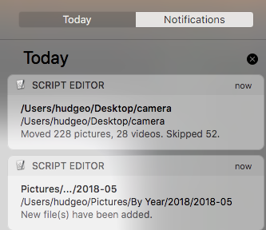

The "fancy" version includes images and is interactive; clicking the notification will launch the corresponding directory in Finder.

When the notification is "in-flight" (before it gets to Notification Center) it looks like:

## Enhancing Things with Bash 4

Bash v4 adds various useful language features such as associative arrays, which made it easier for me to track things like how many files were moved to each target directory.

### Upgrading to Bash 4

I first followed [Upgrade to bash 4 in Mac OS X](http://clubmate.fi/upgrade-to-bash-4-in-mac-os-x/) to get my standard shell upgraded to Bash v4. Afterwords I did some basic tests in Terminal and VS Code's Integrated Terminal and saw that `$BASH_VERSION` changed from "3.2.57(1)-release" to "4.4.19(1)-release" and I could use the latest language features.

### Bash 4 Script Changes

Bash 4 lives elsewhere so at the top of the script `#!/bin/bash` was changed to `#!/usr/local/bin/bash`.

The main change for bash v4 is in the `processDir` function. First an associative array is declared above the file loop with `declare -A moveToMap`. Inside the loop `let '++moveToMap[$moveToPath]'` increments the count of files moved to each target directory, relying on the fact that an unset value is considered 0. This also allowed me to get rid of `local targetDirs=()` and the hacky print / sort to get the unique values from that array.

\[bash highlight="1,10"\] declare -A moveToMap

for file in $files do # ...

if \[ ! -z "$moveToPath" \] then moveFile $file "$moveToPath" let '++moveToMap\[$moveToPath\]' fi

\# ... done \[/bash\]

After the loop the script can just loop through those unique values, and grab the count for each directory files were moved to and include that in the notifications.

\[bash highlight="3,7,8"\] for targetDir in "${!moveToMap\[@\]}" do local count=${moveToMap\[$targetDir\]} IFS='/'; dirParts=($targetDir); unset IFS # Shorten directory name for title so it's not cut off. i.e. "Pictures/../2018-04" local dirName="${dirParts\[3\]}/.../${dirParts\[6\]}" notify "${dirName}" "${count} new file(s) have been added." "$targetDir" echo "New files (${count}) have been added to ${targetDir}."

if \[ "$\_autoOpenFinderFolders" = true \] then echo "Opening $targetDir" eval "open \\"${targetDir}\\"" fi done \[/bash\]

Now each folder move notification is a bit more informative:

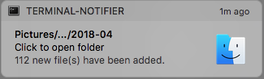

### Automator and Bash 4

The Bash 4 changes I saved to a separate file (move-ios-media-bash4.sh) and it worked fine at the terminal. Unfortunately I had some issues getting Automator to target bash 4 initially.

**Attempt 1**. I copied the contents of the bash 4 version of the script to the Automator action as inline script. Despite the first line being `#!/usr/local/bin/bash` that corresponds to bash v4 shell, clearly the bash v3 shell was still getting invoked:

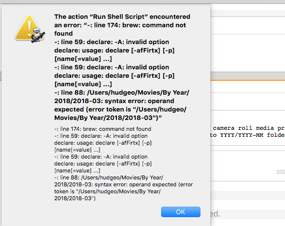

It seemed obvious the shell dropdown setting was overriding the shebang in the inline script but the v4 shell /usr/local/bin/bash wasn't an option in the list:

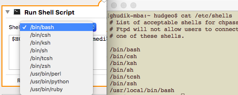

**Attempt 2**. After I deleted and readded the Run Shell Script Action, /usr/local/bin/bash would show up temporarily in the shell list. By that I mean after saving, exiting, and reopening Automator, the entry would be gone again. Also selecting another option would likewise remove it. While I did have the action shell pointed there, it wouldn't work when I ran it:

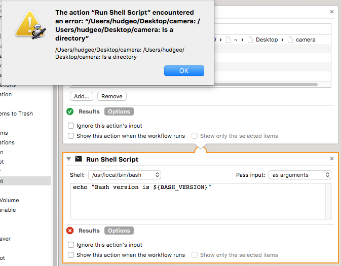

I tried temporarily taking out the passing of the directory but even simple echo statements wouldn't be shown in the results. From what I could tell online, bash on Mac was frozen at the latest non-GPLv3 licensed build, at least in terms of what's installed and active by default and supported in tools like Automator. PATH and bash profile changes were of no use.

**Attempt 3**. The 3rd time was the charm. Changing the shell action to remove the inline bash 4 script and instead invoke the script file resulted in the bash shell version being respected.

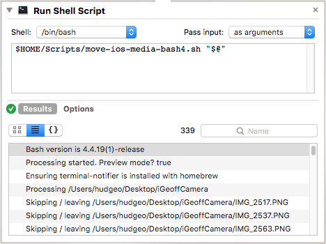

### Anything but Bash

I didn't "grow up" with Bash being a Windows developer and only switching to Mac in recent years. I've only occasionally used it and feel it hasn't aged well. I don't want to bash on Bash ([ba-dum-bum-CHING](http://instantrimshot.com/index.php?sound=rimshot&play=true)) but it feels archaic to me, limited, and unintuitive. It tripped me up a number of times around whitespace, quotes and more. Had I realized I'd be spending more time with Bash than originally thought, I'd probably have used Ruby or Python from Automator.

After finishing things in Bash I was reminded of [PowerShell Core](https://blogs.msdn.microsoft.com/powershell/2018/01/10/powershell-core-6-0-generally-available-ga-and-supported/) and its cross platform support. Given my familiarity with PowerShell for Windows and all that .NET Core brings, trying things out in PowerShell Core made sense to me.

## PowerShell Core

[Installing PowerShell Core on Mac](https://docs.microsoft.com/en-us/powershell/scripting/setup/installing-powershell-core-on-macos?view=powershell-6) was very simple, especially with using [Homebrew](https://brew.sh/) which was a better experience than the DMG/PKG installer I had used before it went GA.

With PowerShell Core the script became simplified and more flexible, readable, and maintainable IMO, at least for me.

### Debugging

In addition to the nicer syntax and capability of PowerShell and .NET Core, it's also nice having first class debugging in VS Code via the [PowerShell extension](https://marketplace.visualstudio.com/items?itemName=ms-vscode.PowerShell):

 [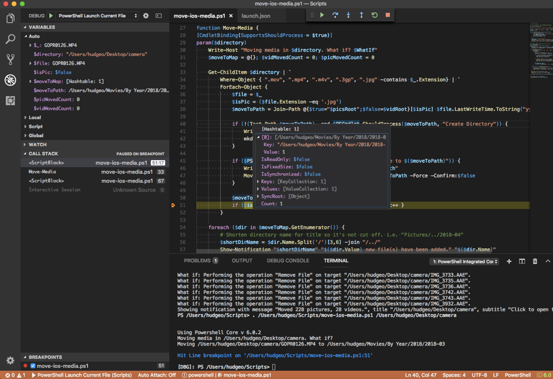](https://geoffhudik.com/wp-content/uploads/2018/05/vscode-pscore-debug-large.png) 

### Automator Change

In Automator I changed the Run Shell Script action as follows to invoke PowerShell instead of Bash:

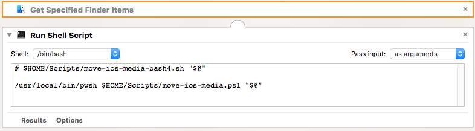

## Sample Service Run

Below is a sample service run with the Automator service using PowerShell Core and set to automatically open folders files were moved to.

<iframe src="https://player.vimeo.com/video/270792372" width="640" height="400" frameborder="0" allowfullscreen></iframe>

## Related Automation Research

### Automator App to Import Using Preview (Proof of Concept)

As a related automation step I experimented with automating Preview to import pictures from my phone. This assumes of course that the phone is plugged in and unlocked. This was created using the Application project type in automator so it could be quickly launched via Launch Pad for example. Once the project was saved in Automator, both Automator and the new app had to be setup in Mac's Privacy Settings as allowed to control the computer.

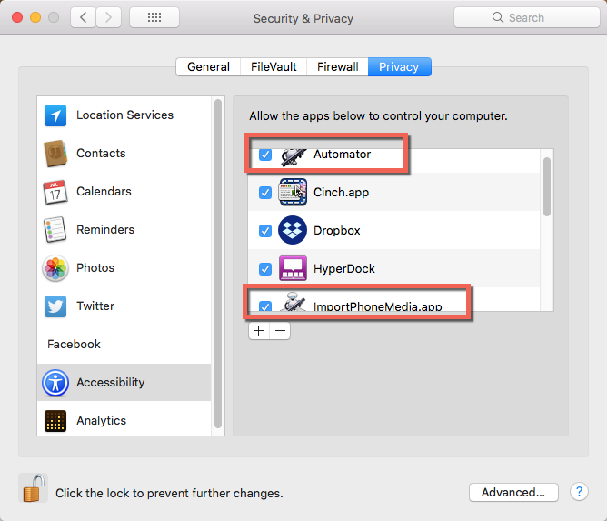

The Automator project consisted of a single AppleScript step with the below code. Keep in mind this code is hacky, brittle, and hastily done as a proof of concept. While it worked for me during evaluation, I'd definitely recommend cleaning it up for any real use to make it more resilient.

Knowing how to address screen elements in code wasn't always obvious. For example, the only way I knew the Import All button was in group 1 and I had to specify that was using a 3rd party app called [UI Browser](http://pfiddlesoft.com/uibrowser/):

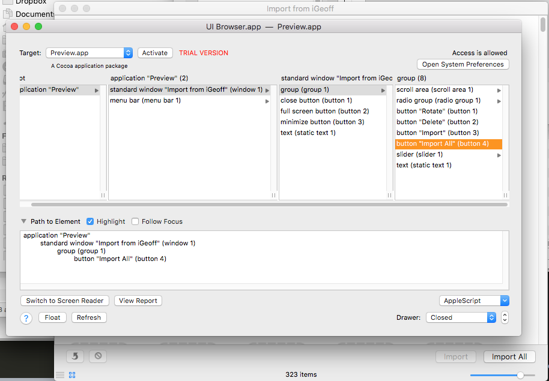

### AutoImporter

I stumbled across a pre-installed AutoImporter app at /System/Library/Image Capture/Support/Application. Inside the Image Capture application it let me choose AutoImporter as the app to run when my phone was connected and AutoImporter settings allowed some control over where the content goes:

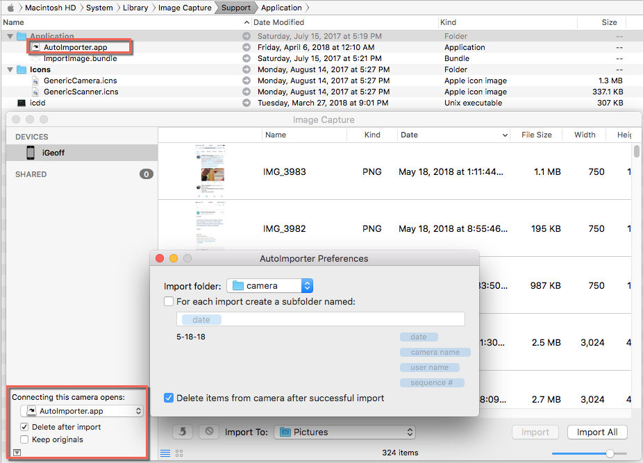

Unfortunately AutoImporter crashed consistently when the phone was connected, and often just launching it by itself with no phone connection. It never imported anything. I started to dive into the Console logs and research the issue but didn't have the energy or time to really dig in.

It's possible to do similar automated camera connected actions in other apps such as using [Dropbox Camera Uploads](https://www.dropbox.com/help/photos-videos/camera-uploads-overview) though it's not always desirable to import photos when the phone is connected to the Mac and personally I don't store my pictures on Dropbox.

## Future Ideas to Explore

### Automator Folder Action Using Azure Cognitive Services to Tag Images

Another thought for the future is an Automator folder action that reacts when a new photo has been added to a folder (like my Desktop/camera folder). It would invoke PowerShell Core code that would interact with [Azure Cognitive Services](https://azure.microsoft.com/en-us/services/cognitive-services/), namely [Computer Vision](https://azure.microsoft.com/en-us/services/cognitive-services/computer-vision/) and [Facial detection](https://azure.microsoft.com/en-us/services/cognitive-services/face/?v=18.05) to automatically analyze each new photo. That data would in turn be used to [Tag Mac OSX files](https://github.com/jdberry/tag) so the the photo files are automatically pre-tagged with known persons and objects. That data could potentially also be passed along to online services like Flickr, Google Photos, Facebook etc.

Azure has a lot of great documentation here such as [How to identify faces in images](https://docs.microsoft.com/en-us/azure/cognitive-services/face/face-api-how-to-topics/howtoidentifyfacesinimage). There are a few ways to interact with such services in this context including PowerShell modules such as [ps-AzureFaceAPI](https://github.com/MLauper/ps-AzureFaceAPI), the [.NET Core SDK for the Microsoft Face API](https://github.com/Microsoft/Cognitive-Face-DotNetCore), [REST API calls](https://docs.microsoft.com/en-us/azure/cognitive-services/face/apireference), etc.

## Files and Closing Thoughts

### Files

[move-ios-media-files.zip](https://geoffhudik.com/wp-content/uploads/2018/05/move-ios-media-files.zip) contains:

- Geoff Phone Camera.workflow - Sample workflow shown to organize media
- move-ios-media.sh - Original Bash v3 version of the script previously called from workflow
- move-ios-media-bash4.sh - Bash v4 version of the script previously called from workflow
- move-ios-media.ps1 - PowerShell core version of the script called from the workflow
- PreviewImportIphone.AppleScript - Brittle proof of concept AppleScript for automating iPhone camera import from Preview

### Media Backup

Also, it may go without saying but I highly recommend having a good backup system for camera media. I can't believe how many times people have told me they lost years of photos (and other content for that matter) when a hard drive or phone died.

For example:

- [iCloud Photo Library](https://support.apple.com/en-us/HT204264)
- [Google Photos](https://photos.google.com/) including [Backup and Sync apps](https://photos.google.com/apps) (desktop and phone)
- [Flickr Tools](https://www.flickr.com/tools/) including iOS sync (phone and desktop)
- [Dropbox Camera Uploads](https://www.dropbox.com/help/photos-videos/camera-uploads-overview) (phone and desktop)
- Automatic desktop cloud backup apps like [Backblaze](https://secure.backblaze.com/r/01r1wd)
- Periodic full, thorough desktop backups such as [Time Machine](https://support.apple.com/en-us/HT201250)
