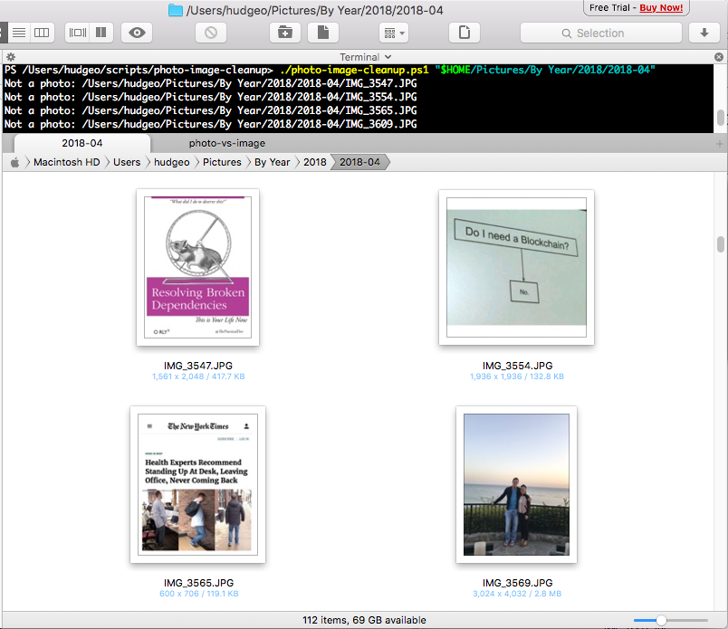
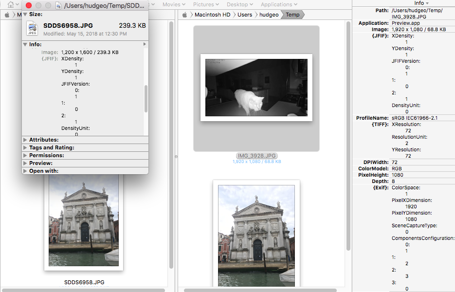
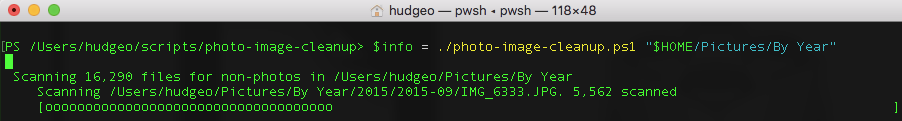
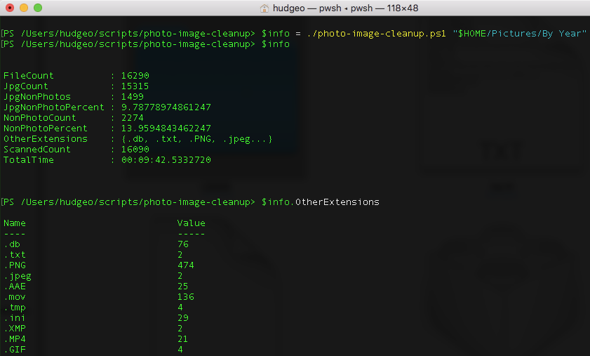
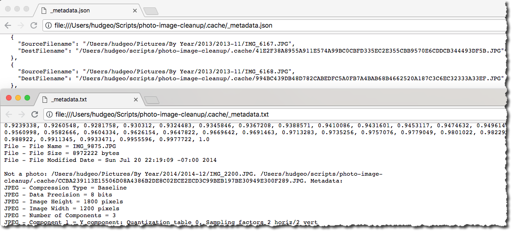
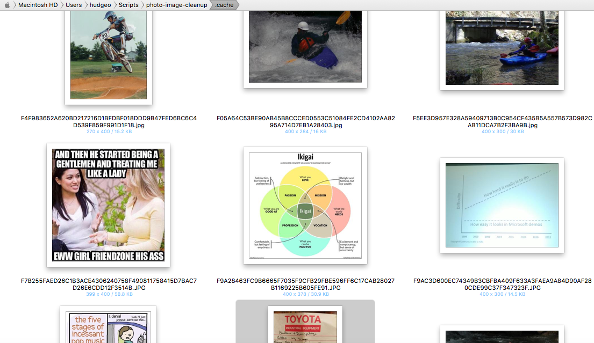

Inside the various subfolders of my picture library are files I would classify as images and not photos. Here I'm classifying images as image files I downloaded from the web or social media, screenshots and the like. Photos I'm classifying as taken from a camera, usually my mobile phone. For example:

I really don't want these screenshots, web downloads, or JPG files that aren't camera photos mixed in with my photos. Generally I've been good about deleting or separating such files in the past but sometimes it's too much work or otherwise gets missed. Occasionally there are also video files mixed in with the pictures which I normally prefer storing under a separate root folder.

Especially as these files sync to the cloud on various online services, I wanted to do some image cleanup. However I certainly didn't want to do that manually for thousands of photos stored per-month over the past 16 plus years. What I really wanted was a script to move or delete the non-photos, perhaps with some kind of preview support in case I inadvertently delete or move the wrong files in cases.

## Determining Image vs Photo

### Methods

File type – For example, I know that a PNG is a web optimized image and is not likely a photo, though it's possible a photo was converted to PNG. I know JPGs are often photos but of course that alone is not enough to determine if a photo.

File size – Photos from my iPhone 7 are often in the 2-6 MB range but front facing camera photos might only be 700 KB or so. Very small image file sizes could possibly be excluded but this isn't a good metric, especially for photos captured with cameras from many years ago.

EXIF and other image metadata - This is what I was really after for the best indication with the least effort. While it's possible EXIF and other image metadata is partially missing or has been altered, it's generally rich information already embedded into each file.

AI / Machine Learning - I knew eventually I'd probably want to leverage machine learning with a model representing the kind of non-photos I'm looking to delete / move. Or perhaps more simply, basic facial, object, and text image detection to help determine photo vs image. Either way I knew I'd likely be leveraging the cloud for this.

### Plan of Attack

I knew these non-AI methods wouldn’t get me all the way there but they’d greatly narrow down the number of photos I’d need to send to cloud services for more intelligent analysis. This post focuses on my first step of narrowing down the non-photo list using image metadata. Hopefully a follow-up post will include some AI use to complete the process.

## Image Metadata Discovery

### Finding a Library

Initially I found some PowerShell code to read EXIF data but it relied on the COM object Shell.Application and that wasn't going to work in PowerShell Core on Mac. I then found [metadata-extractor-dotnet](https://github.com/drewnoakes/metadata-extractor-dotnet) and noticed it supported .NET Core and was [available on NuGet](https://www.nuget.org/packages/MetadataExtractor/). Perfect.

### Installation

At first I tried `Install-Package MetadataExtractor` and various derivatives but ran into a [OneGet issue](https://github.com/OneGet/oneget/issues/360). Even if that issue were solved, it appeared that [using a package from Install-Package is more difficult than it should be](https://github.com/PowerShell/PowerShell/issues/6724).

After giving up on [Install-Package](https://docs.microsoft.com/en-us/powershell/module/packagemanagement/install-package?view=powershell-6) I ended up installing the package in a temporary project in Visual Studio for Mac. Then I copied the .NET Standard Library from `$HOME`/.nuget/packages to my script folder. I also quickly realized I needed to copy its dependency [XmpCore](https://www.nuget.org/packages/XmpCore/). Then I needed to explicitly load both MetadataExtractor and its dependency XmpCore using [Add-Type](https://docs.microsoft.com/en-us/powershell/module/microsoft.powershell.utility/add-type?view=powershell-6).

### Reading Image Metadata

\[powershell\] using namespace MetadataExtractor

\[CmdletBinding()\] param ()

Add-Type -Path "$PSScriptRoot/MetadataExtractor.dll" Add-Type -Path "$PSScriptRoot/XmpCore.dll"

function Get-ImageMetadata ($imagePath) { Write-Verbose "Reading $imagePath" $metaDirs = \[ImageMetadataReader\]::ReadMetadata($imagePath)

foreach ($metaDir in $metaDirs) { foreach ($tag in $metaDir.Tags) { "$($metaDir.Name) - $($tag.Name) = $($tag.Description)" } } }

\# not valid (blockchain joke social media) Get-ImageMetadata "/Users/hudgeo/Pictures/By Year/2018/2018-04/IMG\_3554.JPG"

Write-Host; Write-Host ("-" \* 80); Write-Host

\# valid photo iPhone 7 Get-ImageMetadata "/Users/hudgeo/Pictures/By Year/2018/2018-04/IMG\_3702.JPG"

Write-Host; Write-Host ("-" \* 80); Write-Host

\# old image digital camera non-phone Get-ImageMetadata "/Users/hudgeo/Pictures/By Year/2002/2002-12/2002-12 (1).jpg" \[/powershell\]

### Evaluating Image Metadata results

The non-photo image metadata output looked like this (i.e. web image or screenshot):

\[text\] JPEG - Compression Type = Baseline JPEG - Data Precision = 8 bits JPEG - Image Height = 1936 pixels JPEG - Image Width = 1936 pixels JPEG - Number of Components = 3 JPEG - Component 1 = Y component: Quantization table 0, Sampling factors 2 horiz/2 vert JPEG - Component 2 = Cb component: Quantization table 1, Sampling factors 1 horiz/1 vert JPEG - Component 3 = Cr component: Quantization table 1, Sampling factors 1 horiz/1 vert JFIF - Version = 1.1 JFIF - Resolution Units = none JFIF - X Resolution = 1 dot JFIF - Y Resolution = 1 dot JFIF - Thumbnail Width Pixels = 0 JFIF - Thumbnail Height Pixels = 0 Exif IFD0 - X Resolution = 72 dots per inch Exif IFD0 - Y Resolution = 72 dots per inch Exif IFD0 - Resolution Unit = Inch Exif IFD0 - YCbCr Positioning = Center of pixel array Exif SubIFD - Exif Version = 2.21 Exif SubIFD - Components Configuration = YCbCr Exif SubIFD - FlashPix Version = 1.00 Exif SubIFD - Color Space = sRGB Exif SubIFD - Exif Image Width = 1936 pixels Exif SubIFD - Exif Image Height = 1936 pixels Exif SubIFD - Scene Capture Type = Standard Exif Thumbnail - Compression = JPEG (old-style) Exif Thumbnail - X Resolution = 72 dots per inch Exif Thumbnail - Y Resolution = 72 dots per inch Exif Thumbnail - Resolution Unit = Inch Exif Thumbnail - Thumbnail Offset = 274 bytes Exif Thumbnail - Thumbnail Length = 7348 bytes File - File Name = IMG\_3554.JPG File - File Size = 132876 bytes File - File Modified Date = Tue Apr 10 17:15:17 -07:00 2018 \[/text\]

A recent iPhone 7 camera image had about 4 times the attributes. Highlighted are attributes that stood out to me as target candidates for use in determining photo vs image.

\[text highlight="3,4,9,10,26,31,41,47,48,68,70,96,97"\] JPEG - Compression Type = Baseline JPEG - Data Precision = 8 bits JPEG - Image Height = 3024 pixels JPEG - Image Width = 4032 pixels JPEG - Number of Components = 3 JPEG - Component 1 = Y component: Quantization table 0, Sampling factors 2 horiz/2 vert JPEG - Component 2 = Cb component: Quantization table 1, Sampling factors 1 horiz/1 vert JPEG - Component 3 = Cr component: Quantization table 1, Sampling factors 1 horiz/1 vert Exif IFD0 - Make = Apple Exif IFD0 - Model = iPhone 7 Exif IFD0 - Orientation = Top, left side (Horizontal / normal) Exif IFD0 - X Resolution = 72 dots per inch Exif IFD0 - Y Resolution = 72 dots per inch Exif IFD0 - Resolution Unit = Inch Exif IFD0 - Software = 11.3 Exif IFD0 - Date/Time = 2018:04:28 16:30:52 Exif IFD0 - YCbCr Positioning = Center of pixel array Exif SubIFD - Exposure Time = 1/3195 sec Exif SubIFD - F-Number = f/1.8 Exif SubIFD - Exposure Program = Program normal Exif SubIFD - ISO Speed Ratings = 20 Exif SubIFD - Exif Version = 2.21 Exif SubIFD - Date/Time Original = 2018:04:28 16:30:52 Exif SubIFD - Date/Time Digitized = 2018:04:28 16:30:52 Exif SubIFD - Components Configuration = YCbCr Exif SubIFD - Shutter Speed Value = 1/3194 sec Exif SubIFD - Aperture Value = f/1.8 Exif SubIFD - Brightness Value = 10626/971 Exif SubIFD - Exposure Bias Value = 0 EV Exif SubIFD - Metering Mode = Multi-segment Exif SubIFD - Flash = Flash did not fire, auto Exif SubIFD - Focal Length = 4 mm Exif SubIFD - Subject Location = 2015 1511 2217 1330 Exif SubIFD - Sub-Sec Time Original = 547 Exif SubIFD - Sub-Sec Time Digitized = 547 Exif SubIFD - FlashPix Version = 1.00 Exif SubIFD - Color Space = Undefined Exif SubIFD - Exif Image Width = 4032 pixels Exif SubIFD - Exif Image Height = 3024 pixels Exif SubIFD - Sensing Method = One-chip color area sensor Exif SubIFD - Scene Type = Directly photographed image Exif SubIFD - Exposure Mode = Auto exposure Exif SubIFD - White Balance Mode = Auto white balance Exif SubIFD - Focal Length 35 = 28 mm Exif SubIFD - Scene Capture Type = Standard Exif SubIFD - Lens Specification = 3.99mm f/1.8 Exif SubIFD - Lens Make = Apple Exif SubIFD - Lens Model = iPhone 7 back camera 3.99mm f/1.8 Apple Makernote - Unknown tag (0x0001) = 9 Apple Makernote - Unknown tag (0x0002) = \[558 values\] Apple Makernote - Run Time = \[104 values\] Apple Makernote - Unknown tag (0x0004) = 1 Apple Makernote - Unknown tag (0x0005) = 177 Apple Makernote - Unknown tag (0x0006) = 178 Apple Makernote - Unknown tag (0x0007) = 1 Apple Makernote - Unknown tag (0x0008) = -1507/1515 633/18242 324/26129 Apple Makernote - Unknown tag (0x000c) = 51/128 75/256 Apple Makernote - Unknown tag (0x000d) = 39 Apple Makernote - Unknown tag (0x000e) = 4 Apple Makernote - Unknown tag (0x0010) = 1 Apple Makernote - Unknown tag (0x0014) = 1 Apple Makernote - Unknown tag (0x0016) = ARXCF3PHkGDtxrYwcUqzxM27F9+O Apple Makernote - Unknown tag (0x0017) = 0 Apple Makernote - Unknown tag (0x0019) = 0 Apple Makernote - Unknown tag (0x001a) = q825s Apple Makernote - Unknown tag (0x001f) = 0 GPS - GPS Latitude Ref = N GPS - GPS Latitude = 40° 46' 28.98" GPS - GPS Longitude Ref = W GPS - GPS Longitude = -73° 58' 12.14" GPS - GPS Altitude Ref = Sea level GPS - GPS Altitude = 26 metres GPS - GPS Time-Stamp = 20:30:52.000 UTC GPS - GPS Speed Ref = kph GPS - GPS Speed = 0 GPS - GPS Img Direction Ref = True direction GPS - GPS Img Direction = 317.34 degrees GPS - GPS Dest Bearing Ref = True direction GPS - GPS Dest Bearing = 317.34 degrees GPS - GPS Date Stamp = 2018:04:28 GPS - Unknown tag (0x001f) = 30 Exif Thumbnail - Compression = JPEG (old-style) Exif Thumbnail - X Resolution = 72 dots per inch Exif Thumbnail - Y Resolution = 72 dots per inch Exif Thumbnail - Resolution Unit = Inch Exif Thumbnail - Thumbnail Offset = 2148 bytes Exif Thumbnail - Thumbnail Length = 7815 bytes ICC Profile - Profile Size = 548 ICC Profile - CMM Type = appl ICC Profile - Version = 4.0.0 ICC Profile - Class = Display Device ICC Profile - Color space = RGB ICC Profile - Profile Connection Space = XYZ ICC Profile - Profile Date/Time = 2017:07:07 13:22:32 ICC Profile - Signature = acsp ICC Profile - Primary Platform = Apple Computer, Inc. ICC Profile - Device manufacturer = APPL ICC Profile - XYZ values = 0.964 1 0.825 ICC Profile - Tag Count = 10 ICC Profile - Profile Description = Display P3 ICC Profile - Copyright = Copyright Apple Inc., 2017 ICC Profile - Media White Point = (0.9505, 1, 1.0891) ICC Profile - Red Colorant = (0.5151, 0.2412, 65536) ICC Profile - Green Colorant = (0.292, 0.6922, 0.0419) ICC Profile - Blue Colorant = (0.1571, 0.0666, 0.7841) ICC Profile - Red TRC = para (0x70617261): 32 bytes ICC Profile - Chromatic Adaptation = sf32 (0x73663332): 44 bytes ICC Profile - Blue TRC = para (0x70617261): 32 bytes ICC Profile - Green TRC = para (0x70617261): 32 bytes File - File Name = IMG\_3702.JPG File - File Size = 4630238 bytes File - File Modified Date = Sat Apr 28 16:30:52 -07:00 2018 \[/text\]

Finally something in-between - a valid photo but from a much older [2002 Kodak EasyShare digital camera](https://www.amazon.com/Kodak-EasyShare-DX4330-Digital-Optical/dp/B00006HCIX).

\[text highlight="3,4,9,10,23,29,37,38"\] JPEG - Compression Type = Baseline JPEG - Data Precision = 8 bits JPEG - Image Height = 1200 pixels JPEG - Image Width = 1800 pixels JPEG - Number of Components = 3 JPEG - Component 1 = Y component: Quantization table 0, Sampling factors 2 horiz/2 vert JPEG - Component 2 = Cb component: Quantization table 1, Sampling factors 1 horiz/1 vert JPEG - Component 3 = Cr component: Quantization table 1, Sampling factors 1 horiz/1 vert Exif IFD0 - Make = EASTMAN KODAK COMPANY Exif IFD0 - Model = KODAK DX4330 DIGITAL CAMERA Exif IFD0 - Orientation = Top, left side (Horizontal / normal) Exif IFD0 - X Resolution = 230 dots per inch Exif IFD0 - Y Resolution = 230 dots per inch Exif IFD0 - Resolution Unit = Inch Exif IFD0 - YCbCr Positioning = Center of pixel array Exif SubIFD - Exposure Time = 1/500 sec Exif SubIFD - F-Number = f/4.8 Exif SubIFD - Exposure Program = Program normal Exif SubIFD - Exif Version = 2.20 Exif SubIFD - Date/Time Original = 2002:12:01 12:57:21 Exif SubIFD - Date/Time Digitized = 2002:12:01 12:57:21 Exif SubIFD - Components Configuration = YCbCr Exif SubIFD - Shutter Speed Value = 1/511 sec Exif SubIFD - Aperture Value = f/4.8 Exif SubIFD - Exposure Bias Value = 0 EV Exif SubIFD - Max Aperture Value = f/2.8 Exif SubIFD - Metering Mode = Average Exif SubIFD - White Balance = Unknown Exif SubIFD - Flash = Flash did not fire, auto Exif SubIFD - Focal Length = 8 mm Exif SubIFD - FlashPix Version = 1.00 Exif SubIFD - Color Space = sRGB Exif SubIFD - Exif Image Width = 1800 pixels Exif SubIFD - Exif Image Height = 1200 pixels Exif SubIFD - Exposure Index = 120 Exif SubIFD - Sensing Method = One-chip color area sensor Exif SubIFD - File Source = Digital Still Camera (DSC) Exif SubIFD - Scene Type = Directly photographed image Exif SubIFD - Custom Rendered = Normal process Exif SubIFD - Exposure Mode = Auto exposure Exif SubIFD - White Balance Mode = Auto white balance Exif SubIFD - Digital Zoom Ratio = Digital zoom not used Exif SubIFD - Focal Length 35 = 38 mm Exif SubIFD - Scene Capture Type = Standard Exif SubIFD - Gain Control = Low gain up Exif SubIFD - Contrast = None Exif SubIFD - Saturation = None Exif SubIFD - Sharpness = None Exif SubIFD - Subject Distance Range = Unknown Kodak Makernote - Kodak Model = DX4330 Kodak Makernote - Quality = Fine Kodak Makernote - Burst Mode = Off Kodak Makernote - Image Width = 1800 Kodak Makernote - Image Height = 1200 Kodak Makernote - Year Created = 2002 Kodak Makernote - Month/Day Created = 12 1 Kodak Makernote - Time Created = 12 57 21 92 Kodak Makernote - Burst Mode 2 = 0 Kodak Makernote - Shutter Speed = Auto Kodak Makernote - Metering Mode = 0 Kodak Makernote - Sequence Number = 0 Kodak Makernote - F Number = 499 Kodak Makernote - Exposure Time = 188 Kodak Makernote - Exposure Compensation = 0 Kodak Makernote - Focus Mode = Normal Kodak Makernote - White Balance = Auto Kodak Makernote - Flash Mode = Auto Kodak Makernote - Flash Fired = No Kodak Makernote - ISO Setting = 0 Kodak Makernote - ISO = 120 Kodak Makernote - Total Zoom = 100 Kodak Makernote - Date/Time Stamp = 768 Kodak Makernote - Color Mode = Saturated Color Kodak Makernote - Digital Zoom = 100 Kodak Makernote - Sharpness = Normal Interoperability - Interoperability Index = Recommended Exif Interoperability Rules (ExifR98) Interoperability - Interoperability Version = 1.00 Exif Thumbnail - Compression = JPEG (old-style) Exif Thumbnail - Orientation = Top, left side (Horizontal / normal) Exif Thumbnail - X Resolution = 72 dots per inch Exif Thumbnail - Y Resolution = 72 dots per inch Exif Thumbnail - Resolution Unit = Inch Exif Thumbnail - Thumbnail Offset = 2618 bytes Exif Thumbnail - Thumbnail Length = 5680 bytes File - File Name = 2002-12 (1).jpg File - File Size = 603385 bytes File - File Modified Date = Sun Dec 01 16:30:12 -08:00 2002 \[/text\]

## Photo Determination Discovery

### Is It a Photo Function

Next I wanted to take a first pass at a simple function to determine if a given image was a photo or not:

\[powershell highlight="24-29"\] function Get-IsPhoto { param ($fileOrPath) try { $file = $fileOrPath if ($fileOrPath -is \[string\]) { $file = Get-Item $fileOrPath }

if ($file.Extension -ne ".jpg") { return $false }

Write-Verbose "Reading image metadata for $($file.FullName)" $metaDirs = \[ImageMetadataReader\]::ReadMetadata($file.FullName)

$exifSubDir = Get-MetaDir $metaDirs "Exif SubIFD" $gpsDir = Get-MetaDir $metaDirs "GPS" $exifIFDir = Get-MetaDir $metaDirs "Exif IFD0"

$sceneType = Get-MetaDesc $exifSubDir (\[Formats.Exif.ExifDirectoryBase\]::TagSceneType) $fileSource = Get-MetaDesc $exifSubDir (\[Formats.Exif.ExifDirectoryBase\]::TagFileSource) $shutterSpeed = Get-MetaDesc $exifSubDir (\[Formats.Exif.ExifDirectoryBase\]::TagShutterSpeed) $flash = Get-MetaDesc $exifSubDir (\[Formats.Exif.ExifDirectoryBase\]::TagFlash) $copyright = Get-MetaDesc $exifIFDir (\[Formats.Exif.ExifDirectoryBase\]::TagCopyright)

if ($sceneType -eq "Directly photographed image") { return $true } if ($fileSource -like "\* Camera\*") { return $true } if ($gpsDir) { return $true } if ($shutterSpeed) { return $true } if ($flash) { return $true } if ($copyright -like "\* Photography\*") { return $true }

return $false } catch { Write-Warning "Unable to read metadata for $fileOrPath - $($\_.Exception.Message)" return $true # assume a photo if error reading metadata } } \[/powershell\]

One could certainly argue the above logic but based on my early samples it seemed to fit my needs. That logic relied on a couple of helper functions:

\[powershell\] function Get-MetaDir($metaDirs, $name) { $metaDirs | Where-Object { $\_.Name -eq $name } | Select-Object -first 1 }

function Get-MetaDesc($metaDir, \[int\] $tagType) { if ($metaDir) { $metaDir.GetDescription($tagType) } } \[/powershell\]

### Testing the Initial Samples

At the bottom of the script the `Get-ImageMetadata` calls were swapped out to `Get-IsPhoto`.

\[powershell\] # not valid (blockchain meme image social media) Get-IsPhoto "/Users/hudgeo/Pictures/By Year/2018/2018-04/IMG\_3554.JPG"

\# valid photo iPhone 7 Get-IsPhoto (Get-Item "/Users/hudgeo/Pictures/By Year/2018/2018-04/IMG\_3702.JPG")

\# old image digital camera non-phone Get-IsPhoto "/Users/hudgeo/Pictures/By Year/2002/2002-12/2002-12 (1).jpg" \[/powershell\]

Now when I run the script with `./photo-image-cleanup.ps1 -verbose` I see the photo determination matches my expectation for these 3 sample images:

\[text\] VERBOSE: Reading image metadata for /Users/hudgeo/Pictures/By Year/2018/2018-04/IMG\_3554.JPG False VERBOSE: Reading image metadata for /Users/hudgeo/Pictures/By Year/2018/2018-04/IMG\_3702.JPG True VERBOSE: Reading image metadata for /Users/hudgeo/Pictures/By Year/2002/2002-12/2002-12 (1).jpg True \[/text\]

### Directory Enumeration Support

Admittedly these 3 sample images were a limited test case and the final intent is enumerating over directories. First I added a required script parameter for the root directory path to enumerate over.

\[powershell\] param ( \[Parameter(Position=0,mandatory=$true)\] \[string\] $rootDirPath ) \[/powershell\]

Next the hardcoded sample images at the bottom of the script were replaced with:

\[powershell\] Get-ChildItem $rootDirPath -Recurse \` | Where-Object { !(Get-IsPhoto $\_) } \` | ForEach-Object { "Not a photo: $($\_.FullName)" } \[/powershell\]

Before recursively iterating over all photos, a smaller test was first in order: `./photo-image-cleanup.ps1 "$HOME/Pictures/By Year/2018/2018-05"`

\[text\] Not a photo: /Users/hudgeo/Pictures/By Year/2018/2018-05/IMG\_3923.JPG Not a photo: /Users/hudgeo/Pictures/By Year/2018/2018-05/IMG\_3924.JPG Not a photo: /Users/hudgeo/Pictures/By Year/2018/2018-05/IMG\_3925.JPG Not a photo: /Users/hudgeo/Pictures/By Year/2018/2018-05/IMG\_3926.JPG Not a photo: /Users/hudgeo/Pictures/By Year/2018/2018-05/IMG\_3927.JPG Not a photo: /Users/hudgeo/Pictures/By Year/2018/2018-05/IMG\_3928.JPG Not a photo: /Users/hudgeo/Pictures/By Year/2018/2018-05/IMG\_3941.JPG Not a photo: /Users/hudgeo/Pictures/By Year/2018/2018-05/PYHL0516.JPG Not a photo: /Users/hudgeo/Pictures/By Year/2018/2018-05/SDDS6958.JPG Not a photo: /Users/hudgeo/Pictures/By Year/2018/2018-05/TNBS5969.JPG Not a photo: /Users/hudgeo/Pictures/By Year/2018/2018-05/XQEA2747.JPG \[/text\]

Hmm, 11 files were flagged as non-photo and I wasn't expecting any on glancing over that directory beforehand; time to debug in [Path Finder](https://cocoatech.com/#/):

In each case, these were photos but they had their metadata stripped:

- Photos downloaded from my IP Camera's phone app of a nefarious night time invader
- Photos sent to my phone from others while traveling via [WhatsApp](https://www.whatsapp.com/)
- Other photos from social media or other connected apps that strip various image metadata

I might be okay with the script moving or deleting these photos since they weren't taken from a camera of mine and are missing core image metadata that would normally be there. However they do fit the category of photo and not just an image so it's a gray area. To be conservative and flexible, the photo identification function needed a bit more.

## Adding Resolution Support

To handle this case where a JPG is missing camera metadata that is normally there, I wanted to get the image width and height. If the dimensions match common camera dimensions, the script would give the file the benefit of the doubt that it's likely a photo (after other checks failed).

The next question was what were the common dimensions? Rather than only guess common dimensions, rely on Google, or just spot check a few folders, I wanted to run some numbers over my picture library.

First a function to get image dimensions given a file:

\[powershell\] function Get-ImageDimensions($filename, $metaDirs) { Write-Verbose "Getting image dimensions for $filename"

if (!$metaDirs) { Write-Verbose "Reading image metadata for $filename" $metaDirs = \[ImageMetadataReader\]::ReadMetadata($filename) }

$jpgSubDir = Get-MetaDir $metaDirs "JPEG" $width = \[DirectoryExtensions\]::GetInt32($jpgSubDir, \[Formats.Jpeg.JpegDirectory\]::TagImageWidth) $height = \[DirectoryExtensions\]::GetInt32($jpgSubDir, \[Formats.Jpeg.JpegDirectory\]::TagImageHeight)

$dimensions = @{ Width = $width Height = $height AspectRatio = $width / $height Title = "$($width)x$($height)" }

$dimensions } \[/powershell\]

\[text\] PS /Users/hudgeo/Scripts/photo-image-cleanup> Get-ImageDimensions "/Users/hudgeo/Pictures/By Year/2018/2018-05/IMG\_1334.JPG"

Name Value ---- ----- Title 2576x1932 Width 2576 Height 1932 AspectRatio 1.33333333333333 \[/text\]

Next a function to recursively get dimensions for all JPG files under the specified path, sort by most common, and return the top 20:

\[powershell\] function Get-UniqueImageDimensions($dirPath, $top = 20) { $dimensionCounts = @{}; $totalPics = 0; $sw = \[Diagnostics.Stopwatch\]::StartNew()

Get-ChildItem "$dirPath/\*.jpg" -Recurse \` | ForEach-Object { Write-Progress -Activity "Get unique image dimensions for $dirPath" -Status $\_.FullName $imageDimensions = Get-ImageDimensions $\_.FullName $dimensionCounts\[$imageDimensions.Title\]++; $totalPics++ }

$sw.Stop() Write-Verbose "$('{0:N0}' -f $totalPics) photos scanned in $($sw.Elapsed.TotalSeconds)s.\` $($dimensionCounts.Count) unique dimensions. Most common $top dimensions follow."

$dimensionCounts.GetEnumerator() \` | Sort-Object -Descending -Property Value \` | Select-Object -First $top } \[/powershell\]

Invoking the function against my `$HOME`/Pictures directory produced the following output.

\[text\] 15,589 photos scanned in 82.9076s. 1111 unique dimensions. Most common 20 dimensions follow.

Name Value ---- ----- 3264x2448 8224 1800x1200 1193 2048x1536 803 4032x3024 784 2560x1920 473 1280x960 330 1600x1200 263 1200x1600 231 2592x1944 200 1200x1800 187 1920x2560 171 2580x1932 151 1536x2048 98 1944x2592 96 1280x1024 83 640x480 78 2816x2112 66 2448x2448 58 5472x3648 50 2912x4368 43 \[/text\]

Some of the top dimensions from that list along with others were then added to a script level array...

\[powershell\] $script:commonDimensions = "3264x2448", "1800x1200", "2048x1536", "4032x3024", \` "2560x1920", "1280x960", "1600x1200", "1200x1600", "2576x1932", "1932x2576" \[/powershell\]

... and checked in a modified `Get-IsPhoto` function.

\[powershell highlight="31,32,33"\] function Get-IsPhoto { param ($fileOrPath) try { $file = $fileOrPath if ($fileOrPath -is \[string\]) { $file = Get-Item $fileOrPath }

if ($file.Extension -ne ".jpg") { return $false }

Write-Verbose "Reading image metadata for $($file.FullName)" $metaDirs = \[ImageMetadataReader\]::ReadMetadata($file.FullName)

$exifSubDir = Get-MetaDir $metaDirs "Exif SubIFD" $gpsDir = Get-MetaDir $metaDirs "GPS" $exifIFDir = Get-MetaDir $metaDirs "Exif IFD0"

$sceneType = Get-MetaDesc $exifSubDir (\[Formats.Exif.ExifDirectoryBase\]::TagSceneType) $fileSource = Get-MetaDesc $exifSubDir (\[Formats.Exif.ExifDirectoryBase\]::TagFileSource) $shutterSpeed = Get-MetaDesc $exifSubDir (\[Formats.Exif.ExifDirectoryBase\]::TagShutterSpeed) $flash = Get-MetaDesc $exifSubDir (\[Formats.Exif.ExifDirectoryBase\]::TagFlash) $copyright = Get-MetaDesc $exifIFDir (\[Formats.Exif.ExifDirectoryBase\]::TagCopyright)

if ($sceneType -eq "Directly photographed image") { return $true } if ($fileSource -like "\* Camera\*") { return $true } if ($gpsDir) { return $true } if ($shutterSpeed) { return $true } if ($flash) { return $true } if ($copyright -like "\* Photography\*") { return $true }

$dimensions = Get-ImageDimensions $file.FullName $isPhoto = $script:commonDimensions -contains $dimensions.Title $isPhoto } catch { Write-Warning "Unable to read metadata for $fileOrPath - $($\_.Exception.Message)" return $true # assume a photo if error reading metadata } } \[/powershell\]

The dimensions check helped catch some of the photos from other sources with their metadata stripped. I knew it could also potentially lead to some non-photo images I'd want to delete or move being left, but those were almost always other dimensions. Next I switched to other directories to test, occasionally making script changes to compensate. Using Path Finder's built in terminal was a handy way to run the script while browsing the images.

## Previewing All Non-Photos

Finally I wanted to find all the non-photos files and get not only a list of filenames but an easy way to preview all the non-photo files that were JPGs. Initially I considered:

- Generating a web page with the non-photo JPG files
- Generating an Excel file with the non-photo JPG files

The former could've ended up as a full blown website and without a backend, taking any action on the results would be difficult. The latter had the advantage of being more readable from a script and easily accepting user data entry to override any moves or deletes on the non-photos. Either option would require creating thumbnails of the non-photos given the number of photos and the overall size.

In the end, my laziness won out and I went with the simplest option of just exporting the non-photo JPGs to another folder, with the option of resizing them to thumbnails.

### Exporting a Single Image

When exporting an image I first hashed the file contents and used that as the destination filename for caching. This provided these benefits:

- All images could go to the same directory without naming collisions or subdirectories (easy browsing)
- Any duplicate images across different directories wouldn't get resized or copied additional times
- Should the export be interrupted, restarting it wouldn't involve as much reprocessing

\[powershell\] function Export-Image ($file, $outputPath, \[switch\] $resize, \[int\]$width, \[int\]$height, \[switch\] $force) { $fileHash = (Get-FileHash $file.FullName).Hash $destFilename = Join-Path $outputPath "$fileHash$($file.Extension)"

if (!$force -and (Test-Path $destFilename)) { Write-Verbose "Skipping $($file.FullName), already exists as $destFilename" return }

if ($resize) { Write-Verbose "Creating $destFilename from $($file.FullName)" Resize-Image $file $width $height $destFilename } else { Copy-Item $file.FullName -Destination $destFilename -Force }

$destFilename } \[/powershell\]

### Resizing an Image

Even though I no longer planned on embedding an image thumbnail in a web page or Excel file, I figured it would save disk space in the export destination and I could potentially get more use out of it later on. For resizing I found [Magick.NET](https://github.com/dlemstra/Magick.NET), a .NET library for ImageMagick supporting .NET Core. Initially [support for MacOS wasn't quite there](https://github.com/dlemstra/Magick.NET/issues/216#event-1697661365) and required downloading an experimental native dylib and placing it in the same directory as Magick.NET-Q8-x64.dll. That worked and later support became official.

\[powershell\] Add-Type -Path "$scriptDir/Magick.NET-Q8-x64.dll"

\# ...

function Resize-Image ($filename, $width, $height, $outputPath, $quality = 75) { Write-Verbose "Loading $filename with image magick" $image = New-Object ImageMagick.MagickImage($filename) $image.Resize($width, $height)

$image.Quality = $quality Write-Verbose "Writing $outputPath resized to $($width)x$($height) quality $quality%" $image.Write($outputPath)

\# Alternatively by percentage: # $per = New-Object ImageMagick.Percentage(25); #$image.Resize($per) } \[/powershell\]

I also noticed that [ImageMagick supported reading Exif data](https://github.com/dlemstra/Magick.NET/blob/master/Samples/Magick.NET.Samples/Samples/Magick.NET/ExifData.cs), so I considered replacing [MetadataExtractor](https://github.com/drewnoakes/metadata-extractor-dotnet) with it.

### Exporting All Non-Photos

`Export-NonPhotos` iterates over the given root directory, calling `Get-IsPhoto` as before and calling `Export-Image` for each JPG non-photo. It also adds:

- Activity information for progress reporting and stats afterwards
- A dump of image metadata attributes for each JPG to a log file for diagnostics
- A script readable JSON file that associates the thumbnail back to the original filename

\[powershell highlight="21,22"\] function Export-NonPhotos ($fromPath, $toPath, \[switch\] $resize, \[int\]$width, \[int\]$height) { New-Directory $toPath $nonPhotos = New-Object System.Collections.ArrayList $metaFile = New-File $toPath "\_metadata.json" $metaLog = New-File $toPath "\_metadata.txt"

$activity = Start-ExportActivity "Scanning files for non-photos in $fromPath" Write-Progress -Activity $activity.Name -Status "Determining File Counts" $activity.FileCount = (Get-ChildItem $fromPath -Recurse | Measure-Object).Count $activity.Name = "Scanning $('{0:N0}' -f $activity.FileCount) files for non-photos in $fromPath"

Get-ChildItem $fromPath -File -Recurse \` | Where-Object { (Get-IsPhoto $\_ $activity) -eq $false } \` | ForEach-Object { $activity.NonPhotoCount++ $file = $\_ $destFilename = ""

if ($file.Extension -eq ".jpg") { Write-Verbose "Not a photo: $($file.FullName)" $destFilename = Export-Image -file $file -outputPath $toPath \` -resize:$resize -width $width -height $height $activity.JpgNonPhotos++

"\`nNot a photo: $($file.FullName). $destFilename. Metadata:" | Out-File $metaLog -Append Get-ImageMetadata $file.FullName | Out-File $metaLog -Append }

$meta = @{ SourceFilename = $file.FullName DestFilename = $destFilename }

$nonPhotos.Add($meta) | Out-Null $nonPhotos | ConvertTo-Json | Out-File $metaFile #-Append }

Stop-ExportActivity $activity $activity } \[/powershell\]

The end of the script was then changed to invoke the export, specifying from and to directories and resize dimensions.

\[powershell\] Export-NonPhotos -from $script:rootDirPath -to (Join-Path $scriptDir ".cache") -resize -w 400 -h 400 \[/powershell\]

### Progress and Stats

When starting the export process I created an object to hold the stats I wanted to track. Initially I started with a hashtable and later switched to PSObject for more flexibility including ordering and removing properties.

\[powershell\] function Start-ExportActivity ($activityName) { $activity = New-Object -TypeName PSObject $props = \[ordered\]@{ FileCount=0; FromPath=$fromPath; JpgCount=0; JpgNonPhotos=0; JpgNonPhotoPercent=0; Name=$activityName; NonPhotoCount=0; NonPhotoPercent=0; OtherExtensions=@{}; PercentComplete=0; ScannedCount=0; ToPath = $toPath; StartTime=(Get-Date); TotalTime=New-TimeSpan; } $activity | Add-Member -NotePropertyMembers $props -TypeName Activity $activity } \[/powershell\]

`Get-IsPhoto` was changed to optionally accept an activity object and add stats to it. It would probably be cleaner to move this to `Export-NonPhotos` where the loop resided. However I wanted to keep the `Get-IsPhoto` call as part of the `Where-Object` in the loop without the processing block operating on each individual file and that made activity tougher.

\[powershell\] function Get-IsPhoto { param ($fileOrPath, $activity) try { $file = $fileOrPath if ($fileOrPath -is \[string\]) { $file = Get-Item $fileOrPath }

if ($activity) { $activity.ScannedCount++ $activity.PercentComplete = ($activity.ScannedCount / $activity.FileCount) \* 100 Write-Progress -Activity $activity.Name \` -Status "Scanning $($file.FullName). $('{0:N0}' -f $activity.ScannedCount) scanned" \` -PercentComplete $activity.PercentComplete }

if ($file.Extension -ne ".jpg") { if ($activity) { $activity.OtherExtensions\[$file.Extension\]++ } return $false }

if ($activity) { $activity.JpgCount++ }

\# ... } # ... } \[/powershell\]

As the script is executing, progress is shown as follows.

After finishing, some of the temporary progress tracking items are removed from the activity info and duration is calculated and so forth.

\[powershell\] function Stop-ExportActivity ($activity) { $activity.TotalTime = (Get-Date) - $activity.StartTime $activity.PSObject.Properties.Remove('Name') $activity.PSObject.Properties.Remove('PercentComplete') $activity.PSObject.Properties.Remove('StartTime') $activity.NonPhotoPercent = ($activity.NonPhotoCount / $activity.FileCount) \* 100 $activity.JpgNonPhotoPercent = ($activity.JpgNonPhotos / $activity.JpgCount) \* 100 } \[/powershell\]

On completion I'd inspect the final stats, at times comparing them to prior runs if logic changes were made.

### Evaluating Results

The metadata log files were handy for reviewing any common patterns of metadata that I might have missed. I did notice that panorama files seemed to get missed but I couldn't quite nail down what to check for besides maybe abnormal aspect ratios. Then again I didn't have enough panorama photos to give it much concern.

The ultimate test was browsing the export directory with large thumbnails. There were certainly a number of memes and miscellaneous web images but there where still a large number of valid photos flagged as non-valid. Most of these were either much older photos or ones that came from other sources besides a direct camera import of mine.

## Next Steps

So far I've not moved or deleted any of the non-photos yet because I've not yet narrowed down the non-photos to a small and accurate enough list. That will require going beyond image metadata and using more intelligent image analysis but the metadata at least greatly narrowed down the subset of photos requiring this.

In the next post I hope to dive further into some initial experiments I started in this area including:

- Local image analysis such as shelling out to Python and using libraries like [ImageAI](https://github.com/OlafenwaMoses/ImageAI)
- [Azure Machine Learning Studio](https://studio.azureml.net/) to train a model of the non-photo files I'm looking to move/delete
- [Azure Cognitive Services](https://azure.microsoft.com/en-us/services/cognitive-services/) for facial detection, object identification, text extraction, reverse image search, etc.
- Perhaps exploring [ML.NET](https://www.microsoft.com/net/learn/apps/machine-learning-and-ai/ml-dotnet)

## Part 1 Source

See [photo-image-cleanup-part-1.zip](https://geoffhudik.com/wp-content/uploads/2018/06/photo-image-cleanup-part-1.zip) for the full PowerShell script, metadata DLLs, and image resizing binaries.
