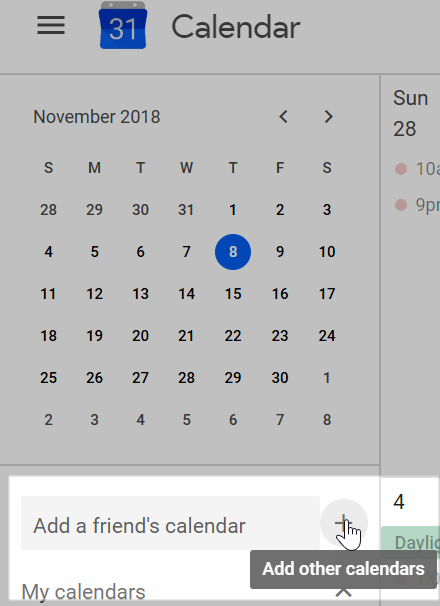
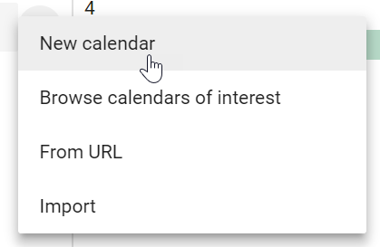
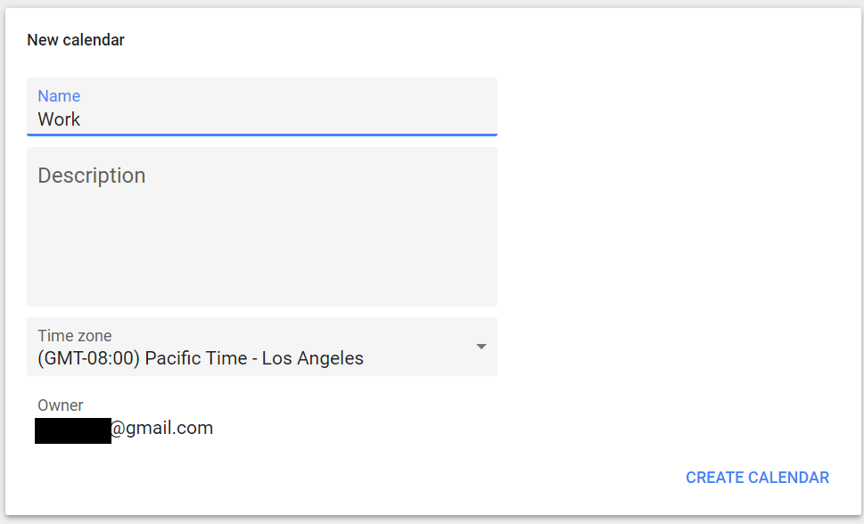
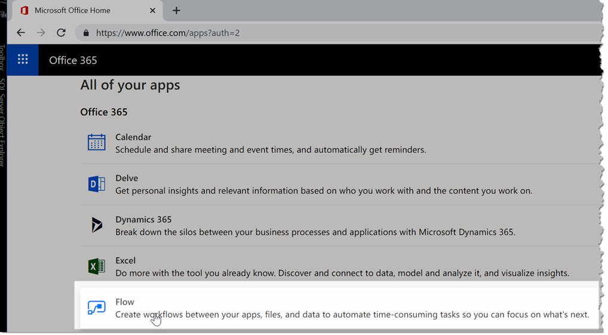
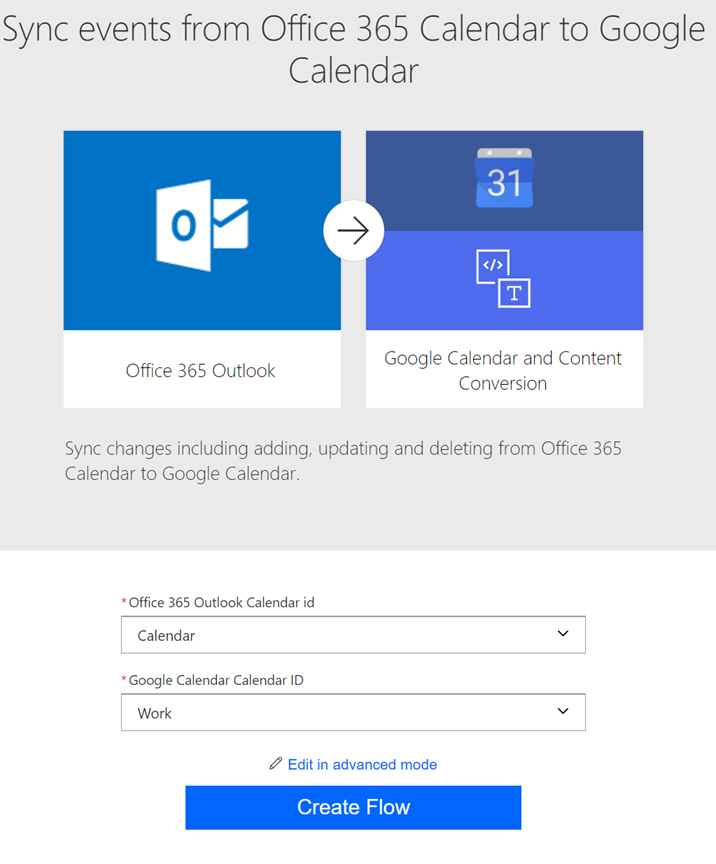
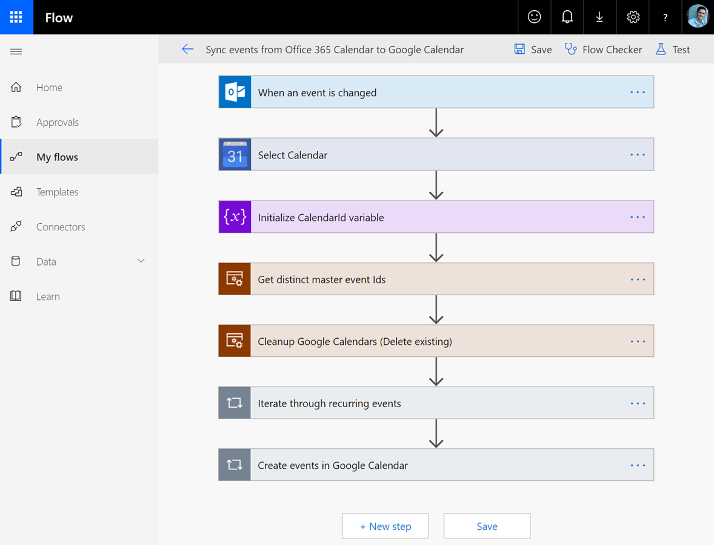
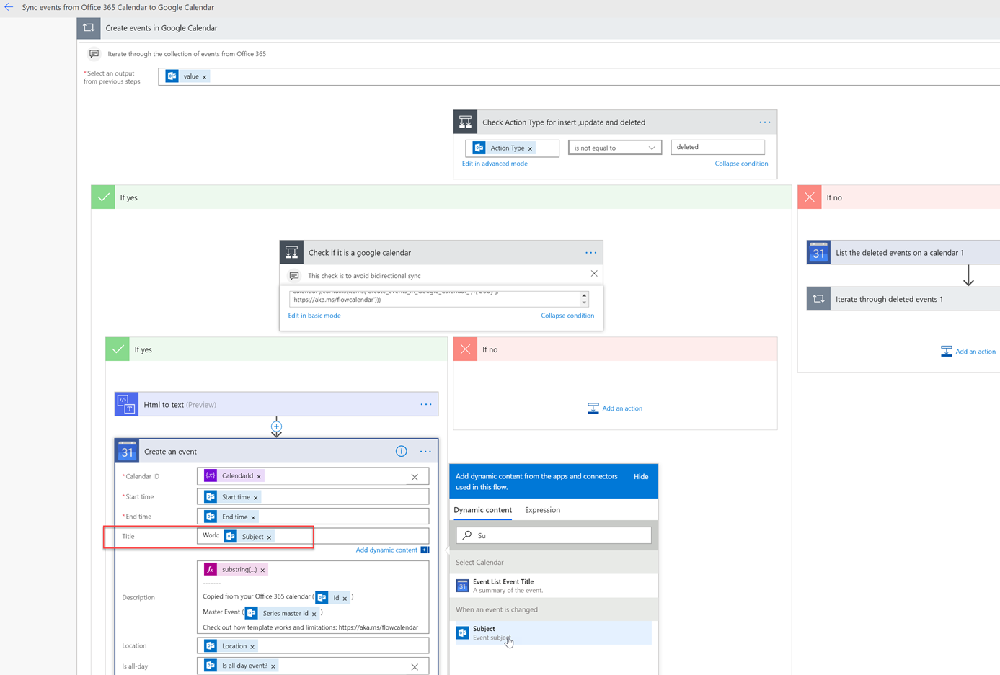
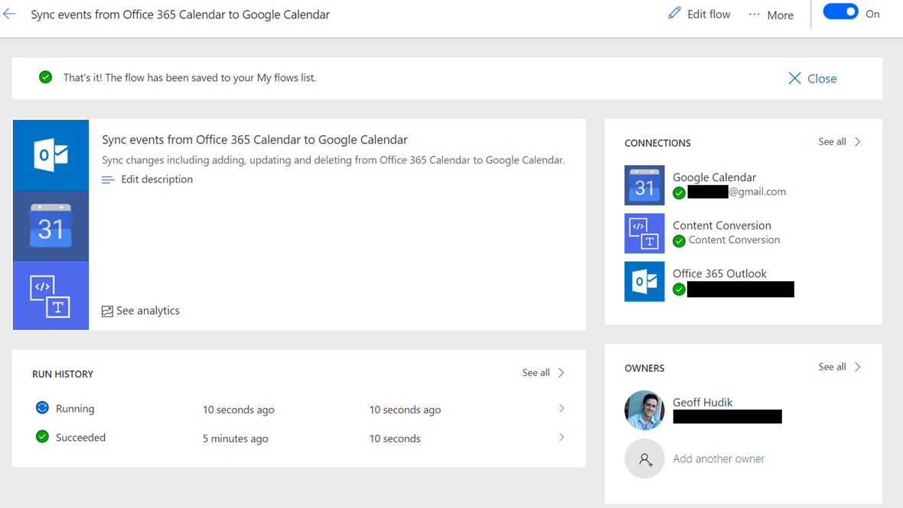
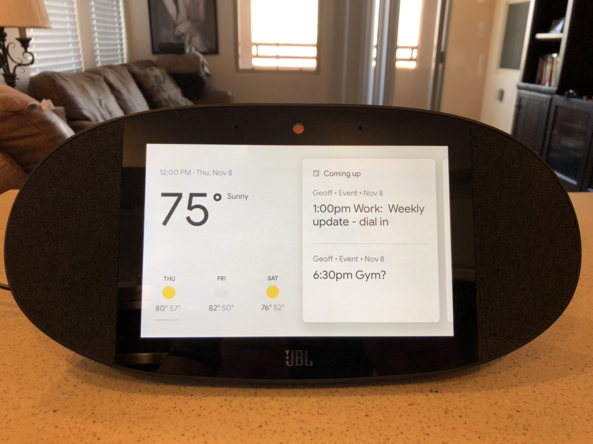
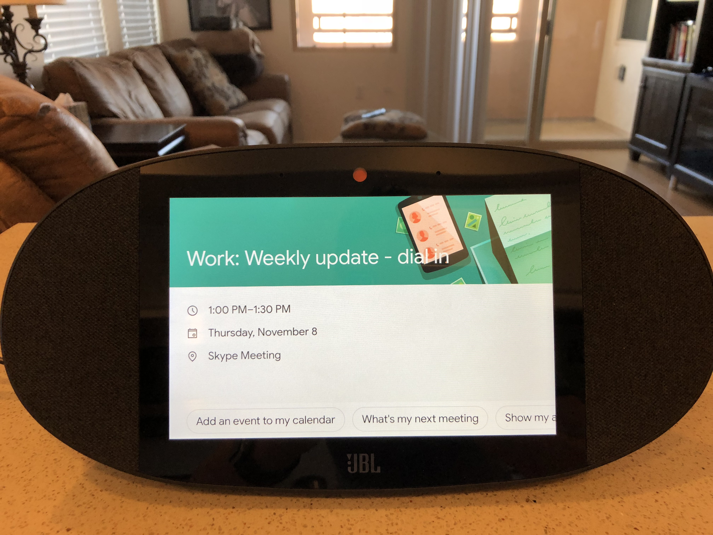

Recently I decided to compliment my Alexa dominated Smart Home setup with a Google Home smart display (too many limitations with [Echo Show](https://www.amazon.com/All-new-Echo-Show-2nd-Gen/dp/B077SXWSRP) right now). I decided to try the [JBL Link View](https://www.jbl.com/voice-activated-speaker/JBLLINKVIEWBLKAM.html); I liked aspects of the [Lenovo Smart Display](https://www.lenovo.com/us/en/smart-display) and [Google Home Hub](https://store.google.com/us/product/google_home_hub) better but ultimately passed due to poorer audio quality and screen size (too small or too big). One initial problem is that Google Home appeared to only support Google Calendar, while Alexa supported both my work Office 365 calendar and my personal Google Calendar.

While there are [IFTTT Recipes](https://ifttt.com/applets/461866p-outlook-calendar-to-google-calendar) to sync Office 365 Calendars with Google, I've found they tend to not be reliable long term. I was reminded of [Microsoft Flow](https://us.flow.microsoft.com/en-us/) so I decided to give that a try instead.

## Creating a New Google Calendar

First I created a new Google calendar for work events. Since this mixes work calendar events with personal ones in the same account, it's best to have separation. Plus on my phone where I already have an O365 calendar I'd want to turn off the Google work calendar to prevent duplicate events but on Google Home I'd want the calendar turned on. It's also worth mentioning that if your work calendar events have any confidential information you may need to consider that (more on this later).

From [calendar.google.com](https://calendar.google.com), I created a new calendar as follows.

## Creating the Flow

From [Office 365 Apps](https://www.office.com/apps) I then launched Microsoft Flow.

The next step was searching for the template "Sync events from Office 365 Calendar to Google Calendar" (note: Microsoft may have pulled this one, see my update at the bottom of this post). Once selected I only had to select which calendars to sync (after authorizing access).

This template was the real key and is well done and easily consumed. My initial mistake was starting from a blank template and adding separate flows for when a calendar event is added, updated, and deleted. Add is trivial but update and delete are more involved that you might think (you can't just directly match calendar ids etc.). You can see an idea of the steps with the flow open.

Flow is very similar to [Azure Logic Apps](https://azure.microsoft.com/en-us/services/logic-apps/) which can be really handy; see also my post [Exploring Azure Logic Apps with an IP Camera](https://geoffhudik.com/tech/2018/01/15/exploring-azure-logic-apps-with-an-ip-camera/).

## Advanced: Customizing the Flow

Optionally it can be handy to customize the template defaults. For example if your work events might contain confidential info you might just omit the description when syncing. In my case I decided to prefix sync'd event titles in Google Calendar with "Work: "; most of the time it's obvious what's a work event and what's personal but it can be handy at a glance.

  

After saving the flow you can see its run history on the View Flow page. How often the flow will run will vary according to the Office 365 pricing plan but in my case it seemed to be 5 minutes or less which was more than sufficient for my needs.

After it runs I can now see my O365 calendar events on the home screen of my Google Home smart display along with my personal Google Calendar events.

Unfortunately it currently appears that event description / body doesn't show up on Google Home when opening the event though the data is there. Practically speaking that's rarely something I need but it could be handy at times.

## Updates

### 05/04/2019

Some people contacted me recently and indicated they couldn't find the flow "Sync events from Office 365 Calendar to Google Calendar". It appears Microsoft may have pulled the flow for some reason or perhaps renamed it. I've exported my flow to [this package](https://geoffhudik.com/wp-content/uploads/2019/10/SynceventsfromOffice365CalendartoGoogleCalendar_20191008011157.zip). You can try [importing the flow](https://flow.microsoft.com/en-us/blog/import-export-bap-packages/) if you can't find the original or a similar one. Note that I didn't create this flow, I only tweaked the one from Microsoft so I can't support it. If Microsoft pulled it, there may have been a reason. I did get some sporadic failures a few weeks ago but best I can tell it's still working. There's also a similar (but less functional) flow called [Copy new events in Office 365 to Google Calendar and send a notification](https://us.flow.microsoft.com/en-us/galleries/public/templates/f9a2b550ebca11e6847527b0ccfd422d/copy-new-events-in-office-365-to-google-calendar-and-send-a-notification/).

### 10/05/2019

Updated the flow to fix a substring issue with the HTML to Text conversion in the Create an Event step. Replaced with the full body of the conversion.
