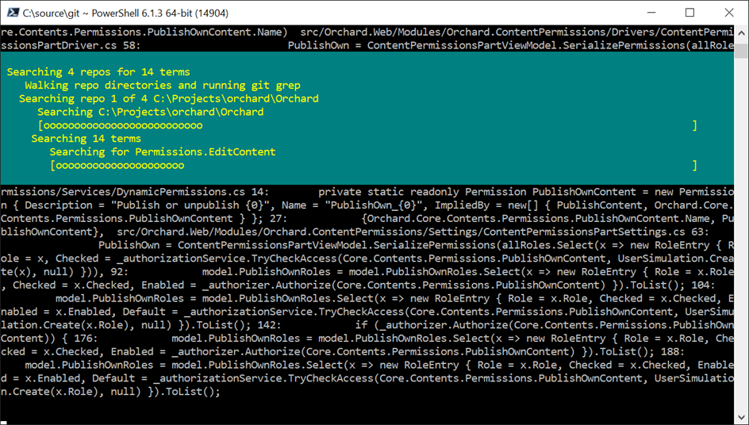
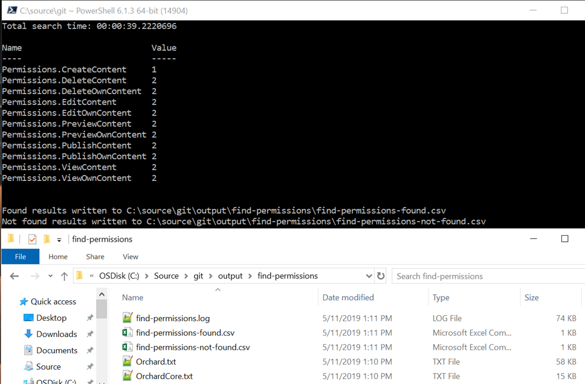

\[toc wrapping="right" heading\_levels="1"\]

With larger applications and the trend of microservices it's increasingly common to be dealing with many Git repositories for a product suite. With that in mind, this post contains some PowerShell scripts to automate some common tasks across multiple Git repositories.

# Basic Structure

The basic structure of each of these scripts looks like the below. The assumption is the repositories have already been cloned locally and there's a desire to run the same operation across multiple Git repositories, each of which exist under some root folder (often representing an organization or product family). The other assumption is that the script is being run from that root folder that contains the repositories. Alternatively the root folder might be in the path, PS profile, or the location changed within the script.

\[powershell\] Get-ChildItem -Recurse -Depth 2 -Force | Where-Object { $\_.Mode -match "h" -and $\_.FullName -like "\*\\.git" } | ForEach-Object { $dir = Get-Item (Join-Path $\_.FullName "../") pushd $dir # TODO: do something with the Git repo here popd } } \[/powershell\]

By looking for a `.git` folder with a depth of 2 the script picks up only git repositories and not other folders that may happen to exist under that location.

# Fetch All Repos

First up, `git-all-fetch.ps1` fetches branches/tags on each remote repository without updating the working copy. The `-p` option is supplied to remove any remote-tracking branch references that no longer exist on the remote.

\[powershell highlight="12"\] param()

function Get-AllRepos () { Get-ChildItem -Recurse -Depth 2 -Force | Where-Object { $\_.Mode -match "h" -and $\_.FullName -like "\*\\.git" } | ForEach-Object { $dir = Get-Item (Join-Path $\_.FullName "../") pushd $dir

"Fetching $($dir.Name)" git fetch -p popd } }

Get-AllRepos \[/powershell\]

# Pull All Repos

In a similar fashion, `git-all-pull.ps1` fetches all changes but updates the working copy, optionally checking out the desired branch first (often `master` or `develop`). The assumption is that there are no pending changes and the working directories are clean at this point.

\[powershell highlight="16,21"\] param(\[string\]$checkoutBranch = "develop")

function Get-AllRepos (\[string\]$checkoutBranch = "develop") { Get-ChildItem -Recurse -Depth 2 -Force | Where-Object { $\_.Mode -match "h" -and $\_.FullName -like "\*\\.git" } | ForEach-Object { $dir = Get-Item (Join-Path $\_.FullName "../") pushd $dir

if ($checkoutBranch) { $branch= &git rev-parse --abbrev-ref HEAD

if ($branch -ne $checkoutBranch) { "Checkout out $($checkoutBranch) branch for $($dir.Name)" git checkout $checkoutBranch } }

"Pulling $($dir.Name)" git pull -p popd } }

Get-AllRepos $checkoutBranch \[/powershell\]

# Remove All Merged Branches

The `git-all-delete-merged-branches.ps1` script deletes all merged branches in each repo, skipping special branches like `develop` and `master`.

\[powershell highlight="10"\] function Remove-MergedBranches { Get-ChildItem -Recurse -Depth 2 -Force | Where-Object { $\_.Mode -match "h" -and $\_.FullName -like "\*\\.git" } | ForEach-Object { $dir = Get-Item (Join-Path $\_.FullName "../") pushd $dir

"removing merged branches in $($dir.Name)" git branch --merged | %{$\_.trim()} | ?{$\_ -notmatch 'develop' -and $\_ -notmatch 'master'} | %{git branch -d $\_}

popd } }

Remove-MergedBranches \[/powershell\]

In some cases it may be helpful to combine some of these scripts, deleting merged branches after pulling each repo for example.

# History for All Repos

Often I might want to know exactly what all did I change this past week? That seems easy enough to remember but it's often a blur in busy weeks. The `git-all-log.ps1` script takes in an optional author name (or `-mine` for my own commits) and a number of days back to go in history.

## Calling Examples

\[powershell\] # show all my commits on each repo for past 7 days (by default): .\\git-all-log -mine

\# show all my commits on each repo for past 2 days: .\\git-all-log -mine -days 2

\# show all commits for author "John Doe" on each repo for past 5 days: .\\git-all-log.ps1 -author "John Doe" -days 5 \[/powershell\]

## Script

\[powershell highlight="18,21,34"\] \[CmdletBinding()\] param( \[Parameter(Mandatory=$false)\] \[ValidateRange(1, 180)\] \[int\]$daysBack = 7,

\[Parameter(Mandatory=$false)\] \[string\]$author,

\[Parameter(Mandatory=$false)\] \[switch\]$mine )

if ($mine) { $author = git config user.name }

$command = "git --no-pager log --after=""$($daysBack) days ago"" --pretty=format:""%h - %an, %ar : %s"""

if ($author) { $command = "$command --author=""$author""" }

Write-Host $command -ForegroundColor Yellow

$command = "\`$output = $command"

Get-ChildItem -Recurse -Depth 2 -Force | Where-Object { $\_.Mode -match "h" -and $\_.FullName -like "\*\\.git" } | ForEach-Object { $dir = Get-Item (Join-Path $\_.FullName "../") Push-Location $dir

Invoke-Expression $command

if ($output) { Write-Host "\`n$($dir.Name):" -ForegroundColor Cyan $output }

Pop-Location }

Pop-Location \[/powershell\]

Simplified sample output (`.\git-all-log -mine -days 2`):

\[text\] git --no-pager log --after="2 days ago" --pretty=format:"%h - %an, %ar : %s" --author="Geoff Hudik"

cloud-config: eda9205 - Geoff Hudik, 26 hours ago : local configuration tweaks 84c7004 - Geoff Hudik, 26 hours ago : development environment timeout increases 47994cd - Geoff Hudik, 28 hours ago : development database connection string updates

site-admin-web: b9e64ce - Geoff Hudik, 25 hours ago : \[#166017737\] site navigation cleanup \[/text\]

# Search All Repos

Finally `git-all-find.ps1` is a bit more involved but simple in concept. It searches each git repo for multiple strings in a specified text file. My use case was cleanup - searching for some 500+ feature flag keys and some 300+ permission keys across 20 repos to identify ones no longer in use in order to soft delete them.

## Calling Example

Starting from a usage perspective, here's a simplified example using some [Orchard CMS](https://github.com/OrchardCMS) repos. Calling the script might look like this:

\[powershell\] $searchStringsFile = (Join-Path $PSScriptRoot "find-strings\\find-permissions.txt")

.\\git-all-find.ps1 \` -reposRoot "C:\\Projects\\orchard" \` -searchStringsFile "$searchStringsFile" \` -pathSpec "'\*.cs' '\*.aspx' '\*.ascx' '\*.cshtml' '\*.Master' ':!\*Permission.cs'" \` -excludedRepos "OrchardCore.Translations", "OrchardDoc" \` -threads 10 \[/powershell\]

The `pathSpec` parameter may have been better off converted into an array but I wanted to pass the files to include and exclude as close as possible to existing path specs I was using with [git grep](https://git-scm.com/docs/git-grep). It's also optional but does speed up the search and helps ensure relevant results. Excluded repos and thread count are also optional.

The file with search terms might be a dump of terms from a database table but here's a small example `find-permissions.txt` with some permission keys. The script expects one line per search term.

\[text\] Permissions.CreateContent Permissions.PublishContent Permissions.PublishOwnContent Permissions.EditContent Permissions.EditOwnContent Permissions.DeleteContent Permissions.DeleteOwnContent Permissions.ViewContent Permissions.ViewOwnContent Permissions.PreviewContent Permissions.PreviewOwnContent Permissions.CopyContent Permissions.ArchiveContent Permissions.PurgeAllContent \[/text\]

## Running

Running the script shows progress of each search term for each repo and outputs matches along the way.

## Output

The script outputs a found CSV with each term found and the number of occurrences, a not found CSV with all the terms that had no matches against any repo, and per-repo text files containing the filename and line number matches for each found term.

The not found CSV was useful for a formula to generate SQL to soft delete unused items i.e. `=CONCATENATE("UPDATE schema.""table"" set deleted_flag = TRUE WHERE some_key = '", A2, "';")` followed by Fill Down.

## Script Breakdown

First the parameters of which the root folder, search strings input file, and filename include/exclude path spec are key.

\[powershell\] \[CmdletBinding()\] param( \[Parameter(Mandatory=$true)\] \[ValidateScript({ if (-Not ($\_ | Test-Path) ) { throw "repos root path does not exist" } if (-Not ($\_ | Test-Path -PathType Container) ) { throw "Repos root must be a folder" } return $true })\] \[System.IO.DirectoryInfo\]$reposRoot,

\[Parameter(Mandatory=$true)\] \[ValidateScript({ if (-Not ($\_ | Test-Path) ) { throw "search strings path does not exist" } if (-Not ($\_ | Test-Path -PathType Leaf) ) { throw "Search strings path must be a filename" } return $true })\] \[System.IO.FileInfo\]$searchStringsFile,

\[Parameter(Mandatory=$false)\] \[String\]$pathSpec,

\[Parameter(Mandatory=$false)\] \[String\[\]\]$excludedRepos = @(),

\[Parameter(Mandatory=$false)\] \[int\]$threads = 10 ) \[/powershell\]

The script begins with some variable initialization, preparing the output folder, and setting up transcription.

\[powershell\] $pathSpec = $pathSpec.Replace("\`"", "") $searchFileInfo = (Get-Item $searchStringsFile) $searchStringName = $searchFileInfo.Name.Replace($searchFileInfo.Extension, "") $outputDir = (Join-Path $PSScriptRoot "output\\$searchStringName")

if (!(Test-Path $outputDir)) { New-Item -Path $outputDir -ItemType Directory | Out-Null } else { Push-Location $outputDir Get-ChildItem | ForEach-Object { Remove-Item $\_ -Force -ErrorAction SilentlyContinue } Pop-Location }

$transcriptFile = (Join-Path $outputDir "$searchStringName.log")

try { Start-transcript $transcriptFile -ErrorAction Stop} catch { Start-Transcript $transcriptFile } \[/powershell\]

The work begins with reading the search strings file lines into an array and getting the list of top level directory names to process, excluding any repo directory names passed in with the `$excludedRepos` parameter array. Some additional variables are also set and progress writing begins.

\[powershell\] Write-Progress -Activity "Preprocessing" -Status "Reading search strings in $searchStringsFile" $searchStrings = @(Get-Content -Path $searchStringsFile)

Write-Progress -Activity "Preprocessing" -Status "Scanning repos"

Push-Location $reposRoot $repoDirs = Get-ChildItem -Recurse -Depth 2 -Force | Where-Object { $\_.Mode -match "h" -and $\_.FullName -like "\*\\.git"} | ForEach-Object { $\_.Parent.FullName } | Where-Object { $excludedRepos -notcontains (Get-Item $\_).Name }

Write-Progress -Activity "Preprocessing" -Completed

Write-Progress -Id 1 -Activity "Searching $($repoDirs.Length) repos for $($searchStrings.Length) terms" \` -Status "Walking repo directories and running git grep" $sw = \[Diagnostics.Stopwatch\]::StartNew()

$found = @{} $repoIndex = 0 $pathSpecFinal = ""

if ($pathSpec) { $pathSpecFinal = " -- $pathSpec" } \[/powershell\]

The heart of the script is traversing over the repo directories and searching for each term within each repo. I used [git grep](https://git-scm.com/docs/git-grep) over [Select-String](https://docs.microsoft.com/en-us/powershell/module/microsoft.powershell.utility/select-string?view=powershell-6) as `git grep` is wicked fast, respects `.gitignore` content by default, is very configurable, and has some nice hit matching output.

\[powershell\] $repoDirs | ForEach-Object { $repoDir = $\_ $repoShortName = (Get-Item $repoDir).Name $repoIndex = $repoIndex + 1 Write-Progress -Id 2 -ParentId 1 -Activity "Searching repo $repoIndex of $($repoDirs.Length) $repoDir" \` -Status "Searching $repoDir" \` -PercentComplete ($repoIndex/$repoDirs.Length\*100)

Push-Location $repoDir

$repoMatchesFilename = (Join-Path $outputDir "$repoShortName.txt") "\`n$repoDir ".PadRight(100, '\*') $searchStringIndex = 0

$searchStrings | Foreach-Object { $searchFor = $\_ Write-Progress -Id 3 -ParentId 2 -Activity "Searching $($searchStrings.Length) terms" \` -Status "Searching for $searchFor" \` -PercentComplete ($searchStringIndex/$searchStrings.Length\*100)

\# Seem to have to use Invoke-Expression to get the git pathspec right here. # It'll work inline fine with -- '\*.ext' '\*.ext2' inline/hardcoded but as variable value isn't passed correctly $output = $null $expression = "\`$output = git --no-pager grep -n -i --break --heading -A 0 -B 0 --threads $threads $searchFor $pathSpecFinal" Invoke-Expression $expression

if ($output) { if (!$found.ContainsKey($searchFor)) { $found.Add($searchFor, 1) } else { $found\[$searchFor\] = $found\[$searchFor\] + 1 }

Add-Content $repoMatchesFilename $output "$($output.Trim())\`n" } else { $notFound += $searchFor }

$searchStringIndex = $searchStringIndex + 1 }

Pop-Location } \[/powershell\]

One early mistake I made with `git grep` was not including `--no-pager` which resulted in hanging the script eventually while waiting for paging. I also had some trouble getting the `pathSpec` parameter value into the command correctly which lead me to doing it more dynamically with `Invoke-Expression`.

Output from `git grep` is captured into a variable for a matches file later and tested to update dictionary match counts. Not capturing the output leads to nicer `git grep` output with on-screen coloring of matches but I needed file output with a large number of search terms, hits, and repos.

Finally the script writes the matches dictionary to a CSV and determines what search strings weren't found and writes to another CSV.

\[powershell\] $sw.Stop() "Total search time: $($sw.Elapsed)"

$found.GetEnumerator() | sort-object Name | Format-Table -Autosize

$csvFilename = (Join-Path $outputDir "$searchStringName-found.csv") $found.GetEnumerator() | sort-object Name | Export-Csv $csvFilename -NoTypeInformation "Found results written to $csvFilename"

$notFoundStrings = $searchStrings \` | Where-Object { $found.ContainsKey($\_) -eq $false } \` | Sort-Object \` | ForEach-Object { \[pscustomobject\]@{ SearchTerm = $\_ } }

$csvFilename = (Join-Path $outputDir "$searchStringName-not-found.csv") $notFoundStrings | Export-Csv $csvFilename -NoTypeInformation "Not found results written to $csvFilename"

Pop-Location \[/powershell\]

This script doesn't take into account code that may be commented out or in files that aren't used (dead). That means that for cleanup purposes there may very well be more items that aren't really used than the script can determine.

# Source

Individual scripts can be found in the following gists or in [git.zip](https://geoffhudik.com/wp-content/uploads/2019/05/git.zip) which also includes sample output files and calling scripts.

- [git-all-delete-merged-branches.ps1](https://gist.github.com/thnk2wn/840b1d478092a10b6b8aecb9993e12b1)
- [git-all-find.ps1](https://gist.github.com/thnk2wn/39b27cfe2a8719bcecca13725a086dd2)
- [git-all-fetch.ps1](https://gist.github.com/thnk2wn/30f8fd689a61efab6d4f5f45b03e1358)
- [git-all-log.ps1](https://gist.github.com/thnk2wn/a00d0089d2d521d353c834fa05aa1374)
- [git-all-pull.ps1](https://gist.github.com/thnk2wn/32d64c4d35b8848fc9225c358cbc620c)
