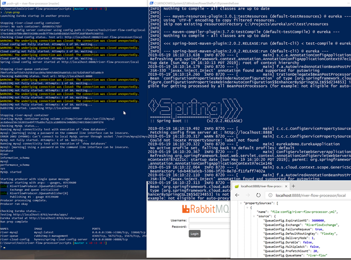
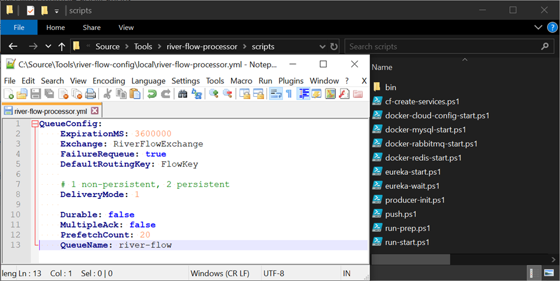
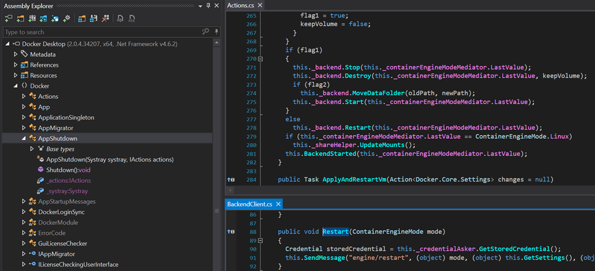

  

\[toc wrapping="right"\]

In working on a cloud native application locally, there have been various dependencies to spin up in order to run the different services. These include things like:

- [Netflix Eureka](https://github.com/Netflix/eureka/wiki) for service discovery
- [Spring Cloud Config](https://spring.io/projects/spring-cloud-config) for externalized, distributed configuration
- [RabbitMQ](https://www.rabbitmq.com/) for decoupled messaging and bulk processing
- [Redis](https://redis.io/) for distributed caching
- [MySQL](https://www.mysql.com/) for data persistence

Most of these are available in [Docker](https://www.docker.com/) which certainly makes running them much easier than manually installing and configuring various software packages. Even with Docker though, once there are multiple containers and more verbose run commands, things inevitably get forgotten or fat-fingered. Even if the commands are executed without issue, there are unknown time delays before everything is fully initiated and ready for dev debugging.

Sometimes prepping everything for local running can take away precious focus, interest, and time from the original task at hand. It may not seem like significant time when it happens but it's often more than developers realize and it can really add up over time. This post gives some examples of some PowerShell scripts that can help shave off a little time each day and save some brain cells.

# Scripts

## Master "Run Prep" Script

This `run-prep.ps1` script is a driver, invoking other piecemeal scripts to fire everything up. I run this before I start to run anything locally, and usually after restarting Docker itself since I'm on Windows and it tends to choke if it has been idle long. It starts by running Eureka in a separate process to parallelize some work since it can take a while and since it streams considerable output.

Next it runs Spring Cloud Config Server, Rabbit MQ, MySQL, and Redis in Docker. It then calls a script to run a producer console app to declare and populate a RabbitMQ queue with test data; that script isn't included in this post but is effectively just feeding arguments to [dotnet run](https://docs.microsoft.com/en-us/dotnet/core/tools/dotnet-run?tabs=netcore21). Finally it waits if necessary if Eureka is still not ready, outputs docker process info, and gives the all clear to start debugging.

\[powershell\] param(\[switch\]$all, \[int\]$top)

Push-Location $PSScriptRoot

\# Eureka takes longest. start first in new window, takes a while, lots of continual Eureka output "Launching Eureka startup in another process" Invoke-Expression "cmd /c start powershell -NoProfile -Command { .\\eureka-start.ps1 }"

" " # Start Spring Cloud Config server for Producer and Consumer configuration. .\\docker-cloud-config-start.ps1

" " # Start RabbitMQ container for Producer and Consumer .\\docker-rabbitmq-start.ps1

" " # Start MySQL container for API. Mount to keep any existing data and not rebuild DB. .\\docker-mysql-start.ps1 -mount

" " # Start Redis for distributed caching (API) .\\docker-redis-start.ps1

" " # Setup queue and seed with message(s) for consumer processing by running producer console app. .\\producer-init.ps1 -all:$all -top:$top

" " # See if Eureka has fully started up yet, if not wait. .\\eureka-wait.ps1

"Run prep complete. Checking Docker process status\`n"

\# Show abbreviated docker process status docker ps -a --format 'table {{.Names}}\\t{{.Image}}\\t{{.Ports}}'

Pop-Location \[/powershell\]

## Eureka Start

Eureka was the one piece that appeared to be questionable from Docker. While I found [Eureka docker images](https://hub.docker.com/search?q=eureka&type=image), the official one was last updated over 4 years ago and looked limited and/or abandoned, with more recent images appearing to be unofficial. The [Steeltoe discovery docs](https://steeltoe.io/docs/steeltoe-discovery/#2-1-1-1-start-eureka-server) also mention running Eureka directly from the Github repo and that does ensure the latest and greatest with full flexibility.

This `eureka-start.ps1` script clones the Eureka repo if needed, pulls the latest, starts the maven build, and ensures the `JAVA_HOME` environment variable is set (needed by the build).

\[powershell highlight="19"\] $eurekaLocalPath = "C:\\Projects\\eureka"

\# JAVA\_HOME must be set for maven build # needs to be set to a JDK dir not JRE otherwise: # No compiler is provided in this environment. Perhaps you are running on a JRE rather than a JDK? $env:JAVA\_HOME = "C:\\Program Files\\Java\\jdk1.8.0\_191"

if (!(Test-Path $eurekaLocalPath)) { "Cloning Eureka" git clone https://github.com/spring-cloud-samples/eureka.git $eurekaLocalPath }

Push-Location $eurekaLocalPath "Pulling Eureka from Github" git pull -p

"Running Eureka" # This will take some time on the initial run .\\mvnw spring-boot:run Pop-Location \[/powershell\]

## Spring Cloud Config Start

This `docker-cloud-config-start.ps1` script starts by stopping and removing the cloud config container if already running as the assumption is the script is used for "cold start" scenarios. It then runs the container exposing port `8888`, setting a couple of Spring environment variables, and setting up the volume mount.

\[powershell highlight="1,8,13,14,22-26"\] $image = "hyness/spring-cloud-config-server" $name = "river-cloud-config"

$attempts = 0 $startSuccess = $false $maxAttempts = 3

$configPath = (Get-Item (Join-Path $PSScriptRoot "../../river-flow-config/local")).FullName.Replace("\\", "/")

do { docker ps -a -f name=$name -q | ForEach-Object { "Stopping $name container" docker stop $\_ | Out-Null docker rm $\_ | Out-Null }

\# https://hub.docker.com/r/hyness/spring-cloud-config-server/

$v = "$($configPath):/config" "Starting $image container using config path $configPath"

docker run -d -p 8888:8888 --rm --name $name \` -v $v \` -e SPRING\_PROFILES\_ACTIVE=native \` -e SPRING\_CLOUD\_CONFIG\_SERVER\_ACCEPT-EMPTY=false \` $image

if ($?) { $startSuccess = $true break; }

$attempts = $attempts + 1

"Waiting on $image docker run success, attempts $attempts of $maxAttempts" Start-Sleep 1 } while ($attempts -lt $maxAttempts)

if (!$startSuccess) { throw "Failed to start $image container." } \[/powershell\]

That volume mount is to a config repo a couple of levels up from the script directory. That repo has per-environment config folders with `local` being used by the script.

The [docker run](https://docs.docker.com/engine/reference/commandline/run/) command is in a retry loop for failures though practically speaking for most scenarios, if it doesn't run successfully the first time it won't run successfully on subsequent attempts, unless Docker is in the process of restarting. The loop is a holdover from a prior attempt of mine at restarting Docker itself from a script if there was an issue with the run, given various issues I found with Docker on Windows. A scripted Docker process restart however was never as successful as a restart from the Docker client.

The second half of the script attempts to test the cloud config connectivity and delay until verified. It invokes HTTP requests to the cloud config server URL, specifying one of the apps using it (`river-flow-processor`) and `local` as the environment for the test URL. Once that returns `200` okay, the URL is launched to show current configuration values.

\[powershell highlight="8,13,19"\] $configServerTestUrl = "http://localhost:8888/river-flow-processor/local"

"Checking Cloud Config status. Test url: $configServerTestUrl" $attempts = 0 $maxAttempts = 10

do { Start-Sleep ($attempts + 3)

$status = -1

try { $status = Invoke-WebRequest $configServerTestUrl | ForEach-Object {$\_.StatusCode} } catch { Write-Warning "$($\_.Exception.Message)" }

if ($status -eq 200) { "$image started. Launching $configServerTestUrl" Start-Process $configServerTestUrl -WindowStyle Minimized break; }

$attempts = $attempts + 1 "$image not fully started. Attempts $attempts of $maxAttempts. Waiting..." } while ($attempts -lt $maxAttempts)

\# if you get to this point and it can't seem to find the app, might need to reset docker drive creds if pwd changed if ($attempts -eq $maxAttempts) { Write-Warning "Starting $image appeared to fail" } \[/powershell\]

## RabbitMQ Start

The `docker-rabbitmq-start.ps1` script is very similar to the cloud config one except that it runs the container exposing port `5672` for client TCP connections and `8080` for the RabbitMQ management website.

\[powershell highlight="1,17"\] $image = "rabbitmq" $containerName = "river-queue"

$attempts = 0 $maxAttempts = 3 $startSuccess = $false

do { docker ps -a -f name=$containerName -q | ForEach-Object { "Stopping $containerName container" docker stop $\_ | Out-Null docker rm $\_ | Out-Null }

\# https://hub.docker.com/\_/rabbitmq $imageTag = "$($image):3-management" docker run -d --hostname local-rabbit --name $containerName -p 5672:5672 -p 8080:15672 $imageTag

if ($?) { $startSuccess = $true break; }

$attempts = $attempts + 1

"Waiting on $image docker run success, attempts: $attempts of $maxAttempts" Start-Sleep 1 } while ($attempts -lt $maxAttempts)

if (!$startSuccess) { throw "Failed to start $image container." } \[/powershell\]

It's verification checks to see that the host OS is listening on ports `5672` and `8080` and tests HTTP requests to the management portal (localhost:8080). Once verified, the web management UI is launched as there was often a need to monitor it during debugging or add or remove queue messages.

\[powershell highlight="8,9,10,15,21"\] $webMgtUrl = "http://localhost:8080"

"Checking $image status. Test url: $webMgtUrl" $attempts = 0 $maxAttempts = 10

do { Start-Sleep ($attempts + 3) $conns5672 = Get-NetTCPConnection -LocalPort 5672 -State Listen -ErrorVariable $err -ErrorAction SilentlyContinue $conns8080 = Get-NetTCPConnection -LocalPort 8080 -State Listen -ErrorVariable $err -ErrorAction SilentlyContinue

$status = -1

try { $status = Invoke-WebRequest $webMgtUrl | ForEach-Object {$\_.StatusCode} } catch { Write-Warning "$($\_.Exception.Message)" }

if ($conns5672 -and $conns5672.Length -gt 0 -and $conns8080 -and $conns8080.Length -gt 0 -and $status -eq 200) { "$image started. Launching $webMgtUrl" # login as guest/guest Start-Process $webMgtUrl -WindowStyle Minimized break; }

$attempts = $attempts + 1 "$image not fully started. Attempts: $attempts of $maxAttempts. Waiting..." } while ($attempts -lt $maxAttempts) \[/powershell\]

## MySQL Start

The `docker-mysql-start.ps1` script is similar to the other docker start scripts except that it sets the password for the `root` MySQL user and it gives the option to mount the data directory to preserve databases between container starts.

\[powershell highlight="1,3,5-6,20-30"\] param (\[switch\]$mount)

$image = "mysql" $containerName = "river-mysql" $hostPort = 3306 $containerPort = 3306

$attempts = 0 $maxAttempts = 3 $startSuccess = $false

do { docker ps -a -f name=$containerName -q | ForEach-Object { "Stopping $containerName container" docker stop $\_ | Out-Null docker rm $\_ | Out-Null }

\# https://hub.docker.com/\_/mysql $ports = "$($hostPort):$($containerPort)"

if ($mount) { $volume = "c:/temp/river-data:/var/lib/mysql" "Starting $image container using volume $volume" docker run -p $ports --name $containerName -e MYSQL\_ROOT\_PASSWORD=pwd -d -v $volume $image } else { "Starting $image container without volume" docker run -p $ports --name $containerName -e MYSQL\_ROOT\_PASSWORD=pwd -d $image }

if ($?) { $startSuccess = $true break; }

$attempts = $attempts + 1 "Waiting on $image docker run success. Attempts: $attempts of $maxAttempts..." Start-Sleep 2 } while ($attempts -lt $maxAttempts)

if (!$startSuccess) { throw "Failed to start $image container." } \[/powershell\]

The verification section of the script is also a little different. In addition to verifying the connectivity on port `3306`, the script runs [docker exec](https://docs.docker.com/engine/reference/commandline/exec/) to execute a `show databases` SQL command using the [mysql client](https://dev.mysql.com/doc/refman/8.0/en/mysql.html) in the container as the `root` user. That will fail if MySQL isn't fully spun up yet which will cause the script to wait longer.

\[powershell highlight="7,12"\] $attempts = 0 $maxAttempts = 10 "Checking $image status..."

do { Start-Sleep ($attempts + 2) $conns = Get-NetTCPConnection -LocalPort $hostPort -State Listen -ErrorVariable $err -ErrorAction SilentlyContinue

if ($conns -and $conns.Length -gt 0) { # port may be open but mysql may not be fully started. test a command "Running $image connectivity test with execution of 'show databases'" docker exec $containerName mysql --user=root --password=pwd --execute='show databases;'

if ($?) { "$image started" break; } }

$attempts = $attempts + 1 "$image not fully started. Attempts: $attempts of $maxAttempts. Waiting..." } while ($attempts -lt $maxAttempts) \[/powershell\]

## Redis Start

Similar to the MySQL script, `docker-redis-start.ps1` also uses `docker exec` to verify connectivity but uses `redis-cli` as the command to do so.

\[powershell highlight="1,3,4,20,42,47"\] $image = "redis" $containerName = "river-cache" $hostPort = 6379 $containerPort = 6379

$attempts = 0 $maxAttempts = 3 $startSuccess = $false

do { docker ps -a -f name=$containerName -q | ForEach-Object { "Stopping $containerName container" docker stop $\_ | Out-Null docker rm $\_ | Out-Null }

\# https://hub.docker.com/\_/redis "Starting $image" $ports = "$($hostPort):$($containerPort)" docker run -d -p $ports --name $containerName $image

if ($?) { $startSuccess = $true break; }

$attempts = $attempts + 1 "Waiting on $image docker run success. Attempts: $attempts of $maxAttempts..." Start-Sleep 2 } while ($attempts -lt $maxAttempts)

if (!$startSuccess) { throw "Failed to start $image container." }

$attempts = 0 $maxAttempts = 5 "Checking $image status..."

do { Start-Sleep ($attempts + 2) $conns = Get-NetTCPConnection -LocalPort $hostPort -State Listen -ErrorVariable $err -ErrorAction SilentlyContinue

if ($conns -and $conns.Length -gt 0) { # port may be open but mysql may not be fully started. test a command "Running $image connectivity test" docker exec $containerName redis-cli

if ($?) { "$image started" break; } }

$attempts = $attempts + 1 "$image not fully started. Attempts: $attempts of $maxAttempts. Waiting..." } while ($attempts -lt $maxAttempts) \[/powershell\]

## Eureka Wait

Eureka was started in another terminal window at the beginning but can take some time to initialize, especially if there are changes to build. This `eureka-wait.ps1` script just tests `http://localhost:8761/eureka/apps/` for a `200` response, sleeping a set number of times until that happens. Usually Eureka is already up and running by this point but not always.

\[powershell highlight="1,14,20"\] $eurekaUrl = "http://localhost:8761/eureka/apps/"

"Checking Eureka status..." $attempts = 0 $maxAttempts = 20

do { Start-Sleep ($attempts + 2)

$status = -1 "Testing $eurekaUrl"

try { $status = Invoke-WebRequest $eurekaUrl | ForEach-Object {$\_.StatusCode} } catch { Write-Warning "$($\_.Exception.Message)" }

if ($status -eq 200) { "Eureka started at $eurekaUrl" break; }

$attempts = $attempts + 1 "Eureka not fully started. Attempts $attempts of $maxAttempts. Waiting..." } while ($attempts -lt $maxAttempts) \[/powershell\]

## Docker Stop All

This simple `docker-stop-all.ps1` script stops and removes all containers which is handy at times, especially with several containers.

\[powershell\] function Stop-Containers { docker ps -q | % { docker stop $\_ } docker ps -a -q | % { docker rm $\_ } }

Stop-Containers \[/powershell\]

## Failed Docker Restart Attempt

Due to some [Docker for Windows issues](#Docker_Desktop_Issues_on_Windows) I often found myself having to restart Docker. I wanted a way to do so programmatically in the event that a docker run command failed unexpectedly. Initially I thought I could just kill and then start Docker\* processes and that would roughly have the same effect as a restart, albeit less safe and more brute force.

\[powershell\] param (\[switch\]$wait)

\# Note: this script isn't as reliable as actions taken right-clicking Docker Desktop tray icon and selecting Restart # Can't seem to invoke that functionality or otherwise restart programmatically in same fashion that clears issues.

"Stopping containers" docker ps -q | % { docker stop $\_ } docker ps -a -q | % { docker rm $\_ }

"Starting / restarting Docker..." $dockerSvc = "com.docker.service"

Get-Process "\*Docker Desktop\*" \` | Where-Object { $\_.ProcessName -ne $dockerSvc } \` | ForEach-Object { "Stopping $($\_.ProcessName)"; $\_.Kill(); $\_.WaitForExit(); }

Get-Service -Name $dockerSvc | Where-Object {$\_.Status -eq "Started"} | Restart-Service Get-Service -Name $dockerSvc | ForEach-Object {$\_.WaitForStatus("Running", '00:00:20')}

"Starting docker..." # Start-Process "C:\\Program Files\\Docker\\Docker\\Docker for Windows.exe" -Verb RunAs Start-Process "C:\\Program Files\\Docker\\Docker\\Docker Desktop.exe" -Verb RunAs

if ($wait) { $attempts = 0 "Checking Docker status..."

do { docker ps -a #| Out-Null

if ($?) { break; }

$attempts++ "Docker not fully ready, waiting..." Start-Sleep 2 } while ($attempts -le 10)

"Pausing until initialized..." Start-Sleep 6 }

"Docker started" \[/powershell\]

The above essentially somewhat restarted Docker but issues wouldn't clear like they would when right-clicking the Docker Desktop system tray icon and choosing the Restart menu item. I went as far as to decompile Docker Desktop for Windows (best I could tell it wasn't open source) using [dotPeek](https://www.jetbrains.com/decompiler/) to see what it was doing differently but quickly threw in the towel as this was going down the rabbit hole.

# Docker Desktop Issues on Windows

## Input / Output Error

Sadly I saw the following input/output error starting Docker containers on Windows quite frequently, especially if Docker had been idle for some time.

docker.exe: Error response from daemon: driver failed programming external connectivity on endpoint river-mysql 
(6a2b6b48b78cd928210be63c150d8f1e60c0c162e7459d95fbe841f70567437d): 
Error starting userland proxy: mkdir /port/tcp:0.0.0.0:3306:tcp:172.17.0.2:3306: input/output error.

There are a number of posts about [this issue](https://github.com/docker/for-win/issues/573), none of which provided any permanent fix I saw. I worked around it by simply right-clicking the Docker Desktop tray icon and choosing Restart any time my computer the issue came up, usually after my computer had been idle a while.

## Permission Denied

At some point after a Windows update I noticed that I couldn't start the RabbitMQ container anymore due to a permission denied error.

docker.exe: Error response from daemon: driver failed programming external connectivity on endpoint river-queue 
(1f0a3817108f9f2498af318bd7aa84254c63e448f20de0d9f816acdc2150b992): Error starting userland proxy: 
Bind for 0.0.0.0:8080: unexpected error Permission denied.

Eventually I stumbled upon [this StackOverflow answer](https://stackoverflow.com/questions/54217076/docker-port-bind-fails-why-a-permission-denied#55471778) that involved disabling Hyper-V temporarily, restarting, reserving the ports I needed, then re-enabling Hyper-V.

## Volume Mount Failures

This generally was only a problem on corporate work machines but volume mounts would periodically fail, usually after my password expired and was changed. For some containers there'd be a helpful error message at times but often it was a silent failure. The fix is easy with just resetting Shared Drive credentials in Docker settings but it's easy to forget to do after a password change.

# Closing

These scripts are only used for local development and only for me so there's certainly room for cleanup. Some duplicated code could be refactored and reused, arguments introduced to scripts, etc.

This wasn't an option for me initially but given some of the Docker Desktop issues that seemed specific to Windows, I'd be more tempted to use the [Windows Subsystem for Linux (WSL)](https://docs.microsoft.com/en-us/windows/wsl/faq) going forward, perhaps converting some scripts to bash or just using [PowerShell on Linux](https://docs.microsoft.com/en-us/powershell/scripting/install/installing-powershell-core-on-linux?view=powershell-6).

In any event, I think spending some time to automate regular dev activities with some Docker scripts can prove valuable over the long run.

The latest version of these and other scripts can be found in the scripts folder of my [pcf-river-flow-processor](https://github.com/thnk2wn/pcf-river-flow-processor) repo. Alternatively they can be downloaded in [run-prep.zip](https://geoffhudik.com/wp-content/uploads/2019/05/run-prep.zip) or accessed in the following gists.

- [docker-cloud-config-start.ps1](https://gist.github.com/thnk2wn/3222627b1cb3796c70277e7edda4a036)
- [docker-mysql-start.ps1](https://gist.github.com/thnk2wn/85a599be930c7bca54fb3463f158a3a8)
- [docker-rabbitmq-start.ps1](https://gist.github.com/thnk2wn/4bdc9e7d42df50197b53485d880f2a83)
- [docker-redis-start.ps1](https://gist.github.com/thnk2wn/f6c557667e908883a348779b654c094d)
- [docker-restart-attempt.ps1](https://gist.github.com/thnk2wn/32ce1ad47882bd5b1c43e19cbf8f37f4)
- [eureka-start.ps1](https://gist.github.com/thnk2wn/ad1e1dbfa5c4c96d6ca59a72a00e45c9)
- [eureka-wait.ps1](https://gist.github.com/thnk2wn/5366a34a71c8fcfd5e3d14722dc02975)
- [run-prep.ps1](https://gist.github.com/thnk2wn/32e8bb9c68857a4b05183a33f43e2846)
