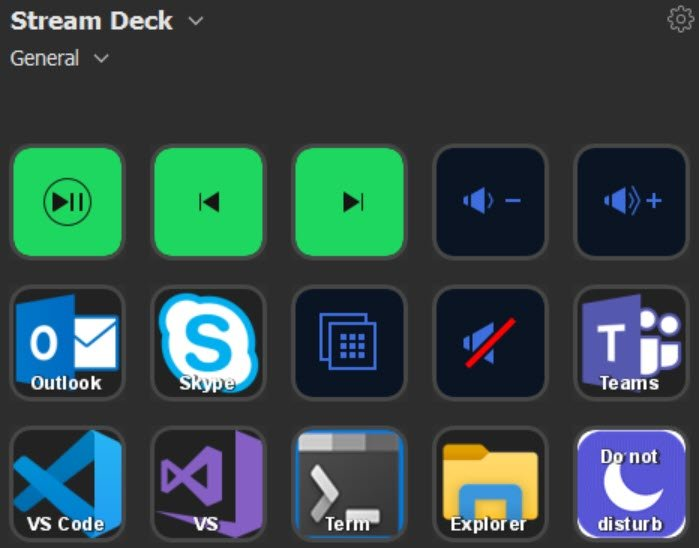
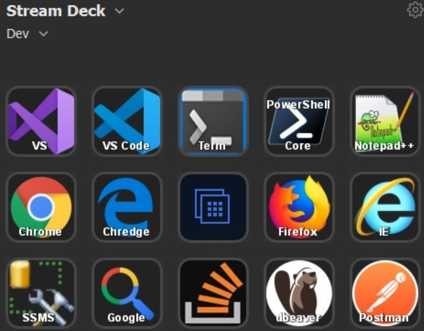
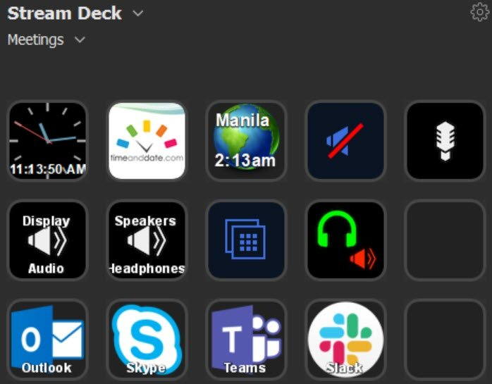
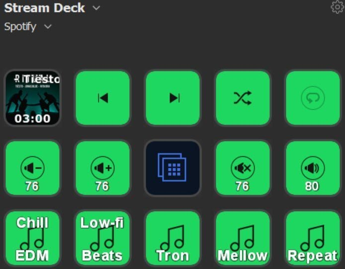
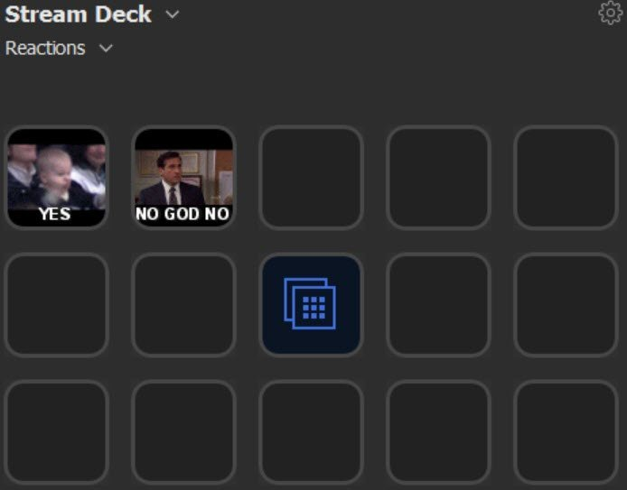

I've heard good things about [Stream Deck](https://www.amazon.com/gp/product/B06XKNZT1P/ref=ppx_yo_dt_b_asin_title_o01_s00?ie=UTF8&psc=1) in the past but since I'm not a streamer I've never looked into it. However it was recently heavily discounted on Amazon's Prime Day and my curiosity got me to pull the trigger and see how I might use it more from a developer's perspective.

The [following video](https://youtu.be/ozhQQ51HPqg) shows my initial configuration after my first evening of trying it out (very easy to setup). I imagine after more time with it there are some more interesting use cases for non-streaming use.

<iframe width="560" height="315" src="https://www.youtube.com/embed/ozhQQ51HPqg" frameborder="0" allow="accelerometer; autoplay; encrypted-media; gyroscope; picture-in-picture" allowfullscreen></iframe>

Mostly so far I'm just using it as an app and URL launcher like [SlickRun](https://bayden.com/SlickRun/) or [QuickSilver](https://qsapp.com/) but a bit faster with a hardware frontend. However it's also handy for meetings with switching audio and video devices, toggling mute and speakers, and clock gadgets and such.

# Profiles

I decided to add a button to switch profiles in the middle of each profile layout so there's a consistent way to toggle actions. Several profiles are tempting but there's a tradeoff with having to switch too much. However there's also a nice option to automatically toggle the profile based on the foreground app.

## General

I renamed the Default Profile to General and use it as a general purpose default. The do not disturb button launches a script that kills communication apps like Outlook, Skype, Teams, Slack and the like for after hours or periods of concentration. I later added a button to launch a script to spin-up common apps like these and others used daily.

## Dev

Common developer apps I use go into this profile, along with URL shortcuts to Stack Overflow and Google. It was tempting to use multiple dev profiles for different types of development work - frontend vs. backend for example.

## Meetings

Controls to mute my mic and speakers were handy here, along with clock gadgets for my time and world clock gadgets for other timezones I have to meet with. Another button launches the excellent [World Clock - Timezones](https://www.microsoft.com/store/productId/9WZDNCRFJCK2) Windows 10 app. Buttons to switch between different audio devices are also convenient. I've not looked into toggling video on/off yet but that'd be a nice touch.

## Spotify

The Spotify functionality lagged sometimes when switching profiles or invoking certain actions but overall it works well. I like the album cover, song and artist info, and time elapsed on it's play/pause "live tile". Shortcuts to common playlists I use when coding comprise the bottom row.

## Reactions

Animated gifs can be dragged over to action icons for a fun effect. Ideally I'd like the action to insert that image into whatever app I'm using (Slack etc.) or at least copying it to the clipboard - for now I'm just launching [Giphy](https://giphy.com/) to the appropriate image. Inserting text is supported as well so custom ASCII art is another fun action here.

# Tips

## Launching a Windows 10 App

Launching an app from the Windows Store is a bit more tedious. I'd open Windows Explorer to `%windir%\explorer.exe shell:::{4234d49b-0245-4df3-b780-3893943456e1}` as the location, find the app, right-click the app, and choose create shortcut (to desktop). Then I'd move the shortcut to a folder dedicated to Stream Deck and point Stream Deck to that shortcut.

## Icons for Websites

When entering a URL to launch, it'd be nice if Stream Deck would reach out to the site for a large version of it's favicon, resize that image to 72x72 that Stream Deck expects, and automatically set a nice image. That'd be icing on the cake as it's not hard to download an image and resize it manually.

## Going Further

Home automation comes to mind as another use case here - controlling lights, my thermostat etc. without having to go through Alexa or Google voice control. It might be fun to look into [creating my own plugin](https://developer.elgato.com/documentation/stream-deck/sdk/create-your-own-plugin/) to extend it further with more customization.

## Your Tips?

If you're using Stream Deck for some non-streaming functions, what are you using it for and how?
