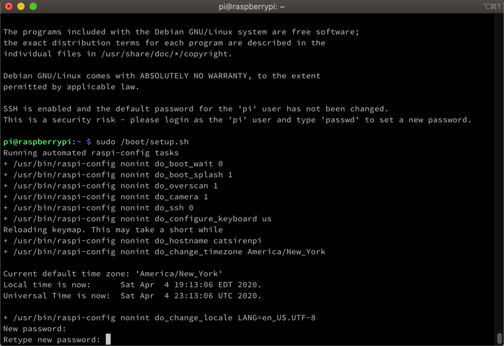

After [creating the SD card](https://wp.me/p8RapM-Jf) for [this project](https://wp.me/p8RapM-Is), I next wanted to automate the initial Pi setup on the first login - further configuring system settings and installing applications. While it might have been possible to do some of that with [pi-gen](https://geoffhudik.com/tech/2020/05/15/using-pi-gen-to-build-a-custom-raspbian-lite-image/) or [Yocto layers](https://jumpnowtek.com/rpi/Raspberry-Pi-Systems-with-Yocto.html), I just wanted a simple script to execute initially. In the previous post, `sd-card-write.sh` copies this script to the SD card as `/boot/setup.sh`.

## System Configuration and Password

It doesn't seem to be well documented but `raspi-config` can be run non-interactively with a `nonint` option. Browsing the source, various methods like [do\_camera](https://github.com/RPi-Distro/raspi-config/blob/master/raspi-config#L1345) are available to be called. Later I stumbled upon this [raspi-config Gist](https://gist.github.com/damoclark/ab3d700aafa140efb97e510650d9b1be) that provides a nice template for easily scripting various configuration tasks.

\[bash\] #!/bin/bash

echo "Running automated raspi-config tasks"

\# Via https://gist.github.com/damoclark/ab3d700aafa140efb97e510650d9b1be # Execute the config options starting with 'do\_' below grep -E -v -e '^\\s\*#' -e '^\\s\*$' <<END | \\ sed -e 's/$//' -e 's/^\\s\*/\\/usr\\/bin\\/raspi-config nonint /' | bash -x - #

\# Drop this file in SD card root. After booting run: sudo /boot/setup.sh

\# --- Begin raspi-config non-interactive config option specification ---

\# Hardware Configuration do\_boot\_wait 0 # Turn on waiting for network before booting do\_boot\_splash 1 # Disable the splash screen do\_overscan 1 # Enable overscan do\_camera 1 # Enable the camera do\_ssh 0 # Enable remote ssh login

\# System Configuration do\_configure\_keyboard us do\_hostname ${host} do\_change\_timezone America/New\_York do\_change\_locale LANG=en\_US.UTF-8

\# Don't add any raspi-config configuration options after 'END' line below & don't remove 'END' line END \[/bash\]

The `${host}` value is a placeholder set when running a script to [create the SD card](https://wp.me/p8RapM-Jf).

It can be important to set the locale details (especially keyboard layout); by default it's UK English and the password I entered on my keyboard contained an "@" character. I spent a few minutes scratching my head after failed ssh login attempts once.

After the `raspi-config` steps quickly execute the script first starts the password change process with `sudo passwd pi`. Using `/usr/bin/raspi-config do_change_pass` is another option but it's slower going through that UI. This is the only part of the process requiring user input; use of [pi-gen](https://github.com/RPi-Distro/pi-gen) could avoid this by changing the default user credentials.

## System Updates

Next package lists are updated and packages are upgraded.

\[bash\] echo "Updating packages" sudo apt-get update && sudo apt-get -y upgrade \[/bash\]

Get:1 http://archive.raspberrypi.org/debian buster InRelease \[25.1 kB\]
Get:2 http://raspbian.raspberrypi.org/raspbian buster InRelease \[15.0 kB\]
Get:3 http://raspbian.raspberrypi.org/raspbian buster/main armhf Packages \[13.0 MB\]
Get:4 http://archive.raspberrypi.org/debian buster/main armhf Packages \[280 kB\]
Fetched 13.3 MB in 7s (1,865 kB/s)
Reading package lists... Done
Reading package lists... Done
Building dependency tree
Reading state information... Done
Calculating upgrade... Done
The following packages have been kept back:
    binutils binutils-arm-linux-gnueabihf binutils-common libbinutils
The following packages will be upgraded:
    bluez curl firmware-atheros firmware-brcm80211 firmware-libertas firmware-misc-nonfree
    firmware-realtek libcurl4 libgnutls30 libicu63 libpam-systemd libsystemd0 libudev1 raspi-config
    rpi-eeprom rpi-eeprom-images systemd systemd-sysv udev
19 upgraded, 0 newly installed, 0 to remove and 4 not upgraded.
Need to get 31.2 MB of archives
...

## Enabling the Camera

I didn't spend much time trying to figure out why, but `do_camera` via non-interactive `raspi-config` didn't seem to work; there were no errors but the camera wasn't enabled afterwards. [Various posts](https://raspberrypi.stackexchange.com/questions/10357/enable-camera-without-raspi-config) indicated this could be done via directly modifying `/boot/config.txt` so that's the route I went:

\[bash\] echo "Enabling camera" sed -i "s/start\_x=0/start\_x=1/g" /boot/config.txt \[/bash\]

## Docker and Reboot

A helper script to install and run the application (described in upcoming post) is next moved to the home directory for convenient execution. I considered having the setup script run the app install script but found it more flexible keeping them separated.

\[bash\] echo "Moving pull script from boot to home" mv /boot/pull.sh /home/pi \[/bash\]

This script works by pulling the application image from a Docker registry so Docker first needs to be installed.

\[bash\] echo "Installing Docker" # Installing docker will disconnect ssh curl -sSL https://get.docker.com | sh

echo "Finishing docker setup" sudo usermod -aG docker pi \[/bash\]

Afterwards, all these script changes are finalized with a restart.

\[bash\] echo "Restarting to apply changes. After run ssh pi@${host}.local" # Reboot after all changes above complete /sbin/shutdown -r now \[/bash\]

The full script is available here: [setup.sh](https://github.com/thnk2wn/rasp-cat-siren/blob/master/pi-setup/setup.sh).

## Going Further

Later I ended up using pi-gen [here](https://github.com/thnk2wn/rasp-cat-siren/tree/master/pi-setup/pi-gen) to move some of this setup to a pre-built custom Pi image. See [Using Pi-Gen to Build a Custom Raspbian Lite Image](https://geoffhudik.com/tech/2020/05/15/using-pi-gen-to-build-a-custom-raspbian-lite-image/) for details.

## Up Next

[Deploying, Running, Debugging .NET Code on Raspberry Pi](https://wp.me/p8RapM-Kw) - The next post in [this series](https://wp.me/p8RapM-K9) covers a few common ways to get .NET Code on the Pi and run and debug it.
