## Overview

While I settled on Docker as the means to deploy and run my .NET code on a Pi for [this project](https://wp.me/p8RapM-Is), it's worth looking at other options. This post explores a few common options, each of which has its own pros and cons and may be useful at different times. It also touches on .NET Pi Debugging.

1. [Publish and Copy](#publish-copy)
2. [SSH Deploy Tool](#dotnet-sshdeploy)
3. [Copy Files, Remote Debug over SSH](#dotnet-remote-debug)
4. [VS Code Remote SSH Development](#remote-ssh)
5. [Develop on the Pi](#develop-on-pi)
6. [Build, Push, and Pull via Docker](#docker)

## 1 - Publish and Copy

One of easiest options is publishing a self-contained Linux ARM deployment on a dev machine, copying the files, and starting the app on the Pi. Initially I started with:

\[bash\] dotnet publish -r linux-arm -c Release -o bin/publish -p:PublishSingleFile=true scp bin/publish/\* pi@devpi.local:siren \[/bash\]

That worked but it was some 23 seconds to copy, even without debug symbols which I'd usually want. With removal of the single file publish (`-p:PublishSingleFile=true`) it was ~16 seconds.

Using [rsync](https://linux.die.net/man/1/rsync) instead of [scp](https://linux.die.net/man/1/scp), the same initial copy ran in 12 seconds. The real savings of course came on subsequent rebuilds where `rsync` would just copy the changed app binaries and not all the dependencies, usually nearly instantly or within 2-4 seconds.

\[bash\] dotnet publish -r linux-arm -c Debug -o bin/publish rsync -av bin/publish/\* pi@devpi.local:siren \[/bash\]

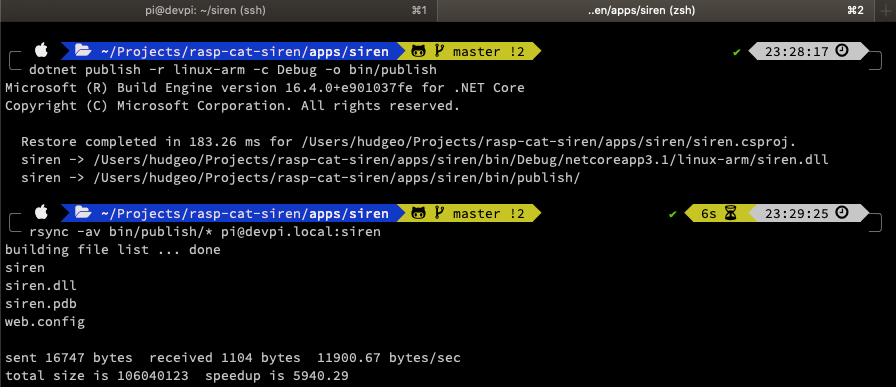

Once copied, the app can simply be started as normal on the Pi. No need to install or configure anything on the device first.

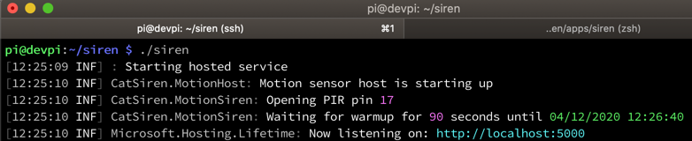

If there's no isolation concerns with a single .NET runtime version on the Pi, installing that on the Pi and dropping `-r linux-arm` to convert to a framework dependent publish saves copying .NET runtime files. Self-contained is usually the most flexible though, even at the cost of disk space and transfer time. .NET runtime dependencies can be more of a one-time hit with tools like `rsync`.

Another option for copying files is [SFTP](https://www.ssh.com/ssh/sftp/); the next option uses this internally.

## 2 - SSH Deploy Tool

Using [dotnet-sshdeploy](https://github.com/unosquare/sshdeploy) may be a bit more streamlined and efficient after initial setup. First it needs to be installed on a dev machine with `dotnet tool install -g dotnet-sshdeploy`. Next the main project file needs some additional properties with ssh deployment details:

\[xml\] <PropertyGroup> <SshDeployHost>192.168.4.87</SshDeployHost> <SshDeployTargetPath>/home/pi/siren</SshDeployTargetPath> <SshDeployUsername>pi</SshDeployUsername> <!--<SshDeployPassword>NOT-SECURE</SshDeployPassword>--> </PropertyGroup> \[/xml\]

The tool seems to want the IP address so I grabbed that first with `ping -c 1 devpi.local`.

The examples in the tool's docs show the pi ssh password in plain text which isn't secure in a source controlled project file. One option might be [generating an SSH key](https://www.raspberrypi.org/documentation/remote-access/ssh/passwordless.md). Another is an environment variable with the password and sending that to the tool when running.

I went with that option, editing the bash interactive startup script with `nano ~/.bashrc`...

\[bash\] export PI\_PWD="Secret-pa$$word" \[/bash\]

...followed by starting a new terminal window or `source .bashrc` to apply the change to the current session.

Within the same folder as the project file it's then easy to run `dotnet-sshdeploy push -w $PI_PWD` to do the deployment.

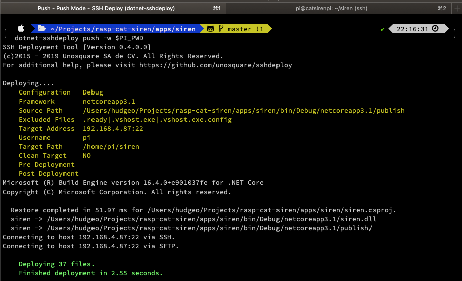

Internally the tool [appears to use SFTP](https://github.com/unosquare/sshdeploy/blob/master/Unosquare.Labs.SshDeploy/DeploymentManager.Push.cs) to transfer the files along with some SSH commands.

I'm not overly fond of putting any of that SSH target info in my source controlled project file though so if I went with this solution I might look at [Importing the properties from another file](https://docs.microsoft.com/en-us/visualstudio/msbuild/how-to-use-the-same-target-in-multiple-project-files?view=vs-2019) which is excluded from source control or outside the repo.

If desired this can be taken a step further, by automatically publishing on build. At this point just running `dotnet build` as normal will trigger the same deployment output after the build is done.

\[xml\] <Target Condition="$(BuildingInsideSshDeploy) ==''" Name="PostBuild" AfterTargets="PostBuildEvent"> <Exec Command="cd $(ProjectDir)" /> <Exec Command="dotnet-sshdeploy push -w $(PI\_PWD)" /> </Target> \[/xml\]

In my case, regardless of how I ran the tool it would hang; the files were deployed quickly but it seemed to be waiting for something afterwards. Ctrl+C after the files copy is fine for the interactive case but that shouldn't be necessary.

## 3 - Copy Files, Remote Debug over SSH

First the .NET Core debugger (`vsdbg`) needs to be installed on the Pi.

\[bash\] curl -sSL https://aka.ms/getvsdbgsh | bash /dev/stdin -r linux-arm -v latest -l ~/vsdbg \[/bash\]

Then the app can be published on the dev computer (in `Debug` configuration) and copied over to the Pi as with prior options.

\[bash\] dotnet publish -r linux-arm -c Debug -o bin/publish rsync -av bin/publish/\* pi@devpi.local:siren \[/bash\]

For VS Code to remotely launch and attach a debugger over SSH in an automated fashion, SSH public key authentication needs to be setup. In my case I created a new `devpi` SSH key with [ssh-keygen](https://man.openbsd.org/ssh-keygen.1) and then copied over its public key identity with [ssh-copy-id](https://www.ssh.com/ssh/copy-id).

\[bash\] ssh-keygen -f ~/.ssh/devpi ssh-copy-id pi@devpi.local \[/bash\]

If that worked, the next ssh to the host shouldn't prompt for the password. With the SSH key file setup and tested, a launch configuration can be added to [VS Code's launch.json](https://code.visualstudio.com/docs/editor/debugging#_launch-configurations):

\[javascript highlight="16,17"\] { "name": "Remote Launch & Debug", "type": "coreclr", "request": "launch", "program": "siren", "args": \[\], "cwd": "~/siren", "stopAtEntry": false, "console": "internalConsole", "pipeTransport": { "pipeCwd": "${workspaceRoot}", "pipeProgram": "/usr/bin/ssh", "pipeArgs": \[ "-T", "-i", "~/.ssh/devpi.pub", "pi@devpi.local" \], "debuggerPath": "~/vsdbg/vsdbg" } } \[/javascript\]

After starting the debugger with the new launch configuration, previously set breakpoints should be hit.

The following resources may be useful for reference for any issues with setting this up.

- [OmniSharp - Remote Debugging on Linux ARM](https://github.com/OmniSharp/omnisharp-vscode/wiki/Remote-Debugging-On-Linux-Arm)
- [VS Code Remote Debugging Tips and Tricks](https://code.visualstudio.com/docs/remote/troubleshooting)
- [Pi Passwordless SSH access](https://www.raspberrypi.org/documentation/remote-access/ssh/passwordless.md)

## 4 - VS Code Remote SSH Development

`Disclaimer` - using the Debugger with this option doesn't currently work; see the notes at the end of this section.

This option makes use of the [VS Code Remote Extension Pack](https://marketplace.visualstudio.com/items?itemName=ms-vscode-remote.vscode-remote-extensionpack), specifically [Remote - SSH](https://marketplace.visualstudio.com/items?itemName=ms-vscode-remote.remote-ssh). See also [Remote Development with VS Code](https://code.visualstudio.com/blogs/2019/05/02/remote-development).

Unlike with the previous remote debugging option, in this approach the source code and building happens remotely. Essentially the Pi becomes the dev machine and VS Code installs a headless server component on the Pi. That allows VS Code on the dev machine to work remotely against the Pi almost as if it were the same machine.

Since the Pi will be the dev machine and a source code folder will be opened when connecting, git will need to be installed and the repo cloned.

\[bash\] sudo apt-get -y install git git clone https://github.com/thnk2wn/rasp-cat-siren.git siren \[/bash\]

Since the .NET builds will be happening on the Pi, the .NET Core SDK needs to be installed. I chose the [dotnet-install script](https://docs.microsoft.com/en-us/dotnet/core/tools/dotnet-install-script) method. It supports a number of optional parameters. By default it'll install the LTS version which was 3.1.201 at the time I ran it.

\[bash\] wget https://dot.net/v1/dotnet-install.sh chmod u+x ./dotnet-install.sh ./dotnet-install.sh \[/bash\]

The `PATH` environment variable will need to be modified to point to the SDK. I found modifying `/etc/profile` to be messy so I created a new script under `/etc/profile.d`.

\[bash\] sudo nano /etc/profile.d/siren-env.sh export PATH=$PATH:$HOME/.dotnet \[/bash\]

On the next login a quick test of `dotnet --info` is handy to validate the install and path resolution.

With the Pi prepped and Remote SSH extension installed, connecting over SSH is straightforward. Future connections don't require the command and config file steps.

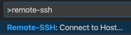

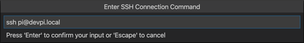

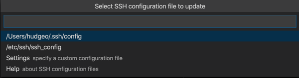

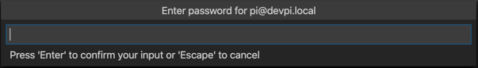

The first connection to the Pi takes a bit longer as the VS Code Server is installed but subsequent connections are quick.

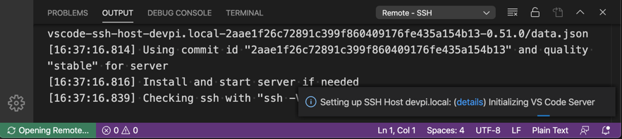

Opening a folder in VS Code now opens on the remote, where the cloned repository folder can be selected.

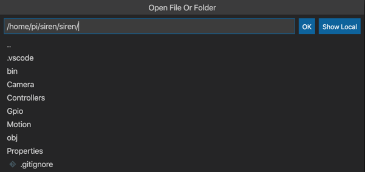

It feels odd initially but some extensions may need to be installed in the headless VS Code server instance. In my case, mainly the [C# extension](https://marketplace.visualstudio.com/items?itemName=ms-dotnettools.csharp).

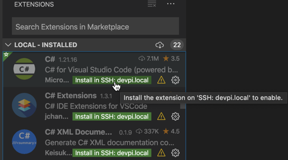

It was exciting seeing the project getting built successfully after hitting F5 to debug...

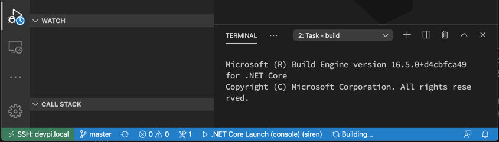

... but it was short-lived as it was followed by the error `[WARNING]: Processor architecture 'armv7l' is not currently supported by the .NET Core debugger. Debugging will not be available.`.

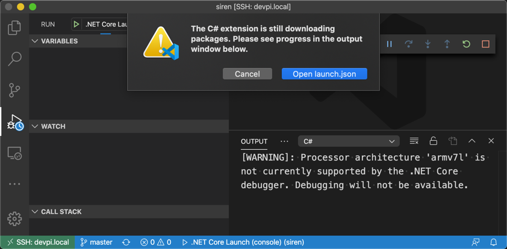

[This OmniSharp issue](https://github.com/OmniSharp/omnisharp-vscode/issues/2771) links to [this VS Code issue](https://github.com/microsoft/vscode/issues/6442); they give me the impression this will likely be supported but when remains to be seen. There's still some value in coding against the Pi remotely and otherwise interacting with it through VS Code's Remote SSH. Once the debugger is supported this could be a really nice hybrid Pi development option.

Trying a similar approach with the [Remote Containers](https://marketplace.visualstudio.com/items?itemName=ms-vscode-remote.remote-containers) extension gave a similar error.

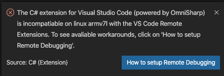

## 5 - Develop on the Pi

The previous option was essentially developing on the Pi but still relying on VS Code on a developer machine and shipping debugging state over the wire via SSH. This option takes things further by doing all the development entirely on the Pi, only needing a dev machine perhaps to remotely connect if headless (i.e. [VNC](https://www.raspberrypi.org/documentation/remote-access/vnc/)). The 4 GB Pi 4 hardware is solid enough that hooking up dual monitors to it and using it as a lightweight dev box is feasible.

Technically the code authoring could be done on the Pi with the pre-installed [Nano text editor](https://www.nano-editor.org/) though that'd be pretty raw and limited. If you've dedicated a few months to learn Vim, `sudo apt install vim` and perhaps [omnisharp-vim](https://github.com/OmniSharp/omnisharp-vim) may be ideal.

I used the new [Raspberry Pi Imager](https://www.raspberrypi.org/blog/raspberry-pi-imager-imaging-utility/) to flash the desktop version of Raspbian this time.

A community build of VS Code that can run on the Pi is available at [code.headmelted.com](http://code.headmelted.com/). It installed quickly and easily with a single command. Afterwards I installed the .NET Core SDK as before. Be careful if you installed VS Code as root (i.e. `sudo -s`) that the .NET SDK isn't installed as root or you may have ownership issues later.

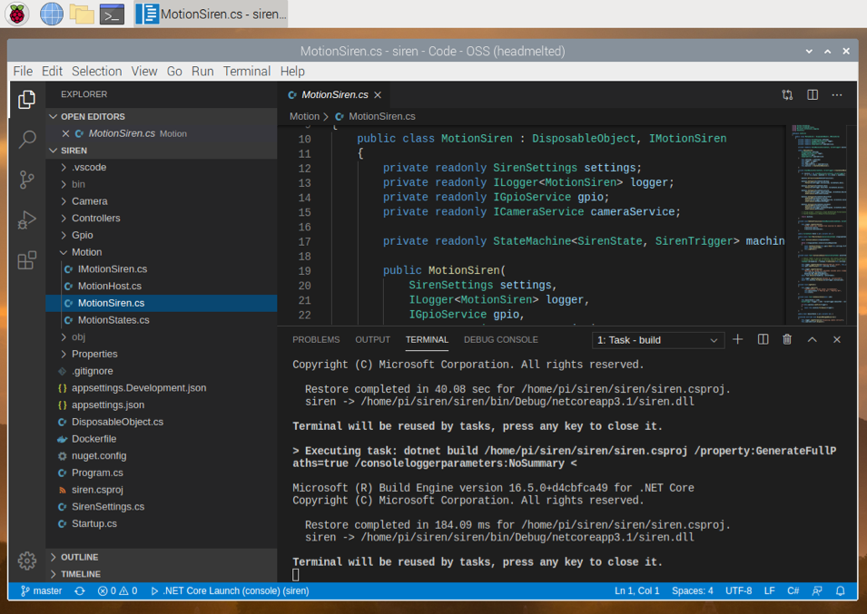

Editing, intellisense, extensions, building and more were fast and fluid. The Pi eventually got a little warm but a [heatsink case](https://shop.pimoroni.com/products/aluminium-heatsink-case-for-raspberry-pi-4?variant=29430673211475) I had helped with that. Perhaps not surprisingly however, the same [C# Debugger issue](https://github.com/OmniSharp/omnisharp-vscode/issues/2771) exists here just as it does with the Remote SSH option.

## 6 - Build, Push, and Pull via Docker

I'll only touch on Docker here as the next post in this series goes into more details. Using Docker provides all the usual containerization benefits - performance, isolation, portability, dev workflow etc. and Docker runs fine on the Pi.

On the downside, the build process is a bit more involved and building an ARM image on a non-ARM device can be a hassle at times and may require some [QEMU virtualization voodoo](https://www.balena.io/blog/building-arm-containers-on-any-x86-machine-even-dockerhub/) depending on the steps in the `Dockerfile` and the host running `docker build`.

Another issue can be hardware or other system dependencies such as camera libraries. Usage of these in docs and examples typically don't expect running in a container so it's on you to figure out their dependencies and account for in the `Dockerfile`; that can take some serious digging at times. For example, it wasn't obvious to me that I'd need to include `/opt/vc/lib` in the `LD_LIBRARY_PATH` environment variable and add a bind mount when running the container with `--mount type=bind,source=/opt/vc/lib,target=/opt/vc/lib,readonly`. Likewise for modifying `PATH` to include `/opt/vc/bin`. Finally the container will need to run with elevated permissions using `--privileged` for hardware access.

I created a [Dockerfile](https://github.com/thnk2wn/rasp-cat-siren/blob/master/siren/Dockerfile) and a [Github action](https://github.com/thnk2wn/rasp-cat-siren/blob/master/.github/workflows/push-siren.yml) to handle the image build and push to a container registry and a [pull helper script](https://github.com/thnk2wn/rasp-cat-siren/blob/master/pi-setup/pull.sh) to run on the Pi to create the container from the image and start it.

Debugging with Docker can also a bit more involved. First I created [Dockerfile.debug](https://github.com/thnk2wn/rasp-cat-siren/blob/master/siren/Dockerfile.debug) that installs `vsdbg` in the container, similar to what was done in Option 3. That required running some QEMU prep commands that I did in a [qemu.sh](https://github.com/thnk2wn/rasp-cat-siren/blob/master/siren/qemu.sh) script as a part of the GitHub action running on Ubuntu.

For container debugging to be of real value here it needs to be done remotely on the Pi. I wasn't able to get that to work, at least with VS Code on my Mac. With the Pi SSH key access still setup, I initially started with `"docker.host": "ssh://pi@devpi.local"` in VS Code's `settings.json` and launched `> Remote-Containers: Attach to Running Container...` with the project open in Code.

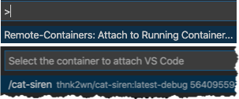

While the attach worked, my local source wasn't available - I'd only see the files in the remote container so I couldn't set breakpoints and debug. Next I tried adding a `launch.json` task similar to the below.

\[javascript\] { "name": "Remote Docker Attach", "type": "coreclr", "request": "attach", "processId": "${command:pickRemoteProcess}", "pipeTransport": { "pipeProgram": "docker", "pipeArgs": \[ "exec", "-i", "cat-siren" \], "debuggerPath": "/root/vsdbg/vsdbg", "pipeCwd": "${workspaceRoot}", "pipeEnv": {}, "quoteArgs": false }, "logging": { "engineLogging": true, "programOutput": true, "exceptions": true }, "sourceFileMap": { "/home/runner/work/rasp-cat-siren/rasp-cat-siren": "${workspaceRoot}" } } \[/javascript\]

Despite the remote `docker.host` setting, it was clear from the error that it looking for the container to be running locally on my dev machine. [This thread](https://github.com/microsoft/vscode-remote-release/issues/171#issuecomment-489968410) had some configuration that looked like it might work but I didn't go to far down the rabbit hole.

I did spend some time browsing [Advanced Container Configuration](https://code.visualstudio.com/docs/remote/containers-advanced) and experimenting with `devcontainer.json` but the [Remote Containers](https://marketplace.visualstudio.com/items?itemName=ms-vscode-remote.remote-containers) extension seemed more geared towards the source being on the remote machine as a dev target. I wasn't able to get my dev machine source linked correctly, despite trying the volume approach.

At this point the hassle had me try Visual Studio on Windows. I opened the solution and invoked `Debug --> Attach to Process...`, added the Pi SSH connection, and selected the running container.

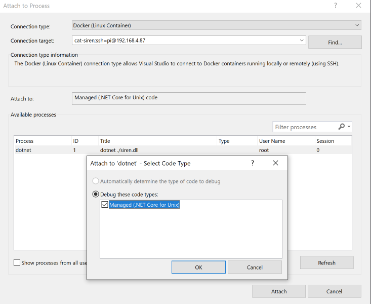

Just like that it worked the first time in a matter of seconds. VS Code lost this round.

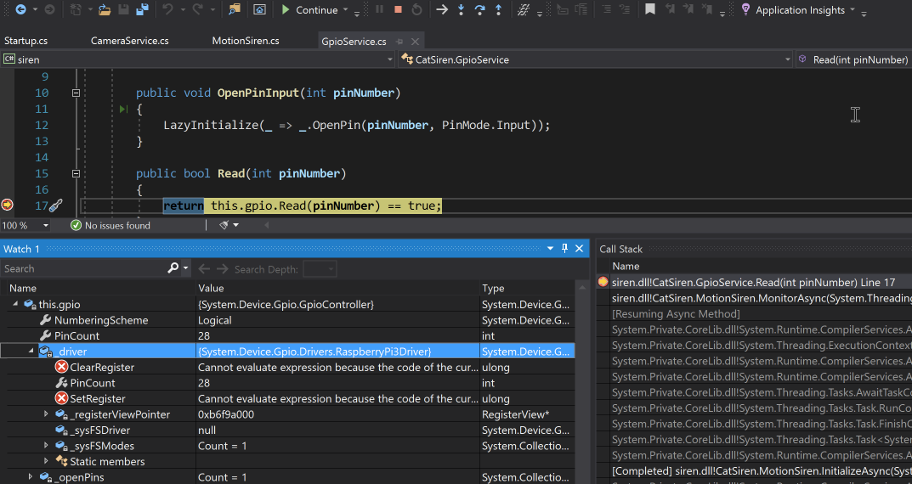

## Up Next

[Deploying .NET Apps to Raspberry Pi with GitHub Actions and Docker](https://wp.me/p8RapM-MX) - the next post in [this series](https://wp.me/p8RapM-Is) dives into building .NET Docker images for the Pi with GitHub actions when commits are pushed to the repository.
